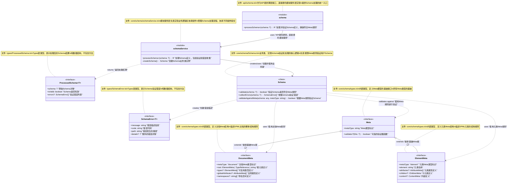
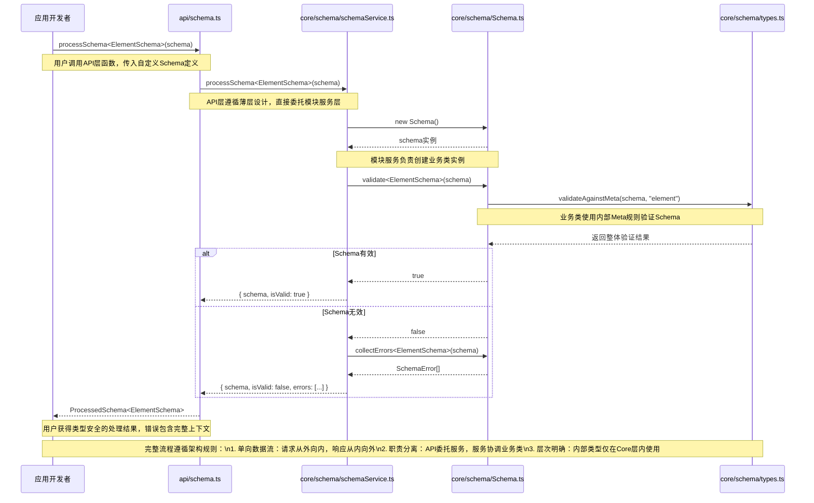

# Schema 模块开发设计
## UML

```mermaid
classDiagram
    %% API层
    class schema {
        <<module>>
        +processSchema<T extends object, R extends ProcessedSchema<T>>(schema: T): R "处理并验证Schema定义，确保符合Meta规则"
    }
    note for schema "文件: api/schema.ts\n作为API层的薄层接口，直接委托模块服务层实现\n提供Schema处理的统一入口"
    
    %% Types层
    class ProcessedSchema~T~ {
        <<interface>>
        +schema: T "原始Schema对象"
        +isValid: boolean "Schema是否有效"
        +errors?: SchemaError[] "验证错误列表"
    }
    note for ProcessedSchema "文件: types/ProcessedSchema.ts\nTypes层类型，表示处理后的Schema结果\n纯数据结构，不包含方法"
    
    class SchemaError~T~ {
        <<interface>>
        +message: string "错误描述信息"
        +code: string "错误代码"
        +path: string "错误发生的路径"
        +details?: T "额外的错误详情"
    }
    note for SchemaError "文件: types/SchemaError.ts\nTypes层类型，表示Schema验证错误\n纯数据结构，不包含方法"
    
    %% Core层 - 模块服务层
    class schemaService {
        <<module>>
        +processSchema<T extends object, R extends ProcessedSchema<T>>(schema: T): R "处理Schema定义，包括验证和错误收集"
        -createSchema(): Schema "创建Schema业务类实例"
    }
    note for schemaService "文件: core/schema/schemaService.ts\n模块服务层负责实现业务逻辑和协调组件\n管理Schema处理流程，协调不同组件配合"
    
    %% Core层 - 业务类
    class Schema {
        <<class>>
        +validate<T extends object>(schema: T): boolean "验证Schema是否符合Meta规则"
        +collectErrors<T extends object>(schema: T): SchemaError[] "收集Schema验证错误"
        -validateAgainstMeta(schema: any, metaType: string): boolean "根据Meta规则验证Schema"
    }
    note for Schema "文件: core/schema/Schema.ts\n业务类，实现Schema验证和处理的核心逻辑\n负责按照Meta规则验证用户Schema"
    
    %% Core层 - 内部类型
    class Meta {
        <<interface>>
        +metaType: string "Meta类型标识"
        +validator?<T extends Meta>(this: T): boolean "可选的验证器函数"
    }
    note for Meta "文件: core/schema/types.ts\n内部类型，定义Meta模型的基础接口\n所有Meta类型的基础"
    
    class DocumentMeta {
        <<interface>>
        +metaType: "document" "文档Meta类型标识"
        +root: ElementMeta | TypeReference | string "根元素定义"
        +types?: ElementMeta[] "可复用类型定义"
        +globalAttributes?: AttributeMeta[] "全局属性定义"
        +namespaces?: string[] "命名空间定义"
    }
    note for DocumentMeta "文件: core/schema/types.ts\n内部类型，定义文档Meta结构\n描述DPML文档的整体结构规则"
    
    class ElementMeta {
        <<interface>>
        +metaType: "element" "元素Meta类型标识"
        +element: string "元素名称"
        +attributes?: AttributeMeta[] "元素属性定义"
        +children?: ChildrenMeta "子元素定义"
        +content?: ContentMeta "内容定义"
    }
    note for ElementMeta "文件: core/schema/types.ts\n内部类型，定义元素Meta结构\n描述DPML元素的结构规则"
    
    %% 继承关系
    Meta <|-- DocumentMeta : extends "继承基础Meta接口"
    Meta <|-- ElementMeta : extends "继承基础Meta接口"
    
    %% 组件依赖关系
    schema --> schemaService : uses "API委托原则，直接委托模块服务"
    schemaService --> Schema : creates/uses "创建并使用业务类"
    Schema ..> Meta : validates against "使用Meta规则进行验证"
    Schema ..> DocumentMeta : uses "使用文档Meta规则"
    Schema ..> ElementMeta : uses "使用元素Meta规则"
    
    %% 返回关系
    schemaService ..> ProcessedSchema : returns "返回处理结果"
    Schema ..> SchemaError : creates "创建错误描述"
```

## Sequence

```mermaid
sequenceDiagram
    participant User as 应用开发者
    participant API as api/schema.ts
    participant Service as core/schema/schemaService.ts
    participant SchemaClass as core/schema/Schema.ts
    participant Meta as core/schema/types.ts
    
    User->>API: processSchema<ElementSchema>(schema)
    note over User,API: 用户调用API层函数，传入自定义Schema定义
    
    API->>Service: processSchema<ElementSchema>(schema)
    note over API,Service: API层遵循薄层设计，直接委托模块服务层
    
    Service->>SchemaClass: new Schema()
    SchemaClass-->>Service: schema实例
    note over Service,SchemaClass: 模块服务负责创建业务类实例
    
    Service->>SchemaClass: validate<ElementSchema>(schema)
    
    SchemaClass->>Meta: validateAgainstMeta(schema, "element")
    note over SchemaClass,Meta: 业务类使用内部Meta规则验证Schema
    
    Meta-->>SchemaClass: 返回整体验证结果
    
    alt Schema有效
        SchemaClass-->>Service: true
        Service-->>API: { schema, isValid: true }
    else Schema无效
        SchemaClass-->>Service: false
        Service->>SchemaClass: collectErrors<ElementSchema>(schema)
        SchemaClass-->>Service: SchemaError[]
        Service-->>API: { schema, isValid: false, errors: [...] }
    end
    
    API-->>User: ProcessedSchema<ElementSchema>
    note over User,API: 用户获得类型安全的处理结果，错误包含完整上下文
    
    note over User,Meta: 完整流程遵循架构规则：\n1. 单向数据流：请求从外向内，响应从内向外\n2. 职责分离：API委托服务，服务协调业务类\n3. 层次明确：内部类型仅在Core层内使用

```