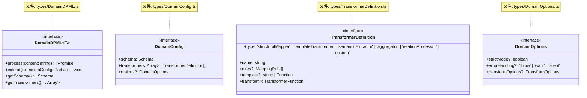
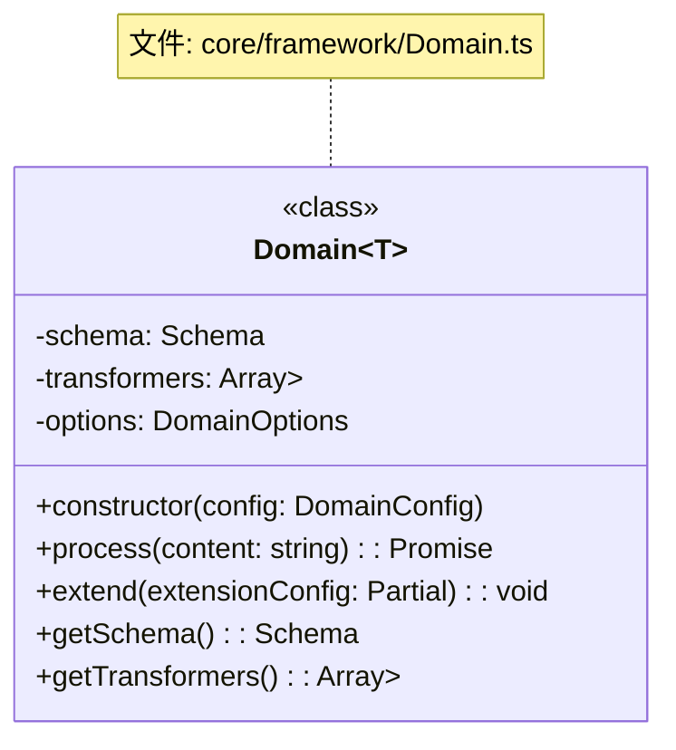
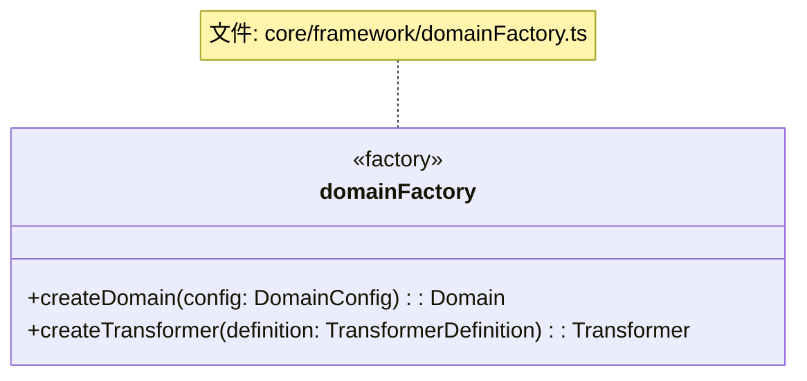
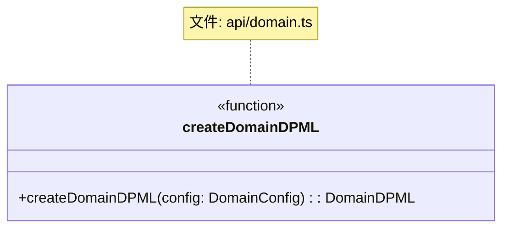
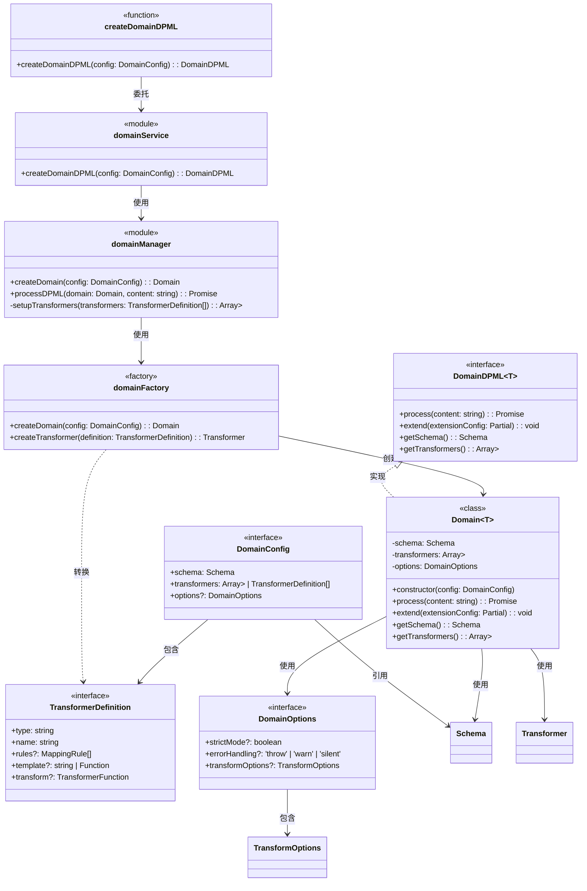

# DPML Framework模块设计文档

## 1. 概述

Framework模块是DPML核心的扩展模块，它通过集中式配置方式简化了DPML的使用流程，使开发者能够更容易地为特定领域定制和使用DPML。该模块整合了Schema定义、转换器配置和处理选项，提供了一站式的领域特定DPML应用创建机制。

### 1.1 设计目标

- **简化使用**：提供简洁的API，降低DPML使用门槛
- **集中配置**：支持通过单一配置对象定义完整的DPML应用
- **领域定制**：便于为特定领域快速创建定制的处理流程
- **类型安全**：利用TypeScript泛型提供端到端的类型安全
- **与核心模块集成**：无缝整合Schema、处理和转换功能
- **可扩展性**：支持动态扩展配置和自定义处理逻辑

## 2. 核心设计理念

Framework模块的设计基于以下核心理念：

1. **集中式配置**：
   - 通过单一配置对象定义完整DPML应用
   - 所有组件在一处配置，一目了然
   - 简化API调用，减少学习曲线

2. **声明式定义**：
   - 采用声明式风格定义Schema和转换器
   - 专注于"做什么"而非"怎么做"
   - 配置对象结构直观反映应用架构

3. **零样板代码**：
   - 减少重复的初始化和连接代码
   - 框架自动处理组件间的协调
   - 用户只需关注领域特定的配置

4. **类型安全优先**：
   - 全程利用TypeScript泛型保证类型安全
   - 提供端到端的类型检查和智能提示
   - 在编译时捕获类型错误

5. **直接复用核心类型**：
   - 直接使用核心模块的现有类型
   - 避免创建额外的抽象层
   - 减少类型转换的复杂性

6. **即时可用**：
   - 配置完成后立即可用
   - 单一函数调用创建完整应用
   - 统一的处理流程入口

## 3. 系统架构

Framework模块遵循DPML的整体架构规则，在core包内作为一个领域模块存在，目录结构如下：

```
packages/
  core/
    src/
      api/
        domain.ts              # API层：createDomainDPML函数
      
      types/
        DomainDPML.ts          # 对外类型：DomainDPML接口
        DomainConfig.ts        # 对外类型：应用配置接口
        TransformerDefinition.ts # 对外类型：转换器定义接口
        DomainOptions.ts       # 对外类型：选项接口
      
      core/
        framework/             # Framework领域目录
          domainService.ts     # Service层
          domainManager.ts     # Manager层
          Domain.ts            # 主要业务类
          domainFactory.ts     # 工厂模块
          types.ts             # 内部类型定义
```

该架构确保Framework模块与核心模块保持一致的分层设计，同时专注于提供集中配置的能力。

## 4. 组件设计

### 4.1 数据类型设计



#### 关键类型说明

- **DomainDPML<T>**：领域特定DPML应用的接口，泛型参数T表示处理结果的类型
- **DomainConfig**：创建领域应用的配置对象，包含Schema、转换器和选项
- **TransformerDefinition**：简化的转换器定义，用于方便创建各类转换器
- **DomainOptions**：领域应用的选项设置，控制处理行为

### 4.2 业务类设计



Domain类实现了DomainDPML接口，是Framework模块的核心业务类，负责：
- 封装处理流程
- 管理Schema和转换器
- 提供配置扩展能力
- 处理DPML内容并返回类型安全的结果

### 4.3 工厂模块设计



domainFactory负责：
- 创建Domain实例
- 将TransformerDefinition转换为Transformer实例
- 处理配置验证和默认值

### 4.4 API设计



`createDomainDPML`是Framework模块的主要API入口，它：
- 接收DomainConfig配置对象
- 返回实现DomainDPML<T>接口的对象
- 支持泛型参数T来指定处理结果的类型

## 5. 组件关系图

以下是Framework模块的详细组件关系图:



## 6. 执行流程

Framework模块的典型执行流程如下:

1. **初始化**:
   - 用户调用`createDomainDPML<T>`函数，传入配置对象
   - API层将请求委托给Service层
   - Service层调用Manager层创建领域应用

2. **配置处理**:
   - Manager层验证配置有效性
   - 通过工厂创建Domain实例
   - 设置Schema和转换器

3. **内容处理**:
   - 用户调用领域应用的`process`方法处理DPML内容
   - Domain实例协调解析、处理和转换流程
   - 按顺序执行：解析 → 验证 → 处理 → 转换

4. **结果返回**:
   - 转换完成后，生成类型为T的结果对象
   - 返回处理结果，类型安全且符合预期

### 6.1 配置处理流程

```
配置对象 → 验证配置 → 设置Schema → 创建转换器 → 创建Domain实例
```

### 6.2 DPML处理流程

```
DPML内容 → 解析文档 → 验证Schema → 处理文档 → 执行转换器 → 返回类型T的结果
```

## 7. 使用示例

### 7.1 基本使用

```typescript
import { createDomainDPML } from '@dpml/core';

// 定义结果类型
interface LLMConfig {
  systemPrompt: string;
  userPrompt: string;
  parameters: {
    temperature: number;
    maxTokens: number;
  };
}

// 创建LLM领域的DPML处理器
const llmDomain = createDomainDPML<LLMConfig>({
  // Schema定义
  schema: {
    tags: {
      prompt: {
        attributes: ['role', 'temperature'],
        validChildren: ['content']
      },
      content: {
        attributes: ['format']
      }
    }
  },
  
  // 转换器定义
  transformers: [
    {
      type: 'structuralMapper',
      name: 'llmConfigMapper',
      rules: [
        { selector: 'prompt[role="system"] > content', targetPath: 'systemPrompt' },
        { selector: 'prompt[role="user"] > content', targetPath: 'userPrompt' },
        { selector: 'prompt[temperature]', targetPath: 'parameters.temperature',
          transform: value => parseFloat(value) }
      ]
    }
  ],
  
  // 选项设置
  options: {
    strictMode: true,
    transformOptions: {
      resultMode: 'merged'
    }
  }
});

// 处理DPML内容
const result = await llmDomain.process(`
  <prompt role="system" temperature="0.7">
    <content>你是一个AI助手</content>
  </prompt>
  <prompt role="user">
    <content>请介绍一下自然语言处理技术</content>
  </prompt>
`);

// 类型安全的结果访问
console.log(result.systemPrompt);  // "你是一个AI助手"
console.log(result.userPrompt);    // "请介绍一下自然语言处理技术"
console.log(result.parameters.temperature);  // 0.7
```

### 7.2 高级使用

```typescript
import { createDomainDPML } from '@dpml/core';

// 更复杂的领域应用配置
const formDomain = createDomainDPML<FormData>({
  schema: {
    // Schema配置...
  },
  
  // 使用多个转换器
  transformers: [
    // 结构映射
    {
      type: 'structuralMapper',
      name: 'formFieldsMapper',
      rules: [/* 字段映射规则 */]
    },
    
    // 语义提取
    {
      type: 'semanticExtractor',
      name: 'validationRulesExtractor',
      // 提取表单验证规则
    },
    
    // 自定义转换器
    {
      type: 'custom',
      name: 'formProcessor',
      transform: (input, context) => {
        // 自定义处理逻辑
        return processedFormData;
      }
    }
  ],
  
  options: {
    // 选项配置...
  }
});

// 动态扩展配置
formDomain.extend({
  transformers: [
    {
      type: 'templateTransformer',
      name: 'htmlGenerator',
      template: data => generateHTML(data)
    }
  ]
});

// 处理表单DPML
const formData = await formDomain.process(formDpmlContent);
```

## 8. 扩展点

Framework模块提供以下扩展点:

1. **动态配置扩展**:
   - 通过`extend`方法添加或修改配置
   - 运行时调整处理行为
   ```typescript
   domain.extend({
     transformers: [/* 新增转换器 */]
   });
   ```

2. **自定义转换器**:
   - 通过`custom`类型定义自定义转换逻辑
   ```typescript
   transformers: [
     {
       type: 'custom',
       name: 'customTransformer',
       transform: (input, context) => {
         // 自定义转换逻辑
         return transformedData;
       }
     }
   ]
   ```

3. **转换器组合**:
   - 组合多个转换器构建复杂处理流程
   ```typescript
   transformers: [
     { type: 'structuralMapper', /* ... */ },
     { type: 'semanticExtractor', /* ... */ },
     { type: 'templateTransformer', /* ... */ }
   ]
   ```

4. **处理选项定制**:
   - 通过选项配置控制处理行为
   ```typescript
   options: {
     strictMode: true,
     errorHandling: 'throw',
     transformOptions: {
       resultMode: 'full',
       include: ['transformer1', 'transformer2']
     }
   }
   ```

## 9. 未来扩展方向

1. **插件系统**:
   - 支持通过插件扩展框架功能
   - 提供插件生命周期管理
   - 允许注册自定义组件类型

2. **配置文件支持**:
   - 支持从外部文件加载配置
   - 提供配置验证和错误提示
   ```typescript
   const domain = createDomainDPML.fromConfig('./dpml.config.json');
   ```

3. **热重载**:
   - 支持配置热重载能力
   - 动态更新Schema和转换器
   ```typescript
   domain.reload(newConfig);
   ```

4. **钩子系统**:
   - 提供处理生命周期钩子
   - 支持自定义前处理和后处理逻辑
   ```typescript
   {
     hooks: {
       beforeParse: (content) => { /* ... */ },
       afterTransform: (result) => { /* ... */ }
     }
   }
   ```

5. **多语言支持**:
   - 为不同语言提供文件生成器
   - 生成兼容的Schema和处理程序
   ```typescript
   domain.generateClient({ language: 'python' });
   ```

## 10. 总结

DPML Framework模块通过集中式配置方式简化了DPML的使用流程，使开发者能够更容易地为特定领域定制和使用DPML。它的核心价值在于：

- **简化使用体验**：通过声明式配置和一站式API简化开发流程
- **提升开发效率**：减少样板代码，专注于领域特定配置
- **类型安全保障**：利用TypeScript泛型确保端到端类型安全
- **灵活可扩展**：支持动态扩展配置和自定义处理逻辑
- **与核心无缝集成**：直接利用核心模块的类型和功能

Framework模块作为DPML的上层抽象，为用户提供了一种更简单、更直观的方式来定义和使用领域特定语言，同时保持了底层的灵活性和可扩展性。它遵循"配置优于代码"的理念，使DPML能够更好地服务于各种领域应用场景。

```
解析文档 → 验证Schema → 处理文档 → 执行转换器 → 领域特定结果<T>
                ↑                                   ↑
                └───────────── Domain<T> ──────────┘
                        (集中式配置和处理)
``` 