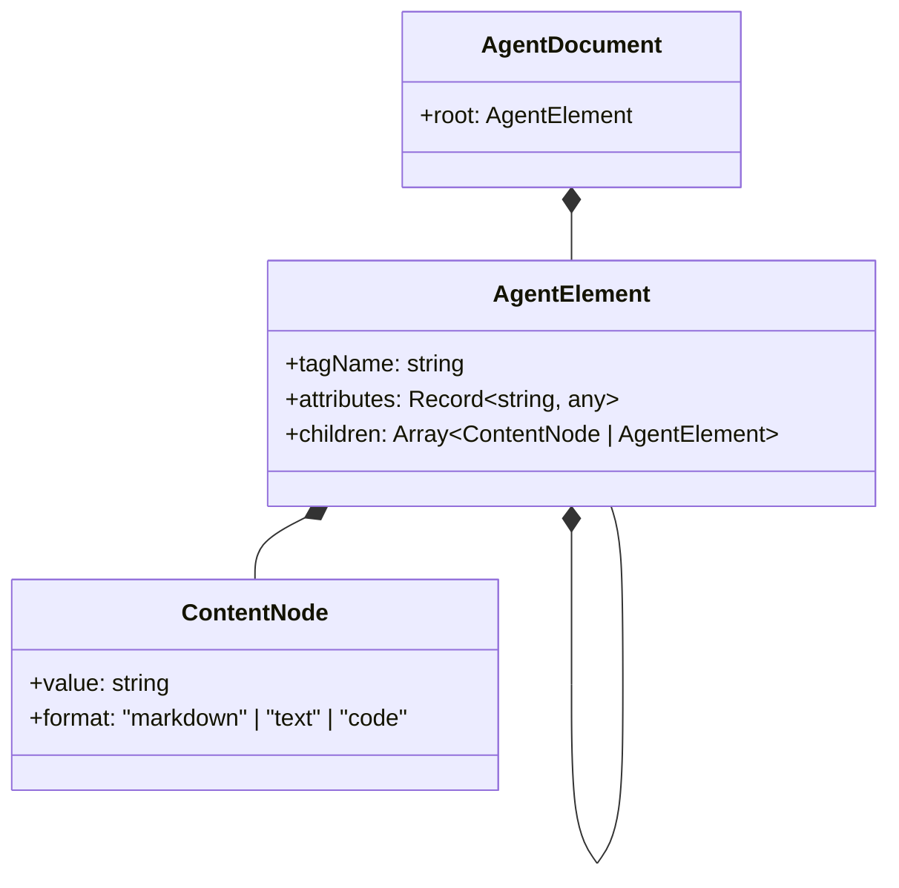
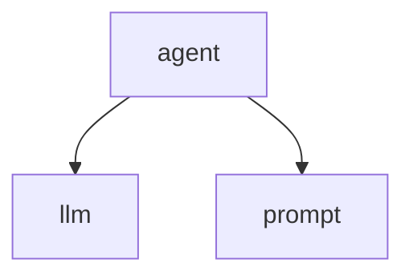
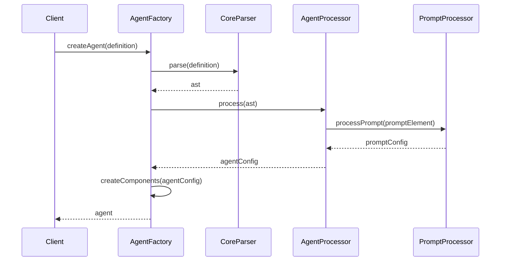

# @dpml/agent 设计文档

## 1. 设计目标与原则

### 1.1 核心目标

`@dpml/agent`作为DPML生态系统的核心包，旨在提供:

1. **声明式代理定义**：使用XML标记语言定义AI代理的行为
2. **统一LLM交互**：抽象大语言模型交互接口，支持多种模型和提供商
3. **完整的生命周期管理**：定义、初始化、运行、终止代理的基本流程
4. **基础上下文管理**：通过抽象记忆接口管理对话上下文和会话状态

### 1.2 设计原则

1. **领域边界清晰**：专注于代理定义和运行时环境，与其他领域保持明确边界
2. **声明式定义**：采用DPML标记语言进行代理定义，实现配置与实现分离
3. **状态与行为分离**：采用清晰的状态管理模式，实现状态和行为逻辑解耦
4. **LLM交互抽象**：提供统一的LLM交互接口，支持多种模型和提供商
5. **记忆与上下文抽象**：将记忆管理抽象为独立接口，实现灵活的上下文管理
6. **可观察性设计**：全面的事件系统和日志机制，便于监控和调试
7. **错误处理策略**：健壮的错误处理机制，支持优雅降级和自恢复
8. **安全设计原则**：强调安全性，保护系统和用户
9. **开发友好性**：优先考虑开发者体验，降低使用门槛
10. **扩展性机制**：提供多种扩展点，支持自定义和第三方扩展
11. **标签与属性极简主义**：遵循"少即是多"的设计哲学，保持标签和属性的最小必要集
12. **统一基础设施原则**：优先使用@dpml/core提供的基础设施，确保跨包统一性
13. **渐进式复杂度设计**：每个组件既是一个默认实现，又是更复杂系统的入口点
14. **面向终端用户优先**：无论是API设计还是错误处理，都以终端用户的使用体验为优先考量

### 1.3 解决的问题

1. 开发基于LLM的智能代理缺乏标准化结构和框架
2. LLM应用开发涉及大量重复代码和配置
3. 不同代理实现之间难以复用组件和模式
4. 缺乏声明式方式描述代理能力和行为
5. 多模型支持和集成需要大量重复工作
6. 缺乏统一的上下文管理机制

## 2. 系统架构

### 2.1 整体架构

下图展示了@dpml/agent的核心组件及其关系：

```mermaid
classDiagram
    class AgentFactory {
        +createAgent(definition: string): Agent
    }
    class Agent {
        +run(input: RunInput): Promise<RunOutput>
        +runStream(input: RunInput): AsyncIterable<OutputChunk>
    }
    class LLMConnector {
        +complete(options: CompletionOptions): Promise<CompletionResult>
        +completeStream(options: CompletionOptions): AsyncIterable<CompletionChunk>
    }
    class MemorySystem {
        +add(item: MemoryItem): Promise<void>
        +getConversationMemory(sessionId: string): Promise<MemoryItem[]>
        +clear(sessionId: string): Promise<void>
    }
    
    AgentFactory --> Agent: creates
    Agent --> LLMConnector: uses
    Agent --> MemorySystem: uses
    Agent ..> "DPML Prompt" : uses
    Agent ..> "DPML Core" : uses
```

### 2.2 模块职责

#### 2.2.1 核心模块职责

- **AgentFactory**: 
  - 创建Agent实例
  - 解析代理定义
  - 配置代理组件

- **Agent**: 
  - 管理代理生命周期
  - 处理输入和生成输出
  - 协调LLM和记忆子系统
  - 管理状态和事件

- **LLMConnector**: 
  - 抽象LLM交互接口
  - 管理模型配置和认证
  - 处理请求和响应

- **MemorySystem**: 
  - 管理对话上下文和会话状态
  - 提供记忆存储和检索接口
  - 支持基本的上下文窗口管理

#### 2.2.2 职责边界

| 职责 | Core包 | Prompt包 | Agent包 | 应用层 |
|------|-------|---------|--------|--------|
| XML解析 | ✅ | ❌ | ❌ | ❌ |
| 提示词处理 | ❌ | ✅ | ❌ | ❌ |
| 代理定义和运行时 | ❌ | ❌ | ✅ | ❌ |
| 上下文管理 | ❌ | ❌ | ✅ | ❌ |
| 应用特定逻辑 | ❌ | ❌ | ❌ | ✅ |

## 3. 核心概念

### 3.1 代理文档模型

代理文档由一系列结构化标签组成，每个标签代表代理的一个功能组件。顶层结构如下：



### 3.2 核心标签体系

Agent包定义了以下核心标签，构成了完整的代理框架：

1. **`<agent>`** - 根标签，包含整个代理的定义 (详见[agent-tag-design.md](./agent-tag-design.md))
2. **`<llm>`** - 配置语言模型连接和参数 (详见[llm-tag-design.md](./llm-tag-design.md))
3. **`<prompt>`** - 定义系统提示词，委托给@dpml/prompt处理 (详见[prompt-tag-design.md](./prompt-tag-design.md))

每个标签都有特定的属性、嵌套规则和验证逻辑，详细的标签规范请参考各自的设计文档。

### 3.3 标签嵌套规则

标签嵌套遵循以下规则：
- `<agent>` 是根标签，必须是文档的顶层元素
- `<llm>` 和 `<prompt>` 是 `<agent>` 的必需直接子元素

嵌套规则图：


### 3.4 运行时状态模型

Agent运行时维护一个明确的状态模型，用于跟踪代理的执行状态：

```typescript
interface AgentState {
  // 基础状态
  id: string;
  status: 'idle' | 'thinking' | 'executing' | 'done';
  
  // 上下文状态
  conversation: Message[];
  metadata: Record<string, any>;
}
```

状态转换通过事件驱动的方式管理，确保状态一致性。

### 3.5 记忆系统抽象

虽然当前版本不使用专门的标签定义记忆配置，但系统通过抽象接口实现基础的上下文管理：

```typescript
// 记忆项接口
interface MemoryItem {
  id: string;
  content: string;
  role: 'user' | 'assistant' | 'system';
  timestamp: number;
  metadata?: Record<string, any>;
}

// 记忆系统接口
interface MemorySystem {
  // 添加新记忆项
  add(item: MemoryItem): Promise<void>;
  
  // 获取会话记忆（用于构建上下文）
  getConversationMemory(sessionId: string, limit?: number): Promise<MemoryItem[]>;
  
  // 清除指定会话的记忆
  clear(sessionId: string): Promise<void>;
}
```

这种抽象设计使得上下文管理与模型调用分离，提高系统模块化程度，同时为未来高级记忆功能留下扩展空间。

## 4. 标签定义概述

每个核心标签都在独立文档中有详细规范，以下仅提供概述：

### 4.1 `<agent>` 标签

作为根标签，定义整个代理的基本属性和元数据。

#### 主要属性：
- **id**: 唯一标识符
- **version**: 代理版本号
- **extends**: 继承另一个代理定义

详细规范请参考 [agent-tag-design.md](./agent-tag-design.md)。

### 4.2 `<llm>` 标签

定义大语言模型的连接方式和参数配置。

#### 主要属性：
- **api-type**: API规范/协议类型
- **api-url**: API端点URL
- **model**: 模型标识符
- **key-env**: 存储API密钥的环境变量名

详细规范请参考 [llm-tag-design.md](./llm-tag-design.md)。

### 4.3 `<prompt>` 标签

定义代理的系统提示词，委托给@dpml/prompt包处理。

#### 主要属性：
- **extends**: 继承其他提示词定义

详细规范请参考 [prompt-tag-design.md](./prompt-tag-design.md)。

## 5. 记忆管理

虽然当前版本不通过XML标签配置记忆系统，但Agent内置了基础的记忆管理功能，用于处理多轮对话的上下文。

### 5.1 记忆系统设计

记忆系统采用抽象接口设计，实现关注点分离：

```typescript
// 记忆系统接口
interface MemorySystem {
  add(item: MemoryItem): Promise<void>;
  getConversationMemory(sessionId: string, limit?: number): Promise<MemoryItem[]>;
  clear(sessionId: string): Promise<void>;
}
```

### 5.2 基础上下文记忆实现

默认提供简单的上下文记忆实现，基于内存存储：

```typescript
class SimpleContextMemory implements MemorySystem {
  private sessions: Map<string, MemoryItem[]> = new Map();
  
  async add(item: MemoryItem): Promise<void> {
    const sessionId = item.metadata?.sessionId || 'default';
    if (!this.sessions.has(sessionId)) {
      this.sessions.set(sessionId, []);
    }
    const sessionMemory = this.sessions.get(sessionId);
    sessionMemory.push(item);
  }
  
  async getConversationMemory(sessionId: string, limit = 10): Promise<MemoryItem[]> {
    const sessionMemory = this.sessions.get(sessionId) || [];
    // 如果超过限制，只返回最近的几条
    if (sessionMemory.length > limit) {
      return sessionMemory.slice(-limit);
    }
    return sessionMemory;
  }
  
  async clear(sessionId: string): Promise<void> {
    this.sessions.delete(sessionId);
  }
}
```

### 5.3 上下文窗口管理

记忆系统管理上下文窗口，确保发送给LLM的上下文不会超出限制：

1. 使用会话ID区分不同对话线程
2. 根据配置限制消息数量，采用"滑动窗口"策略
3. 提供会话清理和切换机制

### 5.4 上下文构建

基于记忆系统中的对话历史构建LLM上下文：

```typescript
// 构建LLM上下文
function buildLLMContext(memoryItems: MemoryItem[], systemPrompt: string): LLMContext {
  // 转换记忆项为消息格式
  const messages = memoryItems.map(item => ({
    role: item.role,
    content: item.content
  }));
  
  // 添加系统提示词作为第一条消息
  messages.unshift({
    role: 'system',
    content: systemPrompt
  });
  
  return { messages };
}
```

## 6. 继承机制

### 6.1 代理继承原理

代理定义支持通过`extends`属性继承其他代理的内容和属性：

```xml
<!-- 基础代理定义 -->
<agent id="base-assistant">
  <llm 
    api-type="openai" 
    model="gpt-4-turbo" 
    key-env="OPENAI_API_KEY"
  />
  
  <prompt>
    你是一个有帮助的助手。
  </prompt>
</agent>

<!-- 继承和扩展代理 -->
<agent id="specialized-assistant" extends="./base-assistant.dpml">
  <prompt>
    你是一个专注于科学问题的助手，擅长解释复杂概念。
  </prompt>
</agent>
```

### 6.2 继承规则

1. **属性继承**：子标签可以继承父标签的属性，子标签的同名属性会覆盖父标签
2. **子标签继承**：
   - 如果子代理定义了父代理没有的子标签，则添加该子标签
   - 如果子代理定义了父代理已有的子标签，则覆盖该子标签
   - 如果子代理未定义父代理已有的子标签，则继承父代理的子标签
3. **跨文件继承**：支持通过路径引用其他文件中的代理定义
4. **多级继承**：支持继承链，子代理可以继承父代理，父代理继承祖父代理

### 6.3 跨文件继承

支持从其他文件继承代理定义：

```xml
<!-- 从本地文件继承 -->
<agent id="research-assistant" extends="./templates/base-assistant.dpml">
  <!-- 覆盖或添加子标签 -->
</agent>

<!-- 从远程文件继承 -->
<agent id="customer-service" extends="https://example.com/templates/cs-agent.dpml">
  <!-- 覆盖或添加子标签 -->
</agent>
```

## 7. 转换器设计

### 7.1 AgentProcessor

AgentProcessor负责处理Agent定义，将XML结构转换为可执行的Agent配置：

```typescript
export class AgentProcessor {
  constructor(options?: AgentProcessorOptions) {
    // 初始化处理器
  }
  
  // 处理代理定义
  async process(definition: string): Promise<AgentConfig> {
    // 解析XML为AST
    const ast = await parseXML(definition);
    
    // 处理AST，解析引用和继承
    const processedDoc = await processDocument(ast);
    
    // 转换为Agent配置
    return this.transformToAgentConfig(processedDoc);
  }
  
  // 转换为Agent配置
  private transformToAgentConfig(doc: ProcessedDocument): AgentConfig {
    const agentElement = doc.root;
    
    // 提取代理基本信息
    const id = agentElement.getAttribute('id');
    const version = agentElement.getAttribute('version') || '1.0';
    
    // 处理LLM配置
    const llmElement = agentElement.getChild('llm');
    const llmConfig = this.processLLMConfig(llmElement);
    
    // 处理提示词
    const promptElement = agentElement.getChild('prompt');
    const promptConfig = this.processPromptConfig(promptElement);
    
    // 返回完整配置
    return {
      id,
      version,
      llm: llmConfig,
      prompt: promptConfig
    };
  }
  
  // 处理LLM配置
  private processLLMConfig(element: Element): LLMConfig {
    return {
      apiType: element.getAttribute('api-type') || 'openai',
      apiUrl: element.getAttribute('api-url'),
      model: element.getAttribute('model'),
      keyEnv: element.getAttribute('key-env')
    };
  }
  
  // 其他处理方法...
}
```

### 7.2 处理流程

整体处理流程遵循以下步骤：

1. 解析代理定义文件为XML AST
2. 处理AST，解析引用和继承
3. 转换处理后的文档为Agent配置对象
4. 使用配置对象创建Agent实例及其组件



## 8. 与Core包的关系

### 8.1 依赖关系

Agent包依赖Core包提供的基础设施：

1. 使用Core的Parser解析DPML文本
2. 使用Core的Processor处理AST和继承
3. 使用Core的错误处理机制
4. 遵循Core的扩展模式

### 8.2 标签处理器实现

Agent包为每个标签实现专用的处理器，处理特定语义逻辑：

```typescript
// 示例：llm标签处理器
class LLMTagProcessor implements TagProcessor {
  canProcess(element: Element): boolean {
    return element.tagName === 'llm';
  }
  
  async process(element: Element, context: ProcessingContext): Promise<Element> {
    // 初始化元数据
    element.metadata = element.metadata || {};
    element.metadata.llmInfo = {};
    
    // 验证必要属性
    if (!element.attributes.model) {
      context.reportError(new DPMLError(
        'MISSING_ATTRIBUTE',
        'LLM标签缺少必要的model属性',
        element.location
      ));
    }
    
    if (!element.attributes['api-url']) {
      context.reportError(new DPMLError(
        'MISSING_ATTRIBUTE',
        'LLM标签缺少必要的api-url属性',
        element.location
      ));
    }
    
    // 提取LLM信息
    element.metadata.llmInfo = {
      apiType: element.attributes['api-type'] || 'openai',
      apiUrl: element.attributes['api-url'],
      model: element.attributes.model,
      keyEnv: element.attributes['key-env']
    };
    
    return element;
  }
}
```

### 8.3 与Prompt包的集成

Agent包集成Prompt包处理提示词：

```typescript
class PromptTagProcessor implements TagProcessor {
  private promptProcessor: PromptProcessor;
  
  constructor() {
    this.promptProcessor = new PromptProcessor();
  }
  
  canProcess(element: Element): boolean {
    return element.tagName === 'prompt';
  }
  
  async process(element: Element, context: ProcessingContext): Promise<Element> {
    // 提取提示词内容
    const content = extractTextContent(element);
    
    // 如果内容是DPML格式，直接委托给Prompt包处理
    if (isDPMLFormat(content)) {
      try {
        // 委托Prompt包处理
        const processedPrompt = await this.promptProcessor.process(content);
        element.metadata = element.metadata || {};
        element.metadata.processedPrompt = processedPrompt;
      } catch (error) {
        context.reportError(error);
      }
    } else {
      // 简单文本内容，包装为最简单的DPML格式
      const wrappedContent = `<prompt>${content}</prompt>`;
      try {
        // 委托Prompt包处理
        const processedPrompt = await this.promptProcessor.process(wrappedContent);
        element.metadata = element.metadata || {};
        element.metadata.processedPrompt = processedPrompt;
      } catch (error) {
        context.reportError(error);
      }
    }
    
    return element;
  }
}
```

## 9. API设计

### 9.1 核心API

Agent包提供简洁的主要API：

```typescript
// 创建代理
function createAgent(
  definition: string | AgentConfig,
  options?: AgentOptions
): Promise<Agent>;

// 运行代理
interface Agent {
  // 同步运行，返回最终结果
  run(input: RunInput): Promise<RunOutput>;
  
  // 流式运行，返回可迭代的输出块
  runStream(input: RunInput): AsyncIterable<OutputChunk>;
  
  // 事件监听
  on(event: AgentEvent, handler: EventHandler): void;
  
  // 状态管理
  getState(): AgentState;
}
```

### 9.2 配置项

提供灵活的配置选项：

```typescript
interface AgentOptions {
  // LLM配置
  llm?: {
    apiType?: string;
    apiUrl?: string;
    model?: string;
    keyEnv?: string;
    // 其他LLM相关选项
  };
  
  // 记忆系统
  memory?: MemorySystem;
  
  // 日志和调试
  logger?: {
    level?: 'debug' | 'info' | 'warn' | 'error';
    targets?: string[];
  };
  
  // 运行选项
  runtime?: {
    maxTokens?: number;
    timeout?: number;
    retryStrategy?: RetryStrategy;
  };
}

// 运行输入
interface RunInput {
  // 用户输入
  input: string;
  
  // 会话标识符
  sessionId?: string;
  
  // 上下文信息
  context?: Record<string, any>;
  
  // 流式处理选项
  stream?: boolean;
}
```


## 10. 完整处理流程示例

以下是使用Agent包处理代理定义和运行代理的完整示例：

```typescript
import { createAgent } from '@dpml/agent';

async function main() {
  try {
    // 代理定义
    const definition = `
      <agent id="research-assistant" version="1.0">
        <llm 
          api-type="openai" 
          api-url="https://api.openai.com/v1"
          model="gpt-4-turbo" 
          key-env="OPENAI_API_KEY"
        />
        
        <prompt>
          你是一个研究助手，擅长查找信息和回答问题。
          请简洁明了地回答用户查询。
        </prompt>
      </agent>
    `;
    
    // 创建代理
    const agent = await createAgent(definition, {
      // 可选配置
      logger: {
        level: 'info',
        targets: ['console']
      },
      // 可选自定义记忆系统
      memory: new CustomMemorySystem()
    });
    
    // 监听事件
    agent.on('thinking:start', () => {
      console.log('代理正在思考...');
    });
    
    // 多轮对话示例
    const sessionId = "session-123";
    
    // 第一轮对话
    const result1 = await agent.run({
      input: '请简单介绍一下人工智能的历史',
      sessionId // 使用相同会话ID保持上下文
    });
    
    console.log('代理回复:', result1.output);
    
    // 第二轮对话 (引用上一轮对话)
    const result2 = await agent.run({
      input: '在你刚才提到的历史中，哪个时期最重要？',
      sessionId // 同一会话，代理能够记住前一轮对话内容
    });
    
    console.log('代理回复:', result2.output);
    
    // 流式运行示例
    console.log('流式运行示例:');
    
    for await (const chunk of agent.runStream({ 
      input: '什么是深度学习？',
      sessionId
    })) {
      if (chunk.type === 'thinking') {
        process.stdout.write('思考中...');
      } else if (chunk.type === 'output') {
        process.stdout.write(chunk.content);
      }
    }
    
  } catch (error) {
    console.error('运行代理时出错:', error);
  }
}

main();
```

### 10.1 处理继承的完整示例

```typescript
// 创建继承自基础模板的专业化代理
async function createSpecializedAgent() {
  try {
    // 模板路径
    const baseTemplatePath = './templates/base-agent.dpml';
    
    // 专业化代理定义
    const definition = `
      <agent id="science-advisor" extends="${baseTemplatePath}">
        <prompt>
          你是一位专业的科学顾问，擅长解释复杂的科学概念。
          始终基于科学事实提供清晰、准确的解释。
        </prompt>
      </agent>
    `;
    
    // base-agent.dpml内容:
    // <agent id="base-assistant">
    //   <llm api-type="openai" api-url="https://api.openai.com/v1" model="gpt-4-turbo" key-env="OPENAI_API_KEY" />
    //   <prompt>你是一个通用助手，能够回答问题并提供帮助。</prompt>
    // </agent>
    
    // 创建代理
    const agent = await createAgent(definition);
    
    // 运行代理
    const result = await agent.run({
      input: '请解释量子纠缠的概念'
    });
    
    console.log('科学顾问回复:', result.output);
  } catch (error) {
    console.error('创建专业化代理时出错:', error);
  }
}

createSpecializedAgent();
```

## 11. 技术选择

### 11.1 关键技术决策

- **TypeScript**: 使用TypeScript强类型系统保障代码质量和开发体验
- **事件驱动架构**: 采用事件驱动设计，提高系统的可观察性和扩展性
- **组合优于继承**: 使用组合模式构建系统组件，而不是复杂的继承层次
- **接口优先设计**: 定义清晰的接口契约，实现可替换的组件
- **可测试性设计**: 依赖注入和模块化结构，便于单元测试和模拟

### 11.2 依赖管理

Agent包仅依赖必要的外部库：

- **@dpml/core**: 核心功能和基础设施
- **@dpml/prompt**: 提示词处理

对于LLM API调用，提供适配器，但不直接依赖特定SDK：

```typescript
// 适配器示例
class OpenAIAdapter implements LLMAdapter {
  async complete(options: AdapterOptions): Promise<AdapterResult> {
    // 依赖注入外部库，不直接依赖
    const openai = options.apiClient;
    
    // 调用API
    const response = await openai.chat.completions.create({
      model: options.model,
      messages: options.messages,
      temperature: options.temperature,
      // 其他参数...
    });
    
    // 转换为标准格式
    return {
      text: response.choices[0].message.content,
      usage: {
        promptTokens: response.usage.prompt_tokens,
        completionTokens: response.usage.completion_tokens,
        totalTokens: response.usage.total_tokens
      },
      metadata: {
        model: response.model,
        // 其他元数据...
      }
    };
  }
}
```

## 12. 演进计划

### 12.1 版本规划

- **0.1 (初始版本)**
  - 基础标签定义和解析
  - 核心Agent接口和运行时
  - 简单的LLM连接器
  - 基础上下文管理(简单记忆系统)

- **0.2 (功能扩展)**
  - 状态管理和事件系统
  - 流式处理支持
  - 完善的错误处理
  - 增强的记忆抽象

- **0.5 (功能完善)**
  - 功能完整的API
  - 增强型标签处理 
  - 更多模型支持
  - 增强型上下文管理

- **1.0 (生产就绪)**
  - 完整的文档和示例
  - 生产级别的稳定性保证
  - 工具和高级记忆系统支持

### 12.2 功能路线图

#### 短期目标 (0.x)

- 完善核心标签系统
- 提供流式处理
- 完善记忆接口抽象
- 添加事件监控系统

#### 中期目标 (1.x)

- 增加工具和能力系统
- 提供高级记忆管理支持
- 添加中间件系统
- 实现更多模型提供商支持

#### 长期目标 (2.x+)

- 支持多代理协作
- 实现认知架构和高级推理
- 提供专业领域能力包
- 增强安全和隐私功能

### 12.3 兼容性承诺

Agent包遵循语义化版本规范：

- **主版本**（x.0.0）：包含不向后兼容的API变更
- **次版本**（0.x.0）：包含向后兼容的功能新增
- **补丁版本**（0.0.x）：包含向后兼容的错误修复

核心承诺：
- 标签结构和属性保持稳定
- 公共API签名在次版本内保持不变
- 废弃的API至少在一个主版本周期内保留并发出警告

## 13. 总结

@dpml/agent包提供了一个基础框架，用于定义、创建和管理基于LLM的智能代理。通过声明式的XML格式，开发者可以清晰地定义代理的配置和行为，实现配置与实现的分离。

核心设计原则包括领域边界清晰、声明式定义、状态与行为分离等，这些原则共同保证了系统的可维护性、可扩展性和开发友好性。

当前版本专注于实现最基础的agent、llm、prompt三个核心标签，同时通过抽象接口实现基础上下文管理，为未来的能力和高级记忆系统扩展奠定基础。标签系统相关的详细规范请参考各自的设计文档：
- [agent-tag-design.md](./agent-tag-design.md)
- [llm-tag-design.md](./llm-tag-design.md)
- [prompt-tag-design.md](./prompt-tag-design.md)

API设计着重简洁性和灵活性，提供了一系列核心方法和配置选项，支持同步和流式处理模式。事件系统使开发者能够监控代理的运行状态和行为，实现可观察性和可调试性。

记忆系统通过抽象接口实现关注点分离，确保上下文管理与LLM调用逻辑解耦，既保持当前设计简洁，又为未来功能扩展留下空间。

@dpml/agent是DPML生态系统的核心组件，与其他包（如@dpml/core、@dpml/prompt）协同工作，共同提供LLM应用开发框架。未来的发展将进一步增强系统的功能和稳定性，为开发者提供更强大的智能代理构建工具。 