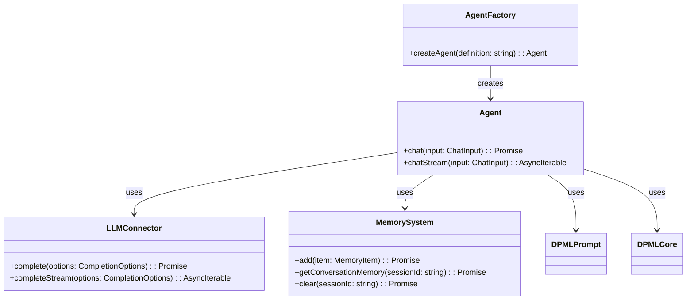
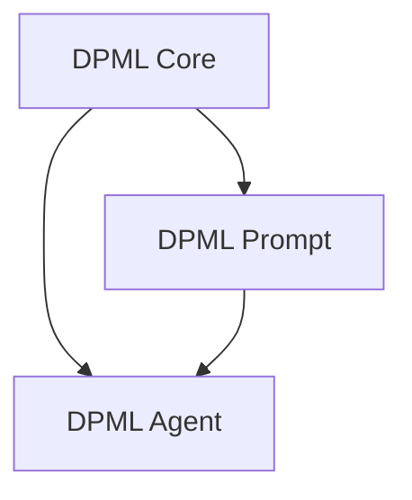
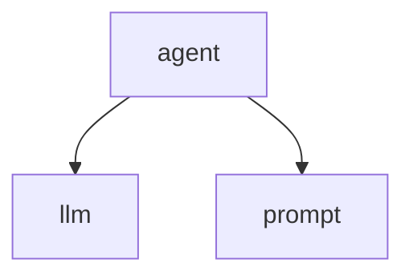
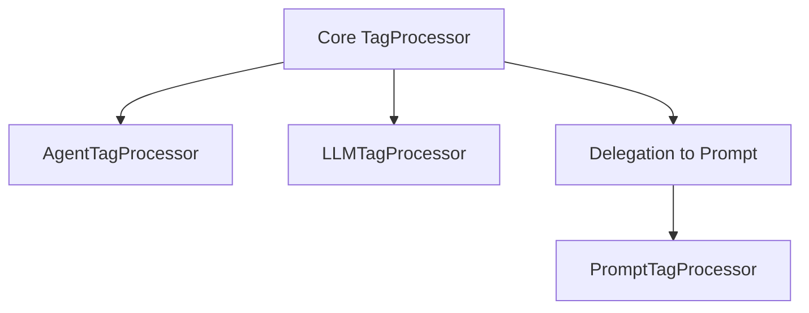
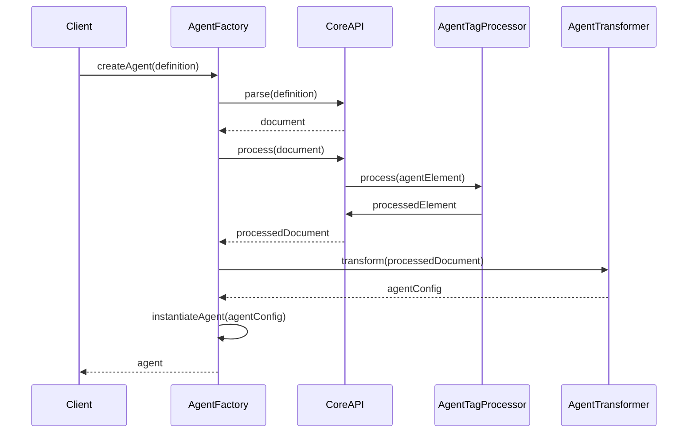

# @dpml/agent 设计文档

## 1. 概述

@dpml/agent包提供一个声明式框架，用于定义和构建基于LLM的智能代理。该包通过XML格式的定义文件，使开发者能够以声明式方式配置代理行为，简化智能代理的开发过程。

### 1.1 目标与愿景

- 提供简洁、声明式的代理定义方式
- 支持多种LLM后端和接口
- 实现配置与实现的有效分离
- 支持多轮对话和上下文管理
- 提供扩展机制支持高级功能

### 1.2 设计原则

- **领域边界明确**：与@dpml/core和@dpml/prompt包形成清晰的分层架构
- **声明式优先**：通过声明式方式定义代理，降低使用门槛
- **关注点分离**：代理定义、LLM集成、记忆管理等职责明确分离
- **扩展性**：灵活的架构支持未来功能扩展
- **渐进增强**：基础功能简单可用，高级功能渐进实现

## 2. 系统架构

### 2.1 整体架构

下图展示了@dpml/agent的核心组件及其关系：



### 2.2 包依赖关系

@dpml/agent包建立在DPML的分层架构之上：



- **@dpml/core**：提供基础设施，包括文档模型、解析、处理和转换功能
- **@dpml/prompt**：提供提示词处理能力
- **@dpml/agent**：基于上述两个包构建代理功能

### 2.3 模块职责

#### 2.3.1 核心模块职责

- **AgentFactory**: 
  - 创建Agent实例
  - 配置代理组件
  - 协调标签处理

- **Agent**: 
  - 管理代理生命周期
  - 处理输入和生成输出
  - 协调LLM和记忆子系统
  - 管理状态和事件

- **LLMConnector**: 
  - 抽象LLM交互接口
  - 管理模型配置和认证
  - 处理请求和响应

- **MemorySystem**: 
  - 管理对话上下文和会话状态
  - 提供记忆存储和检索接口
  - 支持基本的上下文窗口管理

#### 2.3.2 职责边界

| 职责 | Core包 | Prompt包 | Agent包 | 应用层 |
|------|-------|---------|--------|--------|
| XML解析与文档模型 | ✅ | ❌ | ❌ | ❌ |
| 提示词处理 | ❌ | ✅ | ❌ | ❌ |
| 代理标签处理 | ❌ | ❌ | ✅ | ❌ |
| 代理运行时和状态管理 | ❌ | ❌ | ✅ | ❌ |
| 上下文管理 | ❌ | ❌ | ✅ | ❌ |
| 应用特定逻辑 | ❌ | ❌ | ❌ | ✅ |

## 3. 核心概念

### 3.1 代理文档结构

代理文档使用@dpml/core提供的文档模型，通过XML格式定义代理。顶层结构如下：

```xml
<agent id="example-agent" version="1.0">
  <llm api-type="openai" model="gpt-4-turbo" />
  <prompt>
    你是一个有帮助的智能助手。
  </prompt>
</agent>
```

Agent包不重新定义文档模型，而是直接使用Core包提供的Node、Element、Document等类型。特定标签的语义和处理逻辑由Agent包的标签处理器提供。

### 3.2 核心标签体系

Agent包定义了以下核心标签，构成了完整的代理框架：

1. **`<agent>`** - 根标签，包含整个代理的定义 (详见[agent-tag-design.md](./agent-tag-design.md))
2. **`<llm>`** - 配置语言模型连接和参数 (详见[llm-tag-design.md](./llm-tag-design.md))
3. **`<prompt>`** - 定义系统提示词，委托给@dpml/prompt处理 (详见[prompt-tag-design.md](./prompt-tag-design.md))

每个标签都有特定的属性、嵌套规则和验证逻辑，详细的标签规范请参考各自的设计文档。

### 3.3 标签嵌套规则

标签嵌套遵循以下规则：
- `<agent>` 是根标签，必须是文档的顶层元素
- `<llm>` 和 `<prompt>` 是 `<agent>` 的必需直接子元素

嵌套规则图：


### 3.4 运行时状态模型

Agent运行时维护一个明确的状态模型，用于跟踪代理的执行状态：

```typescript
interface AgentState {
  // 基础状态
  id: string;
  status: 'idle' | 'thinking' | 'executing' | 'done';
  
  // 上下文状态
  conversation: Message[];
  metadata: Record<string, any>;
}
```

状态转换通过事件驱动的方式管理，确保状态一致性。

### 3.5 记忆系统抽象

Agent包提供简洁而灵活的记忆系统抽象，用于管理代理的对话历史和上下文：

```typescript
/**
 * 记忆基础接口
 * 表示一个独立的记忆单元
 */
interface Memory {
  // 唯一标识符（通常是会话ID）
  id: string;
  
  // 记忆内容（可以是任何类型）
  content: any;
  
  // 元数据（提供扩展性）
  metadata?: Record<string, any>;
}

/**
 * 会话记忆项
 * 默认的对话内容类型
 */
interface MemoryItem {
  // 内容文本
  text: string;
  
  // 角色（用户、助手、系统）
  role: 'user' | 'assistant' | 'system';
  
  // 创建时间
  timestamp: number;
}

/**
 * 代理记忆存储
 * 提供记忆的基本存取功能
 */
interface AgentMemory {
  // 存储记忆
  store(memory: Memory): Promise<void>;
  
  // 检索会话记忆（返回单个Memory对象，其content通常是MemoryItem数组）
  retrieve(sessionId: string): Promise<Memory>;
  
  // 清除特定会话的记忆
  clear(sessionId: string): Promise<void>;
}
```

这种设计的核心原则：

1. **简洁性**：接口保持最小必要设计，避免过度复杂化
2. **灵活性**：Memory.content可以容纳任何类型的内容
3. **可扩展性**：metadata提供了未来扩展的机制
4. **职责分离**：Memory表示"是什么"，AgentMemory定义"做什么"

## 4. 标签定义概述

每个核心标签都在独立文档中有详细规范，以下提供基本概述并区分Core包提供的通用属性和标签特有属性：

### 4.1 `<agent>` 标签

作为根标签，定义整个代理的基本属性和元数据。

#### 核心属性 (由@dpml/core提供):
- **id**: 唯一标识符，用于引用和复用（Core通用属性）
- **version**: 版本号（Core通用属性）
- **extends**: 继承另一个代理定义，由Core包的继承处理机制实现（Core通用属性）

#### 标签特有属性:
- 当前版本未定义特有属性，保持简洁设计

详细规范请参考 [agent-tag-design.md](./agent-tag-design.md)。

### 4.2 `<llm>` 标签

定义大语言模型的连接方式和参数配置。

#### 核心属性 (由@dpml/core提供):
- **id**: 可选的唯一标识符（Core通用属性）

#### 标签特有属性:
- **api-type**: API规范/协议类型
- **api-url**: API端点URL
- **model**: 模型标识符
- **key-env**: 存储API密钥的环境变量名

详细规范请参考 [llm-tag-design.md](./llm-tag-design.md)。

### 4.3 `<prompt>` 标签

定义代理的系统提示词，委托给@dpml/prompt包处理。

#### 核心属性 (由@dpml/core提供):
- **id**: 可选的唯一标识符（Core通用属性）
- **extends**: 继承其他提示词定义，由Core包的继承处理机制实现（Core通用属性）

#### 标签特有属性:
- 提示词特有属性由@dpml/prompt包定义和处理

详细规范请参考 [prompt-tag-design.md](./prompt-tag-design.md)。

## 5. 记忆管理

### 5.1 记忆系统设计原则

Agent包的记忆系统设计遵循以下原则：

1. **最小必要设计**：只提供真正需要的功能，避免过度设计
2. **通用记忆表示**：使用统一的Memory接口表示不同类型的记忆
3. **灵活内容模型**：记忆内容可以是简单的消息数组或复杂的结构
4. **关注点分离**：记忆表示和记忆存储分离，增强可扩展性

### 5.2 默认记忆实现

Agent包提供基于内存的默认实现：

```typescript
/**
 * 内存存储实现
 * 基于JavaScript Map的简单实现
 */
class InMemoryAgentMemory implements AgentMemory {
  private memories: Map<string, Memory> = new Map();
  
  async store(memory: Memory): Promise<void> {
    this.memories.set(memory.id, memory);
  }
  
  async retrieve(sessionId: string): Promise<Memory> {
    const memory = this.memories.get(sessionId);
    if (!memory) {
      // 如果不存在，返回空记忆
      return {
        id: sessionId,
        content: [] as MemoryItem[],
        metadata: { created: Date.now() }
      };
    }
    return memory;
  }
  
  async clear(sessionId: string): Promise<void> {
    this.memories.delete(sessionId);
  }
}
```

### 5.3 记忆存储场景

记忆系统支持以下典型场景：

#### 5.3.1 存储新消息

```typescript
// 存储用户消息
async function storeUserMessage(agentMemory: AgentMemory, sessionId: string, text: string): Promise<void> {
  // 首先获取现有记忆
  const memory = await agentMemory.retrieve(sessionId);
  
  // 确保content是MemoryItem数组
  const items = Array.isArray(memory.content) ? memory.content : [];
  
  // 添加新的记忆项
  items.push({
    text,
    role: 'user',
    timestamp: Date.now()
  });
  
  // 更新并存储记忆
  memory.content = items;
  await agentMemory.store(memory);
}
```

#### 5.3.2 构建对话上下文

```typescript
// 构建LLM对话上下文
async function buildConversationContext(agentMemory: AgentMemory, sessionId: string, systemPrompt: string): Promise<Message[]> {
  // 获取会话记忆
  const memory = await agentMemory.retrieve(sessionId);
  
  // 确保content是MemoryItem数组
  const items = Array.isArray(memory.content) ? memory.content : [];
  
  // 构建消息数组，首先添加系统提示
  const messages: Message[] = [
    { role: 'system', content: systemPrompt }
  ];
  
  // 添加对话历史
  for (const item of items) {
    messages.push({
      role: item.role,
      content: item.text
    });
  }
  
  return messages;
}
```

### 5.4 记忆系统扩展

基于简洁的基础设计，记忆系统可以通过多种方式扩展：

#### 5.4.1 持久化存储

```typescript
/**
 * 基于文件系统的持久化记忆实现
 */
class FileSystemAgentMemory implements AgentMemory {
  private basePath: string;
  
  constructor(basePath: string) {
    this.basePath = basePath;
    // 确保目录存在
    if (!fs.existsSync(basePath)) {
      fs.mkdirSync(basePath, { recursive: true });
    }
  }
  
  private getFilePath(sessionId: string): string {
    return path.join(this.basePath, `${sessionId}.json`);
  }
  
  async store(memory: Memory): Promise<void> {
    const filePath = this.getFilePath(memory.id);
    await fs.promises.writeFile(
      filePath, 
      JSON.stringify(memory, null, 2)
    );
  }
  
  async retrieve(sessionId: string): Promise<Memory> {
    const filePath = this.getFilePath(sessionId);
    
    try {
      const data = await fs.promises.readFile(filePath, 'utf-8');
      return JSON.parse(data) as Memory;
    } catch (error) {
      // 文件不存在或读取错误，返回空记忆
      return {
        id: sessionId,
        content: [] as MemoryItem[],
        metadata: { created: Date.now() }
      };
    }
  }
  
  async clear(sessionId: string): Promise<void> {
    const filePath = this.getFilePath(sessionId);
    try {
      await fs.promises.unlink(filePath);
    } catch (error) {
      // 如果文件不存在，忽略错误
    }
  }
}
```

#### 5.4.2 会话记忆管理

对于长对话，可以实现记忆管理策略：

```typescript
/**
 * 记忆管理帮助函数：截断超长对话
 */
function truncateConversation(memory: Memory, maxItems: number): Memory {
  if (!Array.isArray(memory.content)) {
    return memory;
  }
  
  const items = memory.content as MemoryItem[];
  if (items.length <= maxItems) {
    return memory;
  }
  
  // 保留system消息和最近的消息
  const systemMessages = items.filter(item => item.role === 'system');
  const recentMessages = items
    .filter(item => item.role !== 'system')
    .slice(-maxItems + systemMessages.length);
  
  return {
    ...memory,
    content: [...systemMessages, ...recentMessages],
    metadata: {
      ...memory.metadata,
      truncated: true,
      originalLength: items.length
    }
  };
}
```

记忆系统通过这种简洁而灵活的设计，既满足了当前的基本需求，又为未来的功能演进预留了空间，实现了"设计为扩展"的良好实践。

## 6. 继承机制

Agent包利用@dpml/core提供的继承机制，支持代理定义的复用和扩展。通过在`<agent>`标签上使用`extends`属性，可以从基础代理定义继承并覆盖特定配置：

```xml
<!-- 继承示例 -->
<agent id="specialized-assistant" extends="./base-assistant.dpml">
  <prompt>
    你是一个专注于科学问题的助手，擅长解释复杂概念。
  </prompt>
</agent>
```

继承机制是@dpml/core包的核心特性，支持属性继承、子标签继承以及跨文件继承。Agent包直接复用这一机制，无需重新实现，这保证了DPML生态系统中继承行为的一致性。

## 7. 标签处理器设计

### 7.1 标签定义与注册

Agent包通过TagRegistry注册特定标签及其处理器，确保XML解析和处理过程中能够正确识别和处理标签：

```typescript
/**
 * 代理模块标签注册
 */
export function registerAgentTags(registry: TagRegistry): void {
  // 注册agent标签
  registry.registerTag({
    name: 'agent',
    allowedParents: [], // 顶层标签，无父标签限制
    allowedChildren: ['llm', 'prompt'], // 允许的子标签
    requiredAttributes: ['id'], // 必需属性
    optionalAttributes: ['version', 'extends'], // 可选属性
    attributeTypes: { // 属性类型定义
      id: 'string',
      version: 'string',
      extends: 'string'
    },
    validator: validateAgentTag // 自定义验证函数
  });

  // 注册llm标签
  registry.registerTag({
    name: 'llm',
    allowedParents: ['agent'], // 只能在agent标签内
    allowedChildren: [], // 无子标签
    requiredAttributes: ['api-type', 'model'], // 必需属性
    optionalAttributes: ['api-url', 'key-env', 'temperature'], // 可选属性
    attributeTypes: {
      'api-type': 'string',
      'model': 'string',
      'api-url': 'string',
      'key-env': 'string',
      'temperature': 'number'
    },
    validator: validateLLMTag
  });

  // prompt标签委托给@dpml/prompt包处理
  // 这里仅定义基本结构约束
  registry.registerTag({
    name: 'prompt',
    allowedParents: ['agent'],
    allowedChildren: [], // 内部结构由prompt包处理
    optionalAttributes: ['extends'],
    attributeTypes: {
      'extends': 'string'
    }
  });
}
```

### 7.2 标签验证规则

每个标签包含自定义的验证规则，确保标签结构和属性符合要求：

```typescript
/**
 * agent标签验证函数
 */
function validateAgentTag(element: Element, context: ValidationContext): ValidationResult {
  const errors: ValidationError[] = [];
  const warnings: ValidationWarning[] = [];
  
  // 验证ID格式
  const id = element.attributes.id;
  if (id && !/^[a-z0-9-_]+$/i.test(id)) {
    errors.push({
      code: 'INVALID_ID_FORMAT',
      message: 'Agent ID只能包含字母、数字、短横线和下划线',
      element
    });
  }
  
  // 验证是否缺少必要的子标签
  const hasLLM = element.children.some(child => 
    isElement(child) && child.tagName === 'llm'
  );
  
  if (!hasLLM) {
    errors.push({
      code: 'MISSING_REQUIRED_CHILD',
      message: 'Agent标签必须包含llm子标签',
      element
    });
  }
  
  const hasPrompt = element.children.some(child => 
    isElement(child) && child.tagName === 'prompt'
  );
  
  if (!hasPrompt) {
    errors.push({
      code: 'MISSING_REQUIRED_CHILD',
      message: 'Agent标签必须包含prompt子标签',
      element
    });
  }
  
  return { errors, warnings };
}

/**
 * llm标签验证函数
 */
function validateLLMTag(element: Element, context: ValidationContext): ValidationResult {
  const errors: ValidationError[] = [];
  const warnings: ValidationWarning[] = [];
  
  // 验证api-type是否为支持的类型
  const apiType = element.attributes['api-type'];
  const supportedApiTypes = ['openai', 'anthropic', 'azure', 'mistral', 'custom'];
  
  if (apiType && !supportedApiTypes.includes(apiType)) {
    warnings.push({
      code: 'UNSUPPORTED_API_TYPE',
      message: `不支持的API类型: ${apiType}。支持的类型: ${supportedApiTypes.join(', ')}`,
      element
    });
  }
  
  // 检查是否缺少API密钥环境变量
  if (!element.attributes['key-env']) {
    warnings.push({
      code: 'MISSING_KEY_ENV',
      message: '建议设置key-env属性以指定API密钥的环境变量',
      element
    });
  }
  
  return { errors, warnings };
}
```

### 7.3 标签系统集成

Agent包集成Core包提供的标签系统，通过以下机制实现标签定义和处理：

1. **初始化标签注册表**：创建时从Core包获取TagRegistry实例
2. **注册特定标签**：调用registerAgentTags注册Agent包特定标签
3. **流程集成**：确保Agent处理流程使用Core包的解析和处理功能

```typescript
/**
 * 标签系统初始化
 */
export function initializeTagSystem(): TagRegistry {
  // 获取标签注册表实例
  const registry = new TagRegistry();
  
  // 注册Agent包特定标签
  registerAgentTags(registry);
  
  return registry;
}

/**
 * Agent工厂创建
 */
export function createAgentFactory(options?: AgentFactoryOptions): AgentFactory {
  // 初始化标签系统
  const tagRegistry = options?.tagRegistry || initializeTagSystem();
  
  // 创建解析器适配器
  const parserAdapter = new DpmlAdapter({
    tagRegistry
  });
  
  // 创建处理器
  const processor = new DefaultProcessor({
    tagRegistry,
    // 其他处理器选项...
  });
  
  // 创建转换器
  const transformer = new AgentTransformer();
  
  return new AgentFactoryImpl({
    parserAdapter,
    processor,
    transformer,
    // 其他工厂选项...
  });
}
```

### 7.4 标签处理架构

Agent包利用@dpml/core提供的处理器架构，实现特定于代理的标签处理逻辑：



每个标签处理器负责：
- 验证标签的属性和结构
- 处理标签的继承和引用
- 实现标签特定的转换逻辑

## 8. 类图设计

下图展示了@dpml/agent包的核心接口、实现类和它们之间的关系：

```mermaid
classDiagram
    %% 核心接口
    class Agent {
        <<interface>>
        +id: string
        +version: string
        +chat(input: ChatInput): Promise~ChatOutput~
        +chatStream(input: ChatInput): AsyncIterable~ChatChunk~
    }
    
    class AgentMemory {
        <<interface>>
        +store(memory: Memory): Promise~void~
        +retrieve(sessionId: string): Promise~Memory~
        +clear(sessionId: string): Promise~void~
    }
    
    class LLMConnector {
        <<interface>>
        +complete(options: CompletionOptions): Promise~CompletionResult~
        +completeStream(options: CompletionOptions): AsyncIterable~CompletionChunk~
    }
    
    class AgentFactory {
        <<interface>>
        +createAgent(definition: string): Promise~Agent~
    }
    
    %% 数据结构
    class Memory {
        +id: string
        +content: any
        +metadata?: Record~string, any~
    }
    
    class MemoryItem {
        +text: string
        +role: string
        +timestamp: number
    }
    
    class ChatInput {
        +input: string
        +sessionId?: string
        +metadata?: Record~string, any~
    }
    
    class ChatOutput {
        +output: string
        +usage?: TokenUsage
        +metadata?: Record~string, any~
    }
    
    class ChatChunk {
        +type: string
        +content: string
        +metadata?: Record~string, any~
    }
    
    class CompletionOptions {
        +model: string
        +messages: Message[]
        +temperature?: number
        +maxTokens?: number
    }
    
    class CompletionResult {
        +text: string
        +usage: TokenUsage
        +metadata: Record~string, any~
    }
    
    class CompletionChunk {
        +text: string
        +isComplete: boolean
        +metadata?: Record~string, any~
    }
    
    %% 实现类
    class AgentImpl {
        -id: string
        -version: string
        -llmConnector: LLMConnector
        -memory: AgentMemory
        -promptText: string
        +constructor(options: AgentOptions)
        +chat(input: ChatInput): Promise~ChatOutput~
        +chatStream(input: ChatInput): AsyncIterable~ChatChunk~
        -recallContext(sessionId: string): Promise~Message[]~
        -remember(sessionId: string, role: string, content: string): Promise~void~
    }
    
    class InMemoryAgentMemory {
        -memories: Map~string, Memory~
        +store(memory: Memory): Promise~void~
        +retrieve(sessionId: string): Promise~Memory~
        +clear(sessionId: string): Promise~void~
    }
    
    class FileSystemAgentMemory {
        -basePath: string
        +constructor(basePath: string)
        +store(memory: Memory): Promise~void~
        +retrieve(sessionId: string): Promise~Memory~
        +clear(sessionId: string): Promise~void~
        -getFilePath(sessionId: string): string
    }
    
    class OpenAIConnector {
        -apiKey: string
        -apiUrl: string
        -model: string
        +constructor(options: OpenAIOptions)
        +complete(options: CompletionOptions): Promise~CompletionResult~
        +completeStream(options: CompletionOptions): AsyncIterable~CompletionChunk~
    }
    
    class AnthropicConnector {
        -apiKey: string
        -apiUrl: string
        -model: string
        +constructor(options: AnthropicOptions)
        +complete(options: CompletionOptions): Promise~CompletionResult~
        +completeStream(options: CompletionOptions): AsyncIterable~CompletionChunk~
    }
    
    class AgentFactoryImpl {
        -parserAdapter: DpmlAdapter
        -processor: DefaultProcessor
        -transformer: AgentTransformer
        +constructor(options: AgentFactoryOptions)
        +createAgent(definition: string): Promise~Agent~
        -parseDocument(definition: string): Promise~Document~
        -processDocument(document: Document): Promise~ProcessedDocument~
        -transformToConfig(document: ProcessedDocument): AgentConfig
        -instantiateAgent(config: AgentConfig): Agent
    }
    
    class AgentTransformer {
        +constructor()
        +transform(doc: ProcessedDocument): AgentConfig
        -registerVisitors(): void
    }
    
    %% 辅助类
    class MemoryUtils {
        <<static>>
        +truncateConversation(memory: Memory, maxItems: number): Memory
        +storeUserMessage(memory: AgentMemory, sessionId: string, text: string): Promise~void~
        +storeAssistantMessage(memory: AgentMemory, sessionId: string, text: string): Promise~void~
    }
    
    %% 关系
    Agent <|.. AgentImpl : 实现
    AgentMemory <|.. InMemoryAgentMemory : 实现
    AgentMemory <|.. FileSystemAgentMemory : 实现
    LLMConnector <|.. OpenAIConnector : 实现
    LLMConnector <|.. AnthropicConnector : 实现
    AgentFactory <|.. AgentFactoryImpl : 实现
    
    AgentImpl --> LLMConnector : 使用
    AgentImpl --> AgentMemory : 使用
    AgentFactoryImpl --> AgentTransformer : 使用
    
    Memory "1" *-- "many" MemoryItem : 包含
    AgentImpl ..> Memory : 创建/使用
    AgentImpl ..> ChatOutput : 创建
    AgentImpl ..> ChatChunk : 创建
    OpenAIConnector ..> CompletionResult : 创建
    OpenAIConnector ..> CompletionChunk : 创建
    AnthropicConnector ..> CompletionResult : 创建
    AnthropicConnector ..> CompletionChunk : 创建
    
    AgentFactoryImpl ..> AgentImpl : 创建
    AgentFactoryImpl ..> InMemoryAgentMemory : 创建(默认)
    AgentFactoryImpl ..> OpenAIConnector : 可能创建
    AgentFactoryImpl ..> AnthropicConnector : 可能创建
```



### 8.1 核心接口

- **Agent**: 代理接口，定义代理的基本操作（聊天、流式聊天）
- **AgentMemory**: 记忆存储接口，管理会话记忆
- **LLMConnector**: LLM连接器接口，抽象与大语言模型的交互
- **AgentFactory**: 代理工厂接口，负责创建Agent实例

### 8.2 实现类

- **AgentImpl**: Agent接口的默认实现
- **InMemoryAgentMemory**: 基于内存的记忆存储实现
- **FileSystemAgentMemory**: 基于文件系统的记忆存储实现
- **OpenAIConnector**: 基于OpenAI API的LLM连接器实现
- **AnthropicConnector**: 基于Anthropic API的LLM连接器实现
- **AgentFactoryImpl**: 代理工厂的默认实现

### 8.3 数据结构

- **Memory**: 记忆基本单元
- **MemoryItem**: 会话记忆项（通常作为Memory.content的类型）
- **ChatInput**: 代理聊天输入
- **ChatOutput**: 代理聊天输出
- **ChatChunk**: 流式聊天块

### 8.4 设计要点

1. **平衡的命名策略**: 
   - 用户交互层使用拟人化命名（如chat、ChatInput）
   - 底层技术实现保持技术性命名（如LLMConnector、store）
   - 反映系统的双重性质：对外表现为智能体，内部基于计算机技术

2. **接口分离**: 通过明确的接口定义确保组件之间的低耦合
3. **依赖注入**: AgentImpl通过构造函数注入LLMConnector和AgentMemory
4. **工厂模式**: 使用AgentFactory创建和配置Agent实例
5. **策略模式**: LLMConnector的不同实现可以互相替换
6. **组合优于继承**: 使用组合关系构建系统，而非复杂的继承层次

通过这种设计，开发人员可以:
- 替换任何组件的实现而不影响其他部分
- 轻松扩展新的LLM提供商支持
- 实现自定义记忆存储策略
- 在不同环境中灵活配置代理

## 9. 代理创建流程

### 9.1 创建流程

创建代理的过程使用@dpml/core的解析、处理和转换功能：



### 9.2 实现代码

```typescript
export async function createAgent(definition: string): Promise<Agent> {
  // 使用@dpml/core的API
  const document = await parse(definition);
  const processedDocument = await process(document);
  
  // 使用Agent包的转换器
  const transformer = new AgentTransformer();
  const config = transformer.transform(processedDocument);
  
  // 创建代理实例
  return instantiateAgent(config);
}

function instantiateAgent(config: AgentConfig): Agent {
  // 创建LLM连接器
  const llmConnector = createLLMConnector(config.llm);
  
  // 创建记忆系统
  const memorySystem = new InMemoryAgentMemory();
  
  // 创建并返回代理实例
  return new AgentImpl({
    id: config.id,
    version: config.version,
    llmConnector,
    memorySystem,
    prompt: config.prompt
  });
}
```

## 10. API设计

### 10.1 公共API

Agent包提供以下核心API：

```typescript
/**
 * 创建代理实例
 */
function createAgent(definition: string): Promise<Agent>;

/**
 * 代理接口
 */
interface Agent {
  /**
   * 代理标识符
   */
  readonly id: string;
  
  /**
   * 代理版本
   */
  readonly version: string;
  
  /**
   * 与代理聊天
   */
  chat(input: ChatInput): Promise<ChatOutput>;
  
  /**
   * 流式聊天
   */
  chatStream(input: ChatInput): AsyncIterable<ChatChunk>;
}

/**
 * 聊天输入
 */
interface ChatInput {
  /**
   * 用户输入文本
   */
  input: string;
  
  /**
   * 会话ID，用于多轮对话
   */
  sessionId?: string;
  
  /**
   * 额外元数据
   */
  metadata?: Record<string, any>;
}

/**
 * 聊天输出
 */
interface ChatOutput {
  /**
   * 代理输出文本
   */
  output: string;
  
  /**
   * 使用的令牌数量
   */
  usage?: {
    promptTokens: number;
    completionTokens: number;
    totalTokens: number;
  };
  
  /**
   * 元数据
   */
  metadata?: Record<string, any>;
}

/**
 * 聊天块
 */
type ChatChunk = {
  /**
   * 块类型
   */
  type: 'thinking' | 'output' | 'error';
  
  /**
   * 块内容
   */
  content: string;
  
  /**
   * 块元数据
   */
  metadata?: Record<string, any>;
};
```

### 10.2 使用示例

```typescript
// 创建并使用代理
async function main() {
  try {
    // 创建代理
    const agent = await createAgent(`
      <agent id="conversation-agent" version="1.0">
        <llm api-type="openai" model="gpt-4-turbo" key-env="OPENAI_API_KEY" />
        <prompt>
          你是一个有帮助的对话助手，擅长回答问题并提供信息。
        </prompt>
      </agent>
    `);
    
    // 使用会话ID跟踪对话
    const sessionId = 'user-123';
    
    // 第一轮对话
    const result1 = await agent.chat({
      input: '中国历史上有哪些重要的朝代？',
      sessionId
    });
    
    console.log('代理回复:', result1.output);
    
    // 第二轮对话 (引用上一轮对话)
    const result2 = await agent.chat({
      input: '在你刚才提到的历史中，哪个时期最重要？',
      sessionId // 同一会话，代理能够记住前一轮对话内容
    });
    
    console.log('代理回复:', result2.output);
    
    // 流式聊天示例
    console.log('流式聊天示例:');
    
    for await (const chunk of agent.chatStream({ 
      input: '什么是深度学习？',
      sessionId
    })) {
      if (chunk.type === 'thinking') {
        process.stdout.write('思考中...');
      } else if (chunk.type === 'output') {
        process.stdout.write(chunk.content);
      }
    }
    
  } catch (error) {
    console.error('与代理聊天时出错:', error);
  }
}

main();
```

### 10.1 处理继承的完整示例

```typescript
// 创建继承自基础模板的专业化代理
async function createSpecializedAgent() {
  try {
    // 模板路径
    const baseTemplatePath = './templates/base-agent.dpml';
    
    // 专业化代理定义
    const definition = `
      <agent id="science-advisor" extends="${baseTemplatePath}">
        <prompt>
          你是一位专业的科学顾问，擅长解释复杂的科学概念。
          始终基于科学事实提供清晰、准确的解释。
        </prompt>
      </agent>
    `;
    
    // base-agent.dpml内容:
    // <agent id="base-assistant">
    //   <llm api-type="openai" api-url="https://api.openai.com/v1" model="gpt-4-turbo" key-env="OPENAI_API_KEY" />
    //   <prompt>你是一个通用助手，能够回答问题并提供帮助。</prompt>
    // </agent>
    
    // 创建代理
    const agent = await createAgent(definition);
    
    // 运行代理
    const result = await agent.chat({
      input: '请解释量子纠缠的概念'
    });
    
    console.log('科学顾问回复:', result.output);
  } catch (error) {
    console.error('创建专业化代理时出错:', error);
  }
}

createSpecializedAgent();
```

## 11. 技术选择

### 11.1 关键技术决策

- **TypeScript**: 使用TypeScript强类型系统保障代码质量和开发体验
- **事件驱动架构**: 采用事件驱动设计，提高系统的可观察性和扩展性
- **组合优于继承**: 使用组合模式构建系统组件，而不是复杂的继承层次
- **接口优先设计**: 定义清晰的接口契约，实现可替换的组件
- **可测试性设计**: 依赖注入和模块化结构，便于单元测试和模拟

### 11.2 依赖管理

Agent包仅依赖必要的外部库：

- **@dpml/core**: 核心功能和基础设施
- **@dpml/prompt**: 提示词处理

对于LLM API调用，提供适配器，但不直接依赖特定SDK：

```typescript
// 适配器示例
class OpenAIAdapter implements LLMAdapter {
  async complete(options: AdapterOptions): Promise<AdapterResult> {
    // 依赖注入外部库，不直接依赖
    const openai = options.apiClient;
    
    // 调用API
    const response = await openai.chat.completions.create({
      model: options.model,
      messages: options.messages,
      temperature: options.temperature,
      // 其他参数...
    });
    
    // 转换为标准格式
    return {
      text: response.choices[0].message.content,
      usage: {
        promptTokens: response.usage.prompt_tokens,
        completionTokens: response.usage.completion_tokens,
        totalTokens: response.usage.total_tokens
      },
      metadata: {
        model: response.model,
        // 其他元数据...
      }
    };
  }
}
```

## 12. 演进计划

### 12.1 版本规划

- **0.1 (初始版本)**
  - 基础标签定义和解析
  - 核心Agent接口和运行时
  - 简单的LLM连接器
  - 基础上下文管理(简单记忆系统)

- **0.2 (功能扩展)**
  - 状态管理和事件系统
  - 流式处理支持
  - 完善的错误处理
  - 增强的记忆抽象

- **0.5 (功能完善)**
  - 功能完整的API
  - 增强型标签处理 
  - 更多模型支持
  - 增强型上下文管理

- **1.0 (生产就绪)**
  - 完整的文档和示例
  - 生产级别的稳定性保证
  - 工具和高级记忆系统支持

### 12.2 功能路线图

#### 短期目标 (0.x)

- 完善核心标签系统
- 提供流式处理
- 完善记忆接口抽象
- 添加事件监控系统

#### 中期目标 (1.x)

- 增加工具和能力系统
- 提供高级记忆管理支持
- 添加中间件系统
- 实现更多模型提供商支持

#### 长期目标 (2.x+)

- 支持多代理协作
- 实现认知架构和高级推理
- 提供专业领域能力包
- 增强安全和隐私功能

### 12.3 兼容性承诺

Agent包遵循语义化版本规范：

- **主版本**（x.0.0）：包含不向后兼容的API变更
- **次版本**（0.x.0）：包含向后兼容的功能新增
- **补丁版本**（0.0.x）：包含向后兼容的错误修复

核心承诺：
- 标签结构和属性保持稳定
- 公共API签名在次版本内保持不变
- 废弃的API至少在一个主版本周期内保留并发出警告

## 13. 总结

@dpml/agent包提供了一个基础框架，用于定义、创建和管理基于LLM的智能代理。通过声明式的XML格式，开发者可以清晰地定义代理的配置和行为，实现配置与实现的分离。

核心设计原则包括领域边界清晰、声明式定义、状态与行为分离等，这些原则共同保证了系统的可维护性、可扩展性和开发友好性。

Agent包构建在@dpml/core和@dpml/prompt包的基础上，充分利用这些包提供的解析、处理和转换功能，避免重复实现基础设施。标签系统相关的详细规范请参考各自的设计文档：
- [agent-tag-design.md](./agent-tag-design.md)
- [llm-tag-design.md](./llm-tag-design.md)
- [prompt-tag-design.md](./prompt-tag-design.md)

API设计着重简洁性和灵活性，提供了一系列核心方法和配置选项，支持同步和流式处理模式。事件系统使开发者能够监控代理的运行状态和行为，实现可观察性和可调试性。

记忆系统通过抽象接口实现关注点分离，确保上下文管理与LLM调用逻辑解耦，既保持当前设计简洁，又为未来功能扩展留下空间。 