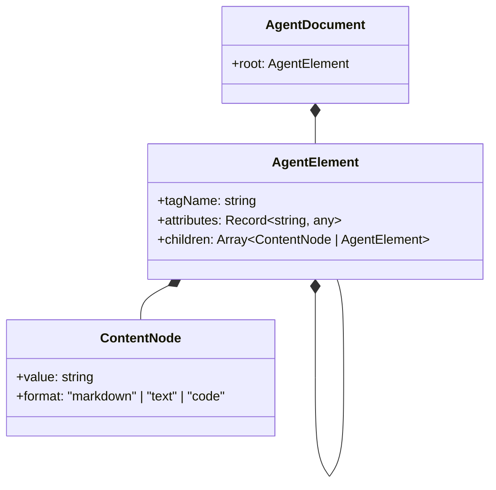
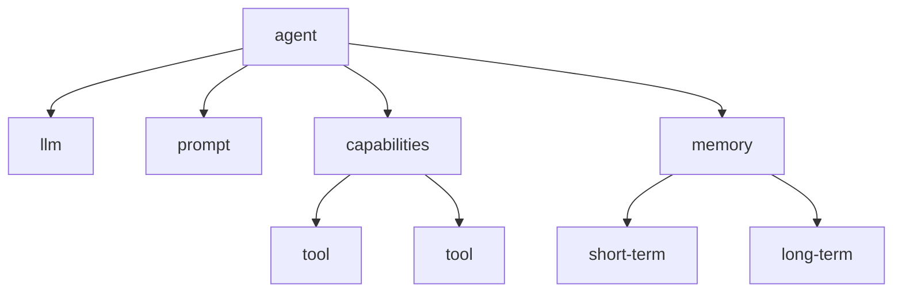
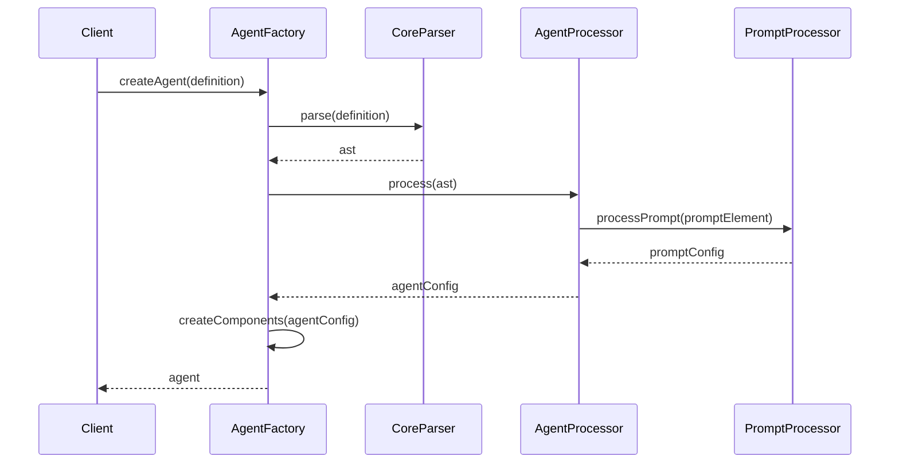

# @dpml/agent 设计文档

## 1. 设计目标与原则

### 1.1 核心目标

`@dpml/agent`作为DPML生态系统的核心包，旨在提供:

1. **声明式代理定义**：使用XML标记语言定义AI代理的能力和行为
2. **统一LLM交互**：抽象大语言模型交互接口，支持多种模型和提供商
3. **模块化能力系统**：以可组合的方式定义和管理代理能力
4. **完整的生命周期管理**：定义、初始化、运行、暂停和终止代理的完整流程

### 1.2 设计原则

1. **领域边界清晰**：专注于代理定义和运行时环境，与其他领域保持明确边界
2. **声明式定义**：采用DPML标记语言进行代理定义，实现配置与实现分离
3. **状态与行为分离**：采用清晰的状态管理模式，实现状态和行为逻辑解耦
4. **模块化能力系统**：代理能力以插件形式提供，支持灵活组装和扩展
5. **记忆管理原则**：分层记忆模型，支持语义检索和记忆压缩
6. **LLM交互抽象**：提供统一的LLM交互接口，支持多种模型和提供商
7. **可观察性设计**：全面的事件系统和日志机制，便于监控和调试
8. **错误处理策略**：健壮的错误处理机制，支持优雅降级和自恢复
9. **安全设计原则**：强调安全性，保护系统和用户
10. **开发友好性**：优先考虑开发者体验，降低使用门槛
11. **扩展性机制**：提供多种扩展点，支持自定义和第三方扩展
12. **标签与属性极简主义**：遵循"少即是多"的设计哲学，保持标签和属性的最小必要集
13. **统一基础设施原则**：优先使用@dpml/core提供的基础设施，确保跨包统一性
14. **渐进式复杂度设计**：每个组件既是一个默认实现，又是更复杂系统的入口点
15. **面向终端用户优先**：无论是API设计还是错误处理，都以终端用户的使用体验为优先考量

### 1.3 解决的问题

1. 开发基于LLM的智能代理缺乏标准化结构和框架
2. LLM应用开发涉及大量重复代码和配置
3. 不同代理实现之间难以复用组件和模式
4. 缺乏声明式方式描述代理能力和行为
5. 多模型支持和集成需要大量重复工作
6. 记忆管理和状态持久化缺乏统一范式

## 2. 系统架构

### 2.1 整体架构

下图展示了@dpml/agent的核心组件及其关系：

```mermaid
classDiagram
    class AgentFactory {
        +createAgent(definition: string): Agent
    }
    class Agent {
        +run(input: RunInput): Promise<RunOutput>
        +runStream(input: RunInput): AsyncIterable<OutputChunk>
    }
    class LLMConnector {
        +complete(options: CompletionOptions): Promise<CompletionResult>
        +completeStream(options: CompletionOptions): AsyncIterable<CompletionChunk>
    }
    class CapabilityRegistry {
        +registerCapability(capability: Capability)
        +getCapability(name: string): Capability
    }
    class MemorySystem {
        +shortTerm: ShortTermMemory
        +longTerm: LongTermMemory
        +working: WorkingMemory
    }
    
    AgentFactory --> Agent: creates
    Agent --> LLMConnector: uses
    Agent --> CapabilityRegistry: uses
    Agent --> MemorySystem: uses
    Agent ..> "@dpml/prompt": uses
    Agent ..> "@dpml/core": uses
```

### 2.2 模块职责

#### 2.2.1 核心模块职责

- **AgentFactory**: 
  - 创建Agent实例
  - 解析代理定义
  - 配置代理组件

- **Agent**: 
  - 管理代理生命周期
  - 处理输入和生成输出
  - 协调能力和记忆子系统
  - 管理状态和事件

- **LLMConnector**: 
  - 抽象LLM交互接口
  - 管理模型配置和认证
  - 处理请求和响应

- **CapabilityRegistry**: 
  - 注册和管理代理能力
  - 提供能力发现和访问接口
  - 处理能力调用流程

- **MemorySystem**: 
  - 管理短期和长期记忆
  - 提供记忆检索和存储接口
  - 实现记忆压缩和管理策略

#### 2.2.2 职责边界

| 职责 | Core包 | Prompt包 | Agent包 | 应用层 |
|------|-------|---------|--------|--------|
| XML解析 | ✅ | ❌ | ❌ | ❌ |
| 提示词处理 | ❌ | ✅ | ❌ | ❌ |
| 代理定义和运行时 | ❌ | ❌ | ✅ | ❌ |
| 工具实现 | ❌ | ❌ | ✅ | ✅ |
| 应用特定逻辑 | ❌ | ❌ | ❌ | ✅ |

## 3. 核心概念

### 3.1 代理文档模型

代理文档由一系列结构化标签组成，每个标签代表代理的一个功能组件。顶层结构如下：



### 3.2 核心标签体系

Agent包定义了以下核心标签，共同构成了完整的代理框架：

1. **`<agent>`** - 根标签，包含整个代理的定义
2. **`<llm>`** - 配置语言模型连接和参数
3. **`<prompt>`** - 定义系统提示词，委托给@dpml/prompt处理
4. **`<capabilities>`** - 包含代理可用工具和能力的容器
5. **`<memory>`** - 配置代理记忆系统
6. **`<tool>`** - 定义单个工具能力

每个标签都有特定的属性、嵌套规则和验证逻辑。

### 3.3 标签嵌套规则

标签嵌套遵循以下规则：
- `<agent>` 是根标签，必须是文档的顶层元素
- `<llm>` 和 `<prompt>` 是 `<agent>` 的必需直接子元素
- `<capabilities>` 和 `<memory>` 是可选的 `<agent>` 子元素
- `<tool>` 只能作为 `<capabilities>` 的子元素

嵌套规则图：


### 3.4 运行时状态模型

Agent运行时维护一个明确的状态模型，用于跟踪代理的执行状态：

```typescript
interface AgentState {
  // 基础状态
  id: string;
  status: 'idle' | 'thinking' | 'executing' | 'waiting' | 'done';
  
  // 运行时状态
  currentTask?: Task;
  memory: MemoryState;
  
  // 上下文状态
  conversation: Message[];
  metadata: Record<string, any>;
}
```

状态转换通过事件驱动的方式管理，确保状态一致性。

## 4. 标签定义详情

### 4.1 `<agent>` 标签

作为根标签，定义整个代理的基本属性和元数据。

#### 属性：
- **id**: 唯一标识符，用于引用和复用
- **version**: 代理版本号，默认为"1.0"
- **extends**: 继承另一个代理定义（支持跨文件继承）

#### 用例：
```xml
<agent id="research-assistant" version="1.0">
  <!-- 子标签内容 -->
</agent>
```

### 4.2 `<llm>` 标签

定义大语言模型的连接方式和参数配置。

#### 属性：
- **api-type**: API规范/协议类型，默认为"openai"
- **api-url**: API端点URL，必填
- **model**: 模型标识符，必填
- **key-env**: 存储API密钥的环境变量名，需要认证时必填

#### 用例：
```xml
<llm 
  api-type="openai" 
  api-url="https://api.openai.com/v1"
  model="gpt-4-turbo" 
  key-env="OPENAI_API_KEY"
/>
```

### 4.3 `<prompt>` 标签

定义代理的系统提示词，委托给@dpml/prompt包处理。

#### 属性：
- **extends**: 继承其他提示词定义

#### 用例：
```xml
<prompt>
  你是一个有帮助的助手，能够回答用户问题并提供有用的信息。
</prompt>
```

### 4.4 `<capabilities>` 标签

作为工具和能力的容器标签。

#### 属性：
- **default-enabled**: 是否默认启用所有工具，默认为true

#### 用例：
```xml
<capabilities default-enabled="true">
  <tool name="web-search" />
  <tool name="calculator" />
</capabilities>
```

### 4.5 `<tool>` 标签

定义单个工具能力。

#### 属性：
- **name**: 工具名称，必填
- **enabled**: 是否启用，默认为true
- **description**: 工具描述
- **version**: 工具版本

#### 用例：
```xml
<tool 
  name="web-search" 
  description="搜索互联网获取信息"
  enabled="true"
/>
```

### 4.6 `<memory>` 标签

配置代理的记忆系统。

#### 属性：
- **type**: 记忆系统类型，默认为"basic"

#### 用例：
```xml
<memory type="vector">
  <short-term capacity="10" />
  <long-term storage="vector-db" />
</memory>
```

## 5. 继承机制

### 5.1 代理继承原理

代理定义支持通过`extends`属性继承其他代理的内容和属性：

```xml
<!-- 基础代理定义 -->
<agent id="base-assistant">
  <llm 
    api-type="openai" 
    model="gpt-4-turbo" 
    key-env="OPENAI_API_KEY"
  />
  
  <prompt>
    你是一个有帮助的助手。
  </prompt>
</agent>

<!-- 继承和扩展代理 -->
<agent id="specialized-assistant" extends="./base-assistant.dpml">
  <prompt>
    你是一个专注于科学问题的助手，擅长解释复杂概念。
  </prompt>
  
  <capabilities>
    <tool name="calculator" />
  </capabilities>
</agent>
```

### 5.2 继承规则

1. **属性继承**：子标签可以继承父标签的属性，子标签的同名属性会覆盖父标签
2. **子标签继承**：
   - 如果子代理定义了父代理没有的子标签，则添加该子标签
   - 如果子代理定义了父代理已有的子标签，则覆盖该子标签
   - 如果子代理未定义父代理已有的子标签，则继承父代理的子标签
3. **跨文件继承**：支持通过路径引用其他文件中的代理定义
4. **多级继承**：支持继承链，子代理可以继承父代理，父代理继承祖父代理

### 5.3 跨文件继承

支持从其他文件继承代理定义：

```xml
<!-- 从本地文件继承 -->
<agent id="research-assistant" extends="./templates/base-assistant.dpml">
  <!-- 覆盖或添加子标签 -->
</agent>

<!-- 从远程文件继承 -->
<agent id="customer-service" extends="https://example.com/templates/cs-agent.dpml">
  <!-- 覆盖或添加子标签 -->
</agent>
```

### 5.4 能力继承

通过继承机制，代理可以逐级扩展能力集合：

```xml
<!-- 基础代理定义 -->
<agent id="base-agent">
  <llm model="gpt-4-turbo" key-env="OPENAI_API_KEY" />
  <prompt>基础提示词</prompt>
  
  <capabilities>
    <tool name="web-search" />
  </capabilities>
</agent>

<!-- 扩展能力集合 -->
<agent id="advanced-agent" extends="./base-agent.dpml">
  <capabilities>
    <tool name="web-search" /> <!-- 继承的工具 -->
    <tool name="calculator" /> <!-- 新增的工具 -->
    <tool name="file-reader" /> <!-- 新增的工具 -->
  </capabilities>
</agent>
```

## 6. 转换器设计

### 6.1 AgentProcessor

AgentProcessor负责处理Agent定义，将XML结构转换为可执行的Agent配置：

```typescript
export class AgentProcessor {
  constructor(options?: AgentProcessorOptions) {
    // 初始化处理器
  }
  
  // 处理代理定义
  async process(definition: string): Promise<AgentConfig> {
    // 解析XML为AST
    const ast = await parseXML(definition);
    
    // 处理AST，解析引用和继承
    const processedDoc = await processDocument(ast);
    
    // 转换为Agent配置
    return this.transformToAgentConfig(processedDoc);
  }
  
  // 转换为Agent配置
  private transformToAgentConfig(doc: ProcessedDocument): AgentConfig {
    const agentElement = doc.root;
    
    // 提取代理基本信息
    const id = agentElement.getAttribute('id');
    const version = agentElement.getAttribute('version') || '1.0';
    
    // 处理LLM配置
    const llmElement = agentElement.getChild('llm');
    const llmConfig = this.processLLMConfig(llmElement);
    
    // 处理提示词
    const promptElement = agentElement.getChild('prompt');
    const promptConfig = this.processPromptConfig(promptElement);
    
    // 处理能力配置
    const capabilitiesElement = agentElement.getChild('capabilities');
    const capabilities = capabilitiesElement 
      ? this.processCapabilities(capabilitiesElement)
      : [];
    
    // 处理记忆配置
    const memoryElement = agentElement.getChild('memory');
    const memoryConfig = memoryElement
      ? this.processMemoryConfig(memoryElement)
      : { type: 'basic' };
    
    // 返回完整配置
    return {
      id,
      version,
      llm: llmConfig,
      prompt: promptConfig,
      capabilities,
      memory: memoryConfig
    };
  }
  
  // 处理LLM配置
  private processLLMConfig(element: Element): LLMConfig {
    return {
      apiType: element.getAttribute('api-type') || 'openai',
      apiUrl: element.getAttribute('api-url'),
      model: element.getAttribute('model'),
      keyEnv: element.getAttribute('key-env')
    };
  }
  
  // 其他处理方法...
}
```

### 6.2 处理流程

整体处理流程遵循以下步骤：

1. 解析代理定义文件为XML AST
2. 处理AST，解析引用和继承
3. 转换处理后的文档为Agent配置对象
4. 使用配置对象创建Agent实例及其组件



### 6.3 标签处理

每个标签有专门的处理逻辑：

```typescript
// 处理提示词标签
private async processPromptElement(element: Element): Promise<string> {
  // 提取提示词内容
  const content = element.getTextContent();
  
  // 如果有extends属性，处理继承
  if (element.hasAttribute('extends')) {
    const referencePath = element.getAttribute('extends');
    // 解析引用
    const referencedPrompt = await this.resolveReference(referencePath);
    
    // 处理继承逻辑
    // ...
  }
  
  // 委托给Prompt包处理
  return await processPrompt(content);
}

// 处理能力标签
private processCapabilitiesElement(element: Element): CapabilityConfig[] {
  const defaultEnabled = element.getAttribute('default-enabled') !== 'false';
  
  return element.getChildren('tool').map(toolElement => {
    return {
      name: toolElement.getAttribute('name'),
      enabled: toolElement.getAttribute('enabled') !== 'false' && defaultEnabled,
      description: toolElement.getAttribute('description') || '',
      version: toolElement.getAttribute('version') || '1.0',
      parameters: this.processToolParameters(toolElement)
    };
  });
}

// 处理记忆标签
private processMemoryElement(element: Element): MemoryConfig {
  const type = element.getAttribute('type') || 'basic';
  
  // 提取短期记忆配置
  const shortTermElement = element.getChild('short-term');
  const shortTerm = shortTermElement 
    ? {
        capacity: parseInt(shortTermElement.getAttribute('capacity') || '10', 10)
      }
    : { capacity: 10 };
  
  // 提取长期记忆配置
  const longTermElement = element.getChild('long-term');
  const longTerm = longTermElement
    ? {
        storage: longTermElement.getAttribute('storage') || 'memory',
        config: this.extractLongTermConfig(longTermElement)
      }
    : { storage: 'memory', config: {} };
  
  return {
    type,
    shortTerm,
    longTerm
  };
}
```

## 7. 与Core包的关系

### 7.1 依赖关系

Agent包依赖Core包提供的基础设施：

1. 使用Core的Parser解析DPML文本
2. 使用Core的Processor处理AST和继承
3. 使用Core的错误处理机制
4. 遵循Core的扩展模式

### 7.2 标签处理器实现

Agent包为每个标签实现专用的处理器，处理特定语义逻辑：

```typescript
// 示例：llm标签处理器
class LLMTagProcessor implements TagProcessor {
  canProcess(element: Element): boolean {
    return element.tagName === 'llm';
  }
  
  async process(element: Element, context: ProcessingContext): Promise<Element> {
    // 初始化元数据
    element.metadata = element.metadata || {};
    element.metadata.llmInfo = {};
    
    // 验证必要属性
    if (!element.attributes.model) {
      context.reportError(new DPMLError(
        'MISSING_ATTRIBUTE',
        'LLM标签缺少必要的model属性',
        element.location
      ));
    }
    
    if (!element.attributes['api-url']) {
      context.reportError(new DPMLError(
        'MISSING_ATTRIBUTE',
        'LLM标签缺少必要的api-url属性',
        element.location
      ));
    }
    
    // 提取LLM信息
    element.metadata.llmInfo = {
      apiType: element.attributes['api-type'] || 'openai',
      apiUrl: element.attributes['api-url'],
      model: element.attributes.model,
      keyEnv: element.attributes['key-env']
    };
    
    return element;
  }
}
```

### 7.3 与Prompt包的集成

Agent包集成Prompt包处理提示词：

```typescript
class PromptTagProcessor implements TagProcessor {
  private promptProcessor: PromptProcessor;
  
  constructor() {
    this.promptProcessor = new PromptProcessor();
  }
  
  canProcess(element: Element): boolean {
    return element.tagName === 'prompt';
  }
  
  async process(element: Element, context: ProcessingContext): Promise<Element> {
    // 提取提示词内容
    const content = extractTextContent(element);
    
    // 如果内容是DPML格式，直接委托给Prompt包处理
    if (isDPMLFormat(content)) {
      try {
        // 委托Prompt包处理
        const processedPrompt = await this.promptProcessor.process(content);
        element.metadata = element.metadata || {};
        element.metadata.processedPrompt = processedPrompt;
      } catch (error) {
        context.reportError(error);
      }
    } else {
      // 简单文本内容，包装为最简单的DPML格式
      const wrappedContent = `<prompt>${content}</prompt>`;
      try {
        // 委托Prompt包处理
        const processedPrompt = await this.promptProcessor.process(wrappedContent);
        element.metadata = element.metadata || {};
        element.metadata.processedPrompt = processedPrompt;
      } catch (error) {
        context.reportError(error);
      }
    }
    
    return element;
  }
}
```

## 8. API设计

### 8.1 核心API

Agent包提供简洁的主要API：

```typescript
// 创建代理
function createAgent(
  definition: string | AgentConfig,
  options?: AgentOptions
): Promise<Agent>;

// 运行代理
interface Agent {
  // 同步运行，返回最终结果
  run(input: RunInput): Promise<RunOutput>;
  
  // 流式运行，返回可迭代的输出块
  runStream(input: RunInput): AsyncIterable<OutputChunk>;
  
  // 事件监听
  on(event: AgentEvent, handler: EventHandler): void;
  
  // 注册工具或能力
  registerCapability(capability: Capability): void;
  
  // 状态管理
  getState(): AgentState;
  saveState(): Promise<SavedState>;
  loadState(state: SavedState): Promise<void>;
  
  // 暂停和恢复
  pause(): Promise<void>;
  resume(): Promise<void>;
  stop(): Promise<void>;
}
```

### 8.2 配置项

提供灵活的配置选项：

```typescript
interface AgentOptions {
  // LLM配置
  llm?: {
    apiType?: string;
    apiUrl?: string;
    model?: string;
    keyEnv?: string;
    // 其他LLM相关选项
  };
  
  // 工具和能力
  capabilities?: {
    tools?: ToolDefinition[];
    enabledTools?: string[];
  };
  
  // 记忆系统
  memory?: {
    type?: string;
    shortTerm?: ShortTermMemoryOptions;
    longTerm?: LongTermMemoryOptions;
  };
  
  // 日志和调试
  logger?: {
    level?: 'debug' | 'info' | 'warn' | 'error';
    targets?: string[];
  };
  
  // 运行选项
  runtime?: {
    maxTokens?: number;
    timeout?: number;
    retryStrategy?: RetryStrategy;
  };
}

// 运行输入
interface RunInput {
  // 用户输入
  input: string;
  
  // 会话标识符
  sessionId?: string;
  
  // 上下文信息
  context?: Record<string, any>;
  
  // 可用工具覆盖
  enabledTools?: string[];
  
  // 流式处理选项
  stream?: boolean;
}
```

## 9. 完整处理流程示例

以下是使用Agent包处理代理定义和运行代理的完整示例：

```typescript
import { createAgent } from '@dpml/agent';
import { WebSearchTool, CalculatorTool } from '@dpml/agent/tools';

async function main() {
  try {
    // 代理定义
    const definition = `
      <agent id="research-assistant" version="1.0">
        <llm 
          api-type="openai" 
          api-url="https://api.openai.com/v1"
          model="gpt-4-turbo" 
          key-env="OPENAI_API_KEY"
        />
        
        <prompt>
          你是一个研究助手，擅长查找信息和回答问题。
          请简洁明了地回答用户查询，并在需要时使用工具获取最新信息。
        </prompt>
        
        <capabilities>
          <tool name="web-search" />
          <tool name="calculator" />
        </capabilities>
        
        <memory type="basic">
          <short-term capacity="10" />
        </memory>
      </agent>
    `;
    
    // 创建代理
    const agent = await createAgent(definition, {
      // 可选配置
      logger: {
        level: 'info',
        targets: ['console']
      }
    });
    
    // 注册工具实现
    agent.registerCapability(new WebSearchTool());
    agent.registerCapability(new CalculatorTool());
    
    // 监听事件
    agent.on('thinking:start', () => {
      console.log('代理正在思考...');
    });
    
    agent.on('tool:calling', (data) => {
      console.log(`正在调用工具: ${data.toolName}`);
    });
    
    // 运行代理
    const result = await agent.run({
      input: '帮我搜索最新的人工智能研究趋势，并总结三个关键点',
      enabledTools: ['web-search', 'calculator'] // 可选的工具启用列表
    });
    
    console.log('代理回复:', result.output);
    
    // 流式运行示例
    const userInput = '计算复利投资10000元，年利率5%，10年后的价值';
    
    console.log('流式运行示例:');
    console.log(`用户: ${userInput}`);
    console.log('代理: ');
    
    // 流式输出
    for await (const chunk of agent.runStream({ input: userInput })) {
      if (chunk.type === 'thinking') {
        process.stdout.write('思考中...');
      } else if (chunk.type === 'output') {
        process.stdout.write(chunk.content);
      } else if (chunk.type === 'tool') {
        process.stdout.write(`\n[使用工具: ${chunk.toolName}]\n`);
      }
    }
    
    // 保存代理状态
    const savedState = await agent.saveState();
    console.log('保存状态:', savedState.id);
    
    // 加载状态
    const newAgent = await createAgent(definition);
    await newAgent.loadState(savedState);
    console.log('加载状态成功');
    
  } catch (error) {
    console.error('运行代理时出错:', error);
  }
}

main();
```

### 9.1 处理继承的完整示例

```typescript
// 创建继承自基础模板的专业化代理
async function createSpecializedAgent() {
  try {
    // 模板路径
    const baseTemplatePath = './templates/base-agent.dpml';
    
    // 专业化代理定义
    const definition = `
      <agent id="financial-advisor" extends="${baseTemplatePath}">
        <prompt>
          你是一位专业的财务顾问，擅长个人理财规划和投资建议。
          始终提供负责任、客观的财务建议，清楚说明投资风险。
        </prompt>
        
        <capabilities>
          <!-- 继承基础工具并添加新工具 -->
          <tool name="calculator" />
          <tool name="stock-data" />
          <tool name="interest-calculator" />
        </capabilities>
      </agent>
    `;
    
    // base-agent.dpml内容:
    // <agent id="base-assistant">
    //   <llm api-type="openai" api-url="https://api.openai.com/v1" model="gpt-4-turbo" key-env="OPENAI_API_KEY" />
    //   <prompt>你是一个通用助手，能够回答问题并提供帮助。</prompt>
    //   <capabilities>
    //     <tool name="web-search" />
    //   </capabilities>
    // </agent>
    
    // 创建代理
    const agent = await createAgent(definition);
    
    // 注册工具实现
    agent.registerCapability(new WebSearchTool());
    agent.registerCapability(new CalculatorTool());
    agent.registerCapability(new StockDataTool());
    agent.registerCapability(new InterestCalculatorTool());
    
    // 运行代理
    const result = await agent.run({
      input: '我应该如何开始规划退休投资？'
    });
    
    console.log('财务顾问回复:', result.output);
  } catch (error) {
    console.error('创建专业化代理时出错:', error);
  }
}

createSpecializedAgent();
```

### 9.2 自定义工具实现示例

```typescript
import { Tool, ToolDefinition, ToolParameters, ToolResult } from '@dpml/agent';

// 定义一个自定义工具
class WeatherTool implements Tool {
  // 工具定义
  getDefinition(): ToolDefinition {
    return {
      name: 'weather',
      description: '获取指定位置的天气信息',
      version: '1.0',
      parameters: {
        location: {
          type: 'string',
          description: '位置名称，如"北京"、"上海"等',
          required: true
        },
        unit: {
          type: 'string',
          description: '温度单位，"celsius"或"fahrenheit"',
          enum: ['celsius', 'fahrenheit'],
          default: 'celsius'
        }
      }
    };
  }
  
  // 执行工具
  async execute(parameters: ToolParameters): Promise<ToolResult> {
    try {
      const { location, unit = 'celsius' } = parameters;
      
      if (!location) {
        return {
          status: 'error',
          error: {
            code: 'MISSING_PARAMETER',
            message: '缺少location参数'
          }
        };
      }
      
      // 实际实现会调用天气API
      const weatherData = await this.fetchWeather(location, unit);
      
      return {
        status: 'success',
        data: weatherData
      };
    } catch (error) {
      return {
        status: 'error',
        error: {
          code: 'EXECUTION_ERROR',
          message: error.message || '获取天气信息失败'
        }
      };
    }
  }
  
  // 实际获取天气的方法
  private async fetchWeather(location: string, unit: string): Promise<any> {
    // 实际实现会调用天气API
    // 这里仅作示例
    return {
      location,
      temperature: unit === 'celsius' ? 25 : 77,
      unit,
      conditions: '晴朗',
      humidity: 40,
      windSpeed: 10
    };
  }
}

// 使用自定义工具
async function useCustomTool() {
  const definition = `
    <agent id="weather-assistant">
      <llm 
        api-type="openai" 
        model="gpt-4-turbo" 
        key-env="OPENAI_API_KEY"
      />
      
      <prompt>
        你是一个天气助手，可以帮助用户查询天气信息。
      </prompt>
      
      <capabilities>
        <tool name="weather" />
      </capabilities>
    </agent>
  `;
  
  const agent = await createAgent(definition);
  
  // 注册自定义工具
  agent.registerCapability(new WeatherTool());
  
  // 运行代理
  const result = await agent.run({
    input: '查询北京今天的天气'
  });
  
  console.log('天气助手回复:', result.output);
}

useCustomTool();
```

## 10. 技术选择

### 10.1 关键技术决策

- **TypeScript**: 使用TypeScript强类型系统保障代码质量和开发体验
- **事件驱动架构**: 采用事件驱动设计，提高系统的可观察性和扩展性
- **组合优于继承**: 使用组合模式构建系统组件，而不是复杂的继承层次
- **接口优先设计**: 定义清晰的接口契约，实现可替换的组件
- **可测试性设计**: 依赖注入和模块化结构，便于单元测试和模拟

### 10.2 依赖管理

Agent包仅依赖必要的外部库：

- **@dpml/core**: 核心功能和基础设施
- **@dpml/prompt**: 提示词处理

对于LLM API调用，提供适配器，但不直接依赖特定SDK：

```typescript
// 适配器示例
class OpenAIAdapter implements LLMAdapter {
  async complete(options: AdapterOptions): Promise<AdapterResult> {
    // 依赖注入外部库，不直接依赖
    const openai = options.apiClient;
    
    // 调用API
    const response = await openai.chat.completions.create({
      model: options.model,
      messages: options.messages,
      temperature: options.temperature,
      // 其他参数...
    });
    
    // 转换为标准格式
    return {
      text: response.choices[0].message.content,
      usage: {
        promptTokens: response.usage.prompt_tokens,
        completionTokens: response.usage.completion_tokens,
        totalTokens: response.usage.total_tokens
      },
      metadata: {
        model: response.model,
        // 其他元数据...
      }
    };
  }
}
```

### 10.3 异步处理策略

采用现代异步模式：

- 使用Promise和async/await管理异步流程
- 使用AsyncIterator实现流式处理
- 采用事件发射器管理异步事件

```typescript
// 流式处理示例
async function* processStream(input: string): AsyncGenerator<OutputChunk> {
  // 初始化处理
  yield { type: 'thinking', content: 'Agent is thinking...' };
  
  // 发送请求
  const stream = await llmConnector.completeStream({ prompt, input });
  
  // 逐个处理响应块
  for await (const chunk of stream) {
    yield { type: 'output', content: chunk.text };
    
    // 检查工具调用
    if (chunk.toolCalls && chunk.toolCalls.length > 0) {
      for (const toolCall of chunk.toolCalls) {
        yield { 
          type: 'tool', 
          toolName: toolCall.name,
          parameters: toolCall.parameters
        };
        
        // 执行工具调用
        const result = await executeToolCall(toolCall);
        yield { type: 'tool-result', result };
      }
    }
  }
  
  yield { type: 'done' };
}
```

## 11. 演进计划

### 11.1 版本规划

- **0.1 (初始版本)**
  - 基础标签定义和解析
  - 核心Agent接口和运行时
  - 简单的LLM连接器

- **0.2 (功能扩展)**
  - 完整的工具系统
  - 基础记忆系统
  - 状态管理和事件系统

- **0.5 (API稳定)**
  - 稳定的公共API
  - 完整的错误处理
  - 更丰富的工具集
  - 流式处理支持

- **1.0 (生产就绪)**
  - 完整的文档和示例
  - 生产级别的稳定性保证
  - 高级记忆管理功能
  - 工具SDK和插件系统

### 11.2 功能路线图

#### 短期目标 (0.x)

- 完善核心标签系统
- 实现基础工具集
- 提供简单记忆管理
- 支持流式处理
- 添加事件监控系统

#### 中期目标 (1.x)

- 增强记忆系统，支持向量存储
- 实现更多工具和能力
- 提供断点恢复和状态持久化
- 添加中间件系统
- 实现更多模型提供商支持

#### 长期目标 (2.x+)

- 支持多代理协作
- 实现认知架构和高级推理
- 提供专业领域能力包
- 增强安全和隐私功能
- 实现自修复和自优化能力

### 11.3 兼容性承诺

Agent包遵循语义化版本规范：

- **主版本**（x.0.0）：包含不向后兼容的API变更
- **次版本**（0.x.0）：包含向后兼容的功能新增
- **补丁版本**（0.0.x）：包含向后兼容的错误修复

核心承诺：
- 标签结构和属性保持稳定
- 公共API签名在次版本内保持不变
- 废弃的API至少在一个主版本周期内保留并发出警告

## 12. 总结

@dpml/agent包提供了一个完整的框架，用于定义、创建和管理基于LLM的智能代理。通过声明式的XML格式，开发者可以清晰地定义代理的能力、行为和配置，实现配置与实现的分离。

核心设计原则包括领域边界清晰、声明式定义、状态与行为分离、模块化能力系统等，这些原则共同保证了系统的可维护性、可扩展性和开发友好性。

标签系统为代理的各个方面提供了结构化定义方式，包括LLM连接、提示词定义、能力配置和记忆管理。继承机制则允许通过组合和扩展现有定义来创建专业化的代理，提高代码复用和维护效率。

API设计着重简洁性和灵活性，提供了一系列核心方法和配置选项，支持同步和流式处理模式。事件系统使开发者能够监控代理的运行状态和行为，实现可观察性和可调试性。

@dpml/agent是DPML生态系统的核心组件，与其他包（如@dpml/core、@dpml/prompt）协同工作，共同提供完整的LLM应用开发框架。未来的发展将进一步增强系统的功能、稳定性和生态系统，为开发者提供更强大的智能代理构建工具。 