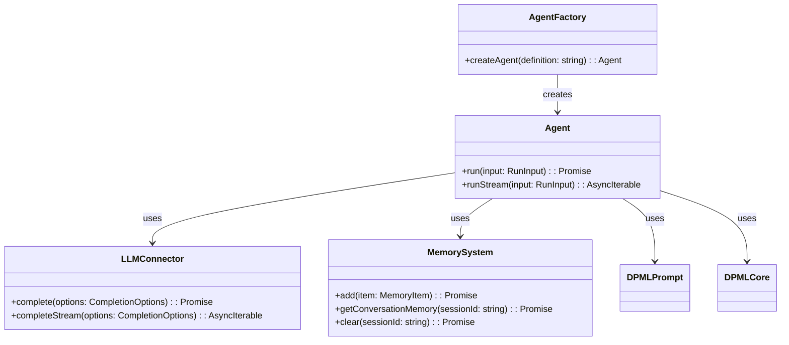

# @dpml/agent 设计文档

## 1. 概述

@dpml/agent包提供一个声明式框架，用于定义和构建基于LLM的智能代理。该包通过XML格式的定义文件，使开发者能够以声明式方式配置代理行为，简化智能代理的开发过程。

### 1.1 目标与愿景

- 提供简洁、声明式的代理定义方式
- 支持多种LLM后端和接口
- 实现配置与实现的有效分离
- 支持多轮对话和上下文管理
- 提供扩展机制支持高级功能

### 1.2 设计原则

- **领域边界明确**：与@dpml/core和@dpml/prompt包形成清晰的分层架构
- **声明式优先**：通过声明式方式定义代理，降低使用门槛
- **关注点分离**：代理定义、LLM集成、记忆管理等职责明确分离
- **扩展性**：灵活的架构支持未来功能扩展
- **渐进增强**：基础功能简单可用，高级功能渐进实现

## 2. 系统架构

### 2.1 整体架构

下图展示了@dpml/agent的核心组件及其关系：



### 2.2 包依赖关系

@dpml/agent包建立在DPML的分层架构之上：


- **@dpml/core**：提供基础设施，包括文档模型、解析、处理和转换功能
- **@dpml/prompt**：提供提示词处理能力
- **@dpml/agent**：基于上述两个包构建代理功能

### 2.3 模块职责

#### 2.3.1 核心模块职责

- **AgentFactory**: 
  - 创建Agent实例
  - 配置代理组件
  - 协调标签处理

- **Agent**: 
  - 管理代理生命周期
  - 处理输入和生成输出
  - 协调LLM和记忆子系统
  - 管理状态和事件

- **LLMConnector**: 
  - 抽象LLM交互接口
  - 管理模型配置和认证
  - 处理请求和响应

- **MemorySystem**: 
  - 管理对话上下文和会话状态
  - 提供记忆存储和检索接口
  - 支持基本的上下文窗口管理

#### 2.3.2 职责边界

| 职责 | Core包 | Prompt包 | Agent包 | 应用层 |
|------|-------|---------|--------|--------|
| XML解析与文档模型 | ✅ | ❌ | ❌ | ❌ |
| 提示词处理 | ❌ | ✅ | ❌ | ❌ |
| 代理标签处理 | ❌ | ❌ | ✅ | ❌ |
| 代理运行时和状态管理 | ❌ | ❌ | ✅ | ❌ |
| 上下文管理 | ❌ | ❌ | ✅ | ❌ |
| 应用特定逻辑 | ❌ | ❌ | ❌ | ✅ |

## 3. 核心概念

### 3.1 代理文档结构

代理文档使用@dpml/core提供的文档模型，通过XML格式定义代理。顶层结构如下：

```xml
<agent id="example-agent" version="1.0">
  <llm api-type="openai" model="gpt-4-turbo" />
  <prompt>
    你是一个有帮助的智能助手。
  </prompt>
</agent>
```

Agent包不重新定义文档模型，而是直接使用Core包提供的Node、Element、Document等类型。特定标签的语义和处理逻辑由Agent包的标签处理器提供。

### 3.2 核心标签体系

Agent包定义了以下核心标签，构成了完整的代理框架：

1. **`<agent>`** - 根标签，包含整个代理的定义 (详见[agent-tag-design.md](./agent-tag-design.md))
2. **`<llm>`** - 配置语言模型连接和参数 (详见[llm-tag-design.md](./llm-tag-design.md))
3. **`<prompt>`** - 定义系统提示词，委托给@dpml/prompt处理 (详见[prompt-tag-design.md](./prompt-tag-design.md))

每个标签都有特定的属性、嵌套规则和验证逻辑，详细的标签规范请参考各自的设计文档。

### 3.3 标签嵌套规则

标签嵌套遵循以下规则：
- `<agent>` 是根标签，必须是文档的顶层元素
- `<llm>` 和 `<prompt>` 是 `<agent>` 的必需直接子元素

嵌套规则图：


### 3.4 运行时状态模型

Agent运行时维护一个明确的状态模型，用于跟踪代理的执行状态：

```typescript
interface AgentState {
  // 基础状态
  id: string;
  status: 'idle' | 'thinking' | 'executing' | 'done';
  
  // 上下文状态
  conversation: Message[];
  metadata: Record<string, any>;
}
```

状态转换通过事件驱动的方式管理，确保状态一致性。

### 3.5 记忆系统抽象

Agent包提供灵活的记忆系统抽象，用于管理代理的上下文和长期记忆：

```typescript
/**
 * 记忆系统抽象接口
 * 提供通用的记忆管理能力，不限定具体实现方式
 */
interface MemorySystem {
  /**
   * 存储记忆
   * @param key 记忆标识
   * @param value 记忆内容
   * @param options 存储选项
   */
  store(key: string, value: any, options?: StoreOptions): Promise<void>;
  
  /**
   * 检索记忆
   * @param query 检索条件
   * @param options 检索选项
   */
  retrieve(query: MemoryQuery, options?: RetrieveOptions): Promise<any>;
  
  /**
   * 清除记忆
   * @param filter 清除条件
   */
  clear(filter?: ClearFilter): Promise<void>;
}

/**
 * 记忆存储选项
 */
interface StoreOptions {
  // 记忆类型
  type?: 'conversation' | 'knowledge' | 'state' | string;
  
  // 记忆持久性
  persistence?: 'session' | 'temporary' | 'permanent';
  
  // 元数据
  metadata?: Record<string, any>;
}

/**
 * 记忆检索查询
 */
type MemoryQuery = {
  // 可以是简单的会话ID
  sessionId?: string;
  
  // 或是复杂的结构化查询
  filter?: Record<string, any>;
  
  // 或是向量搜索查询
  vector?: number[];
  similarity?: number;
  
  // 或是时间范围查询
  timeRange?: {
    from?: Date | number;
    to?: Date | number;
  };
};

/**
 * 记忆检索选项
 */
interface RetrieveOptions {
  // 结果数量限制
  limit?: number;
  
  // 排序选项
  sort?: {
    field: string;
    order: 'asc' | 'desc';
  };
  
  // 投影（指定返回哪些字段）
  projection?: string[];
}

/**
 * 记忆清除过滤器
 */
type ClearFilter = {
  sessionId?: string;
  type?: string | string[];
  before?: Date | number;
  filter?: Record<string, any>;
};
```

这种灵活的抽象允许实现各种不同类型的记忆系统，包括但不限于：
- 简单的会话历史记忆
- 结构化知识存储
- 向量嵌入记忆
- 图结构记忆

## 4. 标签定义概述

每个核心标签都在独立文档中有详细规范，以下提供基本概述并区分Core包提供的通用属性和标签特有属性：

### 4.1 `<agent>` 标签

作为根标签，定义整个代理的基本属性和元数据。

#### 核心属性 (由@dpml/core提供):
- **id**: 唯一标识符，用于引用和复用（Core通用属性）
- **version**: 版本号（Core通用属性）
- **extends**: 继承另一个代理定义，由Core包的继承处理机制实现（Core通用属性）

#### 标签特有属性:
- 当前版本未定义特有属性，保持简洁设计

详细规范请参考 [agent-tag-design.md](./agent-tag-design.md)。

### 4.2 `<llm>` 标签

定义大语言模型的连接方式和参数配置。

#### 核心属性 (由@dpml/core提供):
- **id**: 可选的唯一标识符（Core通用属性）

#### 标签特有属性:
- **api-type**: API规范/协议类型
- **api-url**: API端点URL
- **model**: 模型标识符
- **key-env**: 存储API密钥的环境变量名

详细规范请参考 [llm-tag-design.md](./llm-tag-design.md)。

### 4.3 `<prompt>` 标签

定义代理的系统提示词，委托给@dpml/prompt包处理。

#### 核心属性 (由@dpml/core提供):
- **id**: 可选的唯一标识符（Core通用属性）
- **extends**: 继承其他提示词定义，由Core包的继承处理机制实现（Core通用属性）

#### 标签特有属性:
- 提示词特有属性由@dpml/prompt包定义和处理

详细规范请参考 [prompt-tag-design.md](./prompt-tag-design.md)。

## 5. 记忆管理

### 5.1 记忆系统设计原则

Agent包的记忆系统设计遵循以下原则：

1. **抽象优先**：定义通用接口，不绑定特定实现
2. **多样性支持**：支持多种记忆类型和存储方式
3. **查询灵活性**：提供丰富的查询能力，适应不同场景
4. **扩展性**：为高级记忆功能预留扩展空间

### 5.2 记忆系统实现示例

#### 5.2.1 会话记忆实现

最基本的会话记忆实现，用于管理多轮对话历史：

```typescript
/**
 * 会话记忆项
 */
interface ConversationMemoryItem {
  id: string;
  content: string;
  role: 'user' | 'assistant' | 'system';
  timestamp: number;
  metadata?: Record<string, any>;
}

/**
 * 简单会话记忆系统
 */
class ConversationMemorySystem implements MemorySystem {
  private sessions: Map<string, ConversationMemoryItem[]> = new Map();
  
  async store(key: string, value: ConversationMemoryItem, options?: StoreOptions): Promise<void> {
    const sessionId = key || 'default';
    if (!this.sessions.has(sessionId)) {
      this.sessions.set(sessionId, []);
    }
    const session = this.sessions.get(sessionId);
    session.push(value);
  }
  
  async retrieve(query: MemoryQuery, options?: RetrieveOptions): Promise<ConversationMemoryItem[]> {
    const sessionId = query.sessionId || 'default';
    const limit = options?.limit || 10;
    
    const sessionMemory = this.sessions.get(sessionId) || [];
    
    // 应用筛选条件
    let result = sessionMemory;
    if (query.filter) {
      result = this.applyFilter(result, query.filter);
    }
    
    // 应用排序（默认按时间戳降序）
    result = this.applySort(result, options?.sort);
    
    // 应用数量限制
    if (result.length > limit) {
      result = result.slice(-limit);
    }
    
    return result;
  }
  
  async clear(filter?: ClearFilter): Promise<void> {
    if (!filter) {
      // 清除所有会话
      this.sessions.clear();
      return;
    }
    
    if (filter.sessionId) {
      // 清除特定会话
      this.sessions.delete(filter.sessionId);
    }
    
    // 其他复杂清除逻辑...
  }
  
  private applyFilter(items: ConversationMemoryItem[], filter: Record<string, any>): ConversationMemoryItem[] {
    // 简单实现，实际系统可能更复杂
    return items.filter(item => {
      for (const [key, value] of Object.entries(filter)) {
        if (key === 'metadata') {
          for (const [metaKey, metaValue] of Object.entries(value)) {
            if (item.metadata?.[metaKey] !== metaValue) return false;
          }
        } else if (item[key] !== value) {
          return false;
        }
      }
      return true;
    });
  }
  
  private applySort(items: ConversationMemoryItem[], sort?: {field: string, order: 'asc' | 'desc'}): ConversationMemoryItem[] {
    if (!sort) {
      // 默认按时间戳排序
      return [...items].sort((a, b) => a.timestamp - b.timestamp);
    }
    
    return [...items].sort((a, b) => {
      const aValue = a[sort.field];
      const bValue = b[sort.field];
      
      if (sort.order === 'asc') {
        return aValue < bValue ? -1 : aValue > bValue ? 1 : 0;
      } else {
        return aValue > bValue ? -1 : aValue < bValue ? 1 : 0;
      }
    });
  }
}
```

#### 5.2.2 向量记忆系统

支持语义搜索的向量记忆系统示例：

```typescript
/**
 * 向量记忆项
 */
interface VectorMemoryItem {
  id: string;
  content: string;
  embedding: number[];
  metadata?: Record<string, any>;
}

/**
 * 向量记忆系统
 * 适用于语义搜索和相似性查询场景
 */
class VectorMemorySystem implements MemorySystem {
  private items: VectorMemoryItem[] = [];
  private embedder: (text: string) => Promise<number[]>;
  
  constructor(embedder: (text: string) => Promise<number[]>) {
    this.embedder = embedder;
  }
  
  async store(key: string, value: {content: string, metadata?: Record<string, any>}): Promise<void> {
    // 生成嵌入向量
    const embedding = await this.embedder(value.content);
    
    // 存储记忆项
    this.items.push({
      id: key,
      content: value.content,
      embedding,
      metadata: value.metadata
    });
  }
  
  async retrieve(query: MemoryQuery): Promise<VectorMemoryItem[]> {
    if (!query.vector) {
      // 如果没有提供向量，尝试从文本生成
      if (query.filter?.content) {
        query.vector = await this.embedder(query.filter.content);
      } else {
        throw new Error('Vector query requires either a vector or content to embed');
      }
    }
    
    // 计算相似度并排序
    const limit = query.limit || 5;
    const threshold = query.similarity || 0.7;
    
    const results = this.items
      .map(item => ({
        item,
        similarity: this.cosineSimilarity(item.embedding, query.vector)
      }))
      .filter(result => result.similarity >= threshold)
      .sort((a, b) => b.similarity - a.similarity)
      .slice(0, limit)
      .map(result => result.item);
      
    return results;
  }
  
  async clear(filter?: ClearFilter): Promise<void> {
    if (!filter) {
      this.items = [];
      return;
    }
    
    // 应用筛选条件
    this.items = this.items.filter(item => {
      if (filter.filter) {
        // 检查元数据匹配
        for (const [key, value] of Object.entries(filter.filter)) {
          if (item.metadata?.[key] !== value) return true;
        }
        return false;
      }
      return true;
    });
  }
  
  private cosineSimilarity(a: number[], b: number[]): number {
    // 计算余弦相似度
    let dotProduct = 0;
    let mA = 0;
    let mB = 0;
    
    for (let i = 0; i < a.length; i++) {
      dotProduct += a[i] * b[i];
      mA += a[i] * a[i];
      mB += b[i] * b[i];
    }
    
    mA = Math.sqrt(mA);
    mB = Math.sqrt(mB);
    
    return dotProduct / (mA * mB);
  }
}
```

### 5.3 记忆系统组合

代理可以使用多个记忆系统的组合，处理不同类型的记忆需求：

```typescript
/**
 * 组合记忆系统
 * 整合多个专门的记忆系统，根据记忆类型路由到合适的系统
 */
class CompositeMemorySystem implements MemorySystem {
  private memorySystems: Map<string, MemorySystem> = new Map();
  
  constructor(systems: Record<string, MemorySystem>) {
    for (const [type, system] of Object.entries(systems)) {
      this.memorySystems.set(type, system);
    }
  }
  
  async store(key: string, value: any, options?: StoreOptions): Promise<void> {
    const type = options?.type || 'default';
    const system = this.getSystemForType(type);
    await system.store(key, value, options);
  }
  
  async retrieve(query: MemoryQuery, options?: RetrieveOptions): Promise<any> {
    const type = query.type || 'default';
    const system = this.getSystemForType(type);
    return system.retrieve(query, options);
  }
  
  async clear(filter?: ClearFilter): Promise<void> {
    if (!filter?.type) {
      // 清除所有系统
      for (const system of this.memorySystems.values()) {
        await system.clear(filter);
      }
      return;
    }
    
    // 清除特定类型的系统
    const types = Array.isArray(filter.type) ? filter.type : [filter.type];
    for (const type of types) {
      const system = this.memorySystems.get(type);
      if (system) {
        await system.clear(filter);
      }
    }
  }
  
  private getSystemForType(type: string): MemorySystem {
    const system = this.memorySystems.get(type);
    if (!system) {
      throw new Error(`No memory system registered for type: ${type}`);
    }
    return system;
  }
}
```

### 5.4 上下文构建

基于灵活的记忆系统构建LLM上下文：

```typescript
/**
 * 构建LLM上下文
 */
async function buildLLMContext(memorySystem: MemorySystem, systemPrompt: string, options: ContextBuildOptions): Promise<LLMContext> {
  // 检索会话历史
  const conversationItems = await memorySystem.retrieve({
    sessionId: options.sessionId,
    type: 'conversation'
  }, { limit: options.historyLimit || 10 });
  
  // 检索相关知识（如果需要）
  let knowledgeItems = [];
  if (options.includeKnowledge && options.currentInput) {
    knowledgeItems = await memorySystem.retrieve({
      type: 'knowledge',
      filter: { content: options.currentInput },
      vector: options.inputEmbedding
    }, { limit: options.knowledgeLimit || 5 });
  }
  
  // 构建消息数组
  const messages = [
    // 系统提示
    {
      role: 'system',
      content: systemPrompt
    },
    
    // 添加知识上下文（如果有）
    ...(knowledgeItems.length > 0 ? [{
      role: 'system',
      content: `相关上下文信息:\n${knowledgeItems.map(item => item.content).join('\n\n')}`
    }] : []),
    
    // 会话历史
    ...conversationItems.map(item => ({
      role: item.role,
      content: item.content
    }))
  ];
  
  return { messages };
}

interface ContextBuildOptions {
  sessionId: string;
  historyLimit?: number;
  includeKnowledge?: boolean;
  knowledgeLimit?: number;
  currentInput?: string;
  inputEmbedding?: number[];
}
```

## 6. 继承机制

### 6.1 代理继承原理

代理定义支持通过`extends`属性继承其他代理的内容和属性，这一功能利用@dpml/core的继承处理机制实现：

```xml
<!-- 基础代理定义 -->
<agent id="base-assistant">
  <llm 
    api-type="openai" 
    model="gpt-4-turbo" 
    key-env="OPENAI_API_KEY"
  />
  
  <prompt>
    你是一个有帮助的助手。
  </prompt>
</agent>

<!-- 继承和扩展代理 -->
<agent id="specialized-assistant" extends="./base-assistant.dpml">
  <prompt>
    你是一个专注于科学问题的助手，擅长解释复杂概念。
  </prompt>
</agent>
```

### 6.2 继承规则

Agent包利用Core包提供的继承处理机制，遵循以下规则：

1. **属性继承**：子标签可以继承父标签的属性，子标签的同名属性会覆盖父标签
2. **子标签继承**：
   - 如果子代理定义了父代理没有的子标签，则添加该子标签
   - 如果子代理定义了父代理已有的子标签，则覆盖该子标签
   - 如果子代理未定义父代理已有的子标签，则继承父代理的子标签
3. **跨文件继承**：支持通过路径引用其他文件中的代理定义
4. **多级继承**：支持继承链，子代理可以继承父代理，父代理继承祖父代理

### 6.3 跨文件继承

支持从其他文件继承代理定义：

```xml
<!-- 从本地文件继承 -->
<agent id="research-assistant" extends="./templates/base-assistant.dpml">
  <!-- 覆盖或添加子标签 -->
</agent>

<!-- 从远程文件继承 -->
<agent id="customer-service" extends="https://example.com/templates/cs-agent.dpml">
  <!-- 覆盖或添加子标签 -->
</agent>
```

## 7. 标签处理器设计

### 7.1 标签定义与注册

Agent包通过TagRegistry注册特定标签及其处理器，确保XML解析和处理过程中能够正确识别和处理标签：

```typescript
/**
 * 代理模块标签注册
 */
export function registerAgentTags(registry: TagRegistry): void {
  // 注册agent标签
  registry.registerTag({
    name: 'agent',
    allowedParents: [], // 顶层标签，无父标签限制
    allowedChildren: ['llm', 'prompt'], // 允许的子标签
    requiredAttributes: ['id'], // 必需属性
    optionalAttributes: ['version', 'extends'], // 可选属性
    attributeTypes: { // 属性类型定义
      id: 'string',
      version: 'string',
      extends: 'string'
    },
    validator: validateAgentTag // 自定义验证函数
  });

  // 注册llm标签
  registry.registerTag({
    name: 'llm',
    allowedParents: ['agent'], // 只能在agent标签内
    allowedChildren: [], // 无子标签
    requiredAttributes: ['api-type', 'model'], // 必需属性
    optionalAttributes: ['api-url', 'key-env', 'temperature'], // 可选属性
    attributeTypes: {
      'api-type': 'string',
      'model': 'string',
      'api-url': 'string',
      'key-env': 'string',
      'temperature': 'number'
    },
    validator: validateLLMTag
  });

  // prompt标签委托给@dpml/prompt包处理
  // 这里仅定义基本结构约束
  registry.registerTag({
    name: 'prompt',
    allowedParents: ['agent'],
    allowedChildren: [], // 内部结构由prompt包处理
    optionalAttributes: ['extends'],
    attributeTypes: {
      'extends': 'string'
    }
  });
}
```

### 7.2 标签验证规则

每个标签包含自定义的验证规则，确保标签结构和属性符合要求：

```typescript
/**
 * agent标签验证函数
 */
function validateAgentTag(element: Element, context: ValidationContext): ValidationResult {
  const errors: ValidationError[] = [];
  const warnings: ValidationWarning[] = [];
  
  // 验证ID格式
  const id = element.attributes.id;
  if (id && !/^[a-z0-9-_]+$/i.test(id)) {
    errors.push({
      code: 'INVALID_ID_FORMAT',
      message: 'Agent ID只能包含字母、数字、短横线和下划线',
      element
    });
  }
  
  // 验证是否缺少必要的子标签
  const hasLLM = element.children.some(child => 
    isElement(child) && child.tagName === 'llm'
  );
  
  if (!hasLLM) {
    errors.push({
      code: 'MISSING_REQUIRED_CHILD',
      message: 'Agent标签必须包含llm子标签',
      element
    });
  }
  
  const hasPrompt = element.children.some(child => 
    isElement(child) && child.tagName === 'prompt'
  );
  
  if (!hasPrompt) {
    errors.push({
      code: 'MISSING_REQUIRED_CHILD',
      message: 'Agent标签必须包含prompt子标签',
      element
    });
  }
  
  return { errors, warnings };
}

/**
 * llm标签验证函数
 */
function validateLLMTag(element: Element, context: ValidationContext): ValidationResult {
  const errors: ValidationError[] = [];
  const warnings: ValidationWarning[] = [];
  
  // 验证api-type是否为支持的类型
  const apiType = element.attributes['api-type'];
  const supportedApiTypes = ['openai', 'anthropic', 'azure', 'mistral', 'custom'];
  
  if (apiType && !supportedApiTypes.includes(apiType)) {
    warnings.push({
      code: 'UNSUPPORTED_API_TYPE',
      message: `不支持的API类型: ${apiType}。支持的类型: ${supportedApiTypes.join(', ')}`,
      element
    });
  }
  
  // 检查是否缺少API密钥环境变量
  if (!element.attributes['key-env']) {
    warnings.push({
      code: 'MISSING_KEY_ENV',
      message: '建议设置key-env属性以指定API密钥的环境变量',
      element
    });
  }
  
  return { errors, warnings };
}
```

### 7.3 标签系统集成

Agent包集成Core包提供的标签系统，通过以下机制实现标签定义和处理：

1. **初始化标签注册表**：创建时从Core包获取TagRegistry实例
2. **注册特定标签**：调用registerAgentTags注册Agent包特定标签
3. **流程集成**：确保Agent处理流程使用Core包的解析和处理功能

```typescript
/**
 * 标签系统初始化
 */
export function initializeTagSystem(): TagRegistry {
  // 获取标签注册表实例
  const registry = new TagRegistry();
  
  // 注册Agent包特定标签
  registerAgentTags(registry);
  
  return registry;
}

/**
 * Agent工厂创建
 */
export function createAgentFactory(options?: AgentFactoryOptions): AgentFactory {
  // 初始化标签系统
  const tagRegistry = options?.tagRegistry || initializeTagSystem();
  
  // 创建解析器适配器
  const parserAdapter = new DpmlAdapter({
    tagRegistry
  });
  
  // 创建处理器
  const processor = new DefaultProcessor({
    tagRegistry,
    // 其他处理器选项...
  });
  
  // 创建转换器
  const transformer = new AgentTransformer();
  
  return new AgentFactoryImpl({
    parserAdapter,
    processor,
    transformer,
    // 其他工厂选项...
  });
}
```

### 7.4 标签处理架构

Agent包利用@dpml/core提供的处理器架构，实现特定于代理的标签处理逻辑：


每个标签处理器负责：
- 验证标签的属性和结构
- 处理标签的继承和引用
- 实现标签特定的转换逻辑

## 8. 代理创建流程

### 8.1 创建流程

创建代理的过程使用@dpml/core的解析、处理和转换功能：


### 8.2 实现代码

```typescript
export async function createAgent(definition: string): Promise<Agent> {
  // 使用@dpml/core的API
  const document = await parse(definition);
  const processedDocument = await process(document);
  
  // 使用Agent包的转换器
  const transformer = new AgentTransformer();
  const config = transformer.transform(processedDocument);
  
  // 创建代理实例
  return instantiateAgent(config);
}

function instantiateAgent(config: AgentConfig): Agent {
  // 创建LLM连接器
  const llmConnector = createLLMConnector(config.llm);
  
  // 创建记忆系统
  const memorySystem = new SimpleContextMemory();
  
  // 创建并返回代理实例
  return new AgentImpl({
    id: config.id,
    version: config.version,
    llmConnector,
    memorySystem,
    prompt: config.prompt
  });
}
```

## 9. API设计

### 9.1 公共API

Agent包提供以下核心API：

```typescript
/**
 * 创建代理实例
 */
function createAgent(definition: string): Promise<Agent>;

/**
 * 代理接口
 */
interface Agent {
  /**
   * 代理标识符
   */
  readonly id: string;
  
  /**
   * 代理版本
   */
  readonly version: string;
  
  /**
   * 运行代理
   */
  run(input: RunInput): Promise<RunOutput>;
  
  /**
   * 流式运行代理
   */
  runStream(input: RunInput): AsyncIterable<OutputChunk>;
}

/**
 * 运行输入
 */
interface RunInput {
  /**
   * 用户输入文本
   */
  input: string;
  
  /**
   * 会话ID，用于多轮对话
   */
  sessionId?: string;
  
  /**
   * 额外元数据
   */
  metadata?: Record<string, any>;
}

/**
 * 运行输出
 */
interface RunOutput {
  /**
   * 代理输出文本
   */
  output: string;
  
  /**
   * 使用的令牌数量
   */
  usage?: {
    promptTokens: number;
    completionTokens: number;
    totalTokens: number;
  };
  
  /**
   * 元数据
   */
  metadata?: Record<string, any>;
}

/**
 * 输出块
 */
type OutputChunk = {
  /**
   * 块类型
   */
  type: 'thinking' | 'output' | 'error';
  
  /**
   * 块内容
   */
  content: string;
  
  /**
   * 块元数据
   */
  metadata?: Record<string, any>;
};
```

### 9.2 使用示例

```typescript
// 创建并使用代理
async function main() {
  try {
    // 创建代理
    const agent = await createAgent(`
      <agent id="conversation-agent" version="1.0">
        <llm api-type="openai" model="gpt-4-turbo" key-env="OPENAI_API_KEY" />
        <prompt>
          你是一个有帮助的对话助手，擅长回答问题并提供信息。
        </prompt>
      </agent>
    `);
    
    // 使用会话ID跟踪对话
    const sessionId = 'user-123';
    
    // 第一轮对话
    const result1 = await agent.run({
      input: '中国历史上有哪些重要的朝代？',
      sessionId
    });
    
    console.log('代理回复:', result1.output);
    
    // 第二轮对话 (引用上一轮对话)
    const result2 = await agent.run({
      input: '在你刚才提到的历史中，哪个时期最重要？',
      sessionId // 同一会话，代理能够记住前一轮对话内容
    });
    
    console.log('代理回复:', result2.output);
    
    // 流式运行示例
    console.log('流式运行示例:');
    
    for await (const chunk of agent.runStream({ 
      input: '什么是深度学习？',
      sessionId
    })) {
      if (chunk.type === 'thinking') {
        process.stdout.write('思考中...');
      } else if (chunk.type === 'output') {
        process.stdout.write(chunk.content);
      }
    }
    
  } catch (error) {
    console.error('运行代理时出错:', error);
  }
}

main();
```

### 10.1 处理继承的完整示例

```typescript
// 创建继承自基础模板的专业化代理
async function createSpecializedAgent() {
  try {
    // 模板路径
    const baseTemplatePath = './templates/base-agent.dpml';
    
    // 专业化代理定义
    const definition = `
      <agent id="science-advisor" extends="${baseTemplatePath}">
        <prompt>
          你是一位专业的科学顾问，擅长解释复杂的科学概念。
          始终基于科学事实提供清晰、准确的解释。
        </prompt>
      </agent>
    `;
    
    // base-agent.dpml内容:
    // <agent id="base-assistant">
    //   <llm api-type="openai" api-url="https://api.openai.com/v1" model="gpt-4-turbo" key-env="OPENAI_API_KEY" />
    //   <prompt>你是一个通用助手，能够回答问题并提供帮助。</prompt>
    // </agent>
    
    // 创建代理
    const agent = await createAgent(definition);
    
    // 运行代理
    const result = await agent.run({
      input: '请解释量子纠缠的概念'
    });
    
    console.log('科学顾问回复:', result.output);
  } catch (error) {
    console.error('创建专业化代理时出错:', error);
  }
}

createSpecializedAgent();
```

## 11. 技术选择

### 11.1 关键技术决策

- **TypeScript**: 使用TypeScript强类型系统保障代码质量和开发体验
- **事件驱动架构**: 采用事件驱动设计，提高系统的可观察性和扩展性
- **组合优于继承**: 使用组合模式构建系统组件，而不是复杂的继承层次
- **接口优先设计**: 定义清晰的接口契约，实现可替换的组件
- **可测试性设计**: 依赖注入和模块化结构，便于单元测试和模拟

### 11.2 依赖管理

Agent包仅依赖必要的外部库：

- **@dpml/core**: 核心功能和基础设施
- **@dpml/prompt**: 提示词处理

对于LLM API调用，提供适配器，但不直接依赖特定SDK：

```typescript
// 适配器示例
class OpenAIAdapter implements LLMAdapter {
  async complete(options: AdapterOptions): Promise<AdapterResult> {
    // 依赖注入外部库，不直接依赖
    const openai = options.apiClient;
    
    // 调用API
    const response = await openai.chat.completions.create({
      model: options.model,
      messages: options.messages,
      temperature: options.temperature,
      // 其他参数...
    });
    
    // 转换为标准格式
    return {
      text: response.choices[0].message.content,
      usage: {
        promptTokens: response.usage.prompt_tokens,
        completionTokens: response.usage.completion_tokens,
        totalTokens: response.usage.total_tokens
      },
      metadata: {
        model: response.model,
        // 其他元数据...
      }
    };
  }
}
```

## 12. 演进计划

### 12.1 版本规划

- **0.1 (初始版本)**
  - 基础标签定义和解析
  - 核心Agent接口和运行时
  - 简单的LLM连接器
  - 基础上下文管理(简单记忆系统)

- **0.2 (功能扩展)**
  - 状态管理和事件系统
  - 流式处理支持
  - 完善的错误处理
  - 增强的记忆抽象

- **0.5 (功能完善)**
  - 功能完整的API
  - 增强型标签处理 
  - 更多模型支持
  - 增强型上下文管理

- **1.0 (生产就绪)**
  - 完整的文档和示例
  - 生产级别的稳定性保证
  - 工具和高级记忆系统支持

### 12.2 功能路线图

#### 短期目标 (0.x)

- 完善核心标签系统
- 提供流式处理
- 完善记忆接口抽象
- 添加事件监控系统

#### 中期目标 (1.x)

- 增加工具和能力系统
- 提供高级记忆管理支持
- 添加中间件系统
- 实现更多模型提供商支持

#### 长期目标 (2.x+)

- 支持多代理协作
- 实现认知架构和高级推理
- 提供专业领域能力包
- 增强安全和隐私功能

### 12.3 兼容性承诺

Agent包遵循语义化版本规范：

- **主版本**（x.0.0）：包含不向后兼容的API变更
- **次版本**（0.x.0）：包含向后兼容的功能新增
- **补丁版本**（0.0.x）：包含向后兼容的错误修复

核心承诺：
- 标签结构和属性保持稳定
- 公共API签名在次版本内保持不变
- 废弃的API至少在一个主版本周期内保留并发出警告

## 13. 总结

@dpml/agent包提供了一个基础框架，用于定义、创建和管理基于LLM的智能代理。通过声明式的XML格式，开发者可以清晰地定义代理的配置和行为，实现配置与实现的分离。

核心设计原则包括领域边界清晰、声明式定义、状态与行为分离等，这些原则共同保证了系统的可维护性、可扩展性和开发友好性。

Agent包构建在@dpml/core和@dpml/prompt包的基础上，充分利用这些包提供的解析、处理和转换功能，避免重复实现基础设施。标签系统相关的详细规范请参考各自的设计文档：
- [agent-tag-design.md](./agent-tag-design.md)
- [llm-tag-design.md](./llm-tag-design.md)
- [prompt-tag-design.md](./prompt-tag-design.md)

API设计着重简洁性和灵活性，提供了一系列核心方法和配置选项，支持同步和流式处理模式。事件系统使开发者能够监控代理的运行状态和行为，实现可观察性和可调试性。

记忆系统通过抽象接口实现关注点分离，确保上下文管理与LLM调用逻辑解耦，既保持当前设计简洁，又为未来功能扩展留下空间。 