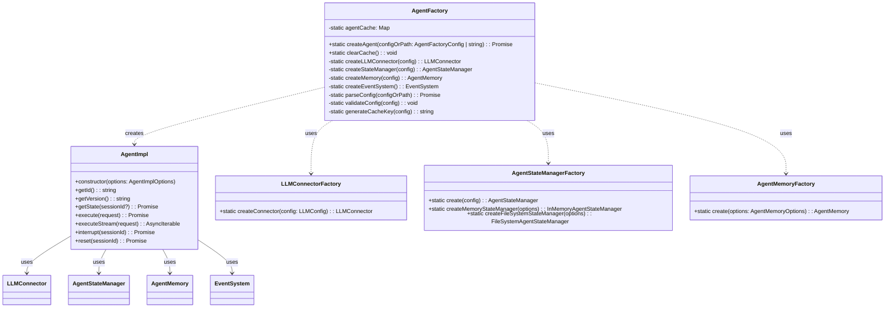
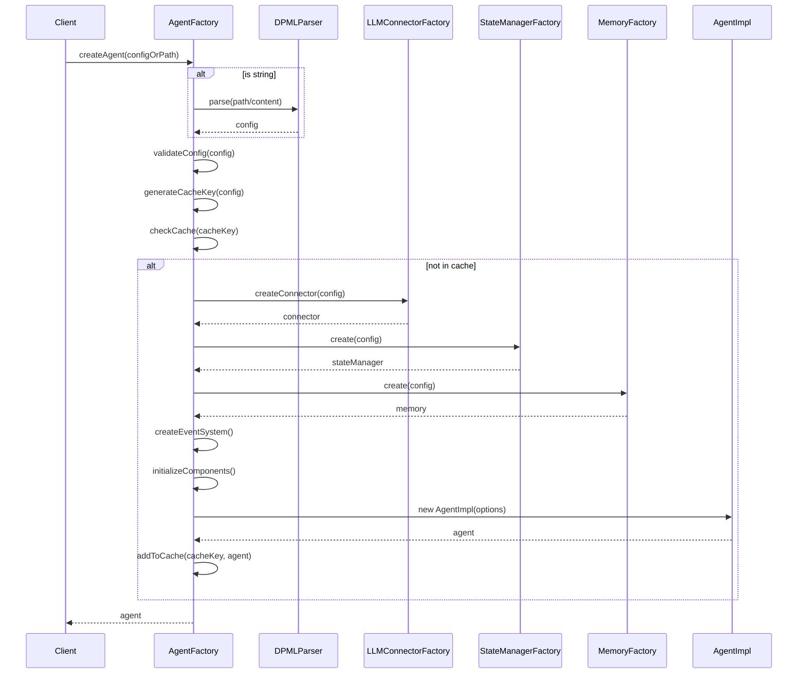

# AgentFactory 系统性开发设计

## 1. 设计目标

AgentFactory 的主要目标是创建功能完整的 Agent 实例，具体包括：

1. 支持从配置对象创建 Agent
2. 支持从 DPML 文件/内容创建 Agent
3. 创建和配置所有必要的组件
4. 通过依赖注入将组件传递给 AgentImpl
5. 提供缓存机制以提高性能
6. 提供清晰的错误处理

## 2. 架构设计

### 2.1 类图



### 2.2 流程图



## 3. 详细设计

### 3.1 AgentFactory 类

```typescript
export class AgentFactory {
  // 缓存已创建的 Agent 实例
  private static agentCache = new Map<string, Agent>();
  
  /**
   * 创建 Agent 实例
   * @param configOrPath 配置对象或 DPML 文件路径/内容
   * @returns Agent 实例
   */
  static async createAgent(configOrPath: AgentFactoryConfig | string): Promise<Agent> {
    try {
      // 1. 解析配置
      const config = await this.parseConfig(configOrPath);
      
      // 2. 验证配置
      this.validateConfig(config);
      
      // 3. 检查缓存
      const cacheKey = this.generateCacheKey(config);
      const cachedAgent = this.agentCache.get(cacheKey);
      if (cachedAgent) {
        return cachedAgent;
      }
      
      // 4. 创建组件
      const connector = this.createLLMConnector(config);
      const stateManager = this.createStateManager(config);
      const memory = this.createMemory(config);
      const eventSystem = this.createEventSystem();
      
      // 5. 初始化组件
      await stateManager.initialize();
      
      // 6. 创建 Agent 实例
      const agent = new AgentImpl({
        id: config.id,
        version: config.version,
        stateManager,
        memory,
        connector,
        eventSystem,
        executionConfig: config.executionConfig
      });
      
      // 7. 缓存 Agent 实例
      this.agentCache.set(cacheKey, agent);
      
      return agent;
    } catch (error) {
      // 处理错误
      throw this.handleError(error, configOrPath);
    }
  }
  
  /**
   * 清除缓存
   */
  static clearCache(): void {
    this.agentCache.clear();
  }
  
  /**
   * 解析配置
   * @param configOrPath 配置对象或 DPML 文件路径/内容
   * @returns 解析后的配置对象
   */
  private static async parseConfig(configOrPath: AgentFactoryConfig | string): Promise<AgentFactoryConfig> {
    // 如果是配置对象，直接返回
    if (typeof configOrPath !== 'string') {
      return configOrPath;
    }
    
    // 如果是文件路径，加载并解析文件
    if (configOrPath.endsWith('.dpml') || configOrPath.endsWith('.xml')) {
      return this.parseFromFile(configOrPath);
    }
    
    // 如果是 DPML 内容，直接解析
    return this.parseFromContent(configOrPath);
  }
  
  /**
   * 从文件解析配置
   * @param filePath 文件路径
   * @returns 解析后的配置对象
   */
  private static async parseFromFile(filePath: string): Promise<AgentFactoryConfig> {
    try {
      // 读取文件内容
      const fs = await import('fs/promises');
      const content = await fs.readFile(filePath, 'utf-8');
      
      // 解析 DPML 内容
      return this.parseFromContent(content);
    } catch (error) {
      throw new Error(`解析 DPML 文件失败: ${error.message}`);
    }
  }
  
  /**
   * 从 DPML 内容解析配置
   * @param content DPML 内容
   * @returns 解析后的配置对象
   */
  private static async parseFromContent(content: string): Promise<AgentFactoryConfig> {
    try {
      // 使用 DPML 核心包解析内容
      const { parse, process } = await import('@dpml/core');
      const parseResult = await parse(content);
      
      if (parseResult.errors.length > 0) {
        throw new Error(`解析 DPML 内容失败: ${parseResult.errors[0].message}`);
      }
      
      const processedDoc = await process(parseResult.ast);
      
      // 转换为配置对象
      return this.extractConfigFromDocument(processedDoc);
    } catch (error) {
      throw new Error(`解析 DPML 内容失败: ${error.message}`);
    }
  }
  
  /**
   * 从处理后的文档提取配置
   * @param document 处理后的文档
   * @returns 配置对象
   */
  private static extractConfigFromDocument(document: any): AgentFactoryConfig {
    // 查找 agent 元素
    const agentElement = this.findAgentElement(document);
    if (!agentElement) {
      throw new Error('DPML 文档中未找到 agent 元素');
    }
    
    // 提取基本属性
    const id = agentElement.attributes?.id || 'default-agent';
    const version = agentElement.attributes?.version || '1.0';
    
    // 提取 LLM 配置
    const llmConfig = this.extractLLMConfig(agentElement);
    
    // 提取系统提示
    const systemPrompt = this.extractSystemPrompt(agentElement);
    
    // 构建配置对象
    return {
      id,
      version,
      executionConfig: {
        defaultModel: llmConfig.model,
        apiType: llmConfig.apiType,
        apiUrl: llmConfig.apiUrl,
        keyEnv: llmConfig.keyEnv,
        systemPrompt
      }
    };
  }
  
  /**
   * 查找 agent 元素
   * @param document 处理后的文档
   * @returns agent 元素
   */
  private static findAgentElement(document: any): any {
    // 如果文档本身就是 agent 元素
    if (document.type === 'element' && document.tagName === 'agent') {
      return document;
    }
    
    // 如果文档是 document 节点，查找其子元素
    if (document.type === 'document' && Array.isArray(document.children)) {
      for (const child of document.children) {
        if (child.type === 'element' && child.tagName === 'agent') {
          return child;
        }
      }
    }
    
    return null;
  }
  
  /**
   * 提取 LLM 配置
   * @param agentElement agent 元素
   * @returns LLM 配置
   */
  private static extractLLMConfig(agentElement: any): any {
    // 查找 llm 元素
    const llmElement = agentElement.children.find(
      (child: any) => child.type === 'element' && child.tagName === 'llm'
    );
    
    if (!llmElement) {
      // 使用默认配置
      return {
        model: 'gpt-4',
        apiType: 'openai',
        apiUrl: 'https://api.openai.com/v1',
        keyEnv: 'OPENAI_API_KEY'
      };
    }
    
    // 提取配置
    return {
      model: llmElement.attributes?.model || 'gpt-4',
      apiType: llmElement.attributes?.['api-type'] || 'openai',
      apiUrl: llmElement.attributes?.['api-url'] || 'https://api.openai.com/v1',
      keyEnv: llmElement.attributes?.['key-env'] || 'OPENAI_API_KEY'
    };
  }
  
  /**
   * 提取系统提示
   * @param agentElement agent 元素
   * @returns 系统提示
   */
  private static extractSystemPrompt(agentElement: any): string {
    // 查找 prompt 元素
    const promptElement = agentElement.children.find(
      (child: any) => child.type === 'element' && child.tagName === 'prompt'
    );
    
    if (!promptElement) {
      return '你是一个有帮助的助手。';
    }
    
    // 提取内容
    if (Array.isArray(promptElement.children)) {
      const contentElements = promptElement.children.filter(
        (child: any) => child.type === 'content'
      );
      
      if (contentElements.length > 0) {
        return contentElements.map((el: any) => el.text).join('');
      }
    }
    
    return '你是一个有帮助的助手。';
  }
  
  /**
   * 验证配置对象
   * @param config 配置对象
   */
  private static validateConfig(config: AgentFactoryConfig): void {
    // 检查必填字段
    if (!config.id) {
      throw new Error('配置中必须包含 id 字段');
    }
    
    if (!config.version) {
      throw new Error('配置中必须包含 version 字段');
    }
    
    if (!config.executionConfig) {
      throw new Error('配置中必须包含 executionConfig 字段');
    }
    
    if (!config.executionConfig.defaultModel) {
      throw new Error('executionConfig 中必须包含 defaultModel 字段');
    }
    
    if (!config.executionConfig.apiType) {
      throw new Error('executionConfig 中必须包含 apiType 字段');
    }
    
    // 检查 API 类型是否支持
    const supportedApiTypes = ['openai', 'anthropic'];
    if (!supportedApiTypes.includes(config.executionConfig.apiType.toLowerCase())) {
      throw new Error(`不支持的 API 类型: ${config.executionConfig.apiType}，支持的类型: ${supportedApiTypes.join(', ')}`);
    }
  }
  
  /**
   * 生成缓存键
   * @param config 配置对象
   * @returns 缓存键
   */
  private static generateCacheKey(config: AgentFactoryConfig): string {
    return `${config.id}:${config.version}`;
  }
  
  /**
   * 创建 LLM 连接器
   * @param config 配置对象
   * @returns LLM 连接器
   */
  private static createLLMConnector(config: AgentFactoryConfig): LLMConnector {
    const llmConfig: LLMConfig = {
      apiType: config.executionConfig.apiType,
      apiUrl: config.executionConfig.apiUrl || this.getDefaultApiUrl(config.executionConfig.apiType),
      keyEnv: config.executionConfig.keyEnv || this.getDefaultKeyEnv(config.executionConfig.apiType)
    };
    
    return LLMConnectorFactory.createConnector(llmConfig);
  }
  
  /**
   * 创建状态管理器
   * @param config 配置对象
   * @returns 状态管理器
   */
  private static createStateManager(config: AgentFactoryConfig): AgentStateManager {
    const type = config.stateManagerType || 'memory';
    
    if (type === 'file') {
      if (!config.basePath) {
        throw new Error('使用文件状态管理器时必须提供 basePath');
      }
      
      return AgentStateManagerFactory.createFileSystemStateManager({
        agentId: config.id,
        storageDir: path.join(config.basePath, 'state')
      });
    } else {
      return AgentStateManagerFactory.createMemoryStateManager({
        agentId: config.id
      });
    }
  }
  
  /**
   * 创建记忆系统
   * @param config 配置对象
   * @returns 记忆系统
   */
  private static createMemory(config: AgentFactoryConfig): AgentMemory {
    const type = config.memoryType || 'memory';
    
    const memoryOptions: AgentMemoryOptions = {
      agentId: config.id,
      type
    };
    
    if (type === 'file') {
      if (!config.basePath) {
        throw new Error('使用文件记忆系统时必须提供 basePath');
      }
      
      memoryOptions.basePath = path.join(config.basePath, 'memory');
    }
    
    return AgentMemoryFactory.create(memoryOptions);
  }
  
  /**
   * 创建事件系统
   * @returns 事件系统
   */
  private static createEventSystem(): EventSystem {
    // 使用默认事件系统
    return getGlobalEventSystem();
  }
  
  /**
   * 获取默认 API URL
   * @param apiType API 类型
   * @returns 默认 API URL
   */
  private static getDefaultApiUrl(apiType: string): string {
    switch (apiType.toLowerCase()) {
      case 'openai':
        return 'https://api.openai.com/v1';
      case 'anthropic':
        return 'https://api.anthropic.com';
      default:
        throw new Error(`不支持的 API 类型: ${apiType}`);
    }
  }
  
  /**
   * 获取默认 API 密钥环境变量名
   * @param apiType API 类型
   * @returns 默认 API 密钥环境变量名
   */
  private static getDefaultKeyEnv(apiType: string): string {
    switch (apiType.toLowerCase()) {
      case 'openai':
        return 'OPENAI_API_KEY';
      case 'anthropic':
        return 'ANTHROPIC_API_KEY';
      default:
        throw new Error(`不支持的 API 类型: ${apiType}`);
    }
  }
  
  /**
   * 处理错误
   * @param error 错误对象
   * @param configOrPath 配置对象或 DPML 文件路径/内容
   * @returns 处理后的错误对象
   */
  private static handleError(error: any, configOrPath: AgentFactoryConfig | string): Error {
    // 如果已经是 Error 对象，添加上下文信息
    if (error instanceof Error) {
      error.message = `创建 Agent 失败: ${error.message}`;
      return error;
    }
    
    // 如果是字符串，创建 Error 对象
    if (typeof error === 'string') {
      return new Error(`创建 Agent 失败: ${error}`);
    }
    
    // 如果是其他类型，创建通用错误
    return new Error(`创建 Agent 失败: 未知错误`);
  }
}
```

## 4. 实现计划

### 4.1 实现阶段

1. **基础实现阶段**：
   - 实现 AgentFactory.createAgent 方法的基本功能
   - 实现组件创建方法
   - 实现缓存机制

2. **DPML 解析阶段**：
   - 实现从 DPML 文件/内容解析配置的功能
   - 实现配置验证功能

3. **错误处理阶段**：
   - 实现错误处理机制
   - 添加详细的错误信息

4. **优化阶段**：
   - 优化缓存机制
   - 优化性能
   - 添加日志

### 4.2 测试计划

1. **单元测试**：
   - 测试 AgentFactory.createAgent 方法
   - 测试组件创建方法
   - 测试配置验证功能
   - 测试错误处理机制

2. **集成测试**：
   - 测试从配置对象创建 Agent
   - 测试从 DPML 文件创建 Agent
   - 测试从 DPML 内容创建 Agent

3. **性能测试**：
   - 测试缓存机制
   - 测试大量 Agent 创建的性能

### 4.3 文档计划

1. **API 文档**：
   - 详细说明 AgentFactory.createAgent 方法的参数和返回值
   - 说明配置对象的结构和字段

2. **使用示例**：
   - 从配置对象创建 Agent 的示例
   - 从 DPML 文件创建 Agent 的示例
   - 从 DPML 内容创建 Agent 的示例

3. **错误处理指南**：
   - 说明可能出现的错误和解决方法

## 5. 扩展性考虑

### 5.1 支持更多 LLM 提供商

AgentFactory 设计支持扩展更多的 LLM 提供商。要添加新的提供商，需要：

1. 在 LLMConnectorFactory 中添加对新提供商的支持
2. 实现相应的 LLMConnector 子类
3. 更新 AgentFactory 中的 getDefaultApiUrl 和 getDefaultKeyEnv 方法

### 5.2 支持更多存储类型

AgentFactory 设计支持扩展更多的存储类型。要添加新的存储类型，需要：

1. 在 AgentStateManagerFactory 中添加对新存储类型的支持
2. 实现相应的 AgentStateManager 子类
3. 在 AgentMemoryFactory 中添加对新存储类型的支持
4. 实现相应的 AgentMemory 子类

### 5.3 支持更多配置选项

AgentFactory 设计支持扩展更多的配置选项。要添加新的配置选项，需要：

1. 更新 AgentFactoryConfig 接口
2. 在 AgentFactory 中添加对新配置选项的处理
3. 更新 DPML 解析逻辑以支持新的配置选项

## 6. 安全考虑

### 6.1 API 密钥管理

AgentFactory 使用环境变量来管理 API 密钥，而不是直接在代码或配置中存储密钥。这是一种安全的做法，但需要确保：

1. 环境变量的名称是可配置的
2. 提供明确的错误信息，当环境变量不存在时
3. 不要在日志中输出 API 密钥

### 6.2 文件路径安全

当处理文件路径时，需要确保：

1. 验证文件路径的安全性，防止路径遍历攻击
2. 使用 path.join 等安全的方法构建路径
3. 限制文件访问范围，只允许访问特定目录

### 6.3 输入验证

对所有输入进行验证，特别是：

1. 验证配置对象的结构和字段
2. 验证 DPML 内容的合法性
3. 验证文件路径的安全性

## 7. 性能考虑

### 7.1 缓存机制

AgentFactory 使用缓存机制来提高性能，但需要注意：

1. 缓存的生命周期管理
2. 缓存的大小限制
3. 缓存的失效策略

### 7.2 延迟加载

对于不是立即需要的组件，可以使用延迟加载来提高性能：

1. 延迟加载 DPML 解析器
2. 延迟加载文件系统模块
3. 延迟初始化组件

### 7.3 并发控制

当多个客户端同时创建 Agent 时，需要考虑并发控制：

1. 使用缓存键来避免重复创建
2. 使用锁机制来避免竞态条件
3. 限制并发创建的数量

## 8. 总结

AgentFactory 是 DPML Agent 包的核心组件，负责创建和配置 Agent 实例。它通过依赖注入模式将各种组件传递给 AgentImpl，使得 AgentImpl 可以专注于组件的使用和协调，而不需要关心组件的创建和配置。

AgentFactory 的设计考虑了扩展性、安全性和性能，可以满足各种使用场景的需求。通过实现这个设计，我们可以使 DPML Agent 包真正可用，为用户提供一个功能完整、易于使用的智能体框架。
