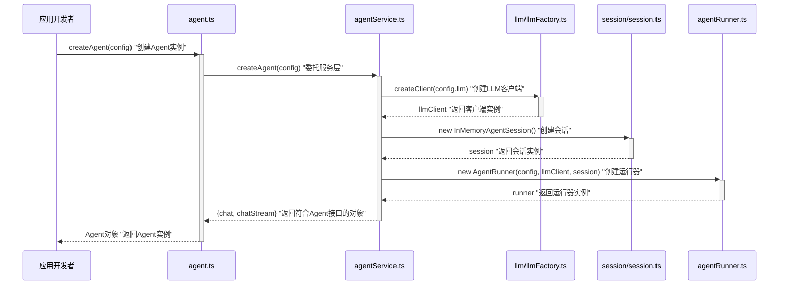
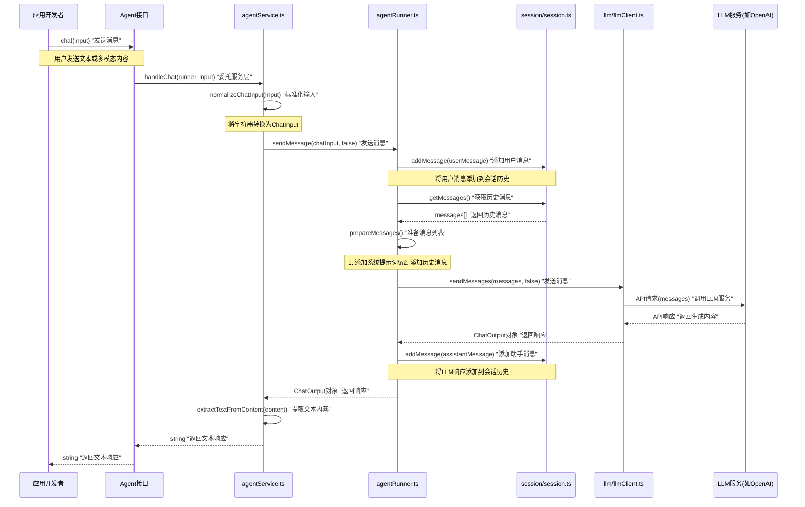
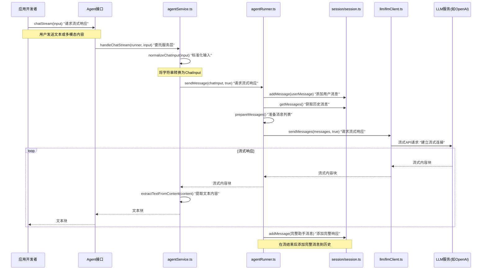

# DPML Agent设计文档

## 1. 概述

Agent模块是DPML的扩展包，用于创建和管理AI对话代理。它提供了一组简洁的API，使应用开发者能够通过DPML定义AI助手，并与大语言模型服务进行交互。Agent模块封装了LLM连接、提示词管理和会话追踪等功能，提供统一的交互界面。

### 1.1 设计目标

- **简洁API**：提供直观的接口作为Agent的统一入口点
- **解耦设计**：将核心交互流程与具体LLM实现分离
- **可扩展性**：支持多种LLM服务和未来的多模态交互
- **类型安全**：提供完全类型化的API和结果
- **职责隔离**：严格遵守分层架构，确保关注点分离

## 2. 核心设计理念

基于项目需求和架构规范，我们确立了以下核心设计理念：

1. **API薄层设计**：
   - API层保持极简，仅委托核心层功能
   - 避免在API层实现业务逻辑
   - 确保API易于理解和使用

2. **接口与实现分离**：
   - 明确定义Agent接口，与具体实现分开
   - 通过工厂创建符合接口的实例
   - 用户代码只依赖接口，不依赖实现细节

3. **会话状态管理**：
   - 将会话状态封装为独立组件
   - 提供不同的会话存储策略，如内存存储或持久化存储
   - 保持状态管理的一致性

4. **LLM适配器模式**：
   - 定义统一的LLM客户端接口
   - 支持多种LLM服务提供商
   - 隐藏不同LLM API的差异

5. **多模态支持**：
   - 设计支持文本和未来多模态内容的数据结构
   - 通过抽象内容表示实现格式无关的处理
   - 确保系统可以平滑扩展至图像、音频等内容类型

## 3. 系统架构

Agent模块严格遵循项目的分层架构：

1. **API层**：agent模块，提供createAgent函数
2. **Types层**：定义Agent接口和配置类型
3. **Core层**：实现agentService和相关组件，管理交互流程

模块结构:
```
agent/
  ├── api/
  │   └── agent.ts          # API入口，提供createAgent函数
  ├── types/
  │   ├── Agent.ts          # Agent接口定义
  │   ├── AgentConfig.ts    # 配置相关类型
  │   ├── Content.ts        # 内容表示相关类型
  │   └── errors.ts         # 错误类型
  └── core/
      ├── agentService.ts   # 顶层模块服务，创建Agent和处理请求
      ├── agentRunner.ts    # 顶层核心组件，处理消息发送和接收
      ├── types.ts          # 内部消息类型定义
      ├── session/          # 会话管理功能模块
      │   └── session.ts    # 会话管理接口和实现
      └── llm/              # LLM功能模块
          ├── llmFactory.ts # LLM客户端工厂
          ├── llmClient.ts  # LLM客户端接口
          └── openAiClient.ts # OpenAI实现
```

## 4. 组件设计

### 4.1 API设计

```typescript
// api/agent.ts
import { AgentConfig, Agent } from '../types';
import * as agentService from '../core/agentService';

/**
 * 创建Agent实例
 * 
 * 基于提供的配置创建一个符合Agent接口的实例，用于与LLM交互。
 * 使用闭包模式封装内部状态，提供简洁的交互接口。
 * 
 * @param config Agent配置信息
 * @returns 符合Agent接口的实例
 */
export function createAgent(config: AgentConfig): Agent {
  // 委托给agentService创建Agent实例
  return agentService.createAgent(config);
}
```

### 4.2 类型定义

```typescript
// types/Agent.ts
/**
 * Agent接口
 * 
 * 定义AI对话代理的标准交互方法。
 */
export interface Agent {
  /**
   * 发送消息并获取文本响应
   * @param input 文本消息或ChatInput对象
   * @returns 文本响应
   */
  chat(input: string | ChatInput): Promise<string>;
  
  /**
   * 发送消息并获取流式响应
   * @param input 文本消息或ChatInput对象
   * @returns 文本块的异步迭代器
   */
  chatStream(input: string | ChatInput): AsyncIterable<string>;
}

// types/AgentConfig.ts
/**
 * Agent配置
 * 
 * 定义创建Agent所需的配置信息。
 */
export interface AgentConfig {
  /**
   * LLM配置信息
   */
  readonly llm: LLMConfig;
  
  /**
   * 系统提示词，定义Agent的行为和能力
   */
  readonly prompt: string;
}

// types/LLMConfig.ts
/**
 * LLM配置
 * 
 * 定义连接LLM服务所需的配置信息。
 */
export interface LLMConfig {
  /**
   * API提供商类型，如"openai"、"anthropic"等
   */
  readonly apiType: string;
  
  /**
   * API端点URL，可选
   */
  readonly apiUrl?: string;
  
  /**
   * API密钥
   */
  readonly apiKey?: string;
  
  /**
   * 使用的模型名称
   */
  readonly model: string;
}

// types/Content.ts
/**
 * 内容类型
 */
export type ContentType = 'text' | 'image' | 'audio' | 'video' | 'file';

/**
 * 内容项
 * 
 * 表示多模态内容的统一接口。
 */
export interface ContentItem {
  /**
   * 内容类型
   */
  readonly type: ContentType;
  
  /**
   * 内容值，根据类型有不同的表示
   */
  readonly value: string | Uint8Array | Record<string, any>;
  
  /**
   * MIME类型，可选
   */
  readonly mimeType?: string;
}

/**
 * 内容
 * 
 * 表示单个内容项或内容项数组，提供灵活的内容表示方式。
 */
export type Content = ContentItem | ContentItem[];

// types/Chat.ts
/**
 * 聊天输入
 * 
 * 包含发送给Agent的输入内容，支持多模态。
 */
export interface ChatInput {
  /**
   * 内容，支持单个内容项或内容项数组
   */
  readonly content: Content;
}

/**
 * 聊天输出
 * 
 * 包含Agent的响应内容，支持多模态。
 */
export interface ChatOutput {
  /**
   * 内容，支持单个内容项或内容项数组
   */
  readonly content: Content;
}

// types/errors.ts
/**
 * Agent错误类型
 */
export enum AgentErrorType {
  /**
   * 配置错误
   */
  CONFIG = 'CONFIG',
  
  /**
   * LLM服务调用错误
   */
  LLM_SERVICE = 'LLM_SERVICE',
  
  /**
   * 内容处理错误
   */
  CONTENT = 'CONTENT',
  
  /**
   * 会话错误
   */
  SESSION = 'SESSION',
  
  /**
   * 未知错误
   */
  UNKNOWN = 'UNKNOWN'
}

/**
 * Agent错误
 * 
 * 统一的错误类，用于处理Agent模块中的所有错误。
 */
export class AgentError extends Error {
  /**
   * 错误类型
   */
  readonly type: AgentErrorType;
  
  /**
   * 错误码
   */
  readonly code: string;
  
  /**
   * 原始错误
   */
  readonly cause?: Error;
  
  /**
   * 创建Agent错误
   * 
   * @param message 错误消息
   * @param type 错误类型
   * @param code 错误码
   * @param cause 原始错误
   */
  constructor(
    message: string,
    type: AgentErrorType = AgentErrorType.UNKNOWN,
    code: string = 'AGENT_ERROR',
    cause?: Error
  ) {
    super(message);
    this.name = 'AgentError';
    this.type = type;
    this.code = code;
    this.cause = cause;
  }
}
```

### 4.3 Core层设计

```typescript
// core/types.ts
/**
 * 消息角色
 * 
 * 内部使用的消息角色枚举。
 */
export type Role = 'system' | 'user' | 'assistant';

/**
 * 消息
 * 
 * 表示对话中的一条消息，仅供内部使用。
 */
export interface Message {
  /**
   * 消息角色
   */
  readonly role: Role;
  
  /**
   * 消息内容，支持多模态
   */
  readonly content: Content;
}

// core/agentService.ts

/**
 * 创建符合Agent接口的实例
 * 
 * @param config Agent配置
 * @returns Agent实例
 */
export function createAgent(config: AgentConfig): Agent {
  // 创建LLM客户端
  const llmClient = createLLMClient(config.llm);
  
  // 创建会话管理器
  const session = new InMemoryAgentSession();
  
  // 创建AgentRunner实例
  const runner = new AgentRunner(config, llmClient, session);
  
  // 返回符合Agent接口的对象，使用闭包模式
  return {
    chat: (input: string | ChatInput) => handleChat(runner, input),
    chatStream: (input: string | ChatInput) => handleChatStream(runner, input)
  };
}

/**
 * 创建LLM客户端
 */
function createLLMClient(config: LLMConfig): LLMClient {
  // 委托给llm模块的工厂函数
  return llmFactory.createClient(config);
}

/**
 * 处理聊天请求
 */
async function handleChat(runner: AgentRunner, input: string | ChatInput): Promise<string> {
  try {
    // 标准化输入为ChatInput
    const chatInput = normalizeChatInput(input);
    
    // 发送消息并获取响应
    const response = await runner.sendMessage(chatInput, false);
    
    // 提取回复中的文本内容
    return extractTextFromContent(response.content);
  } catch (error) {
    // 已经是AgentError则直接抛出
    if (error instanceof AgentError) {
      throw error;
    }
    
    // 否则包装为AgentError
    throw new AgentError(
      `聊天请求处理失败: ${error.message}`,
      AgentErrorType.UNKNOWN,
      'CHAT_PROCESSING_ERROR',
      error
    );
  }
}

/**
 * 处理流式聊天请求
 */
async function* handleChatStream(runner: AgentRunner, input: string | ChatInput): AsyncIterable<string> {
  // 标准化输入为ChatInput
  const chatInput = normalizeChatInput(input);
  
  // 发送消息并获取流式响应
  const responseStream = runner.sendMessage(chatInput, true);
  
  if (Symbol.asyncIterator in responseStream) {
    for await (const chunk of responseStream as AsyncIterable<ChatOutput>) {
      // 提取每个块中的文本内容
      const textContent = extractTextFromContent(chunk.content);
      if (textContent) {
        yield textContent;
      }
    }
  }
}

/**
 * 将字符串或ChatInput标准化为ChatInput
 */
function normalizeChatInput(input: string | ChatInput): ChatInput {
  if (typeof input === 'string') {
    return {
      content: {
        type: 'text',
        value: input
      }
    };
  }
  return input;
}

/**
 * 从内容中提取文本
 */
function extractTextFromContent(content: Content): string {
  if (Array.isArray(content)) {
    // 寻找数组中的第一个文本内容
    const textItem = content.find(item => item.type === 'text');
    return textItem ? textItem.value as string : '';
  } else if (content.type === 'text') {
    // 直接返回文本内容
    return content.value as string;
  }
  return '';
}

// core/agentRunner.ts
import { AgentConfig, ChatInput, ChatOutput, Content } from '../types';
import { Message, Role } from './types';
import { AgentSession } from './session/session';
import { LLMClient } from './llm/llmClient';

/**
 * Agent运行器
 * 
 * 负责处理消息发送和接收的核心类。
 */
export class AgentRunner {
  private config: AgentConfig;
  private llmClient: LLMClient;
  private session: AgentSession;
  
  constructor(config: AgentConfig, llmClient: LLMClient, session: AgentSession) {
    this.config = config;
    this.llmClient = llmClient;
    this.session = session;
  }
  
  /**
   * 发送消息并获取响应
   * 
   * @param input 输入内容
   * @param stream 是否使用流式响应
   * @returns 响应内容或流式响应迭代器
   */
  public sendMessage(input: ChatInput, stream: boolean): Promise<ChatOutput> | AsyncIterable<ChatOutput> {
    // 创建用户消息
    const userMessage: Message = {
      role: 'user',
      content: input.content
    };
    
    // 添加到会话历史
    this.session.addMessage(userMessage);
    
    // 准备发送给LLM的消息列表
    const messages = this.prepareMessages();
    
    // 发送消息给LLM客户端
    return this.llmClient.sendMessages(messages, stream);
  }
  
  /**
   * 准备发送给LLM的消息列表
   */
  private prepareMessages(): Message[] {
    const messages: Message[] = [];
    
    // 添加系统提示
    if (this.config.prompt) {
      messages.push({
        role: 'system',
        content: {
          type: 'text',
          value: this.config.prompt
        }
      });
    }
    
    // 添加历史消息
    messages.push(...this.session.getMessages());
    
    return messages;
  }
}

// core/session/session.ts
import { Message } from '../types';

/**
 * 会话管理接口
 * 
 * 内部接口，用于管理对话历史。
 */
export interface AgentSession {
  /**
   * 添加消息到历史
   */
  addMessage(message: Message): void;
  
  /**
   * 获取所有历史消息
   */
  getMessages(): ReadonlyArray<Message>;
}

/**
 * 内存会话实现
 */
export class InMemoryAgentSession implements AgentSession {
  private messages: Message[] = [];
  private capacity: number;
  
  constructor(capacity: number = 100) {
    this.capacity = capacity;
  }
  
  public addMessage(message: Message): void {
    this.messages.push(message);
    
    // 如果超出容量，删除最早的消息
    if (this.messages.length > this.capacity) {
      this.messages.shift();
    }
  }
  
  public getMessages(): ReadonlyArray<Message> {
    return [...this.messages];
  }
}

// core/llm/llmFactory.ts
import { LLMConfig } from '../../types';
import { LLMClient } from './llmClient';
import { OpenAiClient } from './openAiClient';
import { AnthropicClient } from './anthropicClient';

/**
 * LLM客户端工厂
 */
export function createClient(config: LLMConfig): LLMClient {
  switch (config.apiType) {
    case 'openai':
      return new OpenAiClient(config);
    case 'anthropic':
      return new AnthropicClient(config);
    default:
      throw new Error(`Unsupported API type: ${config.apiType}`);
  }
}

// core/llm/llmClient.ts
import { ChatOutput } from '../../types';
import { Message } from '../types';

/**
 * LLM客户端接口
 */
export interface LLMClient {
  /**
   * 发送消息并获取响应
   * 
   * @param messages 消息列表
   * @param stream 是否使用流式响应
   * @returns 响应内容或流式响应迭代器
   */
  sendMessages(messages: Message[], stream: boolean): Promise<ChatOutput> | AsyncIterable<ChatOutput>;
}

// core/llm/openAiClient.ts
import { LLMConfig, ChatOutput, ContentItem, AgentError, AgentErrorType } from '../../types';
import { LLMClient } from './llmClient';
import { Message } from '../types';

/**
 * OpenAI客户端实现
 */
export class OpenAiClient implements LLMClient {
  private apiKey: string;
  private apiUrl: string;
  private model: string;
  
  constructor(config: LLMConfig) {
    this.apiKey = config.apiKey || '';
    this.apiUrl = config.apiUrl || 'https://api.openai.com/v1';
    this.model = config.model;
  }
  
  public async sendMessages(messages: Message[], stream: boolean): Promise<ChatOutput> | AsyncIterable<ChatOutput> {
    try {
      // 转换为OpenAI格式的消息
      const openaiMessages = this.convertToOpenAIMessages(messages);
      
      // 选择同步或流式API
      if (stream) {
        return this.streamMessages(openaiMessages);
      } else {
        return this.sendMessagesSync(openaiMessages);
      }
    } catch (error) {
      // 将底层错误包装为AgentError
      throw new AgentError(
        `LLM服务调用失败: ${error.message}`,
        AgentErrorType.LLM_SERVICE,
        'LLM_API_ERROR',
        error
      );
    }
  }
  
  private async sendMessagesSync(openaiMessages: any[]): Promise<ChatOutput> {
    // 实现OpenAI API调用
    // ...
    
    // 返回结果
    return {
      content: {
        type: 'text',
        value: "模拟的OpenAI响应"
      }
    };
  }
  
  private async *streamMessages(openaiMessages: any[]): AsyncIterable<ChatOutput> {
    // 实现OpenAI流式API调用
    // ...
    
    // 模拟流式响应
    for (let i = 0; i < 5; i++) {
      yield {
        content: {
          type: 'text',
          value: `流式响应片段 ${i+1}`
        }
      };
      await new Promise(resolve => setTimeout(resolve, 100));
    }
  }
  
  private convertToOpenAIMessages(messages: Message[]): any[] {
    // 转换消息格式为OpenAI API格式
    return messages.map(msg => {
      return {
        role: msg.role,
        content: this.convertContent(msg.content)
      };
    });
  }
  
  private convertContent(content: ContentItem | ContentItem[]): any {
    // 处理多模态内容转换为OpenAI格式
    if (Array.isArray(content)) {
      // OpenAI支持内容数组，可以直接转换
      return content.map(item => this.convertContentItem(item));
    }
    
    return this.convertContentItem(content);
  }
  
  private convertContentItem(item: ContentItem): any {
    switch (item.type) {
      case 'text':
        return { type: 'text', text: item.value as string };
      case 'image':
        // 处理图像类型
        return { 
          type: 'image_url', 
          image_url: { 
            url: `data:${item.mimeType};base64,${this.arrayBufferToBase64(item.value as Uint8Array)}` 
          } 
        };
      // 处理其他类型...
      default:
        return { type: 'text', text: '' };
    }
  }
  
  private arrayBufferToBase64(buffer: Uint8Array): string {
    // 将Uint8Array转换为Base64编码的字符串
    let binary = '';
    const bytes = new Uint8Array(buffer);
    const len = bytes.byteLength;
    for (let i = 0; i < len; i++) {
      binary += String.fromCharCode(bytes[i]);
    }
    return btoa(binary);
  }
}
```

## 5. 组件关系图

```mermaid
classDiagram
    %% API层
    class agent {
        <<module>>
        +createAgent(config: AgentConfig): Agent "创建Agent实例"
    }
    note for agent "文件: api/agent.ts\n作为API层入口点，提供Agent创建功能"
    
    %% Types层
    class Agent {
        <<interface>>
        +chat(input: string | ChatInput): Promise<string> "发送消息并获取文本响应"
        +chatStream(input: string | ChatInput): AsyncIterable<string> "发送消息并获取流式响应"
    }
    note for Agent "文件: types/Agent.ts\n定义Agent的能力接口"
    
    class ChatInput {
        <<interface>>
        +readonly content: Content "内容，支持单个内容项或内容项数组"
    }
    note for ChatInput "文件: types/Chat.ts\n定义聊天输入格式"
    
    class ChatOutput {
        <<interface>>
        +readonly content: Content "内容，支持单个内容项或内容项数组"
    }
    note for ChatOutput "文件: types/Chat.ts\n定义聊天输出格式"
    
    class Content {
        <<type>>
        ContentItem | ContentItem[] "单个内容项或内容项数组"
    }
    note for Content "文件: types/Content.ts\n灵活表示多模态内容"
    
    %% Core层 - 服务
    class agentService {
        <<module>>
        +createAgent(config: AgentConfig): Agent "创建Agent实例"
        -createLLMClient(config: LLMConfig): LLMClient "创建LLM客户端"
        -handleChat(runner: AgentRunner, input: ChatInput): Promise<string> "处理同步聊天"
        -handleChatStream(runner: AgentRunner, input: ChatInput): AsyncIterable<string> "处理流式聊天"
    }
    note for agentService "文件: core/agentService.ts\n顶层服务，负责创建和协调Agent组件"
    
    %% Core层 - 工厂
    class llmFactory {
        <<module>>
        +createClient(config: LLMConfig): LLMClient "创建LLM客户端"
    }
    note for llmFactory "文件: core/llm/llmFactory.ts\n负责创建适合的LLM客户端"
    
    %% Core层 - 业务类
    class AgentRunner {
        <<class>>
        -config: AgentConfig "Agent配置"
        -llmClient: LLMClient "LLM客户端"
        -session: AgentSession "会话管理"
        +constructor(config, llmClient, session)
        +sendMessage(input: ChatInput, stream: boolean): Promise<ChatOutput> | AsyncIterable<ChatOutput> "发送消息"
        -processInput(input: ChatInput): ContentItem[] "处理输入"
        -prepareMessages(): Message[] "准备消息列表"
    }
    note for AgentRunner "文件: core/agentRunner.ts\n顶层核心类，处理消息发送和接收"
    
    class AgentSession {
        <<interface>>
        +addMessage(message: Message): void "添加消息"
        +getMessages(): ReadonlyArray<Message> "获取所有消息"
    }
    note for AgentSession "文件: core/session/session.ts\n会话管理接口"
    
    class InMemoryAgentSession {
        <<class>>
        -messages: Message[] "消息历史"
        -capacity: number "最大容量"
        +constructor(capacity?: number)
        +addMessage(message: Message): void "添加消息"
        +getMessages(): ReadonlyArray<Message> "获取所有消息"
    }
    note for InMemoryAgentSession "文件: core/session/session.ts\n内存会话实现"
    
    class LLMClient {
        <<interface>>
        +sendMessages(messages: Message[], stream: boolean): Promise<ChatOutput> | AsyncIterable<ChatOutput> "发送消息"
    }
    note for LLMClient "文件: core/llm/llmClient.ts\nLLM客户端接口"
    
    class OpenAiClient {
        <<class>>
        -apiKey: string "API密钥"
        -apiUrl: string "API端点"
        -model: string "模型名称"
        +constructor(config: LLMConfig)
        +sendMessages(messages: Message[], stream: boolean): Promise<ChatOutput> | AsyncIterable<ChatOutput> "发送消息"
    }
    note for OpenAiClient "文件: core/llm/openAiClient.ts\nOpenAI客户端实现"
    
    %% Core层 - 内部类型
    class Message {
        <<interface>>
        +readonly role: Role "消息角色"
        +readonly content: Content "消息内容"
    }
    note for Message "文件: core/types.ts\n定义内部对话消息格式"
    
    %% 关系定义
    agent --> agentService : uses "API委托原则"
    agentService ..> AgentRunner : creates "创建实例"
    agentService --> llmFactory : uses "使用工厂"
    agentService ..> Agent : returns "返回接口"
    
    AgentRunner *-- AgentSession : contains "组合关系"
    AgentRunner --> LLMClient : uses "使用LLM客户端"
    
    AgentSession <|.. InMemoryAgentSession : implements "实现接口"
    
    LLMClient <|.. OpenAiClient : implements "实现接口"
    llmFactory ..> LLMClient : returns "返回接口"
    llmFactory ..> OpenAiClient : creates "创建实现"
    
    ChatInput --> ContentItem : contains "组合关系"
    ChatOutput --> ContentItem : contains "组合关系"
    Message --> ContentItem : uses
    AgentRunner --> Message : creates "创建消息"
    AgentSession --> Message : stores "存储消息"
    LLMClient --> Message : processes "处理消息"

    %% Types层 - 错误类型
    class AgentError {
        <<class>>
        +readonly type: AgentErrorType "错误类型"
        +readonly code: string "错误码"
        +readonly cause?: Error "原始错误"
        +constructor(message, type, code, cause)
    }
    note for AgentError "文件: types/errors.ts\n统一的错误处理类"
    
    %% 添加错误类型枚举
    class AgentErrorType {
        <<enum>>
        +CONFIG "配置错误"
        +LLM_SERVICE "LLM服务调用错误"
        +CONTENT "内容处理错误"
        +SESSION "会话错误"
        +UNKNOWN "未知错误"
    }
    note for AgentErrorType "文件: types/errors.ts\n错误类型枚举"
    
    %% 关系
    AgentError --> AgentErrorType : uses "使用错误类型"
```



## 6. 流程图

### 6.1 Agent创建流程



### 6.2 聊天流程



### 6.3 流式聊天流程



## 7. 用户使用方式

以下是应用开发者如何使用DPML Agent模块的示例：

```typescript
import { createAgent } from '@dpml/agent';
import type { Agent, AgentConfig } from '@dpml/agent';

// 创建Agent配置
const config: AgentConfig = {
  llm: {
    apiType: 'openai',
    apiKey: process.env.OPENAI_API_KEY,
    model: 'gpt-4-turbo'
  },
  prompt: '你是一个专业的JavaScript和TypeScript助手，专注于提供简洁、高效的代码解决方案。'
};

// 创建Agent实例
const agent = createAgent(config);

// 使用Agent进行对话
async function runCodeAssistant() {
  try {
    // 1. 使用简单文本方式
    const response = await agent.chat('请解释JavaScript中的闭包概念并给出一个例子');
    console.log('Assistant:', response);
    
    // 2. 使用流式文本方式
    console.log('流式响应:');
    for await (const chunk of agent.chatStream('写一个TypeScript中的单例模式实现')) {
      process.stdout.write(chunk);
    }
    console.log('\n');
    
    // 3. 使用复杂内容方式 - 多模态示例（图像分析）
    const imageBuffer = await loadImageFromFile('code-screenshot.png');
    const imageResponse = await agent.chat({
      content: [
        {
          type: 'text',
          value: '这段代码有什么问题？'
        },
        {
          type: 'image',
          value: imageBuffer,
          mimeType: 'image/png'
        }
      ]
    });
    console.log('图像分析:', imageResponse);
  } catch (error) {
    console.error('Error:', error);
  }
}

runCodeAssistant();
```

如果使用支持DPML的XML配置：

```typescript
import { createAgent } from '@dpml/agent';
import { parseAgent } from '@dpml/agent/xml';
import fs from 'fs';

// 加载DPML配置
const dpmlContent = fs.readFileSync('assistant.xml', 'utf-8');

// 解析DPML为Agent配置
async function createFromDPML() {
  // 解析DPML内容为AgentConfig
  const config = await parseAgent(dpmlContent);
  
  // 创建Agent实例
  const agent = createAgent(config);
  
  // 使用简单文本API
  const response = await agent.chat('你好，请介绍一下自己');
  console.log(response);
  
  // 使用多模态API - 文本和代码混合
  const codeResponse = await agent.chat({
    content: [
      {
        type: 'text',
        value: '评价这段代码并提出改进建议'
      },
      {
        type: 'text',
        value: `function sum(a, b) {\n  return a + b;\n}`,
        mimeType: 'text/javascript'
      }
    ]
  });
  console.log(codeResponse);
}

createFromDPML();
```

## 8. 总结

DPML Agent模块提供了一个简洁而强大的接口，用于创建和使用AI对话代理。它严格遵循分层架构原则，将API层设计为极简的薄层，而将实际实现委托给核心服务层。

关键设计特点：

1. **简洁统一的API**：仅提供chat和chatStream两个方法，通过重载支持文本和复杂内容
2. **灵活的内容表示**：使用统一的Content类型表示多模态内容，支持单个内容项或内容项数组
3. **强大的类型系统**：利用TypeScript的类型系统实现安全的API设计
4. **多模态支持**：内建对未来多模态交互的支持
5. **严格的分层类型设计**：Types层只包含对外暴露类型，Core层包含内部实现类型
6. **统一的错误处理**：使用AgentError提供一致的错误报告和处理机制

Agent模块根据不同层次分配了清晰的职责：

- **API层**：提供统一入口点，委托核心服务
- **Types层**：定义对外暴露的类型系统，如Agent、ChatInput/ChatOutput、Content等
- **Core层**：实现核心功能和内部类型，如Message、AgentSession等

此设计保持了接口的简洁性，同时通过内部标准化和提取机制，使Agent既能处理简单的文本交互，又能支持复杂的多模态内容，为后续功能扩展提供了坚实基础。内部类型的封装确保了实现细节不会泄露到公共API中，使API更加稳定和易用。

业务流程概览：

```
创建Agent实例 → 初始化LLM客户端和会话 → 用户调用chat/chatStream方法 → 
标准化输入内容 → 添加消息到会话 → 准备完整消息列表 → 发送到LLM服务 → 提取文本内容 → 返回结果
```

## 9. ModelContextProtocol SDK集成

DPML Agent 模块通过集成 ModelContextProtocol(MCP) 官方 SDK，为大语言模型提供高级工具调用能力。MCP 是一个开放协议，用于建立 LLM 应用程序与外部数据源和工具之间的标准化连接。

### 9.1 ModelContextProtocol 概述

ModelContextProtocol 采用客户端-服务器架构：

- **MCP客户端**：集成在 Agent 模块中，负责发起请求
- **MCP服务器**：提供外部功能，如工具（函数）、资源（数据）和提示模板
- **传输层**：支持 stdio 和 Streamable HTTP 等多种通信方式

所有交互通过标准化的 JSON-RPC 消息进行，确保安全和结构化的通信。

### 9.2 官方 SDK 集成

DPML 项目使用官方 TypeScript SDK，只需要在几个关键点进行集成：

```typescript
// 安装依赖
// npm install @modelcontextprotocol/sdk
```

#### 创建 MCP 客户端

```typescript
// core/mcp/McpRegistry.ts 的 createMcpClient 方法
import { Client } from "@modelcontextprotocol/sdk/client/index.js";
import { StdioClientTransport } from "@modelcontextprotocol/sdk/client/stdio.js";
import { StreamableHTTPClientTransport } from "@modelcontextprotocol/sdk/client/streamableHttp.js";

private createMcpClient(config: McpConfig): Client {
  // 创建客户端实例
  const client = new Client({
    name: "dpml-agent",
    version: "1.0.0"
  });
  
  // 创建并连接传输层
  let transport;
  if (config.type === 'http' && config.http) {
    transport = new StreamableHTTPClientTransport(
      new URL(config.http.url)
    );
  } else if (config.type === 'stdio' && config.stdio) {
    transport = new StdioClientTransport({
      command: config.stdio.command,
      args: config.stdio.args || []
    });
  } else {
    throw new Error(`无效的MCP配置: ${config.type}`);
  }
  
  // 连接并返回客户端
  (async () => {
    try {
      await client.connect(transport);
    } catch (error) {
      console.error("MCP连接失败:", error);
    }
  })();
  
  return client;
}
```

#### 使用官方 SDK 类型

```typescript
// 直接使用官方类型
import type { 
  Tool, 
  ToolCall, 
  ToolResult 
} from "@modelcontextprotocol/sdk/types.js";
```

#### 获取工具列表

```typescript
// ToolPreparationProcessor.ts 的 getTools 方法
private async getTools(): Promise<Tool[]> {
  if (!this.toolsCache) {
    const response = await this.mcpClient.listTools();
    this.toolsCache = response.tools;
  }
  return this.toolsCache;
}
```

#### 执行工具调用

```typescript
// ToolExecutionProcessor.ts 的 executeTool 方法
private async executeTool(toolCall: ToolCall): Promise<ToolResult> {
  try {
    return await this.mcpClient.callTool({
      name: toolCall.name,
      arguments: toolCall.parameters
    });
  } catch (error) {
    console.error(`执行工具 ${toolCall.name} 失败:`, error);
    throw error;
  }
}
```

### 9.3 MCP配置示例

下面是DPML项目中使用MCP的配置示例：

```typescript
// 定义MCP配置
const mcpConfig: McpConfig = {
  name: 'search-tools',
  enabled: true,
  type: 'http',
  http: {
    url: 'http://localhost:3000/mcp'
  }
};

// 注册MCP增强器
registerMcp(mcpConfig);

// 创建Agent配置
const agentConfig: AgentConfig = {
  llm: {
    apiType: 'openai',
    apiKey: process.env.OPENAI_API_KEY,
    model: 'gpt-4-turbo'
  },
  prompt: '你是一个专业的AI助手，能够帮助用户查询信息和回答问题。',
  mcp: {
    enabled: true,
    name: 'search-tools'
  }
};

// 创建Agent实例
const agent = createAgent(agentConfig);
```

### 9.4 MCP架构优势

通过集成官方MCP SDK，DPML Agent获得了以下优势：

1. **标准化实现**：遵循最新的MCP规范
2. **多种传输类型支持**：支持stdio和streamableHttp传输
3. **健壮的错误处理**：内置完善的错误处理机制
4. **与Claude等模型原生兼容**：无需额外适配层
5. **社区维护**：持续更新和改进