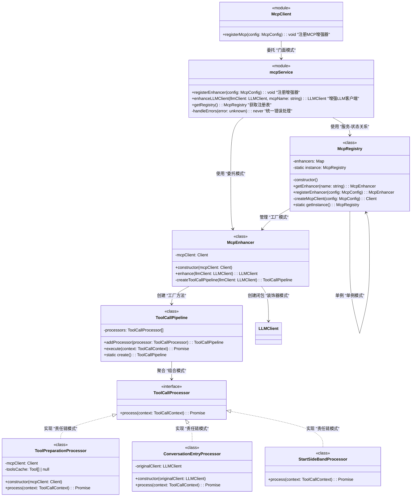
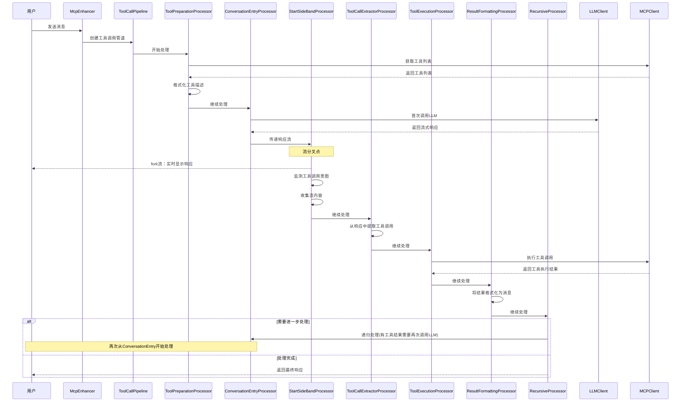
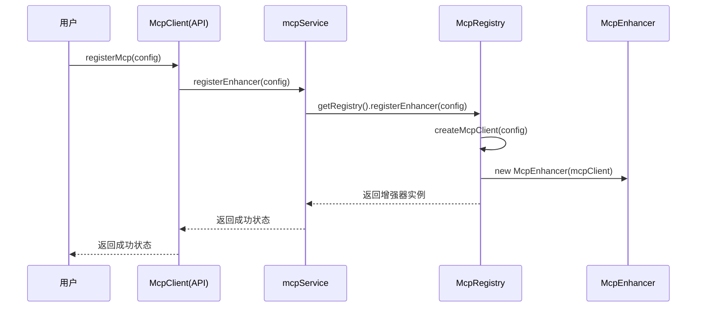
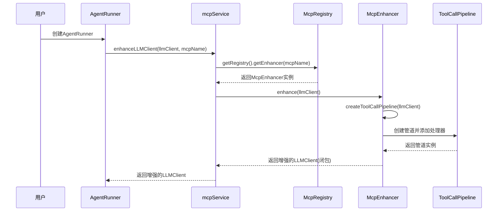

# DPML Agent MCP设计文档

## 1. 概述

Agent MCP (Model-Client-Provider) 模块是DPML Agent的扩展功能，旨在为Agent提供工具调用能力。它允许大语言模型请求执行特定的工具操作，例如搜索信息、查询数据库或执行计算。MCP模块采用责任链设计模式，将复杂的工具调用流程分解为一系列处理器，使系统更加灵活和可维护。

### 1.1 设计目标

- **无缝集成**：与现有Agent系统无缝集成，不影响核心功能
- **低侵入性**：对现有代码最小修改，通过增强现有LLMClient实现功能扩展
- **用户体验优先**：保持流式输出体验，同时支持工具调用
- **解耦设计**：工具调用逻辑与Agent核心逻辑分离
- **可扩展性**：支持多种工具类型和调用方式
- **类型安全**：提供完全类型化的API和结果

## 2. 核心设计理念

基于项目需求和架构规范，我们确立了以下核心设计理念：

1. **闭包模式增强**：
   - 使用闭包而非继承来增强LLMClient
   - 保持接口一致，同时扩展功能
   - 减少不必要的抽象层，降低系统复杂性

2. **责任链模式**：
   - 将工具调用流程拆分为一系列处理器
   - 每个处理器专注于单一职责
   - 通过上下文对象在处理器间传递状态
   - 灵活组合处理器以构建完整流程

3. **处理流与用户流分离**：
   - 主流是处理流：包含完整业务逻辑，走完整pipeline
   - 次流是用户流：仅用于展示，通过分叉从处理流获取数据
   - 优先保障处理流的正确性和健壮性，次流的展示问题不会影响核心功能

4. **旁观者模式**：
   - 工具调用检测和执行不阻断用户体验
   - 用户可以实时看到LLM生成的内容
   - 工具调用过程在后台进行，结果适时展示

5. **无状态设计**：
   - 工具调用过程不依赖外部状态管理
   - 消息历史直接包含在上下文对象中
   - 提高系统的可测试性和可靠性

## 3. 系统架构

MCP模块严格遵循项目的分层架构：

1. **API层**：McpClient模块，提供registerMcp函数
2. **Types层**：定义McpConfig, McpError等类型
3. **Core层**：实现mcpService和相关组件，管理工具调用流程

模块结构:
```
agent/
  ├── api/
  │   └── mcp.ts         # API入口，提供registerMcp函数
  ├── types/
  │   ├── McpError.ts          # MCP错误类型
  │   └── McpConfig.ts         # MCP配置类型
  └── core/
      ├── mcpService.ts        # 顶层模块服务，管理MCP增强器
      ├── mcp/
      │   ├── McpRegistry.ts   # MCP增强器注册表
      │   ├── McpEnhancer.ts   # LLM客户端增强器
      │   └── pipeline/        # 工具调用管道
      │       ├── ToolCallPipeline.ts      # 管道实现
      │       ├── ToolCallProcessor.ts     # 处理器接口
      │       ├── ToolCallContext.ts       # 上下文定义
      │       └── processors/              # 具体处理器实现
      │           ├── ToolPreparationProcessor.ts    # 工具准备
      │           ├── ConversationEntryProcessor.ts  # 对话入口
      │           ├── StartSideBandProcessor.ts      # 流分叉处理
      │           ├── ToolCallExtractorProcessor.ts  # 工具调用提取
      │           ├── ToolExecutionProcessor.ts      # 工具执行
      │           ├── ResultFormattingProcessor.ts   # 结果格式化
      │           └── RecursiveProcessor.ts          # 递归处理
```

## 4. 组件设计

### 4.1 API设计

```typescript
// api/mcp.ts
import type { McpConfig } from '../types';
import * as mcpService from '../core/mcpService';

/**
 * 注册MCP增强器
 * 
 * 向系统注册一个MCP增强器，用于为LLMClient添加工具调用能力。
 * 
 * @param config MCP配置
 */
export function registerMcp(config: McpConfig): void {
  // 委托给mcpService注册增强器
  mcpService.registerEnhancer(config);
}
```

### 4.2 类型定义

```typescript
// types/McpConfig.ts
/**
 * MCP配置
 * 
 * 定义MCP连接的配置信息。
 */
export interface McpConfig {
  /**
   * MCP名称，用于标识不同的MCP实例
   */
  readonly name: string;
  
  /**
   * 是否启用MCP功能
   */
  readonly enabled: boolean;
  
  /**
   * 连接类型
   */
  readonly type: 'http' | 'stdio';
  
  /**
   * HTTP连接配置，当type为http时使用
   */
  readonly http?: HttpConfig;
  
  /**
   * 标准IO连接配置，当type为stdio时使用
   */
  readonly stdio?: StdioConfig;
}

/**
 * HTTP连接配置
 */
export interface HttpConfig {
  /**
   * MCP服务器URL
   */
  readonly url: string;
}

/**
 * 标准IO连接配置
 */
export interface StdioConfig {
  /**
   * 执行的命令
   */
  readonly command: string;
  
  /**
   * 命令参数
   */
  readonly args?: string[];
}

// types/McpError.ts
/**
 * MCP错误类型
 */
export enum McpErrorType {
  /**
   * 工具未找到错误
   */
  TOOL_NOT_FOUND = 'TOOL_NOT_FOUND',
  
  /**
   * 工具执行失败错误
   */
  TOOL_EXECUTION_FAILED = 'TOOL_EXECUTION_FAILED',
  
  /**
   * 资源未找到错误
   */
  RESOURCE_NOT_FOUND = 'RESOURCE_NOT_FOUND',
  
  /**
   * 提示词未找到错误
   */
  PROMPT_NOT_FOUND = 'PROMPT_NOT_FOUND',
  
  /**
   * 模型错误
   */
  MODEL_ERROR = 'MODEL_ERROR',
  
  /**
   * 网络错误
   */
  NETWORK_ERROR = 'NETWORK_ERROR',
  
  /**
   * 权限被拒绝错误
   */
  PERMISSION_DENIED = 'PERMISSION_DENIED',
  
  /**
   * 未知错误
   */
  UNKNOWN_ERROR = 'UNKNOWN_ERROR'
}

/**
 * MCP错误
 */
export class McpError extends Error {
  /**
   * 错误代码
   */
  readonly code: string;
  
  /**
   * 错误详情
   */
  readonly details?: any;
  
  /**
   * 创建MCP错误
   * 
   * @param code 错误代码
   * @param message 错误消息
   * @param details 错误详情
   */
  constructor(code: string, message: string, details?: any) {
    super(message);
    this.name = 'McpError';
    this.code = code;
    this.details = details;
  }
  
  /**
   * 获取错误的字符串表示
   */
  toString(): string {
    return `[${this.code}] ${this.message}`;
  }
}
```

### 4.3 Core层设计

```typescript
// core/mcpService.ts
import type { McpConfig } from '../types';
import type { LLMClient } from './llm/LLMClient';
import { McpError, McpErrorType } from '../types/McpError';
import { McpRegistry } from './mcp/McpRegistry';

/**
 * 注册MCP增强器
 * 
 * @param config MCP配置
 */
export function registerEnhancer(config: McpConfig): void {
  try {
    // 获取全局注册表
    const registry = getRegistry();
    
    // 注册增强器
    registry.registerEnhancer(config);
  } catch (error) {
    // 统一错误处理
    handleErrors(error);
  }
}

/**
 * 增强LLM客户端
 * 
 * 为LLM客户端添加工具调用能力。
 * 
 * @param llmClient 原始LLM客户端
 * @param mcpName MCP名称
 * @returns 增强的LLM客户端
 */
export function enhanceLLMClient(llmClient: LLMClient, mcpName: string): LLMClient {
  try {
    // 获取注册表
    const registry = getRegistry();
    
    // 获取指定的增强器
    const enhancer = registry.getEnhancer(mcpName);
    
    // 使用增强器增强LLM客户端
    return enhancer.enhance(llmClient);
  } catch (error) {
    // 统一错误处理
    handleErrors(error);
  }
}

/**
 * 获取MCP注册表
 */
export function getRegistry(): McpRegistry {
  return McpRegistry.getInstance();
}

/**
 * 统一错误处理
 */
function handleErrors(error: unknown): never {
  // 已经是McpError则直接抛出
  if (error instanceof McpError) {
    throw error;
  }
  
  // 包装为McpError
  throw new McpError(
    'UNKNOWN_ERROR',
    `MCP操作失败: ${error instanceof Error ? error.message : String(error)}`,
    error
  );
}

// core/mcp/McpRegistry.ts
import type { McpConfig } from '../../types';
import { McpEnhancer } from './McpEnhancer';

/**
 * MCP增强器注册表
 * 
 * 管理MCP增强器的全局单例。
 */
export class McpRegistry {
  /**
   * 存储已注册的增强器
   */
  private enhancers = new Map<string, McpEnhancer>();
  
  /**
   * 全局单例实例
   */
  private static instance: McpRegistry;
  
  /**
   * 私有构造函数，防止外部直接实例化
   */
  private constructor() {}
  
  /**
   * 获取增强器
   * 
   * @param name 增强器名称
   * @returns 增强器实例
   */
  public getEnhancer(name: string): McpEnhancer {
    const enhancer = this.enhancers.get(name);
    if (!enhancer) {
      throw new Error(`未找到名为 ${name} 的MCP增强器`);
    }
    return enhancer;
  }
  
  /**
   * 注册增强器
   * 
   * @param config MCP配置
   * @returns 增强器实例
   */
  public registerEnhancer(config: McpConfig): McpEnhancer {
    // 创建MCP客户端
    const mcpClient = this.createMcpClient(config);
    
    // 创建增强器
    const enhancer = new McpEnhancer(mcpClient);
    
    // 存储增强器
    this.enhancers.set(config.name, enhancer);
    
    return enhancer;
  }
  
  /**
   * 创建MCP客户端
   * 
   * @param config MCP配置
   * @returns MCP客户端
   */
  private createMcpClient(config: McpConfig): Client {
    // 根据配置类型创建不同的客户端
    if (config.type === 'http' && config.http) {
      return new HttpClient(config.http);
    } else if (config.type === 'stdio' && config.stdio) {
      return new StdioClient(config.stdio);
    }
    throw new Error(`无效的MCP配置: ${config.type}`);
  }
  
  /**
   * 获取全局单例实例
   */
  public static getInstance(): McpRegistry {
    if (!McpRegistry.instance) {
      McpRegistry.instance = new McpRegistry();
    }
    return McpRegistry.instance;
  }
}

// core/mcp/McpEnhancer.ts
import type { LLMClient } from '../llm/LLMClient';
import { ToolCallPipeline } from './pipeline/ToolCallPipeline';

/**
 * MCP增强器
 * 
 * 为LLM客户端添加工具调用能力。
 */
export class McpEnhancer {
  /**
   * MCP客户端
   */
  private mcpClient: Client;
  
  /**
   * 创建增强器
   * 
   * @param mcpClient MCP客户端
   */
  constructor(mcpClient: Client) {
    this.mcpClient = mcpClient;
  }
  
  /**
   * 增强LLM客户端
   * 
   * @param llmClient 原始LLM客户端
   * @returns 增强的LLM客户端
   */
  public enhance(llmClient: LLMClient): LLMClient {
    // 创建工具调用管道
    const pipeline = this.createToolCallPipeline(llmClient);
    
    // 使用闭包创建增强的LLM客户端
    return {
      sendMessages: async (messages, stream) => {
        // 创建工具调用上下文
        const context: ToolCallContext = {
          messages,
          stream
        };
        
        // 执行工具调用管道
        const result = await pipeline.execute(context);
        
        // 返回最终结果
        return result.response!;
      }
    };
  }
  
  /**
   * 创建工具调用管道
   * 
   * @param llmClient 原始LLM客户端
   * @returns 工具调用管道
   */
  private createToolCallPipeline(llmClient: LLMClient): ToolCallPipeline {
    // 创建管道
    const pipeline = new ToolCallPipeline();
    
    // 添加处理器
    pipeline
      .addProcessor(new ToolPreparationProcessor(this.mcpClient))
      .addProcessor(new ConversationEntryProcessor(llmClient))
      .addProcessor(new StartSideBandProcessor())
      .addProcessor(new ToolCallExtractorProcessor())
      .addProcessor(new ToolExecutionProcessor(this.mcpClient))
      .addProcessor(new ResultFormattingProcessor());
      
    // 创建递归处理器并添加到管道
    const recursiveProcessor = new RecursiveProcessor(pipeline);
    pipeline.addProcessor(recursiveProcessor);
    
    return pipeline;
  }
}

// core/mcp/pipeline/ToolCallPipeline.ts
import { ToolCallProcessor } from './ToolCallProcessor';
import type { ToolCallContext } from './ToolCallContext';

/**
 * 工具调用管道
 * 
 * 协调多个处理器执行工具调用流程。
 */
export class ToolCallPipeline {
  /**
   * 处理器列表
   */
  private processors: ToolCallProcessor[] = [];
  
  /**
   * 添加处理器
   * 
   * @param processor 处理器
   * @returns 管道实例，支持链式调用
   */
  public addProcessor(processor: ToolCallProcessor): ToolCallPipeline {
    this.processors.push(processor);
    return this;
  }
  
  /**
   * 执行整个处理链
   * 
   * @param context 初始上下文
   * @returns 最终上下文
   */
  public async execute(context: ToolCallContext): Promise<ToolCallContext> {
    let currentContext = { ...context };
    
    // 顺序执行所有处理器
    for (const processor of this.processors) {
      currentContext = await processor.process(currentContext);
    }
    
    return currentContext;
  }
  
  /**
   * 工厂方法创建管道
   */
  public static create(): ToolCallPipeline {
    return new ToolCallPipeline();
  }
}

// core/mcp/pipeline/ToolCallProcessor.ts
import type { ToolCallContext } from './ToolCallContext';

/**
 * 工具调用处理器接口
 * 
 * 定义处理工具调用的统一接口。
 */
export interface ToolCallProcessor {
  /**
   * 处理当前上下文并传递给下一个处理器
   * 
   * @param context 工具调用上下文
   * @returns 处理后的上下文
   */
  process(context: ToolCallContext): Promise<ToolCallContext>;
}

// core/mcp/pipeline/ToolCallContext.ts
import type { Message } from '../../types';
import type { ChatOutput } from '../../../types';

/**
 * 工具调用上下文
 * 
 * 在处理器之间传递的上下文对象。
 */
export interface ToolCallContext {
  /**
   * 消息列表
   */
  messages: Message[];
  
  /**
   * 是否流式输出
   */
  stream: boolean;
  
  /**
   * LLM响应
   */
  response?: ChatOutput | AsyncIterable<ChatOutput>;
  
  /**
   * 可用工具列表
   */
  tools?: Tool[];
  
  /**
   * 提取的工具调用
   */
  toolCalls?: ToolCall[];
  
  /**
   * 工具执行结果
   */
  results?: ToolResult[];
  
  /**
   * 最终响应结果
   */
  finalResponse?: ChatOutput;
}
```

### 4.4 处理器实现

```typescript
// core/mcp/pipeline/processors/ToolPreparationProcessor.ts
/**
 * 工具准备处理器
 * 
 * 准备工具描述并添加到消息中。
 */
export class ToolPreparationProcessor implements ToolCallProcessor {
  /**
   * MCP客户端引用
   */
  private mcpClient: Client;
  
  /**
   * 工具列表缓存
   */
  private toolsCache: Tool[] | null = null;
  
  /**
   * 创建工具准备处理器
   * 
   * @param mcpClient MCP客户端
   */
  constructor(mcpClient: Client) {
    this.mcpClient = mcpClient;
  }
  
  /**
   * 处理工具准备
   * 
   * @param context 工具调用上下文
   * @returns 处理后的上下文
   */
  public async process(context: ToolCallContext): Promise<ToolCallContext> {
    // 获取工具列表
    const tools = await this.getTools();
    
    // 格式化工具描述
    const toolsDescription = this.formatToolsDescription(tools);
    
    // 检查消息中是否已有工具描述
    if (!this.hasToolsDescription(context.messages)) {
      // 添加工具描述到消息
      context.messages = [
        {
          role: 'system',
          content: toolsDescription
        },
        ...context.messages
      ];
    }
    
    // 在上下文中存储工具列表
    context.tools = tools;
    
    return context;
  }
  
  /**
   * 获取工具列表
   */
  private async getTools(): Promise<Tool[]> {
    if (!this.toolsCache) {
      this.toolsCache = await this.mcpClient.fetchTools();
    }
    return this.toolsCache;
  }
  
  /**
   * 格式化工具描述
   */
  private formatToolsDescription(tools: Tool[]): string {
    // 实现工具格式化逻辑
    let description = "可用工具:\n\n";
    
    for (const tool of tools) {
      description += `工具名: ${tool.name}\n`;
      description += `描述: ${tool.description}\n\n`;
      
      if (tool.parameters) {
        description += "参数:\n";
        // 格式化参数
      }
      
      description += "\n";
    }
    
    // 添加工具调用格式指南
    description += "当你需要使用工具时，请使用以下格式:\n\n";
    description += "<function_calls>\n";
    description += "<invoke name=\"工具名\">\n";
    description += "<parameter name=\"参数名\">参数值</parameter>\n";
    description += "</invoke>\n";
    description += "</function_calls>\n";
    
    return description;
  }
  
  /**
   * 检查消息中是否已有工具描述
   */
  private hasToolsDescription(messages: Message[]): boolean {
    return messages.some(msg => 
      msg.role === 'system' && 
      typeof msg.content === 'string' && 
      msg.content.includes('可用工具:')
    );
  }
}

// core/mcp/pipeline/processors/ConversationEntryProcessor.ts
/**
 * 对话入口处理器
 * 
 * 负责首次向LLM发送请求并获取原始响应。
 */
export class ConversationEntryProcessor implements ToolCallProcessor {
  /**
   * 原始LLM客户端引用
   */
  private originalClient: LLMClient;
  
  /**
   * 创建对话入口处理器
   * 
   * @param originalClient 原始LLM客户端
   */
  constructor(originalClient: LLMClient) {
    this.originalClient = originalClient;
  }
  
  /**
   * 处理对话入口
   * 
   * @param context 工具调用上下文
   * @returns 处理后的上下文
   */
  public async process(context: ToolCallContext): Promise<ToolCallContext> {
    // 调用LLM获取响应
    const response = await this.callLLM(context.messages, context.stream);
    
    // 更新上下文中的响应
    context.response = response;
    
    return context;
  }
  
  /**
   * 调用LLM获取响应
   * 
   * @param messages 消息列表
   * @param stream 是否流式输出
   * @returns LLM响应
   */
  private async callLLM(messages: Message[], stream: boolean): Promise<ChatOutput | AsyncIterable<ChatOutput>> {
    return this.originalClient.sendMessages(messages, stream);
  }
}

// core/mcp/pipeline/processors/StartSideBandProcessor.ts
/**
 * 流分叉处理器
 * 
 * 实现旁观者模式，处理分叉逻辑。
 */
export class StartSideBandProcessor implements ToolCallProcessor {
  /**
   * 处理分叉逻辑
   * 
   * @param context 工具调用上下文
   * @returns 处理后的上下文
   */
  public async process(context: ToolCallContext): Promise<ToolCallContext> {
    // 检查是否为流式响应
    if (context.stream && context.response && Symbol.asyncIterator in context.response) {
      // 处理流式响应
      this.forkProcessing(context.response as AsyncIterable<ChatOutput>);
    }
    
    return context;
  }
  
  /**
   * 创建分叉处理
   * 
   * @param responseStream 响应流
   */
  private forkProcessing(responseStream: AsyncIterable<ChatOutput>): void {
    // 启动异步任务监控流内容
    (async () => {
      // 收集流内容
      const content = await this.collectStreamContent(responseStream);
      
      // 检测工具调用意图
      if (this.detectToolCall(content)) {
        // 设置标志以便后续处理器处理
        // 实际实现中可能需要更复杂的逻辑
      }
    })();
  }
  
  /**
   * 检测工具调用意图
   * 
   * @param content 内容
   * @returns 是否包含工具调用
   */
  private detectToolCall(content: string): boolean {
    // 实现工具调用检测逻辑
    return content.includes('<tool>') || content.includes('function_call');
  }
  
  /**
   * 收集流内容
   * 
   * @param stream 流
   * @returns 收集的内容
   */
  private async collectStreamContent(stream: AsyncIterable<ChatOutput>): Promise<string> {
    let content = '';
    
    for await (const chunk of stream) {
      if (typeof chunk.content === 'string') {
        content += chunk.content;
      } else {
        content += JSON.stringify(chunk.content);
      }
    }
    
    return content;
  }
}

// core/mcp/pipeline/processors/ToolCallExtractorProcessor.ts
/**
 * 工具调用提取处理器
 * 
 * 从LLM响应中提取工具调用请求。
 */
export class ToolCallExtractorProcessor implements ToolCallProcessor {
  /**
   * 处理工具调用提取
   * 
   * @param context 工具调用上下文
   * @returns 处理后的上下文
   */
  public async process(context: ToolCallContext): Promise<ToolCallContext> {
    // 如果没有响应，则跳过处理
    if (!context.response) {
      return context;
    }
    
    // 检查是否为流式响应
    if (context.stream && Symbol.asyncIterator in context.response) {
      // 从流中提取工具调用
      context.toolCalls = await this.extractFromStream(context.response as AsyncIterable<ChatOutput>);
    } else {
      // 从非流式响应中提取工具调用
      context.toolCalls = this.extractFromResponse(context.response as ChatOutput);
    }
    
    return context;
  }
  
  /**
   * 从流式响应中提取工具调用
   * 
   * @param stream 响应流
   * @returns 提取的工具调用
   */
  private async extractFromStream(stream: AsyncIterable<ChatOutput>): Promise<ToolCall[]> {
    // 收集完整的流内容
    let content = '';
    for await (const chunk of stream) {
      if (typeof chunk.content === 'string') {
        content += chunk.content;
      } else {
        content += JSON.stringify(chunk.content);
      }
    }
    
    // 从完整内容中提取工具调用
    return this.parseToolCalls(content);
  }
  
  /**
   * 从非流式响应中提取工具调用
   * 
   * @param response 响应对象
   * @returns 提取的工具调用
   */
  private extractFromResponse(response: ChatOutput): ToolCall[] {
    // 获取响应内容
    const content = typeof response.content === 'string' 
      ? response.content 
      : JSON.stringify(response.content);
    
    // 解析工具调用
    return this.parseToolCalls(content);
  }
  
  /**
   * 解析内容中的工具调用标记
   * 
   * @param content 内容文本
   * @returns 解析的工具调用列表
   */
  private parseToolCalls(content: string): ToolCall[] {
    const toolCalls: ToolCall[] = [];
    
    // 查找所有<function_calls>...</function_calls>块
    const functionCallsRegex = /<function_calls>([\s\S]*?)<\/function_calls>/g;
    let match;
    
    while ((match = functionCallsRegex.exec(content)) !== null) {
      const functionCallsBlock = match[1];
      
      // 解析<invoke>块
      const invokeRegex = /<invoke name="([^"]+)">([\s\S]*?)<\/invoke>/g;
      let invokeMatch;
      
      while ((invokeMatch = invokeRegex.exec(functionCallsBlock)) !== null) {
        const toolName = invokeMatch[1];
        const paramsBlock = invokeMatch[2];
        
        // 解析参数
        const params: Record<string, any> = {};
        const paramRegex = /<parameter name="([^"]+)">([\s\S]*?)<\/parameter>/g;
        let paramMatch;
        
        while ((paramMatch = paramRegex.exec(paramsBlock)) !== null) {
          const paramName = paramMatch[1];
          const paramValue = paramMatch[2];
          params[paramName] = paramValue;
        }
        
        // 添加解析的工具调用
        toolCalls.push({
          name: toolName,
          parameters: params
        });
      }
    }
    
    return toolCalls;
  }
}

// core/mcp/pipeline/processors/ToolExecutionProcessor.ts
/**
 * 工具执行处理器
 * 
 * 执行提取的工具调用并收集结果。
 */
export class ToolExecutionProcessor implements ToolCallProcessor {
  /**
   * MCP客户端引用
   */
  private mcpClient: Client;
  
  /**
   * 创建工具执行处理器
   * 
   * @param mcpClient MCP客户端
   */
  constructor(mcpClient: Client) {
    this.mcpClient = mcpClient;
  }
  
  /**
   * 处理工具执行
   * 
   * @param context 工具调用上下文
   * @returns 处理后的上下文
   */
  public async process(context: ToolCallContext): Promise<ToolCallContext> {
    // 如果没有工具调用，则跳过处理
    if (!context.toolCalls || context.toolCalls.length === 0) {
      return context;
    }
    
    // 执行所有工具调用并收集结果
    const results = await Promise.all(
      context.toolCalls.map(toolCall => this.executeTool(toolCall))
    );
    
    // 存储结果
    context.results = results;
    
    return context;
  }
  
  /**
   * 执行单个工具调用
   * 
   * @param toolCall 工具调用
   * @returns 工具执行结果
   */
  private async executeTool(toolCall: ToolCall): Promise<ToolResult> {
    try {
      // 调用MCP客户端执行工具
      const result = await this.mcpClient.executeTool(
        toolCall.name,
        toolCall.parameters
      );
      
      // 返回成功结果
      return {
        toolCall,
        status: 'success',
        result
      };
    } catch (error) {
      // 返回错误结果
      return {
        toolCall,
        status: 'error',
        error: error instanceof Error ? error.message : String(error)
      };
    }
  }
}

// core/mcp/pipeline/processors/ResultFormattingProcessor.ts
/**
 * 结果格式化处理器
 * 
 * 将工具执行结果格式化为适合LLM处理的消息。
 */
export class ResultFormattingProcessor implements ToolCallProcessor {
  /**
   * 处理结果格式化
   * 
   * @param context 工具调用上下文
   * @returns 处理后的上下文
   */
  public async process(context: ToolCallContext): Promise<ToolCallContext> {
    // 如果没有工具结果，则跳过处理
    if (!context.results || context.results.length === 0) {
      return context;
    }
    
    // 格式化工具结果为消息
    const resultMessages = this.formatResults(context.results);
    
    // 将工具调用和结果添加到消息历史
    context.messages = [
      ...context.messages,
      // 添加助手消息，包含工具调用
      this.createAssistantMessage(context.toolCalls!),
      // 添加工具结果消息
      ...resultMessages
    ];
    
    // 准备最终响应
    context.finalResponse = {
      role: 'assistant',
      content: ''  // 将在后续处理中填充
    };
    
    return context;
  }
  
  /**
   * 格式化工具执行结果为消息
   * 
   * @param results 工具执行结果
   * @returns 格式化的消息列表
   */
  private formatResults(results: ToolResult[]): Message[] {
    return results.map(result => {
      if (result.status === 'success') {
        // 成功结果
        return {
          role: 'tool',
          toolName: result.toolCall.name,
          content: typeof result.result === 'string' 
            ? result.result 
            : JSON.stringify(result.result, null, 2)
        };
      } else {
        // 错误结果
        return {
          role: 'tool',
          toolName: result.toolCall.name,
          content: `错误: ${result.error}`
        };
      }
    });
  }
  
  /**
   * 创建包含工具调用的助手消息
   * 
   * @param toolCalls 工具调用列表
   * @returns 助手消息
   */
  private createAssistantMessage(toolCalls: ToolCall[]): Message {
    let content = '';
    
    // 为每个工具调用创建格式化内容
    for (const toolCall of toolCalls) {
      content += '<function_calls>\n';
      content += `<invoke name="${toolCall.name}">\n`;
      
      for (const [paramName, paramValue] of Object.entries(toolCall.parameters)) {
        content += `<parameter name="${paramName}">${paramValue}</parameter>\n`;
      }
      
      content += '</invoke>\n';
      content += '</function_calls>\n\n';
    }
    
    return {
      role: 'assistant',
      content
    };
  }
}

// core/mcp/pipeline/processors/RecursiveProcessor.ts
/**
 * 递归处理器
 * 
 * 处理多轮工具调用，根据需要递归调用管道。
 */
export class RecursiveProcessor implements ToolCallProcessor {
  /**
   * 管道引用
   */
  private pipeline: ToolCallPipeline;
  
  /**
   * 最大递归深度
   */
  private readonly maxRecursionDepth: number = 5;
  
  /**
   * 当前递归深度
   */
  private currentDepth: number = 0;
  
  /**
   * 创建递归处理器
   * 
   * @param pipeline 管道实例
   */
  constructor(pipeline: ToolCallPipeline) {
    this.pipeline = pipeline;
  }
  
  /**
   * 处理递归逻辑
   * 
   * @param context 工具调用上下文
   * @returns 处理后的上下文
   */
  public async process(context: ToolCallContext): Promise<ToolCallContext> {
    // 递增当前深度
    this.currentDepth++;
    
    // 检查是否有工具执行结果需要进一步处理
    if (this.shouldContinueProcessing(context)) {
      // 检查是否超过最大递归深度
      if (this.currentDepth >= this.maxRecursionDepth) {
        // 超过最大深度，结束递归
        context.finalResponse = {
          role: 'assistant',
          content: '达到最大工具调用深度，无法进一步处理。'
        };
        
        // 重置深度
        this.currentDepth = 0;
        
        return context;
      }
      
      // 准备新的上下文对象，继续处理
      const newContext: ToolCallContext = {
        // 传递当前消息历史
        messages: context.messages,
        // 保持流设置
        stream: context.stream,
        // 保留工具列表
        tools: context.tools
      };
      
      // 递归执行管道
      // 注意：这里会从头开始执行管道，但会跳过ConversationEntryProcessor之前的处理器
      // 因为我们已经有了消息历史和工具列表
      const result = await this.pipeline.execute(newContext);
      
      // 合并结果
      context.response = result.response;
      context.finalResponse = result.finalResponse;
      
      // 重置深度
      this.currentDepth = 0;
      
      return context;
    }
    
    // 如果不需要继续处理，直接返回当前上下文
    // 重置深度
    this.currentDepth = 0;
    
    return context;
  }
  
  /**
   * 判断是否需要继续处理
   * 
   * @param context 工具调用上下文
   * @returns 是否继续处理
   */
  private shouldContinueProcessing(context: ToolCallContext): boolean {
    // 检查是否有工具执行结果
    if (!context.results || context.results.length === 0) {
      return false;
    }
    
    // 检查是否有成功的工具执行结果
    const hasSuccessfulResults = context.results.some(
      result => result.status === 'success'
    );
    
    // 如果有成功的工具执行结果，需要继续处理
    return hasSuccessfulResults;
  }
}
```

## 5. 组件关系图



## 6. 流程图

### 6.1 工具调用流程



### 6.2 MCP增强器注册流程



### 6.3 LLMClient增强流程



## 7. 用户使用方式

以下是应用开发者如何使用DPML Agent MCP模块的示例：

```typescript
import { createAgent } from '@dpml/agent';
import { registerMcp } from '@dpml/agent/mcp';
import type { AgentConfig, McpConfig } from '@dpml/agent';

// 注册MCP增强器
const mcpConfig: McpConfig = {
  name: 'search-tools',
  enabled: true,
  type: 'http',
  http: {
    url: 'http://localhost:3000/mcp'
  }
};

// 注册增强器
registerMcp(mcpConfig);

// 创建Agent配置
const agentConfig: AgentConfig = {
  llm: {
    apiType: 'openai',
    apiKey: process.env.OPENAI_API_KEY,
    model: 'gpt-4-turbo'
  },
  prompt: '你是一个专业的AI助手，能够帮助用户查询信息和回答问题。',
  mcp: {
    enabled: true,
    name: 'search-tools'
  }
};

// 创建Agent实例
const agent = createAgent(agentConfig);

// 使用Agent进行对话
async function runAssistant() {
  try {
    // 普通对话 - 无需工具调用
    const simpleResponse = await agent.chat('什么是JavaScript闭包？');
    console.log('回答:', simpleResponse);
    
    // 需要工具调用的对话
    const searchResponse = await agent.chat('今天北京的天气如何？');
    console.log('天气查询结果:', searchResponse);
    
    // 使用流式对话 - 工具调用会在后台处理
    console.log('流式查询股票信息:');
    for await (const chunk of agent.chatStream('微软股票现在的价格是多少？')) {
      process.stdout.write(chunk);
    }
    console.log('\n');
  } catch (error) {
    console.error('错误:', error);
  }
}

runAssistant();
```

使用DPML配置文件：

```typescript
import { createAgent } from '@dpml/agent';
import { registerMcp } from '@dpml/agent/mcp';
import { parseAgent } from '@dpml/agent/xml';
import fs from 'fs';

// 注册MCP增强器
registerMcp({
  name: 'research-tools',
  enabled: true,
  type: 'http',
  http: {
    url: 'http://localhost:3000/mcp'
  }
});

// 加载DPML配置
const dpmlContent = fs.readFileSync('research-assistant.xml', 'utf-8');

async function createResearchAssistant() {
  // 解析DPML为Agent配置
  const config = await parseAgent(dpmlContent);
  
  // 启用MCP
  config.mcp = {
    enabled: true,
    name: 'research-tools'
  };
  
  // 创建Agent
  const agent = createAgent(config);
  
  // 使用Agent进行研究
  const research = await agent.chat('分析过去一年的比特币价格趋势并给出未来预测');
  console.log(research);
}

createResearchAssistant();
```

## 8. 总结

DPML Agent MCP模块为Agent提供强大的工具调用能力，使AI能够执行各种外部操作，如搜索信息、查询数据库或执行计算。该模块采用责任链设计模式，将复杂的工具调用流程分解为一系列处理器，使系统更加灵活和可维护。

关键设计特点：

1. **低侵入性**：使用闭包模式增强现有LLMClient，不改变原有Agent架构
2. **流程分离**：将处理流与用户展示流分离，保证用户体验的同时实现工具调用
3. **责任链模式**：每个处理器专注于单一职责，通过管道串联，易于扩展和维护
4. **旁观者模式**：工具调用不阻断用户体验，用户可以实时看到LLM生成的内容
5. **无状态设计**：工具调用过程不依赖外部状态管理，提高系统可测试性和可靠性

MCP模块根据不同层次分配了清晰的职责：

- **API层**：提供registerMcp函数，供用户注册MCP增强器
- **Types层**：定义McpConfig, McpError等类型，提供类型安全
- **Core层**：实现mcpService和相关组件，管理工具调用流程

通过责任链模式，MCP模块将工具调用流程分解为以下步骤：

1. **工具准备**：获取可用工具列表并添加到消息中
2. **对话入口**：向LLM发送请求并获取原始响应
3. **流分叉处理**：分离用户展示流和内部处理流
4. **工具调用提取**：从响应中提取工具调用请求
5. **工具执行**：执行工具调用并获取结果
6. **结果格式化**：将工具结果格式化为消息
7. **递归处理**：根据需要进行多轮工具调用

此设计保证了系统的灵活性和可扩展性，同时保持了用户体验的流畅性。无论是简单的文本交互还是复杂的工具调用场景，Agent都能提供一致和高效的用户体验。
