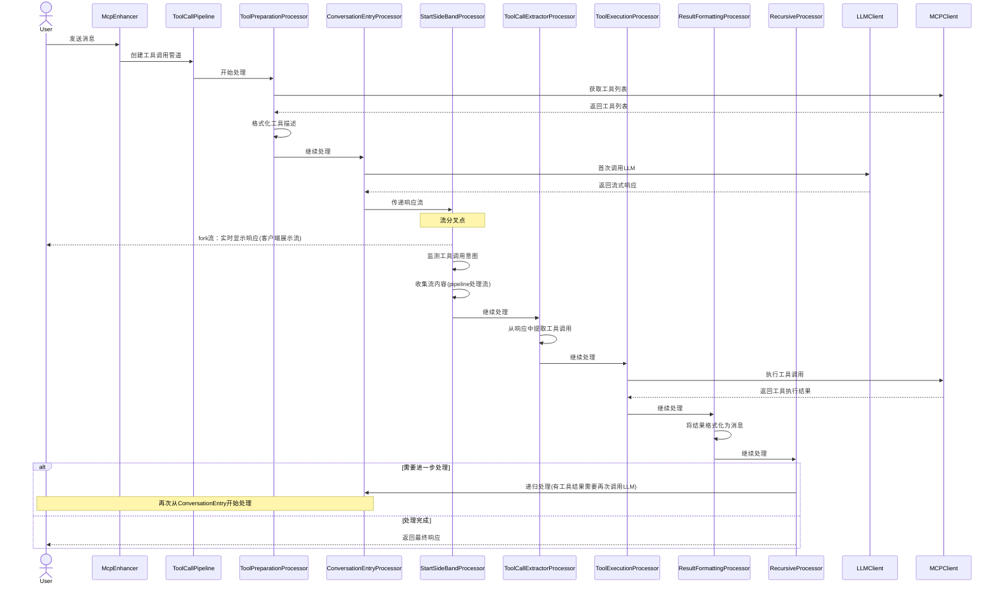

# Agent MCP Design

## uml

```mermaid
classDiagram
    %% Types层 - 类型定义和接口
    class LLMClient {
        <<interface>>
        +sendMessages(messages: Message[], stream: boolean): Promise<ChatOutput | AsyncIterable<ChatOutput>> "发送消息到大语言模型并获取响应"
    }
    note for LLMClient "文件: packages/agent/src/core/llm/LLMClient.ts\n【已实现】Core层接口，定义与大语言模型交互的契约"
    
    class AgentSession {
        <<interface>>
        +addMessage(message: Message): void "向会话添加新消息"
        +getMessages(): ReadonlyArray<Message> "获取只读消息历史"
    }
    note for AgentSession "文件: packages/agent/src/core/session/AgentSession.ts\n【已实现】Core层接口，定义会话管理契约"
    
    class McpError {
        <<class>>
        +code: string "错误代码，用于错误分类"
        +message: string "人类可读的错误描述信息"
        +details?: any "可选的错误详细信息，用于调试"
        +constructor(code: string, message: string, details?: any)
        +toString(): string "提供错误的字符串表示"
    }
    note for McpError "文件: packages/agent/src/types/McpError.ts\n【待实现】Types层错误类，提供标准错误格式"
    
    class McpErrorType {
        <<enum>>
        TOOL_NOT_FOUND "工具未找到错误"
        TOOL_EXECUTION_FAILED "工具执行失败错误"
        RESOURCE_NOT_FOUND "资源未找到错误"
        PROMPT_NOT_FOUND "提示词未找到错误"
        MODEL_ERROR "模型错误"
        NETWORK_ERROR "网络错误"
        PERMISSION_DENIED "权限被拒绝错误"
        UNKNOWN_ERROR "未知错误"
    }
    note for McpErrorType "文件: packages/agent/src/types/McpError.ts\n【待实现】Types层枚举，定义标准错误类型"
    
    class McpConfig {
        <<interface>>
        +name: string "MCP 名称"
        +enabled: boolean "是否启用MCP功能"
        +type: 'http' | 'stdio' "连接类型"
        +http?: HttpConfig "HTTP连接配置"
        +stdio?: StdioConfig "标准IO连接配置"
    }
    note for McpConfig "文件: packages/agent/src/types/McpConfig.ts\n【待实现】Types层接口，定义MCP连接配置"
    
    class HttpConfig {
        <<interface>>
        +url: string "MCP服务器URL"
    }
    note for HttpConfig "文件: packages/agent/src/types/McpConfig.ts\n【待实现】Types层接口，HTTP连接参数"
    
    class StdioConfig {
        <<interface>>
        +command: string "执行的命令"
        +args?: string[] "命令参数"
    }
    note for StdioConfig "文件: packages/agent/src/types/McpConfig.ts\n【待实现】Types层接口，STDIO连接参数"
    
    %% Core层 - 业务逻辑实现
    class mcpService {
        <<module>>
        +registerEnhancer(config: McpConfig): void "注册增强器到全局注册表"
        +enhanceLLMClient(llmClient: LLMClient, mcpName: string): LLMClient "增强LLM客户端"
        +getRegistry(): McpRegistry "获取全局注册表实例"
        -handleErrors(error: unknown): never "统一错误处理函数"
    }
    note for mcpService "文件: packages/agent/src/core/mcpService.ts\n【待实现】Core层模块服务，无状态函数集合"
    
    class McpRegistry {
        <<class>>
        -enhancers: Map<string, McpEnhancer> "存储已注册的增强器"
        -static instance: McpRegistry "全局单例实例"
        -constructor() "私有构造函数，防止外部直接实例化"
        +getEnhancer(name: string): McpEnhancer "获取已注册增强器"
        +registerEnhancer(config: McpConfig): McpEnhancer "注册新增强器，使用config.name作为标识"
        -createMcpClient(config: McpConfig): Client "创建MCP客户端"
        +static getInstance(): McpRegistry "获取全局单例实例"
    }
    note for McpRegistry "文件: packages/agent/src/core/mcp/McpRegistry.ts\n【待实现】Core层实现类，负责增强器实例管理，提供全局单例"
    
    class McpEnhancer {
        <<class>>
        -mcpClient: Client "MCP客户端实例"
        +constructor(mcpClient: Client)
        +enhance(llmClient: LLMClient): LLMClient "通过闭包直接返回增强的LLMClient实现"
        -createToolCallPipeline(llmClient: LLMClient): ToolCallPipeline "创建工具调用管道"
    }
    note for McpEnhancer "文件: packages/agent/src/core/mcp/McpEnhancer.ts\n【待实现】Core层实现类，通过闭包创建增强型客户端"
    
    class ToolCallPipeline {
        <<class>>
        -processors: ToolCallProcessor[] "处理器链"
        +constructor()
        +addProcessor(processor: ToolCallProcessor): ToolCallPipeline "添加处理器到管道"
        +execute(context: ToolCallContext): Promise<ToolCallContext> "执行整个处理链"
        +static create(): ToolCallPipeline "工厂方法创建管道"
    }
    note for ToolCallPipeline "文件: packages/agent/src/core/mcp/pipeline/ToolCallPipeline.ts\n【待实现】Core层实现类，处理器管道，协调执行各处理器"
    
    class ToolCallProcessor {
        <<interface>>
        +process(context: ToolCallContext): Promise<ToolCallContext> "处理当前上下文并传递给下一个处理器"
    }
    note for ToolCallProcessor "文件: packages/agent/src/core/mcp/pipeline/ToolCallProcessor.ts\n【待实现】Core层接口，定义处理器统一接口"
    
    class ToolCallContext {
        <<interface>>
        +messages: Message[] "消息列表"
        +stream: boolean "是否流式输出"
        +response?: ChatOutput | AsyncIterable<ChatOutput> "LLM响应"
        +tools?: Tool[] "可用工具列表"
        +toolCalls?: ToolCall[] "提取的工具调用"
        +results?: ToolResult[] "工具执行结果"
        +finalResponse?: ChatOutput "最终响应结果"
    }
    note for ToolCallContext "文件: packages/agent/src/core/mcp/pipeline/ToolCallContext.ts\n【待实现】Core层接口，定义处理上下文"
    
    class ToolPreparationProcessor {
        <<class>>
        -mcpClient: Client "MCP客户端引用"
        -toolsCache: Tool[] | null "工具列表缓存"
        +constructor(mcpClient: Client)
        +process(context: ToolCallContext): Promise<ToolCallContext> "准备工具描述"
        -getTools(): Promise<Tool[]> "获取工具列表"
        -formatToolsDescription(tools: Tool[]): string "格式化工具描述"
        -hasToolsDescription(messages: Message[]): boolean "检查是否已有工具描述"
    }
    note for ToolPreparationProcessor "文件: packages/agent/src/core/mcp/pipeline/processors/ToolPreparationProcessor.ts\n【待实现】Core层实现类，准备工具描述"
    
    class ConversationEntryProcessor {
        <<class>>
        -originalClient: LLMClient "原始LLM客户端引用"
        +constructor(originalClient: LLMClient)
        +process(context: ToolCallContext): Promise<ToolCallContext> "作为对话入口，负责首次向LLM发送请求并获取原始响应"
        -callLLM(messages: Message[], stream: boolean): Promise<ChatOutput | AsyncIterable<ChatOutput>> "调用LLM获取响应"
    }
    note for ConversationEntryProcessor "文件: packages/agent/src/core/mcp/pipeline/processors/ConversationEntryProcessor.ts\n【待实现】Core层实现类，作为对话流程的入口点，负责首次向LLM发送请求并获取原始响应"
    
    class StartSideBandProcessor {
        <<class>>
        +process(context: ToolCallContext): Promise<ToolCallContext> "处理分叉逻辑，实现旁观者模式"
        -forkProcessing(responseStream: AsyncIterable<ChatOutput>): void "创建分叉处理"
        -detectToolCall(content: string): boolean "检测工具调用意图"
        -collectStreamContent(stream: AsyncIterable<ChatOutput>): Promise<string> "收集流内容"
    }
    note for StartSideBandProcessor "文件: packages/agent/src/core/mcp/pipeline/processors/StartSideBandProcessor.ts\n【待实现】Core层实现类，实现旁观者模式分叉逻辑，负责处理响应流并监测工具调用"
    
    class ToolCallExtractorProcessor {
        <<class>>
        +process(context: ToolCallContext): Promise<ToolCallContext> "提取工具调用"
        -extractToolCalls(response: ChatOutput): ToolCall[] "从响应中提取工具调用"
    }
    note for ToolCallExtractorProcessor "文件: packages/agent/src/core/mcp/pipeline/processors/ToolCallExtractorProcessor.ts\n【待实现】Core层实现类，提取工具调用"
    
    class ToolExecutionProcessor {
        <<class>>
        -mcpClient: Client "MCP客户端引用"
        +constructor(mcpClient: Client)
        +process(context: ToolCallContext): Promise<ToolCallContext> "执行工具调用"
    }
    note for ToolExecutionProcessor "文件: packages/agent/src/core/mcp/pipeline/processors/ToolExecutionProcessor.ts\n【待实现】Core层实现类，执行工具调用"
    
    class ResultFormattingProcessor {
        <<class>>
        +process(context: ToolCallContext): Promise<ToolCallContext> "格式化工具结果"
        -formatToolResults(calls: ToolCall[], results: ToolResult[]): Message[] "将工具结果格式化为消息"
    }
    note for ResultFormattingProcessor "文件: packages/agent/src/core/mcp/pipeline/processors/ResultFormattingProcessor.ts\n【待实现】Core层实现类，格式化工具结果"
    
    class RecursiveProcessor {
        <<class>>
        -pipeline: ToolCallPipeline "管道引用"
        +constructor(pipeline: ToolCallPipeline)
        +process(context: ToolCallContext): Promise<ToolCallContext> "递归处理工具调用结果"
    }
    note for RecursiveProcessor "文件: packages/agent/src/core/mcp/pipeline/processors/RecursiveProcessor.ts\n【待实现】Core层实现类，递归处理多轮工具调用"
    
    class AgentRunner {
        <<class>>
        -config: AgentConfig "代理配置"
        -llmClient: LLMClient "LLM客户端"
        +constructor(config: AgentConfig, llmClient: LLMClient)
        +sendMessage(input: ChatInput, stream: boolean): Promise<ChatOutput | AsyncIterable<ChatOutput>> "发送消息获取响应"
    }
    note for AgentRunner "文件: packages/agent/src/core/AgentRunner.ts\n【已实现】Core层实现类，负责消息处理的核心类"
    
    %% API层 - 对外接口
    class McpClient {
        <<module>>
        +registerEnhancer(config: McpConfig): void "注册MCP增强器"
    }
    note for McpClient "文件: packages/agent/src/api/McpClient.ts\n【待实现】API层模块，提供简洁的对外接口"
    
    %% 定义关系
    McpClient ..> mcpService : 委托 "门面模式"
    mcpService ..> McpRegistry : 使用 "服务-状态关系"
    mcpService ..> McpEnhancer : 使用 "委托模式"
    mcpService ..> McpError : 创建 "错误处理"
    
    McpRegistry --> McpEnhancer : 管理 "工厂模式"
    McpRegistry ..> McpRegistry : 单例 "单例模式"
    McpEnhancer --> ToolCallPipeline : 创建 "工厂方法"
    McpEnhancer ..> LLMClient : 创建闭包 "装饰器模式"
    
    ToolCallPipeline --> ToolCallProcessor : 聚合 "组合模式"
    ToolCallProcessor <|.. StartSideBandProcessor : 实现 "责任链模式"
    ToolCallProcessor <|.. ToolPreparationProcessor : 实现 "责任链模式"
    ToolCallProcessor <|.. ConversationEntryProcessor : 实现 "责任链模式"
    ToolCallProcessor <|.. ToolCallExtractorProcessor : 实现 "责任链模式"
    ToolCallProcessor <|.. ToolExecutionProcessor : 实现 "责任链模式"
    ToolCallProcessor <|.. ResultFormattingProcessor : 实现 "责任链模式"
    ToolCallProcessor <|.. RecursiveProcessor : 实现 "责任链模式"
    
    McpError --> McpErrorType : 使用 "类型引用"
    McpConfig --> HttpConfig : 包含 "组合关系"
    McpConfig --> StdioConfig : 包含 "组合关系"
    
    AgentRunner --> LLMClient : 使用 "依赖注入"
    AgentRunner --> AgentSession : 使用 "依赖注入"

%% 设计决策说明
%% ==============================================================================
%% 核心设计决策:
%% 
%% 1. 闭包模式 vs 类模式
%%    选择闭包模式实现LLMClient增强，而不是创建EnhancedLLMClient类，原因:
%%    - 更简洁、更符合JavaScript函数式特性
%%    - 减少不必要的抽象层，降低系统复杂性
%%    - 闭包能更好地封装状态，不需要额外的实例属性
%%    - 避免了继承带来的复杂性和不灵活性
%% 
%% 2. 责任链模式(管道)的优势
%%    将工具调用流程拆分为一系列处理器，好处:
%%    - 单一职责：每个处理器只负责一个步骤，如工具准备、对话入口、流分叉等
%%    - 高内聚低耦合：处理器之间通过上下文对象通信，无直接依赖
%%    - 灵活组合：可以根据需要调整处理顺序或添加新处理器
%%    - 易测试：每个处理器可以独立测试
%%    - 可扩展性：新功能可以通过添加新处理器实现，无需修改现有代码
%% 
%% 3. 处理流与用户流分离
%%    设计中的核心理念:
%%    - 主流是处理流：包含完整业务逻辑，走完整个pipeline
%%    - 次流是用户流：仅用于展示，通过分叉从处理流获取数据
%%    - 优先保障处理流的正确性和健壮性，次流的展示问题不会影响核心功能
%%    - ConversationEntryProcessor负责初始LLM调用，获取原始响应
%%    - StartSideBandProcessor负责流分叉和工具调用检测，不负责LLM调用
%% 
%% 4. 旁观者模式(非阻塞式工具调用)
%%    StartSideBandProcessor实现的旁观者模式，设计思路:
%%    - 将LLM响应流分叉为用户展示流和内部处理流
%%    - 用户展示流：实时展示给用户，保证交互体验
%%    - 内部处理流：进行工具调用检测和后续处理
%%    - 用户控制权：保留用户随时打断的能力
%%    - 透明处理：系统可以显示"正在处理工具调用"提示
%% 
%% 5. ToolCallContext设计
%%    上下文对象设计考量:
%%    - 状态共享：各处理器之间传递数据，保证处理连贯性
%%    - 流程控制：通过标志位控制处理流程
%%    - 不包含处理器日志：主线路径保持纯净，处理器专注于自身职责
%%    - 轻量设计：只包含必要信息，避免冗余
%%    - 链接整个流程：从初始请求到最终响应的完整状态记录
%% 
%% 6. 会话记录处理
%%    处理会话记录的策略:
%%    - 用户展示流直接展示给用户，保证实时反馈
%%    - 工具调用过程可选择性展示，避免过多技术细节干扰用户
%%    - 会话历史记录仍然通过AgentSession管理，保持一致性
%%    - 工具调用结果会通过适当方式展示(如消息或UI更新)
%%    - 递归处理确保多轮工具调用的完整性

%% 6. 消息和上下文处理
%%    处理策略:
%%    - 用户展示流直接展示给用户，保证实时反馈
%%    - 工具调用过程可选择性展示，避免过多技术细节干扰用户
%%    - 消息历史直接包含在ToolCallContext中，无需依赖外部会话管理
%%    - 工具调用结果会通过适当方式展示(如消息或UI更新)
%%    - 递归处理确保多轮工具调用的完整性和正确的深度限制
%%      - 实现最大递归深度控制(默认5层)，防止无限递归
%%      - 在达到深度限制时优雅终止并提供明确提示
%%      - 递归过程中维护上下文一致性和消息历史完整性
%%    - 完全与AgentSession解耦，提高模块独立性和可测试性
```

# sequence

```mermaid
sequenceDiagram
    actor User
    participant Enhancer as McpEnhancer
    participant Pipeline as ToolCallPipeline
    participant ToolPrep as ToolPreparationProcessor
    participant ConvEntry as ConversationEntryProcessor
    participant SideBand as StartSideBandProcessor
    participant Extractor as ToolCallExtractorProcessor
    participant Executor as ToolExecutionProcessor
    participant Formatter as ResultFormattingProcessor
    participant Recursive as RecursiveProcessor
    participant LLM as LLMClient
    participant MCP as MCPClient

    User->>Enhancer: 发送消息
    Enhancer->>Pipeline: 创建工具调用管道
    Pipeline->>ToolPrep: 开始处理
    
    ToolPrep->>MCP: 获取工具列表
    MCP-->>ToolPrep: 返回工具列表
    ToolPrep->>ToolPrep: 格式化工具描述
    ToolPrep->>ConvEntry: 继续处理
    
    ConvEntry->>LLM: 首次调用LLM
    LLM-->>ConvEntry: 返回流式响应
    ConvEntry->>SideBand: 传递响应流
    
    Note over SideBand: 流分叉点
    
    SideBand-->>User: fork流：实时显示响应(客户端展示流)
    SideBand->>SideBand: 监测工具调用意图
    SideBand->>SideBand: 收集流内容(pipeline处理流)
    SideBand->>Extractor: 继续处理
    
    Extractor->>Extractor: 从响应中提取工具调用
    Extractor->>Executor: 继续处理
    
    Executor->>MCP: 执行工具调用
    MCP-->>Executor: 返回工具执行结果
    Executor->>Formatter: 继续处理
    
    Formatter->>Formatter: 将结果格式化为消息
    Formatter->>Recursive: 继续处理
    
    alt 需要进一步处理
        Recursive->>ConvEntry: 递归处理(有工具结果需要再次调用LLM)
        Note over ConvEntry,User: 再次从ConversationEntry开始处理
    else 处理完成
        Recursive-->>User: 返回最终响应
    end
```