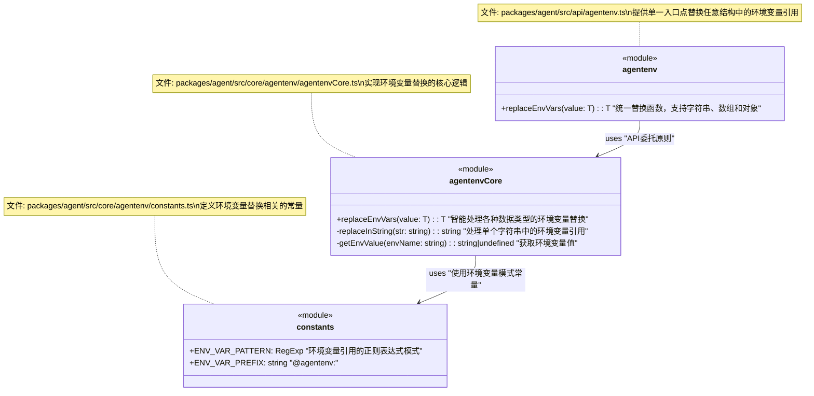

 # DPML Agent环境变量处理模块设计文档

## 1. 概述

`agentenv`是DPML Agent模块中的一个专用组件，负责处理DPML文档中的环境变量引用。该模块提供了一种安全、统一的方式来在DPML配置中引用环境变量，避免将敏感信息（如API密钥）直接硬编码在配置文件中。它采用特定的格式标记`@agentenv:ENV_NAME`，允许在编译过程中动态替换为实际的环境变量值。

### 1.1 设计目标

- **简洁API**：提供最小化但功能完整的接口，易于使用和理解
- **类型安全**：完全支持TypeScript类型，确保类型安全和IDE支持
- **通用性**：能够处理各种数据结构中的环境变量引用
- **可测试性**：设计易于测试的接口和组件
- **可扩展性**：允许未来扩展支持更复杂的环境变量处理

## 2. 核心设计理念

### 2.1 简洁而不简陋

`agentenv`模块采用极简设计，仅提供一个核心函数`replaceEnvVars<T>`，但该函数能够智能处理各种数据类型，包括：
- 字符串
- 数组
- 嵌套对象
- 混合数据结构

通过TypeScript的泛型和类型守卫，这个单一函数能够适应几乎所有环境变量替换场景，无需用户决定使用哪个特定函数。

### 2.2 明确的语法标记

为避免与未来可能的DPML官方语法冲突，模块使用特定前缀`@agentenv:`标记环境变量引用。这种显式标记：
- 明确表示这是Agent模块的特有扩展
- 避免与未来DPML核心功能冲突
- 在文档中易于识别和搜索

### 2.3 通过环境变量分离配置和敏感信息

该模块支持敏感信息与配置分离的最佳实践：
- 配置文件中只包含环境变量引用，不包含实际值
- 实际值可以通过环境变量、.env文件或命令行选项提供
- 提高了配置的安全性和灵活性

## 3. 系统架构

`agentenv`模块遵循DPML的分层架构，分为API层和Core层：

```
packages/agent/src/
  ├── api/
  │   └── agentenv.ts       # API层入口，提供公共接口
  └── core/
      └── agentenv/         
          ├── index.ts      # Core内部入口
          ├── agentenvCore.ts # 核心实现
          └── constants.ts  # 常量定义
```

## 4. 组件设计

### 4.1 API设计

```typescript
// packages/agent/src/api/agentenv.ts
import * as agentenvCore from '../core/agentenv/agentenvCore';

/**
 * 替换值中的环境变量引用
 * 
 * 识别并替换字符串、数组或对象中的所有 @agentenv:ENV_NAME 格式的环境变量引用。
 * 支持任意嵌套的数据结构。
 * 
 * @param value 包含环境变量引用的值（字符串、数组或对象）
 * @returns 替换后的值，保持原始类型
 * @example
 * // 替换字符串
 * const apiKey = replaceEnvVars('@agentenv:API_KEY');
 * 
 * // 替换对象中的值
 * const config = replaceEnvVars({
 *   apiKey: '@agentenv:API_KEY',
 *   endpoint: '@agentenv:API_ENDPOINT'
 * });
 */
export function replaceEnvVars<T>(value: T): T {
  return agentenvCore.replaceEnvVars(value);
}
```

### 4.2 Core实现

```typescript
// packages/agent/src/core/agentenv/agentenvCore.ts
import { ENV_VAR_PATTERN } from './constants';

/**
 * 替换值中的环境变量引用（Core实现）
 */
export function replaceEnvVars<T>(value: T): T {
  // 处理null/undefined
  if (value === null || value === undefined) {
    return value;
  }
  
  // 处理字符串
  if (typeof value === 'string') {
    return replaceInString(value) as unknown as T;
  }
  
  // 处理数组
  if (Array.isArray(value)) {
    return value.map(item => replaceEnvVars(item)) as unknown as T;
  }
  
  // 处理对象
  if (typeof value === 'object') {
    const result: Record<string, any> = {};
    for (const key in value as Record<string, any>) {
      result[key] = replaceEnvVars((value as Record<string, any>)[key]);
    }
    return result as T;
  }
  
  // 其他类型直接返回
  return value;
}

/**
 * 替换字符串中的环境变量引用
 */
function replaceInString(value: string): string {
  return value.replace(ENV_VAR_PATTERN, (_match, envName) => {
    const envValue = process.env[envName];
    if (envValue === undefined) {
      console.warn(`警告: 环境变量 ${envName} 未定义`);
      return _match; // 保留原始表达式
    }
    return envValue;
  });
}
```

```typescript
// packages/agent/src/core/agentenv/constants.ts
/**
 * 环境变量引用的正则表达式模式
 * 匹配 @agentenv:ENV_NAME 格式
 */
export const ENV_VAR_PATTERN = /@agentenv:([A-Z0-9_]+)/g;

/**
 * 环境变量引用前缀
 */
export const ENV_VAR_PREFIX = '@agentenv:';
```

## 5. 组件关系图



## 6. 替换流程图

```mermaid
flowchart TD
    Start([开始]) --> InputCheck{检查输入类型}
    
    InputCheck -->|null/undefined| ReturnAsIs[返回原值]
    InputCheck -->|字符串| ProcessString[处理字符串]
    InputCheck -->|数组| ProcessArray[处理数组]
    InputCheck -->|对象| ProcessObject[处理对象]
    InputCheck -->|其他类型| ReturnAsIs
    
    ProcessString --> FindReferences[查找@agentenv:引用]
    FindReferences --> ReplaceReferences[替换为环境变量值]
    ReplaceReferences --> HandleMissing[处理缺失的环境变量]
    HandleMissing --> ReturnProcessed[返回处理后的字符串]
    
    ProcessArray --> LoopArray[遍历数组元素]
    LoopArray --> |递归调用| RecursiveProcess[递归处理每个元素]
    RecursiveProcess --> ReturnArray[返回处理后的数组]
    
    ProcessObject --> LoopObject[遍历对象属性]
    LoopObject --> |递归调用| RecursiveProcess
    RecursiveProcess --> ReturnObject[返回处理后的对象]
    
    ReturnProcessed --> End([结束])
    ReturnArray --> End
    ReturnObject --> End
    ReturnAsIs --> End
```

## 7. 使用示例

### 7.1 处理字符串

```typescript
import { replaceEnvVars } from '@dpml/agent/src/api/agentenv';

// 设置环境变量
process.env.API_KEY = 'sk-1234567890';

// 替换环境变量引用
const apiKey = replaceEnvVars('@agentenv:API_KEY');
console.log(apiKey); // 输出: sk-1234567890

// 替换多个引用
const url = replaceEnvVars('https://@agentenv:API_HOST/v1/@agentenv:API_VERSION');
// 假设环境变量已设置
// 输出: https://api.example.com/v1/2023-05-15
```

### 7.2 处理对象

```typescript
// 复杂对象
const config = replaceEnvVars({
  name: 'My Agent',
  credentials: {
    apiKey: '@agentenv:API_KEY',
    orgId: '@agentenv:ORG_ID'
  },
  endpoints: [
    '@agentenv:PRIMARY_ENDPOINT',
    '@agentenv:BACKUP_ENDPOINT'
  ],
  settings: {
    timeout: 30,
    retry: true,
    headers: {
      'Authorization': 'Bearer @agentenv:AUTH_TOKEN'
    }
  }
});

// 所有@agentenv:引用都会被替换为对应的环境变量值
```

### 7.3 在DPML文档中使用

```xml
<agent>
  <llm 
    api-type="openai" 
    api-key="@agentenv:OPENAI_API_KEY" 
    model="@agentenv:OPENAI_MODEL">
  </llm>
  
  <prompt>
    你是一个助手，你的名字是@agentenv:ASSISTANT_NAME
  </prompt>
</agent>
```

## 8. 总结

`agentenv`模块提供了一种简洁而强大的方式来处理DPML文档中的环境变量引用。其主要特点包括：

1. **单一入口点**：仅提供一个函数`replaceEnvVars<T>`，简化API同时保持功能完整
2. **通用性**：能够处理任意类型和嵌套级别的数据结构
3. **类型安全**：完全支持TypeScript类型，保证类型安全
4. **明确的语法**：使用`@agentenv:`前缀，避免与未来DPML语法冲突
5. **简单集成**：容易与现有系统集成，无复杂依赖

作为DPML Agent的一部分，这个模块遵循了DPML的架构原则，将API层和Core层职责明确分离，同时保持了简洁性和可维护性。