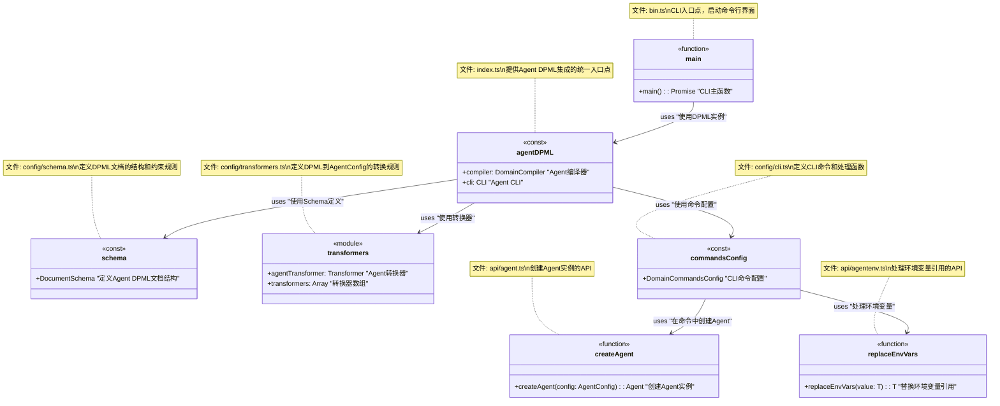
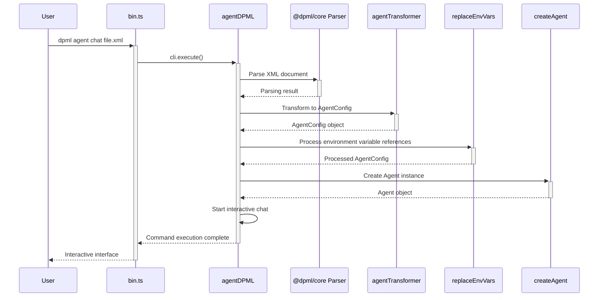
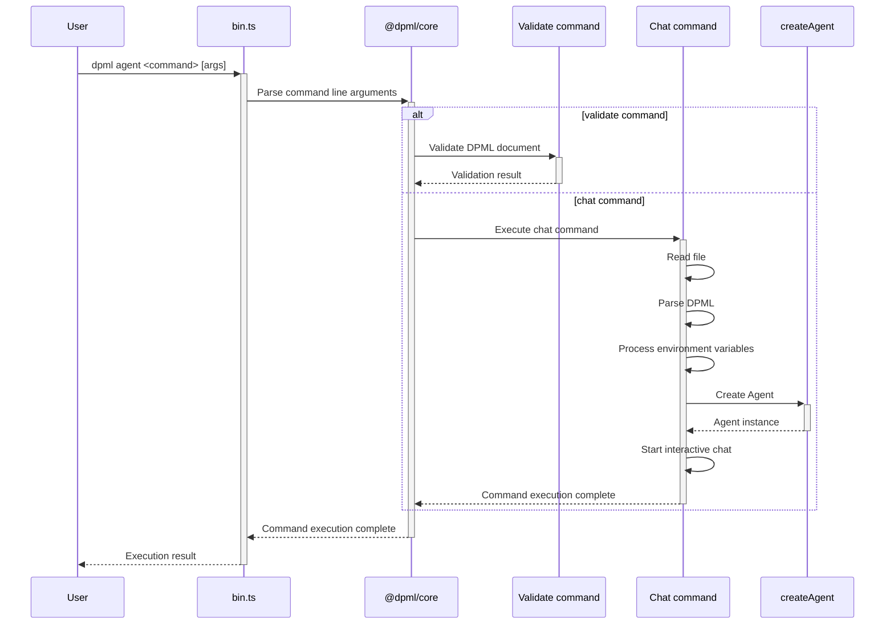

# DPML Integration设计文档

## 1. 概述

DPML Integration是Agent模块的扩展组件，用于实现DPML声明式语法与Agent模块的无缝集成。它使应用开发者能够通过DPML XML文档定义AI助手配置，并将其解析为AgentConfig对象，进而创建Agent实例。通过这种集成，用户可以更简洁、更直观地配置和使用AI代理，同时享受DPML的可扩展性和可维护性优势。

### 1.1 设计目标

- **声明式配置**：提供通过XML定义Agent的能力，降低配置复杂度
- **标准化解析**：使用@dpml/core提供的标准解析和验证机制
- **CLI支持**：提供命令行工具，方便用户交互使用Agent
- **环境变量集成**：支持在DPML中引用环境变量，增强安全性和灵活性
- **职责分离**：遵循DPML架构原则，保持各层级职责清晰

## 2. 核心设计理念

基于项目需求和架构规范，我们确立了以下核心设计理念：

1. **配置即代码**：
   - 将Agent配置视为一等公民，通过声明式语法定义
   - 确保配置可读、可维护、可版本控制
   - 支持注释和文档化

2. **统一入口**：
   - 提供单一的集成入口点
   - 维持现有API的稳定性和一致性
   - 新功能作为现有功能的自然扩展

3. **最小依赖原则**：
   - 仅依赖必要的外部组件
   - 避免引入过多的中间层
   - 确保核心功能不受集成方式影响

4. **环境无关**：
   - 同样的DPML文档在不同环境中可产生适合该环境的配置
   - 通过环境变量实现配置差异化
   - 保持开发、测试和生产环境的一致性

5. **命令行优先**：
   - 首先提供强大的命令行接口
   - 确保基本操作无需编程即可完成
   - 丰富的命令行选项满足多种使用场景

## 3. 系统架构

DPML Integration模块严格遵循项目的分层架构，并在合适的层次添加新组件：

1. **配置层**：schema、transformers和cli配置
2. **入口层**：主入口和CLI入口
3. **复用层**：复用现有的API层和Core层功能

模块结构:
```
agent/
  ├── src/
  │   ├── config/             # 配置层 - 新增
  │   │   ├── schema.ts       # DPML Schema定义
  │   │   ├── transformers.ts # 转换器定义
  │   │   ├── cli.ts          # CLI命令配置
  │   │   └── index.ts        # 配置导出
  │   │
  │   ├── api/                # API层 - 复用现有
  │   │   ├── agent.ts        # Agent API
  │   │   └── agentenv.ts     # 环境变量API
  │   │
  │   ├── types/              # Types层 - 复用现有
  │   │   ├── Agent.ts        # Agent接口
  │   │   └── AgentConfig.ts  # 配置接口
  │   │
  │   ├── core/               # Core层 - 复用现有
  │   │   └── agentService.ts # 核心服务
  │   │
  │   ├── bin.ts              # CLI入口 - 新增
  │   └── index.ts            # 包主入口 - 新增
```

## 4. 组件设计

### 4.1 Schema设计

```typescript
// config/schema.ts
import type { DocumentSchema } from '@dpml/core';

/**
 * Agent的DPML Schema定义
 * 
 * 定义DPML文档的结构和约束规则，
 * 包括元素、属性和内容模型。
 */
export const schema: DocumentSchema = {
  // 根元素定义
  root: {
    element: 'agent',
    children: {
      elements: [
        { $ref: 'llm' },
        { $ref: 'prompt' },
        { $ref: 'experimental' }
      ]
    }
  },
  // 可复用类型定义
  types: [
    {
      // LLM配置元素
      element: 'llm',
      attributes: [
        {
          name: 'api-type',
          required: true
        },
        {
          name: 'api-url'
        },
        {
          name: 'api-key'
        },
        {
          name: 'model',
          required: true
        }
      ]
    },
    {
      // 提示词元素
      element: 'prompt',
      content: {
        type: 'text',
        required: true
      }
    },
    {
      // 实验性功能元素
      element: 'experimental',
      children: {
        elements: [
          { $ref: 'tools' }
        ]
      }
    },
    {
      // 工具集元素
      element: 'tools',
      children: {
        elements: [
          { $ref: 'tool' }
        ]
      }
    },
    {
      // 工具元素
      element: 'tool',
      attributes: [
        {
          name: 'name',
          required: true
        },
        {
          name: 'description',
          required: true
        }
      ]
    }
  ]
};
```

### 4.2 转换器设计

```typescript
// config/transformers.ts
import { createTransformerDefiner } from '@dpml/core';
import type { AgentConfig, LLMConfig } from '../types';

// 创建转换器定义器
const definer = createTransformerDefiner();

/**
 * Agent转换器
 * 
 * 将DPML文档转换为AgentConfig对象
 */
export const agentTransformer = definer.defineStructuralMapper<unknown, AgentConfig>(
  'agentTransformer',
  [
    {
      // 将LLM元素转换为LLM配置
      selector: "agent > llm",
      targetPath: "llm",
      transform: (node) => {
        const llmConfig: LLMConfig = {
          apiType: node.attributes.get('api-type') || '',
          apiUrl: node.attributes.get('api-url'),
          apiKey: node.attributes.get('api-key'),
          model: node.attributes.get('model') || ''
        };
        return llmConfig;
      }
    },
    {
      // 将prompt元素转换为提示词
      selector: "agent > prompt",
      targetPath: "prompt",
      transform: (node) => node.content || ''
    }
  ]
);

// 导出所有转换器
export const transformers = [
  agentTransformer
];
```

### 4.3 CLI命令配置

```typescript
// config/cli.ts
import fs from 'fs/promises';
import path from 'path';
import readline from 'readline';
import dotenv from 'dotenv';
import type { DomainCommandsConfig } from '@dpml/core';
import { createAgent } from '../api/agent';
import { replaceEnvVars } from '../api/agentenv';

/**
 * Load environment variables
 */
function loadEnvironmentVariables(options: any): void {
  // Load from env file
  if (options.envFile) {
    const envPath = path.resolve(process.cwd(), options.envFile);
    dotenv.config({ path: envPath });
  }
  
  // Load from command line options
  if (options.env) {
    for (const envVar of options.env) {
      const [key, value] = envVar.split('=');
      if (key && value) {
        process.env[key] = value;
      }
    }
  }
}

/**
 * Execute interactive chat with Agent
 */
async function executeChat(actionContext: any, filePath: string, options: any): Promise<void> {
  try {
    // Load environment variables
    loadEnvironmentVariables(options);
    
    console.log('\nDPML Agent Chat');
    console.log(`Loading Agent configuration: ${filePath}\n`);
    
    // Read file content
    const content = await fs.readFile(filePath, 'utf-8');
    
    // Parse DPML with compiler
    const config = await actionContext.getCompiler().compile(content);
    
    // Process environment variables
    const processedConfig = replaceEnvVars(config);
    
    // Create Agent instance
    const agent = createAgent(processedConfig);
    
    // Create interactive interface
    const rl = readline.createInterface({
      input: process.stdin,
      output: process.stdout
    });
    
    console.log('Hello, I am an AI assistant. How can I help you?');
    
    // Interactive chat loop
    const askQuestion = () => {
      rl.question('> ', async (input) => {
        if (input.toLowerCase() === 'exit' || input.toLowerCase() === 'quit' || input.toLowerCase() === 'bye') {
          console.log('Session ended.');
          rl.close();
          return;
        }
        
        try {
          // Send message and get response
          const response = await agent.chat(input);
          console.log('\n' + response + '\n');
        } catch (error) {
          console.error('Error:', error instanceof Error ? error.message : String(error));
        }
        
        // Continue waiting for input
        askQuestion();
      });
    };
    
    // Start interactive loop
    askQuestion();
  } catch (error) {
    console.error('Error:', error instanceof Error ? error.message : String(error));
    process.exit(1);
  }
}

/**
 * Agent CLI commands configuration
 */
export const commandsConfig: DomainCommandsConfig = {
  // Include standard validate command
  includeStandard: true,
  
  // Custom commands
  actions: [
    {
      name: 'chat',
      description: 'Start interactive chat with Agent',
      args: [
        {
          name: 'filePath',
          description: 'Agent configuration file path',
          required: true
        }
      ],
      options: [
        {
          flags: '-e, --env <KEY=VALUE...>',
          description: 'Set environment variables'
        },
        {
          flags: '-f, --env-file <path>',
          description: 'Specify environment variables file path'
        },
        {
          flags: '-d, --debug',
          description: 'Enable debug mode'
        }
      ],
      action: executeChat
    }
  ]
};
```

### 4.4 配置导出

```typescript
// config/index.ts
import { schema } from './schema';
import { transformers } from './transformers';
import { commandsConfig } from './cli';

// 统一导出配置组件
export {
  schema,
  transformers,
  commandsConfig
};
```

### 4.5 主入口设计

```typescript
// index.ts
import { createDomainDPML } from '@dpml/core';
import { schema, transformers, commandsConfig } from './config';
import type { AgentConfig } from './types';

/**
 * 创建Agent领域DPML实例
 * 
 * 集成Schema、转换器和CLI配置，
 * 提供编译和命令行功能。
 */
export const agentDPML = createDomainDPML<AgentConfig>({
  domain: 'agent',
  description: 'Agent配置领域',
  schema,
  transformers,
  commands: commandsConfig,
  options: {
    strictMode: true,
    errorHandling: 'throw'
  }
});

/**
 * 导出编译器，便于直接使用
 */
export const compiler = agentDPML.compiler;

/**
 * 导出API
 */
export * from './api/agent';
```

### 4.6 CLI入口设计

```typescript
#!/usr/bin/env node
// bin.ts
import { agentDPML } from './index';

/**
 * CLI主函数
 */
async function main() {
  try {
    // 执行CLI命令
    await agentDPML.cli.execute();
  } catch (error) {
    console.error('CLI执行出错:', error instanceof Error ? error.message : String(error));
    process.exit(1);
  }
}

// 运行主函数
main();
```

### 4.7 AgentEnv Integration

```typescript
// Integrating agentenv in the workflow

/**
 * Process the AgentConfig by replacing all environment variable references
 * 
 * This function should be called after compiling DPML to AgentConfig
 * and before creating the Agent instance.
 */
function processAgentConfig(config: AgentConfig): AgentConfig {
  // Replace all environment variable references in the entire config object
  // The function reads values from process.env (system environment variables)
  return replaceEnvVars(config);
}

// Usage in command handlers or API functions
async function createAgentFromDPML(dpmlContent: string): Promise<Agent> {
  // Step 1: Compile DPML to AgentConfig
  const config = await compiler.compile(dpmlContent);
  
  // Step 2: Process environment variables in a single step
  const processedConfig = processAgentConfig(config);
  
  // Step 3: Create Agent instance
  return createAgent(processedConfig);
}
```

The integration between CLI environment variable handling and agentenv follows this workflow:

1. **CLI Command Handling**:
   ```typescript
   // CLI parses --env parameters or .env file
   function loadEnvironmentVariables(options: any): void {
     // From command line options
     if (options.env) {
       for (const envVar of options.env) {
         const [key, value] = envVar.split('=');
         if (key && value) {
           // Directly write to system environment variables
           process.env[key] = value;
         }
       }
     }
     
     // From env file (using dotenv)
     if (options.envFile) {
       // dotenv also writes to process.env
       dotenv.config({ path: options.envFile });
     }
   }
   ```

2. **AgentEnv Processing**:
   ```typescript
   // In the core agentenvCore.ts implementation
   function replaceInString(value: string): string {
     return value.replace(ENV_VAR_PATTERN, (_match, envName) => {
       // Read from system environment variables
       const envValue = process.env[envName];
       if (envValue === undefined) {
         console.warn(`Warning: Environment variable ${envName} is not defined`);
         return _match; // Keep original expression
       }
       return envValue;
     });
   }
   ```

This design creates a seamless integration where:

1. Environment variables are set via CLI arguments or .env files
2. These values are written to the Node.js process environment
3. When processing DPML, agentenv reads from the same environment

The environment variable processing is intentionally kept separate from the DPML compilation process. This separation of concerns follows the single responsibility principle:

1. **DPML Compilation**: Responsible for parsing XML and transforming it to AgentConfig
2. **Environment Variable Processing**: Responsible for replacing `@agentenv:ENV_NAME` references with actual values
3. **Agent Creation**: Responsible for creating the Agent instance with processed configuration

This design allows maximum flexibility:
- Environment variable processing can be skipped if needed
- Custom environment variable processing can be added
- The same DPML document can produce different configurations in different environments

For enhanced security, sensitive information like API keys should always be referenced using the environment variable syntax (`@agentenv:API_KEY`) rather than hardcoded in DPML documents.

## 5. 组件关系图



## 6. 流程图

### 6.1 从DPML创建Agent的流程



### 6.2 CLI命令执行流程



## 7. 使用示例

### 7.1 DPML配置示例

```xml
<agent>
  <llm 
    api-type="openai" 
    api-key="@agentenv:OPENAI_API_KEY" 
    model="gpt-4-turbo">
  </llm>
  
  <prompt>
    You are a professional JavaScript and TypeScript assistant, focused on providing concise and efficient code solutions.
    When users ask programming questions, provide detailed explanations and code examples.
  </prompt>
  
  <experimental>
    <tools>
      <tool name="search" description="Search the web for information" />
    </tools>
  </experimental>
</agent>
```

### 7.2 命令行使用

```bash
# Validate DPML configuration
dpml agent validate my-agent.xml

# Interactive chat (environment variables from command line)
dpml agent chat my-agent.xml --env OPENAI_API_KEY=sk-xxxxx

# Interactive chat (environment variables from .env file)
dpml agent chat my-agent.xml --env-file .env
```

### 7.3 API使用

```typescript
import fs from 'fs/promises';
import { compiler, createAgent } from '@dpml/agent';
import { replaceEnvVars } from '@dpml/agent';

// Create Agent from DPML file
async function createAgentFromFile(filePath) {
  // Read DPML file
  const content = await fs.readFile(filePath, 'utf-8');
  
  // Compile DPML to AgentConfig
  const config = await compiler.compile(content);
  
  // Process environment variable references
  const processedConfig = replaceEnvVars(config);
  
  // Create Agent instance
  return createAgent(processedConfig);
}

// Use Agent
async function main() {
  const agent = await createAgentFromFile('my-agent.xml');
  
  // Send message
  const response = await agent.chat('How to implement the Singleton pattern in TypeScript?');
  console.log(response);
}
```

## 8. 总结

DPML Integration设计集成了DPML的声明式语法和Agent模块的功能，实现了从XML配置到Agent实例的完整转换流程。它严格遵循DPML架构规范，将相关功能有机组织在相应的层次中，保持了代码结构的清晰和职责的分离。

集成的核心优势包括：

1. **配置简化**：通过XML声明式语法定义Agent，更直观、更易维护
2. **环境隔离**：使用环境变量引用，避免敏感信息硬编码
3. **命令行支持**：提供丰富的CLI命令，方便用户交互
4. **标准集成**：遵循DPML标准集成模式，保持架构一致性
5. **可扩展性**：设计支持未来功能扩展，如工具支持、多代理协作等

这种集成方式使Agent模块更加灵活和易用，同时保持了与DPML生态系统的一致性，为用户提供了统一的开发体验。 