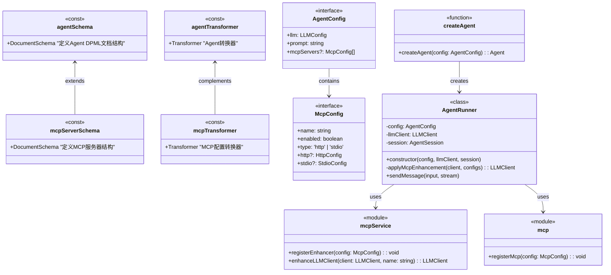
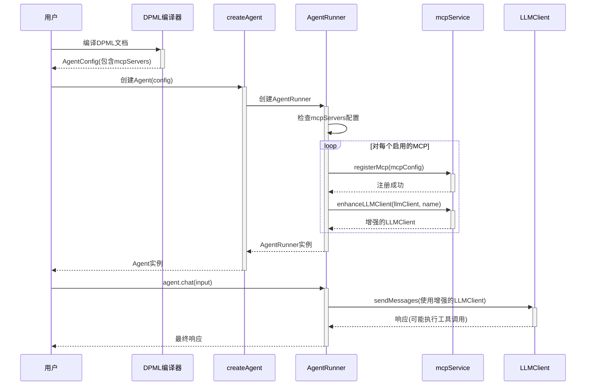
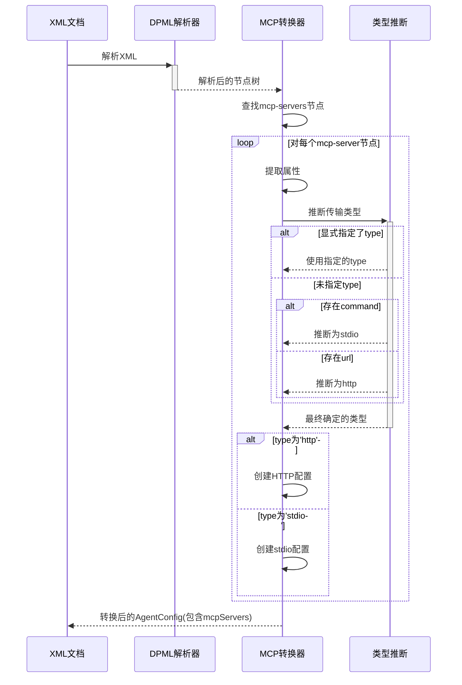

# MCP-DPML集成设计文档

## 1. 概述

MCP-DPML集成是Agent模块的扩展组件，用于实现Model Context Protocol (MCP)与DPML声明式语法的无缝集成。它使应用开发者能够通过DPML XML文档定义MCP服务器配置，并将其与Agent配置结合，创建具备工具调用能力的AI助手。通过这种集成，用户可以更便捷地连接大语言模型与外部数据源和工具，同时保持DPML的可扩展性和声明式优势。

### 1.1 设计目标

- **服务器声明式配置**：通过XML定义MCP服务器，简化配置复杂度
- **多服务器支持**：允许配置多个MCP服务器，提供丰富的工具和资源
- **传输类型自动推断**：智能推断传输类型，减少冗余配置
- **透明集成**：对现有Agent使用者保持最小干扰性
- **内部封装**：将MCP增强逻辑封装在内部实现中，对外部接口透明

## 2. 核心设计理念

基于项目需求和架构规范，我们确立了以下核心设计理念：

1. **声明即连接**：
   - 声明式方式定义MCP服务器
   - 配置即代表连接意图，无需额外编程
   - 支持注释和文档化

2. **自动推断**：
   - 尽可能减少显式配置，使用智能推断
   - 基于已有配置属性推断传输类型
   - 提供合理默认值，降低配置负担

3. **内部增强**：
   - 在现有的Agent创建流程内部实现MCP集成
   - 保持公共API不变，对现有代码影响最小
   - 增强逻辑对客户端代码完全透明

4. **容错设计**：
   - 单个MCP服务失败不影响Agent整体功能
   - 提供明确的错误信息和日志
   - 支持优雅降级，保持核心功能可用

5. **灵活扩展**：
   - 支持未来添加更多MCP服务类型
   - 保留扩展接口，便于功能演进
   - 设计考虑多MCP协作的未来优化

## 3. 系统架构

MCP-DPML集成模块遵循项目的分层架构，并在现有组件基础上进行扩展：

1. **Schema扩展**：扩展DPML Schema以支持MCP配置
2. **转换器扩展**：添加MCP配置的转换逻辑
3. **内部增强**：在AgentRunner中添加MCP集成代码

模块结构:
```
agent/
  ├── src/
  │   ├── config/             # 配置层 - 扩展
  │   │   ├── schema.ts       # 添加MCP Schema定义
  │   │   └── transformers.ts # 添加MCP转换器定义
  │   │
  │   ├── api/                # API层 - 保持不变
  │   │   └── agent.ts        # 现有Agent API
  │   │
  │   ├── types/              # Types层 - 扩展
  │   │   ├── McpConfig.ts    # MCP配置类型定义（已有）
  │   │   └── AgentConfig.ts  # 扩展以支持MCP
  │   │
  │   ├── core/               # Core层 - 扩展
  │   │   ├── AgentRunner.ts  # 在内部集成MCP增强
  │   │   ├── mcpService.ts   # MCP服务管理（已有）
  │   │   └── mcp/            # MCP核心实现（已有）
```

## 4. 组件设计

### 4.1 Schema扩展

```typescript
// 扩展config/schema.ts中的Agent Schema

// 原有Agent Schema
const agentSchema = {
  root: {
    element: 'agent',
    children: {
      elements: [
        { $ref: 'llm' },
        { $ref: 'prompt' },
        { $ref: 'experimental' }
      ]
    }
  },
  // ...其他现有类型
};

// 扩展以支持MCP服务器配置
const mcpServerSchema = {
  element: 'mcp-server',
  attributes: [
    {
      name: 'name',
      required: true
    },
    {
      name: 'enabled',
      type: 'boolean',
      default: true
    },
    {
      name: 'type',
      enum: ['http', 'stdio']
    },
    {
      name: 'url'
    },
    {
      name: 'command'
    },
    {
      name: 'args'
    }
  ]
};

// 扩展Agent Schema以包含MCP服务器
const extendedAgentSchema = {
  ...agentSchema,
  root: {
    ...agentSchema.root,
    children: {
      elements: [
        ...agentSchema.root.children.elements,
        { $ref: 'mcp-servers' }
      ]
    }
  },
  types: [
    ...agentSchema.types,
    {
      element: 'mcp-servers',
      children: {
        elements: [
          { $ref: 'mcp-server' }
        ]
      }
    },
    mcpServerSchema
  ]
};
```

### 4.2 转换器扩展

```typescript
// 扩展config/transformers.ts中的Agent转换器

// 原有Agent转换器
const agentTransformer = definer.defineStructuralMapper<unknown, AgentConfig>(
  'agentTransformer',
  [
    // ...现有转换规则
  ]
);

// 添加MCP转换规则
const mcpTransformer = definer.defineStructuralMapper<unknown, AgentConfig>(
  'mcpTransformer',
  [
    {
      // 将mcp-servers元素转换为mcpServers数组
      selector: "agent > mcp-servers > mcp-server",
      targetPath: "mcpServers",
      transform: (node, context) => {
        // 获取所有服务器节点
        const serverNodes = context.selectNodes("agent > mcp-servers > mcp-server");
        
        // 转换为McpConfig数组
        return serverNodes.map(serverNode => {
          const name = serverNode.attributes.get('name');
          const enabled = serverNode.attributes.get('enabled') !== 'false';
          const type = serverNode.attributes.get('type');
          const url = serverNode.attributes.get('url');
          const command = serverNode.attributes.get('command');
          const argsStr = serverNode.attributes.get('args');
          
          // 解析args字符串为数组
          const args = argsStr ? argsStr.split(' ') : undefined;
          
          // 推断传输类型（如未明确指定）
          const inferredType = inferTransportType(type, command, url);
          
          // 根据类型返回相应配置
          if (inferredType === 'http') {
            return {
              name,
              enabled,
              type: 'http',
              http: { url: url || '' }
            };
          } else {
            return {
              name,
              enabled,
              type: 'stdio',
              stdio: { 
                command: command || '',
                args
              }
            };
          }
        });
      }
    }
  ]
);

// 辅助函数：推断传输类型
function inferTransportType(
  explicitType?: string, 
  command?: string, 
  url?: string
): 'http' | 'stdio' {
  // 如果明确指定了类型，则使用指定的类型
  if (explicitType === 'http' || explicitType === 'stdio') {
    return explicitType;
  }
  
  // 否则根据提供的属性推断
  if (command) {
    return 'stdio';
  } else if (url) {
    return 'http';
  }
  
  // 默认为stdio
  return 'stdio';
}

// 导出扩展后的转换器
export const transformers = [
  agentTransformer,
  mcpTransformer
];
```

### 4.3 AgentRunner集成

```typescript
// 在core/AgentRunner.ts中集成MCP增强

import type { AgentConfig, ChatInput, ChatOutput, McpConfig } from '../types';
import type { LLMClient } from './llm/LLMClient';
import type { AgentSession } from './session/AgentSession';
import type { Message } from './types';
import { registerMcp } from '../api/mcp';
import { enhanceLLMClient } from './mcpService';

/**
 * Agent运行器
 *
 * 负责处理消息发送和接收的核心类。
 */
export class AgentRunner {
  private config: AgentConfig;
  private llmClient: LLMClient;
  private session: AgentSession;

  constructor(config: AgentConfig, llmClient: LLMClient, session: AgentSession) {
    this.config = config;
    
    // 检查并应用MCP增强
    this.llmClient = this.applyMcpEnhancement(llmClient, config.mcpServers);
    this.session = session;
  }

  /**
   * 应用MCP增强
   * 
   * @param baseClient 基础LLM客户端
   * @param mcpConfigs MCP配置数组
   * @returns 增强后的LLM客户端
   */
  private applyMcpEnhancement(baseClient: LLMClient, mcpConfigs?: McpConfig[]): LLMClient {
    // 如果没有MCP配置，返回原始客户端
    if (!mcpConfigs || mcpConfigs.length === 0) {
      return baseClient;
    }

    // 应用所有启用的MCP增强
    let enhancedClient = baseClient;
    for (const mcpConfig of mcpConfigs) {
      // 跳过未启用的MCP服务
      if (mcpConfig.enabled === false) {
        continue;
      }

      try {
        // 注册MCP增强器
        registerMcp(mcpConfig);
        
        // 增强LLM客户端
        enhancedClient = enhanceLLMClient(enhancedClient, mcpConfig.name);
        
        console.log(`成功加载MCP服务: ${mcpConfig.name}`);
      } catch (error) {
        // 记录错误但继续处理其他MCP服务
        console.error(`MCP服务 ${mcpConfig.name} 加载失败:`, error);
      }
    }

    return enhancedClient;
  }

  // ...其他现有方法保持不变
}
```

### 4.4 AgentConfig类型扩展

```typescript
// 扩展types/AgentConfig.ts

import type { McpConfig } from './McpConfig';

/**
 * Agent配置
 * 
 * 定义创建Agent所需的配置信息。
 */
export interface AgentConfig {
  /**
   * LLM配置信息
   */
  readonly llm: LLMConfig;
  
  /**
   * 系统提示词，定义Agent的行为和能力
   */
  readonly prompt: string;

  /**
   * MCP服务器配置
   */
  readonly mcpServers?: McpConfig[];
  
  // ...其他现有配置项
}
```

## 5. 组件关系图



## 6. 流程图

### 6.1 MCP集成流程



### 6.2 MCP配置解析流程



## 7. 使用示例

### 7.1 基本HTTP服务器配置

```xml
<agent>
  <llm api-type="openai" api-key="sk-xxx" model="gpt-4" />
  
  <prompt>
    你是一个功能强大的AI助手，可以帮助用户查询信息和执行操作。
  </prompt>
  
  <mcp-servers>
    <mcp-server 
      name="search-api" 
      url="http://localhost:3000/mcp" />
  </mcp-servers>
</agent>
```

### 7.2 基本stdio服务器配置

```xml
<agent>
  <llm api-type="anthropic" api-key="sk-xxx" model="claude-3-opus-20240229" />
  
  <prompt>
    你是一个功能强大的AI助手，可以帮助用户管理文件和执行系统操作。
  </prompt>
  
  <mcp-servers>
    <mcp-server 
      name="file-tools" 
      command="node" 
      args="./file-server.js" />
  </mcp-servers>
</agent>
```

### 7.3 多服务器配置

```xml
<agent>
  <llm api-type="openai" api-key="sk-xxx" model="gpt-4" />
  
  <prompt>
    你是一个全能AI助手，可以帮助用户查询信息、分析数据和执行系统操作。
  </prompt>
  
  <mcp-servers>
    <!-- HTTP服务器，用于Web搜索 -->
    <mcp-server 
      name="search-api" 
      type="http"
      url="http://localhost:3000/mcp" />
    
    <!-- stdio服务器，用于文件操作 -->
    <mcp-server 
      name="file-tools" 
      type="stdio" 
      command="node" 
      args="./file-server.js" />
    
    <!-- stdio服务器，用于数据库操作 -->
    <mcp-server 
      name="db-tools" 
      type="stdio" 
      command="python" 
      args="-m db_server" />
    
    <!-- 禁用的服务器示例 -->
    <mcp-server 
      name="experimental-tools" 
      enabled="false"
      command="node" 
      args="./experimental-server.js" />
  </mcp-servers>
</agent>
```

### 7.4 使用环境变量

```xml
<agent>
  <llm api-type="openai" api-key="@agentenv:OPENAI_API_KEY" model="gpt-4" />
  
  <prompt>
    你是一个功能强大的AI助手，可以帮助用户查询数据库信息。
  </prompt>
  
  <mcp-servers>
    <mcp-server 
      name="dbhub-scorpio-oa" 
      command="npx" 
      args="-y @bytebase/dbhub --transport stdio --dsn mysql://@agentenv:DB_USER:@agentenv:DB_PASSWORD@rm-bp1w5d7f70zr9md50zo.mysql.rds.aliyuncs.com:3306/scorpio_oa" />
  </mcp-servers>
</agent>
```

## 8. 总结

MCP-DPML集成设计实现了声明式配置MCP服务器的能力，让用户可以通过简单的XML配置连接大语言模型与外部数据源和工具。这种设计遵循了低侵入性原则，将MCP增强逻辑封装在AgentRunner内部，对外部调用者完全透明。

集成的核心优势包括：

1. **声明式配置**：通过XML声明MCP服务器，简化配置复杂度
2. **自动推断**：智能推断传输类型，减少冗余配置
3. **透明集成**：对现有Agent使用者保持最小干扰性
4. **容错设计**：单个MCP服务失败不影响Agent整体功能
5. **可扩展性**：支持未来添加更多MCP服务类型和优化

这种集成方式使Agent模块获得了强大的工具调用能力，同时保持了配置的简洁性和系统的可维护性，为用户提供了统一的开发体验。

未来可以考虑的优化方向包括：
1. 解决多MCP服务的工具命名冲突问题
2. 优化多层闭包设计，提高性能和可调试性
3. 添加更丰富的MCP服务类型支持和配置选项 