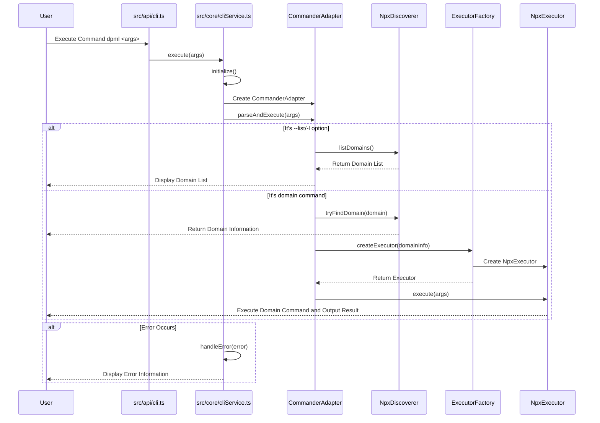

# DPML CLI Design Document

## 1. Overview

DPML CLI module is the unified command line entry point for the DPML toolchain, providing a consistent user experience. It acts as a "shell" that routes user input commands to the corresponding domain package (core, agent, example, etc.) for processing. The CLI module does not directly implement business logic but focuses on discovering available domain packages and correctly forwarding commands.

### 1.1 Design Goals

- **Single Entry Point**: Provide a single command `dpml` as the entry point for all DPML functionalities
- **Flexible Discovery**: Support multiple domain discovery mechanisms to ensure efficiency and scalability
- **Single Responsibility**: Clear component responsibility division to ensure focus separation
- **Simple Interaction**: Intuitive command format `dpml <domain> [commands...] [options...]`
- **Easy to Extend**: Support seamless addition of new domain packages and discovery mechanisms

## 2. Core Design Concepts

Based on project requirements and architecture specifications, we established the following core design concepts:

1. **Chain of Responsibility Pattern**:
   - Use the Chain of Responsibility pattern to implement domain discovery
   - Try different discovery strategies in priority order
   - Support quick failure and early return

2. **Command Adapter Pattern**:
   - Use the Adapter pattern to abstract command line parsing logic
   - Isolate specific command line library implementations
   - Provide a unified command execution interface

3. **Executor Strategy Pattern**:
   - Use the Strategy pattern to encapsulate different execution methods
   - Provide a unified execution interface, hiding implementation differences
   - Support local execution and npx execution, etc.

4. **Factory Pattern**:
   - Use the Factory pattern to create executor instances
   - Select the appropriate executor based on domain information
   - Support future addition of new executor types

5. **Information Object Pattern**:
   - Use domain information objects to pass data between components
   - Decouple the discovery and executor
   - Ensure data flow clarity

## 3. System Architecture

The CLI module strictly follows the project's layered architecture:

1. **API Layer**: cli module, providing the execute function
2. **Types Layer**: Define CommandAdapter, DomainDiscoverer, DomainExecutor interfaces
3. **Core Layer**: Implement cliService and related components, manage command parsing and execution process

Module Structure:
```
packages/cli/
  ├── src/
  │   ├── api/
  │   │   └── cli.ts            # API entry, providing the execute function
  │   ├── types/
  │   │   ├── CommandAdapter.ts # Command Adapter interface
  │   │   ├── DomainDiscoverer.ts # Domain Discoverer interface
  │   │   ├── DomainExecutor.ts # Domain Executor interface
  │   │   ├── DomainInfo.ts     # Domain Information type
  │   │   └── DPMLError.ts      # Error type
  │   └── core/
  │       ├── cliService.ts     # Top-level module service, coordinate command parsing and execution
  │       ├── adapters/
  │       │   └── CommanderAdapter.ts # Commander.js Adapter implementation
  │       ├── discovery/
  │       │   ├── NpxDiscoverer.ts    # NPX Domain Discoverer
  │       │   └── domainDiscovererFactory.ts # Discoverer Factory
  │       └── execution/
  │           ├── ExecutorFactory.ts  # Executor Factory
  │           └── NpxExecutor.ts      # NPX Executor implementation
  └── docs/
      └── CLI-Design.md         # Current Design Document
```

## 4. Component Design

### 4.1 API Design

```typescript
// src/api/cli.ts
import { cliService } from '../core/cliService';

/**
 * Execute CLI Command
 * 
 * Process command line arguments and route to the corresponding domain package.
 * 
 * @param args Command line arguments, default is process.argv.slice(2)
 * @returns Promise to void
 */
export async function execute(args: string[] = process.argv.slice(2)): Promise<void> {
  // Delegate to cliService to execute command
  return cliService.execute(args);
}
```

### 4.2 Type Definitions

```typescript
// src/types/CommandAdapter.ts
/**
 * Command Adapter interface
 * 
 * Define standard interfaces for command line parsing and execution.
 */
export interface CommandAdapter {
  /**
   * Parse and Execute CLI Command
   * @param args Command line arguments
   * @returns Promise to void
   */
  parseAndExecute(args: string[]): Promise<void>;
  
  /**
   * Get CLI Version
   * @returns Version string
   */
  getVersion(): string;
}

// src/types/DomainDiscoverer.ts
/**
 * Domain Discoverer interface
 * 
 * Define standard interfaces for discovering DPML domains.
 */
export interface DomainDiscoverer {
  /**
   * Try to Find Domain Information
   * @param domain Domain name
   * @returns Promise to domain information or null
   */
  tryFindDomain(domain: string): Promise<DomainInfo | null>;
  
  /**
   * List Available Domains
   * @returns Promise to domain information array
   */
  listDomains(): Promise<DomainInfo[]>;
  
  /**
   * Get Discoverer Name
   * @returns Discoverer name
   */
  getName(): string;
}

// src/types/DomainExecutor.ts
/**
 * Domain Executor interface
 * 
 * Define standard interfaces for executing domain commands.
 */
export interface DomainExecutor {
  /**
   * Get Domain Information
   * @returns Domain Information
   */
  getDomainInfo(): DomainInfo;
  
  /**
   * Execute Domain Command
   * @param args Command line arguments
   * @returns Promise to void
   */
  execute(args: string[]): Promise<void>;
}

// src/types/DomainInfo.ts
/**
 * Domain Information
 * 
 * Contains basic information about the domain and execution information.
 */
export interface DomainInfo {
  /**
   * Domain Name
   */
  readonly name: string;
  
  /**
   * Package Name
   */
  readonly packageName: string;
  
  /**
   * Source Identifier, such as "builtin", "npx", etc.
   */
  readonly source: string;
  
  /**
   * Version Information, Optional
   */
  readonly version?: string;
}

// src/types/DPMLError.ts
/**
 * DPML Error Type
 */
export enum DPMLErrorType {
  /**
   * Command Error
   */
  COMMAND = 'COMMAND',
  
  /**
   * Domain Discovery Error
   */
  DISCOVERY = 'DISCOVERY',
  
  /**
   * Execution Error
   */
  EXECUTION = 'EXECUTION',
  
  /**
   * Configuration Error
   */
  CONFIG = 'CONFIG',
  
  /**
   * Unknown Error
   */
  UNKNOWN = 'UNKNOWN'
}

/**
 * DPML Error
 * 
 * Unified error class for handling all errors in DPML CLI.
 */
export class DPMLError extends Error {
  /**
   * Error Type
   */
  readonly type: DPMLErrorType;
  
  /**
   * Error Code
   */
  readonly code: string;
  
  /**
   * Original Error
   */
  readonly cause?: Error;
  
  /**
   * Create DPML Error
   * 
   * @param message Error message
   * @param type Error type
   * @param code Error code
   * @param cause Original error
   */
  constructor(
    message: string,
    type: DPMLErrorType = DPMLErrorType.UNKNOWN,
    code: string = 'DPML_ERROR',
    cause?: Error
  ) {
    super(message);
    this.name = 'DPMLError';
    this.type = type;
    this.code = code;
    this.cause = cause;
  }
}
```

### 4.3 Core Layer Design

```typescript
// src/core/cliService.ts
import { CommandAdapter } from '../types/CommandAdapter';
import { DomainDiscoverer } from '../types/DomainDiscoverer';
import { ExecutorFactory } from './execution/ExecutorFactory';
import { CommanderAdapter } from './adapters/CommanderAdapter';
import { NpxDiscoverer } from './discovery/NpxDiscoverer';
import { DPMLError, DPMLErrorType } from '../types/DPMLError';

/**
 * CLI Service
 * 
 * Top-level service module coordinating command parsing and execution.
 */
export const cliService = {
  /**
   * Execute CLI Command
   * 
   * @param args Command line arguments
   * @returns Promise to void
   */
  async execute(args: string[]): Promise<void> {
    try {
      // Initialize components
      const components = await this.initialize();
      
      // Execute command
      await components.commandAdapter.parseAndExecute(args);
    } catch (error) {
      // Handle error
      this.handleError(error);
    }
  },
  
  /**
   * Initialize CLI Components
   * 
   * @returns Initialized component object
   */
  async initialize() {
    // Create domain discoverer
    const domainDiscoverer = new NpxDiscoverer();
    
    // Create executor factory
    const executorFactory = new ExecutorFactory();
    
    // Create command adapter
    const commandAdapter = new CommanderAdapter(domainDiscoverer, executorFactory);
    
    return {
      domainDiscoverer,
      executorFactory,
      commandAdapter
    };
  },
  
  /**
   * Handle Error
   * 
   * @param error Error object
   */
  handleError(error: unknown): never {
    // Already DPML error, directly handle
    if (error instanceof DPMLError) {
      console.error(`Error: ${error.message}`);
      process.exit(1);
    }
    
    // Convert to DPML error
    const dpmlError = new DPMLError(
      error instanceof Error ? error.message : String(error),
      DPMLErrorType.UNKNOWN,
      'UNKNOWN_ERROR',
      error instanceof Error ? error : undefined
    );
    
    console.error(`Unknown Error: ${dpmlError.message}`);
    process.exit(1);
  }
};

// src/core/adapters/CommanderAdapter.ts
import { Command } from 'commander';
import { CommandAdapter } from '../../types/CommandAdapter';
import { DomainDiscoverer } from '../../types/DomainDiscoverer';
import { ExecutorFactory } from '../execution/ExecutorFactory';
import { DPMLError, DPMLErrorType } from '../../types/DPMLError';
import readPackageUp from 'read-package-up';

/**
 * Commander.js Adapter
 * 
 * Command Adapter based on Commander.js.
 */
export class CommanderAdapter implements CommandAdapter {
  /**
   * Commander Program Instance
   */
  private program: Command;
  
  /**
   * Constructor
   * 
   * @param domainDiscoverer Domain Discoverer
   * @param executorFactory Executor Factory
   */
  constructor(
    private readonly domainDiscoverer: DomainDiscoverer,
    private readonly executorFactory: ExecutorFactory
  ) {
    // Create Commander Program Instance
    this.program = new Command();
    
    // Set Basic Information
    this.setupCommands();
  }
  
  /**
   * Parse and Execute CLI Command
   * 
   * @param args Command line arguments
   */
  public async parseAndExecute(args: string[]): Promise<void> {
    // Parse command
    await this.program.parseAsync(args, { from: 'user' });
  }
  
  /**
   * Get CLI Version
   * 
   * @returns Version string
   */
  public async getVersion(): Promise<string> {
    try {
      // Use read-package-up to find and read package.json
      const result = await readPackageUp();
      return result?.packageJson?.version || '0.0.0';
    } catch (error) {
      // Fallback to default version on error
      return '0.0.0';
    }
  }
  
  /**
   * Set CLI Commands
   */
  private setupCommands(): void {
    // Set Basic Information
    this.program
      .name('dpml')
      .description('DPML (Deepractice Prompt Markup Language) Command Line Tool')
      .version(this.getVersion(), '-v, --version', 'Display Version')
      .option('-l, --list', 'List all available DPML domains', () => this.handleListOption());
    
    // Default command processor - For domain commands
    this.program
      .arguments('<domain> [args...]')
      .allowUnknownOption()
      .action((domain: string, args: string[]) => {
        this.handleDomainCommand(domain, args);
      });
    
    // Add Help Text
    this.program.addHelpText('after', `
Example:
  dpml --list     or  dpml -l         List all available domains
  dpml -v         or  dpml --version  Display Version Information
  dpml -h         or  dpml --help     Display Help Information
  dpml core validate file.xml         Validate DPML Document
  dpml agent chat config.xml          Interact with Agent

For more information, please visit: https://github.com/Deepractice/dpml
`);
  }
  
  /**
   * Handle List Option
   */
  private async handleListOption(): Promise<void> {
    try {
      // Get all available domains
      const domains = await this.domainDiscoverer.listDomains();
      
      if (domains.length === 0) {
        console.log('No available DPML domain found');
        return;
      }
      
      console.log('Available DPML domains:');
      console.log('');
      
      // Display domain list
      domains.forEach(domain => {
        console.log(`  ${domain.name}${domain.version ? ` (${domain.version})` : ''}`);
      });
    } catch (error) {
      throw new DPMLError(
        `Cannot list domains: ${error instanceof Error ? error.message : String(error)}`,
        DPMLErrorType.DISCOVERY,
        'LIST_DOMAINS_ERROR',
        error instanceof Error ? error : undefined
      );
    }
  }
  
  /**
   * Handle Domain Command
   * 
   * @param domain Domain name
   * @param args Command arguments
   */
  private async handleDomainCommand(domain: string, args: string[]): Promise<void> {
    try {
      // Find domain
      const domainInfo = await this.domainDiscoverer.tryFindDomain(domain);
      
      if (!domainInfo) {
        throw new DPMLError(
          `Domain not found: ${domain}`,
          DPMLErrorType.DISCOVERY,
          'DOMAIN_NOT_FOUND'
        );
      }
      
      // Create executor
      const executor = this.executorFactory.createExecutor(domainInfo);
      
      // Execute command
      await executor.execute(args);
    } catch (error) {
      if (error instanceof DPMLError) {
        throw error;
      }
      
      throw new DPMLError(
        `Domain Command Execution Failed: ${error instanceof Error ? error.message : String(error)}`,
        DPMLErrorType.EXECUTION,
        'DOMAIN_EXECUTION_ERROR',
        error instanceof Error ? error : undefined
      );
    }
  }
}

// src/core/discovery/NpxDiscoverer.ts
import { DomainDiscoverer } from '../../types/DomainDiscoverer';
import { DomainInfo } from '../../types/DomainInfo';
import { DPMLError, DPMLErrorType } from '../../types/DPMLError';
import { execa } from 'execa';

/**
 * Official Domain Package Mapping Table
 */
const OFFICIAL_DOMAINS: Record<string, string> = {
  'core': '@dpml/core',
  'agent': '@dpml/agent',
  'example': '@dpml/example'
};

/**
 * NPX Domain Discoverer
 * 
 * Use NPX to find domain packages and execute commands.
 */
export class NpxDiscoverer implements DomainDiscoverer {
  /**
   * Discoverer Name
   */
  public getName(): string {
    return 'npx';
  }
  
  /**
   * Try to Find Domain Information
   * 
   * @param domain Domain name
   * @returns Promise to domain information or null
   */
  public async tryFindDomain(domain: string): Promise<DomainInfo | null> {
    try {
      // Check if it's an official domain
      if (domain in OFFICIAL_DOMAINS) {
        return {
          name: domain,
          packageName: OFFICIAL_DOMAINS[domain],
          source: this.getName()
        };
      }
      
      // Check if it's a complete package name
      if (domain.startsWith('@dpml/')) {
        return {
          name: domain.substring(6), // Remove '@dpml/' prefix
          packageName: domain,
          source: this.getName()
        };
      }
      
      // Try to find third-party package
      const packageName = `@dpml/${domain}`;
      const version = await this.getPackageVersion(packageName);
      
      if (version) {
        return {
          name: domain,
          packageName,
          source: this.getName(),
          version
        };
      }
      
      return null;
    } catch (error) {
      // Search failed, return null
      return null;
    }
  }
  
  /**
   * List Available Domains
   * 
   * @returns Promise to domain information array
   */
  public async listDomains(): Promise<DomainInfo[]> {
    const officialDomains = await this.listOfficialDomains();
    
    // Only return official domains
    // Note: Later, it can be expanded to find all installed @dpml/* packages
    return officialDomains;
  }
  
  /**
   * List Official Domains
   * 
   * @returns Promise to domain information array
   */
  private async listOfficialDomains(): Promise<DomainInfo[]> {
    const domains: DomainInfo[] = [];
    
    for (const [name, packageName] of Object.entries(OFFICIAL_DOMAINS)) {
      try {
        const version = await this.getPackageVersion(packageName);
        
        domains.push({
          name,
          packageName,
          source: this.getName(),
          version
        });
      } catch (error) {
        // Skip packages that cannot get version
        continue;
      }
    }
    
    return domains;
  }
  
  /**
   * Get Package Version
   * 
   * @param packageName Package name
   * @returns Promise to version or null
   */
  private async getPackageVersion(packageName: string): Promise<string | null> {
    try {
      // Use execa to execute npm view command
      const { stdout } = await execa('npm', ['view', packageName, 'version'], {
        reject: false // Don't throw on non-zero exit codes
      });
      
      return stdout ? stdout.trim() : null;
    } catch (error) {
      return null;
    }
  }
}

// src/core/execution/ExecutorFactory.ts
import { DomainExecutor } from '../../types/DomainExecutor';
import { DomainInfo } from '../../types/DomainInfo';
import { NpxExecutor } from './NpxExecutor';
import { DPMLError, DPMLErrorType } from '../../types/DPMLError';

/**
 * Executor Factory
 * 
 * Create appropriate executor instance based on domain information.
 */
export class ExecutorFactory {
  /**
   * Create Executor
   * 
   * @param domainInfo Domain Information
   * @returns Domain Executor
   */
  public createExecutor(domainInfo: DomainInfo): DomainExecutor {
    // Select executor type based on source
    switch (domainInfo.source) {
      case 'npx':
        return new NpxExecutor(domainInfo);
      default:
        throw new DPMLError(
          `Unsupported domain source: ${domainInfo.source}`,
          DPMLErrorType.EXECUTION,
          'UNSUPPORTED_DOMAIN_SOURCE'
        );
    }
  }
}

// src/core/execution/NpxExecutor.ts
import { DomainExecutor } from '../../types/DomainExecutor';
import { DomainInfo } from '../../types/DomainInfo';
import { execa } from 'execa';
import { DPMLError, DPMLErrorType } from '../../types/DPMLError';

/**
 * NPX Executor
 * 
 * Use NPX to execute domain commands.
 */
export class NpxExecutor implements DomainExecutor {
  /**
   * Constructor
   * 
   * @param domainInfo Domain Information
   */
  constructor(private readonly domainInfo: DomainInfo) {}
  
  /**
   * Get Domain Information
   * 
   * @returns Domain Information
   */
  public getDomainInfo(): DomainInfo {
    return this.domainInfo;
  }
  
  /**
   * Execute Domain Command
   * 
   * @param args Command arguments
   */
  public async execute(args: string[]): Promise<void> {
    try {
      // Use execa to execute npx command with the domain package
      const result = await execa('npx', [this.domainInfo.packageName, ...args], {
        stdio: 'inherit', // Pass stdio stream directly
        reject: false // Don't throw on non-zero exit codes, handle manually
      });
      
      // Check exit code
      if (result.exitCode !== 0) {
        throw new DPMLError(
          `Command Execution Failed, Exit Code: ${result.exitCode}`,
          DPMLErrorType.EXECUTION,
          'EXECUTION_FAILED'
        );
      }
    } catch (error) {
      // Handle execution errors
      if (error instanceof DPMLError) {
        throw error;
      }
      
      throw new DPMLError(
        `Command Execution Error: ${error instanceof Error ? error.message : String(error)}`,
        DPMLErrorType.EXECUTION,
        'EXECUTION_ERROR',
        error instanceof Error ? error : undefined
      );
    }
  }
}
```

## 5. Execution Process

The following is the main execution process of CLI:



## 6. Extension Points

The CLI module has designed the following key extension points:

### 6.1 Domain Discovery Mechanism Extension

By implementing the `DomainDiscoverer` interface, new domain discovery mechanisms can be added:

1. **Local Installation Discoverer**: Find locally installed DPML domain packages
2. **Directory Discoverer**: Find DPML domain packages in specified directories
3. **Configuration Discoverer**: Read domain information from configuration files
4. **Registry Discoverer**: Query domain information from central registry

### 6.2 Command Adapter Extension

By implementing the `CommandAdapter` interface, different command line parsing libraries can be used:

1. **Yargs Adapter**: Based on Yargs library
2. **Minimist Adapter**: Based on Minimist library
3. **Custom Adapter**: Completely custom command parsing implementation

### 6.3 Executor Extension

By implementing the `DomainExecutor` interface, different execution strategies can be added:

1. **Local Executor**: Load and execute directly installed packages
2. **Subprocess Executor**: Execute commands in subprocess
3. **Docker Executor**: Execute commands in Docker container
4. **Remote Executor**: Execute commands on remote server

## 7. Development Path

The development path of CLI module follows the progressive design principle:

### First Stage: Basic Functionality

1. Implement domain discovery and execution based on NPX
2. Support the following basic commands:
   - `dpml --list` or `dpml -l`: List all available DPML domains
   - `dpml --version` or `dpml -v`: Display CLI version information
   - `dpml --help` or `dpml -h`: Display help information
   - `dpml <domain> [args...]`: Execute domain command
3. Support basic error handling

### Second Stage: Enhanced Functionality

1. Add local installation package discovery mechanism
2. Add more CLI options and commands
3. Improve error handling and logging output
4. Add automatic completion support

### Third Stage: Advanced Functionality

1. Implement mixed mode between responsibility chain and registry
2. Add plugin management functionality
3. Support custom configuration
4. Provide more extension points

## 8. Test Strategy

The test strategy of CLI module is divided into the following levels:

### 8.1 Unit Test

1. **Component Unit Test**: Test independent functionality of each component
2. **Error Handling Test**: Test various error scenarios
3. **Interface Consistency Test**: Test consistency of interface implementation

### 8.2 Integration Test

1. **Component Integration Test**: Test collaboration between components
2. **Process Integration Test**: Test complete command execution process
3. **Error Propagation Test**: Test error propagation between components

### 8.3 End-to-End Test

1. **Command Execution Test**: Test real command execution
2. **User Interface Test**: Test user interface behavior
3. **Package Discovery Test**: Test actual package discovery and execution

## 9. Key Dependencies

The CLI module relies on several external dependencies to provide its core functionality:

### 9.1 read-package-up

For package version detection, we use the `read-package-up` library instead of directly reading package.json:

- **Purpose**: Find and read the closest package.json file
- **Benefits**:
  - Automatically walks up directories to find package.json
  - Handles missing or malformed package.json files gracefully
  - Provides type-safe access to package information
  - Works consistently across different environments

### 9.2 execa

For executing child processes, we use the `execa` library instead of Node.js built-in child_process module:

- **Purpose**: Execute child processes with improved control and error handling
- **Benefits**:
  - Better error handling with detailed error information
  - Promise-based API for easier async/await usage
  - Provides consistent behavior across platforms
  - Simpler process output handling and redirection
  - Built-in timeout and signal support
  - Better TypeScript integration

## 10. Conclusion

The DPML CLI module uses the Chain of Responsibility and Adapter design patterns to create a flexible, scalable command line interface. Through clear interface definitions and strict responsibility separation, we ensure code maintainability and testability. The implementation relies on modern libraries like `read-package-up` and `execa` to provide robust package detection and process execution capabilities.

The initial implementation focuses on domain discovery and execution based on NPX, laying a solid foundation for future extensions. Subsequent development will follow the progressive design principle, gradually adding more features and extension points to meet growing needs.