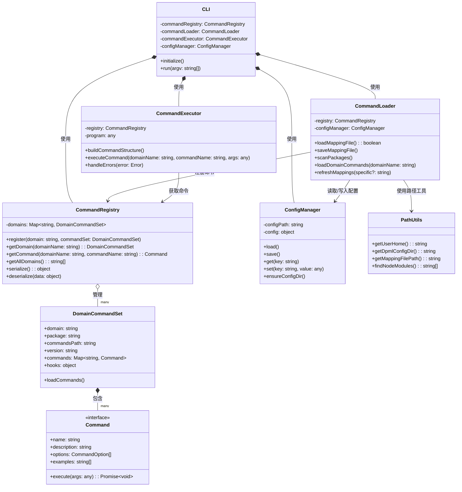
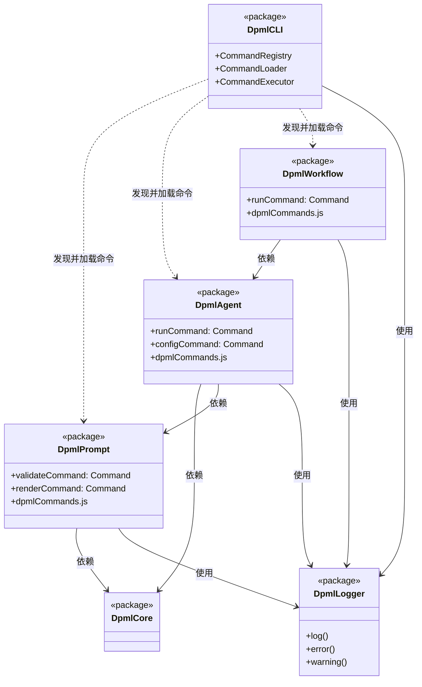
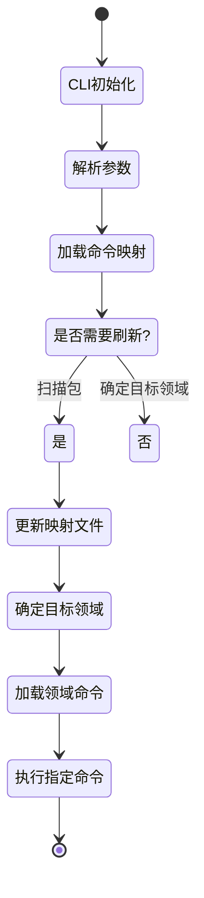
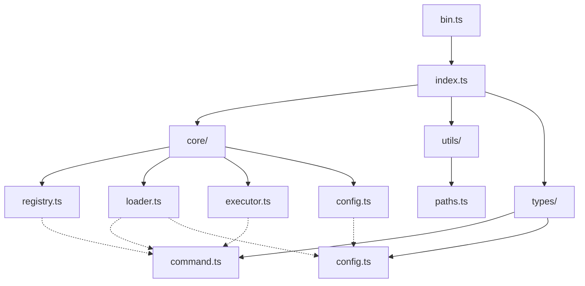
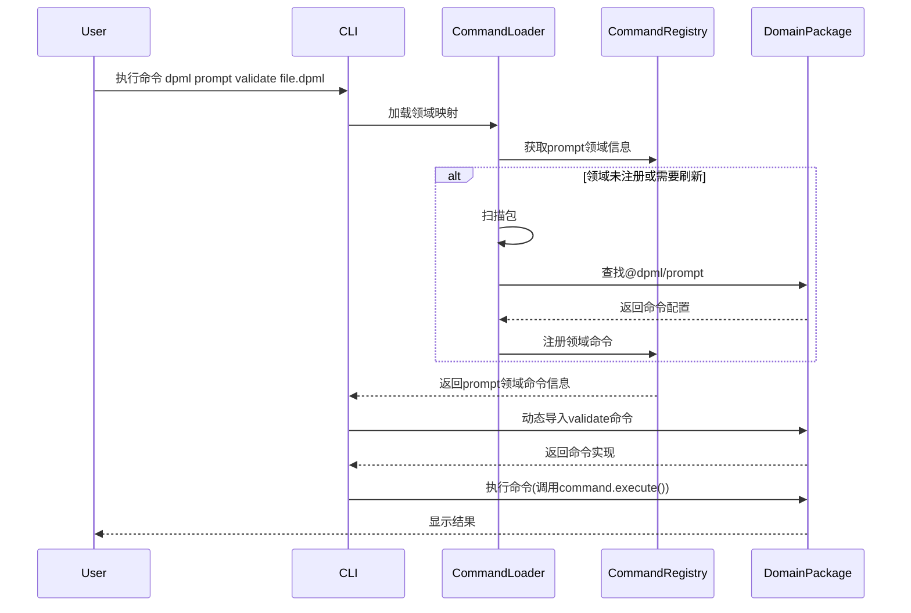

# DPML CLI 组件类图

本文档提供DPML CLI的主要组件及其关系的UML类图。

## 核心组件类图

> **注意**: 以下是Mermaid格式的类图。如果遇到渲染问题，可以使用VS Code的"Markdown Preview Mermaid Support"插件，或者访问 https://mermaid.live 粘贴代码查看。

## 包间依赖关系与命令注册

## 命令处理流程

## 文件结构与模块关系

## 命令发现和执行序列图

