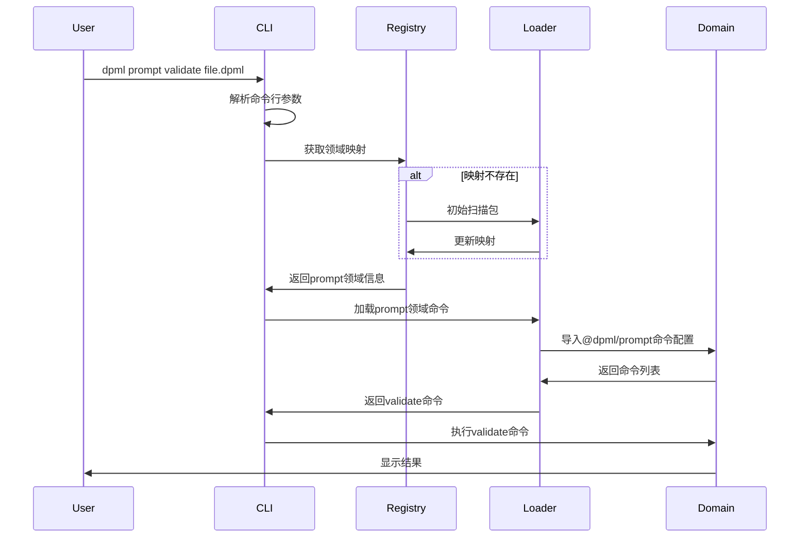

# DPML CLI 开发实现指南

本文档为DPML CLI的开发提供实现指南，综合了前期讨论的设计理念和实现方案。

## 设计目标

DPML CLI的设计目标是：

1. **领域驱动**: 命令结构反映系统的领域概念
2. **模块化**: CLI核心与具体领域命令解耦
3. **可扩展**: 支持新领域和第三方扩展
4. **一致性**: 提供统一的命令行体验
5. **高效性**: 快速响应，避免不必要的性能开销

## 系统架构

### 高级架构图

```
┌─────────────────────────────────────────────────────┐
│                                                     │
│                    DPML CLI (核心)                   │
│                                                     │
├─────────────────────────────────────────────────────┤
│                                                     │
│    命令发现机制    │    参数解析    │    执行引擎     │
│                                                     │
└───────────┬───────────────┬──────────────┬─────────┘
            │               │              │
    ┌───────▼───────┐ ┌─────▼────────┐ ┌───▼────────────┐
    │               │ │              │ │                │
    │  @dpml/prompt │ │ @dpml/agent  │ │ @dpml/workflow │
    │               │ │              │ │                │
    └───────────────┘ └──────────────┘ └────────────────┘
```

## 命令结构设计

DPML CLI采用基于领域的分层命令结构：

```
dpml [全局选项] <领域> <命令> [命令选项] [参数]
```

例如：
```
dpml --verbose prompt validate --strict template.dpml
```

### 主要领域

1. **prompt**: 提示模板处理
2. **agent**: 代理相关操作
3. **workflow**: 工作流管理

每个领域包含多个相关命令，形成一个二级命令结构。

## 命令注册发现机制

### 设计思路

CLI采用"配置发现"的方式，各领域包自行定义命令，CLI负责发现和加载：

1. **CLI核心**: 提供命令注册框架和执行环境
2. **领域包**: 各自定义领域特定命令
3. **命令映射**: 维护领域到包的映射关系

### 映射文件

CLI在`~/.dpml/domain-mapping.json`维护领域到包的映射：

```json
{
  "lastUpdated": "2023-11-15T10:30:00Z",
  "domains": {
    "prompt": {
      "package": "@dpml/prompt",
      "commandsPath": "dist/dpml.config.js",
      "version": "0.1.0"
    },
    "agent": {
      "package": "@dpml/agent",
      "commandsPath": "dist/dpml.config.js",
      "version": "0.1.0"
    }
  }
}
```

### 命令配置

各领域包必须在包根目录提供标准命名的配置文件 `dpml.config.ts`，该文件编译后的JavaScript版本将被CLI加载。

### 命令发现流程

1. CLI启动后解析命令行参数
2. 确定目标领域
3. 从映射文件查找对应包（若映射文件不存在或为空，则提示用户使用`--update`选项）
4. 加载该包的 `dpml.config.js` 配置文件
5. 执行指定命令

> **注意**：CLI不会自动创建或更新映射文件，首次使用时需要手动执行`--update`选项初始化映射。

### 刷新机制

用户可通过`--update`选项触发命令映射更新：

```bash
dpml --update             # 刷新所有命令映射
dpml <domain> --update    # 只刷新特定领域
```

## 技术实现

### 核心依赖

根据技术栈文档，CLI实现使用以下依赖：

- **commander**: 命令行参数解析
- **inquirer**: 交互式提示
- **ora**: 加载动画
- **chalk**: 终端着色
- **boxen**: 信息框展示

### 依赖包应用方案

#### Commander

用于整个命令行参数解析系统，特别适合我们的分层命令结构：

```typescript
// CLI入口 (bin.ts)
import { Command } from 'commander';

// 创建主程序
const program = new Command();

// 设置全局选项
program
  .version('0.1.0')
  .option('-v, --verbose', '显示详细输出')
  .option('-q, --quiet', '静默模式')
  .option('--update', '更新命令映射');

// 当领域命令加载后，会创建类似这样的结构
// (通过CommandLoader动态生成)
program
  .command('prompt')
  .description('提示模板相关命令')
  .addCommand(validateCommand)
  .addCommand(renderCommand);

// 解析参数
program.parse(process.argv);
```

#### Inquirer

用于交互式命令输入和配置收集：

```typescript
// 首次运行向导例子
import inquirer from 'inquirer';

async function firstTimeSetup(): Promise<void> {
  const answers = await inquirer.prompt([
    {
      type: 'confirm',
      name: 'scanPackages',
      message: '这是您首次运行DPML CLI，是否扫描可用包？',
      default: true
    },
    {
      type: 'checkbox',
      name: 'domains',
      message: '选择要启用的领域：',
      choices: ['prompt', 'agent', 'workflow'],
      when: (answers) => answers.scanPackages
    }
  ]);

  if (answers.scanPackages) {
    // 执行扫描...
  }
}

// 参数缺失时的交互式提示
async function promptMissingArgs(command: string): Promise<string> {
  const { filePath } = await inquirer.prompt([
    {
      type: 'input',
      name: 'filePath',
      message: `请输入要${command}的文件路径：`
    }
  ]);
  return filePath;
}
```

#### Ora

用于显示操作进度和状态：

```typescript
// 扫描包时的加载动画
import ora from 'ora';

async function updateMappings(): Promise<void> {
  const spinner = ora('正在扫描可用包...').start();
  
  try {
    // 执行扫描操作...
    await scanPackages();
    spinner.succeed('命令映射已更新');
  } catch (error) {
    spinner.fail(`更新失败: ${error.message}`);
    throw error;
  }
}

// 执行长时间运行命令的进度显示
async function executeCommand(command: Command, args: any): Promise<void> {
  const spinner = ora('正在执行命令...').start();
  
  try {
    await command.execute(args);
    spinner.succeed('命令执行成功');
  } catch (error) {
    spinner.fail('命令执行失败');
    throw error;
  }
}
```

#### Chalk

用于美化命令行输出和错误信息：

```typescript
// 日志工具封装
import chalk from 'chalk';

class Logger {
  static info(message: string): void {
    console.log(chalk.blue('info'), message);
  }
  
  static success(message: string): void {
    console.log(chalk.green('✓'), message);
  }
  
  static warn(message: string): void {
    console.log(chalk.yellow('warning'), message);
  }
  
  static error(message: string): void {
    console.error(chalk.red('error'), message);
  }
  
  static help(command: string, description: string): void {
    console.log(`  ${chalk.cyan(command.padEnd(20))}${description}`);
  }
}

// 帮助信息美化
function printHelp(commands: Command[]): void {
  console.log(chalk.bold('\n可用命令:\n'));
  
  commands.forEach(cmd => {
    Logger.help(`${cmd.name}`, cmd.description);
  });
}
```

#### Boxen

用于突出显示重要信息：

```typescript
// 版本信息展示
import boxen from 'boxen';
import chalk from 'chalk';

function showVersion(): void {
  const version = '0.1.0';
  const message = chalk.white.bold(`DPML CLI v${version}`);
  
  const box = boxen(message, {
    padding: 1,
    margin: 1,
    borderStyle: 'round',
    borderColor: 'cyan'
  });
  
  console.log(box);
}

// 重要提示信息
function showImportantMessage(message: string): void {
  const box = boxen(chalk.yellow(message), {
    padding: 1,
    margin: {top: 1, bottom: 1},
    borderStyle: 'single',
    borderColor: 'yellow',
    title: '提示',
    titleAlignment: 'center'
  });
  
  console.log(box);
}
```

通过组合这些工具库，我们可以创建一个体验丰富、用户友好的命令行界面，使DPML CLI既易于使用又专业可靠。

### 模块结构

```
src/
├── bin.ts                # CLI入口点
├── index.ts              # 主模块导出
├── core/                 # 核心功能
│   ├── registry.ts       # 命令注册表
│   ├── loader.ts         # 命令加载器
│   ├── executor.ts       # 命令执行器
│   └── config.ts         # 配置管理
├── utils/                # 工具函数
│   ├── fs.ts             # 文件系统工具
│   ├── paths.ts          # 路径处理
│   ├── logger.ts         # 日志工具
│   └── validation.ts     # 验证工具
└── types/                # 类型定义
    ├── command.ts        # 命令接口
    └── config.ts         # 配置接口
```

### 命令执行流程



## 参数解析实现

遵循`command-line-arguments.md`中定义的参数格式规范：

1. **全局参数**: 使用commander的全局选项
2. **领域命令**: 使用commander的子命令
3. **命令选项**: 使用commander的命令选项

参数解析示例：

```typescript
const program = new Command();

// 全局选项
program
  .version('0.1.0')
  .option('-v, --verbose', '显示详细输出')
  .option('-q, --quiet', '静默模式')
  .option('--update', '更新命令映射');

// 加载动态命令
loadDomainCommands(program);

// 解析参数
program.parse(process.argv);
```

## 存储和缓存设计

### 用户配置目录

CLI在用户主目录创建`.dpml`目录，用于存储配置和缓存：

```
~/.dpml/
├── domain-mapping.json   # 领域映射文件
├── config.json           # 用户配置
└── cache/                # 缓存目录
```

### 缓存策略

1. **命令映射缓存**: 避免每次执行都扫描
2. **版本记录**: 在映射文件中记录包版本信息，用于参考
3. **手动更新**: 只通过`--update`选项进行映射更新，暂不支持自动更新

> **注意**: 当前设计中，CLI不会自动检测包版本变更或自动更新映射。用户必须在安装新包或更新现有包后手动执行`--update`选项来更新命令映射。

## 错误处理

初期实现采用简化的错误处理方案，主要关注以下关键错误场景：

1. **参数错误**: 显示正确的命令用法
   ```
   错误: 无效的命令选项 '--invalidOption'
   提示: 使用 'dpml prompt validate --help' 查看有效选项
   ```

2. **领域不存在**: 提示可用领域
   ```
   错误: 找不到领域 'invalid'
   提示: 可用领域有: prompt, agent, workflow
   ```

3. **命令不存在**: 提示可用命令
   ```
   错误: 在 'prompt' 领域中找不到命令 'invalid'
   提示: 可用命令有: validate, render, list
   ```

4. **映射文件错误**: 提示使用更新选项
   ```
   错误: 命令映射文件不存在或已损坏
   提示: 请使用 'dpml --update' 创建或更新命令映射
   ```

5. **执行失败**: 显示错误详情
   ```
   错误: 命令执行失败: 无法读取文件 'template.dpml'
   提示: 请检查文件路径是否正确
   ```

### 实现方式

基础错误处理使用简单的函数式方法：

```typescript
// 核心错误处理函数
function handleError(error: Error, context?: any): void {
  console.error(`错误: ${error.message}`);
  
  // 根据错误类型提供基本建议
  if (error.message.includes('command not found')) {
    const domain = context?.domain;
    const availableCommands = context?.availableCommands || [];
    console.error(`提示: 在 '${domain}' 领域中可用的命令: ${availableCommands.join(', ')}`);
    console.error(`使用 'dpml ${domain} --help' 查看详细帮助`);
  } else if (error.message.includes('domain not found')) {
    const availableDomains = context?.availableDomains || [];
    console.error(`提示: 可用的领域: ${availableDomains.join(', ')}`);
    console.error(`使用 'dpml --help' 查看所有可用领域`);
  } else if (error.message.includes('mapping file')) {
    console.error(`提示: 使用 'dpml --update' 更新命令映射`);
  }
  
  // 在详细模式下输出堆栈信息
  if (context?.verbose) {
    console.error('\n堆栈信息:');
    console.error(error.stack);
  }
  
  process.exit(1);
}
```

### 未来改进计划

在后续迭代中，将开发更全面的错误处理系统，包括：

1. 结构化的错误类型层次
2. 标准化的错误码系统
3. 更丰富的错误上下文和诊断信息
4. 集中式的错误管理器
5. 错误文档参考系统

初期实现专注于提供基本的功能性错误处理，确保用户能够理解错误并获得简单的解决建议。

## 实现路径

### 第一阶段：基础框架

1. 实现CLI核心框架
2. 命令注册表和基本命令加载
3. 全局命令(帮助、版本)

### 第二阶段：命令发现

1. 领域映射机制
2. 包命令配置加载
3. 刷新命令实现

### 第三阶段：完整功能

1. 所有领域命令集成
2. 环境变量支持
3. 用户配置管理

### 第四阶段：优化和测试

1. 性能优化
2. 错误处理完善
3. 全面测试

## 测试计划

1. **单元测试**: 测试各组件功能
2. **集成测试**: 测试命令发现和执行流程
3. **系统测试**: 测试CLI整体功能
4. **用户测试**: 评估用户体验

## 发布和维护

1. **版本管理**: 遵循语义化版本
2. **文档**: 维护详细的用户文档
3. **示例**: 提供常见使用场景的示例

## 总结

本设计指南为DPML CLI的实现提供了详细的技术路线。CLI采用基于领域的命令结构，实现了命令的自动发现和注册，为用户提供一致、高效的命令行体验。同时，设计保持了系统的可扩展性，支持未来新领域和第三方扩展的集成。

开发团队应参照本文档进行实现，同时根据实际情况进行必要的调整和优化。 