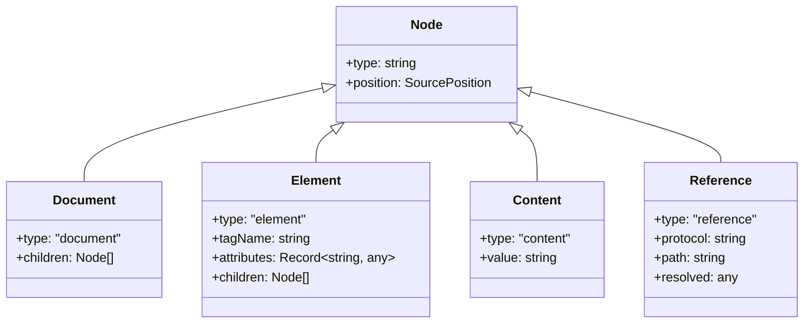
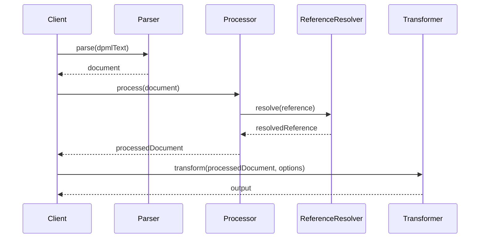
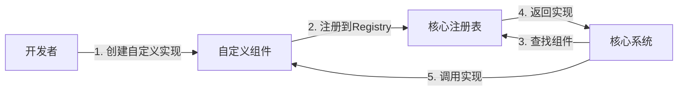

# @dpml/core 顶层设计文档

## 1. 设计目标与原则

### 1.1 核心目标

`@dpml/core`作为DPML生态系统的基础设施层，旨在提供:

1. **稳定的基础架构**：为整个DPML生态提供坚实的技术基础
2. **统一的解析能力**：解析DPML文档，生成标准化的抽象语法树(AST)
3. **灵活的扩展机制**：支持标签、引用和转换器的扩展
4. **高效的引用系统**：处理各种协议的资源引用
5. **标准的错误处理**：提供统一、友好的错误处理机制

### 1.2 设计原则

1. **接口先于实现**：优先定义清晰的接口，然后再考虑具体实现
2. **关注点分离**：模块化设计，每个组件只负责其核心功能
3. **最小依赖原则**：减少外部依赖，确保核心包的轻量性
4. **向下依赖原则**：高级包依赖低级包，避免循环依赖
5. **扩展点内置**：核心功能预留明确的扩展点
6. **性能优先**：在关键路径上优化性能
7. **类型安全**：利用TypeScript提供强类型保障

### 1.3 解决的问题

1. 提供统一的DPML文档解析机制
2. 建立标签定义和处理的标准框架
3. 实现灵活的引用解析系统
4. 创建文档处理和转换的流程
5. 提供错误处理和诊断工具

## 2. 系统架构

### 2.1 整体架构

下图展示了@dpml/core的核心模块及其关系：


### 2.2 模块职责

- **Parser**: 负责将DPML文本解析为AST
- **Types**: 定义核心类型和接口
- **References**: 处理@引用系统
- **Processor**: 处理解析后的文档
- **Transformer**: 转换文档为各种输出格式
- **Errors**: 提供错误类型和处理机制
- **Utils**: 通用工具函数
- **Registry**: 各种注册表（标签、转换器等）
- **Markdown**: Markdown解析与处理
- **Constants**: 定义常量和配置默认值

### 2.3 与其他包的关系

DPML采用领域驱动的分层架构，各包之间存在清晰的依赖关系：

```mermaid
flowchart TD
    Core[/@dpml/core/]
    Prompt[/@dpml/prompt/]
    Agent[/@dpml/agent/]
    Workflow[/@dpml/workflow/]
    CLI[/@dpml/cli/]
    
    Core --> Prompt
    Prompt --> Agent
    Agent --> Workflow
    Core --> CLI
    Prompt --> CLI
    Agent --> CLI
    Workflow --> CLI
```

- `@dpml/core`被所有其他包依赖
- 提供接口和类型定义给其他包实现
- 不依赖任何其他DPML包

## 3. 核心概念

### 3.1 DPML文档模型

DPML文档由不同类型的节点组成，包括：
- **Document**: 文档根节点
- **Element**: 标签节点，代表XML风格的标签
- **Content**: 内容节点，代表可能包含Markdown格式的内容
- **Reference**: 引用节点，代表@引用

文档模型的核心结构如下：



### 3.2 标签注册机制

Core包提供标签注册机制，允许定义：
- 标签的属性规范
- 标签的嵌套规则
- 标签的验证规则
- 标签的处理行为

### 3.3 引用系统

DPML支持通过@符号引用外部资源：
- 支持多种协议（http, file等）
- 提供可扩展的协议处理器
- 支持引用解析和缓存

## 4. 工作流程

### 4.1 核心流程概览

DPML文档处理的流程如下：



DPML文档处理的核心流程包括四个主要阶段：
1. **解析阶段**：将文本解析为AST
2. **处理阶段**：应用标签处理器处理AST
3. **引用阶段**：解析和加载引用的资源
4. **转换阶段**：将处理后的文档转换为目标格式

## 5. 扩展机制

### 5.1 可扩展点

Core包提供以下扩展点：

- **标签系统**：定义和处理自定义标签
- **引用系统**：处理自定义协议和引用格式
- **转换系统**：添加自定义输出格式

### 5.2 扩展方式

各扩展点通过注册表机制提供统一的注册和获取接口，确保扩展的一致性和可发现性。扩展主要通过各种Registry接口实现：

- 标签注册表
- 协议注册表
- 转换器注册表

扩展流程如下：



## 6. 技术选择

### 6.1 关键技术决策

- **解析策略**：组合使用现有XML解析库与自定义扩展
- **异步处理**：核心API使用Promise-based设计支持异步操作
- **错误处理**：分级错误处理机制，区分致命错误和警告

### 6.2 外部依赖

Core包尽量减少外部依赖，但可能会使用以下类型的依赖：
- 基础XML/HTML解析库
- Markdown处理库
- 通用工具库（如日期处理、路径处理等）

## 7. 演进计划

- **1.0**: 核心功能完整实现
- **1.1**: 性能优化与增强
- **1.2**: 高级特性（如LSP支持）

---

本文档定义了`@dpml/core`包的整体设计和职责。各模块的具体实现细节和接口定义将在各自的模块设计文档中详细说明。 