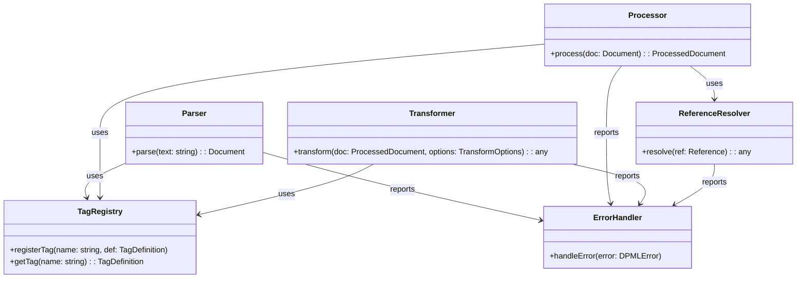
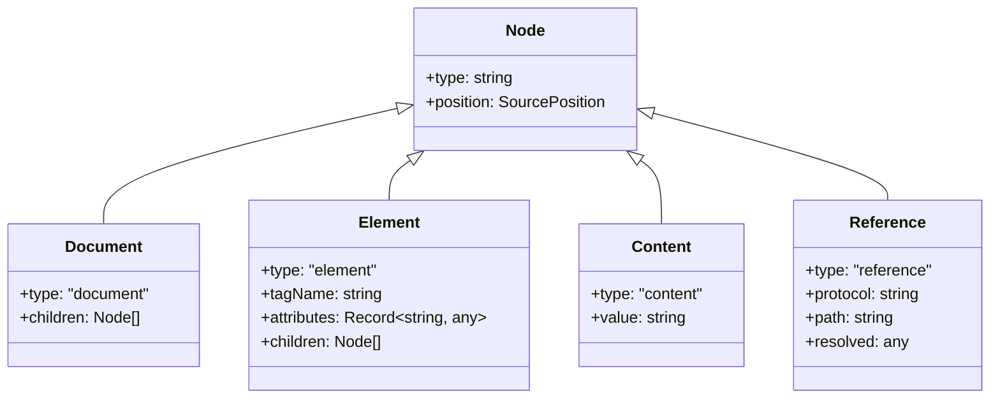
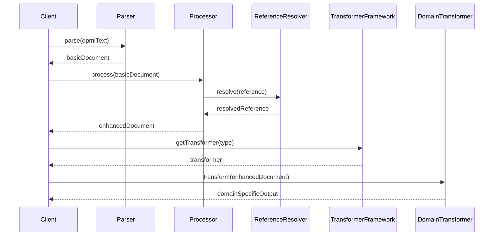
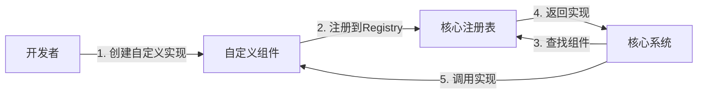
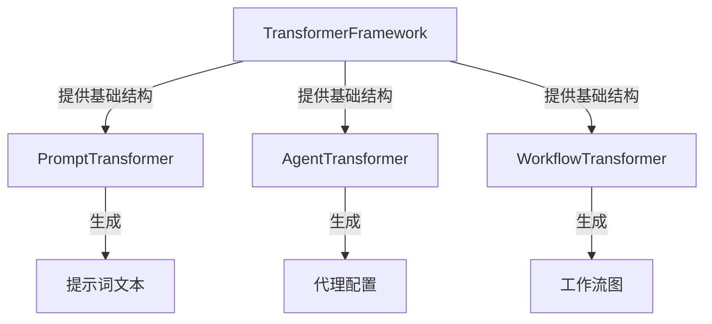

# @dpml/core 顶层设计文档

## 1. 设计目标与原则

### 1.1 核心目标

`@dpml/core`作为DPML生态系统的基础设施层，旨在提供:

1. **稳定的基础架构**：为整个DPML生态提供坚实的技术基础
2. **统一的解析能力**：解析DPML文档，生成标准化的抽象语法树(AST)
3. **灵活的扩展机制**：支持标签、引用和转换器的扩展
4. **高效的引用系统**：处理各种协议的资源引用
5. **标准的错误处理**：提供统一、友好的错误处理机制

### 1.2 设计原则

1. **接口先于实现**：优先定义清晰的接口，然后再考虑具体实现
2. **关注点分离**：模块化设计，每个组件只负责其核心功能
3. **最小依赖原则**：减少外部依赖，确保核心包的轻量性
4. **向下依赖原则**：高级包依赖低级包，避免循环依赖
5. **扩展点内置**：核心功能预留明确的扩展点
6. **性能优先**：在关键路径上优化性能
7. **类型安全**：利用TypeScript提供强类型保障
8. **职责明确**：各模块边界清晰，避免职责重叠
9. **框架而非实现**：核心模块提供框架和接口，具体实现由领域模块负责

### 1.3 解决的问题

1. 提供统一的DPML文档解析机制
2. 建立标签定义和处理的标准框架
3. 实现灵活的引用解析系统
4. 创建文档处理和转换的流程
5. 提供错误处理和诊断工具

## 2. 系统架构

### 2.1 整体架构

下图展示了@dpml/core的核心模块及其关系：



### 2.2 模块职责

#### 2.2.1 核心模块职责

- **Parser**:

  - 负责将DPML文本解析为基础AST
  - 识别XML标签结构和属性
  - 不负责处理标签继承或引用解析
  - 仅生成初始语法树结构

- **Processor**:

  - 接收Parser生成的基础AST，进行高级处理
  - 处理标签继承（extends属性）
  - 识别和处理@引用
  - 验证和处理属性
  - 输出增强的完整AST
  - 管理协议处理器和资源加载

- **Transformer**:

  - 作为框架而非具体实现
  - 提供AST到其他表示形式的转换接口
  - 定义访问者模式和工具类
  - 不改变AST的语义，只关注表示转换
  - 由各领域模块基于此框架实现特定转换

- **Types**: 定义核心类型和接口
- **References**: 处理@引用系统
- **Errors**: 提供错误类型和处理机制
- **Utils**: 通用工具函数
- **Registry**: 各种注册表（标签、转换器等）
- **Markdown**: Markdown解析与处理
- **Constants**: 定义常量和配置默认值

#### 2.2.2 职责边界

各模块间的职责划分严格遵循关注点分离原则：

| 职责            | Parser | Processor | Transformer | 领域模块     |
| --------------- | ------ | --------- | ----------- | ------------ |
| XML解析         | ✅     | ❌        | ❌          | ❌           |
| 基础AST生成     | ✅     | ❌        | ❌          | ❌           |
| 标签继承处理    | ❌     | ✅        | ❌          | ❌           |
| @引用识别与解析 | ❌     | ✅        | ❌          | ❌           |
| 属性处理        | ❌     | ✅        | ❌          | ❌           |
| 协议处理        | ❌     | ✅        | ❌          | ❌           |
| AST格式转换     | ❌     | ❌        | ✅(框架)    | ✅(具体实现) |
| 领域特定逻辑    | ❌     | ❌        | ❌          | ✅           |

#### 2.2.3 核心扩展方向

三个核心模块各自代表DPML系统不同层次的扩展能力：

- **Parser - 扩展语法**：

  - 提供语法层面的扩展能力
  - 支持新的标签格式和语法规则
  - 允许定义新的标签结构和属性语法
  - 控制文本到AST的转换过程

- **Processor - 扩展语义**：

  - 提供语义层面的扩展能力
  - 处理DPML文档的"意义"和"关系"
  - 定义标签间的继承和组合规则
  - 解析引用的语义和资源获取方式
  - 实现属性的语义验证和处理

- **Transformer - 扩展runtime**：
  - 提供执行层面的扩展能力
  - 将AST转换为可执行或可使用的形式
  - 适配不同执行环境和目标系统
  - 生成领域特定的输出格式
  - 支持各种运行时行为的实现

这种三层扩展架构使DPML既保持了核心的一致性，又允许在不同层次进行灵活扩展，为创建丰富多样的领域特定应用提供基础。

### 2.3 与其他包的关系

DPML采用领域驱动的分层架构，各包之间存在清晰的依赖关系：

```mermaid
flowchart TD
    Core[/@dpml/core/]
    Prompt[/@dpml/prompt/]
    Agent[/@dpml/agent/]
    Workflow[/@dpml/workflow/]
    CLI[/@dpml/cli/]

    Core --> Prompt
    Prompt --> Agent
    Agent --> Workflow
    Core --> CLI
    Prompt --> CLI
    Agent --> CLI
    Workflow --> CLI
```

- `@dpml/core`被所有其他包依赖
- 提供接口和类型定义给其他包实现
- 不依赖任何其他DPML包

## 3. 核心概念

### 3.1 DPML文档模型

DPML文档由不同类型的节点组成，包括：

- **Document**: 文档根节点
- **Element**: 标签节点，代表XML风格的标签
- **Content**: 内容节点，代表可能包含Markdown格式的内容
- **Reference**: 引用节点，代表@引用

文档模型的核心结构如下：



### 3.2 标签注册机制

Core包提供标签注册机制，允许定义：

- 标签的属性规范
- 标签的嵌套规则
- 标签的验证规则
- 标签的处理行为

### 3.3 引用系统

DPML支持通过@符号引用外部资源：

- 支持多种协议（http, file等）
- 提供可扩展的协议处理器
- 支持引用解析和缓存

## 4. 处理流程

### 4.1 核心流程概览

DPML文档处理的流程如下：



DPML文档处理的核心流程包括四个主要阶段：

1. **解析阶段**：Parser将文本解析为基础AST
2. **处理阶段**：Processor处理继承、引用等，生成增强AST
3. **转换器选择**：选择适当的领域特定转换器
4. **转换阶段**：领域转换器将增强AST转换为特定格式

### 4.2 模块工作原理

#### 4.2.1 Parser工作流程

1. 接收DPML文本
2. 使用XML解析库处理标签结构
3. 构建初始AST，识别标签和属性
4. 返回基础AST，不处理继承或引用

#### 4.2.2 Processor工作流程

1. 接收基础AST
2. 递归遍历AST节点
3. 处理标签继承（extends属性）
   - 加载本地或远程基础标签
   - 应用属性继承规则（子优先）
   - 应用内容继承规则
4. 识别和处理@引用
   - 解析引用语法
   - 调用适当的协议处理器
   - 加载引用资源
5. 处理属性和验证
6. 返回增强AST

#### 4.2.3 Transformer框架设计

Transformer作为框架而非具体实现，提供：

1. 基础转换器接口
   - 定义统一的转换方法
   - 提供类型安全保证
2. 访问者模式支持
   - 定义节点访问接口
   - 提供默认遍历实现
3. 通用工具方法
   - 节点查找和过滤
   - 内容提取辅助函数
4. 组合转换模式

   - 支持转换器链式组合
   - 中间结果处理

5. 不包含具体领域逻辑
   - 不决定如何使用AST内容
   - 不关注特定领域输出格式

## 5. 扩展机制

### 5.1 可扩展点

Core包围绕三个核心方向提供扩展点：

- **语法扩展（Parser层）**：

  - 自定义标签定义：创建新的标签类型和结构
  - 属性语法扩展：定义新的属性格式和验证规则
  - 内容格式扩展：支持不同的内容格式解析

- **语义扩展（Processor层）**：

  - 引用协议扩展：实现新的@引用协议处理器
  - 继承机制扩展：自定义继承规则和处理逻辑
  - 属性处理扩展：添加特殊属性的处理逻辑

- **运行时扩展（Transformer层）**：
  - 转换器扩展：创建特定领域的AST转换器
  - 输出格式扩展：支持新的输出格式和目标系统
  - 运行时行为扩展：定义特定执行环境的行为

### 5.2 扩展方式

各扩展点通过注册表机制提供统一的注册和获取接口，确保扩展的一致性和可发现性。扩展主要通过各种Registry接口实现：

- 标签注册表
- 协议注册表
- 转换器注册表

扩展流程如下：



### 5.3 转换器扩展模式

各领域模块基于Transformer框架构建特定转换器：



## 6. 技术选择

### 6.1 关键技术决策

- **解析策略**：组合使用现有XML解析库与自定义扩展
- **异步处理**：核心API使用Promise-based设计支持异步操作
- **错误处理**：分级错误处理机制，区分致命错误和警告
- **模块边界**：明确职责边界，避免功能重叠

### 6.2 外部依赖

Core包尽量减少外部依赖，但可能会使用以下类型的依赖：

- 基础XML/HTML解析库
- Markdown处理库
- 通用工具库（如日期处理、路径处理等）

## 7. 演进计划

- **1.0**: 核心功能完整实现
- **1.1**: 性能优化与增强
- **1.2**: 高级特性（如LSP支持）

## 8. 与领域模块的协作

### 8.1 领域模块使用Core的模式

领域模块（如prompt、agent、workflow）通过以下模式使用Core：

1. **解析和处理**

   - 使用Parser解析DPML文本
   - 使用Processor处理基础AST
   - 获取增强AST

2. **转换框架使用**

   - 基于Transformer框架实现特定转换器
   - 定义领域特定的访问者或转换器
   - 创建特定输出格式

3. **扩展注册**
   - 注册领域特定的标签
   - 注册特定协议处理器
   - 注册自定义转换器

### 8.2 领域特定实现

各领域模块负责实现：

- **特定语义处理**：理解和应用领域特定语义
- **输出格式生成**：创建最终用户所需格式
- **业务逻辑处理**：实现特定业务需求
- **用户交互**：提供领域特定的用户体验

### 8.3 职责分离的价值

这种职责分离带来显著价值：

- **核心稳定性**：核心包可以保持稳定，减少变更
- **领域自由度**：领域包可以自由创新，不受核心包限制
- **代码复用**：通用功能集中在核心包，避免重复
- **优化针对性**：性能优化可以针对不同层次进行

---

本文档定义了`@dpml/core`包的整体设计和职责。各模块的具体实现细节和接口定义将在各自的模块设计文档中详细说明。
