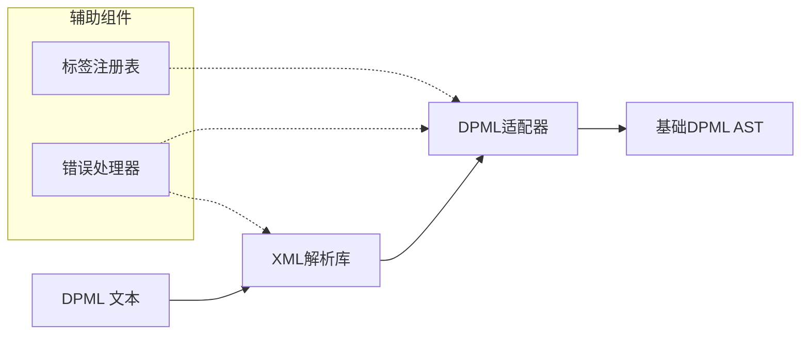
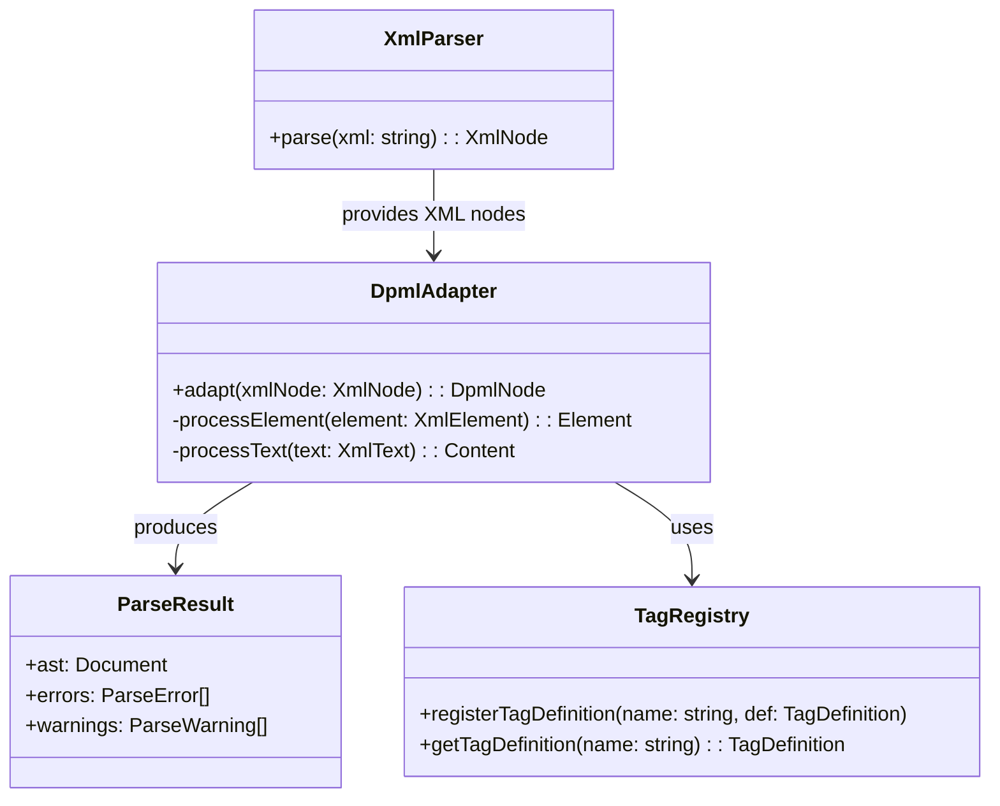
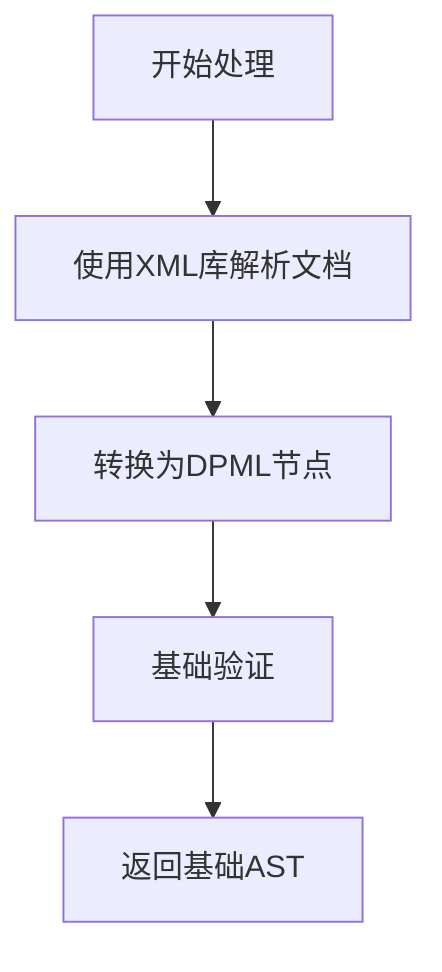

# Parser 模块设计文档

## 1. 概述

Parser 模块是 DPML 核心基础设施的关键组件，负责将 DPML 文本解析为结构化的抽象语法树 (AST)。本文档详细描述 Parser 模块的设计原则、架构、实现策略和接口定义。

### 1.1 设计目标

Parser 模块的设计目标是：

1. **高效解析** - 快速处理大型 DPML 文档
2. **强健性** - 对格式错误的输入具有容错能力
3. **可扩展性** - 支持标签系统和语法的扩展
4. **明确错误** - 提供精确的错误位置和原因
5. **增量能力** - 为未来的增量解析奠定基础

## 2. 架构设计

### 2.1 整体架构

Parser 模块基于现有XML解析库构建，专注于将DPML文本解析为AST：



> 注意：所有高级处理功能（如继承处理、属性处理、引用解析）都不属于Parser模块，而是由Processor模块负责。Parser仅生成基础AST结构。

### 2.2 核心组件



## 3. 组件详细设计

### 3.1 XML解析库集成

Parser 使用现有的 XML 解析库（如 fast-xml-parser 或 node-html-parser）处理基础 XML 结构：

```typescript
// 选择XML解析库的抽象接口
class XmlParserAdapter {
  /**
   * 解析XML文本
   * @param xml XML文本
   * @returns 解析后的XML节点
   */
  parse(xml: string): XmlNode {
    // 调用具体的XML解析库
    return this.xmlLib.parse(xml, this.getParserOptions());
  }

  /**
   * 获取解析选项
   */
  protected getParserOptions() {
    return {
      // 配置选项，如保留注释、属性等
      attributeNamePrefix: '',
      ignoreAttributes: false,
      parseAttributeValue: true,
    };
  }
}
```

### 3.2 DPML适配器

适配器负责将通用XML节点转换为DPML特定节点：

```typescript
class DpmlAdapter {
  /**
   * 将XML节点转换为DPML节点
   * @param xmlNode XML节点
   * @returns DPML节点
   */
  adapt(xmlNode: XmlNode): DpmlNode {
    if (isElement(xmlNode)) {
      return this.processElement(xmlNode);
    } else if (isText(xmlNode)) {
      return this.processText(xmlNode);
    }
    // ...处理其他节点类型
  }

  /**
   * 处理XML元素节点
   */
  private processElement(element: XmlElement): Element {
    // 创建DPML元素节点
    // 处理属性、子节点等
  }

  /**
   * 处理文本节点
   */
  private processText(text: XmlText): Content {
    // 创建内容节点
    return new Content(text.value, text.position);
  }
}
```

> 注意：Parser模块不负责识别和处理@引用、解析属性或处理继承，这些都是Processor模块的职责。Parser仅将文本内容作为整体处理。

### 3.3 节点类型

DPML 解析结果的节点类型：

```typescript
interface Node {
  type: string;
  position: {
    start: { line: number; column: number; offset: number };
    end: { line: number; column: number; offset: number };
  };
}

interface Document extends Node {
  type: 'document';
  children: Node[];
}

interface Element extends Node {
  type: 'element';
  tagName: string;
  attributes: Record<string, any>;
  children: Node[];
}

interface Content extends Node {
  type: 'content';
  value: string;
}
```

> 注意：Reference类型不由Parser模块创建，它将在Processor模块中处理@引用时生成。

### 3.4 标签定义

```typescript
interface TagDefinition {
  /**
   * 允许的属性
   */
  attributes?: string[];

  /**
   * 必需的属性
   */
  requiredAttributes?: string[];

  /**
   * 允许的子标签
   */
  allowedChildren?: string[];

  /**
   * 是否自闭合标签
   */
  selfClosing?: boolean;
}
```

### 3.5 处理流程

基础解析流程：



## 4. 接口设计

### 4.1 公共接口

```typescript
interface DPMLParser {
  /**
   * 解析DPML文本并返回基础AST
   * @param input DPML文本
   * @param options 解析选项
   * @returns 解析结果
   */
  parse(input: string, options?: ParseOptions): Promise<ParseResult>;

  /**
   * 验证DPML AST是否有效
   * @param ast DPML AST
   * @returns 验证结果
   */
  validate(ast: Document): ValidationResult;
}

interface ParseOptions {
  /**
   * 是否允许未知标签
   * @default true
   */
  allowUnknownTags?: boolean;

  /**
   * 是否忽略验证错误继续解析
   * @default false
   */
  tolerant?: boolean;

  /**
   * 是否保留注释
   * @default false
   */
  preserveComments?: boolean;

  /**
   * 解析模式
   * @default "loose"
   */
  mode?: 'strict' | 'loose';
}

interface ParseResult {
  /**
   * 解析生成的AST
   */
  ast: Document;

  /**
   * 解析过程中的错误
   */
  errors: ParseError[];

  /**
   * 解析过程中的警告
   */
  warnings: ParseWarning[];
}
```

### 4.2 错误处理接口

```typescript
class ParseError extends Error {
  /**
   * 错误码
   */
  code: string;

  /**
   * 错误位置
   */
  position: SourcePosition;
}

class ParseWarning {
  /**
   * 警告码
   */
  code: string;

  /**
   * 警告消息
   */
  message: string;

  /**
   * 警告位置
   */
  position: SourcePosition;
}
```

## 5. 扩展机制

Parser 模块提供以下扩展点：

### 5.1 自定义标签处理

```typescript
interface TagProcessor {
  /**
   * 处理特定标签
   * @param element 标签元素
   * @param context 处理上下文
   */
  process(element: Element, context: ProcessingContext): Promise<void>;
}

// 注册标签处理器
tagRegistry.registerTagProcessor('my-tag', myTagProcessor);
```

### 5.2 自定义验证规则

```typescript
interface TagValidator {
  /**
   * 验证标签
   * @param element 标签元素
   * @param context 验证上下文
   * @returns 验证结果
   */
  validate(element: Element, context: ValidationContext): ValidationResult;
}

// 注册标签验证器
tagRegistry.registerTagValidator('my-tag', myTagValidator);
```

## 6. 错误处理策略

Parser 模块采用分级错误处理策略：

1. **致命错误**：会导致解析终止，如格式严重错误
2. **语法错误**：可能影响解析结果，但不会终止解析
3. **警告**：格式问题或最佳实践违反，不影响解析结果

错误信息包含：

- 错误类型和代码
- 详细的错误消息
- 准确的源码位置（行、列、偏移量）
- 可能的修复建议

## 7. 性能考量

Parser 模块的性能优化策略：

1. **优化XML解析**：配置XML解析库以最大化性能
2. **懒验证**：只在需要时验证AST
3. **缓存标签定义**：避免重复查找
4. **部分解析**：支持只解析文档的特定部分

性能目标：

- 100KB DPML文档解析时间 < 100ms
- 内存占用：文档大小的 5-10 倍

## 8. 使用示例

### 8.1 基本使用

```typescript
import { createParser } from '@dpml/core';

// 创建解析器
const parser = createParser();

// 解析DPML文档
const result = await parser.parse(`
<prompt>
  <role name="user">
    请解释DPML的用途。
    参考资料：@http://example.com/dpml-docs
  </role>
</prompt>
`);

// 处理解析结果
console.log(result.ast);
if (result.errors.length > 0) {
  console.error('解析错误:', result.errors);
}
```

### 8.2 使用扩展

```typescript
import { createParser, tagRegistry } from '@dpml/core';

// 注册自定义标签
tagRegistry.registerTagDefinition('custom-tag', {
  attributes: ['type', 'id'],
  requiredAttributes: ['type'],
  allowedChildren: ['text'],
});

// 创建解析器
const parser = createParser();

// 解析带有自定义标签的文档
const result = await parser.parse(`
<prompt>
  <custom-tag type="example" id="demo">
    这是一个自定义标签示例
  </custom-tag>
</prompt>
`);
```

### 8.3 与Processor模块集成

```typescript
import { createParser } from '@dpml/core';
import { createProcessor } from '@dpml/core/processor';

// 创建解析器和处理器
const parser = createParser();
const processor = createProcessor();

// 完整处理流程
async function processDpml(dpmlText) {
  // 步骤1: 解析为基础AST
  const parseResult = await parser.parse(dpmlText);
  if (parseResult.errors.length > 0) {
    return { errors: parseResult.errors };
  }

  // 步骤2: 处理AST（继承、引用等高级功能）
  const processedResult = await processor.process(parseResult.ast);

  return processedResult;
}
```

## 9. 未来扩展

Parser 模块的未来扩展计划：

1. **增量解析**：支持局部更新而非完全重解析
2. **并行处理**：利用Worker进行并行处理
3. **语言服务支持**：为编辑器集成提供LSP实现
4. **强大的诊断**：提供更详细的错误信息和修复建议
5. **解析优化**：针对特定场景的性能优化

## 10. 模块边界

### 10.1 Parser和Processor的职责分离

为保持清晰的职责分离，Parser和Processor模块各自负责不同的处理阶段：

| 职责            | Parser模块 | Processor模块 |
| --------------- | ---------- | ------------- |
| XML/标签解析    | ✅         | ❌            |
| 生成基础AST     | ✅         | ❌            |
| 基础标签验证    | ✅         | ❌            |
| 属性验证和处理  | ❌         | ✅            |
| @引用识别与解析 | ❌         | ✅            |
| 标签继承处理    | ❌         | ✅            |
| 属性继承规则    | ❌         | ✅            |
| 内容继承规则    | ❌         | ✅            |
| 引用协议处理    | ❌         | ✅            |

Parser模块专注于将DPML文本转换为结构化的基础AST，而Processor模块负责对AST进行高级处理和增强。Parser不进行任何属性处理、继承处理或引用解析。

---

本文档定义了Parser模块的详细设计。实现时基于现有XML解析库，专注于将XML解析为AST结构，不进行任何额外的属性处理或继承解析。
