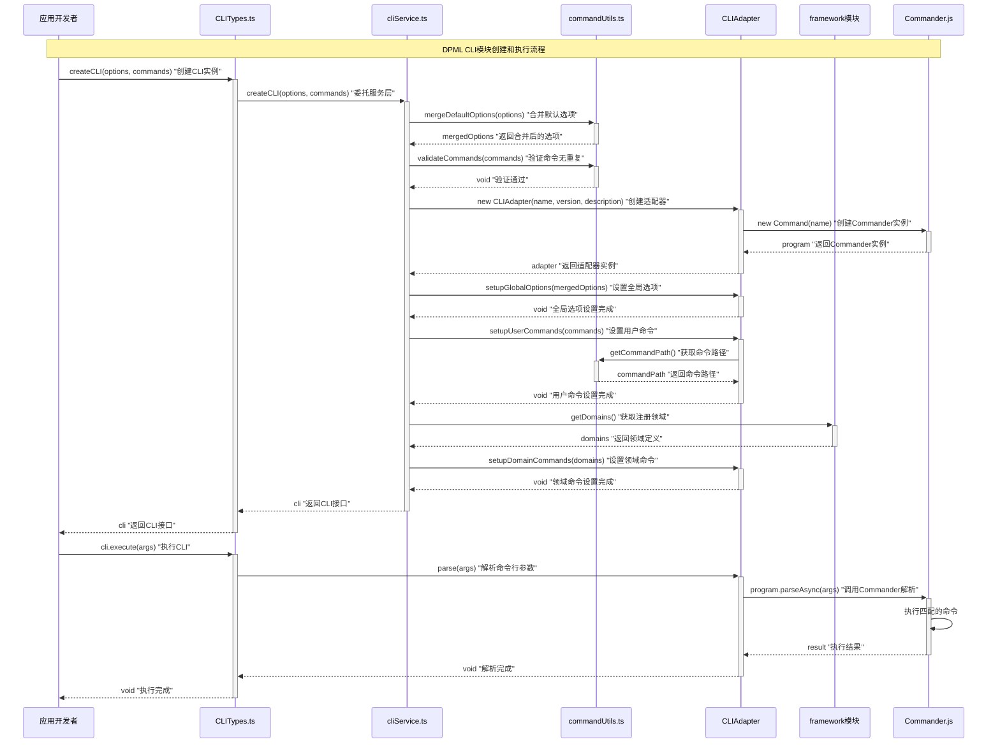

# CLITypes Develop Design

## UML

```mermaid

classDiagram
    %% API层
    class cli {
        <<module>>
        +createCLI(options: CLIOptions, commands: CommandDefinition[]): CLITypes "创建CLI实例，传入配置和命令"
    }
    note for cli "文件: api/CLITypes.ts\n作为API层的薄层接口，直接委托模块服务层实现\n符合API委托原则，不包含业务逻辑"
    
    %% Types层 - 核心接口
    class CLITypes {
        <<interface>>
        +execute(argv?: string[]): Promise<void> "执行CLI处理命令行参数"
        +showHelp(): void "显示帮助信息"
        +showVersion(): void "显示版本信息"
    }
    note for CLITypes "文件: types/CLITypes.ts\n执行器接口，只负责CLI执行\n符合单一职责原则"
    
    class CLIOptions {
        <<interface>>
        +name: string "CLI工具名称"
        +version: string "CLI版本号"
        +description: string "CLI描述"
        +defaultDomain?: string "默认领域，默认为'core'"
    }
    note for CLIOptions "文件: types/CLITypes.ts\nCLI基本配置选项"
    
    class CommandDefinition {
        <<interface>>
        +name: string "命令名称"
        +description: string "命令描述"
        +arguments?: ArgumentDefinition[] "位置参数定义"
        +options?: OptionDefinition[] "选项参数定义"
        +action: CommandAction "命令执行函数"
        +subcommands?: CommandDefinition[] "子命令定义"
        +domain?: string "所属领域，用于组织命令层次结构"
    }
    note for CommandDefinition "文件: types/CLITypes.ts\n声明式定义命令的接口\n支持嵌套子命令结构"
    
    class ArgumentDefinition {
        <<interface>>
        +name: string "参数名称"
        +description?: string "参数描述"
        +required?: boolean "是否必需，默认为false"
        +variadic?: boolean "是否可变长度，默认为false"
        +defaultValue?: any "默认值"
    }
    note for ArgumentDefinition "文件: types/CLITypes.ts\n位置参数定义"
    
    class OptionDefinition {
        <<interface>>
        +flags: string "选项标志，如'-v, --verbose'"
        +description?: string "选项描述"
        +defaultValue?: any "默认值"
        +required?: boolean "是否必需，默认为false"
        +choices?: string[] "可选值列表"
    }
    note for OptionDefinition "文件: types/CLITypes.ts\n选项参数定义"
    
    class CommandAction {
        <<type>>
        +(...args: any[]): Promise<void> | void "命令执行函数类型"
    }
    note for CommandAction "文件: types/CLITypes.ts\n命令处理函数类型\n支持同步和异步处理"
    
    %% 错误类型
    class DuplicateCommandError {
        <<class>>
        +commandPath: string "重复的命令路径"
        +constructor(commandPath: string) "创建错误实例"
        +name: string "错误名称，值为'DuplicateCommandError'"
        +message: string "错误信息"
    }
    note for DuplicateCommandError "文件: types/CLIErrors.ts\n命令重复定义错误"
    
    class CommandExecutionError {
        <<class>>
        +originalError: Error "原始错误"
        +command: string "执行失败的命令"
        +constructor(message: string, command: string, originalError: Error) "创建错误实例"
        +name: string "错误名称，值为'CommandExecutionError'"
    }
    note for CommandExecutionError "文件: types/CLIErrors.ts\n命令执行错误"
    
    %% Core层 - 模块服务层
    class cliService {
        <<module>>
        +createCLI(options: CLIOptions, commands: CommandDefinition[]): CLITypes "创建CLI实例"
        -setupGlobalOptions(adapter: CLIAdapter, options: Required<CLIOptions>): void "设置全局选项"
        -setupUserCommands(adapter: CLIAdapter, commands: CommandDefinition[]): void "设置用户定义命令"
        -setupFrameworkCommands(adapter: CLIAdapter): void "设置framework中注册的命令"
        -validateCommands(commands: CommandDefinition[]): void "验证命令是否有重复定义"
        -getCommandPath(command: CommandDefinition, parentPath?: string): string "获取完整命令路径"
        -handleCommandError(error: Error, command: string): never "处理命令执行错误"
    }
    note for cliService "文件: core/cli/cliService.ts\n模块服务层，负责CLI功能实现\n协调适配器和错误处理，管理命令注册流程"
    
    %% Core层 - CLI组件
    class CLIAdapter {
        <<class>>
        -program: Command "Commander实例(私有)"
        -commandPaths: Set<string> "已注册的命令路径集合"
        +constructor(name: string, version: string, description: string) "创建适配器实例"
        +setupCommand(command: CommandDefinition, parentPath?: string): void "设置单个命令"
        +setupCommands(commands: CommandDefinition[]): void "批量设置命令"
        +setupDomainCommands(domainName: string, commands: CommandDefinition[]): void "设置领域所有命令"
        +parse(argv?: string[]): Promise<void> "解析命令行参数"
        +showHelp(): void "显示帮助信息"
        +showVersion(): void "显示版本信息"
        -buildCommandPath(command: CommandDefinition, parentPath?: string): string "构建命令路径"
        -applyArguments(command: Command, args: ArgumentDefinition[]): void "应用参数定义"
        -applyOptions(command: Command, options: OptionDefinition[]): void "应用选项定义"
        -handleError(error: Error): void "错误处理"
    }
    note for CLIAdapter "文件: core/cli/CLIAdapter.ts\n适配器类，完全封装Commander.js\n负责将声明式命令定义转换为Commander命令"
    
    %% 工具函数模块
    class outputFormatter {
        <<module>>
        +formatTable(data: any[]): string "格式化表格输出"
        +formatJSON(data: any): string "格式化JSON输出"
        +formatError(error: Error): string "格式化错误信息"
        +formatSuccess(message: string): string "格式化成功信息"
        -getColorFunction(color: string): Function "获取颜色函数(内部)"
    }
    note for outputFormatter "文件: core/cli/outputFormatter.ts\n输出格式化函数模块\n提供不同格式的输出处理"
    
    %% Core层 - 辅助工具函数
    class commandUtils {
        <<module>>
        +mergeDefaultOptions(options: CLIOptions): Required<CLIOptions> "合并默认选项"
        +validateCommands(commands: CommandDefinition[]): void "验证命令集有效性"
        +getFullCommandPath(command: CommandDefinition, parentPath?: string): string "获取完整命令路径" 
        +formatHelpText(text: string, indent?: number): string "格式化帮助文本"
    }
    note for commandUtils "文件: core/cli/commandUtils.ts\n命令工具函数模块\n提供命令处理的辅助函数"
    
    %% 外部依赖
    class Command {
        <<external>>
    }
    note for Command "Commander.js库的Command类\n由CLIAdapter完全封装，不直接暴露"
    
    %% 定义关系
    cli --> cliService : uses "API委托原则"
    cliService --> CLIAdapter : creates "创建适配器实例"
    cliService ..> CLITypes : returns "返回闭包接口"
    cliService ..> DuplicateCommandError : throws "检测到重复命令时抛出"
    cliService ..> CommandExecutionError : throws "命令执行失败时抛出" 
    cliService --> commandUtils : uses "使用命令工具函数"
    CLIAdapter ..> DuplicateCommandError : throws "验证命令时检测到重复"
    CLIAdapter --> outputFormatter : uses "格式化输出"
    CLIAdapter --> Command : wraps "封装Commander实例"
    CommandDefinition o-- ArgumentDefinition : contains "包含位置参数定义"
    CommandDefinition o-- OptionDefinition : contains "包含选项参数定义"
    CommandDefinition o-- CommandAction : contains "包含命令处理函数"
    CommandDefinition o-- CommandDefinition : contains "包含子命令定义(递归)"
    CLITypes -- Command : abstracts "抽象Commander功能"
```

## Sequence 

```mermaid
sequenceDiagram
    %% 参与者定义
    participant User as 应用开发者
    participant API as CLITypes.ts
    participant Service as cliService.ts
    participant Utils as commandUtils.ts
    participant Adapter as CLIAdapter
    participant Framework as framework模块
    participant Commander as Commander.js

    %% 标题
    Note over User,Commander: DPML CLI模块创建和执行流程

    %% 创建CLI实例
    User->>+API: createCLI(options, commands) "创建CLI实例"
    API->>+Service: createCLI(options, commands) "委托服务层"
    
    Service->>+Utils: mergeDefaultOptions(options) "合并默认选项"
    Utils-->>-Service: mergedOptions "返回合并后的选项"
    
    Service->>+Utils: validateCommands(commands) "验证命令无重复"
    Utils-->>-Service: void "验证通过"
    
    Service->>+Adapter: new CLIAdapter(name, version, description) "创建适配器"
    Adapter->>+Commander: new Command(name) "创建Commander实例"
    Commander-->>-Adapter: program "返回Commander实例"
    Adapter-->>-Service: adapter "返回适配器实例"
    
    Service->>+Adapter: setupGlobalOptions(mergedOptions) "设置全局选项"
    Adapter-->>-Service: void "全局选项设置完成"
    
    Service->>+Adapter: setupUserCommands(commands) "设置用户命令"
    Adapter->>+Utils: getCommandPath() "获取命令路径"
    Utils-->>-Adapter: commandPath "返回命令路径"
    Adapter-->>-Service: void "用户命令设置完成"
    
    Service->>+Framework: getDomains() "获取注册领域"
    Framework-->>-Service: domains "返回领域定义"
    
    Service->>+Adapter: setupDomainCommands(domains) "设置领域命令"
    Adapter-->>-Service: void "领域命令设置完成"
    
    Service-->>-API: cli "返回CLI接口"
    API-->>-User: cli "返回CLI接口"
    
    %% 执行CLI
    User->>+API: cli.execute(args) "执行CLI"
    API->>+Adapter: parse(args) "解析命令行参数"
    Adapter->>+Commander: program.parseAsync(args) "调用Commander解析"
    
    Commander->>Commander: 执行匹配的命令
    Commander-->>-Adapter: result "执行结果"
    Adapter-->>-API: void "解析完成"
    API-->>-User: void "执行完成"


```
