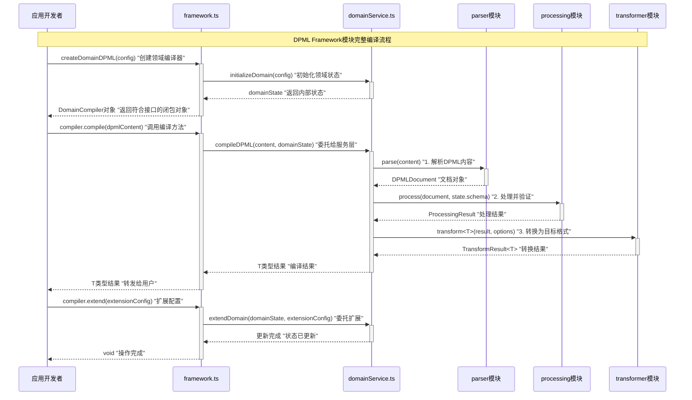

# Framework Design

## UML

```mermaid
classDiagram
    %% API层
    class framework {
        <<module>>
        +createDomainDPML<T>(config: DomainConfig): DomainCompiler<T> "创建领域编译器，返回符合接口的闭包对象"
    }
    note for framework "文件: api/framework.ts\n作为API层入口点，提供领域编译器创建功能"
    
    %% Types层
    class DomainCompiler~T~ {
        <<interface>>
        +compile(content: string): Promise<T> "编译DPML内容为领域对象"
        +extend(extensionConfig: Partial<DomainConfig>): void "扩展当前配置"
        +getSchema(): Schema "获取当前架构"
        +getTransformers(): Array<Transformer<unknown, unknown>> "获取当前转换器集合"
    }
    note for DomainCompiler "文件: types/DomainCompiler.ts\n定义闭包API的形状，保证类型安全"
    
    class DomainConfig {
        <<interface>>
        +schema: Schema "领域特定的架构定义"
        +transformers: Array<Transformer<unknown, unknown>> "转换器实例数组"
        +options?: CompileOptions "可选的编译选项"
    }
    note for DomainConfig "文件: types/DomainConfig.ts\n领域配置接口，定义创建领域编译器所需的配置"
    
    class CompileOptions {
        <<interface>>
        +strictMode?: boolean "是否启用严格模式"
        +errorHandling?: 'throw' | 'warn' | 'silent' "错误处理策略"
        +transformOptions?: TransformOptions "转换选项"
        +custom?: Record<string, any> "自定义选项"
    }
    note for CompileOptions "文件: types/CompileOptions.ts\n编译选项接口，控制编译行为"
    
    %% Core层 - 模块服务层
    class domainService {
        <<module>>
        +initializeDomain(config: DomainConfig): DomainState "初始化领域状态"
        +compileDPML<T>(content: string, state: DomainState): Promise<T> "编译DPML内容为领域对象"
        +extendDomain(state: DomainState, config: Partial<DomainConfig>): void "扩展领域配置"
        +getDomainSchema(state: DomainState): Schema "获取架构"
        +getDomainTransformers(state: DomainState): Array<Transformer<unknown, unknown>> "获取转换器集合"
    }
    note for domainService "文件: core/framework/domainService.ts\n模块服务层，管理领域状态\n协调编译流程"
    
    %% 关系定义
    framework --> domainService : 委托 "API委托原则，薄层设计"
    framework ..> DomainCompiler : 返回 "返回符合接口的闭包对象"
    DomainConfig *-- Schema : 包含 "使用架构定义"
    DomainConfig *-- Transformer : 包含多个 "包含转换器数组"
    DomainConfig o-- CompileOptions : 可选包含 "可选编译选项"
```

## Sequence

```mermaid
sequenceDiagram
    %% 参与者定义
    participant User as 应用开发者
    participant API as framework.ts
    participant Service as domainService.ts
    participant Parser as parser模块
    participant Processing as processing模块
    participant Transform as transformer模块

    %% 标题和描述
    Note over User,Transform: DPML Framework模块完整编译流程

    %% 创建领域编译器
    User->>+API: createDomainDPML(config) "创建领域编译器"
    API->>+Service: initializeDomain(config) "初始化领域状态"
    Service-->>-API: domainState "返回内部状态"
    API-->>-User: DomainCompiler对象 "返回符合接口的闭包对象"
    
    %% 编译DPML内容
    User->>+API: compiler.compile(dpmlContent) "调用编译方法"
    API->>+Service: compileDPML(content, domainState) "委托给服务层"
    
    %% 完整编译流程
    Service->>+Parser: parse(content) "1. 解析DPML内容"
    Parser-->>-Service: DPMLDocument "文档对象"
    
    Service->>+Processing: process(document, state.schema) "2. 处理并验证"
    Processing-->>-Service: ProcessingResult "处理结果"
    
    Service->>+Transform: transform<T>(result, options) "3. 转换为目标格式"
    Transform-->>-Service: TransformResult<T> "转换结果"
    
    Service-->>-API: T类型结果 "编译结果"
    API-->>-User: T类型结果 "转发给用户"
    
    %% 扩展配置示例
    User->>+API: compiler.extend(extensionConfig) "扩展配置"
    API->>+Service: extendDomain(domainState, extensionConfig) "委托扩展"
    Service-->>-API: 更新完成 "状态已更新"
    API-->>-User: void "操作完成"
```

