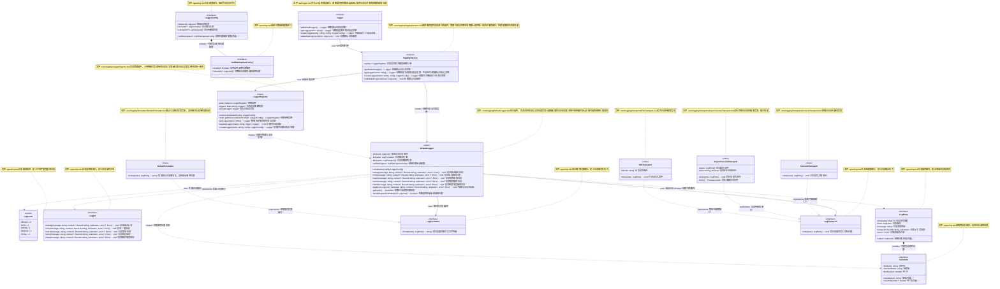

# Logging Develop

## UML

```mermaid
classDiagram
    %% API层
    class logger {
        <<module>>
        +getDefaultLogger(): Logger "获取默认日志记录器"
        +getLogger(name: string): Logger "获取指定名称的日志记录器"
        +createLogger(name: string, config: LoggerConfig): Logger "创建自定义日志记录器"
        +setDefaultLogLevel(level: LogLevel): void "设置默认日志级别"
    }
    note for logger "文件: api/logger.ts\n作为API层的薄层接口，直接委托模块服务层实现\n提供日志记录器的获取和配置功能"
    
    %% Core层 - 模块服务层
    class loggingService {
        <<module>>
        +getDefaultLogger(): Logger "获取默认日志记录器"
        +getLogger(name: string): Logger "获取指定名称的日志记录器，不存在则返回默认日志记录器"
        +createLogger(name: string, config: LoggerConfig): Logger "创建并注册自定义日志记录器"
        +setDefaultLogLevel(level: LogLevel): void "设置默认日志级别"
        -registry: LoggerRegistry "日志记录器注册表单例引用"
    }
    note for loggingService "文件: core/logging/loggingService.ts\n模块服务层负责协调日志组件，管理日志记录器生命周期\n提供统一的日志服务接口，处理配置和日志器创建"
    
    %% Core层 - 执行组件
    class DefaultLogger {
        <<class>>
        -minLevel: LogLevel "最低记录日志级别"
        -formatter: LogFormatter "日志格式化器"
        -transports: LogTransport[] "日志传输器列表"
        -callSiteCapture: CallSiteCaptureConfig "调用位置捕获配置"
        +constructor(config: LoggerConfig)
        +debug(message: string, context?: Record~string, unknown~, error?: Error): void "记录调试级别日志"
        +info(message: string, context?: Record~string, unknown~, error?: Error): void "记录信息级别日志"
        +warn(message: string, context?: Record~string, unknown~, error?: Error): void "记录警告级别日志"
        +error(message: string, context?: Record~string, unknown~, error?: Error): void "记录错误级别日志"
        +fatal(message: string, context?: Record~string, unknown~, error?: Error): void "记录致命错误级别日志"
        -log(level: LogLevel, message: string, context?: Record~string, unknown~, error?: Error): void "内部日志记录实现"
        -getCaller(): CallerInfo "获取日志调用位置信息"
        -shouldCaptureCallSite(level: LogLevel): boolean "判断是否应该捕获调用位置"
    }
    note for DefaultLogger "文件: core/logging/DefaultLogger.ts\n执行组件，负责具体的日志记录功能实现\n根据配置将日志信息发送到不同传输目标\n支持可选的调用位置追踪"
    
    %% Core层 - 状态管理组件
    class LoggerRegistry {
        <<class>>
        -static instance: LoggerRegistry "单例实例"
        -loggers: Map~string, Logger~ "日志记录器映射表"
        -defaultLogger: Logger "默认日志记录器"
        -constructor(defaultConfig: LoggerConfig)
        +static getInstance(defaultConfig?: LoggerConfig): LoggerRegistry "获取单例实例"
        +getLogger(name: string): Logger "获取指定名称的日志记录器"
        +registerLogger(name: string, logger: Logger): void "注册日志记录器"
        +createLogger(name: string, config: LoggerConfig): Logger "创建并注册日志记录器"
    }
    note for LoggerRegistry "文件: core/logging/LoggerRegistry.ts\n状态管理组件，以单例模式管理所有日志记录器\n确保日志记录器实例共享和一致性"
    
    %% Types层 - 对外暴露的类型
    class LogLevel {
        <<enum>>
        DEBUG = 0
        INFO = 1
        WARN = 2
        ERROR = 3
        FATAL = 4
    }
    note for LogLevel "文件: types/log.ts\n日志级别枚举，定义不同严重程度的日志"
    
    class Logger {
        <<interface>>
        +debug(message: string, context?: Record~string, unknown~, error?: Error): void "记录调试信息"
        +info(message: string, context?: Record~string, unknown~, error?: Error): void "记录一般信息"
        +warn(message: string, context?: Record~string, unknown~, error?: Error): void "记录警告信息"
        +error(message: string, context?: Record~string, unknown~, error?: Error): void "记录错误信息"
        +fatal(message: string, context?: Record~string, unknown~, error?: Error): void "记录致命错误信息"
    }
    note for Logger "文件: types/log.ts\n日志记录器接口，定义日志操作方法"
    
    class LogEntry {
        <<interface>>
        +timestamp: Date "日志记录时间戳"
        +level: LogLevel "日志级别"
        +message: string "日志消息内容"
        +context?: Record~string, unknown~ "日志上下文信息"
        +error?: Error "关联的错误对象"
        +caller?: CallerInfo "调用位置信息(可选)"
    }
    note for LogEntry "文件: types/log.ts\n日志条目接口，表示单条日志的结构"
    
    class CallerInfo {
        <<interface>>
        +fileName: string "文件名"
        +className?: string "类名(可选)"
        +functionName: string "函数名"
        +lineNumber: number "行号"
        +columnNumber?: number "列号(可选)"
    }
    note for CallerInfo "文件: types/log.ts\n调用者信息接口，记录日志调用位置"
    
    class CallSiteCaptureConfig {
        <<interface>>
        +enabled: boolean "是否启用调用位置捕获"
        +forLevels?: LogLevel[] "对哪些日志级别捕获调用位置"
    }
    note for CallSiteCaptureConfig "文件: types/log.ts\n调用位置捕获配置接口"
    
    class LoggerConfig {
        <<interface>>
        +minLevel: LogLevel "最低记录级别"
        +formatter?: LogFormatter "日志格式化器"
        +transports?: LogTransport[] "日志传输器列表"
        +callSiteCapture?: CallSiteCaptureConfig "调用位置捕获配置(可选)"
    }
    note for LoggerConfig "文件: types/log.ts\n日志配置接口，控制日志记录行为"
    
    class LogFormatter {
        <<interface>>
        +format(entry: LogEntry): string "将日志条目格式化为字符串"
    }
    note for LogFormatter "文件: types/log.ts\n日志格式化器接口，定义日志格式化行为"
    
    class LogTransport {
        <<interface>>
        +write(entry: LogEntry): void "将日志条目写入目标位置"
    }
    note for LogTransport "文件: types/log.ts\n日志传输器接口，定义日志输出行为"
    
    %% 实现类
    class DefaultFormatter {
        <<class>>
        +format(entry: LogEntry): string "实现默认日志格式化，支持显示调用位置"
    }
    note for DefaultFormatter "文件: core/logging/formatters/DefaultFormatter.ts\n默认日志格式化器实现，支持格式化调用位置信息"
    
    class ConsoleTransport {
        <<class>>
        +write(entry: LogEntry): void "将日志写入控制台"
    }
    note for ConsoleTransport "文件: core/logging/transports/ConsoleTransport.ts\n控制台日志传输器实现"
    
    class AsyncConsoleTransport {
        <<class>>
        -queue: LogEntry[] "日志条目队列"
        -isProcessing: boolean "是否正在处理队列"
        +write(entry: LogEntry): void "将日志加入队列"
        -flush(): Promise~void~ "异步刷新日志队列"
    }
    note for AsyncConsoleTransport "文件: core/logging/transports/AsyncConsoleTransport.ts\n异步控制台日志传输器实现，提升性能"
    
    class FileTransport {
        <<class>>
        -filePath: string "日志文件路径"
        +write(entry: LogEntry): void "将日志写入文件"
    }
    note for FileTransport "文件: core/logging/transports/FileTransport.ts\n文件日志传输器实现"
    
    %% 定义关系
    logger --> loggingService : uses "API委托原则"
    loggingService --> LoggerRegistry : uses "获取单例实例"
    loggingService --> DefaultLogger : creates "创建日志记录器实例"
    
    LoggerRegistry ..> DefaultLogger : creates "创建并管理日志记录器"
    DefaultLogger ..|> Logger : implements "实现日志接口"
    DefaultLogger --> LogFormatter : uses "格式化日志条目"
    DefaultLogger --> LogTransport : uses "输出日志条目"
    
    LogEntry *-- CallerInfo : contains "可能包含调用位置"
    LoggerConfig *-- CallSiteCaptureConfig : contains "可能包含调用位置配置"
    
    DefaultFormatter ..|> LogFormatter : implements "实现格式化器接口"
    ConsoleTransport ..|> LogTransport : implements "实现传输器接口"
    AsyncConsoleTransport ..|> LogTransport : implements "实现传输器接口"
    FileTransport ..|> LogTransport : implements "实现传输器接口"
    
    DefaultLogger ..> LogEntry : creates "创建日志条目"
    DefaultLogger ..> LogLevel : uses "判断日志级别"
    DefaultLogger ..> CallerInfo : creates "创建调用位置信息"
```