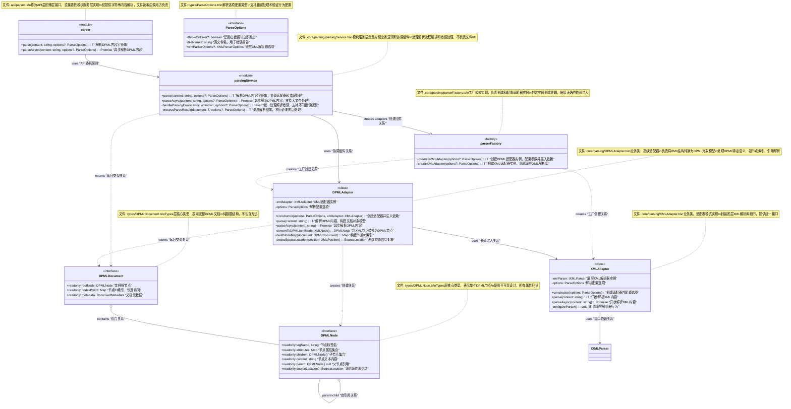
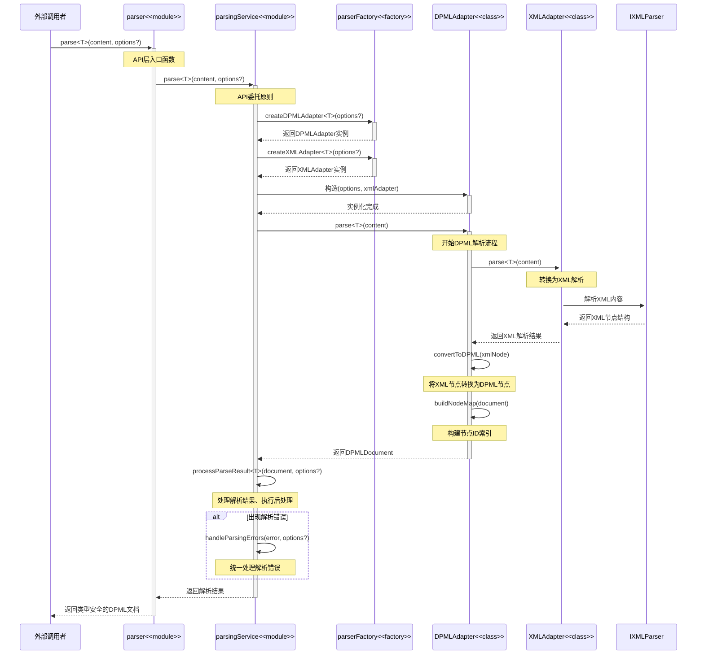

# DPML Core Parsing 设计

## UML

```mermaid
classDiagram
    %% API层
    class parser {
        <<module>>
        +parse<T>(content: string, options?: ParseOptions): T "解析DPML内容字符串"
        +parseAsync<T>(content: string, options?: ParseOptions): Promise<T> "异步解析DPML内容"
    }
    note for parser "文件: api/parser.ts\n作为API层的薄层接口，直接委托模块服务层实现\n仅提供字符串内容解析，文件读取由调用方负责"
    
    %% Core层 - 模块服务层
    class parsingService {
        <<module>>
        +parse<T>(content: string, options?: ParseOptions): T "解析DPML内容字符串，协调适配器和错误处理"
        +parseAsync<T>(content: string, options?: ParseOptions): Promise<T> "异步解析DPML内容，支持大文件处理"
        -handleParsingErrors(error: unknown, options?: ParseOptions): never "统一处理解析错误，支持不同错误级别"
        -processParseResult<T>(document: T, options?: ParseOptions): T "处理解析结果，执行必要的后处理"
    }
    note for parsingService "文件: core/parsing/parsingService.ts\n模块服务层负责实现业务逻辑和协调组件\n处理解析流程编排和错误处理，不负责文件I/O"
    
    %% Core层 - 工厂模块
    class parserFactory {
        <<factory>>
        +createDPMLAdapter<T>(options?: ParseOptions): T "创建DPML适配器实例，配置参数并注入依赖"
        -createXMLAdapter<T>(options?: ParseOptions): T "创建XML适配器实例，隔离底层XML解析库"
    }
    note for parserFactory "文件: core/parsing/parserFactory.ts\n工厂模式实现，负责创建和配置适配器实例\n封装实例创建逻辑，确保正确的依赖注入"
    
    %% Core层 - 业务类
    class XMLAdapter {
        <<class>>
        -xmlParser: IXMLParser "底层XML解析器实例"
        -options: ParseOptions "解析配置选项"
        +constructor(options: ParseOptions) "创建适配器并配置选项"
        +parse<T>(content: string): T "同步解析XML内容"
        +parseAsync<T>(content: string): Promise<T> "异步解析XML内容"
        -configureParser(): void "配置底层解析器行为"
    }
    note for XMLAdapter "文件: core/parsing/XMLAdapter.ts\n业务类，适配器模式实现\n封装底层XML解析库细节，提供统一接口"
    
    class DPMLAdapter {
        <<class>>
        -xmlAdapter: XMLAdapter "XML适配器实例"
        -options: ParseOptions "解析配置选项"
        +constructor(options: ParseOptions, xmlAdapter: XMLAdapter) "创建适配器并注入依赖"
        +parse<T>(content: string): T "解析DPML内容，构建文档对象模型"
        +parseAsync<T>(content: string): Promise<T> "异步解析DPML内容"
        -convertToDPML(xmlNode: XMLNode): DPMLNode "将XML节点转换为DPML节点"
        -buildNodeMap(document: DPMLDocument): Map<string, DPMLNode> "构建节点ID索引"
        -createSourceLocation(position: XMLPosition): SourceLocation "创建位置信息对象"
    }
    note for DPMLAdapter "文件: core/parsing/DPMLAdapter.ts\n业务类，高级适配器\n负责将XML结构转换为DPML对象模型\n处理DPML特定语义，如节点索引、引用解析"
    
    %% Types层 - 对外暴露的类型
    class DPMLDocument {
        <<interface>>
        +readonly rootNode: DPMLNode "文档根节点"
        +readonly nodesById?: Map<string, DPMLNode> "节点ID索引，快速访问"
        +readonly metadata: DocumentMetadata "文档元数据"
    }
    note for DPMLDocument "文件: types/DPMLDocument.ts\nTypes层核心类型，表示完整DPML文档\n纯数据结构，不包含方法"
    
    class DPMLNode {
        <<interface>>
        +readonly tagName: string "节点标签名"
        +readonly attributes: Map<string, string> "节点属性集合"
        +readonly children: DPMLNode[] "子节点集合"
        +readonly content: string "节点文本内容"
        +readonly parent: DPMLNode | null "父节点引用"
        +readonly sourceLocation?: SourceLocation "源代码位置信息"
    }
    note for DPMLNode "文件: types/DPMLNode.ts\nTypes层核心类型，表示单个DPML节点\n使用不可变设计，所有属性只读"
    
    class ParseOptions {
        <<interface>>
        +throwOnError?: boolean "是否在错误时立即抛出"
        +fileName?: string "源文件名，用于错误报告"
        +xmlParserOptions?: XMLParserOptions "底层XML解析器选项"
    }
    note for ParseOptions "文件: types/ParseOptions.ts\n解析选项配置类型\n支持错误处理和验证行为配置"
    
    %% 定义关系
    parser --> parsingService : uses "API委托原则"
    parsingService --> parserFactory : creates adapters "创建组件关系"
    parsingService --> DPMLAdapter : uses "协调组件关系"
    parserFactory ..> DPMLAdapter : creates "工厂创建关系"
    parserFactory ..> XMLAdapter : creates "工厂创建关系"
    DPMLAdapter --> XMLAdapter : uses "依赖注入关系"
    XMLAdapter --> IXMLParser : uses "接口依赖关系"
    
    parsingService ..> DPMLDocument : returns "返回类型关系"
    DPMLAdapter ..> DPMLDocument : returns "返回类型关系"
    DPMLAdapter ..> DPMLNode : creates "创建关系"
    
    DPMLDocument o-- DPMLNode : contains "组合关系"
    DPMLNode o-- DPMLNode : parent-child "自引用关系" 
```

## Sequence

```mermaid
sequenceDiagram
    participant User as 外部调用者
    participant Parser as parser<<module>>
    participant Service as parsingService<<module>>
    participant Factory as parserFactory<<factory>>
    participant DAdapter as DPMLAdapter<<class>>
    participant XAdapter as XMLAdapter<<class>>
    participant XML as IXMLParser
    
    User->>+Parser: parse<T>(content, options?)
    note over Parser: API层入口函数
    
    Parser->>+Service: parse<T>(content, options?)
    note over Service: API委托原则
    
    Service->>+Factory: createDPMLAdapter<T>(options?)
    Factory-->>-Service: 返回DPMLAdapter实例
    
    Service->>+Factory: createXMLAdapter<T>(options?)
    Factory-->>-Service: 返回XMLAdapter实例
    
    Service->>+DAdapter: 构造(options, xmlAdapter)
    DAdapter-->>-Service: 实例化完成
    
    Service->>+DAdapter: parse<T>(content)
    note over DAdapter: 开始DPML解析流程
    
    DAdapter->>+XAdapter: parse<T>(content)
    note over XAdapter: 转换为XML解析
    
    XAdapter->>+XML: 解析XML内容
    XML-->>XAdapter: 返回XML节点结构
    
    XAdapter-->>DAdapter: 返回XML解析结果
    
    DAdapter->>DAdapter: convertToDPML(xmlNode)
    note over DAdapter: 将XML节点转换为DPML节点
    
    DAdapter->>DAdapter: buildNodeMap(document)
    note over DAdapter: 构建节点ID索引
    
    DAdapter-->>-Service: 返回DPMLDocument
    
    Service->>Service: processParseResult<T>(document, options?)
    note over Service: 处理解析结果、执行后处理
    
    alt 出现解析错误
        Service->>Service: handleParsingErrors(error, options?)
        note over Service: 统一处理解析错误
    end
    
    Service-->>-Parser: 返回解析结果
    
    Parser-->>-User: 返回类型安全的DPML文档
```