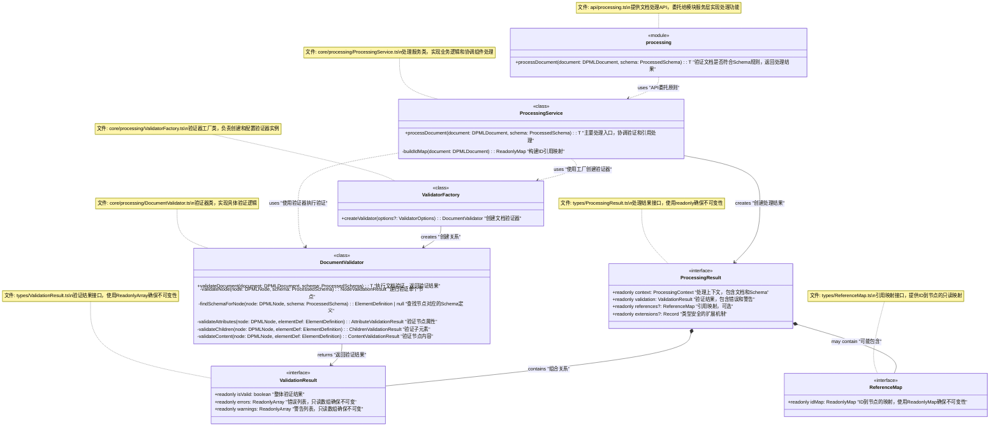
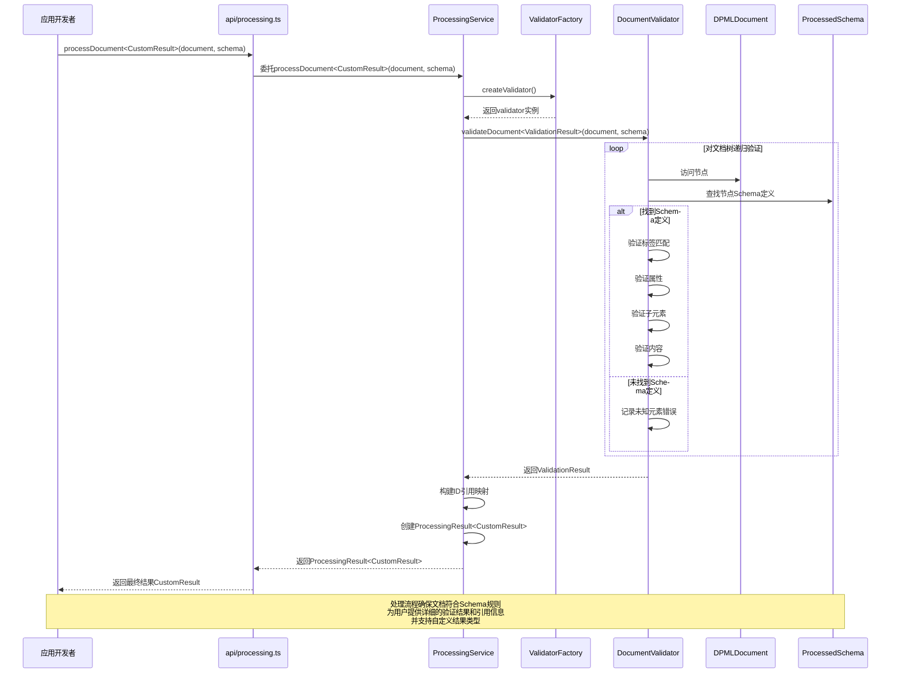

# Processing Develop Design

## UML

```mermaid
classDiagram
    %% API层
    class processing {
        <<module>>
        +processDocument<T extends ProcessingResult = ProcessingResult>(document: DPMLDocument, schema: ProcessedSchema): T "验证文档是否符合Schema规则，返回处理结果"
    }
    note for processing "文件: api/processing.ts\n提供文档处理API，委托给模块服务层实现处理功能"
    
    %% Core层 - 模块服务层
    class ProcessingService {
        <<class>>
        +processDocument<T extends ProcessingResult = ProcessingResult>(document: DPMLDocument, schema: ProcessedSchema): T "主要处理入口，协调验证和引用处理"
        -buildIdMap(document: DPMLDocument): ReadonlyMap<string, DPMLNode> "构建ID引用映射"
    }
    note for ProcessingService "文件: core/processing/ProcessingService.ts\n处理服务类，实现业务逻辑和协调组件处理"
    
    %% Core层 - 执行组件
    class DocumentValidator {
        <<class>>
        +validateDocument<T extends ValidationResult = ValidationResult>(document: DPMLDocument, schema: ProcessedSchema): T "执行文档验证，返回验证结果"
        -validateNode(node: DPMLNode, schema: ProcessedSchema): NodeValidationResult "递归验证单个节点"
        -findSchemaForNode(node: DPMLNode, schema: ProcessedSchema): ElementDefinition | null "查找节点对应的Schema定义"
        -validateAttributes(node: DPMLNode, elementDef: ElementDefinition): AttributeValidationResult "验证节点属性"
        -validateChildren(node: DPMLNode, elementDef: ElementDefinition): ChildrenValidationResult "验证子元素"
        -validateContent(node: DPMLNode, elementDef: ElementDefinition): ContentValidationResult "验证节点内容"
    }
    note for DocumentValidator "文件: core/processing/DocumentValidator.ts\n验证器类，实现具体验证逻辑"
    
    %% Core层 - 工厂组件
    class ValidatorFactory {
        <<class>>
        +createValidator(options?: ValidatorOptions): DocumentValidator "创建文档验证器"
    }
    note for ValidatorFactory "文件: core/processing/ValidatorFactory.ts\n验证器工厂类，负责创建和配置验证器实例"
    
    %% Types层 - 结果类型
    class ProcessingResult {
        <<interface>>
        +readonly context: ProcessingContext "处理上下文，包含文档和Schema"
        +readonly validation: ValidationResult "验证结果，包含错误和警告"
        +readonly references?: ReferenceMap "引用映射，可选"
        +readonly extensions?: Record<string, unknown> "类型安全的扩展机制"
    }
    note for ProcessingResult "文件: types/ProcessingResult.ts\n处理结果接口，使用readonly确保不可变性"
    
    class ValidationResult {
        <<interface>>
        +readonly isValid: boolean "整体验证结果"
        +readonly errors: ReadonlyArray<ProcessingError> "错误列表，只读数组确保不可变"
        +readonly warnings: ReadonlyArray<ProcessingWarning> "警告列表，只读数组确保不可变"
    }
    note for ValidationResult "文件: types/ValidationResult.ts\n验证结果接口，使用ReadonlyArray确保不可变性"
    
    class ReferenceMap {
        <<interface>>
        +readonly idMap: ReadonlyMap<string, DPMLNode> "ID到节点的映射，使用ReadonlyMap确保不可变性"
    }
    note for ReferenceMap "文件: types/ReferenceMap.ts\n引用映射接口，提供ID到节点的只读映射"
    
    %% 依赖关系
    processing ..> ProcessingService : uses "API委托原则"
    ProcessingService ..> DocumentValidator : uses "使用验证器执行验证"
    ProcessingService ..> ValidatorFactory : uses "使用工厂创建验证器"
    ValidatorFactory --> DocumentValidator : creates "创建关系"
    ProcessingService --> ProcessingResult : creates "创建处理结果"
    DocumentValidator --> ValidationResult : returns "返回验证结果"
    
    ProcessingResult *-- ValidationResult : contains "组合关系"
    ProcessingResult *-- ReferenceMap : may contain "可能包含"
```

## Sequence

```mermaid
sequenceDiagram
    participant User as 应用开发者
    participant API as api/processing.ts
    participant Service as ProcessingService
    participant Factory as ValidatorFactory
    participant Validator as DocumentValidator
    participant DPMLDoc as DPMLDocument
    participant SchemaObj as ProcessedSchema

    User->>API: processDocument<CustomResult>(document, schema)
    API->>Service: 委托processDocument<CustomResult>(document, schema)
    
    Service->>Factory: createValidator()
    Factory-->>Service: 返回validator实例
    
    Service->>Validator: validateDocument<ValidationResult>(document, schema)
    
    loop 对文档树递归验证
        Validator->>DPMLDoc: 访问节点
        Validator->>SchemaObj: 查找节点Schema定义
        
        alt 找到Schema定义
            Validator->>Validator: 验证标签匹配
            Validator->>Validator: 验证属性
            Validator->>Validator: 验证子元素
            Validator->>Validator: 验证内容
        else 未找到Schema定义
            Validator->>Validator: 记录未知元素错误
        end
    end
    
    Validator-->>Service: 返回ValidationResult
    
    Service->>Service: 构建ID引用映射
    Service->>Service: 创建ProcessingResult<CustomResult>
    
    Service-->>API: 返回ProcessingResult<CustomResult>
    API-->>User: 返回最终结果CustomResult

    Note over User,SchemaObj: 处理流程确保文档符合Schema规则<br>为用户提供详细的验证结果和引用信息<br>并支持自定义结果类型


```