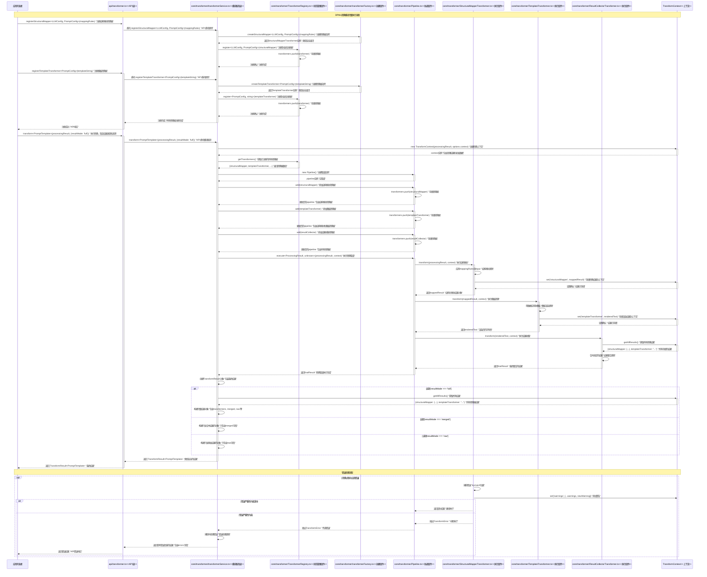

# Transformer Develop Design

## UML

```mermaid
classDiagram
    %% API层
    class transformer {
        <<module>> 
        +transform<T>(processingResult: ProcessingResult, options?: TransformOptions): TransformResult<T> "执行转换过程，返回结果"
        +registerTransformer<TInput, TOutput>(transformer: Transformer<TInput, TOutput>): void "注册自定义转换器"
        +registerStructuralMapper<TInput, TOutput>(rules: Array<MappingRule<unknown, unknown>>): void "注册结构映射转换器"
        +registerAggregator<TInput, TOutput>(config: CollectorConfig): void "注册聚合转换器"
        +registerTemplateTransformer<TInput>(template: string|Function, preprocessor?: Function): void "注册模板转换器"
        +registerRelationProcessor<TInput, TOutput>(nodeSelector: string, config: RelationConfig): void "注册关系处理转换器"
        +registerSemanticExtractor<TInput, TOutput>(extractors: Array<SemanticExtractor<unknown, unknown>>): void "注册语义提取转换器"
    }
    note for transformer "文件: api/transformer.ts\n作为API层的薄层接口，委托Core层的transformerService实现\n提供转换和注册功能的入口点"
    
    %% Types层
    class Transformer~TInput, TOutput~ {
        <<interface>>
        +name: string "转换器名称，用于标识"
        +description?: string "转换器描述，说明功能"
        +type?: string "转换器类型，分类用途"
        +transform(input: TInput, context: TransformContext): TOutput "执行转换的核心方法"
    }
    note for Transformer "文件: types/Transformer.ts\n转换器接口定义，所有转换器实现此接口\n支持泛型输入输出类型，确保类型安全"
    
    class TransformContext {
        <<class>>
        -data: Map<string, unknown> "存储上下文数据的内部Map"
        -processingResult: ProcessingResult "原始处理结果引用"
        +constructor(processingResult: ProcessingResult, initialData?: Record<string, unknown>) "创建上下文实例"
        +set<T>(key: string, value: T): void "类型安全的数据存储"
        +get<T>(key: string): T | undefined "类型安全的数据获取"
        +has(key: string): boolean "检查键是否存在"
        +getDocument(): DPMLDocument "获取原始文档"
        +getReferences(): ReferenceMap | undefined "获取引用关系"
        +isDocumentValid(): boolean "检查文档有效性"
        +getAllResults(): Record<string, unknown> "获取所有结果"
    }
    note for TransformContext "文件: types/TransformContext.ts\n转换上下文类，负责在转换过程中维护状态\n提供类型安全的数据访问方法"
    
    class TransformResult~T~ {
        <<interface>>
        +transformers: Record<string, unknown> "各转换器的结果映射"
        +merged: T "合并后的结果，类型为T"
        +raw?: unknown "原始未处理的结果"
        +warnings?: TransformWarning[] "转换过程中的警告"
        +metadata: TransformMetadata "转换元数据信息"
    }
    note for TransformResult "文件: types/TransformResult.ts\n转换结果接口，定义转换输出的标准结构\n支持泛型指定结果类型，提供多种结果访问模式"
    
    class TransformOptions {
        <<interface>>
        +context?: Record<string, unknown> "初始上下文数据"
        +resultMode?: 'full'|'merged'|'raw' "结果模式选择"
        +include?: string[] "包含的转换器"
        +exclude?: string[] "排除的转换器"
    }
    note for TransformOptions "文件: types/TransformOptions.ts\n转换选项接口，配置转换过程\n提供结果模式和过滤器选项"
    
    class MappingRule~TValue, TResult~ {
        <<interface>>
        +selector: string "CSS选择器，定位元素"
        +targetPath: string "目标属性路径"
        +transform?: (value: TValue) => TResult "可选值转换函数"
    }
    note for MappingRule "文件: types/MappingRule.ts\n映射规则接口，用于结构映射\n支持泛型定义输入值和输出值类型"
    
    %% Core层 - 模块服务层
    class transformerService {
        <<module>>
        +transform<T>(processingResult: ProcessingResult, options?: TransformOptions): TransformResult<T> "执行转换，协调转换流程"
        +registerTransformer<TInput, TOutput>(transformer: Transformer<TInput, TOutput>): void "注册转换器到注册表"
        +registerStructuralMapper<TInput, TOutput>(rules: Array<MappingRule<unknown, unknown>>): void "创建并注册结构映射转换器"
        +registerAggregator<TInput, TOutput>(config: CollectorConfig): void "创建并注册聚合转换器"
        +registerTemplateTransformer<TInput>(template: string|Function, preprocessor?: Function): void "创建并注册模板转换器"
        +registerRelationProcessor<TInput, TOutput>(nodeSelector: string, config: RelationConfig): void "创建并注册关系处理转换器"
        +registerSemanticExtractor<TInput, TOutput>(extractors: Array<SemanticExtractor<unknown, unknown>>): void "创建并注册语义提取转换器"
        -getPipeline(): Pipeline "获取或创建管道实例"
    }
    note for transformerService "文件: core/transformer/transformerService.ts\n模块服务层，实现业务逻辑并协调组件\n管理转换器注册、创建流水线和执行转换流程"
    
    %% Core层 - transformer模块基础组件
    class Pipeline {
        <<class>>
        -transformers: Array<Transformer<unknown, unknown>> "转换器数组"
        +add<TInput, TOutput>(transformer: Transformer<TInput, TOutput>): Pipeline "添加转换器到管道"
        +execute<TInput, TOutput>(input: TInput, context: TransformContext): TOutput "按顺序执行转换器"
    }
    note for Pipeline "文件: core/transformer/Pipeline.ts\n协调组件，管理转换器执行顺序\n负责组织转换流程和数据流转"
    
    class TransformerRegistry {
        <<class>>
        -transformers: Array<Transformer<unknown, unknown>> "存储已注册的转换器"
        +register<TInput, TOutput>(transformer: Transformer<TInput, TOutput>): void "注册转换器"
        +getTransformers(): Array<Transformer<unknown, unknown>> "获取所有转换器"
    }
    note for TransformerRegistry "文件: core/transformer/TransformerRegistry.ts\n状态管理组件，维护转换器注册表\n管理全局转换器注册状态"
    
    %% Core层 - framework模块转换器工厂
    class frameworkTransformerFactory {
        <<factory>>
        +createStructuralMapper<TInput, TOutput>(rules: Array<MappingRule<unknown, unknown>>): StructuralMapperTransformer<TInput, TOutput> "创建结构映射转换器"
        +createAggregator<TInput, TOutput>(config: CollectorConfig): AggregatorTransformer<TInput, TOutput> "创建聚合转换器"
        +createTemplateTransformer<TInput>(template: string|Function, preprocessor?: Function): TemplateTransformer<TInput> "创建模板转换器"
        +createRelationProcessor<TInput, TOutput>(nodeSelector: string, config: RelationConfig): RelationProcessorTransformer<TInput, TOutput> "创建关系处理转换器"
        +createSemanticExtractor<TInput, TOutput>(extractors: Array<SemanticExtractor<unknown, unknown>>): SemanticExtractorTransformer<TInput, TOutput> "创建语义提取转换器"
        +createResultCollector<TOutput>(transformerNames?: string[]): ResultCollectorTransformer<TOutput> "创建结果收集转换器"
    }
    note for frameworkTransformerFactory "文件: core/framework/transformer/transformerFactory.ts\n创建组件，负责创建转换器实例\n封装转换器创建逻辑，注入依赖"
    
    %% Core层 - framework模块转换器实现
    class StructuralMapperTransformer~TInput, TOutput~ {
        <<class>>
        -mappingRules: Array<MappingRule<unknown, unknown>> "映射规则数组"
        +name: string "转换器名称"
        +description: string "转换器描述"
        +type: string "转换器类型"
        +constructor(mappingRules: Array<MappingRule<unknown, unknown>>) "构造器，接收映射规则"
        +transform(input: TInput, context: TransformContext): TOutput "执行结构映射转换"
    }
    note for StructuralMapperTransformer "文件: core/framework/transformer/StructuralMapperTransformer.ts\n执行组件，实现结构映射逻辑\n将选择器定位的数据映射到目标结构"
    
    class TemplateTransformer~TInput~ {
        <<class>>
        -template: string | Function "模板字符串或函数"
        -dataPreprocessor?: Function "数据预处理函数"
        +name: string "转换器名称"
        +description: string "转换器描述"
        +type: string "转换器类型"
        +constructor(template: string | Function, dataPreprocessor?: Function) "构造器，接收模板和预处理器"
        +transform(input: TInput, context: TransformContext): string "执行模板渲染转换"
    }
    note for TemplateTransformer "文件: core/framework/transformer/TemplateTransformer.ts\n执行组件，实现模板渲染逻辑\n将数据应用到模板生成输出"
    
    %% 定义关系
    transformer --> transformerService : 委托 "API委托原则，薄层设计"
    transformerService --> Pipeline : 创建并使用 "协调组件关系"
    transformerService --> TransformerRegistry : 使用 "状态管理关系"
    transformerService --> frameworkTransformerFactory : 使用 "创建组件关系"
    Pipeline --> Transformer : 包含 "组合关系"
    TransformerRegistry --> Transformer : 存储 "集合关系"
    
    Transformer <|.. StructuralMapperTransformer : 实现 "接口实现关系"
    Transformer <|.. TemplateTransformer : 实现 "接口实现关系"
    
    frameworkTransformerFactory ..> StructuralMapperTransformer : 创建 "工厂创建关系"
    frameworkTransformerFactory ..> TemplateTransformer : 创建 "工厂创建关系"
    
    transformer ..> TransformResult : 返回 "返回类型关系"
    transformer ..> TransformOptions : 使用 "参数类型关系"
    transformerService ..> TransformContext : 创建 "创建关系"
    transformerService ..> TransformResult : 创建并返回 "创建返回关系"
    
    StructuralMapperTransformer --> MappingRule : 使用 "配置使用关系"
```

## sequence diagram

## 转换器迁移说明

为了改进架构设计和职责分离，转换器实现已从transformer模块迁移到framework模块。这种变化带来以下优势：

1. **关注点分离**：
   - transformer模块现在只包含框架组件（Pipeline、TransformerRegistry）和运行逻辑
   - 所有具体转换器实现都位于framework模块中，便于统一管理和扩展

2. **架构清晰**：
   - 基础框架组件和具体实现组件明确分离
   - framework模块统一存放领域特定实现
   - transformer模块保持纯净，专注于基础能力

3. **迁移内容**：
   - 所有转换器类（StructuralMapperTransformer、AggregatorTransformer等）迁移至`core/framework/transformer/`
   - 转换器工厂（transformerFactory）迁移至`core/framework/transformer/transformerFactory.ts`
   - 转换器类型定义保持不变，仍在Types层

4. **接口保持稳定**：
   - API层接口保持不变
   - transformerService接口保持不变，但实现上改为调用framework模块中的工厂
   - 所有用户代码无需修改，保持向后兼容

开发者在实现自定义转换器时，可以继续使用原有的接口和注册方式，框架会正确处理组件创建和转换流程的协调。
