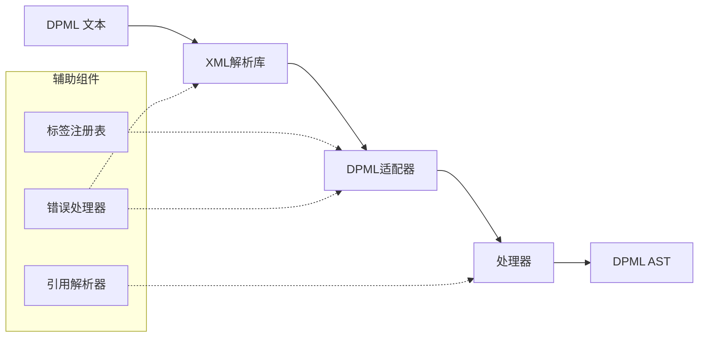
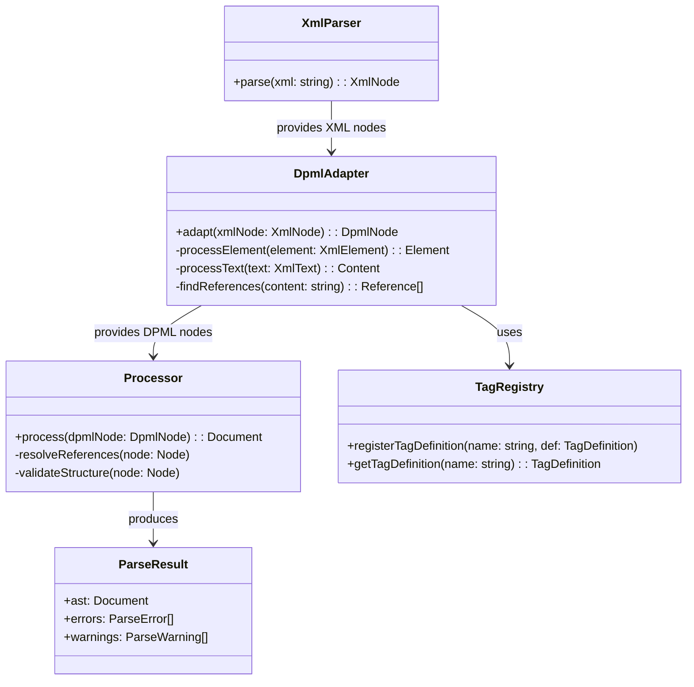
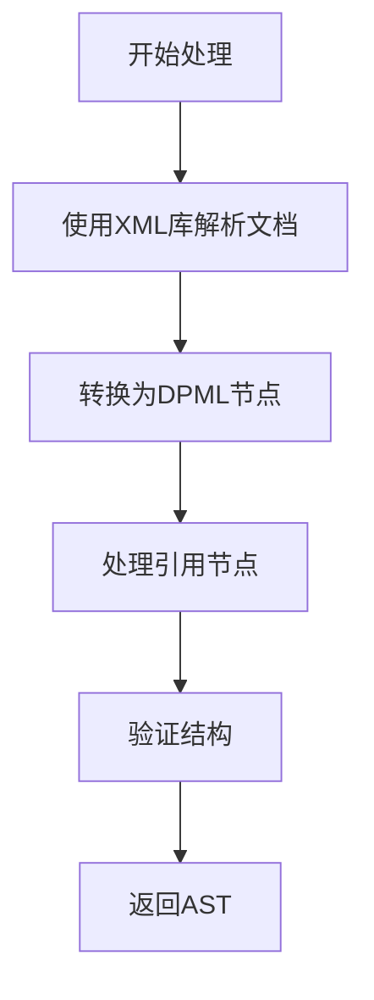

# Parser 模块设计文档

## 1. 概述

Parser 模块是 DPML 核心基础设施的关键组件，负责将 DPML 文本解析为结构化的抽象语法树 (AST)。本文档详细描述 Parser 模块的设计原则、架构、实现策略和接口定义。

### 1.1 设计目标

Parser 模块的设计目标是：

1. **高效解析** - 快速处理大型 DPML 文档
2. **强健性** - 对格式错误的输入具有容错能力
3. **可扩展性** - 支持标签系统和语法的扩展
4. **明确错误** - 提供精确的错误位置和原因
5. **增量能力** - 为未来的增量解析奠定基础

## 2. 架构设计

### 2.1 整体架构

Parser 模块基于现有XML解析库构建，添加DPML特有的功能和扩展点：



### 2.2 核心组件



## 3. 组件详细设计

### 3.1 XML解析库集成

Parser 使用现有的 XML 解析库（如 fast-xml-parser 或 node-html-parser）处理基础 XML 结构：

```typescript
// 选择XML解析库的抽象接口
class XmlParserAdapter {
  /**
   * 解析XML文本
   * @param xml XML文本
   * @returns 解析后的XML节点
   */
  parse(xml: string): XmlNode {
    // 调用具体的XML解析库
    return this.xmlLib.parse(xml, this.getParserOptions());
  }
  
  /**
   * 获取解析选项
   */
  protected getParserOptions() {
    return {
      // 配置选项，如保留注释、属性等
      attributeNamePrefix: "",
      ignoreAttributes: false,
      parseAttributeValue: true,
    };
  }
}
```

### 3.2 DPML适配器

适配器负责将通用XML节点转换为DPML特定节点，处理DPML特有的语法（如引用）：

```typescript
class DpmlAdapter {
  /**
   * 将XML节点转换为DPML节点
   * @param xmlNode XML节点
   * @returns DPML节点
   */
  adapt(xmlNode: XmlNode): DpmlNode {
    if (isElement(xmlNode)) {
      return this.processElement(xmlNode);
    } else if (isText(xmlNode)) {
      return this.processText(xmlNode);
    }
    // ...处理其他节点类型
  }
  
  /**
   * 处理XML元素节点
   */
  private processElement(element: XmlElement): Element {
    // 创建DPML元素节点
    // 处理属性、子节点等
  }
  
  /**
   * 处理文本节点，提取引用
   */
  private processText(text: XmlText): Content | Node[] {
    // 检查文本中的引用
    const references = this.findReferences(text.value);
    if (references.length === 0) {
      return new Content(text.value, text.position);
    }
    
    // 拆分文本和引用节点
    // ...
  }
  
  /**
   * 提取文本中的引用
   */
  private findReferences(content: string): Reference[] {
    // 使用正则表达式查找引用
    // 例如 @http://example.com 格式
  }
}
```

### 3.3 节点类型

DPML 解析结果的节点类型：

```typescript
interface Node {
  type: string;
  position: {
    start: { line: number; column: number; offset: number; };
    end: { line: number; column: number; offset: number; };
  };
}

interface Document extends Node {
  type: 'document';
  children: Node[];
}

interface Element extends Node {
  type: 'element';
  tagName: string;
  attributes: Record<string, any>;
  children: Node[];
}

interface Content extends Node {
  type: 'content';
  value: string;
}

interface Reference extends Node {
  type: 'reference';
  protocol: string;
  path: string;
  resolved?: any;
}
```

### 3.4 标签定义

```typescript
interface TagDefinition {
  /**
   * 允许的属性
   */
  attributes?: string[];
  
  /**
   * 必需的属性
   */
  requiredAttributes?: string[];
  
  /**
   * 允许的子标签
   */
  allowedChildren?: string[];
  
  /**
   * 是否自闭合标签
   */
  selfClosing?: boolean;
}
```

### 3.5 处理流程

使用适配好的DPML节点进行处理：



### 3.6 DPML规范属性处理

DPML规范定义了一系列标准属性，Parser需要专门处理这些属性：

#### 3.6.1 基础属性

```typescript
interface CoreAttributes {
  /**
   * 标签唯一标识符
   * 格式：字母开头，允许字母、数字、下划线、连字符
   */
  id?: string;
  
  /**
   * DPML规范版本，仅用于根标签
   * 格式：主版本.次版本，如"1.0"
   */
  version?: string;
  
  /**
   * 语言代码，仅用于根标签
   * 格式：ISO语言代码，如"zh-CN"
   */
  lang?: string;
}
```

处理逻辑：

```typescript
class CoreAttributeProcessor {
  /**
   * 验证ID属性的格式
   */
  validateId(id: string): boolean {
    return /^[a-zA-Z][a-zA-Z0-9_-]*$/.test(id);
  }
  
  /**
   * 验证版本格式
   */
  validateVersion(version: string): boolean {
    return /^\d+\.\d+$/.test(version);
  }
  
  /**
   * 处理根标签特殊属性
   */
  processRootAttributes(element: Element): void {
    // 处理版本
    if (element.attributes.version) {
      if (!this.validateVersion(element.attributes.version)) {
        // 添加警告
      }
      // 设置解析器版本模式
    }
    
    // 处理语言
    if (element.attributes.lang) {
      // 设置文档语言
    }
  }
}
```

#### 3.6.2 继承属性处理

```typescript
class InheritanceProcessor {
  /**
   * 处理标签继承
   * @param element 当前元素
   * @param context 处理上下文
   */
  async processInheritance(element: Element, context: ProcessingContext): Promise<void> {
    if (!element.attributes.extends) {
      return;
    }
    
    // 解析extends引用
    const baseElement = await this.resolveExtends(element.attributes.extends, context);
    
    if (!baseElement) {
      context.addError('inheritance-error', `无法找到继承基础: ${element.attributes.extends}`, element.position);
      return;
    }
    
    // 验证类型匹配
    if (baseElement.tagName !== element.tagName) {
      context.addWarning('type-mismatch', `继承类型不匹配: ${baseElement.tagName} != ${element.tagName}`, element.position);
    }
    
    // 应用属性继承规则
    this.inheritAttributes(element, baseElement);
    
    // 应用内容继承规则
    this.inheritContent(element, baseElement);
  }
  
  /**
   * 解析extends引用
   */
  private async resolveExtends(extendsValue: string, context: ProcessingContext): Promise<Element | null> {
    // 处理不同类型的引用（ID引用、相对路径、绝对路径、HTTP路径）
    // ...
  }
  
  /**
   * 应用属性继承规则
   */
  private inheritAttributes(element: Element, baseElement: Element): void {
    // 子优先原则：当前标签的属性优先
    for (const [key, value] of Object.entries(baseElement.attributes)) {
      if (key !== 'id' && !(key in element.attributes)) {
        element.attributes[key] = value;
      }
    }
  }
  
  /**
   * 应用内容继承规则
   */
  private inheritContent(element: Element, baseElement: Element): void {
    // 如果当前标签没有有效内容，则继承基础标签的内容
    if (this.isEmptyContent(element) && !this.isEmptyContent(baseElement)) {
      element.children = [...baseElement.children];
    }
  }
  
  /**
   * 判断是否为空内容
   */
  private isEmptyContent(element: Element): boolean {
    // 检查是否只有空白内容和注释
    // ...
  }
}
```

#### 3.6.3 控制属性处理

```typescript
class ControlAttributeProcessor {
  /**
   * 处理控制属性
   */
  processControlAttributes(element: Element, context: ProcessingContext): void {
    // 处理schema属性
    if (element.attributes.schema) {
      this.processSchema(element.attributes.schema, context);
    }
    
    // 处理mode属性
    if (element.attributes.mode) {
      this.processMode(element.attributes.mode, context);
    }
  }
  
  /**
   * 处理schema属性
   */
  private processSchema(schema: string, context: ProcessingContext): void {
    // 加载并应用schema验证规则
    // ...
  }
  
  /**
   * 处理mode属性
   */
  private processMode(mode: string, context: ProcessingContext): void {
    if (mode !== 'strict' && mode !== 'loose') {
      context.addWarning('invalid-mode', `无效的mode值: ${mode}，使用默认值'loose'`, context.currentNode?.position);
      mode = 'loose';
    }
    
    context.parserMode = mode;
  }
}
```

#### 3.6.4 扩展属性处理

```typescript
class ExtensionAttributeProcessor {
  /**
   * 处理扩展属性（x-前缀）
   */
  processExtensionAttributes(element: Element, context: ProcessingContext): void {
    const extensionAttrs = Object.keys(element.attributes)
      .filter(key => key.startsWith('x-'));
    
    for (const attr of extensionAttrs) {
      // 保留扩展属性，交由插件处理
      const handler = context.getExtensionHandler(attr);
      if (handler) {
        handler.processAttribute(attr, element.attributes[attr], element, context);
      }
    }
  }
}
```

## 4. 接口设计

### 4.1 公共接口

```typescript
interface DPMLParser {
  /**
   * 解析DPML文本并返回AST
   * @param input DPML文本
   * @param options 解析选项
   * @returns 解析结果
   */
  parse(input: string, options?: ParseOptions): Promise<ParseResult>;
  
  /**
   * 验证DPML AST是否有效
   * @param ast DPML AST
   * @returns 验证结果
   */
  validate(ast: Document): ValidationResult;
}

interface ParseOptions {
  /**
   * 是否允许未知标签
   * @default true
   */
  allowUnknownTags?: boolean;
  
  /**
   * 是否忽略验证错误继续解析
   * @default false
   */
  tolerant?: boolean;
  
  /**
   * 是否保留注释
   * @default false
   */
  preserveComments?: boolean;
  
  /**
   * 解析模式，对应DPML的mode属性
   * @default "loose"
   */
  mode?: "strict" | "loose";
  
  /**
   * 是否处理继承（extends属性）
   * @default true
   */
  processInheritance?: boolean;
}

interface ParseResult {
  /**
   * 解析生成的AST
   */
  ast: Document;
  
  /**
   * 解析过程中的错误
   */
  errors: ParseError[];
  
  /**
   * 解析过程中的警告
   */
  warnings: ParseWarning[];
}
```

### 4.2 错误处理接口

```typescript
class ParseError extends Error {
  /**
   * 错误码
   */
  code: string;
  
  /**
   * 错误位置
   */
  position: SourcePosition;
}

class ParseWarning {
  /**
   * 警告码
   */
  code: string;
  
  /**
   * 警告消息
   */
  message: string;
  
  /**
   * 警告位置
   */
  position: SourcePosition;
}
```

## 5. 扩展机制

Parser 模块提供以下扩展点：

### 5.1 自定义标签处理

```typescript
interface TagProcessor {
  /**
   * 处理特定标签
   * @param element 标签元素
   * @param context 处理上下文
   */
  process(element: Element, context: ProcessingContext): Promise<void>;
}

// 注册标签处理器
tagRegistry.registerTagProcessor('my-tag', myTagProcessor);
```

### 5.2 自定义验证规则

```typescript
interface TagValidator {
  /**
   * 验证标签
   * @param element 标签元素
   * @param context 验证上下文
   * @returns 验证结果
   */
  validate(element: Element, context: ValidationContext): ValidationResult;
}

// 注册标签验证器
tagRegistry.registerTagValidator('my-tag', myTagValidator);
```

### 5.3 自定义引用处理

```typescript
interface ReferenceProtocolHandler {
  /**
   * 判断是否能处理此协议
   * @param protocol 协议名
   */
  canHandle(protocol: string): boolean;
  
  /**
   * 处理引用
   * @param reference 引用节点
   * @param context 处理上下文
   * @returns 解析结果
   */
  handle(reference: Reference, context: ReferenceContext): Promise<any>;
}

// 注册协议处理器
referenceRegistry.registerProtocolHandler(myProtocolHandler);
```

### 5.4 扩展属性处理器

```typescript
interface ExtensionAttributeHandler {
  /**
   * 判断是否能处理此扩展属性
   */
  canHandle(attributeName: string): boolean;
  
  /**
   * 处理扩展属性
   */
  processAttribute(
    name: string, 
    value: any, 
    element: Element, 
    context: ProcessingContext
  ): void;
}

// 注册扩展属性处理器
extensionRegistry.registerAttributeHandler(myExtensionHandler);
```

## 6. 错误处理策略

Parser 模块采用分级错误处理策略：

1. **致命错误**：会导致解析终止，如格式严重错误
2. **语法错误**：可能影响解析结果，但不会终止解析
3. **警告**：格式问题或最佳实践违反，不影响解析结果

错误信息包含：
- 错误类型和代码
- 详细的错误消息
- 准确的源码位置（行、列、偏移量）
- 可能的修复建议

## 7. 性能考量

Parser 模块的性能优化策略：

1. **优化XML解析**：配置XML解析库以最大化性能
2. **懒验证**：只在需要时验证AST
3. **缓存标签定义**：避免重复查找
4. **部分解析**：支持只解析文档的特定部分
5. **继承处理优化**：缓存已解析的继承基础标签

性能目标：
- 100KB DPML文档解析时间 < 100ms
- 内存占用：文档大小的 5-10 倍

## 8. 使用示例

### 8.1 基本使用

```typescript
import { createParser } from '@dpml/core';

// 创建解析器
const parser = createParser();

// 解析DPML文档
const result = await parser.parse(`
<prompt>
  <role name="user">
    请解释DPML的用途。
    参考资料：@http://example.com/dpml-docs
  </role>
</prompt>
`);

// 处理解析结果
console.log(result.ast);
if (result.errors.length > 0) {
  console.error('解析错误:', result.errors);
}
```

### 8.2 使用扩展

```typescript
import { createParser, tagRegistry } from '@dpml/core';

// 注册自定义标签
tagRegistry.registerTagDefinition('custom-tag', {
  attributes: ['type', 'id'],
  requiredAttributes: ['type'],
  allowedChildren: ['text', 'reference']
});

// 创建解析器
const parser = createParser();

// 解析带有自定义标签的文档
const result = await parser.parse(`
<prompt>
  <custom-tag type="example" id="demo">
    这是一个自定义标签示例
  </custom-tag>
</prompt>
`);
```

### 8.3 处理继承

```typescript
import { createParser } from '@dpml/core';

// 创建解析器
const parser = createParser();

// 解析带有继承的DPML文档
const result = await parser.parse(`
<!-- 定义基础角色模板 -->
<role id="base-assistant" name="assistant">
  我是一个AI助手，可以回答各种问题。
</role>

<!-- 继承并自定义内容 -->
<role extends="base-assistant" x-tone="friendly">
  我是一个友好的AI助手，很高兴能帮助您解决问题！
</role>
`);
```

## 9. 未来扩展

Parser 模块的未来扩展计划：

1. **增量解析**：支持局部更新而非完全重解析
2. **并行处理**：利用Worker进行并行处理
3. **语言服务支持**：为编辑器集成提供LSP实现
4. **强大的诊断**：提供更详细的错误信息和修复建议
5. **解析优化**：针对特定场景的性能优化

---

本文档定义了Parser模块的详细设计。实现时基于现有XML解析库，同时添加DPML特有的功能。 