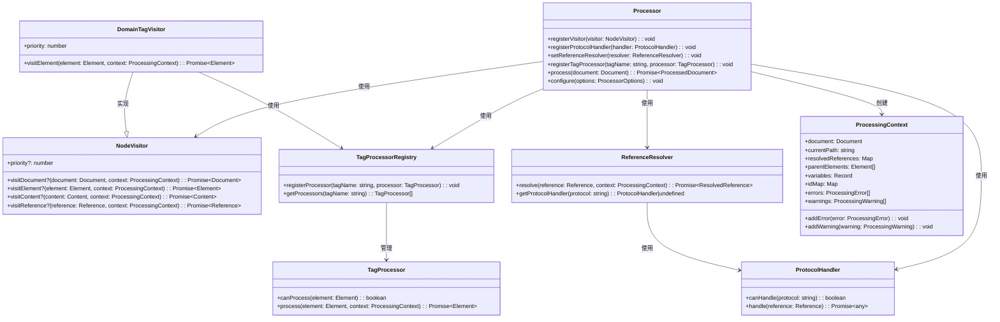
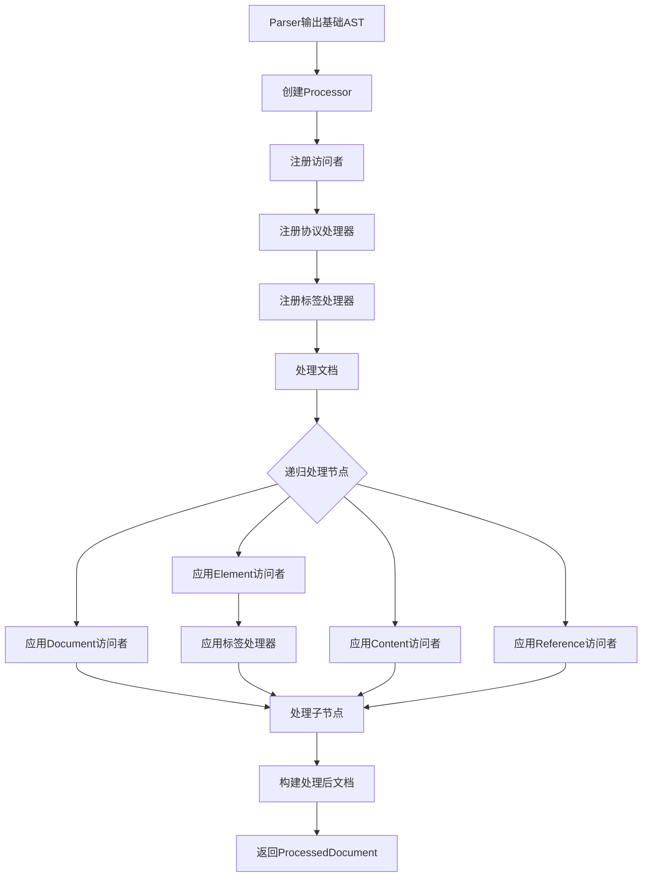

# @dpml/core Processor模块设计

## 1. 模块定位与职责

Processor模块在DPML处理流程中位于Parser之后、Transformer之前，作为核心**语义处理层**，承担以下主要职责：

- 接收Parser生成的基础AST，生成语义完整的增强AST
- 实现标签继承机制(`extends`属性)的处理
- 识别和解析@引用系统
- 处理标签属性和内容
- **处理领域特定标签的语义**
- **添加语义元数据以支持后续转换**
- 管理协议处理器和资源加载
- 提供扩展点以支持多样化的处理需求


Processor是整个DPML处理流程中的语义理解层，负责将Parser生成的语法结构转化为具有完整语义的文档模型，为Transformer提供已解析且语义明确的文档对象。

## 2. 访问者模式架构

Processor模块采用**访问者模式**(Visitor Pattern)作为核心架构，实现算法与数据结构分离，便于扩展和复用。

### 2.1 核心接口

```typescript
// 节点访问者接口
interface NodeVisitor {
  // 各类节点的访问方法
  visitDocument?(document: Document, context: ProcessingContext): Promise<Document>;
  visitElement?(element: Element, context: ProcessingContext): Promise<Element>;
  visitContent?(content: Content, context: ProcessingContext): Promise<Content>;
  visitReference?(reference: Reference, context: ProcessingContext): Promise<Reference>;
  
  // 访问者优先级，数值越大优先级越高
  priority?: number;
}

// 标签处理器接口
interface TagProcessor {
  // 检查是否能处理该标签
  canProcess(element: Element): boolean;
  
  // 处理标签语义，返回处理后的元素
  process(element: Element, context: ProcessingContext): Promise<Element>;
}

// 标签处理器注册表
interface TagProcessorRegistry {
  registerProcessor(tagName: string, processor: TagProcessor): void;
  getProcessors(tagName: string): TagProcessor[];
}

// 处理器接口
interface Processor {
  // 注册扩展点
  registerVisitor(visitor: NodeVisitor): void;
  registerProtocolHandler(handler: ProtocolHandler): void;
  setReferenceResolver(resolver: ReferenceResolver): void;
  
  // 语义处理扩展点
  registerTagProcessor(tagName: string, processor: TagProcessor): void;
  
  // 处理方法
  process(document: Document): Promise<ProcessedDocument>;
  
  // 配置选项
  configure(options: ProcessorOptions): void;
}

// 协议处理器接口
interface ProtocolHandler {
  canHandle(protocol: string): boolean;
  handle(reference: Reference): Promise<any>;
}

// 引用解析器接口
interface ReferenceResolver {
  resolve(reference: Reference, context: ProcessingContext): Promise<ResolvedReference>;
  getProtocolHandler(protocol: string): ProtocolHandler | undefined;
}

// 处理上下文
interface ProcessingContext {
  document: Document;                     // 当前处理的文档
  currentPath: string;                    // 当前文档路径
  resolvedReferences: Map<string, any>;   // 已解析的引用缓存
  parentElements: Element[];              // 祖先元素栈
  variables: Record<string, any>;         // 上下文变量
  idMap?: Map<string, Element>;           // ID到元素的映射
  errors: ProcessingError[];              // 处理过程中的错误
  warnings: ProcessingWarning[];          // 处理过程中的警告
  
  // 错误和警告处理
  addError(error: ProcessingError): void;
  addWarning(warning: ProcessingWarning): void;
}

// 增强的元素接口，添加元数据支持
interface Element extends Node {
  type: 'element';
  tagName: string;
  attributes: Record<string, any>;
  children: Node[];
  
  // 元数据字段，用于存储语义处理结果
  metadata?: Record<string, any>;
}

// 处理后的文档，包含标志和元数据
interface ProcessedDocument extends Document {
  // 处理完成标志
  processed: boolean;
  
  // 继承处理标志
  inheritanceResolved: boolean;
  
  // 引用处理标志
  referencesResolved: boolean;
  
  // 文档级元数据
  metadata?: Record<string, any>;
}
```

### 2.2 架构组成



### 2.3 处理流程



## 3. 核心访问者类型

Processor架构支持多种类型的访问者，每种类型负责特定的处理任务：

| 访问者类型 | 优先级 | 主要职责 |
|---------|------|--------|
| 继承处理访问者 | 100 | 处理标签继承(extends属性)，加载和合并基础标签 |
| ID验证访问者 | 90 | 收集和验证ID唯一性，构建ID映射表 |
| 引用处理访问者 | 80 | 解析和处理@引用，加载引用资源 |
| 内容处理访问者 | 70 | 处理Markdown等内容格式 |
| **领域标签访问者** | **60** | **处理特定领域标签的语义解释** |
| **验证访问者** | **50** | **验证标签结构、关系和语义约束** |
| **元数据收集访问者** | **40** | **收集和整合语义元数据** |
| 后处理访问者 | 10-30 | 进行各种后处理工作，为转换做准备 |

访问者按优先级排序，优先级高的先执行。各访问者保持单一职责，通过组合实现复杂功能。

## 4. 标签处理器机制

标签处理器提供了一种模块化的方式来处理特定领域标签的语义：

### 4.1 标签处理器接口

```typescript
interface TagProcessor {
  // 检查是否能处理该标签
  canProcess(element: Element): boolean;
  
  // 处理标签语义，返回处理后的元素
  process(element: Element, context: ProcessingContext): Promise<Element>;
}
```

### 4.2 标签处理器注册表

```typescript
class TagProcessorRegistry {
  private processors: Map<string, TagProcessor[]> = new Map();
  
  // 注册处理器
  registerProcessor(tagName: string, processor: TagProcessor): void {
    const processors = this.processors.get(tagName) || [];
    processors.push(processor);
    this.processors.set(tagName, processors);
  }
  
  // 获取处理器
  getProcessors(tagName: string): TagProcessor[] {
    return this.processors.get(tagName) || [];
  }
}
```

### 4.3 领域标签访问者

```typescript
class DomainTagVisitor implements NodeVisitor {
  priority = 60; // 在基础处理之后，但在后处理之前
  
  constructor(private registry: TagProcessorRegistry) {}
  
  async visitElement(element: Element, context: ProcessingContext): Promise<Element> {
    // 获取该标签的所有处理器
    const processors = this.registry.getProcessors(element.tagName);
    
    // 没有处理器，返回原始元素
    if (processors.length === 0) return element;
    
    // 依次应用所有能处理该标签的处理器
    let processedElement = element;
    for (const processor of processors) {
      if (processor.canProcess(processedElement)) {
        processedElement = await processor.process(processedElement, context);
      }
    }
    
    return processedElement;
  }
}
```

### 4.4 标签处理器用例

```typescript
// 示例：Agent标签处理器
class AgentTagProcessor implements TagProcessor {
  canProcess(element: Element): boolean {
    return element.tagName === 'agent' && !element.metadata?.processed;
  }
  
  async process(element: Element, context: ProcessingContext): Promise<Element> {
    // 验证必要属性
    if (!element.attributes.id) {
      context.addError(new ValidationError('Agent must have an id', element));
    }
    
    // 处理子元素关系
    const toolElements = element.children.filter(
      child => child.type === 'element' && child.tagName === 'tool'
    );
    
    // 提取和验证工具定义
    const tools = await Promise.all(toolElements.map(
      async (tool) => this.processTool(tool as Element, context)
    ));
    
    // 添加语义元数据
    element.metadata = {
      ...element.metadata,
      processed: true,
      agentType: element.attributes.type || 'default',
      tools: tools.filter(Boolean), // 过滤掉处理失败的工具
      capabilities: this.extractCapabilities(element),
      requiresAuthentication: !!element.attributes.auth
    };
    
    return element;
  }
  
  private async processTool(element: Element, context: ProcessingContext): Promise<any> {
    // 处理工具定义...
  }
  
  private extractCapabilities(element: Element): string[] {
    // 提取能力信息...
  }
}
```

## 5. 扩展机制

Processor模块提供四个主要扩展点：

### 5.1 通过访问者扩展(NodeVisitor)

访问者是最主要的扩展机制，能够处理不同类型的节点。实现NodeVisitor接口并注册到Processor即可添加新功能。

```typescript
// 访问者注册
processor.registerVisitor(new CustomVisitor());
```

自定义访问者可以：
- 处理特定类型的节点
- 验证或修改属性和内容
- 收集或分析文档信息
- 添加特定领域的处理逻辑

### 5.2 通过标签处理器扩展(TagProcessor)

标签处理器用于处理特定领域标签的语义，实现TagProcessor接口并注册到Processor即可添加新的标签语义解释。

```typescript
// 标签处理器注册
processor.registerTagProcessor('custom-tag', new CustomTagProcessor());
```

自定义标签处理器可以：
- 解释特定领域标签的语义
- 验证标签结构和属性
- 处理标签间的关系
- 添加语义元数据

### 5.3 通过协议处理器扩展(ProtocolHandler)

协议处理器用于扩展@引用系统支持的协议，实现ProtocolHandler接口并注册到Processor即可支持新的引用协议。

```typescript
// 协议处理器注册
processor.registerProtocolHandler(new CustomProtocolHandler());
```

自定义协议处理器可以：
- 支持新的引用协议(`@custom://...`)
- 连接外部数据源或API
- 处理特定格式的资源

### 5.4 通过引用解析器扩展(ReferenceResolver)

引用解析器用于定制引用解析的整体策略，替换默认的引用解析器可以自定义整个引用解析流程。

```typescript
// 引用解析器设置
processor.setReferenceResolver(new CustomReferenceResolver());
```

自定义引用解析器可以：
- 实现特殊的引用语法
- 添加引用转换功能
- 自定义缓存策略
- 实现安全控制或访问限制

## 6. 元数据机制

Processor通过元数据机制支持语义信息的传递：

### 6.1 元素元数据

每个元素节点可以包含元数据，用于存储语义处理结果：

```typescript
interface Element extends Node {
  // 其他属性...
  
  // 元数据字段
  metadata?: Record<string, any>;
}
```

元数据可以包含：
- 标签的域特定含义
- 验证信息
- 处理状态标记
- 衍生属性
- 关系信息

### 6.2 文档元数据

处理后的文档也包含文档级元数据：

```typescript
interface ProcessedDocument extends Document {
  // 其他属性...
  
  // 文档级元数据
  metadata?: Record<string, any>;
}
```

文档元数据可以包含：
- 文档类型信息
- 整体语义概要
- 跨标签关系
- 全局验证结果

### 6.3 元数据使用示例

```typescript
// 在标签处理器中添加元数据
async process(element: Element, context: ProcessingContext): Promise<Element> {
  // 处理逻辑...
  
  // 添加元数据
  element.metadata = {
    ...element.metadata,
    semanticType: 'conversation',
    participants: ['user', 'assistant'],
    turnCount: 5,
    language: element.attributes.lang || 'en'
  };
  
  return element;
}

// 收集文档级元数据
class MetadataCollectorVisitor implements NodeVisitor {
  priority = 40;
  
  async visitDocument(document: Document, context: ProcessingContext): Promise<Document> {
    // 收集所有元素的元数据
    const allMetadata = this.collectAllMetadata(document);
    
    // 创建文档级元数据
    (document as ProcessedDocument).metadata = {
      documentType: this.determineDocumentType(allMetadata),
      entityCount: Object.keys(allMetadata.entities || {}).length,
      referencedResources: allMetadata.resources || []
    };
    
    return document;
  }
  
  private collectAllMetadata(document: Document): any {
    // 收集逻辑...
  }
  
  private determineDocumentType(metadata: any): string {
    // 确定文档类型...
  }
}
```

## 7. 基本使用模式

```typescript
// 创建处理器
const processor = createProcessor({
  tagRegistry,
  errorHandler
});

// 注册核心访问者
processor.registerVisitor(createInheritanceVisitor());
processor.registerVisitor(createIdValidationVisitor());
processor.registerVisitor(createReferenceVisitor());

// 注册领域标签处理器
processor.registerTagProcessor('agent', new AgentTagProcessor());
processor.registerTagProcessor('prompt', new PromptTagProcessor());
processor.registerTagProcessor('tool', new ToolTagProcessor());

// 注册元数据收集访问者
processor.registerVisitor(new MetadataCollectorVisitor());

// 注册协议扩展
processor.registerProtocolHandler(createCustomProtocolHandler());

// 处理文档
const basicDocument = await parser.parse(dpmlText);
const processedDocument = await processor.process(basicDocument);
```

## 8. 与Transformer的职责边界

Processor与Transformer之间有明确的职责边界：

| 职责 | Processor | Transformer |
|------|---------|------------|
| 标签继承处理 | ✅ | ❌ |
| 引用解析 | ✅ | ❌ |
| 语法验证 | ✅ | ❌ |
| 语义解释 | ✅ | ❌ |
| 元数据生成 | ✅ | ❌ |
| 领域逻辑处理 | ✅ | ❌ |
| 格式转换 | ❌ | ✅ |
| 输出适配 | ❌ | ✅ |
| 模型特定优化 | ❌ | ✅ |
| 序列化 | ❌ | ✅ |

简而言之：
- **Processor**负责理解DPML文档的**含义**（语义层）
- **Transformer**负责转换为目标系统的**格式**（适配层）

## 9. 最佳实践

### 9.1 访问者设计原则

- **单一职责**：每个访问者只负责一种功能，避免过于复杂
- **优先级管理**：合理设置优先级，确保处理顺序正确
- **无状态设计**：访问者应尽量无状态，通过Context传递信息
- **异常处理**：妥善处理可能的异常，不影响其他访问者

### 9.2 标签处理器设计原则

- **领域聚焦**：每个处理器专注于一个领域的标签
- **语义明确**：清晰定义标签的语义和元数据
- **验证完整**：验证必要的属性和关系
- **元数据规范**：遵循一致的元数据命名和结构

### 9.3 扩展开发指南

- 开发新访问者时，先确认是否可以通过组合现有访问者实现
- 协议处理器应处理好资源加载失败的情况
- 引用解析器扩展应保持与基础引用系统的兼容性
- 为自定义组件提供详细文档和测试用例

### 9.4 性能优化建议

- 合理使用缓存，尤其是引用解析结果
- 避免在高频调用路径上进行重复计算
- 大文档处理考虑增量或懒加载策略
- 协议处理器应实现适当的超时机制

## 10. 领域扩展示例

### 10.1 Prompt领域扩展

```typescript
// Prompt领域标签处理器
class PromptTagProcessor implements TagProcessor {
  canProcess(element: Element): boolean {
    return element.tagName === 'prompt';
  }
  
  async process(element: Element, context: ProcessingContext): Promise<Element> {
    // 验证结构
    const roleElements = element.children.filter(
      child => child.type === 'element' && child.tagName === 'role'
    );
    
    if (roleElements.length === 0) {
      context.addWarning(new Warning('Prompt should contain at least one role', element));
    }
    
    // 处理角色元素
    const roles = await Promise.all(roleElements.map(
      async (role) => this.processRole(role as Element, context)
    ));
    
    // 添加语义元数据
    element.metadata = {
      ...element.metadata,
      type: 'conversation',
      roles: roles.filter(Boolean),
      defaultModel: element.attributes.model,
      temperature: parseFloat(element.attributes.temperature) || 0.7
    };
    
    return element;
  }
  
  private async processRole(element: Element, context: ProcessingContext): Promise<any> {
    // 处理角色元素...
  }
}

// 注册Prompt领域扩展
function registerPromptDomain(processor: Processor) {
  // 注册标签处理器
  processor.registerTagProcessor('prompt', new PromptTagProcessor());
  processor.registerTagProcessor('role', new RoleTagProcessor());
  processor.registerTagProcessor('message', new MessageTagProcessor());
}
```

### 10.2 Agent领域扩展

```typescript
// Agent领域标签处理器
class AgentTagProcessor implements TagProcessor {
  canProcess(element: Element): boolean {
    return element.tagName === 'agent';
  }
  
  async process(element: Element, context: ProcessingContext): Promise<Element> {
    // 验证和处理逻辑...
    
    // 添加语义元数据
    element.metadata = {
      ...element.metadata,
      type: 'agent',
      agentType: element.attributes.type || 'conversational',
      tools: this.extractTools(element),
      memory: this.extractMemoryConfig(element),
      state: this.extractStateConfig(element)
    };
    
    return element;
  }
  
  // 工具提取、记忆配置提取等辅助方法...
}

// 注册Agent领域扩展
function registerAgentDomain(processor: Processor) {
  // 注册标签处理器
  processor.registerTagProcessor('agent', new AgentTagProcessor());
  processor.registerTagProcessor('tool', new ToolTagProcessor());
  processor.registerTagProcessor('memory', new MemoryTagProcessor());
  processor.registerTagProcessor('state', new StateTagProcessor());
}
```

## 11. 总结

Processor模块采用访问者模式架构，作为DPML处理流程中的语义处理层，负责将语法结构转换为具有完整语义的文档模型。通过标签处理器机制和元数据系统，Processor提供了强大的领域语义处理能力，同时保持良好的扩展性和可维护性。

通过四个主要扩展点（访问者、标签处理器、协议处理器和引用解析器），可以满足各种领域特定的语义处理需求，为Transformer提供语义丰富的文档模型，使其能专注于格式转换而无需理解文档语义。

Processor的核心价值在于：

1. **语义统一**：提供统一的标签语义解释机制
2. **语义扩展**：支持通过标签处理器扩展领域语义
3. **元数据框架**：提供结构化的语义元数据传递机制
4. **关注点分离**：与Parser和Transformer有明确的职责边界

作为DPML处理流程的中心环节，Processor通过将Parser生成的基础AST转换为语义完整的文档模型，为后续的Transformer模块提供了坚实的语义基础。 