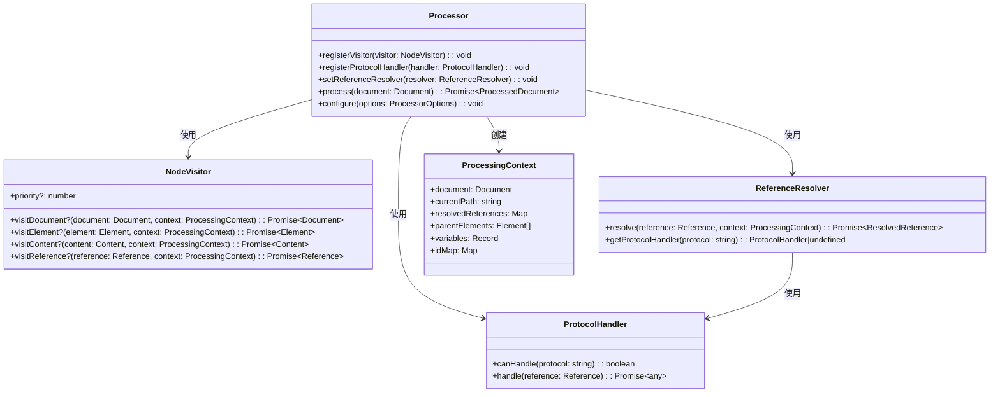
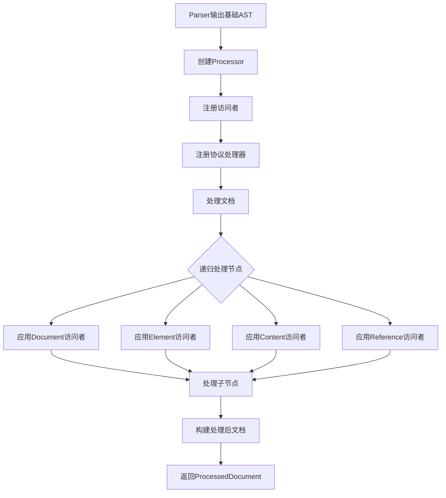

# @dpml/core Processor模块设计

## 1. 模块定位与职责

Processor模块在DPML处理流程中位于Parser之后、Transformer之前，作为核心处理层，承担以下主要职责：

- 接收Parser生成的基础AST，生成语义完整的增强AST
- 实现标签继承机制(`extends`属性)的处理
- 识别和解析@引用系统
- 处理标签属性和内容
- 管理协议处理器和资源加载
- 提供扩展点以支持多样化的处理需求


## 2. 访问者模式架构

Processor模块采用**访问者模式**(Visitor Pattern)作为核心架构，实现算法与数据结构分离，便于扩展和复用。

### 2.1 核心接口

```typescript
// 节点访问者接口
interface NodeVisitor {
  // 各类节点的访问方法
  visitDocument?(document: Document, context: ProcessingContext): Promise<Document>;
  visitElement?(element: Element, context: ProcessingContext): Promise<Element>;
  visitContent?(content: Content, context: ProcessingContext): Promise<Content>;
  visitReference?(reference: Reference, context: ProcessingContext): Promise<Reference>;
  
  // 访问者优先级，数值越大优先级越高
  priority?: number;
}

// 处理器接口
interface Processor {
  // 注册扩展点
  registerVisitor(visitor: NodeVisitor): void;
  registerProtocolHandler(handler: ProtocolHandler): void;
  setReferenceResolver(resolver: ReferenceResolver): void;
  
  // 处理方法
  process(document: Document): Promise<ProcessedDocument>;
  
  // 配置选项
  configure(options: ProcessorOptions): void;
}

// 协议处理器接口
interface ProtocolHandler {
  canHandle(protocol: string): boolean;
  handle(reference: Reference): Promise<any>;
}

// 引用解析器接口
interface ReferenceResolver {
  resolve(reference: Reference, context: ProcessingContext): Promise<ResolvedReference>;
  getProtocolHandler(protocol: string): ProtocolHandler | undefined;
}

// 处理上下文
interface ProcessingContext {
  document: Document;                     // 当前处理的文档
  currentPath: string;                    // 当前文档路径
  resolvedReferences: Map<string, any>;   // 已解析的引用缓存
  parentElements: Element[];              // 祖先元素栈
  variables: Record<string, any>;         // 上下文变量
  idMap?: Map<string, Element>;           // ID到元素的映射
}
```

### 2.2 架构组成



### 2.3 处理流程



## 3. 核心访问者类型

Processor架构支持多种类型的访问者，每种类型负责特定的处理任务：

| 访问者类型 | 优先级 | 主要职责 |
|---------|------|--------|
| 继承处理访问者 | 100 | 处理标签继承(extends属性)，加载和合并基础标签 |
| ID验证访问者 | 90 | 收集和验证ID唯一性，构建ID映射表 |
| 引用处理访问者 | 80 | 解析和处理@引用，加载引用资源 |
| 内容处理访问者 | 70 | 处理Markdown等内容格式 |
| 特定领域访问者 | 50-60 | 处理特定领域或标签的逻辑 |
| 转换准备访问者 | 10-40 | 为后续转换做准备工作 |

访问者按优先级排序，优先级高的先执行。各访问者保持单一职责，通过组合实现复杂功能。

## 4. 扩展机制

Processor模块提供三个主要扩展点：

### 4.1 通过访问者扩展(NodeVisitor)

访问者是最主要的扩展机制，能够处理不同类型的节点。实现NodeVisitor接口并注册到Processor即可添加新功能。

```typescript
// 访问者注册
processor.registerVisitor(new CustomVisitor());
```

自定义访问者可以：
- 处理特定类型的标签
- 验证或修改属性和内容
- 收集或分析文档信息
- 添加特定领域的处理逻辑

### 4.2 通过协议处理器扩展(ProtocolHandler)

协议处理器用于扩展@引用系统支持的协议，实现ProtocolHandler接口并注册到Processor即可支持新的引用协议。

```typescript
// 协议处理器注册
processor.registerProtocolHandler(new CustomProtocolHandler());
```

自定义协议处理器可以：
- 支持新的引用协议(`@custom://...`)
- 连接外部数据源或API
- 处理特定格式的资源

### 4.3 通过引用解析器扩展(ReferenceResolver)

引用解析器用于定制引用解析的整体策略，替换默认的引用解析器可以自定义整个引用解析流程。

```typescript
// 引用解析器设置
processor.setReferenceResolver(new CustomReferenceResolver());
```

自定义引用解析器可以：
- 实现特殊的引用语法
- 添加引用转换功能
- 自定义缓存策略
- 实现安全控制或访问限制

## 5. 基本使用模式

```typescript
// 创建处理器
const processor = createProcessor({
  tagRegistry,
  errorHandler
});

// 注册核心访问者
processor.registerVisitor(createInheritanceVisitor());
processor.registerVisitor(createIdValidationVisitor());
processor.registerVisitor(createReferenceVisitor());

// 注册扩展
processor.registerVisitor(createCustomVisitor());
processor.registerProtocolHandler(createCustomProtocolHandler());

// 处理文档
const basicDocument = await parser.parse(dpmlText);
const processedDocument = await processor.process(basicDocument);
```

## 6. 最佳实践

### 6.1 访问者设计原则

- **单一职责**：每个访问者只负责一种功能，避免过于复杂
- **优先级管理**：合理设置优先级，确保处理顺序正确
- **无状态设计**：访问者应尽量无状态，通过Context传递信息
- **异常处理**：妥善处理可能的异常，不影响其他访问者

### 6.2 扩展开发指南

- 开发新访问者时，先确认是否可以通过组合现有访问者实现
- 协议处理器应处理好资源加载失败的情况
- 引用解析器扩展应保持与基础引用系统的兼容性
- 为自定义组件提供详细文档和测试用例

### 6.3 性能优化建议

- 合理使用缓存，尤其是引用解析结果
- 避免在高频调用路径上进行重复计算
- 大文档处理考虑增量或懒加载策略
- 协议处理器应实现适当的超时机制

## 7. 总结

Processor模块采用访问者模式架构，提供了强大而灵活的DPML文档处理能力，同时保持了良好的扩展性和可维护性。通过三个主要扩展点（访问者、协议处理器和引用解析器），可以满足各种领域特定的处理需求，而不需要修改核心代码。

访问者模式的优势在于：

1. **关注点分离**：各访问者专注于特定功能，如继承处理、引用解析等
2. **易于扩展**：添加新功能只需实现相应的访问者
3. **处理顺序控制**：通过优先级机制控制访问者执行顺序
4. **类型安全**：TypeScript提供强类型保障

Processor模块是DPML处理流程中的关键环节，通过将Parser生成的基础AST转换为语义完整的增强AST，为后续的Transformer模块提供了坚实基础。 