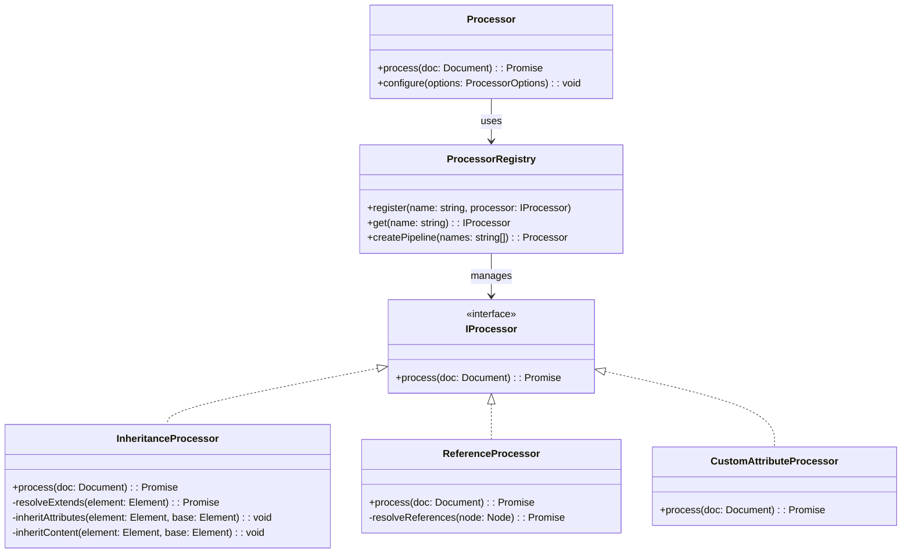
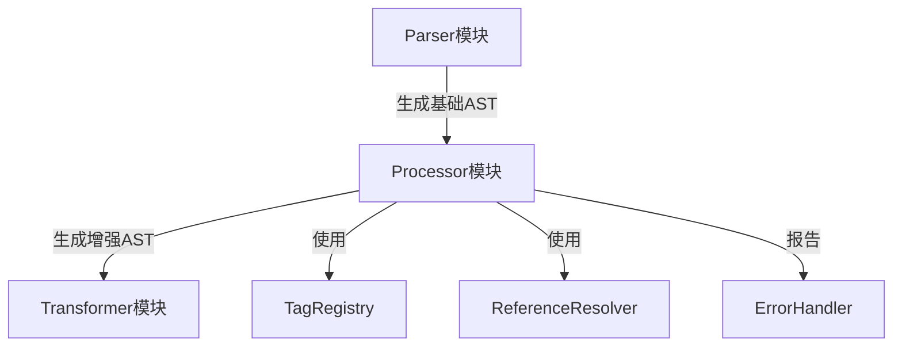
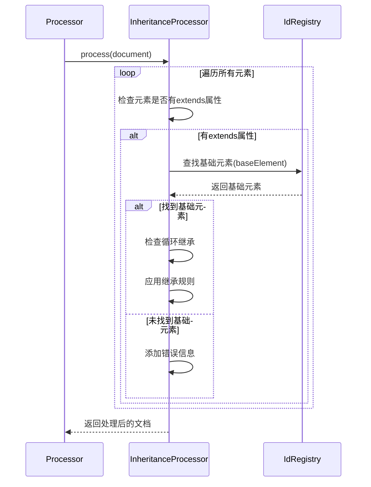
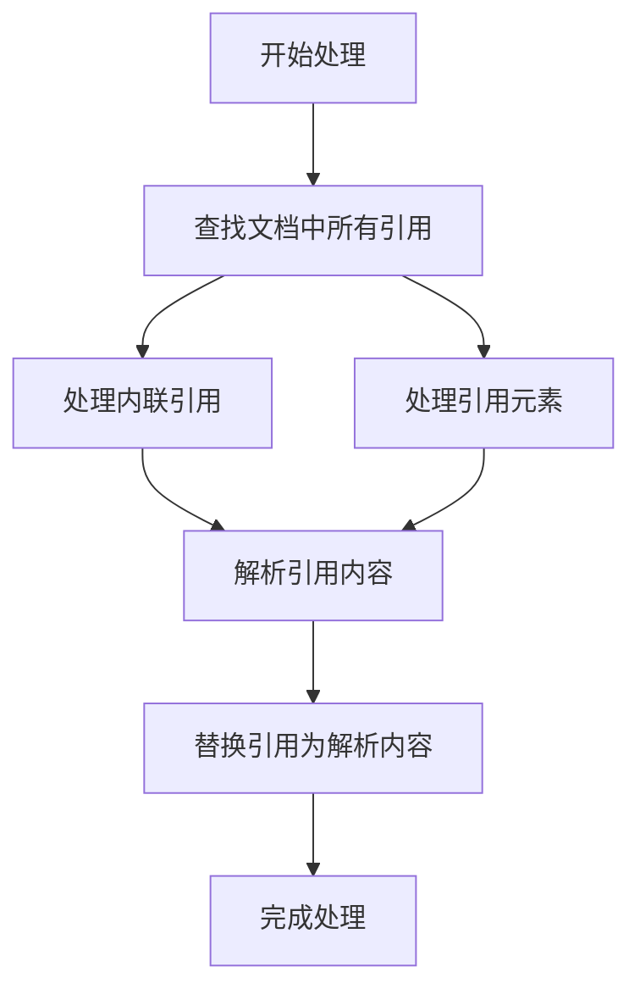

# DPML Processor 模块设计文档

## 1. 设计目标与原则

### 1.1 核心目标

Processor模块作为DPML处理流程的第二阶段，位于Parser和Transformer之间，主要目标是：

1. **增强AST**：对Parser生成的基础AST进行功能增强和处理
2. **解析引用**：处理文档中的各种引用（如@引用）
3. **应用标签处理**：根据标签定义应用特定的处理逻辑
4. **实现继承机制**：处理元素之间的继承关系（extends特性）
5. **统一错误处理**：提供一致的错误和警告处理

### 1.2 设计原则

1. **输入不变原则**：不修改输入的AST，而是创建新的处理后AST
2. **可配置性**：支持灵活的处理选项配置
3. **扩展友好**：提供清晰的扩展点支持自定义处理器
4. **异步处理**：支持异步操作，特别是引用解析
5. **独立可测**：每个处理器功能可以独立测试

### 1.3 解决的问题

1. 将标签继承(extends)逻辑从Parser中分离，降低Parser复杂度
2. 提供统一的引用处理机制
3. 实现不同处理器的组合和链式调用
4. 为后续转换器提供更丰富的文档结构

## 2. 系统架构

### 2.1 整体架构



### 2.2 模块组件

- **Processor**: 主处理器类，协调不同处理器的执行
- **IProcessor**: 处理器接口，定义所有处理器的统一接口
- **ProcessorRegistry**: 处理器注册表，管理所有处理器
- **InheritanceProcessor**: 处理标签继承关系
- **ReferenceProcessor**: 处理引用解析
- **CustomAttributeProcessor**: 处理自定义属性

### 2.3 与其他模块的关系



- 接收Parser生成的AST
- 输出增强后的AST给Transformer
- 使用TagRegistry获取标签定义
- 使用ReferenceResolver解析引用
- 使用ErrorHandler报告错误和警告

## 3. 核心功能

### 3.1 继承处理器 (InheritanceProcessor)

标签继承是DPML的核心特性之一，允许元素通过extends属性继承另一个元素的属性和内容。

#### 3.1.1 继承规则

- **属性继承**：子元素继承父元素的所有属性，除非子元素覆盖
- **内容继承**：
  - 如果子元素内容为空，则继承父元素的全部内容
  - 如果子元素内容不为空，则保留子元素内容

#### 3.1.2 继承处理流程



#### 3.1.3 核心方法

```typescript
// 处理文档中的所有继承关系
async process(doc: Document): Promise<Document>;

// 解析元素的extends属性并找到基础元素
private async resolveExtends(element: Element, idRegistry: Map<string, Element>): Promise<Element | null>;

// 处理元素的继承关系
private async processInheritance(element: Element, idRegistry: Map<string, Element>): Promise<void>;

// 从基础元素继承属性
private inheritAttributes(element: Element, baseElement: Element): void;

// 从基础元素继承内容
private inheritContent(element: Element, baseElement: Element): void;

// 检查是否存在循环继承
private checkCircularInheritance(element: Element, baseElement: Element, visited: Set<string>): boolean;
```

### 3.2 引用处理器 (ReferenceProcessor)

负责解析文档中的引用，包括内联引用和块级引用。

#### 3.2.1 引用类型

- **内联引用**：在文本内容中的@引用
- **引用元素**：作为独立元素的引用，如`<ref src="..." />`

#### 3.2.2 引用处理流程



### 3.3 处理器注册与管理

ProcessorRegistry管理所有处理器的注册和获取，支持创建处理器管道(pipeline)。

```typescript
// 处理器接口
interface IProcessor {
  process(doc: Document): Promise<Document>;
  priority?: number; // 处理优先级
}

// 处理器注册表
class ProcessorRegistry {
  // 注册处理器
  register(name: string, processor: IProcessor): void;
  
  // 获取处理器
  get(name: string): IProcessor | null;
  
  // 创建处理器管道
  createPipeline(processorNames?: string[]): Processor;
}
```

## 4. 配置选项

Processor模块支持多种配置选项来控制处理行为：

```typescript
interface ProcessorOptions {
  // 是否处理继承关系
  processInheritance?: boolean;
  
  // 是否解析引用
  resolveReferences?: boolean;
  
  // 处理器执行顺序
  processors?: string[];
  
  // 引用解析选项
  referenceOptions?: {
    timeout?: number;
    cache?: boolean;
    maxDepth?: number;
  };
  
  // 自定义属性处理选项
  attributeOptions?: {
    strict?: boolean;
    allowUnknown?: boolean;
  };
}
```

## 5. 接口定义

### 5.1 核心接口

```typescript
// 主处理器接口
export interface Processor {
  // 处理文档
  process(doc: Document): Promise<ProcessedDocument>;
  
  // 配置处理器
  configure(options: ProcessorOptions): void;
}

// 处理后的文档，包含额外元数据
export interface ProcessedDocument extends Document {
  meta: {
    // 引用映射，记录所有解析过的引用
    references?: Map<string, ResolvedReference>;
    
    // ID映射，记录所有元素ID
    idMap?: Map<string, Element>;
    
    // 文档级别元数据
    documentInfo?: {
      version?: string;
      lang?: string;
      mode?: string;
    };
    
    // 处理警告
    warnings?: ProcessingWarning[];
  };
}

// 处理警告
export interface ProcessingWarning {
  code: string;
  message: string;
  position?: SourcePosition;
  severity?: 'info' | 'warning' | 'error';
}
```

### 5.2 处理器接口

```typescript
// 处理器接口
export interface IProcessor {
  // 处理文档
  process(doc: Document): Promise<Document>;
  
  // 处理优先级，数字越小优先级越高
  priority?: number;
  
  // 处理器名称
  name?: string;
}

// 继承处理器接口
export interface InheritanceProcessor extends IProcessor {
  // 设置ID注册表
  setIdRegistry(registry: Map<string, Element>): void;
}

// 引用处理器接口
export interface ReferenceProcessor extends IProcessor {
  // 设置引用解析器
  setReferenceResolver(resolver: ReferenceResolver): void;
}
```

## 6. 实现细节

### 6.1 继承处理器实现

继承处理器需要实现复杂的继承逻辑，包括：

```typescript
class InheritanceProcessor implements IProcessor {
  private idRegistry: Map<string, Element> = new Map();
  private processedElements: Set<Element> = new Set();
  
  // 设置ID注册表
  setIdRegistry(registry: Map<string, Element>): void {
    this.idRegistry = registry;
  }
  
  // 主处理方法
  async process(doc: Document): Promise<Document> {
    // 创建文档副本
    const newDoc = this.cloneDocument(doc);
    
    // 首先扫描并构建ID注册表（如果尚未设置）
    if (this.idRegistry.size === 0) {
      this.buildIdRegistry(newDoc);
    }
    
    // 处理所有元素的继承关系
    await this.processDocumentInheritance(newDoc);
    
    return newDoc;
  }
  
  // 构建ID注册表
  private buildIdRegistry(doc: Document): void {
    // 实现扫描文档并为所有带ID的元素建立映射
  }
  
  // 处理文档中所有元素的继承
  private async processDocumentInheritance(doc: Document): Promise<void> {
    // 实现深度优先遍历并处理继承
  }
  
  // 解析extends引用
  private resolveExtends(element: Element): Element | null {
    const extendsId = element.attributes?.extends;
    if (!extendsId || typeof extendsId !== 'string') {
      return null;
    }
    
    return this.idRegistry.get(extendsId) || null;
  }
  
  // 处理元素继承
  private async processInheritance(element: Element): Promise<void> {
    // 如果元素已处理或没有extends属性，则跳过
    if (this.processedElements.has(element) || !element.attributes?.extends) {
      return;
    }
    
    const baseElement = this.resolveExtends(element);
    if (!baseElement) {
      // 添加找不到基础元素的警告
      return;
    }
    
    // 检查循环继承
    if (this.hasCircularInheritance(element, baseElement)) {
      // 添加循环继承的错误
      return;
    }
    
    // 递归处理基础元素的继承
    await this.processInheritance(baseElement);
    
    // 应用继承规则
    this.inheritAttributes(element, baseElement);
    this.inheritContent(element, baseElement);
    
    // 标记为已处理
    this.processedElements.add(element);
  }
  
  // 属性继承实现
  private inheritAttributes(element: Element, baseElement: Element): void {
    // 实现属性继承逻辑
  }
  
  // 内容继承实现
  private inheritContent(element: Element, baseElement: Element): void {
    // 实现内容继承逻辑
  }
  
  // 检查循环继承
  private hasCircularInheritance(element: Element, baseElement: Element): boolean {
    // 实现循环继承检测
  }
  
  // 创建文档副本
  private cloneDocument(doc: Document): Document {
    // 实现深拷贝文档
  }
}
```

### 6.2 处理器管道实现

处理器管道协调多个处理器按顺序处理文档：

```typescript
class ProcessorPipeline implements Processor {
  private processors: IProcessor[] = [];
  
  constructor(processors: IProcessor[]) {
    // 按优先级排序处理器
    this.processors = [...processors].sort((a, b) => 
      (a.priority || 100) - (b.priority || 100)
    );
  }
  
  async process(doc: Document): Promise<ProcessedDocument> {
    let currentDoc = doc;
    
    // 按顺序执行所有处理器
    for (const processor of this.processors) {
      currentDoc = await processor.process(currentDoc);
    }
    
    // 转换为ProcessedDocument格式
    return this.createProcessedDocument(currentDoc);
  }
  
  private createProcessedDocument(doc: Document): ProcessedDocument {
    // 添加元数据并返回
    return {
      ...doc,
      meta: {
        // 初始化元数据
      }
    };
  }
}
```

## 7. 测试策略

Processor模块的测试策略包括：

1. **单元测试**：测试每个处理器的独立功能
2. **集成测试**：测试处理器管道和协作
3. **功能测试**：测试特定场景如继承、引用等

测试用例应包括：

- 基本继承场景
- 多级继承场景
- 继承错误处理
- 循环继承检测
- 引用解析成功与失败
- 各种配置选项的效果

## 8. 优化与性能

为确保Processor模块高效运行：

1. **缓存机制**：缓存已处理的元素和解析的引用
2. **增量处理**：支持仅处理文档的更改部分
3. **延迟加载**：按需加载处理器
4. **并行处理**：适用场景下并行解析引用

## 9. 错误处理

Processor模块采用分级错误处理策略：

1. **致命错误**：阻止处理继续，如循环继承
2. **警告**：记录问题但继续处理，如找不到引用的元素
3. **信息**：记录处理信息

错误和警告将附加到ProcessedDocument的meta中，供下游模块和用户界面使用。

---

本文档定义了DPML Processor模块的设计规范。实现应遵循此设计，同时保持对未来需求的灵活性。 