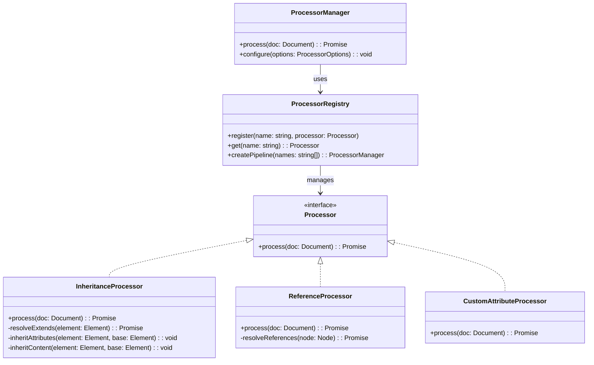
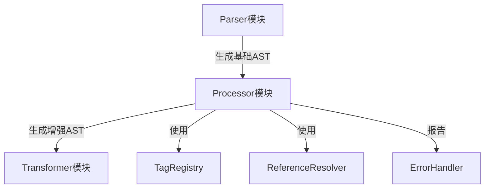
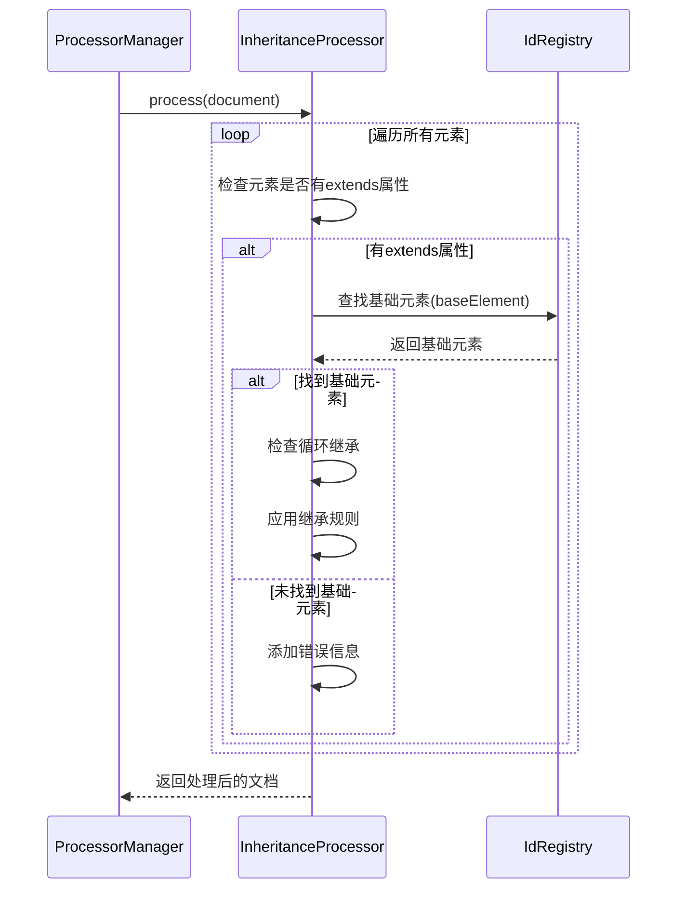

# DPML Processor 模块设计文档

## 1. 设计目标与原则

### 1.1 核心目标

Processor模块作为DPML处理流程的第二阶段，位于Parser和Transformer之间，主要目标是：

1. **增强AST**：对Parser生成的基础AST进行功能增强和处理
2. **解析引用**：处理文档中的各种引用（如@引用）
3. **应用标签处理**：根据标签定义应用特定的处理逻辑
4. **实现继承机制**：处理元素之间的继承关系（extends特性）
5. **统一错误处理**：提供一致的错误和警告处理

### 1.2 设计原则

1. **输入不变原则**：不修改输入的AST，而是创建新的处理后AST
2. **可配置性**：支持灵活的处理选项配置
3. **扩展友好**：提供清晰的扩展点支持自定义处理器
4. **异步处理**：支持异步操作，特别是引用解析
5. **独立可测**：每个处理器功能可以独立测试

### 1.3 解决的问题

1. 将标签继承(extends)逻辑从Parser中分离，降低Parser复杂度
2. 提供统一的引用处理机制
3. 实现不同处理器的组合和链式调用
4. 为后续转换器提供更丰富的文档结构

## 2. 系统架构

### 2.1 整体架构



### 2.2 模块组件

- **ProcessorManager**: 主处理器管理类，协调不同处理器的执行
- **Processor**: 处理器接口，定义所有处理器的统一接口
- **ProcessorRegistry**: 处理器注册表，管理所有处理器
- **InheritanceProcessor**: 处理标签继承关系
- **ReferenceProcessor**: 处理引用解析
- **CustomAttributeProcessor**: 处理自定义属性

### 2.3 与其他模块的关系



- 接收Parser生成的AST
- 输出增强后的AST给Transformer
- 使用TagRegistry获取标签定义
- 使用ReferenceResolver解析引用
- 使用ErrorHandler报告错误和警告

## 3. 核心功能

### 3.1 继承处理器 (InheritanceProcessor)

标签继承是DPML的核心特性之一，允许元素通过extends属性继承另一个元素的属性和内容。

#### 3.1.1 继承规则

- **属性继承**：子元素继承父元素的所有属性，除非子元素覆盖
- **内容继承**：
  - 如果子元素内容为空，则继承父元素的全部内容
  - 如果子元素内容不为空，则保留子元素内容

#### 3.1.2 继承处理流程



#### 3.1.3 核心方法

```typescript
// 处理文档中的所有继承关系
async process(doc: Document): Promise<Document>;

// 解析元素的extends属性并找到基础元素
private async resolveExtends(element: Element, idRegistry: Map<string, Element>): Promise<Element | null>;

// 处理元素的继承关系
private async processInheritance(element: Element, idRegistry: Map<string, Element>): Promise<void>;

// 从基础元素继承属性
private inheritAttributes(element: Element, baseElement: Element): void;

// 从基础元素继承内容
private inheritContent(element: Element, baseElement: Element): void;

// 检查是否存在循环继承
private checkCircularInheritance(element: Element, baseElement: Element, visited: Set<string>): boolean;
```

### 3.2 引用处理器 (ReferenceProcessor)

负责解析文档中的引用，包括内联引用和块级引用。

#### 3.2.1 引用类型

- **内联引用**：在文本内容中的@引用，如`@resource-id`或`@http://example.com/document.pdf`

#### 3.2.2 引用处理流程

```mermaid
flowchart TD
    Start[开始处理] --> FindRefs[查找文档中的@符号引用]
    FindRefs --> ResolveRefs[解析引用内容]
    ResolveRefs --> Replace[替换引用为解析内容]
    Replace --> End[完成处理]
```

### 3.3 处理器注册与管理

ProcessorRegistry管理所有处理器的注册和获取，支持创建处理器管道(pipeline)。

```typescript
// 处理器接口
interface Processor {
  process(doc: Document): Promise<Document>;
  priority?: number; // 处理优先级
}

// 处理器注册表
class ProcessorRegistry {
  // 注册处理器
  register(name: string, processor: Processor): void;
  
  // 获取处理器
  get(name: string): Processor | null;
  
  // 创建处理器管道
  createPipeline(processorNames?: string[]): ProcessorManager;
}
```

## 4. 配置选项

Processor模块支持多种配置选项来控制处理行为：

```typescript
interface ProcessorOptions {
  // 是否处理继承关系
  processInheritance?: boolean;
  
  // 是否解析引用
  resolveReferences?: boolean;
  
  // 处理器执行顺序
  processors?: string[];
  
  // 引用解析选项
  referenceOptions?: {
    timeout?: number;
    cache?: boolean;
    maxDepth?: number;
  };
  
  // 自定义属性处理选项
  attributeOptions?: {
    strict?: boolean;
    allowUnknown?: boolean;
  };
}
```

## 5. 接口定义

### 5.1 核心接口

```typescript
// 主处理器管理接口
export interface ProcessorManager {
  // 处理文档
  process(doc: Document): Promise<ProcessedDocument>;
  
  // 配置处理器
  configure(options: ProcessorOptions): void;
}

// 处理后的文档，包含额外元数据
export interface ProcessedDocument extends Document {
  meta: {
    // 引用映射，记录所有解析过的引用
    references?: Map<string, ResolvedReference>;
    
    // ID映射，记录所有元素ID
    idMap?: Map<string, Element>;
    
    // 文档级别元数据
    documentInfo?: {
      version?: string;
      lang?: string;
      mode?: string;
    };
    
    // 处理警告
    warnings?: ProcessingWarning[];
  };
}

// 处理警告
export interface ProcessingWarning {
  code: string;
  message: string;
  position?: SourcePosition;
  severity?: 'info' | 'warning' | 'error';
}
```

### 5.2 处理器接口

```typescript
// 处理器接口
export interface Processor {
  // 处理文档
  process(doc: Document): Promise<Document>;
  
  // 处理优先级，数字越小优先级越高
  priority?: number;
  
  // 处理器名称
  name?: string;
}

// 继承处理器接口
export interface InheritanceProcessor extends Processor {
  // 设置ID注册表
  setIdRegistry(registry: Map<string, Element>): void;
}

// 引用处理器接口
export interface ReferenceProcessor extends Processor {
  // 设置引用解析器
  setReferenceResolver(resolver: ReferenceResolver): void;
}
```

## 6. 扩展机制

Processor模块设计为高度可扩展的架构，提供多个清晰的扩展点，允许开发者在不修改核心代码的情况下扩展文档处理功能。

### 6.1 主要扩展点

#### 6.1.1 自定义处理器

最主要的扩展点是创建自定义处理器：

```typescript
// 创建自定义处理器
class MyCustomProcessor implements Processor {
  // 可选：设置优先级（数字越小优先级越高）
  priority = 50;
  
  // 可选：设置名称
  name = 'my-custom-processor';
  
  // 必须：实现process方法
  async process(doc: Document): Promise<Document> {
    // 对文档进行任何所需的处理
    const newDoc = structuredClone(doc);
    
    // 例如：处理特定的标签
    this.processSpecialTags(newDoc);
    
    return newDoc;
  }
  
  private processSpecialTags(doc: Document): void {
    // 实现具体处理逻辑
  }
}

// 注册自定义处理器
processorRegistry.register('my-custom-processor', new MyCustomProcessor());
```

#### 6.1.2 处理器流水线定制

可以定制处理器的执行顺序和组合：

```typescript
// 创建自定义处理器流水线
const customProcessorManager = processorRegistry.createPipeline([
  'inheritance-processor',
  'my-custom-processor',
  'reference-processor'
]);

// 或者使用配置选项定制处理器执行
const defaultProcessorManager = processorRegistry.createPipeline();
defaultProcessorManager.configure({
  processors: ['inheritance-processor', 'my-custom-processor', 'reference-processor']
});
```

#### 6.1.3 处理选项扩展

扩展处理选项接口以添加自定义配置：

```typescript
// 扩展处理选项
interface MyCustomProcessorOptions {
  specialMode?: boolean;
  maxProcessingDepth?: number;
}

// 扩展ProcessorOptions
interface ExtendedProcessorOptions extends ProcessorOptions {
  myCustomOptions?: MyCustomProcessorOptions;
}

// 在处理器中使用扩展选项
class MyCustomProcessor implements Processor {
  private options: MyCustomProcessorOptions = {
    specialMode: false,
    maxProcessingDepth: 10
  };
  
  configure(options: ExtendedProcessorOptions): void {
    if (options.myCustomOptions) {
      this.options = {...this.options, ...options.myCustomOptions};
    }
  }
  
  // 处理方法中使用这些选项
  async process(doc: Document): Promise<Document> {
    // 根据配置选项调整处理逻辑
    if (this.options.specialMode) {
      // 特殊模式处理...
    }
    // ...
  }
}
```

#### 6.1.4 元数据扩展

扩展处理后文档的元数据：

```typescript
// 扩展元数据接口
interface MyCustomMeta {
  customData: Record<string, any>;
  processTimestamp: number;
}

// 扩展ProcessedDocument
interface ExtendedProcessedDocument extends ProcessedDocument {
  meta: ProcessedDocument['meta'] & {
    myCustomMeta?: MyCustomMeta;
  };
}

// 在处理器中添加自定义元数据
class ProcessorManagerWithCustomMeta extends ProcessorManagerImpl {
  async process(doc: Document): Promise<ExtendedProcessedDocument> {
    const processedDoc = await super.process(doc) as ExtendedProcessedDocument;
    
    // 添加自定义元数据
    processedDoc.meta.myCustomMeta = {
      customData: { /* ... */ },
      processTimestamp: Date.now()
    };
    
    return processedDoc;
  }
}
```

### 6.2 扩展示例

以下是一些典型的扩展场景：

#### 6.2.1 多语言处理器

```typescript
// 创建多语言处理器
class I18nProcessor implements Processor {
  priority = 40; // 在继承处理器之后运行
  
  async process(doc: Document): Promise<Document> {
    const newDoc = structuredClone(doc);
    
    // 处理i18n标签和属性
    this.processI18nElements(newDoc);
    
    return newDoc;
  }
  
  private processI18nElements(doc: Document): void {
    // 替换i18n标签和处理文本替换
  }
}
```

#### 6.2.2 条件处理器

```typescript
// 条件渲染处理器
class ConditionalProcessor implements Processor {
  priority = 30;
  
  async process(doc: Document): Promise<Document> {
    const newDoc = structuredClone(doc);
    
    // 处理条件属性，如if/else
    this.evaluateConditions(newDoc);
    
    return newDoc;
  }
  
  private evaluateConditions(doc: Document): void {
    // 评估条件表达式并移除不满足条件的元素
  }
}
```

### 6.3 注册和使用扩展处理器

所有扩展处理器需要通过ProcessorRegistry注册后才能使用：

```typescript
// 获取处理器注册表
const processorRegistry = new ProcessorRegistry();

// 注册内置处理器
processorRegistry.register('inheritance', new InheritanceProcessor());
processorRegistry.register('reference', new ReferenceProcessor());

// 注册自定义处理器
processorRegistry.register('i18n', new I18nProcessor());
processorRegistry.register('conditional', new ConditionalProcessor());

// 创建包含所有处理器的管道
const processorManager = processorRegistry.createPipeline();

// 或创建自定义处理器子集
const lightweightManager = processorRegistry.createPipeline(['inheritance', 'conditional']);
```

## 7. 实现细节

### 7.1 继承处理器实现

继承处理器需要实现复杂的继承逻辑，包括：

```typescript
class InheritanceProcessor implements Processor {
  private idRegistry: Map<string, Element> = new Map();
  private processedElements: Set<Element> = new Set();
  private referenceResolver: ReferenceResolver;
  
  // 设置ID注册表
  setIdRegistry(registry: Map<string, Element>): void {
    this.idRegistry = registry;
  }
  
  // 设置引用解析器（用于解析跨文件继承）
  setReferenceResolver(resolver: ReferenceResolver): void {
    this.referenceResolver = resolver;
  }
  
  // 主处理方法
  async process(doc: Document): Promise<Document> {
    // 创建文档副本
    const newDoc = this.cloneDocument(doc);
    
    // 首先扫描并构建ID注册表（如果尚未设置）
    if (this.idRegistry.size === 0) {
      this.buildIdRegistry(newDoc);
    }
    
    // 处理所有元素的继承关系
    await this.processDocumentInheritance(newDoc);
    
    return newDoc;
  }
  
  // 构建ID注册表
  private buildIdRegistry(doc: Document): void {
    // 实现扫描文档并为所有带ID的元素建立映射
    this.traverseDocument(doc, (element) => {
      if (element.attributes?.id && typeof element.attributes.id === 'string') {
        this.idRegistry.set(element.attributes.id, element);
      }
    });
  }
  
  // 递归遍历文档
  private traverseDocument(node: Node, callback: (element: Element) => void): void {
    if (node.type === 'element') {
      callback(node as Element);
      
      // 递归处理子节点
      (node as Element).children?.forEach(child => {
        this.traverseDocument(child, callback);
      });
    }
  }
  
  // 处理文档中所有元素的继承
  private async processDocumentInheritance(doc: Document): Promise<void> {
    // 深度优先遍历处理继承
    await this.traverseDocumentAsync(doc, async (element) => {
      if (element.attributes?.extends) {
        await this.processInheritance(element);
      }
    });
  }
  
  // 异步递归遍历文档
  private async traverseDocumentAsync(node: Node, callback: (element: Element) => Promise<void>): Promise<void> {
    if (node.type === 'element') {
      await callback(node as Element);
      
      // 递归处理子节点
      if ((node as Element).children) {
        for (const child of (node as Element).children) {
          await this.traverseDocumentAsync(child, callback);
        }
      }
    }
  }
  
  // 解析extends引用 - 支持多种引用方式
  private async resolveExtends(element: Element): Promise<Element | null> {
    const extendsValue = element.attributes?.extends;
    if (!extendsValue || typeof extendsValue !== 'string') {
      return null;
    }
    
    // 检查是否包含路径分隔符或URL协议，判断是否跨文件引用
    if (extendsValue.includes('/') || extendsValue.includes(':') || extendsValue.includes('#')) {
      // 处理跨文件引用
      return this.resolveExternalReference(extendsValue, element);
    } else {
      // 处理同文件ID引用
      const baseElement = this.idRegistry.get(extendsValue);
      if (!baseElement) {
        this.addWarning(element, 'REFERENCE_NOT_FOUND', 
          `找不到ID为"${extendsValue}"的元素`);
      }
      return baseElement || null;
    }
  }
  
  // 解析外部引用
  private async resolveExternalReference(reference: string, sourceElement: Element): Promise<Element | null> {
    try {
      // 解析引用以获取文件路径和ID
      const [filePath, id] = this.parseReference(reference);
      
      if (!this.referenceResolver) {
        this.addWarning(sourceElement, 'REFERENCE_RESOLVER_NOT_SET', 
          '未设置引用解析器，无法处理跨文件继承');
        return null;
      }
      
      // 通过ReferenceResolver加载外部文件
      const externalDoc = await this.referenceResolver.resolveDocument(filePath);
      if (!externalDoc) {
        this.addWarning(sourceElement, 'EXTERNAL_DOCUMENT_NOT_FOUND', 
          `无法加载外部文件: ${filePath}`);
        return null;
      }
      
      // 在外部文档中查找指定ID
      const externalElement = this.findElementById(externalDoc, id);
      if (!externalElement) {
        this.addWarning(sourceElement, 'EXTERNAL_ELEMENT_NOT_FOUND', 
          `在文件"${filePath}"中找不到ID为"${id}"的元素`);
      }
      
      return externalElement;
    } catch (error) {
      this.addError(sourceElement, 'EXTERNAL_REFERENCE_ERROR', 
        `处理外部引用时出错: ${error.message}`);
      return null;
    }
  }
  
  // 解析引用字符串，分离文件路径和ID
  private parseReference(reference: string): [string, string] {
    // 处理三种格式:
    // 1. path/to/file.dpml#id
    // 2. http://example.com/file.dpml#id
    // 3. #id (同文件不同ID)
    
    const hashIndex = reference.lastIndexOf('#');
    if (hashIndex === -1) {
      // 没有#，假设整个字符串是文件路径，ID为空
      return [reference, ''];
    } else if (hashIndex === 0) {
      // 以#开头，是同文件引用
      return ['', reference.substring(1)];
    } else {
      // 包含#，分离文件路径和ID
      return [
        reference.substring(0, hashIndex),
        reference.substring(hashIndex + 1)
      ];
    }
  }
  
  // 在文档中查找特定ID的元素
  private findElementById(doc: Document, id: string): Element | null {
    let found: Element | null = null;
    
    this.traverseDocument(doc, (element) => {
      if (element.attributes?.id === id) {
        found = element;
      }
    });
    
    return found;
  }
  
  // 处理元素继承
  private async processInheritance(element: Element): Promise<void> {
    // 如果元素已处理或没有extends属性，则跳过
    if (this.processedElements.has(element) || !element.attributes?.extends) {
      return;
    }
    
    const baseElement = await this.resolveExtends(element);
    if (!baseElement) {
      // 添加找不到基础元素的警告（已在resolveExtends中处理）
      return;
    }
    
    // 验证单层继承
    if (!this.validateSingleInheritance(element, baseElement)) {
      // 单层继承验证失败，但我们可以继续处理
      // 忽略基础元素的extends属性，只应用当前继承
    }
    
    // 验证类型匹配
    if (!this.validateTypeMatch(element, baseElement)) {
      // 类型不匹配时拒绝继承
      return;
    }
    
    // 检查循环继承
    if (this.hasCircularInheritance(element, baseElement)) {
      // 添加循环继承的错误
      this.addError(element, 'CIRCULAR_INHERITANCE', 
        '检测到循环继承，无法处理');
      return;
    }
    
    // 递归处理基础元素的继承（如果需要）
    if (baseElement.attributes?.extends && !this.processedElements.has(baseElement)) {
      await this.processInheritance(baseElement);
    }
    
    // 应用继承规则
    this.inheritAttributes(element, baseElement);
    this.inheritContent(element, baseElement);
    
    // 标记为已处理
    this.processedElements.add(element);
  }
  
  // 验证单层继承限制
  private validateSingleInheritance(element: Element, baseElement: Element): boolean {
    // 根据DPML规范5.1，标签只允许继承一次，不支持多层继承链
    if (baseElement.attributes?.extends) {
      // 基础元素也有extends属性，这违反了单层继承限制
      // 根据设计需求，我们可以选择:
      // 1. 拒绝继承
      // 2. 允许继承但发出警告
      // 3. 忽略基础元素的extends属性
      
      // 这里选择发出警告但继续处理
      this.addWarning(element, 'MULTI_LEVEL_INHERITANCE', 
        '不支持多层继承，将忽略基础元素的extends属性');
      return false;
    }
    return true;
  }
  
  // 验证类型匹配限制
  private validateTypeMatch(element: Element, baseElement: Element): boolean {
    // 根据DPML规范5.1，标签只能继承相同类型的标签
    if (element.tagName !== baseElement.tagName) {
      this.addWarning(element, 'TYPE_MISMATCH_INHERITANCE', 
        `类型不匹配: 尝试让 <${element.tagName}> 继承 <${baseElement.tagName}>`);
      return false;
    }
    return true;
  }
  
  // 属性继承实现
  private inheritAttributes(element: Element, baseElement: Element): void {
    // 根据DPML规范5.2，子优先原则
    // 当前标签的属性始终覆盖继承标签的同名属性
    
    // 如果当前元素没有attributes，创建一个
    if (!element.attributes) {
      element.attributes = {};
    }
    
    // 复制所有基础元素的属性，但不覆盖已存在的
    if (baseElement.attributes) {
      for (const [key, value] of Object.entries(baseElement.attributes)) {
        // 排除extends属性本身不被继承
        if (key === 'extends') {
          continue;
        }
        
        // 只有当当前元素没有该属性时才复制
        if (!(key in element.attributes)) {
          element.attributes[key] = structuredClone(value);
        }
      }
    }
  }
  
  // 内容继承实现
  private inheritContent(element: Element, baseElement: Element): void {
    // 根据DPML规范5.3，内容继承遵循简单的二元原则
    
    // 检查当前元素内容是否为空
    if (this.isEmptyContent(element)) {
      // 如果为空，则继承基础元素的全部内容
      if (baseElement.children && baseElement.children.length > 0) {
        element.children = structuredClone(baseElement.children);
      }
    }
    // 如果不为空，保留当前内容，不做任何操作
  }
  
  // 判断内容是否为空（只包含空白或注释）
  private isEmptyContent(element: Element): boolean {
    // 根据DPML规范5.3，空白内容和注释不视为有效内容
    
    // 没有子节点或子节点数组为空
    if (!element.children || element.children.length === 0) {
      return true;
    }
    
    // 只包含空白文本节点或注释
    return element.children.every(child => {
      if (child.type === 'content') {
        // 移除所有空白字符后检查是否为空
        return !child.value || child.value.trim() === '';
      }
      // 其他非内容节点（如element）视为非空
      return false;
    });
  }
  
  // 检查循环继承
  private hasCircularInheritance(element: Element, baseElement: Element): boolean {
    // 检测循环依赖，例如 A→B→A
    
    // 如果基础元素也有extends属性
    if (baseElement.attributes?.extends) {
      // 获取基础元素的extends属性值
      const baseExtendsId = baseElement.attributes.extends;
      
      // 如果无法获取或不是字符串类型，则无法判断
      if (typeof baseExtendsId !== 'string') {
        return false;
      }
      
      // 如果基础元素继承的是当前元素，则形成循环
      if (element.attributes?.id && baseExtendsId === element.attributes.id) {
        return true;
      }
      
      // 查找基础元素的基础元素，构建继承链
      const baseOfBase = this.idRegistry.get(baseExtendsId);
      if (baseOfBase) {
        // 递归检查与当前元素是否形成循环
        return this.checkCircularInheritanceChain(element, baseOfBase, new Set());
      }
    }
    
    return false;
  }
  
  // 深度检查循环继承
  private checkCircularInheritanceChain(original: Element, current: Element, visited: Set<Element>): boolean {
    // 如果已访问过该元素，跳过以防止无限递归
    if (visited.has(current)) {
      return false;
    }
    
    // 标记为已访问
    visited.add(current);
    
    // 如果current引用回original，形成循环
    if (current.attributes?.extends && typeof current.attributes.extends === 'string') {
      if (original.attributes?.id && current.attributes.extends === original.attributes.id) {
        return true;
      }
      
      // 继续在继承链上递归检查
      const nextBase = this.idRegistry.get(current.attributes.extends);
      if (nextBase) {
        return this.checkCircularInheritanceChain(original, nextBase, visited);
      }
    }
    
    return false;
  }
  
  // 添加警告
  private addWarning(element: Element, code: string, message: string): void {
    // 实际实现需要将警告添加到上下文或元数据中
    console.warn(`Warning [${code}]: ${message}`, element.position);
  }
  
  // 添加错误
  private addError(element: Element, code: string, message: string): void {
    // 实际实现需要将错误添加到上下文或元数据中
    console.error(`Error [${code}]: ${message}`, element.position);
  }
  
  // 创建文档副本
  private cloneDocument(doc: Document): Document {
    // 实现深拷贝文档
    return structuredClone(doc);
  }
}
```

上述实现中特别关注了DPML规范第5节中强调的继承机制关键点：

1. **单层继承限制**：通过`validateSingleInheritance`方法检查基础元素是否也有extends属性，符合规范5.1"标签只允许继承一次，不支持多层继承链"的要求。

2. **同类型继承限制**：通过`validateTypeMatch`方法确保元素只能继承相同类型的标签，实现规范5.1"标签只能继承相同类型的标签"的要求。

3. **路径支持**：通过`resolveExtends`和`resolveExternalReference`方法支持三种路径格式，包括相对路径、绝对路径和HTTP路径，符合规范5.1的路径支持要求。

4. **内容继承规则**：通过`isEmptyContent`和`inheritContent`方法实现规范5.3定义的内容继承二元原则：
   - 当前标签有内容时完全替换继承标签的内容
   - 当前标签无内容时完全继承基础标签的内容
   - 空白内容和注释不视为有效内容

5. **错误处理**：实现了规范5.4要求的继承机制错误处理，包括继承不存在、类型不匹配和循环继承检测。

### 7.2 处理器管道实现

处理器管道协调多个处理器按顺序处理文档：

```typescript
class ProcessorManagerImpl implements ProcessorManager {
  private processors: Processor[] = [];
  
  constructor(processors: Processor[]) {
    // 按优先级排序处理器
    this.processors = [...processors].sort((a, b) => 
      (a.priority || 100) - (b.priority || 100)
    );
  }
  
  async process(doc: Document): Promise<ProcessedDocument> {
    let currentDoc = doc;
    
    // 按顺序执行所有处理器
    for (const processor of this.processors) {
      currentDoc = await processor.process(currentDoc);
    }
    
    // 转换为ProcessedDocument格式
    return this.createProcessedDocument(currentDoc);
  }
  
  private createProcessedDocument(doc: Document): ProcessedDocument {
    // 添加元数据并返回
    return {
      ...doc,
      meta: {
        // 初始化元数据
      }
    };
  }
}
```

## 8. 测试策略

Processor模块的测试策略包括：

1. **单元测试**：测试每个处理器的独立功能
2. **集成测试**：测试处理器管道和协作
3. **功能测试**：测试特定场景如继承、引用等

测试用例应包括：

- 基本继承场景
- 多级继承场景
- 继承错误处理
- 循环继承检测
- 引用解析成功与失败
- 各种配置选项的效果

## 9. 优化与性能

为确保Processor模块高效运行：

1. **缓存机制**：缓存已处理的元素和解析的引用
2. **增量处理**：支持仅处理文档的更改部分
3. **延迟加载**：按需加载处理器
4. **并行处理**：适用场景下并行解析引用

## 10. 错误处理

Processor模块采用分级错误处理策略：

1. **致命错误**：阻止处理继续，如循环继承
2. **警告**：记录问题但继续处理，如找不到引用的元素
3. **信息**：记录处理信息

错误和警告将附加到ProcessedDocument的meta中，供下游模块和用户界面使用。

---

本文档定义了DPML Processor模块的设计规范。实现应遵循此设计，同时保持对未来需求的灵活性。 