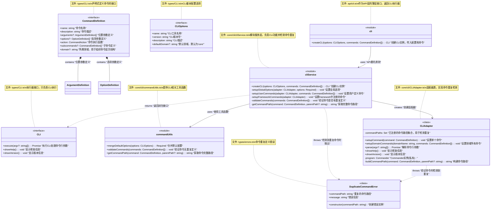
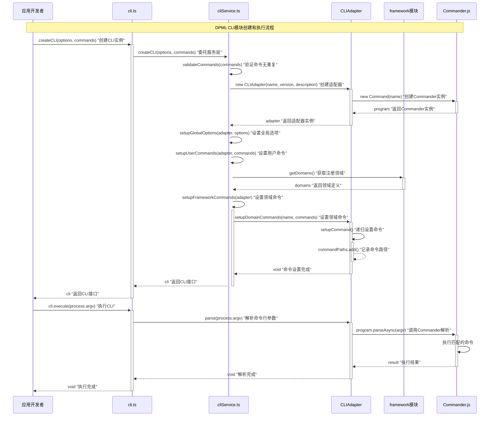

# DPML CLI设计文档

## 1. 概述

CLI模块是DPML核心的命令行接口，负责提供一致、直观的命令行工具，使用户能够通过终端访问DPML的各项功能。它将Framework和其他核心功能封装为结构化的命令集，同时提供声明式API用于定义和组织命令。

### 1.1 设计目标

- **统一接口**：提供一致的命令行界面，作为DPML功能的统一入口
- **声明式定义**：支持通过声明式API定义命令及其结构
- **领域整合**：无缝整合Framework中注册的领域命令
- **可扩展性**：支持扩展新的命令和领域
- **类型安全**：提供完全类型化的API和配置

## 2. 核心设计理念

基于项目需求和架构规范，我们确立了以下核心设计理念：

1. **闭包状态管理**：
   - 使用闭包模式封装CLI状态和配置
   - 通过闭包函数提供对内部功能的受控访问
   - 避免暴露内部实现细节

2. **声明式命令定义**：
   - 使用类型安全的声明式API定义命令结构
   - 支持命令参数、选项和子命令的嵌套定义
   - 提供清晰的命令描述和帮助信息

3. **命令冲突检测**：
   - 自动检测命令路径重复定义
   - 在设置阶段而非运行时发现冲突
   - 提供明确的错误信息帮助定位问题

4. **领域命令集成**：
   - 自动从Framework获取已注册领域
   - 将领域配置转换为相应的命令结构
   - 维持领域和命令的一致性

5. **完全封装外部依赖**：
   - 完全封装Commander.js，不暴露外部库实例
   - 提供一致的API而不依赖外部库细节
   - 确保未来可以更换底层实现而不影响外部接口

## 3. 系统架构

CLI模块严格遵循项目的分层架构：

1. **API层**：cli模块，提供createCLI函数
2. **Types层**：定义CLI接口、CommandDefinition和相关类型
3. **Core层**：实现cliService，管理命令注册和执行

## 4. 组件设计

### 4.1 API设计

```typescript
// api/cli.ts
export function createCLI(
  options: CLIOptions, 
  commands: CommandDefinition[]
): CLI {
  return cliService.createCLI(options, commands);
}
```

### 4.2 类型定义

```typescript
// types/CLI.ts
export interface CLI {
  /**
   * 执行CLI处理命令行参数
   * @param argv 命令行参数数组，默认使用process.argv
   */
  execute(argv?: string[]): Promise<void>;
  
  /**
   * 显示帮助信息
   */
  showHelp(): void;
  
  /**
   * 显示版本信息
   */
  showVersion(): void;
}

// types/CLIOptions.ts
export interface CLIOptions {
  /**
   * CLI工具名称
   */
  name: string;
  
  /**
   * CLI版本号
   */
  version: string;
  
  /**
   * CLI描述
   */
  description: string;
  
  /**
   * 默认领域，默认为'core'
   */
  defaultDomain?: string;
}

// types/CommandDefinition.ts
export interface CommandDefinition {
  /**
   * 命令名称
   */
  name: string;
  
  /**
   * 命令描述
   */
  description: string;
  
  /**
   * 位置参数定义
   */
  arguments?: ArgumentDefinition[];
  
  /**
   * 选项参数定义
   */
  options?: OptionDefinition[];
  
  /**
   * 命令执行函数
   */
  action: CommandAction;
  
  /**
   * 子命令定义
   */
  subcommands?: CommandDefinition[];
  
  /**
   * 所属领域，用于组织命令层次结构
   */
  domain?: string;
}

// types/errors.ts
export class DuplicateCommandError extends Error {
  constructor(
    public readonly commandPath: string
  ) {
    super(`Duplicate command definition: ${commandPath}`);
    this.name = 'DuplicateCommandError';
  }
}
```

### 4.3 Core层设计

```typescript
// core/cli/cliService.ts
import { Command } from 'commander';
import { CLIAdapter } from './CLIAdapter';
import { framework } from '../../api/framework';
import { DuplicateCommandError } from '../../types/errors';
import type { CLI, CLIOptions, CommandDefinition } from '../../types';

// 默认选项
const defaultOptions: Partial<CLIOptions> = {
  defaultDomain: 'core'
};

export function createCLI(
  options: CLIOptions, 
  userCommands: CommandDefinition[]
): CLI {
  // 合并选项
  const mergedOptions: Required<CLIOptions> = {
    ...defaultOptions,
    ...options
  } as Required<CLIOptions>;
  
  // 创建适配器
  const adapter = new CLIAdapter(
    mergedOptions.name,
    mergedOptions.version,
    mergedOptions.description
  );
  
  // 设置全局选项
  setupGlobalOptions(adapter, mergedOptions);
  
  // 验证并设置用户命令
  validateCommands(userCommands);
  setupUserCommands(adapter, userCommands);
  
  // 获取并设置framework中注册的命令
  setupFrameworkCommands(adapter);
  
  // 返回CLI接口
  return {
    execute: (argv?: string[]) => adapter.parse(argv),
    showHelp: () => adapter.showHelp(),
    showVersion: () => adapter.showVersion()
  };
}

// 设置全局选项
function setupGlobalOptions(
  adapter: CLIAdapter, 
  options: Required<CLIOptions>
): void {
  // 设置全局选项如--verbose等
}

// 设置用户自定义命令
function setupUserCommands(
  adapter: CLIAdapter, 
  commands: CommandDefinition[]
): void {
  commands.forEach(command => adapter.setupCommand(command));
}

// 设置framework中注册的领域命令
function setupFrameworkCommands(adapter: CLIAdapter): void {
  const domains = framework.getDomains();
  
  domains.forEach(domain => {
    adapter.setupDomainCommands(domain.name, domain.commands);
  });
}

// 验证命令集是否有重复定义
function validateCommands(commands: CommandDefinition[]): void {
  const pathSet = new Set<string>();
  
  function validateCommandTree(command: CommandDefinition, parentPath?: string) {
    const path = getCommandPath(command, parentPath);
    
    if (pathSet.has(path)) {
      throw new DuplicateCommandError(path);
    }
    
    pathSet.add(path);
    
    if (command.subcommands?.length) {
      command.subcommands.forEach(sub => validateCommandTree(sub, path));
    }
  }
  
  commands.forEach(cmd => validateCommandTree(cmd));
}

// 获取命令的完整路径用于检测重复
function getCommandPath(command: CommandDefinition, parentPath?: string): string {
  const domainPrefix = command.domain ? `${command.domain}:` : '';
  const basePath = `${domainPrefix}${command.name}`;
  return parentPath ? `${parentPath} ${basePath}` : basePath;
}
```

### 4.4 适配器设计

```typescript
// core/cli/CLIAdapter.ts
import { Command } from 'commander';
import { DuplicateCommandError } from '../../types/errors';
import type { CommandDefinition, ArgumentDefinition, OptionDefinition } from '../../types';

export class CLIAdapter {
  private program: Command;
  private commandPaths = new Set<string>();
  
  constructor(name: string, version: string, description: string) {
    this.program = new Command(name)
      .version(version)
      .description(description);
  }
  
  public setupCommand(command: CommandDefinition, parentPath?: string): void {
    // 构建完整命令路径
    const commandPath = this.buildCommandPath(command, parentPath);
    
    // 检查命令是否重复
    if (this.commandPaths.has(commandPath)) {
      throw new DuplicateCommandError(commandPath);
    }
    
    // 记录命令路径
    this.commandPaths.add(commandPath);
    
    // 创建Commander命令
    const cmd = this.program.command(command.name)
      .description(command.description);
    
    // 应用参数和选项
    this.applyArguments(cmd, command.arguments || []);
    this.applyOptions(cmd, command.options || []);
    
    // 设置动作
    cmd.action(async (...args) => {
      try {
        await command.action(...args);
      } catch (error) {
        this.handleError(error);
      }
    });
    
    // 处理子命令
    if (command.subcommands?.length) {
      command.subcommands.forEach(subcommand => {
        this.setupCommand(subcommand, commandPath);
      });
    }
  }
  
  public setupDomainCommands(domainName: string, commands: CommandDefinition[]): void {
    // 添加领域前缀到命令中
    commands.forEach(command => {
      this.setupCommand({
        ...command,
        domain: domainName
      });
    });
  }
  
  public async parse(argv?: string[]): Promise<void> {
    await this.program.parseAsync(argv || process.argv);
  }
  
  public showHelp(): void {
    this.program.outputHelp();
  }
  
  public showVersion(): void {
    console.log(this.program.version());
  }
  
  private buildCommandPath(command: CommandDefinition, parentPath?: string): string {
    const domainPrefix = command.domain ? `${command.domain}:` : '';
    const basePath = `${domainPrefix}${command.name}`;
    return parentPath ? `${parentPath} ${basePath}` : basePath;
  }
  
  private applyArguments(command: Command, args: ArgumentDefinition[]): void {
    args.forEach(arg => {
      const argDescription = arg.description || '';
      if (arg.required) {
        command.argument(`<${arg.name}>`, argDescription);
      } else if (arg.variadic) {
        command.argument(`[${arg.name}...]`, argDescription);
      } else {
        command.argument(`[${arg.name}]`, argDescription);
      }
    });
  }
  
  private applyOptions(command: Command, options: OptionDefinition[]): void {
    options.forEach(opt => {
      command.option(
        opt.flags,
        opt.description || '',
        opt.defaultValue
      );
    });
  }
  
  private handleError(error: Error): void {
    console.error(`Error: ${error.message}`);
    process.exit(1);
  }
}
```

## 5. 组件关系图



## 6. 流程图



## 7. 用户使用方式

以下是应用开发者如何使用DPML CLI模块的示例：

```typescript
import { createCLI } from '@dpml/core';
import type { CommandDefinition } from '@dpml/core';

// 定义命令结构
const commands: CommandDefinition[] = [
  {
    name: 'parse',
    description: '解析DPML文档',
    arguments: [
      { 
        name: 'file', 
        description: 'DPML文件路径', 
        required: true 
      }
    ],
    options: [
      { 
        flags: '-o, --output <file>', 
        description: '输出文件路径' 
      },
      { 
        flags: '--format <format>', 
        description: '输出格式 (json, xml, yaml)', 
        defaultValue: 'json' 
      }
    ],
    action: async (file, options) => {
      console.log(`解析文件: ${file}`);
      console.log(`输出路径: ${options.output || '标准输出'}`);
      console.log(`输出格式: ${options.format}`);
      
      // 实际解析逻辑
      // const result = await parseFile(file, options);
      // ...
    }
  },
  {
    name: 'validate',
    description: '验证DPML文档',
    arguments: [
      { 
        name: 'file', 
        description: 'DPML文件路径', 
        required: true 
      }
    ],
    options: [
      { 
        flags: '--strict', 
        description: '使用严格模式验证' 
      },
      { 
        flags: '--schema <file>', 
        description: '使用指定模式验证' 
      }
    ],
    action: (file, options) => {
      console.log(`验证文件: ${file}`);
      console.log(`严格模式: ${options.strict ? '是' : '否'}`);
      if (options.schema) {
        console.log(`使用模式: ${options.schema}`);
      }
      
      // 实际验证逻辑
      // const result = validateFile(file, options);
      // ...
    }
  },
  {
    name: 'convert',
    description: '转换DPML文档格式',
    subcommands: [
      {
        name: 'to-json',
        description: '转换为JSON格式',
        arguments: [
          { 
            name: 'file', 
            description: 'DPML文件路径', 
            required: true 
          }
        ],
        action: (file) => {
          console.log(`转换文件到JSON: ${file}`);
          // 实际转换逻辑
        }
      },
      {
        name: 'to-xml',
        description: '转换为XML格式',
        arguments: [
          { 
            name: 'file', 
            description: 'DPML文件路径', 
            required: true 
          }
        ],
        action: (file) => {
          console.log(`转换文件到XML: ${file}`);
          // 实际转换逻辑
        }
      }
    ]
  }
];

// 创建CLI实例
const cli = createCLI(
  {
    name: 'dpml',
    version: '1.0.0',
    description: 'DPML命令行工具'
  },
  commands
);

// 执行CLI处理命令行参数
cli.execute().catch(err => {
  console.error('错误:', err.message);
  process.exit(1);
});
```

使用时的命令行示例：

```bash
# 基本命令使用
dpml parse file.dpml --output=result.json --format=json

# 子命令使用
dpml convert to-json file.dpml

# 帮助信息
dpml --help
dpml parse --help

# 版本信息
dpml --version
```

## 8. 总结

DPML CLI模块采用闭包设计模式，提供了统一的命令行界面用于访问DPML的各项功能。它严格遵循分层架构原则，将API层设计为薄层，而将实际实现委托给核心服务层。

通过声明式命令定义API，CLI模块使开发者能够轻松地定义结构化命令，同时提供了命令重复检测机制，确保命令定义的一致性和唯一性。CLI模块还能够自动集成Framework中注册的领域命令，为不同领域提供统一的命令行访问接口。

CLI模块完全封装了Commander.js库，提供了简洁且类型安全的接口，不暴露任何底层实现细节。这种设计既保持了API的简洁性，又提高了系统的内聚性和可维护性。

作为DPML核心功能的命令行入口，CLI模块连接了Framework和其他核心模块，实现了端到端的命令行交互能力，为用户提供了便捷的DPML功能访问方式。

业务流程概览：

```
创建CLI实例 → 验证命令定义 → 设置用户命令 → 集成领域命令 → 
返回CLI接口 → 用户执行CLI → 解析命令行参数 → 执行匹配命令
``` 