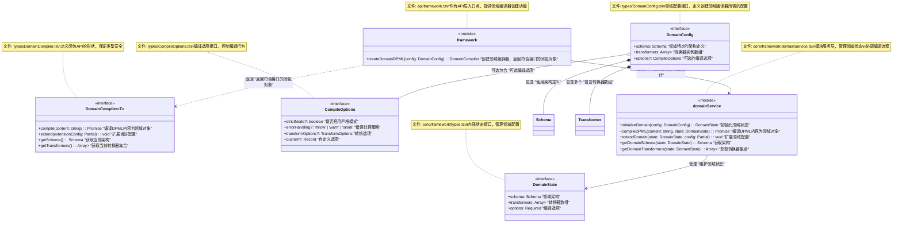

# DPML Framework设计文档

## 1. 概述

Framework模块是DPML核心的入口点，负责创建和管理领域特定的DPML编译器。它将解析、验证和转换等核心功能封装为统一的API，使应用开发者能够方便地定义和使用自己的领域语言。

### 1.1 设计目标

- **统一入口**：提供简洁的API作为领域编译器的单一入口点
- **闭包设计**：通过闭包模式封装内部状态，保持API简洁性
- **可扩展性**：支持动态扩展领域配置
- **类型安全**：提供完全类型化的API和结果
- **职责隔离**：严格遵守分层架构，确保关注点分离

## 2. 核心设计理念

基于项目需求和架构规范，我们确立了以下核心设计理念：

1. **API薄层设计**：
   - API层保持极简，仅委托核心层功能
   - 避免在API层实现业务逻辑
   - 确保API易于理解和使用

2. **闭包状态管理**：
   - 使用闭包模式封装领域状态
   - 通过闭包函数提供对内部状态的受控访问
   - 避免暴露内部实现细节

3. **完整流程封装**：
   - 将解析、处理和转换流程整合为统一管道
   - 提供端到端的DPML编译能力
   - 隐藏流程细节，减轻用户负担

4. **配置扩展机制**：
   - 支持动态扩展和修改领域配置
   - 允许用户调整Schema和转换器
   - 维护配置一致性和有效性

5. **类型安全**：
   - 利用TypeScript泛型确保类型安全
   - 在编译时提供类型检查
   - 支持用户自定义目标类型

## 3. 系统架构

Framework模块严格遵循项目的分层架构：

1. **API层**：framework模块，提供createDomainDPML函数
2. **Types层**：定义DomainCompiler接口和配置类型
3. **Core层**：实现domainService，管理编译流程

## 4. 组件设计

### 4.1 API设计

```typescript
// api/framework.ts
export function createDomainDPML<T>(config: DomainConfig): DomainCompiler<T> {
  const state = domainService.initializeDomain(config);
  
  // 返回闭包对象，符合DomainCompiler接口
  return {
    compile: (content: string) => domainService.compileDPML<T>(content, state),
    extend: (extensionConfig: Partial<DomainConfig>) => domainService.extendDomain(state, extensionConfig),
    getSchema: () => domainService.getDomainSchema(state),
    getTransformers: () => domainService.getDomainTransformers(state)
  };
}
```

### 4.2 类型定义

```typescript
// types/DomainCompiler.ts
export interface DomainCompiler<T> {
  /**
   * 编译DPML内容为领域对象
   * @param content DPML内容字符串
   * @returns 编译后的领域对象
   */
  compile(content: string): Promise<T>;
  
  /**
   * 扩展当前配置
   * @param extensionConfig 要合并的配置片段
   */
  extend(extensionConfig: Partial<DomainConfig>): void;
  
  /**
   * 获取当前架构
   * @returns 当前架构对象
   */
  getSchema(): Schema;
  
  /**
   * 获取当前转换器集合
   * @returns 转换器数组
   */
  getTransformers(): Array<Transformer<unknown, unknown>>;
}

// types/DomainConfig.ts
export interface DomainConfig {
  /**
   * 领域特定的架构定义
   */
  schema: Schema;
  
  /**
   * 转换器实例数组
   */
  transformers: Array<Transformer<unknown, unknown>>;
  
  /**
   * 可选的编译选项
   */
  options?: CompileOptions;
}

// types/CompileOptions.ts
export interface CompileOptions {
  /**
   * 是否启用严格模式
   */
  strictMode?: boolean;
  
  /**
   * 错误处理策略
   */
  errorHandling?: 'throw' | 'warn' | 'silent';
  
  /**
   * 转换选项
   */
  transformOptions?: TransformOptions;
  
  /**
   * 自定义选项
   */
  custom?: Record<string, any>;
}
```

### 4.3 Core层设计

```typescript
// core/framework/domainService.ts
import { parse } from '../../api/parser';
import { processDocument } from '../../api/processing';
import { transform } from '../../api/transformer';
import { DPMLError } from '../../types/errors';

export function initializeDomain(config: DomainConfig): DomainState {
  // 验证配置
  validateConfig(config);
  
  // 创建内部状态
  return {
    schema: config.schema,
    transformers: [...config.transformers],
    options: { ...defaultOptions, ...config.options }
  };
}

export async function compileDPML<T>(content: string, state: DomainState): Promise<T> {
  // 1. 解析DPML内容
  const document = await parse(content);
  
  // 2. 处理并验证
  const result = processDocument(document, state.schema);
  if (!result.validation.isValid && state.options.errorHandling === 'throw') {
    throw new DPMLError('Validation failed', result.validation.errors);
  }
  
  // 3. 转换为目标格式
  return transform<T>(result, state.transformers, state.options.transformOptions);
}

export function extendDomain(state: DomainState, config: Partial<DomainConfig>): void {
  // 更新架构（如果提供）
  if (config.schema) {
    state.schema = config.schema;
  }
  
  // 追加或替换转换器
  if (config.transformers) {
    state.transformers = [...state.transformers, ...config.transformers];
  }
  
  // 合并选项
  if (config.options) {
    state.options = { ...state.options, ...config.options };
  }
}

export function getDomainSchema(state: DomainState): Schema {
  return state.schema;
}

export function getDomainTransformers(state: DomainState): Array<Transformer<unknown, unknown>> {
  return [...state.transformers];
}
```

### 4.4 领域状态设计

```typescript
// core/framework/types.ts
export interface DomainState {
  /**
   * 领域架构
   */
  schema: Schema;
  
  /**
   * 转换器数组
   */
  transformers: Array<Transformer<unknown, unknown>>;
  
  /**
   * 编译选项
   */
  options: Required<CompileOptions>;
}
```

## 5. 组件关系图



## 6. 流程图


## 7. 用户使用方式

以下是应用开发者如何使用DPML Framework模块的示例：

```typescript
import { createDomainDPML } from '@dpml/core';
import type { Schema, Transformer } from '@dpml/core';

// 定义领域特定的Schema
const formSchema: Schema = {
  element: "form",
  attributes: [
    { name: "id", required: true },
    { name: "action", required: true },
    { name: "method", enum: ["GET", "POST"] }
  ],
  children: {
    elements: [
      { 
        element: "input",
        attributes: [
          { name: "type", required: true },
          { name: "name", required: true }
        ]
      },
      {
        element: "button",
        attributes: [
          { name: "type", enum: ["submit", "reset", "button"] }
        ],
        content: { type: "text" }
      }
    ]
  }
};

// 定义转换器，将DPML文档转换为目标格式
const formTransformer: Transformer<ProcessingResult, FormModel> = {
  transform(result) {
    // 实现转换逻辑...
    return {
      id: result.document.root.attributes.id,
      action: result.document.root.attributes.action,
      method: result.document.root.attributes.method,
      fields: result.document.root.children
        .filter(child => child.tagName === 'input')
        .map(input => ({
          name: input.attributes.name,
          type: input.attributes.type
        }))
    };
  }
};

// 创建领域编译器
const formCompiler = createDomainDPML<FormModel>({
  schema: formSchema,
  transformers: [formTransformer],
  options: {
    strictMode: true,
    errorHandling: 'throw'
  }
});

// 使用编译器处理DPML内容
async function processForm(dpmlContent: string) {
  try {
    const formModel = await formCompiler.compile(dpmlContent);
    
    return formModel;
  } catch (error) {
    console.error('表单处理失败:', error);
    throw error;
  }
}

// 扩展现有配置
formCompiler.extend({
  options: {
    strictMode: false,
    errorHandling: 'warn'
  }
});

// 获取当前Schema
const currentSchema = formCompiler.getSchema();
```

## 8. 总结

DPML Framework模块采用闭包设计模式，提供了一个统一的入口点用于创建和管理领域特定的DPML编译器。它严格遵循分层架构原则，将API层设计为极简的薄层，而将实际实现委托给核心服务层。

通过闭包模式封装内部状态，Framework模块实现了简洁而强大的API，同时隐藏了实现细节。它将解析、处理和转换流程整合为统一的编译管道，使应用开发者能够专注于定义自己的领域Schema和转换器，而不必关心内部流程细节。

Framework模块充分利用了TypeScript的类型系统，特别是泛型，确保了API和结果的类型安全。用户可以通过泛型指定目标类型，获得完整的类型推导和编译时验证。

作为DPML核心的入口点，Framework模块连接了解析、Schema、处理和转换等模块，实现了端到端的DPML编译流程。

业务流程概览：

```
创建领域编译器 → 初始化内部状态 → 返回符合接口的闭包对象 → 
用户调用compile方法 → 解析DPML → 处理并验证 → 转换为目标格式 → 返回结果
```
