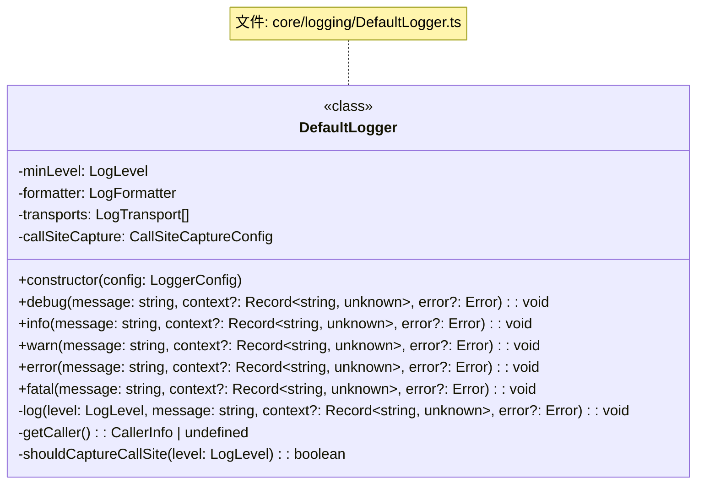
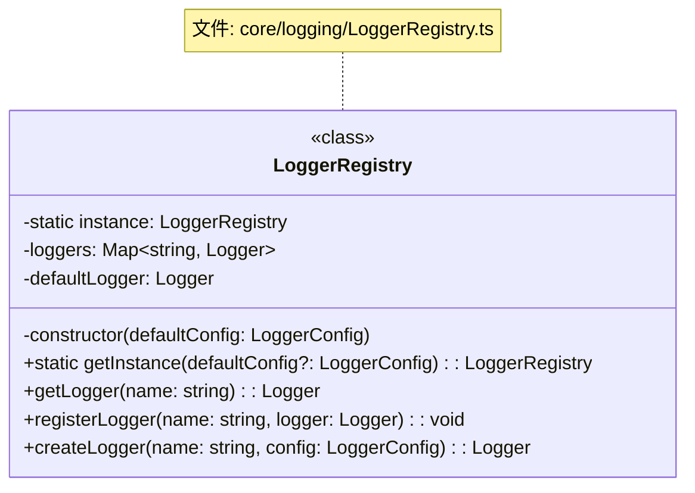
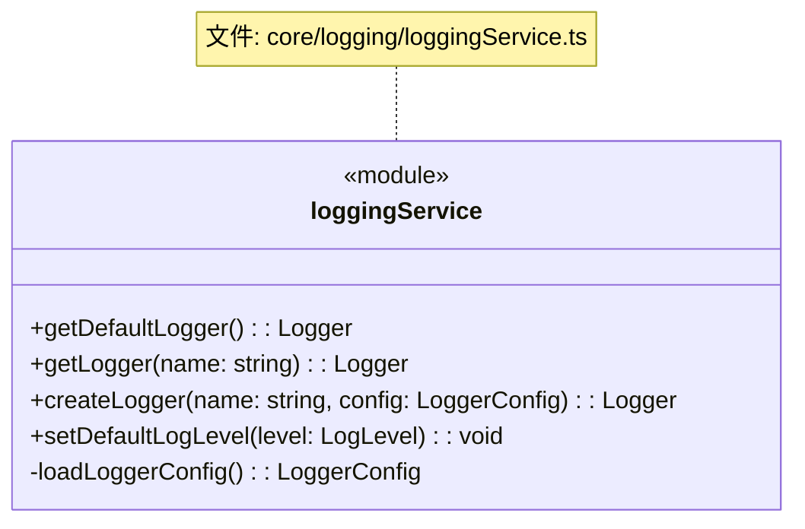
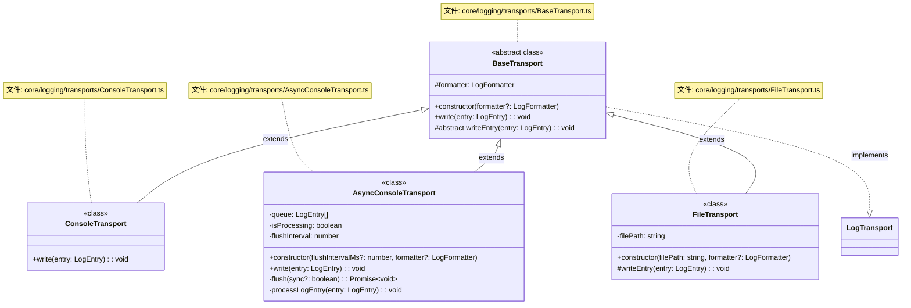
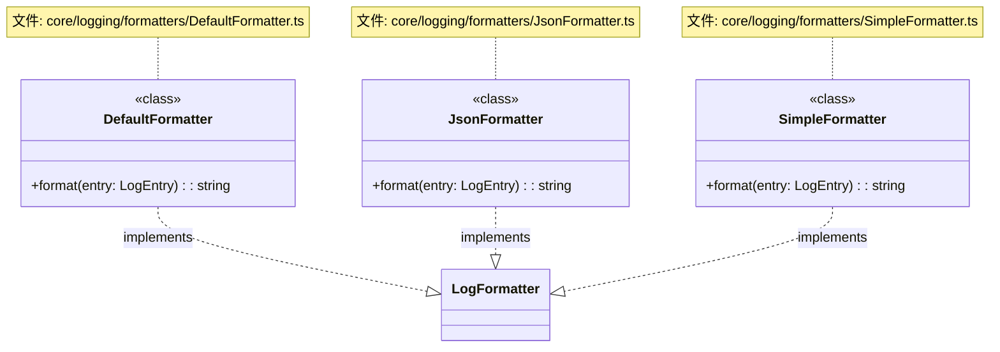
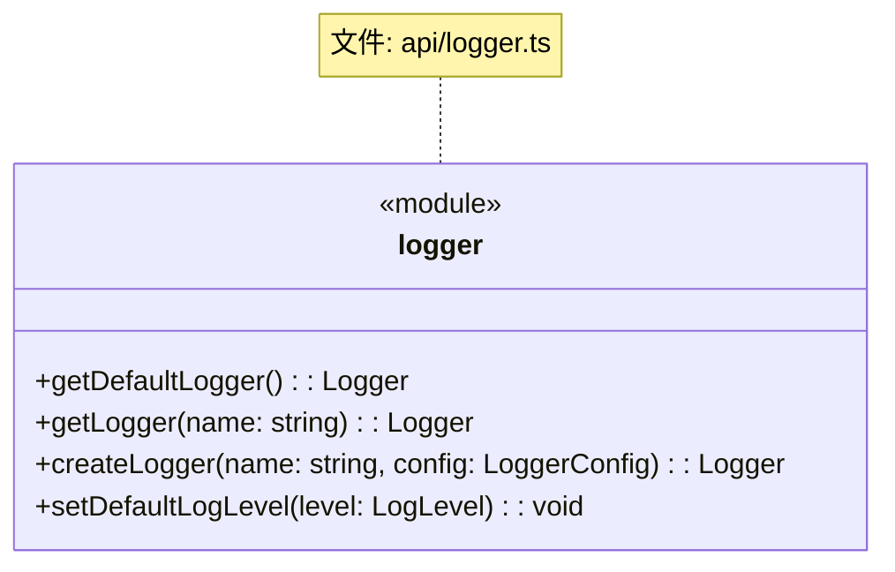
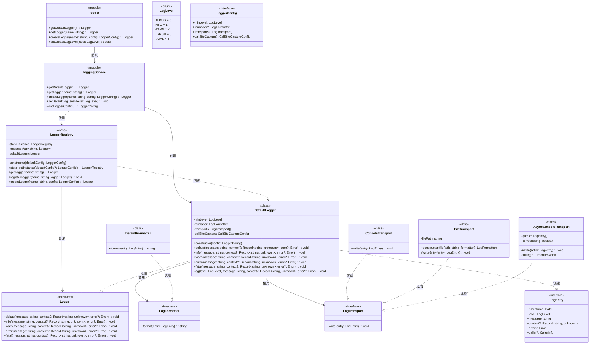

# DPML 日志模块设计文档

## 1. 概述

日志模块（Logger）是DPML核心的基础设施组件，负责记录系统运行过程中的各种信息，包括调试信息、错误信息和性能数据等。它为开发者提供了灵活、可扩展的日志记录能力，支持多种输出目标和格式化选项。

### 1.1 设计目标

- **灵活性**：支持多种日志级别、格式和输出目标
- **可扩展性**：允许用户定义自定义的日志传输器和格式化器
- **易用性**：提供简洁直观的API，降低使用门槛
- **可配置性**：支持运行时动态配置日志行为
- **性能优化**：支持异步日志和批处理，减少性能影响
- **隔离性**：支持命名空间隔离，避免不同模块间的日志干扰
- **类型安全**：利用TypeScript的类型系统确保API的类型安全

## 2. 核心设计理念

基于项目需求和架构规范，我们确立了以下核心设计理念：

1. **分层设计**：
   - 严格遵循项目的分层架构
   - Types层定义纯数据结构和接口
   - Core层实现具体功能
   - API层提供薄层委托

2. **单例状态管理**：
   - 日志注册表采用单例模式，确保全局一致性
   - 提供命名空间机制隔离不同模块的日志
   - 统一管理所有日志器实例

3. **可插拔组件**：
   - 日志传输器和格式化器设计为可插拔组件
   - 支持自定义组件的注册和使用
   - 遵循接口约定确保兼容性

4. **灵活配置**：
   - 支持全局和局部日志配置
   - 支持运行时动态调整日志级别
   - 提供环境变量和配置文件的支持

5. **错误隔离**：
   - 日志系统自身的错误不应影响应用程序
   - 提供健壮的错误处理机制
   - 隔离日志组件的异常

6. **性能考量**：
   - 提供同步和异步日志选项
   - 支持日志批处理减少I/O操作
   - 考虑日志在高负载下的表现

7. **类型安全**：
   - 利用TypeScript的类型系统确保类型安全
   - 提供泛型支持增强灵活性
   - 确保在编译时捕获类型错误

## 3. 系统架构

日志模块遵循项目的整体架构规则，采用分层设计：

1. **API层** - 对外暴露日志功能，作为薄层委托Core层功能
2. **Types层** - 定义日志相关的数据结构，保持纯数据类型定义
3. **Core层** - 包含所有内部实现，主要分为：
   - **模块服务层** - 提供日志服务，协调日志组件
   - **领域层** - 实现具体日志功能和组件

整体架构如下：

```
┌───────────────────────────────────────────────────────────────┐
│                          API层                                │
│            getLogger, createLogger, setDefaultLogLevel        │
└───────────────────────────────┬───────────────────────────────┘
                               │
┌───────────────────────────────┴───────────────────────────────┐
│                         Types层                               │
│               日志相关的数据类型和接口定义                        │
└───────────────────────────────┬───────────────────────────────┘
                               │
┌───────────────────────────────┴───────────────────────────────┐
│                         Core层                                │
│  ┌────────────────────────────────────────────────────────┐   │
│  │                loggingService (模块服务)                │   │
│  │            实现日志服务，协调日志器和日志注册表               │   │
│  └──────────┬─────────────────┬───────────────────────────┘   │
│             │                 │                               │
│  ┌──────────▼─────────┐  ┌────▼─────────────────────────┐     │
│  │    LoggerRegistry  │  │    DefaultLogger             │     │
│  │    状态管理组件      │  │    执行组件                   │     │
│  └────────────────────┘  └──────────────────────────────┘     │
│                                                               │
│  ┌────────────────────┐  ┌──────────────────────────────┐     │
│  │    Formatters      │  │    Transports                │     │
│  │    格式化组件        │  │    传输组件                   │     │
│  └────────────────────┘  └──────────────────────────────┘     │
└───────────────────────────────────────────────────────────────┘
```

## 4. 组件设计

### 4.1 数据类型设计

```mermaid
classDiagram
    class Logger {
        <<interface>>
        +debug(message: string, context?: Record~string, unknown~, error?: Error): void
        +info(message: string, context?: Record~string, unknown~, error?: Error): void
        +warn(message: string, context?: Record~string, unknown~, error?: Error): void
        +error(message: string, context?: Record~string, unknown~, error?: Error): void
        +fatal(message: string, context?: Record~string, unknown~, error?: Error): void
    }
    note for Logger "文件: types/log.ts"
    
    class LogLevel {
        <<enum>>
        DEBUG = 0
        INFO = 1
        WARN = 2
        ERROR = 3
        FATAL = 4
    }
    note for LogLevel "文件: types/log.ts"
    
    class LogEntry {
        <<interface>>
        +timestamp: Date
        +level: LogLevel
        +message: string
        +context?: Record~string, unknown~
        +error?: Error
        +caller?: CallerInfo
    }
    note for LogEntry "文件: types/log.ts"
    
    class CallerInfo {
        <<interface>>
        +fileName: string
        +className?: string
        +functionName: string
        +lineNumber: number
        +columnNumber?: number
    }
    note for CallerInfo "文件: types/log.ts"
    
    class LoggerConfig {
        <<interface>>
        +minLevel: LogLevel
        +formatter?: LogFormatter
        +transports?: LogTransport[]
        +callSiteCapture?: CallSiteCaptureConfig
    }
    note for LoggerConfig "文件: types/log.ts"
    
    class CallSiteCaptureConfig {
        <<interface>>
        +enabled: boolean
        +forLevels?: LogLevel[]
    }
    note for CallSiteCaptureConfig "文件: types/log.ts"
    
    class LogFormatter {
        <<interface>>
        +format(entry: LogEntry): string
    }
    note for LogFormatter "文件: types/log.ts"
    
    class LogTransport {
        <<interface>>
        +write(entry: LogEntry): void
    }
    note for LogTransport "文件: types/log.ts"
```



#### 关键类型说明

- **Logger**：定义日志器的核心接口，所有日志器实现必须实现此接口
- **LogLevel**：日志级别枚举，从DEBUG到FATAL定义不同的严重程度
- **LogEntry**：日志条目结构，包含时间戳、级别、消息和可选的上下文信息
- **CallerInfo**：调用位置信息，包含文件名、类名、函数名和行号等
- **LoggerConfig**：日志器配置，控制日志级别、格式化器和传输器等
- **CallSiteCaptureConfig**：调用位置捕获配置，控制是否启用和针对哪些级别启用
- **LogFormatter**：日志格式化器接口，负责将日志条目格式化为字符串
- **LogTransport**：日志传输器接口，负责将日志写入到目标位置

### 4.2 执行组件设计



DefaultLogger是一个**执行组件**，负责：
- 执行日志记录操作
- 根据配置过滤不同级别的日志
- 捕获调用位置信息（如果启用）
- 将日志条目发送到配置的传输器
- 处理日志过程中的错误

### 4.3 状态管理组件设计



LoggerRegistry是一个**状态管理组件**，负责：
- 维护单例模式，确保全局唯一实例
- 管理所有已创建的日志器实例
- 提供获取和创建日志器的方法
- 确保日志器实例的一致性和共享

### 4.4 模块服务设计



loggingService是一个**模块服务**，负责：
- 统一协调日志模块的功能
- 管理LoggerRegistry单例
- 提供日志器的获取和创建方法
- 管理全局日志配置
- 连接API层和核心实现

### 4.5 传输组件设计



日志传输组件的职责是将日志条目写入到特定的目标位置，如控制台、文件或网络等。

### 4.6 格式化组件设计



格式化组件的职责是将日志条目转换为特定格式的字符串，适合不同的输出需求。

### 4.7 API设计



API层提供简洁的函数式接口，直接委托给Core层的loggingService，不包含任何业务逻辑。

## 5. 组件关系图



## 6. 执行流程

日志模块的典型执行流程如下:

1. **初始化**:
   - 在应用启动时，创建LoggerRegistry单例
   - 根据配置创建默认日志器
   - API层和loggingService准备就绪

2. **获取日志器**:
   - 用户通过API层获取命名日志器或默认日志器
   - API层委托给loggingService
   - loggingService从LoggerRegistry获取或创建日志器实例

3. **记录日志**:
   - 用户调用日志器的方法(debug, info, warn, error, fatal)
   - 日志器检查日志级别是否需要记录
   - 如果配置了调用位置捕获，获取调用栈信息
   - 创建LogEntry对象，包含消息、上下文和时间戳等

4. **处理日志**:
   - 将LogEntry传递给配置的每个传输器
   - 每个传输器使用格式化器将日志条目格式化为字符串
   - 传输器将格式化后的日志写入目标位置
   - 错误处理确保日志系统故障不影响应用程序

### 6.1 日志级别过滤

日志级别过滤是提高性能的关键机制:

1. **静态过滤**:
   - 日志器在创建时设置最低记录级别
   - 低于此级别的日志调用会被快速跳过
   - 避免不必要的字符串格式化和对象创建

2. **运行时调整**:
   - 支持在运行时动态调整日志级别
   - 全局调整或针对特定命名空间调整
   - 便于在不同环境或调试场景切换

### 6.2 调用位置捕获

调用位置捕获是一个可选但有价值的功能:

1. **选择性启用**:
   - 默认禁用以避免性能影响
   - 可以在配置中全局或针对特定级别启用
   - 适合调试场景，而非生产环境

2. **捕获机制**:
   - 通过创建Error对象获取调用栈
   - 解析调用栈提取文件名、行号等信息
   - 支持提取类名和方法名（如果可用）

3. **使用方式**:
   ```typescript
   // 启用调用位置捕获
   const logger = createLogger('myLogger', {
     minLevel: LogLevel.DEBUG,
     callSiteCapture: {
       enabled: true,
       forLevels: [LogLevel.ERROR, LogLevel.FATAL] // 只对错误和致命错误捕获
     }
   });
   ```

### 6.3 异步日志

异步日志是提高性能的重要机制:

1. **队列机制**:
   - 日志条目被添加到内存队列
   - 后台任务异步处理队列中的日志
   - 减少主线程阻塞，提高应用响应性

2. **批处理**:
   - 队列达到一定长度或经过一定时间后批量处理
   - 减少I/O操作次数，提高效率
   - 支持在应用退出前强制刷新剩余日志

3. **使用方式**:
   ```typescript
   // 使用异步控制台传输器
   const logger = createLogger('myLogger', {
     minLevel: LogLevel.INFO,
     transports: [new AsyncConsoleTransport(1000)] // 1000ms刷新间隔
   });
   ```

## 7. 使用示例

### 7.1 基本使用

```typescript
import { getLogger, LogLevel } from '@dpml/core';

// 获取默认日志器
const logger = getLogger('myModule');

// 记录不同级别的日志
logger.debug('这是一条调试消息');
logger.info('这是一条信息消息');
logger.warn('这是一条警告消息');
logger.error('这是一条错误消息', { moduleId: 'parser' });
logger.fatal('这是一条致命错误消息', {}, new Error('严重错误'));
```

### 7.2 高级使用

```typescript
import { createLogger, LogLevel, ConsoleTransport, FileTransport, JsonFormatter } from '@dpml/core';

// 创建自定义日志器
const customLogger = createLogger('customLogger', {
  minLevel: LogLevel.DEBUG,
  formatter: new JsonFormatter(),
  transports: [
    new ConsoleTransport(),
    new FileTransport('./logs/app.log')
  ]
});

// 使用上下文记录日志
customLogger.info('用户登录成功', { 
  userId: '12345', 
  loginTime: new Date().toISOString(),
  ipAddress: '192.168.1.1'
});

// 记录错误
try {
  // 一些可能抛出错误的操作
  throw new Error('操作失败');
} catch (error) {
  customLogger.error('处理请求时发生错误', { 
    requestId: 'req-123',
    endpoint: '/api/data'
  }, error);
}

// 设置全局默认日志级别
import { setDefaultLogLevel } from '@dpml/core';
setDefaultLogLevel(LogLevel.WARN); // 现在只记录WARN及以上级别的日志
```

### 7.3 配置调用位置捕获

```typescript
import { createLogger, LogLevel } from '@dpml/core';

// 创建带调用位置捕获的日志器
const debugLogger = createLogger('debugLogger', {
  minLevel: LogLevel.DEBUG,
  callSiteCapture: {
    enabled: true,
    forLevels: [LogLevel.ERROR, LogLevel.FATAL] // 只对错误和致命错误启用
  }
});

// 使用此日志器
class UserService {
  createUser() {
    // 记录INFO级别信息 - 不会捕获调用位置
    debugLogger.info('创建用户开始');
    
    try {
      // 用户创建逻辑
      throw new Error('用户创建失败');
    } catch (error) {
      // 记录ERROR级别 - 会捕获调用位置，输出包含UserService.createUser和行号
      debugLogger.error('用户创建失败', { operation: 'createUser' }, error);
    }
  }
}

new UserService().createUser();
```

### 7.4 使用异步日志

```typescript
import { createLogger, LogLevel, AsyncConsoleTransport } from '@dpml/core';

// 创建使用异步传输器的日志器
const asyncLogger = createLogger('asyncLogger', {
  minLevel: LogLevel.INFO,
  transports: [
    new AsyncConsoleTransport(500) // 500ms刷新间隔
  ]
});

// 记录大量日志不会阻塞主线程
for (let i = 0; i < 1000; i++) {
  asyncLogger.info(`处理项目 ${i}`);
}

console.log('主线程继续执行'); // 立即执行，不等待日志完成
```

## 8. 扩展点

日志模块提供以下扩展点:

1. **自定义传输器**:
   - 实现LogTransport接口创建自定义传输器
   - 可以输出到数据库、消息队列或云服务等
   - 示例:
     ```typescript
     class DatabaseTransport implements LogTransport {
       private db: Database;
       
       constructor(connectionString: string) {
         this.db = new Database(connectionString);
       }
       
       write(entry: LogEntry): void {
         this.db.insertLog({
           timestamp: entry.timestamp,
           level: LogLevel[entry.level],
           message: entry.message,
           context: JSON.stringify(entry.context || {}),
           errorMessage: entry.error?.message,
           errorStack: entry.error?.stack
         });
       }
     }
     ```

2. **自定义格式化器**:
   - 实现LogFormatter接口创建自定义格式化器
   - 可以支持特定格式或添加额外信息
   - 示例:
     ```typescript
     class XMLFormatter implements LogFormatter {
       format(entry: LogEntry): string {
         return `<log>
           <timestamp>${entry.timestamp.toISOString()}</timestamp>
           <level>${LogLevel[entry.level]}</level>
           <message>${escapeXml(entry.message)}</message>
           ${entry.context ? `<context>${escapeXml(JSON.stringify(entry.context))}</context>` : ''}
           ${entry.error ? `<error>${escapeXml(entry.error.message)}</error>` : ''}
         </log>`;
       }
     }
     ```

3. **扩展LoggerConfig**:
   - 可以扩展LoggerConfig接口添加新的配置选项
   - 确保向后兼容性
   - 示例:
     ```typescript
     interface ExtendedLoggerConfig extends LoggerConfig {
       rotationStrategy?: {
         maxSize?: number;
         maxFiles?: number;
         rotateDaily?: boolean;
       };
     }
     ```

4. **集成外部日志系统**:
   - 通过自定义传输器集成第三方日志系统
   - 示例:
     ```typescript
     class ElasticSearchTransport implements LogTransport {
       private client: ElasticSearchClient;
       
       constructor(config: ElasticSearchConfig) {
         this.client = new ElasticSearchClient(config);
       }
       
       write(entry: LogEntry): void {
         this.client.index({
           index: 'logs',
           body: {
             timestamp: entry.timestamp,
             level: LogLevel[entry.level],
             message: entry.message,
             context: entry.context,
             error: entry.error?.message
           }
         });
       }
     }
     ```

## 9. 未来扩展方向

1. **日志轮转**:
   - 支持基于大小或时间的日志文件轮转
   - 管理历史日志文件
   - 自动压缩和清理旧日志

2. **结构化日志**:
   - 增强对结构化日志的支持
   - 提供更好的索引和查询能力
   - 支持OpenTelemetry等标准

3. **日志聚合**:
   - 提供集中式日志收集和管理
   - 支持多实例、多服务场景
   - 提供日志关联和追踪能力

4. **日志分析**:
   - 集成基本的日志分析功能
   - 识别异常模式和趋势
   - 提供性能和错误报告

5. **安全增强**:
   - 自动脱敏敏感信息
   - 支持日志加密
   - 提供访问控制机制

## 10. 总结

DPML日志模块提供了一个灵活、可扩展的日志记录系统，具有以下核心特性：

- **分层架构**：严格遵循API/Types/Core分层设计，确保关注点分离
- **单例管理**：使用LoggerRegistry维护全局一致的日志状态
- **插件系统**：支持自定义传输器和格式化器，适应不同场景
- **性能优化**：提供日志级别过滤和异步日志功能，减少性能影响
- **调用追踪**：可选的调用位置捕获，帮助调试和问题定位
- **类型安全**：利用TypeScript类型系统确保API的类型安全
- **隔离性**：命名空间机制隔离不同模块的日志，避免干扰
- **灵活配置**：支持运行时动态配置和环境变量支持

日志模块为DPML项目的开发、调试和运行提供了可靠的基础设施支持，帮助开发者了解系统运行状态、排查问题并优化性能。

业务流程概览：
```
获取日志器 → 记录日志 → 日志级别过滤 → 捕获调用位置(可选) → 
创建日志条目 → 格式化日志 → 传输到目标位置
```