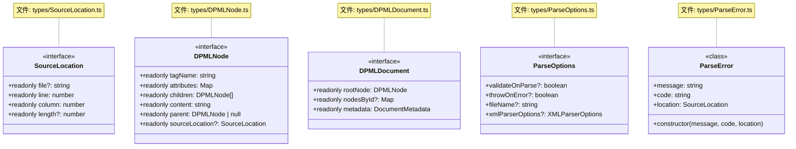
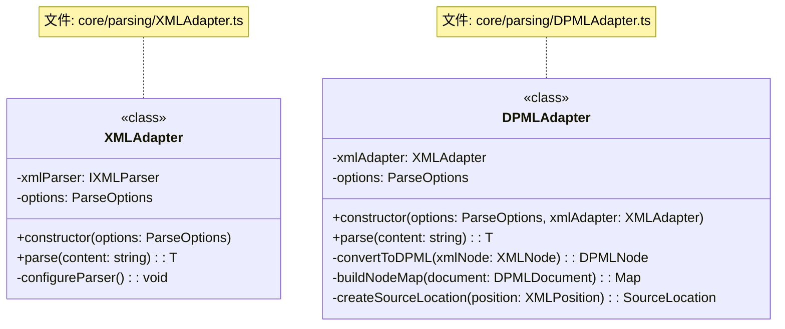
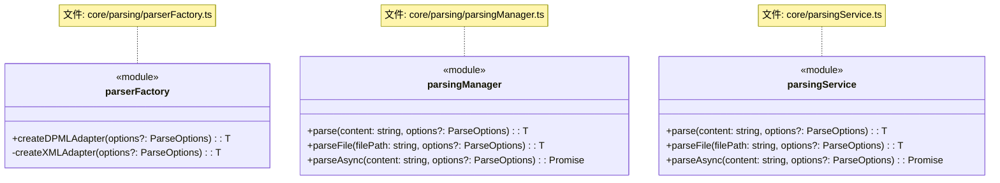
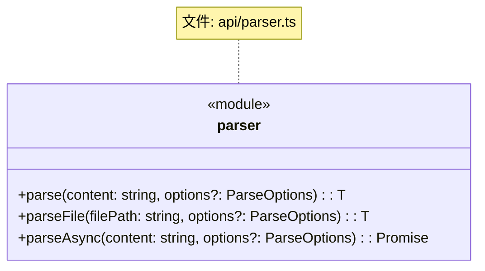
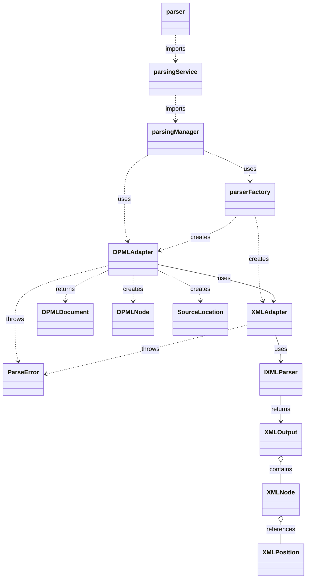
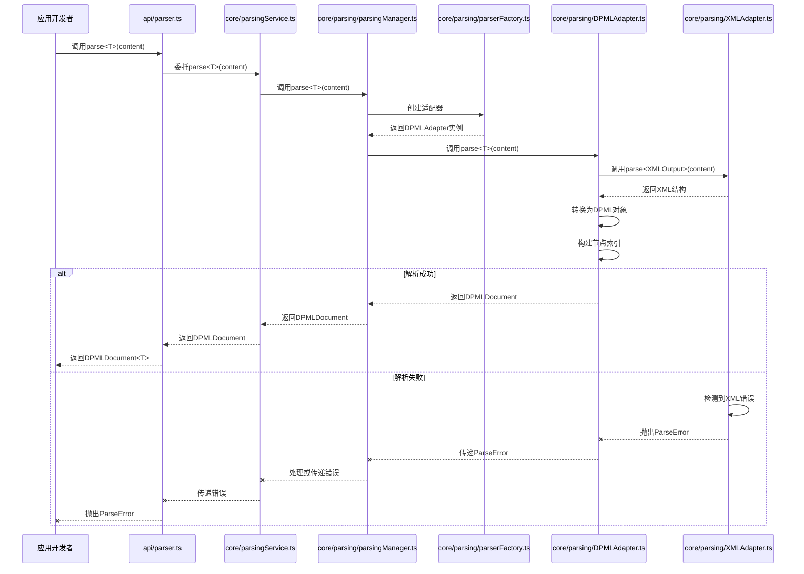
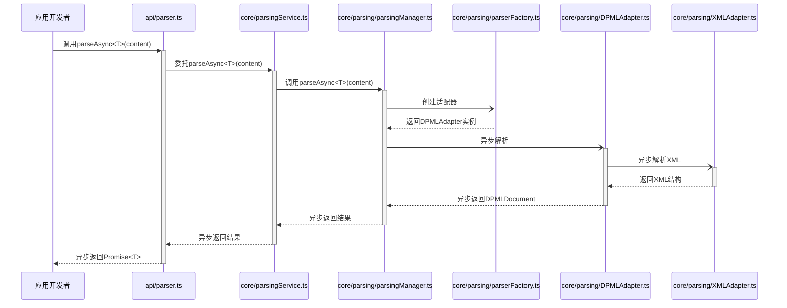

# DPML 解析模块设计文档

## 1. 概述

解析模块是DPML核心的基础组件，负责将DPML文本内容解析成内存中的文档对象模型。它提供了高效、可靠的解析能力，是其他模块（如验证、渲染等）的基础。

### 1.1 设计目标

- **高效解析**：提供快速的解析性能，支持各种规模的DPML文档
- **错误恢复**：提供详细的错误信息和位置，支持在解析错误时进行恢复
- **可扩展性**：支持未来可能的语法扩展和特性增强
- **平台无关**：解析逻辑不依赖特定运行环境
- **易于使用**：提供简洁明了的API，降低使用门槛
- **类型安全**：利用TypeScript的类型系统确保API和内部实现的类型安全

## 2. 核心设计理念

经过讨论，我们确立了以下核心设计理念：

1. **适配器模式**：
   - 使用适配器隔离底层XML解析器
   - 便于未来替换底层实现
   - 统一处理不同格式的输入

2. **分层解析**：
   - 将解析过程分为低级XML解析和高级DPML语义解析
   - 每层专注于自己的职责，降低复杂度

3. **位置跟踪**：
   - 完整保留源代码位置信息
   - 支持精确定位错误和警告
   - 为IDE集成提供必要信息

4. **异步支持**：
   - 提供同步和异步API
   - 支持大文件的高效处理

5. **错误处理策略**：
   - 提供详细的错误信息
   - 支持不同级别的错误处理（抛出或收集）
   - 便于调试和问题定位

6. **类型安全**：
   - 利用TypeScript的类型系统确保API的类型安全
   - 使用泛型支持不同的解析场景和输出类型
   - 提供明确的类型定义，减少运行时错误

## 3. 系统架构

DPML解析模块遵循项目的整体架构规则，采用分层设计：

1. **API层** - 对外暴露解析功能
2. **Service层** - 组织解析服务
3. **Manager层** - 管理解析流程
4. **业务层** - 实现具体解析逻辑
5. **数据类型层** - 定义解析相关的数据结构

## 4. 组件设计

### 4.1 数据类型设计

#### 4.1.1 对外暴露的类型（types/目录）



#### 4.1.2 内部实现类型（core/parsing/types.ts）

```mermaid
classDiagram
    class XMLNode {
        <<interface>>
        +tag: string
        +attributes?: Record<string, string>
        +children?: XMLNode[]
        +content?: string
        +position?: XMLPosition
    }
    note for XMLNode "文件: core/parsing/types.ts"
    
    class XMLPosition {
        <<interface>>
        +line: number
        +column: number
        +offset?: number
        +length?: number
    }
    note for XMLPosition "文件: core/parsing/types.ts"
    
    class XMLOutput {
        <<interface>>
        +root: XMLNode
        +errors?: Array<{message: string, position?: XMLPosition}>
    }
    note for XMLOutput "文件: core/parsing/types.ts"
    
    class IXMLParser {
        <<interface>>
        +parse(content: string): XMLOutput
        +parseAsync(content: string): Promise<XMLOutput>
    }
    note for IXMLParser "文件: core/parsing/types.ts"
```

#### 关键类型说明

- **DPMLDocument**：表示一个完整的DPML文档，包含根节点和所有子节点
- **DPMLNode**：表示文档中的单个节点，包含标签名、属性、子节点等
- **SourceLocation**：跟踪节点在源文件中的位置信息
- **ParseOptions**：控制解析行为的选项
- **ParseError**：表示解析过程中的错误，包含位置信息
- **XMLNode**：XML节点的内部表示，用于转换过程
- **XMLPosition**：XML节点在源文件中的位置信息
- **XMLOutput**：XML解析的内部输出结构
- **IXMLParser**：内部XML解析器接口，定义解析能力

### 4.2 适配器设计



#### 适配器职责

- **XMLAdapter**：
  - 封装底层XML解析库（如sax、fast-xml-parser等）
  - 处理XML语法层面的解析
  - 提供统一的XML解析结果
  - 泛型支持自定义XML输出类型

- **DPMLAdapter**：
  - 使用XMLAdapter解析XML
  - 将XML结构转换为DPML对象模型
  - 处理DPML特定的语义转换（如属性映射）
  - 构建节点索引和引用关系
  - 泛型支持自定义文档类型

### 4.3 工厂、Manager和Service设计



#### 组件职责

- **parserFactory**：
  - 负责创建和配置适配器实例
  - 封装适配器的创建逻辑
  - 确保正确的依赖注入
  - 泛型支持自定义适配器类型

- **parsingManager**：
  - 协调整个解析流程
  - 处理文件I/O和异步操作
  - 统一错误处理逻辑
  - 泛型支持自定义文档类型

- **parsingService**：
  - 组织和重导出解析功能
  - 作为Manager和API层之间的桥梁
  - 保持API接口稳定性
  - 泛型支持自定义文档类型

### 4.4 API设计



#### API职责

- 对外暴露简洁的解析功能
- 直接委托给Service层
- 提供内容字符串和文件两种解析入口
- 支持同步和异步解析方式
- 泛型支持自定义文档类型

## 5. 组件关系图



## 6. 数据流

### 6.1 解析流程



### 6.2 异步解析流程



## 7. 错误处理策略

解析模块采用了多层次的错误处理策略：

### 7.1 错误分类

- **语法错误**：XML/DPML语法不正确导致的错误
- **结构错误**：虽然语法正确但违反DPML文档结构的错误
- **I/O错误**：文件读取/写入错误

### 7.2 错误处理选项

- **抛出错误模式**（`throwOnError: true`）：
  - 发现第一个错误时立即抛出
  - 提供详细的错误位置和原因
  - 适合开发环境快速定位问题

- **收集错误模式**（`throwOnError: false`）：
  - 尽可能继续解析，收集所有错误
  - 返回部分解析结果和错误列表
  - 适合批量验证和用户友好的错误报告

### 7.3 位置跟踪

每个ParseError都包含SourceLocation信息：
- 文件名（如果有）
- 行号和列号
- 错误片段长度

这使IDE和其他工具可以精确定位到错误位置。

## 8. 扩展点

解析模块设计了以下扩展点，以支持未来功能：

### 8.1 解析钩子

未来可添加解析钩子（hooks）系统，允许在解析过程中注入自定义处理：

```typescript
interface ParseHooks {
  beforeParse?: (content: string) => string;
  onNode?<T extends DPMLNode>(node: T): T | null;
  afterParse?<T extends DPMLDocument>(document: T): T;
}
```

### 8.2 自定义适配器

架构支持添加除XML之外的其他格式适配器：

- JSON适配器
- YAML适配器
- 自定义DSL适配器

每种适配器都应实现通用接口，确保类型安全和一致的行为。

### 8.3 流式解析

未来可支持大文件的流式解析：

```typescript
function parseStream<T extends DPMLNode = DPMLNode>(
  stream: ReadableStream, 
  options?: ParseOptions
): ReadableStream<T>;
```

## 9. 用户使用方式

以下是应用开发者如何使用DPML解析模块的示例：

```typescript
import { parse, parseFile, parseAsync } from '@dpml/core';

// 定义自定义文档类型
interface CustomDocument extends DPMLDocument {
  additionalData: {
    version: string;
    metadata: Record<string, unknown>;
  }
}

// 同步解析字符串
try {
  const document = parse<CustomDocument>('<root><child id="item1">内容</child></root>');
   // 1
   // 类型安全访问
} catch (error) {
  if (error instanceof ParseError) {
    console.error('解析错误:', error.message, error.location);
  } else {
    throw error; // 重新抛出其他类型的错误
  }
}

// 同步解析文件
const document = parseFile('./example.dpml', { 
  throwOnError: false,
  validateOnParse: true
});

// 异步解析大文件
parseAsync<CustomDocument>('./large-document.dpml')
  .then(document => {
    // 处理文档，类型安全的访问
    
  })
  .catch(error => {
    // 类型化的错误处理
    if (error instanceof ParseError) {
      console.error(`解析错误: ${error.code} 在 ${error.location.line}:${error.location.column}`);
    } else {
      console.error('未知错误:', error);
    }
  });
```

## 10. 总结

DPML解析模块采用了清晰的分层架构和适配器设计模式，提供了高效、可靠且类型安全的解析能力。通过利用TypeScript的类型系统，特别是泛型，我们确保了API和内部实现的类型安全性，同时保持了灵活性。

提供同步和异步API，以及详细的错误处理，满足了不同场景下的解析需求。架构设计符合DPML整体架构规则，具有良好的可扩展性，为未来功能演进提供了坚实基础。

## 11. 完整UML类图

以下是解析模块的完整UML类图，符合DPML UML规范：

```mermaid
classDiagram
    %% API层
    class parser {
        <<module>>
        +parse<T extends DPMLDocument>(content: string, options?: ParseOptions): T
        +parseFile<T extends DPMLDocument>(filePath: string, options?: ParseOptions): T
        +parseAsync<T extends DPMLDocument>(content: string, options?: ParseOptions): Promise<T>
    }
    note for parser "文件: api/parser.ts"
    
    %% Service层
    class parsingService {
        <<module>>
        +parse<T extends DPMLDocument>(content: string, options?: ParseOptions): T
        +parseFile<T extends DPMLDocument>(filePath: string, options?: ParseOptions): T
        +parseAsync<T extends DPMLDocument>(content: string, options?: ParseOptions): Promise<T>
    }
    note for parsingService "文件: core/parsingService.ts"
    
    %% Manager层
    class parsingManager {
        <<module>>
        +parse<T extends DPMLDocument>(content: string, options?: ParseOptions): T
        +parseFile<T extends DPMLDocument>(filePath: string, options?: ParseOptions): T
        +parseAsync<T extends DPMLDocument>(content: string, options?: ParseOptions): Promise<T>
    }
    note for parsingManager "文件: core/parsing/parsingManager.ts"
    
    %% 工厂
    class parserFactory {
        <<factory>>
        +createDPMLAdapter<T extends DPMLAdapter>(options?: ParseOptions): T
        -createXMLAdapter<T extends XMLAdapter>(options?: ParseOptions): T
    }
    note for parserFactory "文件: core/parsing/parserFactory.ts"
    
    %% 业务类
    class XMLAdapter {
        <<class>>
        -xmlParser: IXMLParser
        -options: ParseOptions
        +constructor(options: ParseOptions)
        +parse<T extends XMLOutput>(content: string): T
        -configureParser(): void
    }
    note for XMLAdapter "文件: core/parsing/XMLAdapter.ts"
    
    class DPMLAdapter {
        <<class>>
        -xmlAdapter: XMLAdapter
        -options: ParseOptions
        +constructor(options: ParseOptions, xmlAdapter: XMLAdapter)
        +parse<T extends DPMLDocument>(content: string): T
        -convertToDPML(xmlNode: XMLNode): DPMLNode
        -buildNodeMap(document: DPMLDocument): Map<string, DPMLNode>
        -createSourceLocation(position: XMLPosition): SourceLocation
    }
    note for DPMLAdapter "文件: core/parsing/DPMLAdapter.ts"
    
    %% 对外暴露的类型
    class DPMLDocument {
        <<interface>>
        +readonly rootNode: DPMLNode
        +readonly nodesById?: Map<string, DPMLNode>
        +readonly metadata: DocumentMetadata
    }
    note for DPMLDocument "文件: types/DPMLDocument.ts"
    
    class DPMLNode {
        <<interface>>
        +readonly tagName: string
        +readonly attributes: Map<string, string>
        +readonly children: DPMLNode[]
        +readonly content: string
        +readonly parent: DPMLNode | null
        +readonly sourceLocation?: SourceLocation
    }
    note for DPMLNode "文件: types/DPMLNode.ts"
    
    class SourceLocation {
        <<interface>>
        +readonly file?: string
        +readonly line: number
        +readonly column: number
        +readonly length?: number
    }
    note for SourceLocation "文件: types/SourceLocation.ts"
    
    class ParseOptions {
        <<interface>>
        +validateOnParse?: boolean
        +throwOnError?: boolean
        +fileName?: string
        +xmlParserOptions?: XMLParserOptions
    }
    note for ParseOptions "文件: types/ParseOptions.ts"
    
    class ParseError {
        <<class>>
        +message: string
        +code: string
        +location: SourceLocation
        +constructor(message, code, location)
    }
    note for ParseError "文件: types/ParseError.ts"
    
    %% 内部实现类型
    class XMLNode {
        <<interface>>
        +tag: string
        +attributes?: Record<string, string>
        +children?: XMLNode[]
        +content?: string
        +position?: XMLPosition
    }
    note for XMLNode "文件: core/parsing/types.ts"
    
    class XMLPosition {
        <<interface>>
        +line: number
        +column: number
        +offset?: number
        +length?: number
    }
    note for XMLPosition "文件: core/parsing/types.ts"
    
    class XMLOutput {
        <<interface>>
        +root: XMLNode
        +errors?: Array<{message: string, position?: XMLPosition}>
    }
    note for XMLOutput "文件: core/parsing/types.ts"
    
    class IXMLParser {
        <<interface>>
        +parse(content: string): XMLOutput
        +parseAsync(content: string): Promise<XMLOutput>
    }
    note for IXMLParser "文件: core/parsing/types.ts"
    
    %% 定义关系
    parser --> parsingService : uses
    parsingService --> parsingManager : uses
    parsingManager --> parserFactory : creates adapters
    parserFactory ..> DPMLAdapter : creates
    parserFactory ..> XMLAdapter : creates
    DPMLAdapter --> XMLAdapter : uses
    XMLAdapter --> IXMLParser : uses
    
    parsingManager ..> DPMLDocument : returns
    DPMLAdapter ..> DPMLDocument : returns
    DPMLAdapter ..> DPMLNode : creates
    DPMLAdapter ..> SourceLocation : creates
    DPMLAdapter ..> ParseError : throws
    XMLAdapter ..> ParseError : throws
    XMLAdapter ..> XMLOutput : returns
    
    DPMLDocument o-- DPMLNode : contains
    DPMLNode o-- DPMLNode : parent-child
    DPMLNode o-- SourceLocation : references
    XMLOutput o-- XMLNode : contains
    XMLNode o-- XMLPosition : references
``` 
