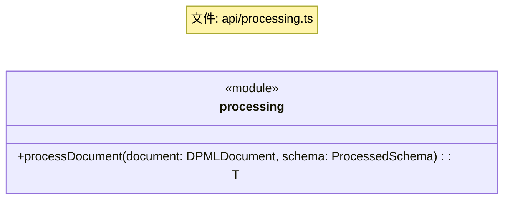
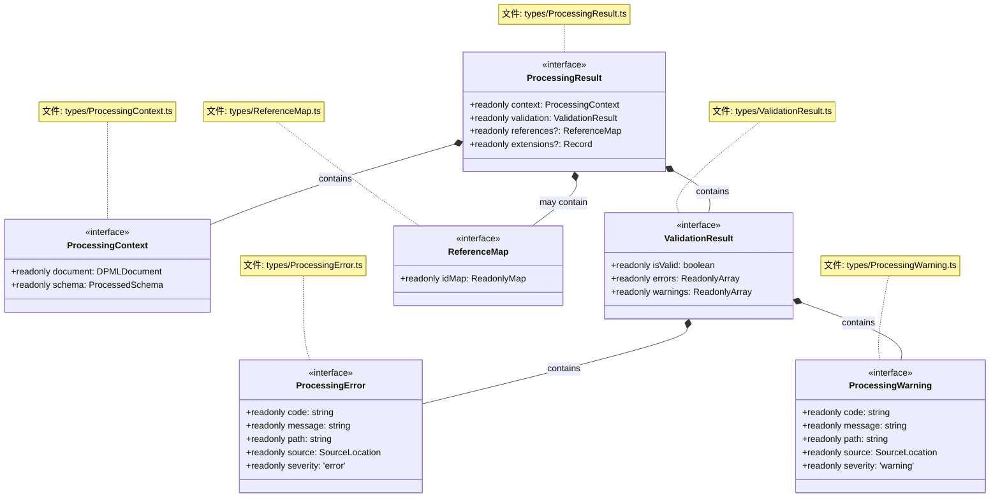
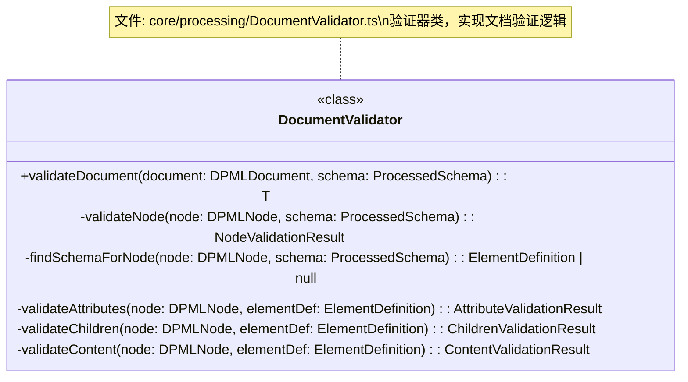
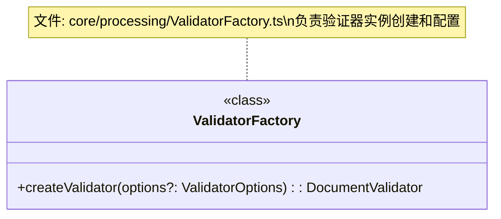
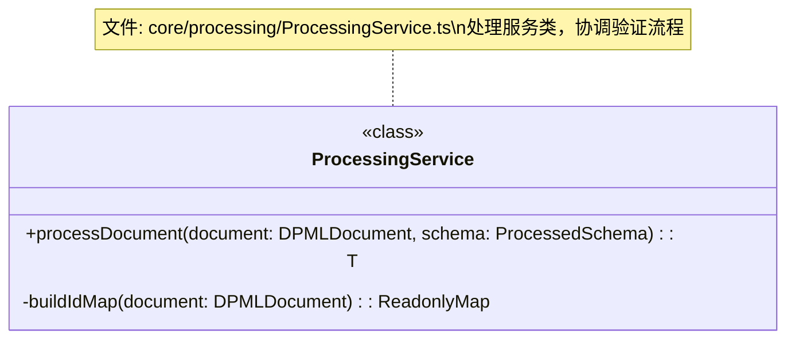
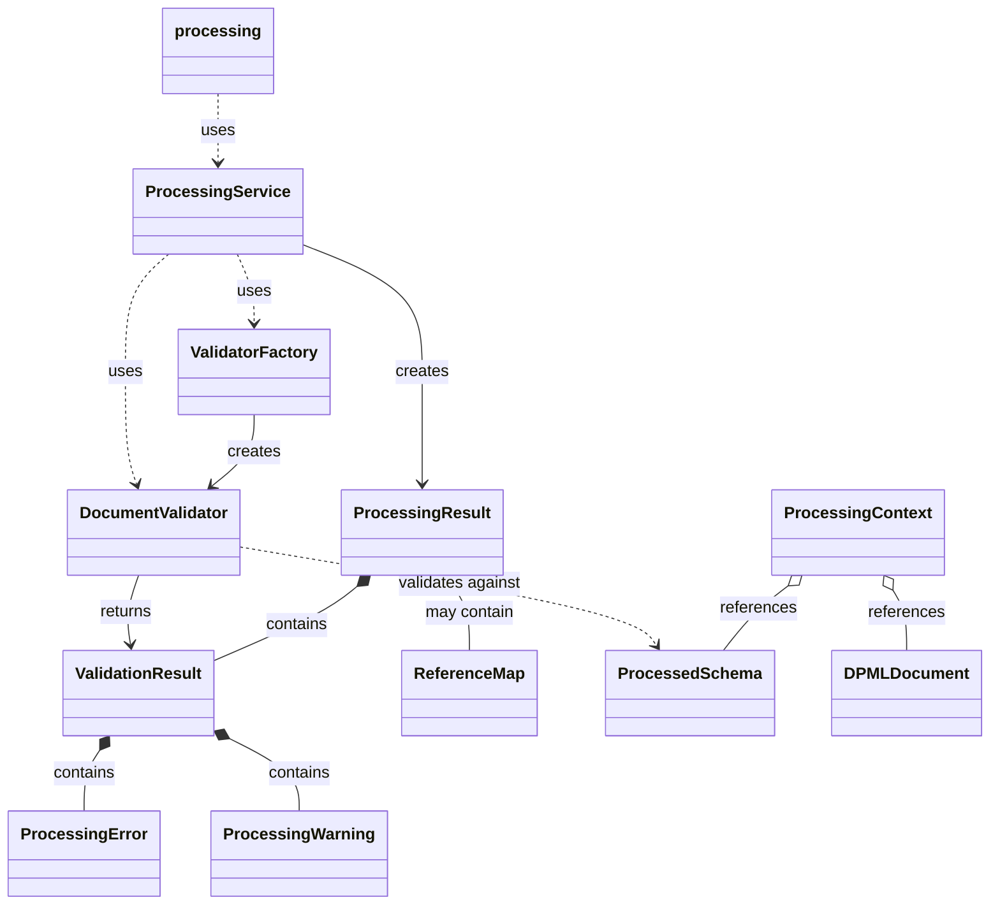
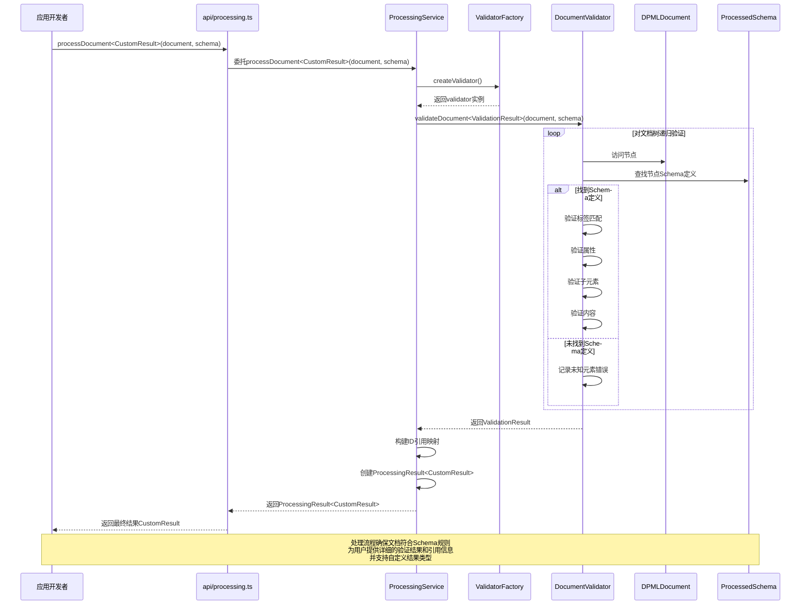

# DPML 处理模块设计文档

## 1. 概述

处理模块（Processing）是DPML核心中的关键组件，负责验证解析后的文档是否符合定义的Schema规则。它连接了解析模块和Schema模块，确保文档的语义有效性，并提供结构化的验证结果和引用信息。

### 1.1 设计目标

- **语义验证**：基于Schema规则验证文档语义的正确性
- **清晰报错**：提供精确、详细的错误和警告信息
- **引用处理**：建立和管理文档内的引用关系
- **结果容器**：提供统一的处理结果容器，支持未来功能扩展
- **API简洁**：提供直观的接口，降低使用门槛
- **类型安全**：利用TypeScript的类型系统确保API和结果的类型安全

## 2. 核心设计理念

基于项目需求和架构规范，我们确立了以下核心设计理念：

1. **通用结果容器**：
   - 设计灵活的处理结果容器，可容纳多种类型的处理信息
   - 当前聚焦于验证结果和引用映射
   - 预留扩展空间，支持未来功能增长

2. **验证与Schema分离**：
   - 处理模块接收已处理的Schema（ProcessedSchema）
   - 验证逻辑专注于文档与Schema的符合性
   - 避免与Schema内部实现产生过度耦合

3. **分层验证**：
   - 递归验证文档结构树
   - 分层次验证元素、属性、子元素和内容
   - 收集并聚合各层级的验证结果

4. **引用处理**：
   - 建立ID到节点的映射关系
   - 为跨文档引用和导航提供基础

5. **错误跟踪**：
   - 为每个错误和警告提供精确的位置信息
   - 区分错误和警告的严重程度
   - 提供清晰的错误代码和消息

6. **类型安全**：
   - 利用TypeScript的类型系统确保API的类型安全
   - 使用泛型支持不同的处理场景和结果类型
   - 提供明确的类型定义，减少运行时错误

## 3. 系统架构

DPML处理模块遵循项目整体架构规则，采用分层设计：

1. **API层** - 对外暴露处理功能
2. **模块服务层** - 组织处理服务
3. **执行组件** - 实现具体验证逻辑
4. **创建组件** - 管理验证器创建
5. **结果层** - 定义处理结果结构

## 4. 组件设计

### 4.1 API设计



API层简洁明了，仅暴露核心处理功能：
- 接收已解析的文档和已处理的Schema
- 返回统一的处理结果对象
- 支持通过泛型自定义结果类型

### 4.2 结果容器设计



#### 关键类型说明

- **ProcessingResult**：通用结果容器，整合所有处理信息
  - 包含处理上下文、验证结果和引用映射
  - 通过extensions属性提供类型安全的扩展机制
  - 所有属性都是只读的，确保不可变性

- **ValidationResult**：文档验证结果
  - 包含整体验证状态和详细错误/警告信息
  - 分离错误和警告，便于不同处理
  - 使用ReadonlyArray确保集合不可变

- **ReferenceMap**：ID引用映射
  - 建立ID到节点的映射关系，便于引用查找
  - 使用ReadonlyMap确保映射不可变

- **ProcessingError/Warning**：详细的问题描述
  - 包含问题代码、消息和位置信息
  - 区分错误和警告的严重程度
  - 所有属性都是只读的

### 4.3 验证器设计



DocumentValidator是处理模块的核心验证类，负责：
- 递归验证整个文档结构
- 查找每个节点对应的Schema定义
- 分层验证节点的不同方面（属性、子元素、内容）
- 收集并整合验证结果
- 通过泛型支持自定义验证结果类型

### 4.4 工厂组件设计



- **ValidatorFactory**：验证器工厂类
  - 负责创建DocumentValidator实例
  - 管理验证器的配置和生命周期
  - 确保验证器正确初始化

### 4.5 模块服务设计



- **ProcessingService**：处理流程服务类
  - 协调DocumentValidator的验证过程
  - 构建ID引用映射
  - 汇总处理结果
  - 支持通过泛型自定义结果类型

## 5. 组件关系图



## 6. 数据流

### 6.1 处理流程



## 7. 错误处理策略

处理模块采用了多层次的错误处理策略：

### 7.1 错误分类

- **结构错误**：元素不符合Schema结构定义
- **属性错误**：属性不符合规定的约束条件
- **子元素错误**：子元素不符合子元素规则
- **内容错误**：节点内容不符合内容规则
- **引用错误**：ID引用无效或缺失

### 7.2 错误严重程度

- **错误(Error)**：导致文档无效的严重问题
- **警告(Warning)**：潜在问题，但不影响文档基本有效性

### 7.3 错误位置

每个错误/警告都包含精确的位置信息：
- 文件名（如果有）
- 行号和列号
- 节点路径表示（如`/root/section[0]/paragraph[2]`）

这使IDE和其他工具可以精确定位到问题位置。

## 8. 未来扩展

处理模块设计了以下扩展点，以支持未来功能：

### 8.1 结果容器扩展

通过扩展接口，可以创建自定义的处理结果类型：

```typescript
// 定义扩展接口
interface TypeInfoExtension {
  readonly typeInfo: {
    readonly nodeTypes: ReadonlyMap<string, string>;
    readonly typeHierarchy: Readonly<Record<string, readonly string[]>>;
  };
}

interface PerformanceExtension {
  readonly performance: {
    readonly validationTime: number;
    readonly referenceMapBuildTime: number;
    readonly totalTime: number;
  };
}

interface SemanticExtension {
  readonly semantics: {
    readonly concepts: Readonly<Record<string, unknown>>;
    readonly relations: ReadonlyArray<readonly [string, string, string]>;
  };
}

// 组合多个扩展
type EnhancedProcessingResult = ProcessingResult & 
  TypeInfoExtension & 
  PerformanceExtension & 
  SemanticExtension;

// 使用扩展类型
const result: EnhancedProcessingResult = {
  context: { /* 上下文信息 */ },
  validation: { /* 验证结果 */ },
  references: { /* 引用映射 */ },
  
  // 类型化的扩展
  typeInfo: { 
    nodeTypes: new Map([['button', 'UIElement']]),
    typeHierarchy: { 'UIElement': ['Element', 'Node'] }
  },
  performance: { 
    validationTime: 15.3,
    referenceMapBuildTime: 2.7,
    totalTime: 18.0
  },
  semantics: {
    concepts: { 'form': { purpose: 'data-collection' } },
    relations: [['button', 'submits', 'form']]
  }
};
```

### 8.2 高级验证规则

未来可以扩展documentValidator以支持更复杂的验证规则：
- 跨元素依赖验证
- 条件验证规则
- 用户自定义验证函数
- 类型安全的验证规则配置

### 8.3 文档增强

在未来版本中，可以增强处理结果中的文档表示：
- 为节点添加类型信息
- 建立完整的引用关系图
- 添加语义标记
- 提供类型安全的扩展机制
- 支持通过泛型自定义结果类型

## 9. 用户使用方式

以下是应用开发者如何使用DPML处理模块的示例：

```typescript
import { parse, processSchema, processDocument } from '@dpml/core';

// 定义自定义处理结果类型
interface CustomProcessingResult extends ProcessingResult {
  readonly metadata: {
    readonly processingTime: number;
    readonly validatedElements: number;
    readonly validationDate: Date;
  };
}

// 第一步：解析文档
const document = parse('<button type="submit">提交</button>');

// 第二步：处理Schema
const buttonSchema = {
  element: "button",
  attributes: [
    { name: "type", enum: ["submit", "reset", "button"] }
  ],
  content: { type: "text", required: true }
};
const processedSchema = processSchema(buttonSchema);

// 第三步：验证文档，使用自定义结果类型
if (processedSchema.isValid) {
  const result = processDocument<CustomProcessingResult>(document, processedSchema);
  
  if (result.validation.isValid) {
    console.log("文档验证通过");
    console.log(`处理时间: ${result.metadata.processingTime}ms`);
    console.log(`验证了 ${result.metadata.validatedElements} 个元素`);
    
    // 使用引用映射（类型安全）
    const submitButton = result.references?.idMap.get("submit-btn");
    if (submitButton) {
      console.log(`找到按钮: ${submitButton.tagName}`);
    }
  } else {
    // 类型安全的错误处理
    result.validation.errors.forEach(error => {
      console.error(`错误 [${error.code}]: ${error.message} 位置: ${error.path}`);
      console.error(`在行 ${error.source.line}, 列 ${error.source.column}`);
    });
    
    // 类型安全的警告处理
    result.validation.warnings.forEach(warning => {
      console.warn(`警告 [${warning.code}]: ${warning.message}`);
    });
  }
}
```

## 10. 总结

DPML处理模块采用了清晰的分层架构和通用结果容器设计，提供了高效、可靠且类型安全的文档验证能力。它连接了解析模块和Schema模块，确保文档的语义正确性，并为IDE和其他工具提供了丰富的验证信息和引用数据。

通过利用TypeScript的类型系统，特别是泛型和不可变类型，处理模块实现了类型安全的API接口和结果类型。用户可以自定义处理结果类型，获得完整的类型推导和编译时验证，显著减少运行时错误的可能性。

当前的实现专注于基础验证功能和引用映射，并提供了类型安全的扩展机制，为未来功能扩展提供了坚实基础。

业务流程概览：

```
已解析文档 + 已处理Schema → API.processDocument<T> → 模块服务层 → 验证器 → 返回处理结果<T>（验证状态、错误/警告、引用映射）
``` 