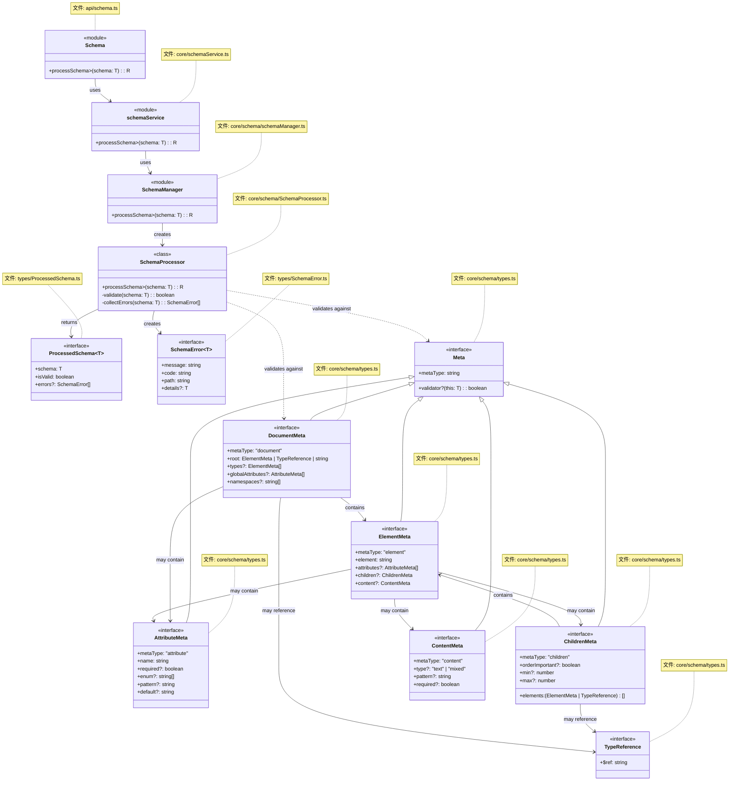
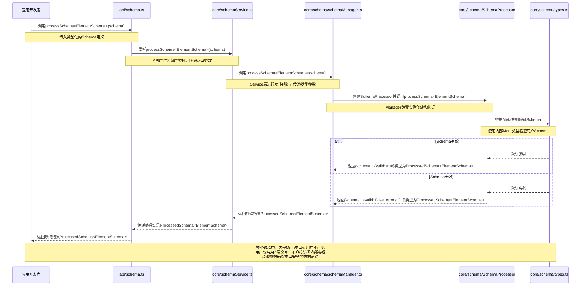

# DPML Schema设计文档

## 1. 概述

Schema模块是DPML核心的关键组成部分，负责处理和验证用户定义的Schema。它提供了一套元模型(Meta)系统，使应用开发者能够定义各种DPML元素的结构和约束。

### 1.1 设计目标

- **简明直观**：提供简单清晰的接口，减少学习成本
- **TypeScript友好**：充分利用TypeScript的类型系统进行编译时验证
- **职责单一**：专注于Schema的定义和基本处理，不涉及其他模块职责
- **可扩展性**：为未来功能（如normalize）预留扩展点
- **类型安全**：确保API和数据结构在编译时提供严格的类型检查

## 2. 核心设计理念

经过讨论，我们确立了以下核心设计理念：

1. **利用TypeScript类型系统**：
   - 依赖TypeScript进行编译时类型检查
   - 使用泛型提供灵活而类型安全的API
   - 运行时验证只用于必要的场景
   - 避免使用any和unknown等宽松类型
   - 为API和数据结构提供完整的类型定义

2. **职责边界清晰**：
   - Schema模块只负责Schema本身的处理和验证
   - DPML文档验证、IDE支持等功能由其他模块提供
   - 保持模块之间的清晰边界

3. **设计精简**：
   - 只为真正需要的功能建模
   - 避免过度抽象和预优化
   - 符合MVP（最小可行产品）原则

4. **内嵌验证**：
   - 验证逻辑与元模型定义紧密结合
   - 提供自定义validator函数机制
   - 支持声明式和命令式验证

5. **内外部边界明确**：
   - Meta模型是内部实现细节，由核心开发者维护
   - Schema定义由应用开发者创建，用于描述DPML文档结构
   - 对外API只提供Schema处理能力，不暴露Meta实现细节

## 3. 系统层次

DPML Schema系统包含三个层次：

1. **Meta层** - 由核心开发者定义和维护的元模型，描述Schema的结构规则
2. **Schema层** - 由应用开发者定义的具体Schema，描述DPML文档的结构
3. **文档层** - 最终用户创建的符合Schema的DPML文档

## 4. 类型系统设计

### 4.1 内部Meta类型

以下类型为内部实现，不对外暴露：

```typescript
// 基础Meta接口
interface Meta {
    metaType: string;
    validator?: <T extends Meta>(this: T) => boolean;
}

// 类型引用
interface TypeReference {
    $ref: string; // 引用types中定义的类型名称
}

// 文档Meta
interface DocumentMeta extends Meta {
    metaType: "document";
    root: ElementMeta | TypeReference | string;
    types?: ElementMeta[];
    globalAttributes?: AttributeMeta[];
    namespaces?: string[];
}

// 元素Meta
interface ElementMeta extends Meta {
    metaType: "element";
    element: string;
    attributes?: AttributeMeta[];
    children?: ChildrenMeta;
    content?: ContentMeta;
}

// 属性Meta
interface AttributeMeta extends Meta {
    metaType: "attribute";
    name: string;
    required?: boolean;
    enum?: string[];
    pattern?: string;
    default?: string;
}

// 子元素Meta
interface ChildrenMeta extends Meta {
    metaType: "children";
    elements: (ElementMeta | TypeReference)[];
    orderImportant?: boolean;
    min?: number;
    max?: number;
}

// 内容Meta
interface ContentMeta extends Meta {
    metaType: "content";
    type?: "text" | "mixed";
    pattern?: string;
    required?: boolean;
}
```

### 4.2 对外暴露的接口

```typescript
// 处理后的Schema结果
interface ProcessedSchema<T extends object = object> {
    schema: T;
    isValid: boolean;
    errors?: SchemaError[];
}

// Schema错误
interface SchemaError<T = unknown> {
    message: string;
    code: string;
    path: string;
    details?: T;
}
```

## 5. 组件设计

### 5.1 Schema处理器

SchemaProcessor负责处理Schema，包括验证和（未来的）normalize功能：

```typescript
class SchemaProcessor {
    constructor() {}
    
    // 公共处理方法
    processSchema<T extends object, R extends ProcessedSchema<T> = ProcessedSchema<T>>(schema: T): R {
        // 验证
        if (!this.validate(schema)) {
            return {
                schema,
                isValid: false,
                errors: this.collectErrors(schema)
            } as R;
        }
        
        // 当前仅返回原schema，未来可扩展normalize功能
        return {
            schema,
            isValid: true
        } as R;
    }
    
    // 私有验证方法
    private validate<T extends object>(schema: T): boolean {
        // 使用内部Meta规则验证Schema
        // ...内部实现
        return true;
    }
    
    // 预留的normalize方法(未来实现)
    // private normalize<T extends object>(schema: T): T {
    //     // 标准化处理...
    //     return schema;
    // }
    
    // 收集错误
    private collectErrors<T extends object>(schema: T): SchemaError[] {
        // 收集验证过程中的错误
        // ...内部实现
        return [];
    }
}
```

### 5.2 Manager层

```typescript
// schema/schemaManager.ts
export function processSchema<T extends object, R extends ProcessedSchema<T> = ProcessedSchema<T>>(schema: T): R {
    const processor = new SchemaProcessor();
    return processor.processSchema<T, R>(schema);
}
```

### 5.3 Service层

```typescript
// schemaService.ts
export { processSchema } from './schema/schemaManager';
```

### 5.4 API层

```typescript
// api/schema.ts
export { processSchema } from '../core/schemaService';
```

## 6. 类型引用机制

为了支持类型复用和明确的引用关系，Meta系统提供了TypeReference接口。这使得在文档中可以清晰地引用预定义的元素类型。

### 6.1 类型定义和引用示例

```typescript
// 类型引用接口
interface TypeReference {
    $ref: string;
}

// 创建一个包含类型定义的文档
interface DocumentWithTypes {
    metaType: "document";
    types: ElementDefinition[];
    root: ElementDefinition | TypeReference;
}

const documentMeta: DocumentWithTypes = {
  metaType: "document",
  
  // 定义可复用的元素类型
  types: [
    {
      metaType: "element",
      element: "button", 
      attributes: [
        {
          metaType: "attribute",
          name: "type",
          enum: ["submit", "reset", "button"]
        }
      ]
    },
    {
      metaType: "element",
      element: "input",
      attributes: [
        {
          metaType: "attribute",
          name: "value",
          required: false
        }
      ]
    }
  ],
  
  // 使用类型引用作为根元素
  root: { $ref: "button" } // 明确的引用
};

// 在其他元素中引用预定义类型
interface FormElementDefinition {
    metaType: "element";
    element: string;
    children: {
        metaType: "children";
        elements: Array<ElementDefinition | TypeReference>;
    };
}

const formMeta: FormElementDefinition = {
  metaType: "element",
  element: "form",
  children: {
    metaType: "children",
    elements: [
      { $ref: "input" },    // 引用预定义的input类型
      { $ref: "button" },   // 引用预定义的button类型
      {                     // 内联定义的元素类型
        metaType: "element",
        element: "label",
        content: {
          metaType: "content",
          type: "text"
        }
      }
    ]
  }
};
```

### 6.2 类型引用的优势

使用TypeReference进行类型引用而非简单的字符串引用有以下优势：

1. **类型安全** - 引用结构明确，易于在编译时和运行时验证
2. **语义清晰** - `{ $ref: "button" }` 比单独的 `"button"` 更明确表示这是引用
3. **兼容性** - 与JSON Schema等标准规范一致
4. **可扩展性** - 未来可以扩展引用机制，如添加命名空间等

Meta系统在处理过程中会解析这些引用，将它们替换为实际的元素类型定义。

## 7. 用户使用方式

以下是应用开发者如何使用DPML Schema系统的示例：

```typescript
import { processSchema } from '@dpml/core';

// 定义Schema类型
interface AttributeSchema {
    name: string;
    enum?: string[];
    required?: boolean;
    default?: string;
}

interface ContentSchema {
    type: "text" | "mixed";
    required?: boolean;
    pattern?: string;
}

interface ElementSchema {
    element: string;
    attributes?: AttributeSchema[];
    content?: ContentSchema;
}

// 定义一个Button组件的Schema
const buttonSchema: ElementSchema = {
    element: "button",
    attributes: [
        {
            name: "type",
            enum: ["submit", "reset", "button"],
            default: "button"
        },
        {
            name: "disabled",
            required: false
        }
    ],
    content: {
        type: "text",
        required: true
    }
};

// 处理Schema，使用泛型指定Schema类型
const processed = processSchema<ElementSchema>(buttonSchema);

if (processed.isValid) {
    
    
    // 类型安全的访问Schema属性
    const buttonElement = processed.schema.element; // 类型为string
    const buttonAttributes = processed.schema.attributes; // 类型为AttributeSchema[]
} else {
    // 类型安全的错误处理
    processed.errors?.forEach(error => {
        console.error(`错误 [${error.code}]: ${error.message} 在路径: ${error.path}`);
    });
}
```

## 8. 总结

DPML Schema模块采用了简明而灵活的设计，将Meta模型作为内部实现细节，只对外暴露Schema处理功能。通过清晰的职责划分和接口设计，它为DPML核心提供了坚实的基础，同时为未来扩展预留了空间。

该设计遵循了"职责单一"和"设计精简"的原则，同时利用TypeScript的类型系统提供了类型安全的API。通过泛型支持，用户可以获得更精确的类型推导和编译时检查，提高开发效率和代码质量。

业务流程概览：

```
用户定义Schema → API.processSchema<T> → Service层 → Manager层 → Schema处理器(内部使用Meta规则) → 返回处理结果ProcessedSchema<T>
``` 

## 9. UML 




## 10. 流程图


