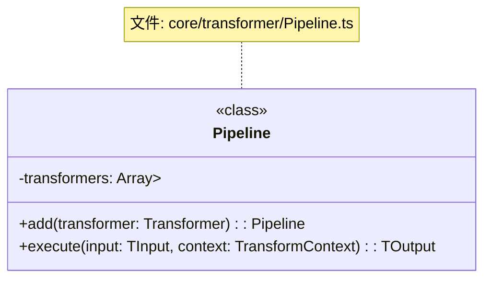
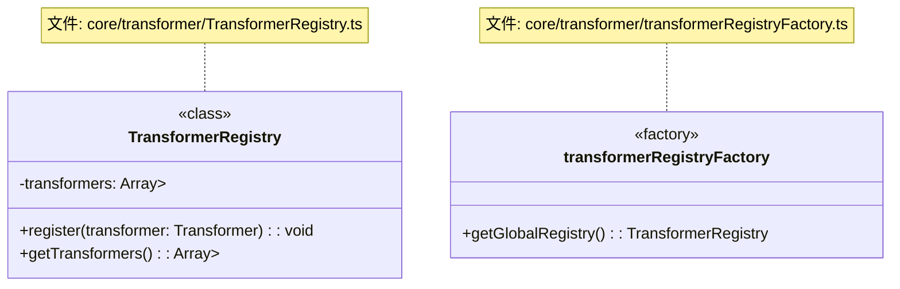
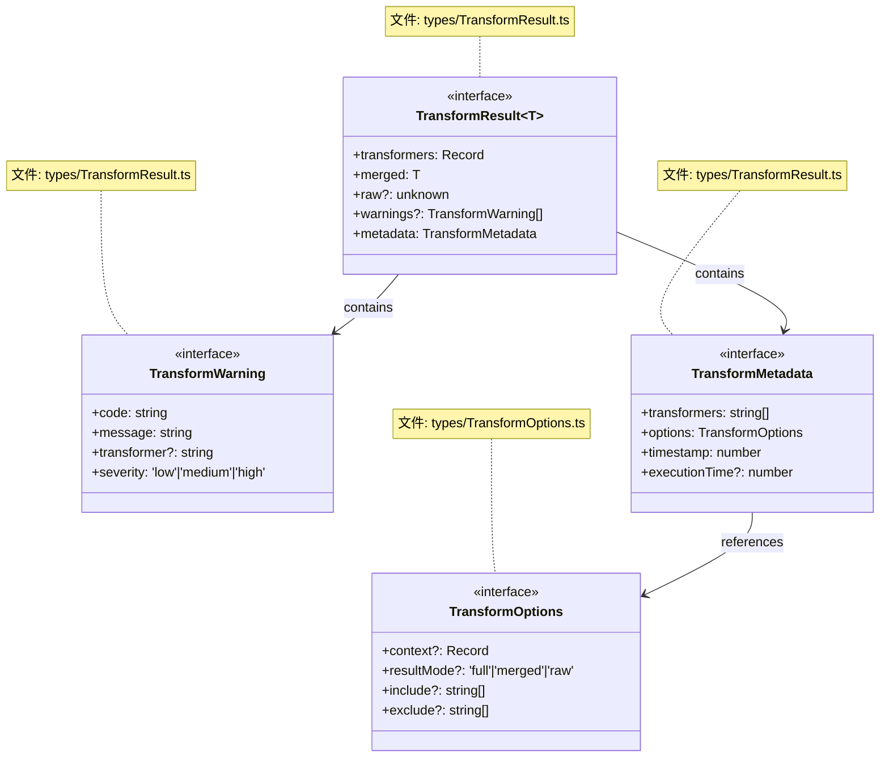
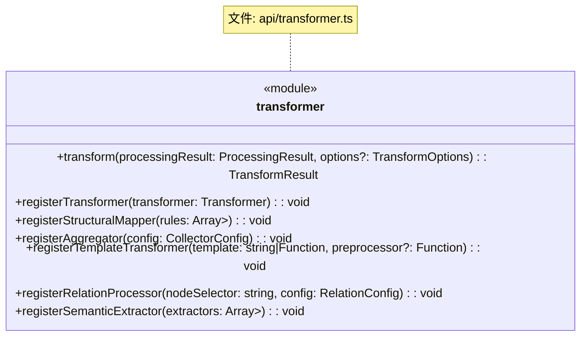

# DPML 转换模块设计文档

## 1. 概述

转换模块（Transformer）是DPML核心的重要组成部分，负责将处理后的DPML文档转换为各种目标格式或数据结构。它是整个处理流程的最后环节，将语法和语义处理的结果转化为可直接使用的形式。

### 1.1 设计目标

- **灵活性**：支持多种目标格式的转换，满足不同领域需求
- **可扩展性**：允许用户定义自己的转换器并无缝集成
- **组合能力**：支持多个转换器组合使用，构建复杂的转换流水线
- **语义提取**：提供从DPML中提取领域特定语义的能力
- **关注点分离**：每个转换器专注于特定转换类型，便于组合和复用
- **类型安全**：利用TypeScript的类型系统确保API和数据结构的类型安全

## 2. 核心设计理念

经过讨论，我们确立了以下核心设计理念：

1. **管道架构**：
   - 采用管道（Pipeline）模式组织多个转换器
   - 允许转换器按顺序执行，形成转换链
   - 每个转换器专注于转换过程的特定方面

2. **统一接口**：
   - 所有转换器实现相同的接口
   - 确保转换器之间的互操作性
   - 便于用户创建自定义转换器

3. **上下文共享**：
   - 在转换过程中维护和传递上下文信息
   - 允许转换器间共享数据和状态
   - 提供对处理结果的全面访问
   - 每个转换器可以独立存储其结果到上下文中

4. **核心与扩展分离**：
   - 核心转换能力由框架提供
   - 具体领域转换逻辑由用户通过扩展提供
   - 保持核心简洁稳定，同时支持丰富的扩展可能

5. **声明式配置**：
   - 提供简洁的API创建和配置转换器
   - 支持声明式定义转换规则
   - 降低使用门槛和学习成本

6. **结构化结果**：
   - 提供一致的结果结构接口
   - 支持不同的结果呈现模式
   - 清晰区分各转换器的输出
   - 提供富有上下文的元数据

7. **类型安全设计**：
   - 利用TypeScript的泛型系统提供类型安全的API
   - 确保在编译时捕获类型错误
   - 支持自定义类型的转换流程
   - 避免使用any和unknown等宽松类型

## 3. 系统架构

DPML转换模块遵循项目的整体架构规则，采用分层设计：

1. **API层** - 对外暴露转换功能和转换器注册能力，作为薄层委托Core层功能
2. **Types层** - 定义转换相关的数据结构，保持纯数据类型定义
3. **Core层** - 包含所有内部实现，主要分为：
   - **模块服务层** - 提供业务功能，实现转换服务，协调领域组件
   - **业务实现层** - 实现具体转换逻辑和组件，现位于framework模块

整体架构如下：

```
┌───────────────────────────────────────────────────────────────┐
│                          API层                                │
│  transform, registerTransformer, registerStructuralMapper...  │
└───────────────────────────────┬───────────────────────────────┘
                               │
┌───────────────────────────────┴───────────────────────────────┐
│                         Types层                               │
│            转换相关的数据类型和接口定义                          │
└───────────────────────────────┬───────────────────────────────┘
                               │
┌───────────────────────────────┴───────────────────────────────┐
│                         Core层                                │
│  ┌────────────────────────────────────────────────────────┐   │
│  │               transformerService (模块服务)             │   │
│  │           实现业务逻辑，协调转换流程和转换器注册             │   │
│  └──────────┬─────────────────┬───────────────────────────┘   │
│             │                 │                               │
│  ┌──────────▼─────────┐  ┌────▼─────────────────────────┐     │
│  │    transformer     │  │    framework                 │     │
│  │     模块组件        │  │    模块组件                   │     │
│  │                    │  │                              │     │
│  │  - Pipeline        │  │  - StructuralMapperTransformer │   │
│  │  - TransformerRegistry│ - AggregatorTransformer      │     │
│  │                    │  │  - TemplateTransformer       │     │
│  │                    │  │  - 其他转换器实现              │     │
│  │                    │  │  - transformerFactory        │     │
│  └────────────────────┘  └──────────────────────────────┘     │
└───────────────────────────────────────────────────────────────┘
```

这个架构反映了当前的设计，其中转换器实现（如StructuralMapperTransformer、AggregatorTransformer等）已从transformer模块迁移到framework模块，而Pipeline和TransformerRegistry等基础组件仍保留在transformer模块中。这种设计使transformer模块保持纯净，只包含框架组件和运行逻辑，而所有具体实现都位于framework模块中。

## 4. 组件设计

### 4.1 数据类型设计

```mermaid
classDiagram
    class Transformer~TInput, TOutput~ {
        <<interface>>
        +transform(input: TInput, context: TransformContext): TOutput
        +name?: string
    }
    note for Transformer "文件: types/Transformer.ts"
    
    class TransformContext {
        <<class>>
        -data: Map<string, unknown>
        -processingResult: ProcessingResult
        +constructor(processingResult: ProcessingResult, initialData?: Record<string, unknown>)
        +set<T>(key: string, value: T): void
        +get<T>(key: string): T | undefined
        +has(key: string): boolean
        +getDocument(): DPMLDocument
        +getReferences(): ReferenceMap | undefined
        +isDocumentValid(): boolean
        +getAllResults(): Record<string, unknown>
    }
    note for TransformContext "文件: types/TransformContext.ts"
    
    class MappingRule~TValue, TResult~ {
        <<interface>>
        +selector: string
        +targetPath: string
        +transform?: (value: TValue) => TResult
    }
    note for MappingRule "文件: types/MappingRule.ts"
    
    class CollectorConfig {
        <<interface>>
        +selector: string
        +groupBy?: string
        +sortBy?: string
    }
    note for CollectorConfig "文件: types/CollectorConfig.ts"
    
    class RelationConfig {
        <<interface>>
        +source: string
        +target: string
        +type?: string
    }
    note for RelationConfig "文件: types/RelationConfig.ts"
    
    class SemanticExtractor~TElement, TResult~ {
        <<interface>>
        +name: string
        +selector: string
        +processor: (elements: TElement[]) => TResult
    }
    note for SemanticExtractor "文件: types/SemanticExtractor.ts"
```



#### 关键类型说明

- **Transformer**：定义转换器的核心接口，所有转换器必须实现此接口，支持泛型输入和输出类型
- **TransformContext**：转换上下文，维护状态并提供对处理结果的访问，支持类型安全的数据存储和获取
- **MappingRule**：映射规则，用于结构映射转换，支持泛型值转换
- **CollectorConfig**：收集配置，用于聚合转换
- **RelationConfig**：关系配置，用于关系处理转换
- **SemanticExtractor**：语义提取器配置，用于语义提取转换，支持泛型元素处理

### 4.2 管道设计



Pipeline是一个**协调组件**，负责：
- 管理转换器链
- 顺序执行转换器
- 在转换器之间传递数据和上下文
- 支持类型安全的转换流程

### 4.3 转换器注册表设计



TransformerRegistry是一个**状态管理组件**，负责：
- 存储已注册的转换器
- 提供添加和获取转换器的接口
- 作为全局注册表供转换过程使用
- 支持类型安全的转换器注册

### 4.4 转换器设计

```mermaid
classDiagram
    class StructuralMapperTransformer~TInput, TOutput~ {
        <<class>>
        -mappingRules: Array<MappingRule<unknown, unknown>>
        +name: string
        +description: string
        +type: string
        +constructor(mappingRules: Array<MappingRule<unknown, unknown>>)
        +transform(input: TInput, context: TransformContext): TOutput
    }
    note for StructuralMapperTransformer "文件: core/transformer/StructuralMapperTransformer.ts"
    
    class AggregatorTransformer~TInput, TOutput~ {
        <<class>>
        -collectorConfig: CollectorConfig
        +name: string
        +description: string 
        +type: string
        +constructor(collectorConfig: CollectorConfig)
        +transform(input: TInput, context: TransformContext): TOutput
    }
    note for AggregatorTransformer "文件: core/transformer/AggregatorTransformer.ts"
    
    class TemplateTransformer~TInput~ {
        <<class>>
        -template: string | ((data: unknown) => string)
        -dataPreprocessor?: (input: TInput) => unknown
        +name: string
        +description: string
        +type: string
        +constructor(template: string | ((data: unknown) => string), dataPreprocessor?: (input: TInput) => unknown)
        +transform(input: TInput, context: TransformContext): string
    }
    note for TemplateTransformer "文件: core/transformer/TemplateTransformer.ts"
    
    class RelationProcessorTransformer~TInput, TOutput~ {
        <<class>>
        -nodeSelector: string
        -relationConfig: RelationConfig
        +name: string
        +description: string
        +type: string
        +constructor(nodeSelector: string, relationConfig: RelationConfig)
        +transform(input: TInput, context: TransformContext): TOutput
    }
    note for RelationProcessorTransformer "文件: core/transformer/RelationProcessorTransformer.ts"
    
    class SemanticExtractorTransformer~TInput, TOutput~ {
        <<class>>
        -extractors: Array<SemanticExtractor<unknown, unknown>>
        +name: string
        +description: string
        +type: string
        +constructor(extractors: Array<SemanticExtractor<unknown, unknown>>)
        +transform(input: TInput, context: TransformContext): TOutput
    }
    note for SemanticExtractorTransformer "文件: core/transformer/SemanticExtractorTransformer.ts"

    class ResultCollectorTransformer~TOutput~ {
        <<class>>
        -transformerNames: string[]
        +name: string
        +description: string
        +type: string
        +constructor(transformerNames?: string[])
        +transform(input: unknown, context: TransformContext): TOutput
    }
    note for ResultCollectorTransformer "文件: core/transformer/ResultCollectorTransformer.ts"
    
    class Transformer~TInput, TOutput~ {
        <<interface>>
        +name: string
        +description?: string
        +type?: string
        +transform(input: TInput, context: TransformContext): TOutput
    }
    
    Transformer <|.. StructuralMapperTransformer : implements
    Transformer <|.. AggregatorTransformer : implements
    Transformer <|.. TemplateTransformer : implements
    Transformer <|.. RelationProcessorTransformer : implements
    Transformer <|.. SemanticExtractorTransformer : implements
    Transformer <|.. ResultCollectorTransformer : implements
```



#### 转换器类型说明

1. **结构映射转换器（StructuralMapperTransformer）**：
   - 将DPML结构映射到目标数据结构
   - 基于选择器提取信息并按目标路径组织
   - 适合配置提取和数据格式转换
   - 支持泛型输入和输出类型
   - 属于**执行组件**类别，专注执行映射转换

2. **聚合转换器（AggregatorTransformer）**：
   - 收集和组合分散在文档中的元素
   - 支持分组和排序能力
   - 适合提示词分段和内容聚合
   - 支持泛型输入和输出类型
   - 属于**执行组件**类别，专注执行聚合操作

3. **模板转换器（TemplateTransformer）**：
   - 基于模板生成文本或结构化输出
   - 支持函数式和字符串模板
   - 适合生成最终格式化输出
   - 支持泛型输入类型，输出固定为字符串
   - 属于**执行组件**类别，专注执行模板渲染

4. **关系处理转换器（RelationProcessorTransformer）**：
   - 处理元素间的关系和引用
   - 构建关系图结构
   - 适合工作流和节点关系处理
   - 支持泛型输入和输出类型
   - 属于**执行组件**类别，专注执行关系处理

5. **语义提取转换器（SemanticExtractorTransformer）**：
   - 提取特定领域的语义信息
   - 支持多个提取器组合工作
   - 适合复杂领域概念的识别和提取
   - 支持泛型输入和输出类型
   - 属于**执行组件**类别，专注执行语义提取

6. **结果收集转换器（ResultCollectorTransformer）**：
   - 收集管道中各转换器的结果
   - 可以选择性包含特定转换器的结果
   - 作为管道的最后一个转换器整合最终输出
   - 支持泛型输出类型
   - 属于**执行组件**类别，专注执行结果收集和整合

### 4.5 转换结果设计



#### 4.5.1 TransformResult详解

`TransformResult<T>`接口是转换模块的核心输出类型，提供了灵活而强大的结果呈现方式。这里的泛型参数`T`表示预期的最终合并结果类型，通过在调用`transform<T>`函数时指定。

```typescript
// 使用TransformResult的示例
interface LLMConfig {
  parameters: {
    temperature: number;
    maxTokens: number;
  };
  settings: {
    key: string;
  };
}

// 指定泛型参数T为LLMConfig
const result = Transformer.transform<LLMConfig>(processingResult);

// 此时result.merged的类型被推导为LLMConfig
const temp = result.merged.parameters.temperature; // 类型安全
```

**字段详解**：

1. **transformers**：包含所有转换器的结果，按转换器名称组织成层级结构
   - 类型为`Record<string, unknown>`
   - 每个转换器的结果被隔离保存，便于调试和分析
   - 访问时通常需要类型断言：`const data = result.transformers.myTransformer as MyType;`

2. **merged**：所有转换器结果的扁平化合并
   - 类型为`T`（用户指定的泛型参数）
   - 应用深度合并策略，将所有转换器的结果合并到一个对象
   - 提供类型安全的结果访问

3. **raw**：最后一个转换器的原始输出
   - 类型为`unknown`
   - 未经任何后处理的原始结果
   - 适用于需要特定格式输出的场景

4. **warnings**：转换过程中可能产生的警告信息
   - 非阻断性问题的提示
   - 帮助调试和优化转换流程

5. **metadata**：转换过程的元数据
   - 包含执行时间、使用的转换器等信息
   - 用于分析和监控转换过程

#### 4.5.2 结果模式详解

`transform`函数通过`TransformOptions`中的`resultMode`选项支持三种不同的结果模式，每种模式提供不同级别的详细信息：

1. **完整模式('full')**
   ```typescript
   const result = Transformer.transform<MyType>(data, { resultMode: 'full' });
   ```
   - 返回完整的`TransformResult<T>`对象，包含所有字段
   - 提供最详细的转换信息，包括每个转换器的独立结果、合并结果和原始输出
   - 适合开发调试和需要详细分析的场景
   - 结果结构示例：
     ```typescript
     {
       transformers: {
         structuralMapper: { ... },
         semanticExtractor: { ... },
         templateTransformer: { ... }
       },
       merged: { ... },  // 类型为T
       raw: ...,         // 最后一个转换器的原始输出
       warnings: [ ... ],
       metadata: { ... }
     }
     ```

2. **合并模式('merged')**
   ```typescript
   const result = Transformer.transform<MyType>(data, { resultMode: 'merged' });
   ```
   - 只返回合并结果，忽略各转换器的独立结果和原始输出
   - 提供更简洁的输出，专注于最终合并数据
   - 适合生产环境和只关心最终结果的场景
   - 结果结构示例：
     ```typescript
     {
       merged: { ... },  // 类型为T
       warnings: [ ... ],
       metadata: { ... }
     }
     ```

3. **原始模式('raw')**
   ```typescript
   const result = Transformer.transform<unknown>(data, { resultMode: 'raw' });
   ```
   - 只返回最后一个转换器的原始输出
   - 提供最简洁的输出，不进行任何合并或后处理
   - 适合需要特定格式输出或与旧系统集成的场景
   - 结果结构示例：
     ```typescript
     {
       raw: ...,         // 最后一个转换器的原始输出
       warnings: [ ... ],
       metadata: { ... }
     }
     ```

#### 4.5.3 合并策略详解

`merged`字段生成时遵循以下合并规则：

1. **命名空间合并**：每个转换器的结果以扁平方式合并到一个对象中
   ```typescript
   // transformers中的结果
   {
     transformer1: { a: 1, b: 2 },
     transformer2: { c: 3, d: 4 }
   }
   
   // 合并后的merged
   {
     a: 1, b: 2, c: 3, d: 4
   }
   ```

2. **冲突解决**：当多个转换器产生同名属性时，后注册的转换器结果优先
   ```typescript
   // transformers中的结果
   {
     transformer1: { a: 1 },
     transformer2: { a: 2 }
   }
   
   // 合并后的merged
   {
     a: 2  // transformer2的结果覆盖transformer1
   }
   ```

3. **深度合并**：嵌套对象会递归合并
   ```typescript
   // transformers中的结果
   {
     transformer1: { settings: { theme: 'light' } },
     transformer2: { settings: { lang: 'en' } }
   }
   
   // 合并后的merged
   {
     settings: {
       theme: 'light',
       lang: 'en'
     }
   }
   ```

这种灵活的合并策略使转换结果既可以保持独立性（通过`transformers`字段），又可以提供统一视图（通过`merged`字段），满足不同使用场景的需求。

### 4.6 API设计



#### API职责

- **transform**: 执行转换过程，返回规范的结果结构，支持泛型指定结果类型
- **registerTransformer**: 注册自定义转换器，支持泛型定义输入和输出类型
- **便捷注册方法**: 为各种内置转换器类型提供快捷注册API，支持泛型类型安全

## 5. 组件关系图

以下是转换模块的详细组件关系图:

```mermaid
classDiagram
    %% API层
    class transformer {
        <<module>> 
        +transform<T>(processingResult: ProcessingResult, options?: TransformOptions): TransformResult<T>
        +registerTransformer<TInput, TOutput>(transformer: Transformer<TInput, TOutput>): void
        +registerStructuralMapper<TInput, TOutput>(rules: Array<MappingRule<unknown, unknown>>): void
        +registerAggregator<TInput, TOutput>(config: CollectorConfig): void
        +registerTemplateTransformer<TInput>(template: string|Function, preprocessor?: Function): void
        +registerRelationProcessor<TInput, TOutput>(nodeSelector: string, config: RelationConfig): void
        +registerSemanticExtractor<TInput, TOutput>(extractors: Array<SemanticExtractor<unknown, unknown>>): void
    }
    
    %% 类型定义
    class Transformer~TInput, TOutput~ {
        <<interface>>
        +name: string
        +description?: string
        +type?: string
        +transform(input: TInput, context: TransformContext): TOutput
    }
    
    class TransformContext {
        <<class>>
        -data: Map<string, unknown>
        -processingResult: ProcessingResult
        +constructor(processingResult: ProcessingResult, initialData?: Record<string, unknown>)
        +set<T>(key: string, value: T): void
        +get<T>(key: string): T | undefined
        +has(key: string): boolean
        +getDocument(): DPMLDocument
        +getReferences(): ReferenceMap | undefined
        +isDocumentValid(): boolean
        +getAllResults(): Record<string, unknown>
    }
    
    class TransformResult~T~ {
        <<interface>>
        +transformers: Record<string, unknown>
        +merged: T
        +raw?: unknown
        +warnings?: TransformWarning[]
        +metadata: TransformMetadata
    }
    
    class TransformOptions {
        <<interface>>
        +context?: Record<string, unknown>
        +resultMode?: 'full'|'merged'|'raw'
        +include?: string[]
        +exclude?: string[]
    }
    
    %% 模块服务层
    class transformerService {
        <<module>>
        +transform<T>(processingResult: ProcessingResult, options?: TransformOptions): TransformResult<T>
        +registerTransformer<TInput, TOutput>(transformer: Transformer<TInput, TOutput>): void
        +registerStructuralMapper<TInput, TOutput>(rules: Array<MappingRule<unknown, unknown>>): void
        +registerAggregator<TInput, TOutput>(config: CollectorConfig): void
        +registerTemplateTransformer<TInput>(template: string|Function, preprocessor?: Function): void
        +registerRelationProcessor<TInput, TOutput>(nodeSelector: string, config: RelationConfig): void
        +registerSemanticExtractor<TInput, TOutput>(extractors: Array<SemanticExtractor<unknown, unknown>>): void
        -getPipeline(): Pipeline
    }
    
    %% 核心组件
    class Pipeline {
        <<class>>
        -transformers: Array<Transformer<unknown, unknown>>
        +add<TInput, TOutput>(transformer: Transformer<TInput, TOutput>): Pipeline
        +execute<TInput, TOutput>(input: TInput, context: TransformContext): TOutput
    }
    
    class TransformerRegistry {
        <<class>>
        -transformers: Array<Transformer<unknown, unknown>>
        +register<TInput, TOutput>(transformer: Transformer<TInput, TOutput>): void
        +getTransformers(): Array<Transformer<unknown, unknown>>
    }
    
    %% 转换器实现
    class StructuralMapperTransformer~TInput, TOutput~ {
        <<class>>
        -mappingRules: Array<MappingRule<unknown, unknown>>
        +name: string
        +description: string
        +type: string
        +transform(input: TInput, context: TransformContext): TOutput
    }
    
    class AggregatorTransformer~TInput, TOutput~ {
        <<class>>
        -collectorConfig: CollectorConfig
        +name: string
        +description: string 
        +type: string
        +transform(input: TInput, context: TransformContext): TOutput
    }
    
    class TemplateTransformer~TInput~ {
        <<class>>
        -template: string | Function
        -dataPreprocessor?: Function
        +name: string
        +description: string
        +type: string
        +transform(input: TInput, context: TransformContext): string
    }
    
    class RelationProcessorTransformer~TInput, TOutput~ {
        <<class>>
        -nodeSelector: string
        -relationConfig: RelationConfig
        +name: string
        +description: string
        +type: string
        +transform(input: TInput, context: TransformContext): TOutput
    }
    
    class SemanticExtractorTransformer~TInput, TOutput~ {
        <<class>>
        -extractors: Array<SemanticExtractor<unknown, unknown>>
        +name: string
        +description: string
        +type: string
        +transform(input: TInput, context: TransformContext): TOutput
    }
    
    class ResultCollectorTransformer~TOutput~ {
        <<class>>
        -transformerNames: string[]
        +name: string
        +description: string
        +type: string
        +transform(input: unknown, context: TransformContext): TOutput
    }
    
    %% 工厂类
    class transformerFactory {
        <<factory>>
        +createStructuralMapper<TInput, TOutput>(rules: Array<MappingRule<unknown, unknown>>): StructuralMapperTransformer<TInput, TOutput>
        +createAggregator<TInput, TOutput>(config: CollectorConfig): AggregatorTransformer<TInput, TOutput>
        +createTemplateTransformer<TInput>(template: string|Function, preprocessor?: Function): TemplateTransformer<TInput>
        +createRelationProcessor<TInput, TOutput>(nodeSelector: string, config: RelationConfig): RelationProcessorTransformer<TInput, TOutput>
        +createSemanticExtractor<TInput, TOutput>(extractors: Array<SemanticExtractor<unknown, unknown>>): SemanticExtractorTransformer<TInput, TOutput>
        +createResultCollector<TOutput>(transformerNames?: string[]): ResultCollectorTransformer<TOutput>
    }
    
    %% 关系定义
    transformer --> transformerService : 委托
    transformerService --> Pipeline : 创建并使用
    transformerService --> TransformerRegistry : 使用
    transformerService --> transformerFactory : 使用
    Pipeline --> Transformer : 包含
    TransformerRegistry --> Transformer : 存储
    Transformer <|.. StructuralMapperTransformer : 实现
    Transformer <|.. AggregatorTransformer : 实现
    Transformer <|.. TemplateTransformer : 实现
    Transformer <|.. RelationProcessorTransformer : 实现
    Transformer <|.. SemanticExtractorTransformer : 实现
    Transformer <|.. ResultCollectorTransformer : 实现
    transformerFactory ..> StructuralMapperTransformer : 创建
    transformerFactory ..> AggregatorTransformer : 创建
    transformerFactory ..> TemplateTransformer : 创建
    transformerFactory ..> RelationProcessorTransformer : 创建
    transformerFactory ..> SemanticExtractorTransformer : 创建
    transformerFactory ..> ResultCollectorTransformer : 创建
    transformer ..> TransformResult : 返回
    transformer ..> TransformOptions : 使用
    transformerService ..> TransformContext : 创建
    transformerService ..> TransformResult : 创建并返回
    
    %% 额外数据类型
    class MappingRule~TValue, TResult~ {
        <<interface>>
        +selector: string
        +targetPath: string
        +transform?: (value: TValue) => TResult
    }
    
    class CollectorConfig {
        <<interface>>
        +selector: string
        +groupBy?: string
        +sortBy?: string
    }
    
    class RelationConfig {
        <<interface>>
        +source: string
        +target: string
        +type?: string
    }
    
    class SemanticExtractor~TElement, TResult~ {
        <<interface>>
        +name: string
        +selector: string
        +processor: (elements: TElement[]) => TResult
    }
    
    StructuralMapperTransformer --> MappingRule : 使用
    AggregatorTransformer --> CollectorConfig : 使用
    RelationProcessorTransformer --> RelationConfig : 使用
    SemanticExtractorTransformer --> SemanticExtractor : 使用
```



## 6. 执行流程

转换模块的典型执行流程如下:

1. **初始化**:
   - 用户通过API注册所需的转换器，可指定泛型类型
   - 每个转换器被添加到全局注册表中，保持类型信息

2. **转换请求**:
   - 用户调用`transform<T>`函数，传入处理结果和选项，指定期望的输出类型
   - API层将请求直接委托给Core层的transformerService，保留泛型类型参数

3. **准备转换**:
   - 模块服务从注册表获取已注册的转换器
   - 创建一个Pipeline并按注册顺序添加转换器
   - 创建转换上下文(TransformContext)，包含处理结果和初始数据

4. **执行管道**:
   - Pipeline依次执行每个转换器的`transform`方法
   - 每个转换器可以类型安全地从上下文读取数据，也可以向上下文写入结果
   - 每个转换器的输出作为下一个转换器的输入，保持类型兼容性

5. **结果整合**:
   - 根据选项的`resultMode`，整合所有转换器的结果
   - 收集转换过程中的警告信息
   - 构建元数据，包括使用的转换器、选项和执行时间等

6. **返回结果**:
   - 构建符合`TransformResult<T>`接口的结果对象，T为用户指定的类型
   - 结果通过委托关系返回给API层，最终返回给用户

### 6.1 转换结果模式

转换模块支持三种结果模式:

1. **完整模式('full')**:
   - 包含所有转换器的命名结果
   - 包含合并后的结果对象，类型为T
   - 包含原始管道输出
   - 适合调试和详细分析

2. **合并模式('merged')**:
   - 只包含合并后的结果对象，类型为T
   - 所有转换器结果被扁平化合并到一个对象
   - 适合简洁使用场景

3. **原始模式('raw')**:
   - 只包含管道的最终输出
   - 最简洁但信息最少
   - 适合与旧代码兼容

### 6.2 上下文共享机制

转换模块的上下文共享机制允许:

1. **状态传递**:
   - 转换器之间共享数据和状态
   - 避免重复计算和处理

2. **数据命名空间**:
   - 每个转换器可以在独立的命名空间存储结果
   - 防止不同转换器之间的数据冲突

3. **访问处理结果**:
   - 所有转换器可以访问处理结果中的文档、验证结果和引用
   - 为转换提供丰富的上下文信息

4. **用户数据注入**:
   - 允许用户在转换开始前提供初始数据
   - 支持外部参数和配置的注入

### 6.3 管道执行模式详解

转换模块的管道执行采用串联模式，但允许灵活的数据访问：

#### 6.3.1 串联执行模式

转换器在Pipeline中按注册顺序执行，形成一个数据处理链：

```
原始输入 → 转换器A → 转换器B → 转换器C → ... → 最终输出
```

这种串联模式的工作原理如下：

```typescript
// Pipeline核心执行逻辑(简化)
class Pipeline {
  private transformers: Array<Transformer<unknown, unknown>> = [];
  
  execute<TInput, TOutput>(input: TInput, context: TransformContext): TOutput {
    let result: any = input;
    
    // 按顺序执行每个转换器
    for (const transformer of this.transformers) {
      // 前一个转换器的输出作为下一个的输入
      result = transformer.transform(result, context);
      
      // 可选：将结果存储到上下文
      if (transformer.name) {
        context.set(transformer.name, result);
      }
    }
    
    return result as TOutput;
  }
}
```

串联模式的优势：
- 数据流向清晰，易于理解
- 每个转换器专注于单一职责
- 转换器可以灵活组合，构建复杂转换链
- 支持渐进式转换，逐步细化数据

#### 6.3.2 上下文访问模式

尽管转换器的主要数据流是串联的，但转换模块提供了另一条数据通道 - TransformContext：

```typescript
class SomeTransformer implements Transformer<InputType, OutputType> {
  transform(input: InputType, context: TransformContext): OutputType {
    // 主数据流 - 处理input
    const processedData = this.processInput(input);
    
    // 上下文访问 - 获取原始数据或其他转换器的结果
    const originalDocument = context.getDocument();
    const otherTransformerResult = context.get<OtherResult>('otherTransformer');
    
    // 将结果写入上下文以供后续转换器使用
    context.set('intermediateResult', someData);
    
    // 返回结果作为下一个转换器的输入
    return this.createOutput(processedData, originalDocument);
  }
}
```

这种双通道设计提供了极大的灵活性：

1. **绕过串联限制**：转换器可以通过上下文访问任何先前转换器的结果，不局限于直接前驱
2. **访问原始数据**：任何转换器都可以通过`context.getDocument()`访问原始文档
3. **共享中间状态**：转换器可以将中间状态存入上下文，供其他转换器使用
4. **隔离数据流**：通过命名空间机制避免数据冲突

#### 6.3.3 数据流模式选择

在实际应用中，可以根据需求选择适当的数据流模式：

1. **纯串联模式**：当转换过程是线性的，每个步骤都基于前一步骤的结果时
   ```typescript
   // 转换器A处理原始输入
   class TransformerA implements Transformer<Document, StructureData> {
     transform(doc: Document): StructureData {
       return extractStructure(doc);
     }
   }
   
   // 转换器B处理A的输出
   class TransformerB implements Transformer<StructureData, EnrichedData> {
     transform(structure: StructureData): EnrichedData {
       return enrichStructure(structure);
     }
   }
   ```

2. **上下文访问模式**：当需要访问原始数据或非直接前驱转换器的结果时
   ```typescript
   class EnhancedTransformer implements Transformer<PartialData, OutputData> {
     transform(partialData: PartialData, context: TransformContext): OutputData {
       // 访问原始文档
       const originalDoc = context.getDocument();
       
       // 访问特定转换器的结果，即使不是直接前驱
       const metadata = context.get<Metadata>('metadataExtractor');
       
       // 结合多种数据源创建输出
       return combineData(partialData, originalDoc, metadata);
     }
   }
   ```

3. **混合模式**：同时利用串联和上下文访问，最大化灵活性
   ```typescript
   class HybridTransformer implements Transformer<InputData, OutputData> {
     transform(input: InputData, context: TransformContext): OutputData {
       // 处理主数据流
       const processed = this.processInput(input);
       
       // 增强数据，使用上下文中的其他信息
       const enhanced = this.enhanceWithContext(processed, context);
       
       // 存储中间结果供后续使用
       context.set('processedByHybrid', processed);
       
       return enhanced;
     }
   }
   ```

这种灵活的执行模式设计使转换模块能够适应各种复杂的数据转换场景，既保持简单明了的主数据流，又支持复杂的数据交互需求。

## 7. 使用示例

### 7.1 基本使用

```typescript
import { Processing, Transformer } from '@dpml/core';

// 定义输出类型接口
interface LLMConfig {
  parameters: {
    temperature: number;
    maxTokens: number;
  };
  settings: {
    key: string;
  };
}

// 处理DPML文档
const result = await Processing.process(dpmlContent);

// 注册结构映射转换器（使用泛型指定输入和输出类型）
Transformer.registerStructuralMapper<ProcessingResult, LLMConfig>([
  { selector: 'session', targetPath: 'parameters' },
  { selector: 'input.key', targetPath: 'settings.key' }
]);

// 注册语义提取转换器（使用泛型指定输入和输出类型）
Transformer.registerSemanticExtractor<ProcessingResult, Record<string, string[]>>([
  {
    name: 'entities',
    selector: 'prompt.content',
    processor: (elements: string[]) => {
      // 提取命名实体
      return extractEntities(elements);
    }
  }
]);

// 执行转换（使用泛型指定结果类型）
const transformResult = Transformer.transform<LLMConfig>(result);

// 类型安全的结果访问
const temperature = transformResult.merged.parameters.temperature; // 类型安全
const apiKey = transformResult.merged.settings.key; // 类型安全

// 获取特定转换器结果（需要类型断言或泛型获取具体类型）
const entities = transformResult.transformers.entities as Record<string, string[]>;
```

### 7.2 高级使用

```typescript
import { Processing, Transformer } from '@dpml/core';

// 定义复杂的输出类型
interface PromptTemplate {
  systemPrompt: string;
  userPrompt: string;
  parameters: {
    temperature: number;
    maxTokens: number;
  };
}

// 处理DPML文档
const result = await Processing.process(dpmlContent);

// 注册多个转换器，使用适当的泛型
Transformer.registerStructuralMapper<ProcessingResult, PromptTemplate['parameters']>([
  { selector: 'session', targetPath: 'parameters' },
]);

Transformer.registerAggregator<ProcessingResult, Record<string, string[]>>({
  selector: 'prompt.content',
  groupBy: 'role'
});

Transformer.registerTemplateTransformer<Record<string, string[]>>((data) => {
  return `System: ${data.system.join('\n')}\nUser: ${data.user.join('\n')}`;
});

// 带选项执行转换，明确指定结果类型
const transformResult = Transformer.transform<PromptTemplate>(result, {
  context: { apiVersion: '1.0' },
  resultMode: 'full',
  include: ['structuralMapper', 'templateTransformer']
});

// 类型安全的结果处理
const { transformers, merged, metadata } = transformResult;


// 类型安全地访问模板输出
const templateOutput = transformers.templateTransformer as string;


// 类型安全地访问参数
const temperature = merged.parameters.temperature;
```

## 8. 扩展点

转换模块提供以下扩展点:

1. **自定义转换器**:
   - 实现`Transformer<TInput, TOutput>`接口创建自定义转换器
   - 通过`registerTransformer<TInput, TOutput>`注册到系统
   - 利用泛型确保类型安全

2. **转换规则定制**:
   - 创建自定义映射规则，指定输入和输出类型
   - 定义特定领域的语义提取处理函数，带有明确的类型签名

3. **结果整合**:
   - 创建自定义结果收集器，指定期望的输出类型
   - 定制结果呈现和组织方式，保持类型安全

4. **上下文扩展**:
   - 扩展`TransformContext`以支持额外功能
   -.使用类型安全的get<T>和set<T>方法管理上下文数据
   - 通过插件系统注入上下文增强器

### 8.5 类型安全与类型推导

转换模块在设计中充分利用了TypeScript的类型系统，提供了完善的类型安全机制和智能类型推导能力。

#### 8.5.1 类型推导机制

转换器的输入和输出类型可以通过以下几种方式确定：

1. **显式类型注解**：通过泛型参数明确指定类型
   ```typescript
   // 显式指定输入类型为ProcessingResult，输出类型为StructureData
   Transformer.registerStructuralMapper<ProcessingResult, StructureData>([
     { selector: 'document', targetPath: 'structure' }
   ]);
   ```

2. **隐式类型推导**：从实现中自动推导类型
   ```typescript
   // 从转换函数签名自动推导类型
   Transformer.registerTransformer({
     transform: (input: ProcessingResult) => {
       // 基于参数类型，推导TInput为ProcessingResult
       return { structure: extractStructure(input) };
       // 基于返回值，推导TOutput为{ structure: DocumentStructure }
     }
   });
   ```

3. **混合推导**：部分指定，部分推导
   ```typescript
   // 指定输入类型，推导输出类型
   Transformer.registerTransformer<ProcessingResult>({
     transform: (input) => {
       // 输入类型已知为ProcessingResult
       return processDocument(input);
       // 输出类型从返回值推导
     }
   });
   ```

#### 8.5.2 转换器链中的类型安全

在转换器链中，类型安全通过以下机制保证：

1. **类型兼容性检查**：确保每对相邻转换器的输出/输入类型兼容
   ```typescript
   // A输出StructureData
   Transformer.registerTransformer<ProcessingResult, StructureData>({
     name: 'structure',
     transform: input => extractStructure(input)
   });
   
   // B输入StructureData，确保类型兼容
   Transformer.registerTransformer<StructureData, EnrichedData>({
     name: 'enricher',
     transform: input => enrichData(input)
   });
   ```

2. **泛型参数传递**：在整个转换调用链中保持类型信息
   ```typescript
   // API层
   function transform<T>(input: ProcessingResult): TransformResult<T> {
     // 保留泛型参数T
     return transformerService.transform<T>(input);
   }
   
   // Service层
   function transform<T>(input: ProcessingResult): TransformResult<T> {
     // 继续传递泛型参数T
     return transformerManager.transform<T>(input);
   }
   
   // Manager层处理并返回符合泛型T的结果
   ```

3. **结果类型验证**：确保转换结果符合用户期望的类型
   ```typescript
   // 用户指定期望的结果类型
   const result = Transformer.transform<LLMConfig>(processingResult);
   
   // 系统确保merged字段符合LLMConfig类型
   const temperature = result.merged.parameters.temperature; // 类型安全
   ```

#### 8.5.3 上下文访问的类型安全

`TransformContext`提供类型安全的数据访问：

```typescript
// 类型安全地设置上下文数据
context.set<DocumentMetadata>('metadata', extractedMetadata);

// 类型安全地获取上下文数据
const metadata = context.get<DocumentMetadata>('metadata');
// metadata的类型为DocumentMetadata | undefined
```

#### 8.5.4 类型安全最佳实践

为确保转换器的类型安全，建议遵循以下最佳实践：

1. **明确转换器的输入和输出类型**：
   ```typescript
   interface MyInput { /* ... */ }
   interface MyOutput { /* ... */ }
   
   class MyTransformer implements Transformer<MyInput, MyOutput> {
     // 实现...
   }
   ```

2. **为复杂或嵌套数据定义明确的接口**：
   ```typescript
   interface ProcessedData {
     metadata: {
       author: string;
       version: string;
     };
     content: {
       sections: Section[];
       references: Reference[];
     };
   }
   ```

3. **避免使用`any`**，必要时使用`unknown`并进行适当的类型守卫：
   ```typescript
   // 不推荐
   function processAny(data: any): any { /* ... */ }
   
   // 推荐
   function processUnknown<T>(data: unknown): T {
     // 适当的类型验证和转换
     if (!isValidDataForT<T>(data)) {
       throw new Error('Invalid data format');
     }
     return data as T;
   }
   ```

4. **使用类型守卫提升类型安全**：
   ```typescript
   function isStructureData(data: unknown): data is StructureData {
     return data !== null && 
            typeof data === 'object' && 
            'structure' in data;
   }
   
   function processData(data: unknown) {
     if (isStructureData(data)) {
       // 此处data被类型系统识别为StructureData
       processStructure(data.structure);
     }
   }
   ```

通过这些类型安全机制和最佳实践，转换模块能够在保持灵活性的同时提供强大的类型检查，帮助开发者在编译时捕获潜在问题，提供更好的开发体验和代码质量。

## 9. 未来扩展方向

1. **插件系统**:
   - 支持转换插件的动态加载
   - 提供插件生命周期管理
   - 确保插件系统的类型安全

2. **转换器链优化**:
   - 支持条件执行和分支
   - 自动优化转换器执行顺序
   - 支持类型兼容性检查

3. **结果缓存**:
   - 缓存中间结果减少重复计算
   - 支持增量更新
   - 维护缓存数据的类型信息

4. **跨文档转换**:
   - 支持多文档聚合和关联
   - 处理文档间引用和依赖
   - 提供类型安全的文档关联API

5. **扩展结果格式**:
   - 支持更多序列化格式
   - 提供自定义序列化接口
   - 确保序列化过程中的类型安全

## 10. 总结

DPML转换模块采用了灵活的管道架构和转换器模式，为DPML文档的转换提供了强大而可扩展的框架。它的核心价值在于：

- **灵活的转换架构**：通过管道模式组织多个转换器，形成可组合的转换链
- **多种转换器类型**：预定义了多种常用转换器，满足不同领域需求
- **扩展性设计**：允许用户创建自定义转换器，实现领域特定转换
- **简洁直观的API**：提供声明式API，降低使用门槛
- **类型安全设计**：利用TypeScript的泛型系统确保API和数据的类型安全

转换模块作为DPML处理流程的最后环节，将语法和语义处理的结果转化为可直接使用的形式，使DPML能够灵活应用于不同领域。它保持核心解析和处理模块的纯净性，同时为用户提供了丰富的转换能力，实现了"核心不可变，扩展点丰富"的设计目标。

通过利用TypeScript的泛型系统，转换模块实现了强类型的API，让用户能够在编译时捕获潜在错误，提供更好的开发体验和代码质量。

业务流程概览：

```
解析文档 → 处理Schema → 处理文档 → [转换模块] → 目标格式/数据结构<T>
                                  ↓
                         API层 → 模块服务层 → 转换器执行 → 返回类型安全的结果<T>
```

### 4.7 模块服务设计

transformerService是转换模块的核心模块服务，负责实现转换模块的业务逻辑、协调组件和流程编排。它的主要职责包括：

1. **业务逻辑实现**：
   - 处理转换请求，执行转换流程
   - 管理转换器注册和创建
   - 处理转换结果的合并、整理和格式化

2. **组件协调**：
   - 协调Pipeline与转换器的交互
   - 管理TransformerRegistry的状态
   - 使用transformerFactory创建所需的转换器实例

3. **流程编排**：
   - 组织完整的转换流程
   - 创建和配置Pipeline
   - 确保类型安全的数据流转

4. **错误处理**：
   - 捕获和处理转换过程中的异常
   - 生成标准化的警告和错误信息
   - 确保转换流程的健壮性

transformerService作为模块服务，是API层和核心实现之间的桥梁，它隐藏了内部实现细节，提供了简洁统一的服务接口。 
