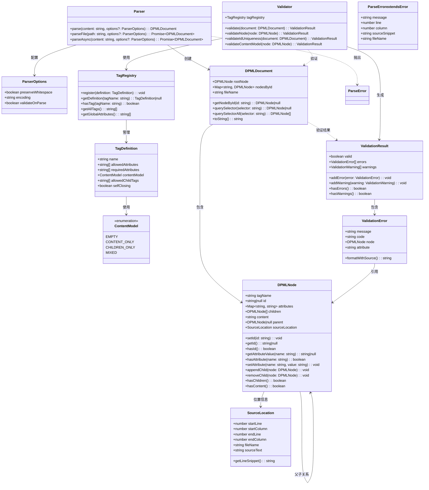
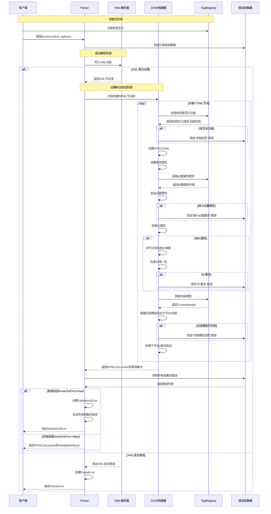

# DPML Parser API设计文档

## 1. 引言

本文档详细说明DPML Parser的API设计和架构。Parser是DPML处理管道的第一阶段，负责将原始DPML文本解析为结构化的文档对象模型。

### 1.1 设计目标

- **关注点分离** - Parser专注于语法解析，验证和语义处理由其他组件负责
- **错误定位** - 提供精确的错误位置信息，便于调试
- **性能与扩展性** - 设计高效的解析流程，同时支持未来扩展
- **API友好性** - 提供直观易用的接口

## 2. API入口设计

Parser API分为两个主要部分：标签注册API和解析API。

### 2.1 标签注册API

标签注册API用于定义DPML文档可以使用的标签。

```typescript
// 标签注册API

/**
 * 获取全局标签注册表
 * @returns 全局标签注册表实例
 */
export function getTagRegistry(): TagRegistry;

/**
 * 注册单个标签定义
 * @param definition 标签定义
 */
export function registerTag(definition: TagDefinition): void;

/**
 * 批量注册多个标签定义
 * @param definitions 标签定义数组
 */
export function registerTags(definitions: TagDefinition[]): void;

/**
 * 创建新的标签注册表实例
 * @returns 新的标签注册表
 */
export function createTagRegistry(): TagRegistry;
```

### 2.2 解析API

解析API用于将DPML文本解析为文档对象模型。

```typescript
// 解析API

/**
 * 解析DPML文本内容
 * @param content DPML文本内容
 * @param options 解析选项
 * @returns 解析后的文档对象
 */
export function parse(content: string, options?: ParserOptions): DPMLDocument;

/**
 * 异步解析DPML文件
 * @param path 文件路径
 * @param options 解析选项
 * @returns Promise，解析后的文档对象
 */
export async function parseFile(
  path: string, 
  options?: ParserOptions
): Promise<DPMLDocument>;

/**
 * 使用自定义标签注册表解析DPML内容
 * @param content DPML文本内容
 * @param options 解析选项
 * @param registry 自定义标签注册表
 * @returns 解析后的文档对象
 */
export function parseWithRegistry(
  content: string, 
  options?: ParserOptions,
  registry?: TagRegistry
): DPMLDocument;
```

### 2.3 解析选项

```typescript
/**
 * 解析器配置选项
 */
export interface ParserOptions {
  /**
   * 是否保留空白字符
   * @default false
   */
  preserveWhitespace?: boolean;
  
  /**
   * 文件编码
   * @default 'utf-8'
   */
  encoding?: string;
  
  /**
   * 是否在解析时进行验证
   * @default true
   */
  validateOnParse?: boolean;
  
  /**
   * 验证失败时是否抛出异常
   * @default true
   */
  throwOnError?: boolean;
  
  /**
   * 源文件名(parseFile时自动设置)
   */
  fileName?: string;
}
```

### 2.4 常见使用模式

```typescript
// 1. 基本使用 - 使用内置标签
import { parse } from '@dpml/parser';

const document = parse(`<root><child>内容</child></root>`);

// 2. 注册自定义标签并使用
import { registerTag, parse } from '@dpml/parser';

// 在应用启动时注册
registerTag({
  name: 'custom-element',
  contentModel: ContentModel.MIXED,
  allowedAttributes: ['id', 'class']
});

// 在需要时使用
const document = parse(`<custom-element>内容</custom-element>`);

// 3. 使用独立的标签注册表
import { createTagRegistry, parseWithRegistry } from '@dpml/parser';

const registry = createTagRegistry();
registry.register({
  name: 'isolated-tag',
  contentModel: ContentModel.EMPTY
});

const document = parseWithRegistry(
  `<isolated-tag />`, 
  { validateOnParse: true },
  registry
);
```

## 3. 核心架构

Parser系统基于以下UML类图设计：



## 4. 核心组件详解

### 4.1 Parser

负责将原始DPML文本转换为结构化的DPMLDocument对象。

```typescript
class Parser {
  // 同步解析文本内容
  parse(content: string, options?: ParserOptions): DPMLDocument;
  
  // 异步从文件解析内容
  parseFile(path: string, options?: ParserOptions): Promise<DPMLDocument>;
  
  // 异步解析文本内容（适用于大型文档）
  parseAsync(content: string, options?: ParserOptions): Promise<DPMLDocument>;
}
```

### 4.2 DPMLDocument

表示解析后的文档对象模型，提供访问和查询功能。

```typescript
class DPMLDocument {
  // 文档根节点
  rootNode: DPMLNode;
  
  // ID到节点的映射，便于快速查找
  nodesById: Map<string, DPMLNode>;
  
  // 源文件名（如果从文件解析）
  fileName: string;
  
  // 通过ID查找节点
  getNodeById(id: string): DPMLNode|null;
  
  // 使用CSS选择器语法查找单个节点
  querySelector(selector: string): DPMLNode|null;
  
  // 使用CSS选择器语法查找多个节点
  querySelectorAll(selector: string): DPMLNode[];
  
  // 将文档转换回文本表示
  toString(): string;
}
```

### 4.3 DPMLNode

表示文档中的单个节点，可以是元素或文本。

```typescript
class DPMLNode {
  // 标签名
  tagName: string;
  
  // 节点ID（可选）
  id: string|null;
  
  // 节点属性
  attributes: Map<string, string>;
  
  // 子节点
  children: DPMLNode[];
  
  // 文本内容
  content: string;
  
  // 父节点引用
  parent: DPMLNode|null;
  
  // 源码位置信息
  sourceLocation: SourceLocation;
  
  // 节点操作方法
  setId(id: string): void;
  getId(): string|null;
  hasId(): boolean;
  getAttributeValue(name: string): string|null;
  hasAttribute(name: string): boolean;
  setAttribute(name: string, value: string): void;
  appendChild(node: DPMLNode): void;
  removeChild(node: DPMLNode): void;
  hasChildren(): boolean;
  hasContent(): boolean;
}
```

### 4.4 ContentModel

定义标签可以包含的内容类型，使用枚举表示不同的内容模型。

```typescript
enum ContentModel {
  // 不允许内容和子节点（自闭合标签）
  EMPTY,
  
  // 只允许文本内容，不允许子节点
  CONTENT_ONLY,
  
  // 只允许子节点，不允许文本内容
  CHILDREN_ONLY,
  
  // 允许混合内容（文本和子节点）
  MIXED
}
```

### 4.5 Validator 和 TagRegistry

验证器和标签注册表相互配合，负责验证文档结构的合法性：

```typescript
class TagRegistry {
  // 注册标签定义
  register(definition: TagDefinition): void;
  
  // 获取标签定义
  getDefinition(tagName: string): TagDefinition|null;
  
  // 检查标签是否注册
  hasTag(tagName: string): boolean;
  
  // 获取所有已注册的标签
  getAllTags(): string[];
  
  // 获取全局属性列表
  getGlobalAttributes(): string[];
}

class Validator {
  // 标签注册表引用
  tagRegistry: TagRegistry;
  
  // 验证整个文档
  validate(document: DPMLDocument): ValidationResult;
  
  // 验证单个节点
  validateNode(node: DPMLNode): ValidationResult;
  
  // 验证ID唯一性
  validateIdUniqueness(document: DPMLDocument): ValidationResult;
  
  // 验证内容模型
  validateContentModel(node: DPMLNode): ValidationResult;
}
```

## 5. 解析流程

Parser的解析流程如下：



## 6. 关键设计决策

### 6.1 Parser与Validator分离

采用关注点分离原则，Parser仅负责XML语法解析，而Validator负责业务规则验证。

**优势**：
- 简化Parser实现，专注于正确解析XML结构
- 允许可选的验证步骤，提高灵活性
- 支持不同的验证规则和策略

**实现**：
```typescript
// 仅解析，不验证
const doc = parse(content, { validateOnParse: false });

// 单独验证步骤
import { validate } from '@dpml/parser';
const result = validate(doc);

// 或使用选项自动验证
const doc = parse(content, { validateOnParse: true });
```

### 6.2 DPMLNode的ID设计

将ID作为节点的一级属性，而非普通属性集合的一部分。

**优势**：
- 概念清晰，区分元数据和业务数据
- 优化ID索引和查找性能
- 简化API设计

**使用**：
```typescript
// 设置ID
node.setId('my-node');

// 检查是否有ID
if (node.hasId()) {
  // 获取ID
  const id = node.getId();
}
```

### 6.3 SourceLocation的引入

为每个节点添加源码位置信息，便于错误定位。

**优势**：
- 提供精确的错误定位
- 改善调试体验
- 支持更有意义的错误消息

**使用**：
```typescript
// 错误报告示例
try {
  parse(content);
} catch (error) {
  console.error(`Error at ${error.line}:${error.column}: ${error.message}`);
  console.error(error.sourceSnippet);
}
```

### 6.4 ContentModel枚举

使用ContentModel枚举统一表示标签的内容模型，替代多个布尔标志。

**优势**：
- 概念清晰，避免矛盾设置
- 简化验证逻辑
- 易于扩展

**使用**：
```typescript
// 定义只允许文本内容的标签
registerTag({
  name: 'paragraph',
  contentModel: ContentModel.CONTENT_ONLY,
  // 其他属性...
});

// 定义只允许子标签的容器
registerTag({
  name: 'container',
  contentModel: ContentModel.CHILDREN_ONLY,
  allowedChildTags: ['item', 'section'],
  // 其他属性...
});
```

### 6.5 纯函数式API设计

使用纯函数作为API入口，简化使用并提高可测试性。

**优势**：
- 简化API调用方式
- 提高代码可测试性
- 支持函数式编程风格

**实现**：
```typescript
// 无需创建实例，直接调用
import { parse } from '@dpml/parser';
const document = parse(content);

// 便于组合
const processDocument = pipe(
  parse,
  extractData,
  transformData
);
```

## 7. 扩展性考虑

设计具有多个扩展点，确保未来可以灵活增强功能：

### 7.1 内容处理扩展

当前设计中content是原始字符串，未来可以扩展为支持不同内容格式的处理器：

```typescript
// 未来可能的扩展
interface ContentProcessor {
  process(content: string, contentType: string): ProcessedContent;
}

class MarkdownProcessor implements ContentProcessor {
  process(content: string, contentType: string): ProcessedContent;
}
```

### 7.2 验证规则扩展

TagDefinition可以扩展添加更复杂的验证规则：

```typescript
// 未来可能的扩展
interface ValidationRule {
  validate(node: DPMLNode, context: ValidationContext): ValidationResult;
}

class AttributeFormatRule implements ValidationRule {
  validate(node: DPMLNode, context: ValidationContext): ValidationResult;
}
```

### 7.3 查询能力扩展

可以扩展DPMLDocument的查询功能，支持更复杂的查询语法：

```typescript
// 未来可能的扩展
class QueryEngine {
  execute(document: DPMLDocument, query: string): DPMLNode[];
}
```

## 8. 总结

本文档详细说明了DPML Parser的API设计。通过清晰的关注点分离和模块化结构，我们创建了一个灵活、可扩展的解析系统，能够满足当前需求并支持未来演进。

主要设计特点：
- **简洁的API入口**：纯函数式API设计，易于使用
- **灵活的标签注册**：支持静态定义和动态扩展标签
- **强大的文档模型**：提供丰富的查询和操作功能
- **精确的错误处理**：提供详细的错误位置和上下文信息
- **可扩展的架构**：设计考虑了未来的扩展需求

这种设计使DPML解析过程既高效又可靠，为后续的处理和渲染阶段提供了坚实基础。 