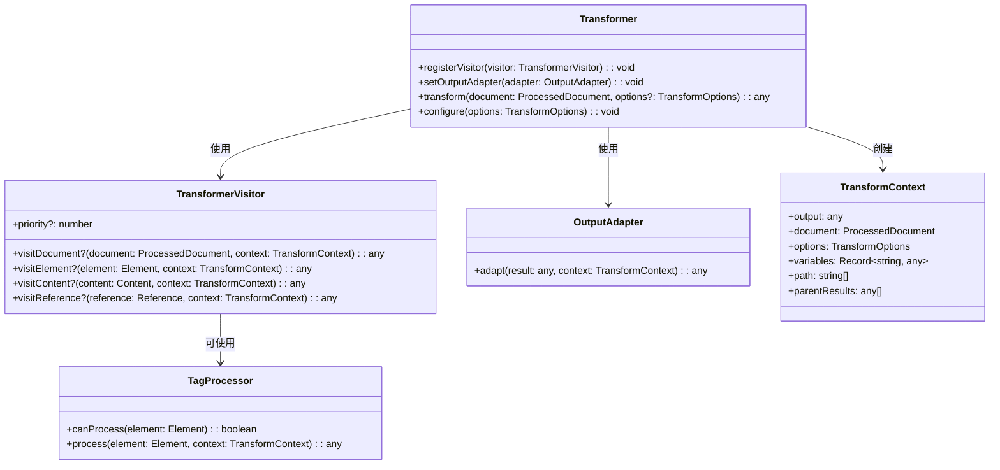
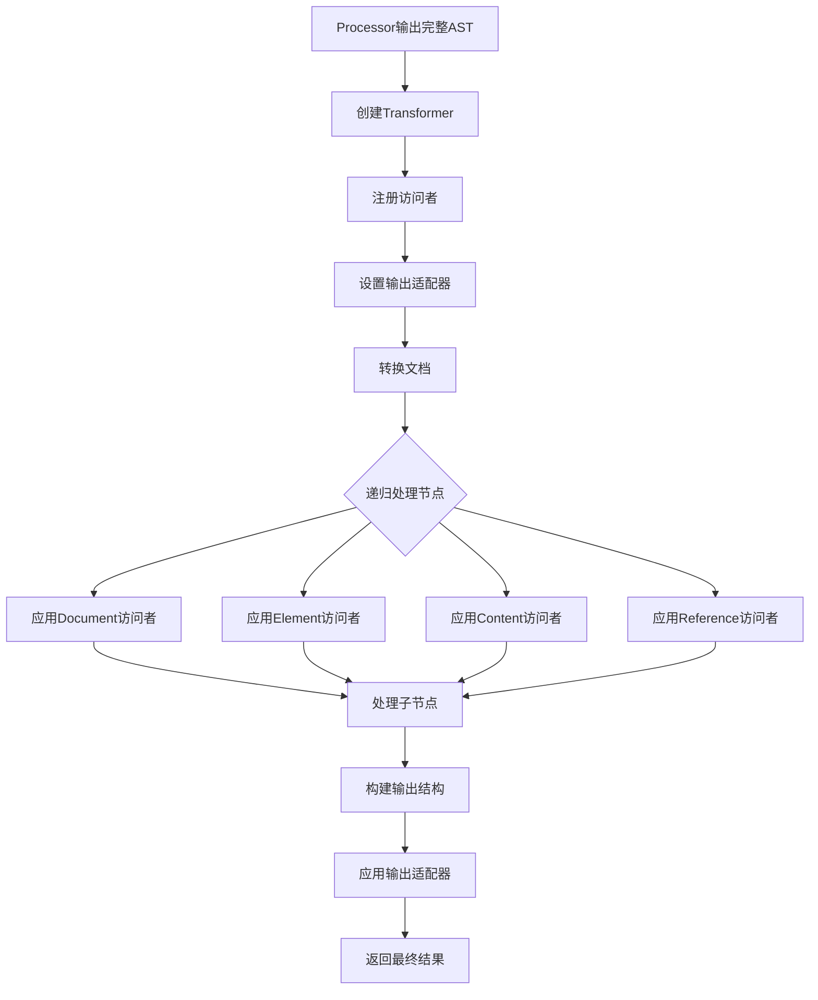
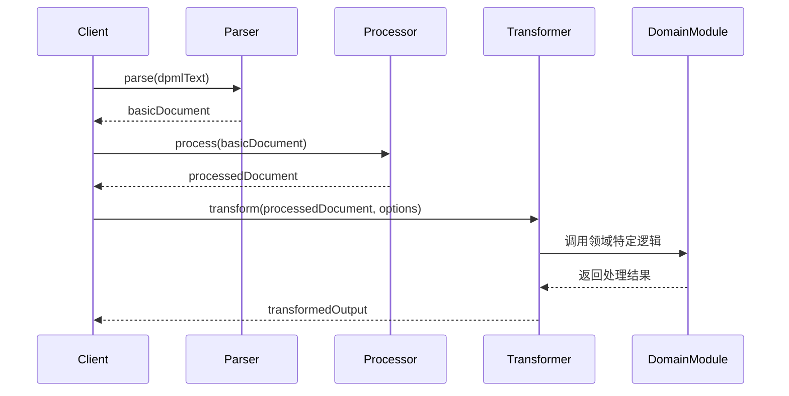

# @dpml/core Transformer模块设计

## 1. 模块定位与职责

Transformer模块在DPML处理流程中位于Processor之后，作为最终处理层，承担以下主要职责：

- 接收Processor生成的完整AST，转换为领域特定的表示形式
- 将处理后的DPML文档转换为可用于特定目标系统的格式
- 识别和处理特定领域的标签和语义
- 提供输出适配机制以支持多种目标格式
- 提供扩展点以支持多样化的转换需求


## 2. 访问者模式架构

Transformer模块同样采用**访问者模式**(Visitor Pattern)作为核心架构，实现转换算法与数据结构分离，便于扩展和复用。

### 2.1 核心接口

```typescript
// 转换访问者接口
interface TransformerVisitor {
  // 各类节点的访问方法
  visitDocument?(document: ProcessedDocument, context: TransformContext): any;
  visitElement?(element: Element, context: TransformContext): any;
  visitContent?(content: Content, context: TransformContext): any;
  visitReference?(reference: Reference, context: TransformContext): any;
  
  // 访问者优先级，数值越大优先级越高
  priority?: number;
}

// 转换器接口
interface Transformer {
  // 注册扩展点
  registerVisitor(visitor: TransformerVisitor): void;
  setOutputAdapter(adapter: OutputAdapter): void;
  
  // 转换方法
  transform(document: ProcessedDocument, options?: TransformOptions): any;
  
  // 配置选项
  configure(options: TransformOptions): void;
}

// 输出适配器接口
interface OutputAdapter {
  adapt(result: any, context: TransformContext): any;
}

// 转换上下文
interface TransformContext {
  output: any;                          // 当前转换结果
  document: ProcessedDocument;          // 原始文档
  options: TransformOptions;            // 转换选项
  variables: Record<string, any>;       // 上下文变量
  path: string[];                       // 当前路径
  parentResults: any[];                 // 父节点结果栈
}

// 转换选项
interface TransformOptions {
  format?: string;                      // 输出格式
  mode?: 'strict' | 'loose';            // 转换模式
  variables?: Record<string, any>;      // 全局变量
  [key: string]: any;                   // 扩展选项
}
```

### 2.2 架构组成



### 2.3 处理流程



## 3. 核心访问者类型

Transformer架构支持多种类型的访问者，每种类型负责特定的转换任务：

| 访问者类型 | 优先级 | 主要职责 |
|---------|------|--------|
| 文档结构访问者 | 100 | 处理整体文档结构，建立基础输出框架 |
| 领域标签访问者 | 80-90 | 处理特定领域的标签（如prompt, agent, workflow等） |
| 通用标签访问者 | 70 | 处理通用标签（如metadata, include等） |
| 内容转换访问者 | 60 | 处理内容节点的格式转换 |
| 引用转换访问者 | 50 | 处理已解析引用的转换 |
| 后处理访问者 | 10-40 | 对转换结果进行后处理或优化 |

访问者按优先级排序，优先级高的先执行。各访问者保持单一职责，通过组合实现复杂功能。

## 4. 扩展机制

Transformer模块提供两个主要扩展点：

### 4.1 通过访问者扩展(TransformerVisitor)

访问者是最主要的扩展机制，能够处理不同类型的节点并进行特定转换。实现TransformerVisitor接口并注册到Transformer即可添加新的转换功能。
 
```typescript
// 访问者注册
transformer.registerVisitor(new CustomTransformerVisitor());
```

自定义访问者可以：
- 处理特定类型的标签转换
- 实现特定领域的语义处理
- 添加特殊格式的输出处理
- 实现跨标签的上下文处理

### 4.2 通过输出适配器扩展(OutputAdapter)

输出适配器用于将转换结果适配为特定的目标格式，实现OutputAdapter接口并设置到Transformer即可支持新的输出格式。

```typescript
// 输出适配器设置
transformer.setOutputAdapter(new CustomOutputAdapter());
```

自定义输出适配器可以：
- 支持新的目标系统格式
- 实现特定的序列化逻辑
- 添加目标系统特定的元数据
- 优化输出结果结构

## 5. 特定领域标签处理

Transformer框架支持通过特定的标签处理器处理领域相关标签：

### 5.1 标签处理器

```typescript
// 标签处理器接口
interface TagProcessor {
  // 判断是否能处理该标签
  canProcess(element: Element): boolean;
  
  // 处理标签并返回结果
  process(element: Element, context: TransformContext): any;
}

// 标签处理器注册表
class TagProcessorRegistry {
  private processors: Map<string, TagProcessor> = new Map();
  
  // 注册处理器
  registerProcessor(tagName: string, processor: TagProcessor): void {
    this.processors.set(tagName, processor);
  }
  
  // 获取处理器
  getProcessor(tagName: string): TagProcessor | undefined {
    return this.processors.get(tagName);
  }
}
```

### 5.2 领域标签访问者

```typescript
// 领域标签访问者示例
class DomainElementVisitor implements TransformerVisitor {
  priority = 80;
  
  constructor(private registry: TagProcessorRegistry) {}
  
  visitElement(element: Element, context: TransformContext): any {
    // 查找对应的处理器
    const processor = this.registry.getProcessor(element.tagName);
    
    if (processor && processor.canProcess(element)) {
      // 使用专门的处理器处理
      return processor.process(element, context);
    }
    
    // 无处理器或不能处理，返回null表示未处理
    return null;
  }
}
```

## 6. 输出适配器

输出适配器负责将内部表示转换为最终输出格式：

### 6.1 基础适配器类型

| 适配器类型 | 应用场景 | 输出格式 |
|---------|---------|---------|
| JSONAdapter | 通用JSON输出 | 结构化JSON |
| StringAdapter | 文本格式输出 | 字符串 |
| OpenAIAdapter | OpenAI API | OpenAI请求格式 |
| AnthropicAdapter | Anthropic API | Claude请求格式 |
| AgentRuntimeAdapter | 代理运行时 | 代理配置对象 |
| WorkflowAdapter | 工作流引擎 | 工作流定义 |

### 6.2 适配器选择机制

```typescript
// 适配器工厂
class OutputAdapterFactory {
  private adapters: Map<string, () => OutputAdapter> = new Map();
  
  // 注册适配器创建函数
  registerAdapter(format: string, factory: () => OutputAdapter): void {
    this.adapters.set(format, factory);
  }
  
  // 创建适配器
  createAdapter(format: string): OutputAdapter {
    const factory = this.adapters.get(format);
    if (!factory) {
      throw new Error(`未找到格式为"${format}"的适配器`);
    }
    return factory();
  }
}

// 使用工厂创建适配器
const adapterFactory = new OutputAdapterFactory();
adapterFactory.registerAdapter('openai', () => new OpenAIAdapter());
adapterFactory.registerAdapter('anthropic', () => new AnthropicAdapter());

// 根据选项选择适配器
const adapter = adapterFactory.createAdapter(options.format || 'openai');
transformer.setOutputAdapter(adapter);
```

## 7. 基本使用模式

```typescript
// 创建转换器
const transformer = createTransformer({
  tagRegistry,
  errorHandler
});

// 注册核心访问者
transformer.registerVisitor(createDocumentStructureVisitor());
transformer.registerVisitor(createDomainElementVisitor());
transformer.registerVisitor(createContentTransformVisitor());

// 注册领域特定访问者
transformer.registerVisitor(createPromptElementVisitor());
transformer.registerVisitor(createAgentElementVisitor());

// 设置输出适配器
transformer.setOutputAdapter(createOutputAdapter(options.format));

// 转换文档
const processedDocument = await processor.process(basicDocument);
const result = transformer.transform(processedDocument, options);
```

## 8. 领域场景案例

### 8.1 Prompt转换场景

```typescript
// DPML源文件示例
/*
<prompt>
  <role name="system">
    你是一个AI助手，负责回答用户的问题。
  </role>
  <role name="user">
    请解释什么是量子计算？
  </role>
</prompt>
*/

// 转换为OpenAI格式
const openaiOutput = {
  model: "gpt-4",
  messages: [
    {
      role: "system",
      content: "你是一个AI助手，负责回答用户的问题。"
    },
    {
      role: "user",
      content: "请解释什么是量子计算？"
    }
  ],
  temperature: 0.7
};

// 转换为Anthropic格式
const anthropicOutput = {
  model: "claude-3-opus-20240229",
  messages: [
    {
      role: "user",
      content: "你是一个AI助手，负责回答用户的问题。\n\n请解释什么是量子计算？"
    }
  ],
  temperature: 0.7
};
```

### 8.2 Agent转换场景

```typescript
// DPML源文件示例
/*
<agent id="weather-assistant">
  <prompt>
    <role name="system">
      你是天气助手，可以查询天气信息。
    </role>
  </prompt>
  
  <tool name="get_weather">
    <parameter name="city" type="string" required="true" />
    <implementation language="javascript">
      async function getWeather(city) {
        return await weatherAPI.fetch(city);
      }
    </implementation>
  </tool>
</agent>
*/

// 转换为Agent运行时配置
const agentOutput = {
  id: "weather-assistant",
  type: "agent",
  prompt: {
    template: [
      {role: "system", content: "你是天气助手，可以查询天气信息。"}
    ]
  },
  tools: [
    {
      name: "get_weather",
      parameters: {
        city: {type: "string", required: true}
      },
      implementation: "async function getWeather(city) {\n  return await weatherAPI.fetch(city);\n}"
    }
  ]
};
```

### 8.3 Workflow转换场景

```typescript
// DPML源文件示例
/*
<workflow id="research-flow">
  <agent-ref id="searcher" />
  <agent-ref id="summarizer" />
  
  <step id="search" agent="searcher" next="summarize">
    <input from="user.query" />
  </step>
  
  <step id="summarize" agent="summarizer">
    <input from="search.output" />
  </step>
</workflow>
*/

// 转换为工作流配置
const workflowOutput = {
  id: "research-flow",
  agents: [
    {id: "searcher", ref: "searcher"},
    {id: "summarizer", ref: "summarizer"}
  ],
  steps: [
    {
      id: "search",
      agent: "searcher",
      input: {source: "user.query"},
      next: ["summarize"]
    },
    {
      id: "summarize",
      agent: "summarizer",
      input: {source: "search.output"}
    }
  ]
};
```

## 9. 最佳实践

### 9.1 访问者设计原则

- **单一职责**：每个访问者只负责一种功能，避免过于复杂
- **优先级管理**：合理设置优先级，确保处理顺序正确
- **递归处理**：需要时显式处理子节点，或返回null让框架处理
- **类型安全**：利用TypeScript类型系统确保类型安全

### 9.2 扩展开发指南

- 开发新访问者时，专注于一个领域或功能
- 标签处理器应处理好特殊情况和边缘案例
- 输出适配器应确保生成符合目标系统要求的格式
- 为自定义组件提供详细文档和测试用例

### 9.3 性能优化建议

- 避免重复计算，利用转换上下文缓存中间结果
- 对于复杂转换，考虑使用备忘录模式
- 大型文档转换可考虑分段处理
- 输出适配器应尽量避免深拷贝大型结构

## 10. 与其他模块的关系

Transformer是DPML处理流程的最后阶段，其与其他模块的关系如下：



- **Parser**: 提供基础AST结构
- **Processor**: 处理继承、引用等，提供语义完整的AST
- **Transformer**: 转换AST为特定领域的输出格式
- **领域模块**: 提供特定领域的转换逻辑和适配器

Transformer从Processor接收已完全处理的AST，Processor已经处理了所有继承关系和引用解析。Transformer不需要考虑这些处理，专注于将AST转换为目标格式。

## 11. 总结

Transformer模块采用访问者模式架构，提供了灵活而强大的DPML文档转换能力，支持多种输出格式和目标系统。通过两个主要扩展点（访问者和输出适配器），可以实现各种领域特定的转换需求，而不需要修改核心转换框架。

转换架构的优势在于：

1. **目标格式分离**：同一份DPML文档可以转换为多种目标格式
2. **领域逻辑分离**：各领域可以实现自己的转换逻辑而互不干扰
3. **扩展性**：通过访问者和适配器机制，易于扩展新的转换能力
4. **一致性**：所有领域遵循同一转换框架，确保行为一致

作为DPML处理流程的最后阶段，Transformer将抽象的DPML文档转换为可直接使用的具体表示，完成从声明式描述到命令式配置的转换，为各种领域应用提供统一的处理框架。 