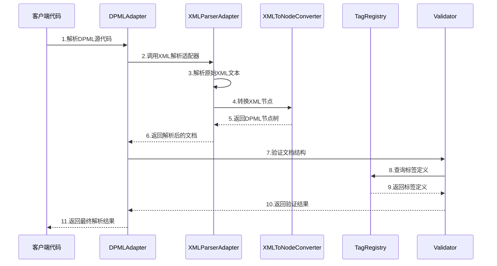
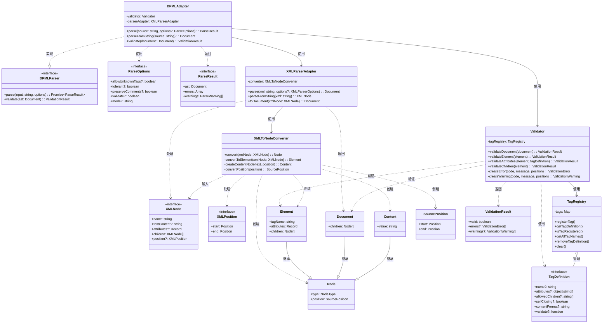

# DPML Parser 设计文档

## 核心职责

Parser模块是DPML系统的基础设施，负责将源代码文本转换为可操作的内部数据结构，并确保这些结构符合预定义的规则和约束。其核心职责包括：

1. **源代码解析转换**：将DPML源码（XML格式）解析成内部节点结构（Node/Element/Document等）
   - 通过xml-parser-adapter.ts实现XML到内部数据结构的转换
   - 处理标签、属性、文本等各种节点类型的解析

2. **标签管理**：
   - 通过TagRegistry注册和管理所有DPML标签的定义
   - 定义标签的属性、嵌套规则和行为特性

3. **文档验证**：
   - 通过Validator组件验证文档结构的合法性
   - 检查标签嵌套关系是否符合规定
   - 验证必需属性是否存在
   - 检查属性值是否合法

4. **错误处理**：
   - 生成详细的错误和警告信息
   - 提供源码位置信息以帮助定位问题

5. **适配转换**：
   - 通过dpml-adapter.ts提供DPML特定的解析和适配逻辑
   - 处理DPML的特殊语法和规则

## 设计原则

Parser模块的设计遵循以下核心原则：

1. **关注点分离**：
   - 将解析、验证、标签管理等不同职责分离到独立的类和文件中
   - 每个组件专注于单一职责，如TagRegistry只负责标签定义管理

2. **可扩展性**：
   - 标签注册机制支持动态添加和定义新标签
   - 通过接口和抽象设计，允许扩展验证规则和解析行为

3. **声明式配置**：
   - 使用标签定义（TagDefinition）声明式地配置标签属性和行为
   - 通过配置而非硬编码方式定义标签规则

4. **适配器模式**：
   - 使用适配器（xml-parser-adapter、dpml-adapter）隔离外部解析器和内部实现
   - 允许切换底层解析引擎而不影响上层应用

5. **错误处理优先**：
   - 详细的错误和警告系统，提供准确的源码位置
   - 区分验证错误和警告，提供不同严重程度的问题报告

6. **类型安全**：
   - 使用TypeScript类型系统确保API使用的正确性
   - 为节点、标签定义等核心概念提供清晰的类型接口

7. **开闭原则**：
   - 系统对扩展开放，对修改关闭
   - 新标签和规则可以添加而无需修改核心解析逻辑

8. **组合优于继承**：
   - 使用组合模式构建复杂功能
   - 如Validator使用TagRegistry而非继承它

## 解析流程

### 序列图

### 类图

## 主要组件说明

### TagRegistry

标签注册表负责管理所有DPML标签的定义，提供标签注册和查询功能。它存储了每个标签的属性、允许的子标签、自关闭属性等信息。

### Validator

验证器负责检查DPML文档的结构和内容是否符合预定义的规则。它验证标签嵌套、必需属性、属性值等，并生成详细的错误和警告信息。

### XMLParserAdapter

XML解析适配器封装了对XML源码的解析逻辑，将XML文本转换为内部节点结构。它隔离了外部XML解析器的细节，提供统一的接口。

### DPMLAdapter

DPML适配器处理DPML特有的语法和语义，对解析后的节点树进行进一步处理和转换，实现DPML特定的功能。

## 扩展点

Parser模块提供了以下主要扩展点：

1. **注册新标签**：通过TagRegistry.registerTag()添加新的标签定义
2. **自定义验证规则**：在TagDefinition中提供custom validate函数
3. **扩展解析适配器**：实现自定义解析适配器以支持不同格式的源码
4. **属性处理器**：为特定属性定义专门的处理逻辑

通过这些扩展点，Parser模块能够适应DPML语言的演进和扩展，保持系统的灵活性和可维护性。
