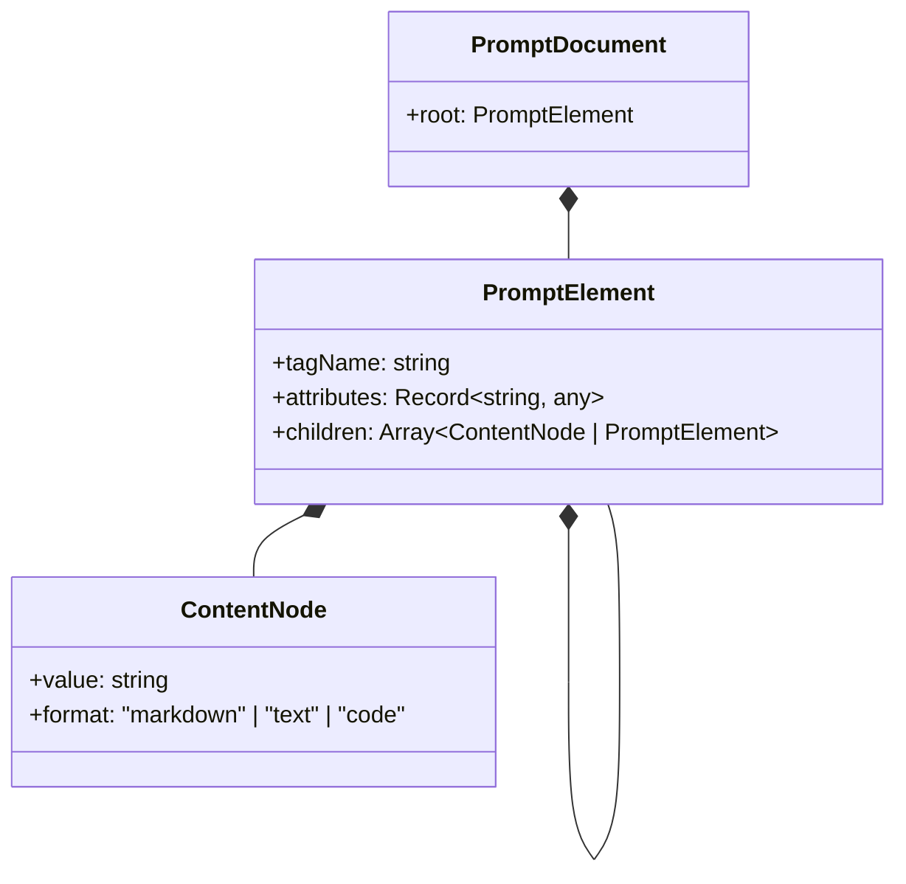
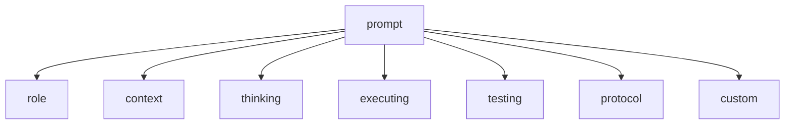
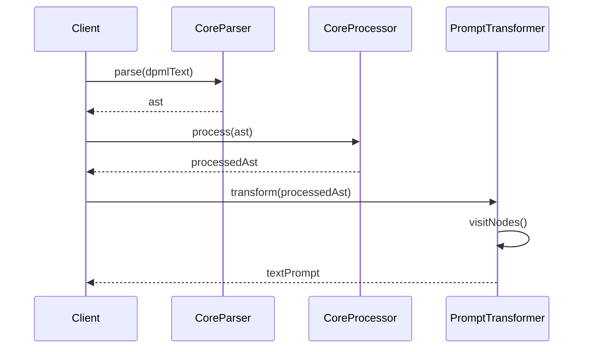

# @dpml/prompt 设计文档

## 1. 设计目标与原则

### 1.1 核心目标

`@dpml/prompt`作为DPML生态系统的第一个领域包，旨在提供:

1. **结构化提示工程能力**：将自然语言提示转化为结构化、可复用的DPML格式
2. **标签继承与复用**：通过extends机制实现提示组件的继承和复用
3. **基础转换能力**：支持将DPML结构转换为纯文本提示

### 1.2 设计原则

1. **用户体验优先**：提示编写应该简单直观，降低使用门槛
2. **模块化设计**：标签设计应体现单一职责，便于组合和复用
3. **扩展性优先**：为标签属性和转换逻辑预留清晰的扩展点
4. **最佳实践内置**：融合提示工程最佳实践到标签设计中
5. **向后兼容保证**：核心功能的API和语法变更需谨慎，确保向后兼容
6. **测试驱动设计**：通过实际提示案例测试验证设计决策
7. **文档完备性**：提供清晰的API文档和示例

### 1.3 解决的问题

1. 提示工程师需要反复修改和测试提示，缺乏结构化管理手段
2. 提示内容混杂了多种职责（角色定义、思维模式、执行步骤等）
3. 提示复用和组合存在困难，导致重复工作
4. 不同功能组件混杂在一起，降低了维护性

## 2. 系统架构

### 2.1 整体架构

下图展示了@dpml/prompt的核心组件及其关系：

```mermaid
classDiagram
    class PromptProcessor {
        +process(dpmlText: string): ProcessedDocument
    }
    class PromptTransformer {
        +transform(doc: ProcessedDocument): string
    }
    class PromptRegistry {
        +registerTags()
        +registerTransformers()
    }
    
    PromptProcessor --> PromptRegistry: uses
    PromptTransformer --> PromptRegistry: uses
    PromptProcessor ..> "@dpml/core/Parser": uses
    PromptProcessor ..> "@dpml/core/Processor": uses
    PromptTransformer ..> "@dpml/core/Transformer": extends
```

### 2.2 模块职责

#### 2.2.1 核心模块职责

- **PromptProcessor**: 
  - 包装Core包的Parser和Processor功能
  - 提供简化的接口，适用于提示处理场景
  - 内置提示相关的标签验证逻辑

- **PromptTransformer**: 
  - 继承Core包的Transformer框架
  - 实现提示特定的转换逻辑
  - 将DPML结构转换为纯文本提示

- **PromptRegistry**: 
  - 注册所有提示相关标签和验证规则
  - 注册提示特定的转换器
  - 确保标签和转换器之间的映射关系

#### 2.2.2 职责边界

| 职责 | Core包 | Prompt包 | 应用层 |
|------|-------|---------|--------|
| XML解析 | ✅ | ❌ | ❌ |
| AST构建和处理 | ✅ | ❌ | ❌ |
| 提示标签定义 | ❌ | ✅ | ❌ |
| 提示转换逻辑 | ❌ | ✅ | ❌ |
| 应用特定配置 | ❌ | ❌ | ✅ |
| 用户交互界面 | ❌ | ❌ | ✅ |

## 3. 核心概念

### 3.1 提示文档模型

提示文档由一系列结构化标签组成，每个标签代表提示的一个功能组件。顶层结构如下：



### 3.2 核心标签体系

Prompt包定义了8个核心标签，共同构成了完整的提示框架：

1. **`<prompt>`** - 根标签，包含整个提示的定义
2. **`<role>`** - 定义AI的角色特征和行为
3. **`<context>`** - 提供背景信息和环境说明
4. **`<thinking>`** - 定义思考框架和推理方法
5. **`<executing>`** - 规定执行步骤和流程
6. **`<testing>`** - 自验证机制和质量检查
7. **`<protocol>`** - 输入输出格式和交互规则
8. **`<custom>`** - 用户自定义内容，最小处理干预

每个标签都有特定的属性、嵌套规则和验证逻辑。

### 3.3 标签嵌套规则

标签嵌套遵循以下规则：
- `<prompt>` 是根标签，必须是文档的顶层元素
- 其他7个核心标签只能作为 `<prompt>` 的直接子元素
- 核心标签内不允许嵌套其他核心标签
- 将来可能支持自定义嵌套扩展标签

嵌套规则图：


## 4. 标签定义详情

### 4.1 `<prompt>` 标签

作为根标签，定义整个提示的基本属性和元数据。

#### 属性：
- **id**: 唯一标识符，用于引用和复用
- **version**: 提示版本号
- **extends**: 继承另一个提示定义（支持跨文件继承）
- **lang**: 提示文档的语言（如zh-CN, en-US），影响格式化和语言提示

#### 用例：
```xml
<prompt id="analytical-framework" version="1.0" lang="zh-CN">
  <!-- 子标签内容 -->
</prompt>
```

### 4.2 `<role>` 标签

定义AI助手应该扮演的角色和身份特征。

#### 属性：
- **id**: 可选的标识符
- **extends**: 可继承其他role标签

#### 用例：
```xml
<role>
  你是一位经验丰富的数据科学家，专长于探索性数据分析和统计建模。
  你善于从复杂数据中提取有意义的洞见，并以清晰方式解释发现。
  
  你应使用专业而准确的语气，确保解释既有技术深度又能被非专业人士理解。
</role>
```

### 4.3 `<context>` 标签

提供背景信息和环境描述，帮助AI理解当前情境。

#### 属性：
- **id**: 可选的标识符 
- **extends**: 可继承其他context标签

#### 用例：
```xml
<context>
  你正在与一个研究团队合作，他们需要从复杂的实验数据中提取有意义的洞见。
  这些数据包含时间序列观测值，可能存在噪声和异常值。
  
  研究领域是生物医学，团队成员具有不同程度的统计背景。
</context>
```

### 4.4 `<thinking>` 标签

定义AI的思维方式、推理框架和方法论。

#### 属性：
- **id**: 可选的标识符
- **extends**: 可继承其他thinking标签

#### 用例：
```xml
<thinking>
  分析问题时，先理解数据的结构和特性，然后探索变量间的关系，
  最后应用适当的统计方法验证假设。始终保持批判性思维，考虑多种可能的解释。
  
  在形成结论前，评估以下方面：
  - 数据质量和完整性是否足够支持结论
  - 是否考虑了所有相关变量
  - 结论是否经受得住反例和边界条件的检验
  - 有无替代解释可以同样解释观察到的现象
</thinking>
```

### 4.5 `<executing>` 标签

规定AI执行任务的步骤和流程。

#### 属性：
- **id**: 可选的标识符
- **extends**: 可继承其他executing标签

#### 用例：
```xml
<executing>
  1. 数据理解：先了解数据类型、范围和结构
  2. 探索性分析：通过可视化和描述性统计探索数据特征
  3. 深入分析：应用适当的统计方法和模型
  4. 解释与总结：清晰地解释发现和结论
  
  在多轮对话中，我会：
  - 追踪已获取的用户信息，识别信息缺口
  - 在收到新信息后更新我的理解和分析
  - 定期总结当前理解，确认准确性
  - 根据对话进展调整分析深度和方向
</executing>
```

### 4.6 `<testing>` 标签

定义AI对自身输出的质量检验标准和流程。

#### 属性：
- **id**: 可选的标识符
- **extends**: 可继承其他testing标签

#### 用例：
```xml
<testing>
  输出前，检查以下几点：
  1. 结论是否基于充分证据
  2. 推理过程是否存在逻辑漏洞
  3. 是否考虑了多种可能性和边界情况
  4. 解释是否简洁清晰，适合目标受众
  5. 建议是否具体可行，符合实际约束
  
  若发现不足，应重新审视分析过程并修正。
</testing>
```

### 4.7 `<protocol>` 标签

规定交互的格式标准和处理规则。

#### 属性：
- **id**: 可选的标识符
- **extends**: 可继承其他protocol标签

#### 用例：
```xml
<protocol>
  输入规范：
  - 问题应明确表述分析目标和关键问题
  - 数据输入优先接受CSV、Excel或结构化JSON
  - 大型数据集应提供样本和概要统计信息
  
  输出规范：
  - 每份分析报告包含：执行摘要(150字以内)、方法论简述、关键发现(带置信度)、建议
  - 统计结果使用Markdown表格格式展示
  - 重要数字保留两位小数，附带单位
  
  对话控制：
  - 使用[总结]查看当前理解和分析状态
  - 使用[假设]探索特定情景的潜在结果
</protocol>
```

### 4.8 `<custom>` 标签

提供一个容器用于用户自定义内容，系统对此标签内容采取最小干预原则。

#### 属性：
- **id**: 可选的标识符
- **extends**: 可继承其他custom标签

#### 用例：
```xml
<custom>
  特别注意事项：
  
  1. 该用户是医疗专业人士，但非数据专家
  2. 尽量使用医学领域的类比来解释统计概念
  3. 在提供建议时考虑医疗实践的伦理约束
  
  历史交互记录显示用户对可视化表达特别感兴趣，可适当增加图表描述。
  
  ---
  
  个性化交流指南：保持专业但亲切的语气，避免过于学术化的表达。
</custom>
```

## 5. 继承机制

### 5.1 标签继承原理

每个标签都支持通过`extends`属性继承其他相同类型的标签内容和属性：

```xml
<!-- 基础角色定义 -->
<prompt id="base-prompt">
  <role id="scientist-base">
    你是一位科学家，擅长分析和解决问题。
  </role>
</prompt>

<!-- 继承和扩展角色 -->
<prompt id="specialized-prompt">
  <role extends="scientist-base" expertise="biology">
    作为生物学家，你对生命系统有深入的理解。
  </role>
</prompt>
```

### 5.2 继承规则

1. **属性继承**：子标签可以继承父标签的属性，子标签的同名属性会覆盖父标签
2. **内容继承**：如果子标签没有自己的内容，则继承父标签的内容；如果有自己的内容，则完全覆盖父标签内容
3. **跨文件继承**：支持通过路径引用其他文件中的标签
4. **类型限制**：只能继承同类型的标签（如role只能继承role）

### 5.3 跨文件继承

支持从其他文件继承标签定义：

```xml
<!-- 从本地文件继承 -->
<role extends="./templates/base-roles.dpml#scientist">
  具有特定领域专长的科学家。
</role>

<!-- 从远程文件继承 -->
<thinking extends="https://example.com/templates/thinking-frameworks.dpml#analytical">
  针对当前问题的分析思维方式。
</thinking>
```

## 6. 转换器设计

### 6.1 PromptTransformer

PromptTransformer继承自Core包的Transformer框架，实现提示文本生成逻辑：

```typescript
export class PromptTransformer extends DefaultTransformer<string> {
  constructor(options?: PromptTransformerOptions) {
    super(options);
  }
  
  // 访问者模式实现各标签处理
  visitPromptTag(node: Element): string {
    const children = this.getChildResults(node);
    return children.join('\n\n');
  }
  
  visitRoleTag(node: Element): string {
    return this.extractElementContent(node);
  }
  
  // 其他标签访问方法...
  
  transform(doc: ProcessedDocument): string {
    return this.visit(doc);
  }
}
```

### 6.2 转换流程

转换流程遵循以下步骤：

1. 解析DPML文本为AST
2. 处理AST，解析引用和继承
3. 初始化PromptTransformer
4. 调用transform方法，应用访问者模式遍历节点
5. 生成并返回纯文本提示



### 6.3 多语言支持

为了支持不同语言的提示生成，转换器根据`lang`属性调整格式化行为：

```typescript
// 根据语言属性处理内容
private processLanguageSpecificContent(content: string, lang: string): string {
  // 根据语言应用不同的格式化规则
  switch(lang) {
    case 'zh-CN':
    case 'zh-TW':
      return this.formatChineseContent(content);
    case 'ja-JP':
      return this.formatJapaneseContent(content);
    default:
      return this.formatDefaultContent(content);
  }
}

// 添加语言指示语
private addLanguageDirective(lang: string): string {
  const langDirectives = {
    'zh-CN': '请用中文回复',
    'zh-TW': '請用繁體中文回覆',
    'ja-JP': '日本語で回答してください',
    // 其他语言指示
  };
  
  return langDirectives[lang] || '';
}
```

### 6.4 标签格式配置

转换器支持自定义标签格式化模板，使用户可以灵活配置每个标签的输出格式：

```typescript
// 默认格式模板
const defaultFormatTemplates = {
  thinking: {
    title: "## Thinking Framework",
    prefix: "",
    suffix: "\n\n",
    wrapper: (content) => content
  },
  role: {
    title: "## Role",
    prefix: "You are ",
    suffix: "\n\n",
    wrapper: (content) => content
  },
  custom: {
    title: "", // 默认无标题
    prefix: "",
    suffix: "\n\n",
    wrapper: (content) => content
  },
  // 其他标签的默认格式
}

// 语言特定的格式模板
const langSpecificTemplates = {
  "zh-CN": {
    thinking: { 
      title: "## 思考模式",
      prefix: "请使用以下思维框架:\n"
    },
    role: {
      title: "## 角色",
      prefix: "你是"
    },
    custom: {
      // 保持最小干预
    }
    // 其他中文格式
  }
  // 其他语言
}

// 在转换器中应用格式模板
visitCustomTag(node: Element): string {
  // 对于custom标签，采用最小处理策略
  const content = this.processChildren(node);
  
  // 不添加标题，保持原始格式
  return content + "\n\n";
}

// ... 其他标签访问方法 ...
```

## 7. 属性处理

### 7.1 通用属性

所有标签共享的属性处理：

- **id**: 用于标签引用和继承
- **extends**: 标签继承机制

### 7.2 标签特定属性

每个标签可以有特定的属性处理逻辑：

```typescript
// 示例：处理role标签的tone属性
private processToneAttribute(tone: string): string {
  switch(tone) {
    case 'professional': 
      return '使用专业、正式的语气';
    case 'friendly':
      return '使用友好、平易近人的语气';
    // 其他情况...
    default:
      return '';
  }
}
```

## 8. 与Core包的关系

### 8.1 依赖关系

Prompt包依赖Core包提供的基础设施：

1. 使用Core的Parser解析DPML文本
2. 使用Core的Processor处理AST和继承
3. 继承Core的Transformer框架
4. 使用Core的错误处理机制
5. 遵循Core的扩展模式

### 8.2 扩展模式

Prompt包通过以下方式扩展Core功能：

1. 注册提示特定的标签定义
2. 实现提示特定的转换器

### 8.3 标签处理器实现

Prompt包为每个标签实现专用的处理器，处理特定语义逻辑：

```typescript
// 示例：role标签处理器
class RoleTagProcessor implements TagProcessor {
  canProcess(element: Element): boolean {
    return element.tagName === 'role';
  }
  
  async process(element: Element, context: ProcessingContext): Promise<Element> {
    // 初始化元数据
    element.metadata = element.metadata || {};
    element.metadata.roleInfo = {};
    
    // 提取角色描述
    const description = element.children
      .filter(child => isContent(child))
      .map(child => (child as Content).value)
      .join('');
    
    element.metadata.roleInfo.description = description;
    
    // 处理继承关系
    if (element.attributes.extends) {
      await this.processExtends(element, context);
    }
    
    return element;
  }
  
  private async processExtends(element: Element, context: ProcessingContext): Promise<void> {
    try {
      // 解析引用路径
      const refPath = element.attributes.extends;
      
      // 使用引用解析器获取目标元素
      const sourceElement = await context.resolveReference(refPath);
      if (!sourceElement) {
        throw new DPMLError(
          'REFERENCE_ERROR',
          `无法解析role继承引用: ${refPath}`
        );
      }
      
      // 合并属性（目标属性优先）
      element.attributes = {
        ...sourceElement.attributes,
        ...element.attributes
      };
      
      // 如果目标无内容，继承源内容
      if (element.children.length === 0 || 
         (element.children.length === 1 && isContent(element.children[0]) && 
         (element.children[0] as Content).value.trim() === '')) {
        element.children = [...sourceElement.children];
      }
      
      // 合并元数据
      if (sourceElement.metadata?.roleInfo) {
        element.metadata.roleInfo = {
          ...sourceElement.metadata.roleInfo,
          ...element.metadata.roleInfo
        };
      }
    } catch (error) {
      context.reportError(error);
    }
  }
}
```

类似地，需要为其他核心标签（prompt, context, thinking等）实现专用处理器，处理各自的语义逻辑。

### 8.4 注册标签与处理器

```typescript
// 注册标签定义
function registerPromptTags() {
  const registry = new TagRegistry();
  
  // 注册prompt标签
  registry.registerTagDefinition('prompt', {
    attributes: ['id', 'version', 'extends', 'lang'],
    requiredAttributes: ['id'],
    allowedChildren: ['role', 'context', 'thinking', 'executing', 'testing', 'protocol', 'custom']
  });
  
  // 注册role标签
  registry.registerTagDefinition('role', {
    attributes: ['id', 'extends'],
    allowedChildren: []  // 只允许文本内容
  });
  
  // 注册其他标签...
}

// 注册标签处理器
function registerTagProcessors(processor: Processor) {
  // 注册prompt标签处理器
  processor.registerTagProcessor('prompt', new PromptTagProcessor());
  
  // 注册role标签处理器
  processor.registerTagProcessor('role', new RoleTagProcessor());
  
  // 注册其他标签处理器...
}
```

## 9. API设计

### 9.1 核心API

Prompt包提供简洁的主要API：

```typescript
// 主要入口函数
function processPrompt(
  dpmlText: string
): Promise<ProcessedDocument>;

function transformPrompt(
  document: ProcessedDocument,
  options?: TransformOptions
): Promise<string>;

// 便捷组合函数
function generatePrompt(
  dpmlText: string,
  options?: PromptOptions
): Promise<string>;
```

### 9.2 配置项

提供灵活的配置选项：

```typescript
interface PromptOptions {
  // 处理相关
  validateOnly?: boolean;
  
  // 语言相关
  lang?: string; // 覆盖文档中的lang属性
  addLanguageDirective?: boolean; // 是否添加语言指令
  
  // 格式化相关
  formatTemplates?: {
    [tagName: string]: {
      title?: string;     // 标签标题
      prefix?: string;    // 内容前缀
      suffix?: string;    // 内容后缀
      wrapper?: (content: string) => string; // 内容包装器
    }
  };
  
  // 结构相关
  tagOrder?: string[]; // 标签组织顺序
}
```

#### 格式化配置示例：

```typescript
// 自定义中文格式模板
const zhFormatTemplates = {
  thinking: {
    title: "# 思维框架",
    prefix: "请使用以下思维框架:\n"
  },
  role: {
    title: "# 角色定义",
    prefix: "你是"
  }
};

// 应用自定义格式
const prompt = await generatePrompt(dpmlText, {
  lang: "zh-CN",
  formatTemplates: zhFormatTemplates,
  addLanguageDirective: true
});
```

### 9.3 API实现细节

API的内部实现流程：

```typescript
/**
 * 生成提示文本
 * @param dpmlText DPML文本
 * @param options 选项
 * @returns 生成的提示文本
 */
async function generatePrompt(
  dpmlText: string,
  options: PromptOptions = {}
): Promise<string> {
  try {
    // 1. 解析DPML文本
    const parseResult = await parse(dpmlText, {
      validate: true,
      allowUnknownTags: false
    });
    
    // 解析错误处理
    if (parseResult.errors.length > 0) {
      const firstError = parseResult.errors[0];
      throw new DPMLError(
        firstError.code,
        firstError.message,
        firstError.position
      );
    }
    
    // 2. 处理文档
    const processOptions = {
      basePath: options.basePath || '.',
      strictMode: options.strictMode || false
    };
    const processedDoc = await process(parseResult.ast, processOptions);
    
    // 3. 检查是否仅验证
    if (options.validateOnly) {
      return '';
    }
    
    // 4. 创建转换器
    const transformer = new PromptTransformer({
      formatTemplates: options.formatTemplates,
      lang: options.lang,
      addLanguageDirective: options.addLanguageDirective,
      tagOrder: options.tagOrder
    });
    
    // 5. 转换文档
    return transformer.transform(processedDoc);
  } catch (error) {
    // 错误处理与转换
    handlePromptError(error);
    throw error;
  }
}

/**
 * 处理并转换提示错误
 */
function handlePromptError(error: any): void {
  // 如果已经是DPML错误，添加上下文信息
  if (error instanceof DPMLError) {
    error.context = error.context || {};
    error.context.module = 'prompt';
    return;
  }
  
  // 转换未知错误为DPML错误
  const dpmlError = new DPMLError(
    'PROMPT_ERROR',
    error.message || '处理提示时发生未知错误',
    undefined
  );
  
  // 保存原始错误
  dpmlError.cause = error;
  
  throw dpmlError;
}
```

### 9.4 错误处理策略

Prompt包实现以下错误处理策略：

1. **分类错误**：将错误分为解析错误、验证错误、处理错误和转换错误
2. **位置信息**：尽可能提供准确的源代码位置信息
3. **友好消息**：提供清晰的错误消息，便于用户理解和修复
4. **错误层次**：维护错误的层次结构，便于定位根本原因

```typescript
// 错误分类示例
enum PromptErrorCode {
  // 解析错误
  PARSE_ERROR = 'PARSE_ERROR',           // 一般解析错误
  INVALID_TAG = 'INVALID_TAG',           // 无效标签
  INVALID_ATTRIBUTE = 'INVALID_ATTRIBUTE', // 无效属性
  
  // 验证错误
  VALIDATION_ERROR = 'VALIDATION_ERROR', // 一般验证错误
  MISSING_REQUIRED_TAG = 'MISSING_REQUIRED_TAG', // 缺少必需标签
  INVALID_NESTING = 'INVALID_NESTING',   // 无效嵌套
  
  // 处理错误
  PROCESSING_ERROR = 'PROCESSING_ERROR', // 一般处理错误
  REFERENCE_ERROR = 'REFERENCE_ERROR',   // 引用错误
  INHERITANCE_ERROR = 'INHERITANCE_ERROR', // 继承错误
  
  // 转换错误
  TRANSFORM_ERROR = 'TRANSFORM_ERROR',   // 一般转换错误
  FORMATTER_ERROR = 'FORMATTER_ERROR'    // 格式化错误
}

// 错误处理示例
try {
  const result = await generatePrompt(dpmlText);
} catch (error) {
  if (error instanceof DPMLError) {
    switch (error.code) {
      case 'PARSE_ERROR':
        console.error(`解析错误: ${error.message}`);
        if (error.location) {
          console.error(`位置: 行 ${error.location.line}, 列 ${error.location.column}`);
        }
        break;
        
      case 'REFERENCE_ERROR':
        console.error(`引用错误: ${error.message}`);
        console.error('请检查extends属性引用的标签ID是否存在');
        break;
        
      // 其他错误类型处理...
      
      default:
        console.error(`DPML错误: ${error.message}`);
    }
  } else {
    console.error('未知错误:', error);
  }
}
```

## 10. 完整处理流程示例

以下是使用Prompt包处理DPML文档的完整示例：

```typescript
import { generatePrompt } from '@dpml/prompt';

async function main() {
  try {
    // DPML文本
    const dpmlText = `
      <prompt id="data-analysis" lang="zh-CN">
        <role extends="./templates/analyst.dpml#base-analyst">
          作为数据分析师，你精通统计方法和数据可视化技术。
        </role>
        
        <context>
          你正在帮助用户分析销售数据，寻找趋势和模式。
        </context>
        
        <thinking>
          分析数据时，先了解数据结构和质量，识别异常值和缺失值。
          然后探索变量间的关系，寻找模式和趋势。
          最后应用适当的统计方法验证发现，得出有意义的结论。
        </thinking>
        
        <executing>
          1. 数据理解和清洗
          2. 探索性分析
          3. 深入统计分析
          4. 结论与建议
        </executing>
        
        <testing>
          检查分析是否考虑了所有重要因素，结论是否有足够证据支持。
        </testing>
      </prompt>
    `;
    
    // 生成提示文本
    const prompt = await generatePrompt(dpmlText, {
      formatTemplates: {
        role: {
          title: "# 角色",
          prefix: "你是"
        },
        context: {
          title: "# 背景",
        },
        thinking: {
          title: "# 思考方式",
        }
      },
      addLanguageDirective: true
    });
    
    console.log(prompt);
    
    // 输出:
    /*
    # 角色
    你是作为数据分析师，你精通统计方法和数据可视化技术。
    
    # 背景
    你正在帮助用户分析销售数据，寻找趋势和模式。
    
    # 思考方式
    分析数据时，先了解数据结构和质量，识别异常值和缺失值。
    然后探索变量间的关系，寻找模式和趋势。
    最后应用适当的统计方法验证发现，得出有意义的结论。
    
    ## 执行步骤
    1. 数据理解和清洗
    2. 探索性分析
    3. 深入统计分析
    4. 结论与建议
    
    ## 质量检查
    检查分析是否考虑了所有重要因素，结论是否有足够证据支持。
    
    请用中文回复
    */
    
  } catch (error) {
    console.error('处理DPML时出错:', error);
  }
}

main();
```

### 10.1 处理继承的示例

```typescript
// templates/analyst.dpml
<prompt id="analyst-templates">
  <role id="base-analyst">
    你是一位分析师，擅长从数据中提取见解和发现模式。
    你善于思考问题的多个角度，并提供基于证据的结论。
  </role>
</prompt>

// 主文件
<prompt id="financial-analysis">
  <role extends="./templates/analyst.dpml#base-analyst">
    作为金融分析师，你还精通财务建模和风险评估。
  </role>
  
  <!-- 其他标签 -->
</prompt>
```

处理后，role标签的内容会合并继承的内容：

```
# 角色
你是一位分析师，擅长从数据中提取见解和发现模式。
你善于思考问题的多个角度，并提供基于证据的结论。

作为金融分析师，你还精通财务建模和风险评估。
```

## 11. 技术选择

### 11.1 关键技术决策

- **类型系统**: 使用TypeScript强类型保障
- **测试策略**: 单元测试 + 集成测试 + 基于真实用例的测试
- **异步处理**: 全异步API设计，支持现代JavaScript环境

### 11.2 外部依赖

尽量减少额外依赖：
- @dpml/core（核心包）

## 12. 演进计划

### 12.1 版本规划

- **0.1**: 基础标签定义和验证
- **0.2**: 完整的继承机制支持
- **0.3**: 基础文本转换能力
- **1.0**: 稳定API和完整测试覆盖

### 12.2 兼容性承诺

- 核心标签结构保持稳定
- 属性增强遵循向后兼容原则
- API签名变更遵循语义化版本规范

## 13. 继承示例

```xml
<!-- 基础模板文件: base-templates.dpml -->
<prompt id="base-analytical">
  <role id="analyst-base">
    你是一位分析师，擅长解读数据和发现洞见。
  </role>
  
  <thinking id="analytical-thinking">
    分析过程中，我遵循以下步骤：
    1. 理解问题的核心目标
    2. 确认可用数据和限制条件
    3. 系统性分析数据中的模式
    4. 评估多种可能的解释
    5. 得出基于证据的结论
  </thinking>
  
  <custom id="base-guidelines">
    通用交流原则：
    - 使用清晰、精确的语言
    - 避免专业术语过度使用
    - 提供具体例子说明抽象概念
  </custom>
</prompt>

<!-- 专业领域扩展: data-science.dpml -->
<prompt id="data-science-analyst" lang="zh-CN">
  <role extends="./base-templates.dpml#analyst-base">
    作为数据科学家，你精通统计分析、机器学习和数据可视化。
  </role>
  
  <thinking extends="./base-templates.dpml#analytical-thinking">
    分析过程中，我遵循以下步骤：
    1. 理解问题的核心目标
    2. 确认可用数据和限制条件
    3. 系统性分析数据中的模式
    4. 评估多种可能的解释
    5. 得出基于证据的结论
    
    在数据科学领域，我还会特别关注：
    - 数据质量和代表性
    - 特征工程的有效性
    - 模型选择的适当性
    - 结果的统计显著性
  </thinking>
  
  <context>
    你正在分析业务数据，需要发现有价值的洞见并提出actionable的建议。
  </context>
  
  <executing>
    我将按照以下步骤进行数据分析：
    1. 数据理解与清洗
    2. 探索性分析
    3. 特征分析与关系挖掘
    4. 模式识别
    5. 结论总结与建议
  </executing>
  
  <testing>
    在提出结论前，我会检查：
    - 数据分析是否全面
    - 统计方法是否正确
    - 结论是否有足够支持
    - 建议是否具体可行
  </testing>
  
  <protocol>
    分析报告格式：
    - 摘要（1-2段）
    - 方法论概述
    - 主要发现（带置信度）
    - 建议事项（优先级排序）
  </protocol>
  
  <custom extends="./base-templates.dpml#base-guidelines">
    通用交流原则：
    - 使用清晰、精确的语言
    - 避免专业术语过度使用
    - 提供具体例子说明抽象概念
    
    数据科学特定指南：
    - 对于复杂模型，提供直观解释
    - 明确区分相关性和因果关系
    - 在讨论预测时明确置信区间
  </custom>
</prompt>
```

---

本文档定义了`@dpml/prompt`包的整体设计和职责，聚焦于提示词结构化和基于extends的继承体系。实际实现过程中可能根据具体需求进行调整和优化。 