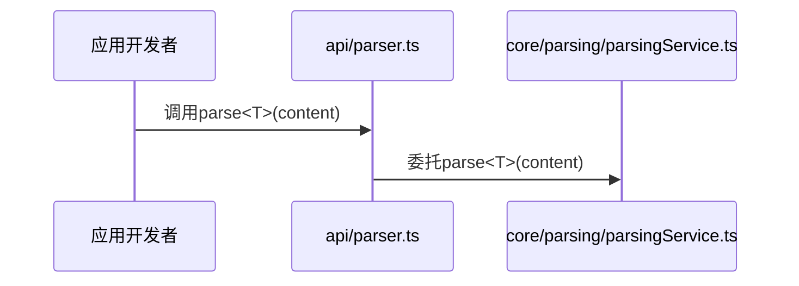
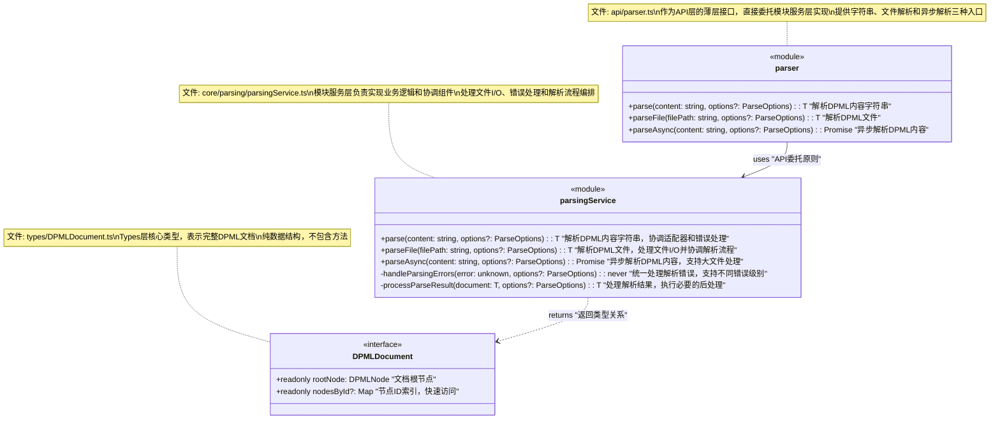

# UML图表表示规则

本文档定义了DPML类库架构UML图表表示的强制规则。

## 1. 图表基本原则

1. **完整性规则**: UML类图必须完整呈现模块的核心组件和它们之间的关系
2. **层次清晰规则**: 图表必须清晰标识不同架构层的组件（API层、Core层、Types层）
3. **注释详尽规则**: 每个组件必须包含详细的设计说明注释
4. **方法属性注释规则**: 组件内的每个方法和属性必须有解释性注释
5. **关系标注规则**: 组件间的关系必须明确标注关系类型和设计原则

## 2. 组件表示规则

### 2.1 组件标记

1. **架构层标记规则**: 使用`<<module>>`、`<<class>>`、`<<interface>>`等标记明确标识组件类型
2. **文件路径注释规则**: 每个组件注释必须以"文件: 路径/文件名.ts"开始，明确指示组件在目录结构中的位置
3. **设计说明规则**: 组件注释必须包含组件职责描述、设计理念和架构符合性说明

```mermaid
class parser {
    <<module>>
    +parse<T>(content: string, options?: ParseOptions): T
}
note for parser "文件: api/parser.ts\n作为API层的薄层接口，直接委托模块服务层实现"
```

### 2.2 方法和属性注释

1. **方法注释规则**: 每个方法后必须添加引号注释，简要说明方法功能
2. **属性注释规则**: 每个属性后必须添加引号注释，说明其用途
3. **私有成员注释规则**: 私有方法和属性必须特别说明其内部作用

```mermaid
class parsingService {
    <<module>>
    +parse<T>(content: string, options?: ParseOptions): T "解析DPML内容字符串，协调适配器和错误处理"
    -handleParsingErrors(error: unknown, options?: ParseOptions): never "统一处理解析错误，支持不同错误级别"
}
```

### 2.3 关系表示

1. **关系类型规则**: 使用不同箭头类型表示不同关系（使用、创建、依赖等）
2. **关系标签规则**: 在关系线上添加标签说明关系类型和架构原则
3. **多重性表示规则**: 必要时使用多重性标记说明关系的数量约束

```mermaid
parser --> parsingService : uses "API委托原则"
parsingService --> parserFactory : creates adapters "创建组件关系"
```

## 3. 跨层级UML图设计

### 3.1 跨层级图结构

1. **层级分组规则**: 使用注释或空间布局明确区分不同架构层
2. **核心组件突出规则**: 重要组件应在图中位置突出，便于理解
3. **组件完整性规则**: 跨层图必须呈现所有关键组件，不遗漏重要节点

### 3.2 复杂图简化规则

1. **非核心简化规则**: 对非核心方法和属性可适当简化，但不能省略核心功能
2. **泛型简化规则**: 复杂泛型可用简化表示，但需在注释中说明完整约束
3. **分区表示规则**: 大型模块可分为多个相关联图表，但需明确关系

## 4. 序列图表示规则

### 4.1 序列图基本规则

1. **参与者标记规则**: 明确标识每个参与者的架构层级和组件类型
2. **消息描述规则**: 每个消息必须有清晰的描述和参数说明
3. **时序正确规则**: 消息顺序必须准确反映实际调用流程



### 4.2 条件和分支

1. **条件分支规则**: 使用alt框表示条件逻辑，每个分支标明条件
2. **异步处理规则**: 异步操作使用活动条和返回虚线清晰表示
3. **错误处理规则**: 错误流程使用明显标记区分正常流程

### 4.3 激活生命线

1. **激活标记规则**: 使用激活条明确标示组件处于活动状态的时间段
2. **嵌套调用规则**: 嵌套调用必须使用嵌套激活条清晰表示层次
3. **并行处理规则**: 并行操作使用par框明确表示

## 5. 与代码映射关系

1. **命名一致性规则**: UML图中的名称必须与实际代码完全一致
2. **结构映射规则**: 图中结构必须准确反映代码结构，不虚构不存在的关系
3. **更新同步规则**: 代码变更后，相关UML图必须同步更新

## 6. 工具规范

1. **工具选择规则**: 推荐使用Mermaid语法编写UML图，确保可版本控制
2. **版本控制规则**: UML图源码必须纳入版本控制，与代码同步更新
3. **可读性规则**: 图表布局必须清晰可读，避免过度复杂和交叉线

## 7. 实例参考

下面是一个完整的模块跨层UML类图示例：



这个示例展示了如何正确表示组件、注释和关系，符合DPML架构UML图表示规则。 