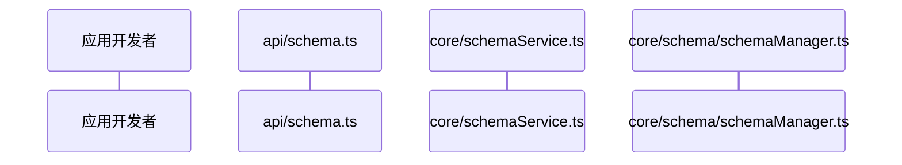
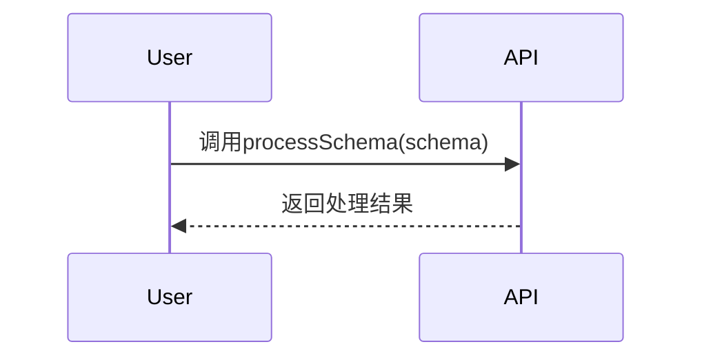
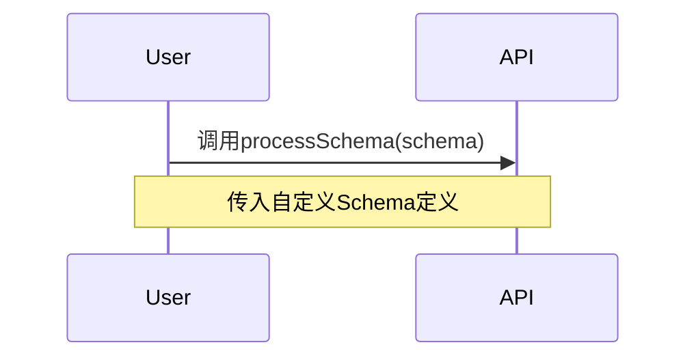
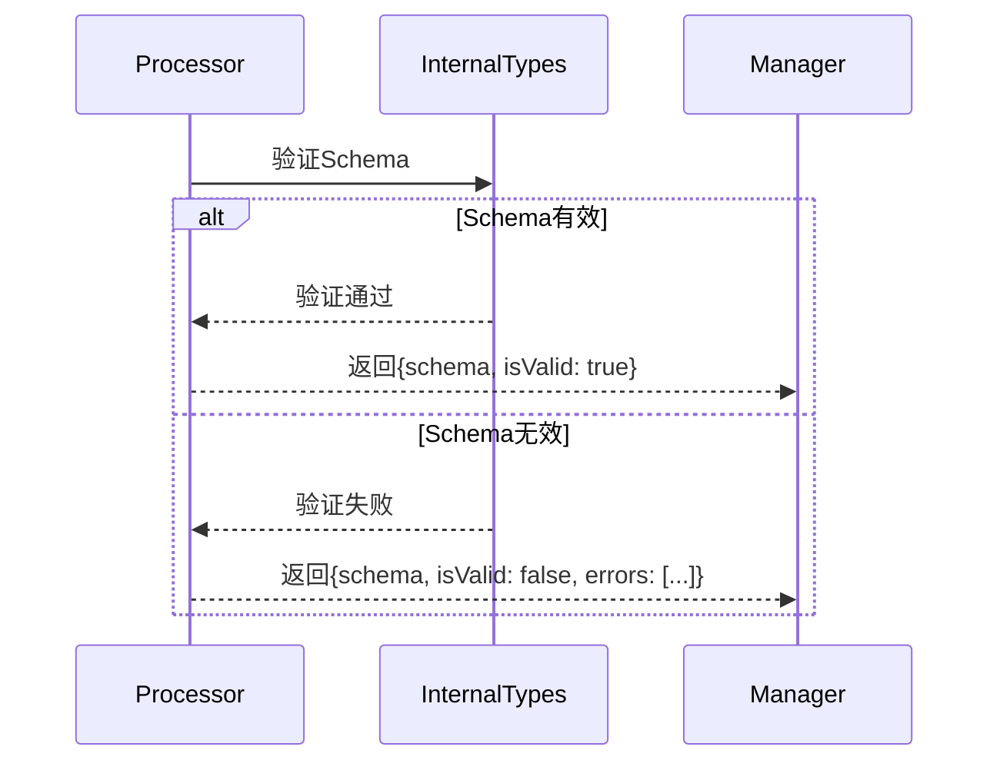
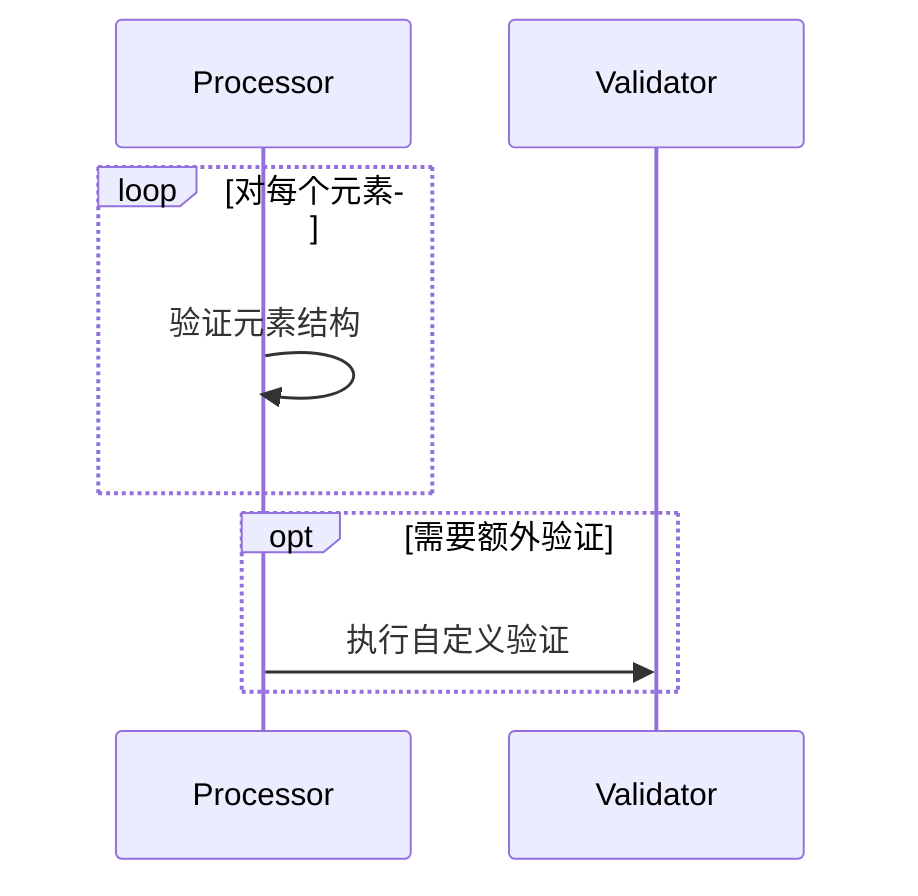
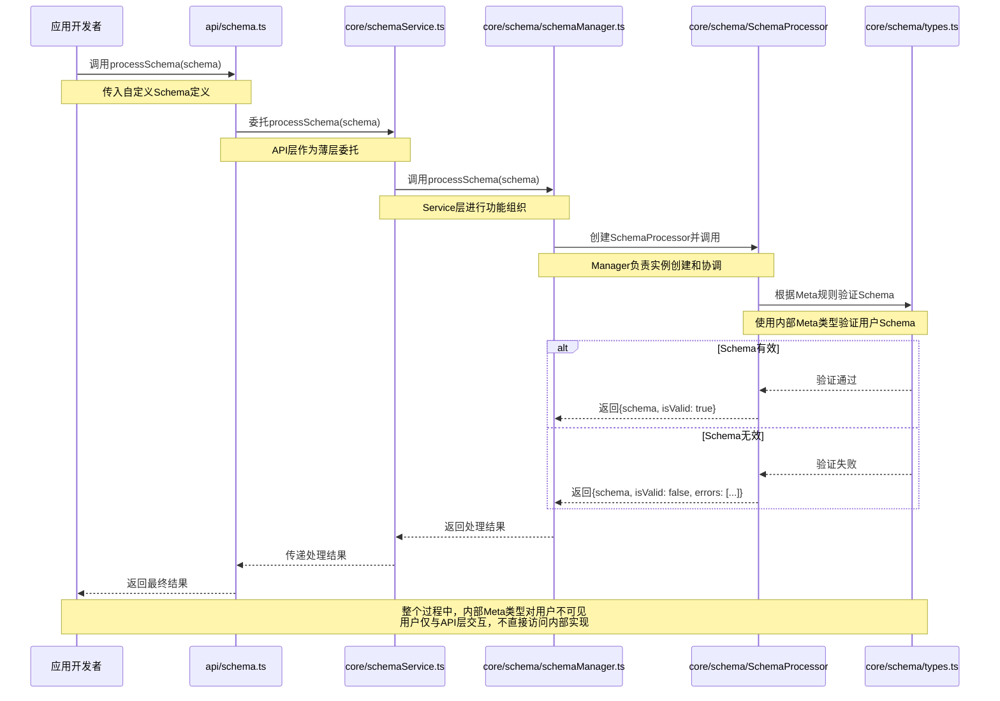
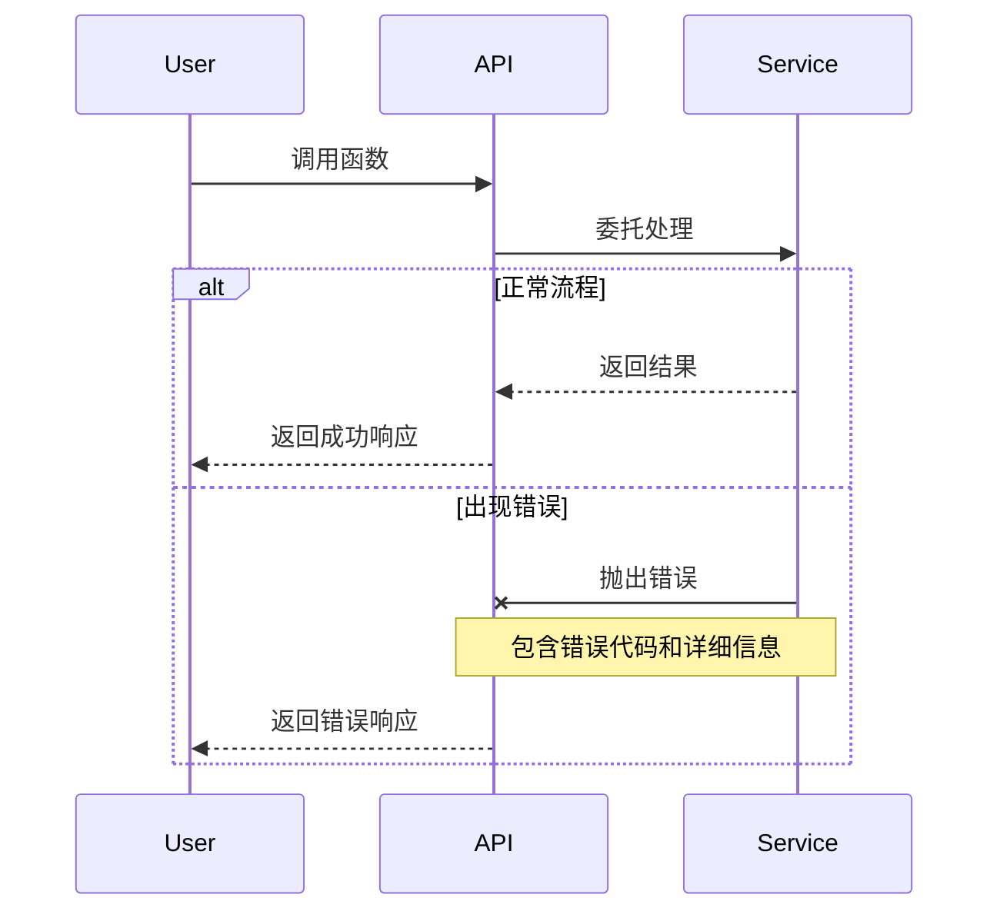
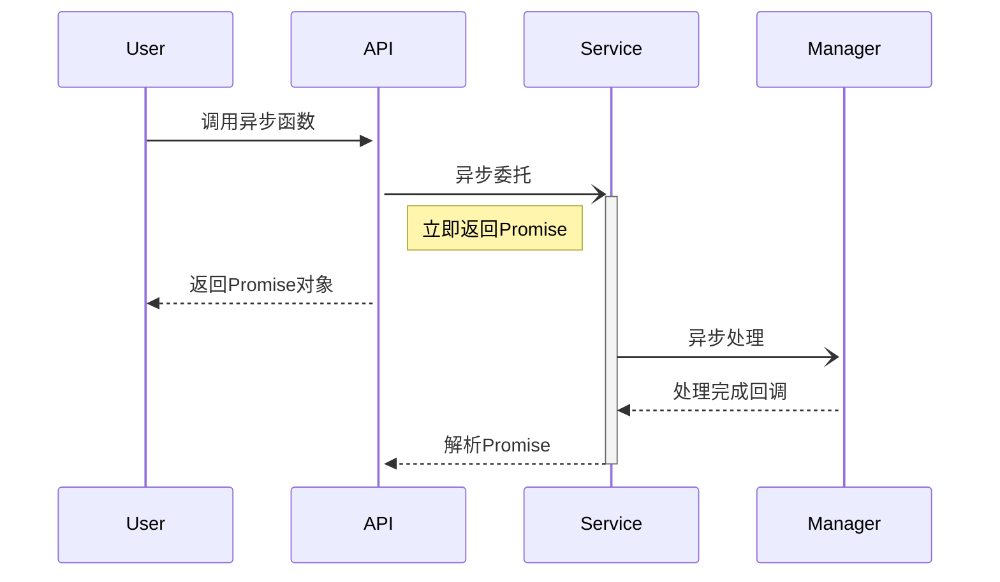

# DPML 泳道图（序列图）规范

本文档规定了DPML项目中泳道图（序列图）的绘制标准，确保项目文档中的流程表示方式一致、清晰、符合项目架构规则。

## 1. 基本规范

### 1.1 使用Mermaid语法

DPML项目的所有泳道图应使用Markdown兼容的Mermaid序列图语法，这样可以直接嵌入到项目文档中并通过Git进行版本控制。

```
```mermaid
sequenceDiagram
    // 序列图内容
```
```

### 1.2 参与者定义

使用`participant`关键字定义参与者，并遵循以下命名约定：

- 使用有意义的短名称表示参与者角色
- 使用`as`关键字添加详细描述，包含文件路径
- 参与者从左到右应按照架构层次顺序排列



### 1.3 消息传递表示

使用以下箭头类型表示不同类型的消息传递：

- `->>` 实线箭头表示同步请求/调用
- `-->>` 虚线箭头表示响应/返回
- `-x` 表示失败的消息
- `-)` 表示异步消息

每个消息应有简洁明确的描述文本：



## 2. 架构层次表示

### 2.1 标准参与者顺序

根据DPML架构规则，泳道图中的参与者应按照以下顺序从左到右排列：

1. **外部使用者** (如应用开发者)
2. **API层** (api/*.ts文件)
3. **Service层** (core/*Service.ts文件)
4. **Manager层** (core/[domain]/*Manager.ts文件)
5. **业务类/内部服务类** (core/[domain]/*.ts文件)
6. **辅助组件** (工厂、内部类型等)

### 2.2 数据流向原则

泳道图必须清晰表示数据流向，遵循以下原则：

- 请求数据流应从左向右传递
- 响应数据流应从右向左传递
- 严格遵循架构规则中的依赖关系

不允许出现违反架构规则的消息传递，如从API层直接访问Manager层。

## 3. 注释与分组

### 3.1 添加注释

使用`Note over`语法添加说明性注释，可以跨越多个参与者：



### 3.2 条件分支

使用`alt/else/end`语法表示条件分支处理：



### 3.3 循环与选项

- 使用`loop/end`表示循环处理
- 使用`opt/end`表示可选处理
- 使用`par/and/end`表示并行处理



## 4. 完整示例

以下是一个符合DPML架构规则的schema处理流程泳道图：



## 5. 泳道图审查清单

创建或更新泳道图时，应检查以下事项：

- [ ] 是否使用了正确的参与者定义，包含文件路径？
- [ ] 参与者是否按照架构层次从左到右排列？
- [ ] 消息传递是否遵循架构规则的依赖关系？
- [ ] 是否使用了合适的箭头类型表示不同交互？
- [ ] 条件分支和流程控制是否正确表示？
- [ ] 是否添加了必要的注释说明关键步骤？
- [ ] 整体流程是否完整且符合业务逻辑？

## 6. 特殊场景处理

### 6.1 复杂流程拆分

当流程过于复杂时，可以拆分为多个泳道图：

1. **主流程图**：显示核心处理流程和主要参与者
2. **子流程图**：单独展示特定环节的详细处理

使用注释或标题明确表示图表范围：

```
// Schema验证子流程 - 详细验证步骤
```

### 6.2 错误处理流程

错误处理应使用单独的条件分支清晰表示：



### 6.3 异步流程表示

对于异步处理流程，使用异步消息箭头并考虑添加激活条表示处理时间：



## 7. 与其他图表的协调

泳道图应与项目中的其他图表（如类图、组件图）保持一致：

- 使用相同的命名约定
- 保持一致的架构层次划分
- 确保文件路径表示一致

当系统行为发生变化时，应同步更新相关的泳道图和类图，保持文档的一致性。

## 8. 版本控制与更新

泳道图应随代码更新而保持同步。当进行流程变更时，确保：

1. 更新相关文档中的泳道图
2. 在PR描述中标注泳道图已更新
3. 泳道图变更应作为代码审查的一部分 