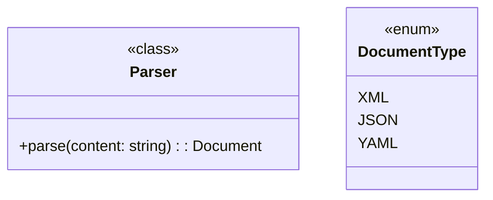
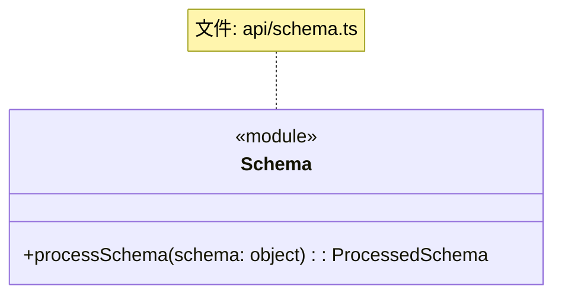
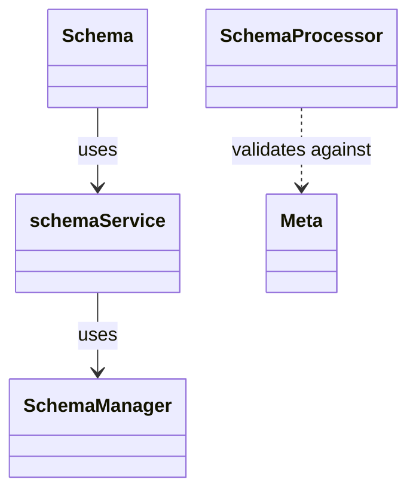
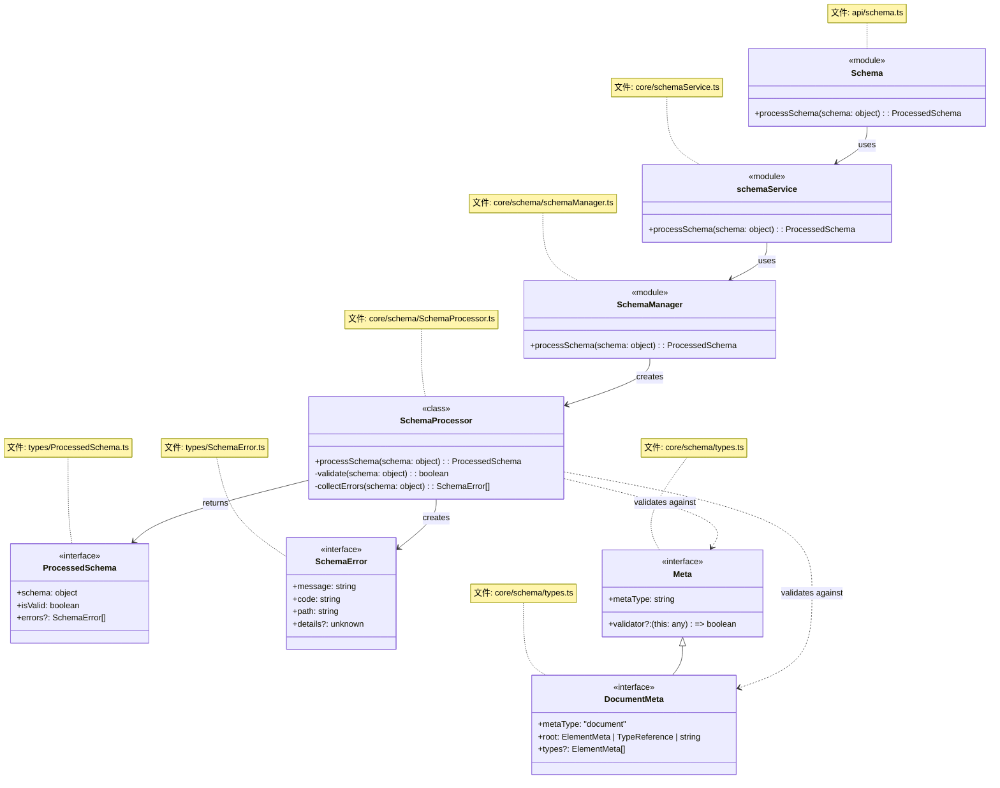
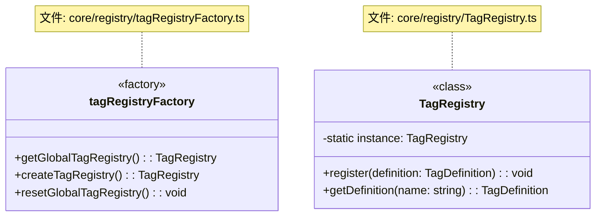

# DPML UML类图规范

本文档规定了DPML项目中UML类图的绘制标准，确保项目文档中的类图表示方式一致、清晰、符合项目架构规则。

## 1. 基本规范

### 1.1 使用Mermaid语法

DPML项目的所有类图应使用Markdown兼容的Mermaid类图语法，这样可以直接嵌入到项目文档中并通过Git进行版本控制。

```
```mermaid
classDiagram
    // 类图内容
```
```

### 1.2 组件类型表示

使用类内的`<<>>`标记来表示组件类型：

- `<<module>>` - 表示函数模块（无状态函数集合）
- `<<class>>` - 表示实际的类
- `<<interface>>` - 表示接口或类型定义
- `<<enum>>` - 表示枚举类型

示例：


### 1.3 文件路径表示

使用Mermaid的`note for`语法为每个组件添加文件路径注释：



## 2. 目录结构表示

### 2.1 文件路径与架构层级

根据DPML架构规则，项目分为几个主要目录层级，文件路径注释必须反映这些层级：

- **api/** - API层，对外暴露的功能接口
- **types/** - 类型定义层，对外暴露的数据类型
- **core/** - 核心实现层，内部功能实现
  - **core/[domain]** - 业务域目录

### 2.2 内部类型与对外类型

按照架构规则第2.7节：
- 对外暴露的类型必须位于`types/`目录
- 内部实现类型应位于`core/[domain]/`目录
- 推荐将相关的内部类型集中在一个类型文件中，如`core/parsing/types.ts`

## 3. 关系表示

### 3.1 依赖关系

- `-->` 实线箭头表示"使用"依赖关系
- `..>` 虚线箭头表示"依赖"关系（较弱的依赖）
- `<|--` 表示继承关系
- `*--` 表示组合关系（强关联）
- `o--` 表示聚合关系（弱关联）

每个关系箭头都应添加描述文本：



### 3.2 架构规则中的依赖

按照架构规则必须遵循的依赖方向：
- API层只能依赖Service层
- Service层只能依赖Manager层
- Manager层可以依赖业务类和内部服务类

任何违反这些规则的依赖关系都不应出现在类图中。

## 4. 完整示例

以下是一个符合DPML架构规则的schema模块类图示例：



## 5. 类图审查清单

创建或更新类图时，应检查以下事项：

- [ ] 是否使用了正确的`<<>>`标记表示组件类型？
- [ ] 是否为每个组件添加了文件路径注释？
- [ ] 内部类型是否正确放置在core目录下？
- [ ] 对外类型是否正确放置在types目录下？
- [ ] 依赖关系是否符合架构规则？
- [ ] 类、接口和模块的命名是否符合规范？
- [ ] 每个关系箭头是否有清晰的描述文本？

## 6. 特殊情况处理

### 6.1 复杂类图拆分

当一个模块较大，类图变得复杂难以阅读时，可以考虑拆分为多个类图：

1. **概览类图**：只显示主要组件和关系
2. **详细类图**：针对特定部分展示详细结构

使用注释明确标识类图的范围：

```
// Schema模块概览类图 - 仅显示核心组件
```

### 6.2 工厂和单例表示

对于工厂模式和单例模式，使用以下约定：

- 工厂模块使用`<<factory>>`标记
- 单例类添加静态工厂方法并注明



## 7. 版本控制与更新

类图应随代码更新而保持同步。当进行架构变更时，确保：

1. 更新相关文档中的类图
2. 在PR描述中标注类图已更新
3. 类图变更应作为代码审查的一部分 