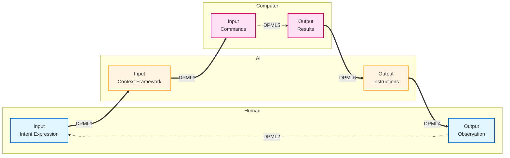
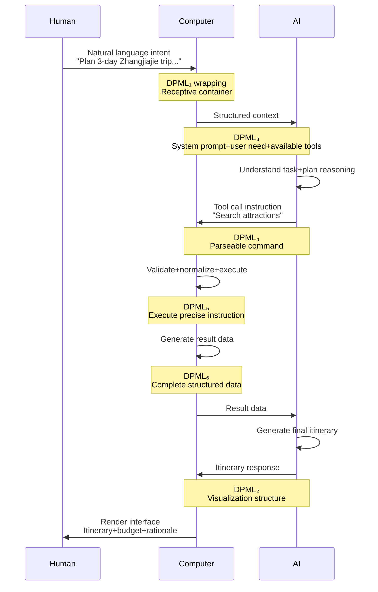

# DPML Whitepaper

**Status**: Draft<br>
**Version**: 1.0<br>
**Author**: Sean Jiang (Deepractice.ai)

---

## Abstract

**Target Audience**: AI application developers, AI platform architects, prompt engineers

**Core Problem**: As AI systems evolve from simple conversations to multi-agent collaboration, configuration files, prompts, and documentation become scattered across incompatible formats (YAML configs, Markdown prompts, standalone docs), leading to difficult modifications, black-box debugging, and information desynchronization. The root cause is that traditional approaches force the separation of driving information for three parties (humans, AI, computers), resulting in collaboration difficulties and high maintenance costs.

**Solution**: DPML (Deepractice Prompt Markup Language) is grounded in the "Three-Party Positioning Theory"—humans excel at innovative intent, AI excels at semantic translation, computers excel at precise execution. Each requires different types of information, yet all must share a single carrier. By rigorously proving that the four semantic dimensions (tag/attribute/content/structure) constitute the necessary and sufficient minimal set, DPML adopts XML-like syntax to unify information flow among all three parties, enabling a unified infrastructure for configuration management, workflow orchestration, and end-to-end observability.

**Key Innovations**:

- Theoretical Foundation: Three-Party Positioning Theory → Four-Dimension Semantic Derivation → Six-State Flow Model
- Technical Choice: XML-like syntax simultaneously serves humans (visualization), AI (native understanding), computers (structured parsing)
- Design Philosophy: Constrain without binding (provide framework while preserving creativity), unified protocol with differentiated roles

This document covers: design philosophy and theoretical derivation (Chapter 3), technical decisions (Chapter 4), application scenarios (Chapter 6), implementation considerations (Chapter 7), and ecosystem planning (Chapter 8).

---

## Table of Contents

1. [Introduction](#1-introduction)
2. [Requirements Analysis](#2-requirements-analysis)
3. [Design Philosophy](#3-design-philosophy)
4. [Technical Decisions](#4-technical-decisions)
5. [Architecture Overview](#5-architecture-overview)
6. [Application Scenarios](#6-application-scenarios)
7. [Implementation Considerations](#7-implementation-considerations)
8. [Ecosystem Planning](#8-ecosystem-planning)
9. [References](#9-references)
10. [Appendix](#10-appendix)

---

## 1. Introduction

### 1.1 Core Problem

The complexity of AI systems is growing rapidly. From single-prompt interactions to multi-agent collaboration, tool invocation, and state management, prompt engineering faces fundamental challenges of **information fragmentation** and **maintenance difficulty**:

- Prompt files spanning thousands of lines with configuration parameters mixed with instructions
- Collaborative editing prone to conflicts
- Debugging difficulties with no way to pinpoint specific issues
- Lack of modularization and reuse mechanisms

Unlike ordinary text, prompts require **strong logic** (consistency, structure, precision). As prompts expand, maintaining this strong logic becomes extremely difficult: changing role definitions in location A while forgetting conflicting constraints in location B; tool invocation logic, exception handling, and state management intertwined in long text.

### 1.2 Problem Statement

Modern AI systems involve three core roles, each with different information needs:

| Role         | What They Need          | Traditional Approach                | Problem                                                             |
| ------------ | ----------------------- | ----------------------------------- | ------------------------------------------------------------------- |
| **Human**    | Observable system state | Documentation separate from code    | Cannot observe AI reasoning process, docs drift from implementation |
| **AI**       | Context and constraints | Prompts separate from configuration | Lacks execution context, cannot translate accurately                |
| **Computer** | Structured instructions | Config files (YAML/JSON)            | AI cannot understand, humans struggle to audit                      |

**The fundamental problem of traditional approaches**: forcing these three types of information into incompatible formats.

**Real-world example**: A travel planning agent's configuration scattered across 3 files:

```yaml
# config.yaml
model: llm-model
temperature: 0.7
```

```markdown
# system_prompt.md

You are a professional travel planning assistant, maintaining accurate and reliable advice.
```

```markdown
# README.md

This agent uses a conservative strategy, temperature=0.5 (Note: This documentation is outdated)
```

When the product manager requests "make responses more creative," the engineer modifies `config.yaml` (temperature 0.7 → 0.9) but forgets to update the "maintain accurate" instruction in `system_prompt.md`, while `README.md` has long been outdated. Result: AI output becomes inconsistent, user complaints increase, and it takes 3 days to identify the conflict between temperature and prompt instructions.

**Core contradiction**: These are all essentially prompts (documentation for humans, instructions for AI, configuration for computers), yet they're forced into incompatible formats, leading to information desynchronization, debugging difficulties, and **lack of a unified information carrier**.

### 1.3 DPML's Core Insight

DPML is based on a fundamental understanding:

> **Modern AI systems require three types of driving signals (human-driven, AI-driven, computer-driven). This information must be unified into a single flow carrier, and the flow process must be fully observable.**

This insight stems from a deep understanding of the **core positioning** of the three parties in AI systems:

- **Human: Innovative Intent** - The only role capable of actively initiating practice and generating true innovation
- **AI: Semantic Translation** - The only role capable of simultaneously understanding natural language and processing at high speed
- **Computer: Precise Execution** - The only role capable of executing instructions with ultra-high speed and absolute precision

**For detailed three-party positioning theory, see Section 3.1**.

Based on this insight, DPML addresses three levels of problems:

1. **Semantic Expression**: Unify the information carrier for all three parties, solving prompt inflation
2. **Structure Visualization**: Make AI systems observable and debuggable, no longer black boxes
3. **Computation Encapsulation**: Through domain abstraction, enable both humans and AI to develop applications more efficiently

**For complete design philosophy and technical derivation, see Chapter 3**.

### 1.4 Document Scope

This whitepaper covers:

- DPML's design philosophy and first principles (three-party positioning theory)
- Technical decision derivation process and trade-off analysis
- Architecture design and application scenarios
- Ecosystem planning and standardization path

This whitepaper does not include:

- Detailed technical specifications (see [DPML Protocol Specification](../protocol/index.en.md), [Syntax Specification](../protocol/syntax.en.md), [Semantic Specification](../protocol/semantics.en.md))
- Specific implementation guides (see DPML Implementation Guide)
- Domain-specific element definitions (see respective domain specifications)

### 1.5 Terminology

**DPML (Deepractice Prompt Markup Language)**
A three-party collaboration protocol using XML-like syntax to unify driving signals for computers, AI, and humans.

**XML-like Syntax**
The format adopted by DPML, featuring 4 semantic dimensions (tag/attribute/content/structure). DPML is not the XML specification and does not use advanced XML features like DTD/Schema/Namespace, but borrows XML's four-dimensional semantic structure. Can leverage mature XML parser ecosystems without being bound by all XML specifications.

**Three-Party Positioning**
The irreplaceable positioning of three core roles in modern AI systems:

- Human: Innovative intent
- AI: Semantic translation
- Computer: Precise execution

**Driving Signal**
In modern AI systems, structured information that guides and triggers system behavior. Divided into three types:

- Computer driving signals: Configuration parameters (e.g., model, temperature)
- AI driving signals: Natural language instructions (e.g., system prompts)
- Human driving signals: Observable state information (e.g., execution logs, visual interfaces)

The core value of DPML is to unify these three types of signals in a single carrier, enabling lossless flow.

**Semantic Dimension**
Independent semantic space for information expression. XML-like syntax has 4 semantic dimensions (tag/attribute/content/structure), while YAML/JSON have only 2 (key/value).

**Strong Logic**
Compared to ordinary text, prompts require higher levels of:

- Consistency: The same concept must be expressed consistently across different locations
- Structure: Information organization must follow clear hierarchical relationships
- Precision: Instructions and constraints must be unambiguous

Example: "You are an assistant" conflicts with "maintain accuracy" when temperature=0.9.

**DOM (Document Object Model)**
The tree-like hierarchical structure of XML-like syntax, naturally supporting visual rendering, which is the foundation of DPML's observability.

---

## 2. Requirements Analysis

This chapter transforms the **three-party positioning theory** and **three-tier progressive requirements** from Chapter 1 into concrete, verifiable functional and non-functional requirements.

Detailed analysis of the core positioning and capabilities of the three parties can be found in Section 3.1; here we derive requirements directly.

### 2.1 Functional Requirements

Based on the three-party positioning theory, DPML's functional requirements are as follows:

#### FR1: Unified Information Carrier

**Requirement Statement**: A single document must simultaneously carry configuration for computers, instructions for AI, and visualization information for humans.

**Rationale**:

- Avoid information fragmentation (configuration, prompts, documentation separated)
- Ensure information synchronization (modify once, all three parties perceive simultaneously)
- Reduce maintenance costs (no need to jump between multiple files)

**Acceptance Criteria**:

- A single `.dpml` file contains the complete Agent/Task/Workflow definition
- After modifying the file, computer, AI, and human can all immediately perceive the change
- No additional synchronization mechanism needed

#### FR2: Separation of Concerns

**Requirement Statement**: Different types of information must be clearly separated structurally, each optimized independently.

**Rationale**:

- Configuration parameters (model, temperature) should be outside AI's natural language space
- AI prompt content should not be mixed with computer parameters
- Human visualization needs should not affect computer parsing efficiency

**Acceptance Criteria**:

- Configuration parameters in attribute space (`model="llm-model"`)
- AI instructions in content space (`<prompt>You are an assistant</prompt>`)
- Visualization structure in DOM hierarchy (nested elements)
- Three spaces do not interfere with each other

#### FR3: Full Observability

**Requirement Statement**: The flow of DPML among the three parties must be visualizable and auditable.

**Rationale**:

- Debugging requires seeing the complete call chain
- Optimization requires analyzing input/output at each step
- Auditing requires tracing the decision-making process

**Acceptance Criteria**:

- Each flow step is a DPML document (Prompt → Tool Call → Result → Response)
- Tools can automatically render DPML into visual interfaces
- Support for time-series state snapshots

#### FR4: Component Reusability

**Requirement Statement**: Support modularization and reference mechanisms to avoid redundant definitions.

**Rationale**:

- In large systems, multiple agents share the same prompt fragments
- Tool definitions should be reusable across agents
- Role definitions should be composable

**Acceptance Criteria**:

- Elements can be identified by `id`
- Future versions support `<ref id="..."/>` references
- Current design establishes syntactic foundation for references

### 2.2 Non-Functional Requirements

#### NFR1: Low Cognitive Load

**Requirement Statement**: The mental cost for AI and humans to understand DPML must be minimized.

**Rationale**:

- AI attention is a scarce resource; complex syntax consumes tokens
- Human learning curve affects adoption rate
- Cognitive load directly impacts generation and maintenance efficiency

**Quantitative Metrics**:

- AI-generated DPML format correctness > 95%
- Human reading comprehension time < 50% of equivalent YAML
- Core concepts ≤ 5

**Design Strategy**:

- Use consensus concepts (role, agent, task) rather than invented terms
- Minimize protocol-layer rules (kebab-case + 2 reserved attributes)
- Leverage AI's native understanding of XML-like syntax

#### NFR2: Extensibility

**Requirement Statement**: The protocol must support future evolution without breaking compatibility.

**Rationale**:

- AI system requirements change rapidly
- New domains (Agent, Task, Workflow) will continuously emerge
- Tool ecosystem needs a stable foundation

**Design Strategy**:

- Protocol layer only defines meta-semantics, not specific elements
- Domain specifications evolve independently
- Reserve extension points (namespace, version control reserved)

#### NFR3: Toolchain-Friendly

**Requirement Statement**: DPML must be easy for tools to process (parse, validate, transform, visualize).

**Rationale**:

- Tool ecosystem is key to protocol success
- Lowering implementation barriers enables rapid adoption
- IDE integration and visual editors are essential

**Design Strategy**:

- Adopt XML-like syntax (can reuse mature XML parsers)
- Avoid XML advanced features (DTD, Schema, Namespace not introduced in v1.0)
- DOM structure naturally supports visualization

### 2.3 Requirements Priority

| Requirement                      | Priority | v1.0 Status                                                |
| -------------------------------- | -------- | ---------------------------------------------------------- |
| FR1: Unified Information Carrier | P0       | Fully implemented                                          |
| FR2: Separation of Concerns      | P0       | Fully implemented (4 dimensions)                           |
| FR3: Full Observability          | P1       | Protocol supports, tools pending                           |
| FR4: Component Reusability       | P2       | `id` syntax ready, reference mechanism for future versions |
| NFR1: Low Cognitive Load         | P0       | Core concepts ≤ 5                                          |
| NFR2: Extensibility              | P1       | Protocol/domain layer separation                           |
| NFR3: Toolchain-Friendly         | P1       | XML-like syntax adopted, can reuse XML parsers             |

---

**Chapter 2 Key Points**

- **Functional Requirements**: Unified information carrier, separation of concerns, full observability, component reusability
- **Non-Functional Requirements**: Low cognitive load (core concepts ≤ 5), extensibility (protocol/domain separation), toolchain-friendly
- **Design Goals**: Single document serves all three parties, lossless information flow, reduced maintenance costs

---

## 3. Design Philosophy

### 3.1 First Principles: Three-Party Positioning Theory

#### 3.1.1 The Essential Structure of Modern AI Systems

Modern AI systems are not a stage for a single role, but a **three-party collaboration** system:

| Role         | Core Capability                       | Irreplaceable Advantage                                                                                                                                                                                  |
| ------------ | ------------------------------------- | -------------------------------------------------------------------------------------------------------------------------------------------------------------------------------------------------------- |
| **Human**    | Practice + Consciousness → Innovation | The only role capable of actively initiating practice, learning from experience, and generating true innovation                                                                                          |
| **AI**       | Pattern + Knowledge → Mapping         | The only role capable of **simultaneously** understanding natural language (like humans) and processing at high speed (like computers), best at bidirectional conversion between intent and instructions |
| **Computer** | Precision + Speed → Efficiency        | The only role capable of executing deterministic tasks with ultra-high speed and absolute precision                                                                                                      |

**First Principle**:

> The information carrier must **simultaneously** serve all three parties to fully unleash the potential of modern AI systems.

Problems with traditional systems:

- **Markdown Prompts**: Only serve AI (computers cannot reliably parse)
- **JSON/YAML Configuration**: Primarily serve computers (high cognitive load for AI and humans)
- **Separated Documentation**: Information scattered across config files, prompt files, and docs, cannot synchronize

**DPML's Core Insight**:
A **unified information carrier** is needed, allowing the same document to flow losslessly among all three parties.

#### 3.1.2 The Essential Needs of the Three Parties

Deriving requirements for the information carrier from the three-party positioning:

**Human Needs**:

- Need to understand "what concept this is" (concept dimension)
- Need to see visualized hierarchical structure (structure dimension)
- Need to observe system runtime state (observability)

**AI Needs**:

- Need natural language expression space (content dimension)
- Need to understand context and hierarchical relationships (structure dimension)
- Need low cognitive load syntax (avoid complex paths)

**Computer Needs**:

- Need structured configuration parameters (configuration dimension)
- Need parseable, validatable format (formalization)
- Need mature tool ecosystem (practicality)

**Core Contradiction**:
These needs appear independent, even conflicting. The traditional solution is **separation**:

- Computer reads config files (JSON/YAML)
- AI reads prompt files (Markdown/plain text)
- Human reads documentation (Markdown/Wiki)

**DPML's Breakthrough**:
Through **semantic dimension theory**, find the minimal set that can **simultaneously** satisfy all three parties' needs.

### 3.2 Theoretical Derivation: Necessity of Four Semantic Dimensions

#### 3.2.1 Semantic Dimension Definition

**Semantic Dimension**: Independent semantic space for information expression that can be understood and used by all three parties.

Different formats have different numbers of semantic dimensions:

| Format          | Dimensions | Dimension Components                  | Three-Party Collaboration Capability        |
| --------------- | ---------- | ------------------------------------- | ------------------------------------------- |
| Plain Text      | 0          | (linear text)                         | Serves AI only                              |
| YAML/JSON       | 2          | key + value                           | Primarily serves computers                  |
| XML-like Syntax | 4          | tag + attribute + content + structure | **Serves all three parties simultaneously** |

#### 3.2.2 Derivation Process: Why Four Dimensions Are Needed

**Question**: What is the minimum number of semantic dimensions needed to serve all three parties simultaneously?

**Derivation**:

**Step 1: Identify Minimal Requirements Set**

Extract **irreducible** requirements from the needs analysis in 3.1.2:

| Source   | Requirement Description                   | Can It Share Other Dimensions                                                            |
| -------- | ----------------------------------------- | ---------------------------------------------------------------------------------------- |
| Human    | Need to understand "what concept this is" | [Required] Must be independent (concept cannot be expressed as config value)             |
| Computer | Need to parse configuration parameters    | [Required] Must be independent (parameters cannot be mixed in natural language)          |
| AI       | Need natural language expression space    | [Required] Must be independent (natural language cannot be constrained by config syntax) |
| Human    | Need visualized hierarchical structure    | [Required] Must be independent (hierarchy is an additional dimension)                    |

**Step 2: Map to Semantic Dimensions**

| Requirement                | Corresponding Dimension | Necessity Proof                                                                                                      |
| -------------------------- | ----------------------- | -------------------------------------------------------------------------------------------------------------------- |
| Understand concept         | **Tag**                 | Required. `<agent>` vs `llm.agent` (Tag is concept, key is just path)                                                |
| Config parameters          | **Attribute**           | Required. `model="llm-model"` vs separate config node (avoid nesting explosion)                                      |
| Natural language           | **Content**             | Required. `<prompt>You are assistant</prompt>` vs `prompt: "You are assistant"` (former has lower AI cognitive load) |
| Hierarchical visualization | **Structure**           | Required. DOM tree vs indentation (former naturally visualizes)                                                      |

**Step 2.5: Dimension Independence Validation**

Can the 4 dimensions be merged?

| Attempted Merge               | Merge Example             | Core Problem                                                                                                                                                                                       | Conclusion          |
| ----------------------------- | ------------------------- | -------------------------------------------------------------------------------------------------------------------------------------------------------------------------------------------------- | ------------------- |
| **Tag + Attribute**           | `<"agent" model="...">`   | Concept and config forced into same semantic layer, breaking conceptual hierarchy; needs extra rules to distinguish "concept attributes" from "config attributes"; violates separation of concerns | Cannot merge        |
| **Content + Attribute**       | `<prompt content="..."/>` | Long text in attributes causes format chaos; natural language treated as "config value", requires quote escaping; multi-paragraph prompts completely unreadable                                    | Cannot merge        |
| **Structure via indentation** | YAML's indentation syntax | Requires "mental calculation" of hierarchy, cannot directly render DOM tree; needs extra parsing of indentation semantics; AI must count spaces to determine levels                                | Must be independent |

**Conclusion**: The 4 dimensions are mutually independent; any merge violates at least one party's core requirements or increases cognitive load.

**Step 3: Necessity Proof**

What happens with fewer than 4 dimensions?

| Missing Dimension | Consequence                                                                                                   |
| ----------------- | ------------------------------------------------------------------------------------------------------------- |
| No Tag            | Humans cannot understand concepts, computers cannot identify node types, AI lacks context                     |
| No Attribute      | Config parameters mixed into Content, AI struggles to understand, computers cannot parse structurally         |
| No Content        | AI has no natural language space, loses flexibility, humans cannot express naturally                          |
| No Structure      | Humans cannot visualize, computers struggle to traverse, AI has difficulty understanding contextual hierarchy |

Conclusion: All 4 dimensions are necessary, none can be removed.

**Step 3.5: Value Dimension Absorption Proof**

YAML/JSON have 2 dimensions (key+value), why not 5 dimensions (tag+attribute+content+structure+value)?

| Format Comparison | Where is value       | Why not an independent dimension                                          |
| ----------------- | -------------------- | ------------------------------------------------------------------------- |
| YAML/JSON         | `key: value`         | value is a flat string, absorbed by the content dimension                 |
| XML-like Syntax   | `<tag>content</tag>` | content is a superset of value (supports rich text/nested child elements) |

**Key Insight**: value is not an independent dimension, but a simplified form of content. The content dimension in XML-like syntax can express both simple values (`<name>John</name>`) and complex structures (`<prompt>Multi-line text...</prompt>`), thus fully covering the functionality of value.

**Step 4: Sufficiency Proof (Reductio ad Absurdum for 5th Dimension)**

**Hypothesis**: There exists a 5th independent dimension X

**Derivation**: X must simultaneously satisfy:

1. **Independence**: Cannot be expressed by Tag/Attribute/Content/Structure
2. **Necessity**: At least one party (human/AI/computer) has an irreducible need

**Exhaustive Analysis of Candidate Dimensions**:

| Candidate Dimension      | Independence Test                                            | Conclusion      |
| ------------------------ | ------------------------------------------------------------ | --------------- |
| **Namespace**            | Can be expressed via Attribute: `namespace="mcp"`            | Not independent |
| **Comments/Docs**        | Can be expressed via special Tag: `<metadata>`, `<doc>`      | Not independent |
| **Styling/Display**      | Can be expressed via Attribute: `class="highlight"`          | Not independent |
| **Version/State**        | Can be expressed via Attribute: `version="1.0"`              | Not independent |
| **Reference/Link**       | Can be expressed via Attribute: `ref="agent-id"`             | Not independent |
| **Permissions/Security** | Can be expressed via Attribute: `access="private"`           | Not independent |
| **Events/Hooks**         | Can be expressed via special Tag+Content: `<on-error>...</>` | Not independent |
| **Variables/Templates**  | Can be expressed via Content interpolation or special Tag    | Not independent |

**Key Insight**:

- All possible extension needs can be expressed by the existing 4 dimensions
- Tag's conceptualization + Attribute's configuration + Content's semantics + Structure's hierarchy already cover all orthogonal dimensions of information expression
- Any new dimension is essentially a combination or specialization of these 4

**Reductio Conclusion**: Cannot find a 5th independent and necessary dimension. 4 dimensions are sufficient.

**Final Conclusion**: **Four dimensions are the necessary and sufficient minimal set**.

#### 3.2.3 Instance Verification: Format Evolution

**Plain Text (0 structured dimensions)**:

```
This is a travel planning assistant using a large model with temperature 0.7
```

- [Supports] AI understands natural language
- [Not Supported] Computer cannot reliably parse parameters
- [Not Supported] Human sees linear text, no hierarchy
- **Conclusion**: Serves AI only

**YAML (2 dimensions: key + value)**:

```yaml
agent:
  llm:
    model: llm-model
    temperature: 0.7
  prompt: 'You are a travel planning assistant'
```

- [Supports] Computer parses key-value pairs
- [Partial] AI needs to understand path syntax (`agent.llm.model`)
- [Partial] Human sees indentation, requires mental calculation of hierarchy
- [Partial] Config and content mixed in values (insufficient type dimension)
- **Conclusion**: Primarily serves computers, cognitive load for AI/humans

**XML-like Syntax (4 dimensions: tag + attribute + content + structure)**:

```xml
<agent>
  <llm model="llm-model" temperature="0.7"/>
  <prompt>You are a travel planning assistant</prompt>
</agent>
```

- [Supports] Tag: All three parties understand concepts (`<agent>` = agent)
- [Supports] Attribute: All three parties can read config (`model="llm-model"`)
- [Supports] Content: All three parties can access content (independent natural language space)
- [Supports] Structure: All three parties can utilize hierarchy (DOM tree naturally visualizes)
- **Conclusion**: **Each dimension is a shared semantic space for all three parties**

**Natural Advantages of Four Semantic Dimensions**:

- No compilation needed (already in final form, vs custom DSL)
- AI native understanding (LLMs have strong comprehension and generation capabilities for XML-like syntax)
- Human native understanding (DOM structure aligns with human cognition)

#### 3.2.4 Dimension Separation of Concerns and Information Sharing

Key design principle: **Separation of Concerns + Information Sharing**

| Dimension | Primary Service            | Secondary Service                                 | Responsibility            | Example                |
| --------- | -------------------------- | ------------------------------------------------- | ------------------------- | ---------------------- |
| Tag       | Human (understand concept) | Computer (node type), AI (context)                | Concept definition        | `<prompt>`, `<tool>`   |
| Attribute | Computer (parse config)    | AI (understand params), Human (view values)       | Config parameters         | `model="llm-model"`    |
| Content   | AI (natural language)      | Human (reading), Computer (extraction)            | Semantic content          | `You are an assistant` |
| Structure | Human (visualization)      | Computer (traversal), AI (hierarchical relations) | Hierarchical organization | DOM tree               |

**This is not information isolation, but responsibility optimization**:

- Each dimension optimized for a specific role (primary responsibility)
- But all roles can access all dimensions (information sharing)
- Ensures both professional division of labor and collaborative foundation

#### 3.2.5 From Four Semantic Dimensions to Six-State Flow

The four semantic dimensions (Tag/Attribute/Content/Structure) answer the question of "**what to express with**", but have not yet answered the question of "**where to express**".

In modern AI systems, information flows among three entities:

- **Human** needs to **input intent** and **observe results**
- **AI** needs to **receive context** and **output instructions**
- **Computer** needs to **execute commands** and **return data**

This forms a **3×2 matrix** with 6 information exchange points. DPML plays different roles at these 6 positions, but always maintains a unified four-dimensional semantic structure.

The next section elaborates on this six-state flow model.

---

### 3.3 Six-State Flow: DPML's Dynamic Value Model

DPML is not a static configuration file, but a **dynamic information carrier that flows**. In a complete AI system operation cycle, DPML plays different roles as it flows among three entities, but always maintains a unified syntactic structure.

#### 3.3.1 Three-Party Input-Output Matrix

Starting from the three-party positioning theory in Section 3.1, each entity has the capability of **information reception** and **information output**. This forms a **3×2 matrix** with 6 information exchange points:



**Key Insight**: DPML exists at all 6 positions, but plays different roles.

#### 3.3.2 Role Positioning of Six States

| State     | Position          | Role                    | Purpose                                     | Design Goal                                                  |
| --------- | ----------------- | ----------------------- | ------------------------------------------- | ------------------------------------------------------------ |
| **DPML₁** | Human→Computer    | Receptive Container     | Package user's natural expression           | Preserve the original richness of human intent               |
| **DPML₂** | Computer→Human    | Visualization Structure | Auto-render as interface                    | Reduce human comprehension cost, focus on content not format |
| **DPML₃** | Computer→AI       | Structured Framework    | Organize context information hierarchically | Provide AI with complete reasoning basis                     |
| **DPML₄** | AI→Computer       | Parseable Command       | AI-generated execution instructions         | Enable computer to execute AI intent                         |
| **DPML₅** | Computer Internal | Precise Instruction     | Validated execution command                 | Guarantee computer can execute without error                 |
| **DPML₆** | Computer Internal | Precise Data            | Complete execution result                   | Provide reliable data source for AI's next reasoning         |

**Detailed Explanation**:

**[1] Human Input → DPML as "Receptive Container"**

Users express intent through natural language or interface, computer wraps it as DPML.

- **Purpose**: Carry human innovative intent and diverse expressions
- **Design Goal**: Accept natural language flexibility, don't force users to learn strict syntax
- **Typical Scenario**: User describes requirements through dialogue interface, system automatically converts to DPML structure

**[2] Human Output → DPML as "Visualization Structure"**

Computer presents final results to users as DPML structure.

- **Purpose**: Visualize system state and execution results
- **Design Goal**: Utilize DOM tree's hierarchical structure, auto-render as intuitive interface
- **Typical Scenario**: Dialogue history, workflow state, execution log visualization

**[3] AI Input → DPML as "Structured Framework"**

Computer packages user input into AI's complete context.

- **Purpose**: Provide AI with hierarchically organized reasoning framework
- **Design Goal**: Through structured organization (system prompt + history + current request + tools), let AI understand the complete task
- **Typical Scenario**: Build AI's input context, containing role definition, dialogue history, available tool list

**[4] AI Output → DPML as "Parseable Command"**

After understanding context, AI generates tool calls or responses.

- **Purpose**: Carry AI's reasoning results and execution intent
- **Design Goal**: Clear structure, parseable, while tolerating reasonable deviations in AI generation
- **Typical Scenario**: AI-generated tool call instructions, structured responses

**[5] Computer Input → DPML as "Precise Instruction"**

After validation and normalization, passes internally in computer for execution.

- **Purpose**: Drive system's deterministic execution
- **Design Goal**: Zero ambiguity, complete metadata, guarantee execution correctness
- **Typical Scenario**: Validated and normalized tool calls, state machine transition instructions

**[6] Computer Output → DPML as "Precise Data"**

Computer completes execution, returns structured results.

- **Purpose**: Provide reliable data source for AI's subsequent reasoning
- **Design Goal**: Type safety, completeness guarantee, ensure reasoning won't deviate due to data loss
- **Typical Scenario**: Tool execution results, API return data, state update records

#### 3.3.3 System Value of Flow Loop

**Six states form a complete loop**:

```
User intent
    ↓
[DPML₁] Receptive Container (Computer receives)
    ↓
[DPML₃] Structured Framework (Computer organizes) → AI understands
    ↓
AI reasoning
    ↓
[DPML₄] Parseable Command (AI outputs) → Computer receives
    ↓
[DPML₅] Precise Instruction (Computer validates & normalizes) → Executor
    ↓
[DPML₆] Precise Data (Execution result) → AI understands
    ↓
AI generates response
    ↓
[DPML₂] Visualization Structure (Computer renders) → Human observes
    ↓
(New round of intent)
```

**Core Value**:

Although the six states have different roles, they share unified DPML syntax, bringing systematic advantages:

| Value Dimension           | Traditional Approach Problems                                            | DPML Six-State Approach                                                   |
| ------------------------- | ------------------------------------------------------------------------ | ------------------------------------------------------------------------- |
| **Information Flow**      | Format conversion loss (JSON→Python→Markdown), difficult synchronization | Unified format, lossless flow, modify once and all three parties sync     |
| **Observability**         | Black box flow, invisible intermediate states, difficult debugging       | Every state is structured DPML, fully traceable and auditable             |
| **Tool Reuse**            | Each format needs specialized parser, high maintenance cost              | One parser handles all six states, lower implementation barrier           |
| **Cognitive Consistency** | Developers need to master multiple formats, difficult collaboration      | Unified language, reduce cognitive load, improve collaboration efficiency |

**Design Philosophy**: **Protocol Unified, Role Differentiated**

- Protocol layer defines unique DPML syntax (four-dimensional semantic structure)
- Implementation layer optimizes processing strategies based on different purposes of six states
- Tool layer automatically adapts validation and conversion logic based on scenarios

#### 3.3.4 Necessity of Unified Specification

Despite the different purposes of the six states, **DPML protocol specification must be unified**:

**1. Theoretical Consistency**

Unified specification is a direct requirement of the three-party positioning theory. All three parties must share the same carrier to achieve lossless information flow.

**2. Information Flow**

Different formats would lead to:

- Format conversion loss (JSON→Python→Markdown)
- Information synchronization issues (modify one place, forget to update other formats)
- Debugging difficulties (unable to trace complete chain)

**3. Tool Reuse**

One parser handles all six states = Simple and efficient

- Avoid developing specialized parsers for each form
- Reduce learning costs and maintenance burden

**4. Cognitive Consistency**

Developers, AI, humans see the same language:

- Reduce cognitive load
- Improve collaboration efficiency
- Reduce understanding deviations

**Design Philosophy**: **Protocol Unified, Role Differentiated**

Protocol layer defines unified syntax, implementation layer optimizes processing based on different purposes of six states. See Chapter 4 Technical Decisions for details.

### 3.3.5 Developer Perspective: Six States in Practice

From the developer's practical work scenarios, the six-state flow corresponds to the following specific development activities:

| State     | Developer-Facing Form                        | Typical Files/Interfaces               | Development Work                                  |
| --------- | -------------------------------------------- | -------------------------------------- | ------------------------------------------------- |
| **DPML₁** | User input auto-wrapped as DPML by framework | Frontend form → `<user-input>...</>`   | Design input forms, no need to handle DPML format |
| **DPML₂** | Write Agent config, framework renders to UI  | `agent.dpml` → React component tree    | Write .dpml config files                          |
| **DPML₃** | SDK auto-builds AI context                   | `buildContext(agent.dpml, history)`    | Call SDK interface, pass config                   |
| **DPML₄** | AI-returned tool call instructions           | LLM response → `<tool-call>...</>`     | Implement tool functions, handle calls            |
| **DPML₅** | Framework-validated execution commands       | `validateAndExecute(toolCall)`         | Framework auto-handles, transparent to developer  |
| **DPML₆** | Tool execution results                       | `<tool-result status="success">...</>` | Return structured data                            |

**Key Insight**: Developers typically only need to focus on **DPML₂** (configuring Agent) and **DPML₄/₆** (implementing and handling tools). The other three states are automatically handled by the framework. This layering reduces development complexity, allowing developers to focus on business logic rather than protocol details.

**Practical Example**:

```typescript
// Developer work 1: Write Agent config (DPML₂)
// agent.dpml
<agent>
  <llm model="llm-model"/>
  <prompt>You are an assistant</prompt>
  <tools>
    <tool name="search"/>
  </tools>
</agent>

// Developer work 2: Implement tool function (handle DPML₄)
function search(query: string) {
  // Business logic
  return { results: [...] }; // Framework auto-wraps as DPML₆
}

// Framework-handled parts (DPML₁₃₅)
// - User input → DPML₁ wrapping
// - Build context → DPML₃
// - Validate & execute → DPML₅
```

### 3.4 End-to-End Example: Complete Loop Observability

Through a complete user scenario, demonstrate how DPML flows through the six states to achieve fully observable information loop.

#### 3.4.1 Scenario Description

**User Need**: User expresses in natural language "Help me plan a 3-day Zhangjiajie trip, I love natural scenery, budget 5000 yuan"

**System Response**: Returns detailed itinerary, budget breakdown, attraction recommendation rationale

**Key Feature**: Throughout the process, DPML serves as the sole information carrier, flowing among human, AI, and computer, with every intermediate state traceable.

#### 3.4.2 Six-State Flow Overview



#### 3.4.3 Information Characteristics of Each State

| State     | Information Content                                                                           | Structural Features                      | Validation Points                |
| --------- | --------------------------------------------------------------------------------------------- | ---------------------------------------- | -------------------------------- |
| **DPML₁** | User intent, preferences ("natural scenery"), constraints ("5000 yuan")                       | Allows natural language mixing           | Whether parseable                |
| **DPML₃** | System prompt (role definition), conversation history, current request, available tool list   | Hierarchically organized, clear guidance | Whether information is complete  |
| **DPML₄** | Function name ("search attractions"), parameters (destination/preferences), reasoning process | Structured, may have minor deviations    | Semantically correct+parseable   |
| **DPML₅** | Validated function call, complete metadata (timeout/caller)                                   | Precise, zero ambiguity                  | Strict format+type checking      |
| **DPML₆** | Execution status (success/failure), attraction data (rating/price), timestamp                 | Complete, type-safe                      | Data integrity+consistency       |
| **DPML₂** | Itinerary arrangement (days/attractions), budget breakdown, recommendation rationale          | Clear hierarchy, easy to render          | Readability+structural soundness |

#### 3.4.4 Key Insights

**1. Full Observability**

Traditional black box flow:

```
Human → [Black box] → AI → [Black box] → Computer → [Black box] → Result
```

DPML transparent flow:

```
Human → DPML₁ → DPML₃ → AI → DPML₄ → DPML₅ → Computer →
DPML₆ → AI → DPML₂ → Human
```

Every intermediate state is structured DPML, enabling:

- **Debugging**: Precisely locate which state the problem occurred in
- **Optimization**: Analyze performance and accuracy of each state
- **Auditing**: Trace complete decision-making process

**2. Lossless Flow**

Traditional format conversion loss:

- Natural language → JSON (lose semantic context)
- JSON → Python object (lose metadata)
- Python object → Log (lose structure)
- Log → Markdown (manual organization)

DPML unified carrier:

- Same format throughout
- Information passes losslessly among three parties
- Any state contains complete semantics and metadata

**3. Role Self-Adaptation**

The same DPML, each party takes what they need:

- **Human**: Focus on semantics (what content is) and structure (hierarchical relationships)
- **AI**: Focus on structure (context framework) and semantics (reasoning basis)
- **Computer**: Focus on format (whether parseable) and configuration (execution parameters)

All three parties adapt automatically to their respective concerns without coordination.

**4. Necessity of Validation Hierarchy**

From the example, it's clear:

- DPML₁ (human input) must be lenient → otherwise user expression is limited
- DPML₄ (AI output) must be tolerant → otherwise AI generation failure rate is high
- DPML₅ (computer input) must be strict → otherwise execution will fail
- DPML₆ (computer output) must be extremely strict → otherwise AI reasoning will deviate

This is why the **protocol unified, validation hierarchical** design philosophy is needed.

---

**Chapter 3 Key Points**

- **Three-Party Positioning Theory**: Human (innovative intent), AI (semantic translation), Computer (precise execution) are first principles
- **Four Semantic Dimensions Theory**: tag/attribute/content/structure are the necessary and sufficient minimal set
  - **Necessity**: 4 dimensions are mutually independent, any merge violates at least one party's core requirements
  - **Sufficiency**: All possible extension needs can be expressed by these 4 dimensions
- **Six-State Flow Model**: Based on the three-party input-output matrix (3×2), DPML plays different roles at 6 positions
  - Human input/output, AI input/output, Computer input/output
  - Unified syntax, hierarchical validation, full observability
- **End-to-End Value**: Lossless flow, role self-adaptation, protocol unified

---

## 4. Technical Decisions

### 4.1 Format Selection

#### 4.1.1 Candidate Solutions

Based on requirements derived from the three-party positioning theory, the following candidate solutions were evaluated:

| Solution            | Description                                   | Advantages                        | Disadvantages                                          |
| ------------------- | --------------------------------------------- | --------------------------------- | ------------------------------------------------------ |
| **Custom DSL**      | Domain-specific language for natural language | High expressiveness, customizable | High barrier, needs compilation, few tools             |
| **YAML**            | Data serialization format                     | Human-readable, concise           | 2D semantics, indentation semantics, AI cognitive load |
| **JSON**            | Data exchange format                          | Machine-friendly, universal       | 2D semantics, bracket noise, no content space          |
| **XML-like Syntax** | Markup language                               | 4D semantics, mature ecosystem    | Verbose (relative to JSON)                             |

#### 4.1.2 Evaluation Criteria

Based on requirements analysis (Chapter 2) and three-party positioning theory, establish evaluation matrix:

**Weight Rationale**:

- **Semantic Dimensions (40%)**: Directly determines whether three parties' differentiated needs can be met (see 3.2.2 four-dimension derivation)
- **AI Cognitive Load (25%)**: AI is the key mediator (see 3.4.3), its efficiency affects overall experience
- **Tool Ecosystem (20%)**: Affects implementation cost and community adoption
- **Visualization Capability (10%)**: Corresponds to human observability needs (see 2.2 NFR2)
- **Extensibility (5%)**: Reserve space for future evolution

**Correspondence between Weights and Three-Party Positioning**:

| Evaluation Criteria      | Weight | Corresponding Three-Party Needs                                                                                      |
| ------------------------ | ------ | -------------------------------------------------------------------------------------------------------------------- |
| Semantic Dimensions      | 40%    | Directly determines possibility of three-party collaboration (see 3.2: four dimensions are necessary and sufficient) |
| AI Cognitive Load        | 25%    | AI is key mediator, efficiency affects overall (see 3.4.3: bidirectional translation)                                |
| Tool Ecosystem           | 20%    | Affects computer-side implementation cost and parsing efficiency                                                     |
| Visualization Capability | 10%    | Corresponds to human observability needs (NFR2)                                                                      |
| Extensibility            | 5%     | Future needs, currently secondary                                                                                    |

**Key Insight**: Weight distribution directly reflects three-party positioning theory—prioritize enabling three-party collaboration (semantic dimensions 40%), then optimize AI mediator efficiency (cognitive load 25%), finally consider implementation convenience (ecosystem 20% + visualization 10%).

**Evaluation Matrix**:

| Criterion                    | Weight | Custom DSL                | YAML               | JSON              | XML-like Syntax |
| ---------------------------- | ------ | ------------------------- | ------------------ | ----------------- | --------------- |
| **Semantic Dimensions**      | 40%    | 4+                        | 2                  | 2                 | 4               |
| **AI Cognitive Load**        | 25%    | High (learning)           | High (indentation) | Medium (brackets) | Low (native)    |
| **Tool Ecosystem**           | 20%    | None                      | Mature             | Mature            | Mature          |
| **Visualization Capability** | 10%    | Depends on implementation | Weak               | Weak              | Strong (DOM)    |
| **Extensibility**            | 5%     | High                      | Medium             | Medium            | High            |
| **Total Score**              | -      | 65                        | 50                 | 55                | **95**          |

#### 4.1.3 Decision Process

**Phase 1: Attempt Custom DSL**

Design idea: Like SASS/LESS to CSS, provide structural and logical capabilities for natural language.

**Failure Reasons**:

- High barrier: Both users and AI need to learn new syntax
- Tool dependency: Needs "compilation" into final prompt
- Lacks visualization: Humans struggle to understand directly

**Key Lesson**: Don't reinvent the wheel, leverage existing mature formats.

**Phase 2: Evaluate YAML/JSON**

**YAML Problems**:

```yaml
agent:
  llm:
    model: llm-model # AI needs to understand agent.llm.model path
    temperature: 0.7
  prompt: | # Indentation carries semantics, AI cognitive load
    You are an assistant
```

- Indentation carries semantics (AI must count spaces)
- All information on same plane (config + instructions mixed)
- No independent "content space" (prompt is just another key-value pair)

**JSON Problems**:

```json
{
  "agent": {
    "llm": { "model": "llm-model" }, // Bracket noise
    "prompt": "You are an assistant" // No content space, just string value
  }
}
```

- Similar 2D problems as YAML
- Brackets and quotes increase AI cognitive load
- Flat hierarchy, difficult to visualize

**Core Discovery**: 2D semantics (key-value pairs) cannot satisfy three parties' differentiated needs.

**Phase 3: Adopt XML-like Syntax**

**Four-Dimensional Semantic XML-like Syntax**:

```xml
<agent>
  <!-- Tag: Concept definition -->
  <llm model="llm-model" temperature="0.7"/>  <!-- Attribute: Config -->
  <prompt>You are an assistant</prompt>       <!-- Content: Content -->
</agent>                                      <!-- Structure: Hierarchy -->
```

**Key Advantages**:

1. **4 independent semantic dimensions**: Perfect mapping to three-party needs
2. **AI native understanding**: LLMs have strong comprehension and generation capabilities for XML-like syntax
3. **Reusable mature ecosystem**: Can leverage mature XML parser ecosystems without being bound by all XML specifications
4. **DOM visualization**: Tree structure naturally visualizes
5. **No compilation needed**: Already in final form
6. **Independent evolution**: Not constrained by XML specifications, can optimize for AI scenarios

#### 4.1.4 Theoretical Validation of Format Selection

**Conclusion**: Based on 3.2.2's four-dimension derivation, only XML-like syntax with four semantic dimensions can simultaneously satisfy three-party needs.

**Validation**: Each format's support for four semantic dimensions directly determines its applicability (see "Semantic Dimensions" column in table above).

### 4.2 Trade-off Analysis

#### 4.2.1 Verbosity vs Expressiveness

**Criticism**: XML-like syntax is more verbose than JSON.

**Response**: Verbosity is for semantic clarity.

**Comparison**:

```json
// JSON: Concise but semantically ambiguous
{ "agent": { "llm": { "model": "llm-model" }, "prompt": "You are assistant" } }
```

```xml
<!-- XML-like syntax: Verbose but semantically clear -->
<agent>
  <llm model="llm-model"/>
  <prompt>You are assistant</prompt>
</agent>
```

**Analysis**:

- JSON saves 10 characters
- But loses:
  - Visual boundaries of concepts (`<prompt>` vs `"prompt":`)
  - Clear expression of hierarchy (closing tags vs brackets)
  - AI comprehension efficiency (tag is more semantic than key)

**Trade-off Result**: Accept moderate verbosity for three-party collaboration.

#### 4.2.2 Learning Curve vs Long-term Benefits

**Criticism**: XML-like syntax has a steep learning curve.

**Response**: AI as mediator lowers the learning barrier.

**Traditional Scenario** (humans write XML-like syntax directly):

- Need to learn tag, attribute, entity, namespace...
- High learning cost

**DPML Scenario** (AI generates XML-like syntax):

- Human: Express intent in natural language
- AI: Automatically generate correctly formatted DPML
- Human: Understand and modify through visual interface
- Low learning cost

**Trade-off Result**: Through AI mediator, transfer learning burden to AI.

#### 4.2.3 Design Boundaries and Extension Reservations

**Design Philosophy**: Design for the present, reserve for the future.

**v1.0 Strategy**:

- Implement core 4D semantics
- Define reserved attributes (`type`, `id`)
- Establish protocol/domain layer separation
- `id` syntax ready, reference mechanism reserved for future versions
- Advanced features like namespace and version control reserved

**Trade-off Result**: v1.0 keeps it simple (core concepts ≤ 5), leaves space for future expansion.

**Section Summary**:

Through three dimensions of trade-off analysis, DPML's technical choices follow consistent principles:

- **Prioritize three-party collaboration** (accept verbosity for semantic clarity)
- **Leverage AI capabilities** (lower learning barrier, transfer cognitive load)
- **Simple but extensible** (v1.0 has complete core functionality, reserves space for future)

These trade-off decisions directly reflect the guiding role of three-party positioning theory.

### 4.3 Design Principles

#### 4.3.1 Constrain Without Binding

**Definition**: Provide structure and conventions (constrain), but don't limit AI's logical flexibility (without binding).

**What We Constrain**:

- Syntax: kebab-case naming, basic XML-like syntax specifications
- Structure: Reserved attributes (`type`, `id`)
- Concepts: Use consensus terms (role, agent, task)

**What We Don't Bind**:

- Logic: Don't define if-else control flow in content
- Expression: Natural language in content is completely free
- Behavior: Principles over rules, intent over process

**Example Comparison**:

```xml
<!-- Counter-example: Over-constraining logic -->
<rules>
  <if condition="user_angry">
    <response>Apologize</response>
  </if>
  <if condition="user_confused">
    <response>Explain</response>
  </if>
</rules>
<!-- Issue: Hard-coded conditions and responses, AI loses flexibility -->

<!-- Good Example 1: Principle guidance -->
<personality>
I am an empathetic assistant. When users are upset, I first attend to their emotions.
When users are confused, I patiently explain. I always remain professional and friendly.
</personality>
<!-- Advantage: Express principles in natural language, AI responds flexibly to context -->

<!-- Good Example 2: Cognitive framework guidance -->
<analysis>
  <context>Problem occurred after product iteration, users reported slower response...</context>
  <root-cause>After investigation, the new logging system causes IO blocking...</root-cause>
  <solution>Recommend using async logging, estimated to reduce latency by 80%...</solution>
</analysis>
<!-- Advantage: Tags frame content nature (background/cause/solution), but AI freely generates specific content -->
```

**Two Ways to "Constrain"**:

| Approach               | Constrains                       | AI Freedom                              | Typical Applications                |
| ---------------------- | -------------------------------- | --------------------------------------- | ----------------------------------- |
| **Principle Guidance** | Behavioral guidelines, values    | Complete freedom to interpret and apply | `<personality>` `<principles>`      |
| **Framework Guidance** | Output structure, content nature | Free creation within framework          | `<thought>` `<analysis>` `<review>` |

**Core Philosophy**:

DPML's "constrain" is embodied in structure and semantic boundaries, while "without binding" is embodied in content creation freedom. Tags frame scope like outlines, but content within the outline is autonomously generated by AI.

This design enables AI to have both discipline (structural guarantee) and creativity (content freedom), achieving "freedom with framework".

#### 4.3.2 Consensus Concepts First

**Definition**: Use widely agreed-upon terms rather than invented concepts.

**Information Theory Foundation**:

Consensus concepts are **compressed knowledge**:

```
Information in concept "role"
├─ Explicit: 4 letters "r-o-l-e"
└─ Implicit (free):
   ├─ Responsibility framework
   ├─ Capability boundaries
   ├─ Behavior patterns
   └─ Social relationships
Total information entropy: Very low (concept is definition)
```

Invented words are **high entropy**:

```
Information in concept "lero"
├─ Explicit: 4 letters "l-e-r-o"
└─ Implicit: None
└─ Needs extra explanation: 50-100 words
Total information entropy: Very high
```

**Token Economics**:

| Solution                   | Token Cost   | AI Understanding    |
| -------------------------- | ------------ | ------------------- |
| Consensus concept (`role`) | ~10 tokens   | Immediate, accurate |
| Invented word (`lero`)     | ~100+ tokens | Needs reasoning     |

**Selection Criteria**:

1. **Synchronicity**: Widely used in current era
2. **Precision**: Clear conceptual boundaries
3. **Semanticity**: Self-contained rich meaning
4. **Connotation**: Carries theoretical foundation

**Examples**:

- Recommended: role, agent, personality, task, principle
- Avoid: lero, xuanwu (culture-specific), thing (too generic)

#### 4.3.3 Dual Semantics

**Definition**: Each syntactic element serves both computer semantics and AI semantics simultaneously.

**Semantic Balance Across Four Dimensions**:

| Dimension | Computer Semantics                  | AI Semantics                          |
| --------- | ----------------------------------- | ------------------------------------- |
| Tag       | Node type, traversal starting point | Concept definition, context           |
| Attribute | Key-value pair data                 | Comprehensible configuration          |
| Content   | Text data                           | Natural language, home field          |
| Structure | DOM tree paths                      | Contextual hierarchical relationships |

**Theoretical Connection**: This is the concrete manifestation of 3.2.4 "Separation of Concerns and Information Sharing"—each dimension optimized for a specific role (primary responsibility), but all roles can access all dimensions (information sharing).

**Core Insight**: Not "computer OR AI", but "computer AND AI"—each element is understood by both, but with different emphases.

---

## 5. Architecture Overview

### 5.1 Layered Architecture

DPML adopts a **protocol layer/domain layer** separation architecture:

```
┌─────────────────────────────────────────────┐
│        DPML Protocol Layer (this whitepaper) │
│  • Meta-semantics: tag/attribute/content/structure │
│  • Reserved attributes: type, id             │
│  • Naming convention: kebab-case             │
│  • Validation rules: XML-like syntax format correctness │
└─────────────────────────────────────────────┘
                    ▼
┌─────────────────────────────────────────────┐
│        Domain Specifications (separate docs)  │
│  • Agent Domain: Conversational AI config    │
│  • Task Domain: State machine task orchestration │
│  • Role Domain: AI personality definition     │
│  • Workflow Domain: Workflow orchestration    │
└─────────────────────────────────────────────┘
                    ▼
┌─────────────────────────────────────────────┐
│        Tool Layer (community implementation)  │
│  • Parsers/Generators                        │
│  • IDE Integration (VSCode/Cursor)           │
│  • Visual Editors                            │
│  • Validators/Linters                        │
└─────────────────────────────────────────────┘
```

### 5.2 Protocol Layer Responsibilities

**Design Philosophy**: The protocol layer follows the "Constrain Without Binding" principle (see 4.3.1), only defining general rules without limiting domain innovation.

**Protocol Layer Defines**:

- How to define concepts (syntax, structure)
- Meta-semantics (general meanings of tag/attribute/content)
- Reserved attributes (`type`, `id`)
- Validation rules (XML-like syntax format correctness)

**Protocol Layer Does Not Define**:

- What concepts exist (e.g., specific meaning of `<agent>`)
- Domain-specific elements and attributes
- Business logic and runtime behavior

**Theoretical Foundation**: This layering corresponds to different tiers in 3.3 "Value Progression"—the protocol layer ensures foundational capability of the semantic expression layer, while the domain layer implements higher-level abstraction of the computation encapsulation layer.

**How It Serves Three-Party Positioning**:

The protocol layer serves all three parties through the "Constrain Without Binding" principle (see 4.3.1):

| Role     | How Protocol Layer Serves                                                           | Core Value                                                   |
| -------- | ----------------------------------------------------------------------------------- | ------------------------------------------------------------ |
| Human    | Defines unified concept expression (tag, attribute), reduces learning cost          | Understand concept boundaries, visualize system structure    |
| AI       | Specifies simple consistent syntax rules (kebab-case), reduces comprehension burden | Rapid understanding and generation, minimized cognitive load |
| Computer | Only validates format, doesn't constrain business logic, maintains flexibility      | Efficient parsing, reuse mature toolchains                   |

**Design Trade-off**: Concrete manifestation of "Constrain Without Binding" principle—constrain format to ensure three-party comprehension (protocol layer), don't bind semantics to enable domain innovation (domain layer).

### 5.3 Domain Layer Responsibilities

**Domain Layer Defines**:

- Specific element names (e.g., `<agent>`, `<task>`)
- Element semantics and requirements
- Allowed attributes and child elements
- Domain-specific validation rules

**Example: Agent Domain**

```xml
<!-- Agent domain defines these elements -->
<agent>
  <llm model="..." api-key="..."/>  <!-- llm element -->
  <prompt>...</prompt>               <!-- prompt element -->
  <tools>...</tools>                 <!-- tools element -->
</agent>
```

**Example: Task Domain**

```xml
<!-- Task domain defines these elements -->
<task id="...">
  <state>...</state>    <!-- state element -->
  <action>...</action>  <!-- action element -->
  <next>...</next>      <!-- next element -->
</task>
```

**Domain Layer Design Principles**:

Domain layer builds higher-level abstractions on the protocol layer foundation, following these principles:

1. **Semantic Clarity**
   - Element names must be self-explanatory (e.g., `<prompt>` not `<p>`)
   - Use domain consensus terms (see 4.3.2 "Consensus Concepts First")
   - Avoid invented words, reduce cognitive load

2. **Single Responsibility**
   - Each element responsible for only one clear concept
   - Complex functionality through composition, not single elements
   - Example: `<agent>` composes `<llm>` + `<prompt>` + `<tools>`, rather than cramming everything into one element

3. **Extension-Friendly**
   - New elements don't break semantics of existing elements
   - Extend functionality through child elements, not modifying existing elements
   - Maintain backward compatibility (old documents can still be parsed in new versions)

4. **Three-Party Collaboration Optimization**
   - Element design must consider human readability, AI comprehensibility, and computer parseability simultaneously
   - Avoid designs that only optimize for one party (e.g., only optimizing for computers at the expense of readability)
   - Example: `<llm model="..." />` attribute design satisfies all three parties' needs simultaneously

### 5.4 Extension Mechanism

**Current Extension Strategy**:

- Domains can define custom elements and attributes (following kebab-case)
- Protocol layer only validates format correctness
- Domain layer responsible for semantic validation

**Extension Reserves**:

- Namespace (avoid element name conflicts)
- Version control (`dpml-version` attribute)
- Plugin system (custom validators)

**Theoretical Foundation of Extension Mechanism**:

DPML's extension capability stems from the protocol layer/domain layer separation architecture, this separation embodies the separation of concerns principle:

| Layer          | Concern         | Stability     | Extension Method                          |
| -------------- | --------------- | ------------- | ----------------------------------------- |
| Protocol layer | How to express  | Highly stable | Rarely changes, only adds, never modifies |
| Domain layer   | What to express | Evolvable     | Add new domains, independent versioning   |
| Tool layer     | How to process  | Active        | Community contributions, rapid iteration  |

**Why This Layering Supports Long-term Evolution**:

1. **Protocol Layer Stability Guarantee**
   - Four semantic dimensions proven to be necessary and sufficient (see 3.2.2), no modification needed
   - Reserved attributes (`type`, `id`) provide interfaces for future features
   - Naming convention (kebab-case) simple and clear, unambiguous

2. **Domain Layer Innovation Space**
   - Any domain can define new elements based on four semantic dimensions
   - Domains are independent of each other, no conflicts
   - Community can contribute domain specifications without modifying protocol layer

3. **Tool Layer Implementation Flexibility**
   - Tools only need to implement protocol layer parsing (reuse XML parsers)
   - Domain validation can be selectively implemented
   - Tools like visualization and IDE integration evolve independently

**Practical Strategy**: Current design keeps it simple (core concepts ≤ 5, see 4.2.3), reserves space for future expansion, avoids over-design.

---

## 6. Application Scenarios

### 6.1 Scenario 1: Agent Configuration Management

#### Problem Description

A team maintains 10+ AI agents, each agent's configuration scattered across multiple files:

```
agent-travel/
├── config.yaml          # model, temperature
├── system_prompt.md     # AI role definition
├── tools.json           # Tool list
└── README.md           # Documentation
```

**Pain Points**:

- Modifying one agent requires editing 4 files
- Prompts and configs easily fall out of sync
- Conflicts frequent during team collaboration
- Cannot observe agent runtime state

#### DPML Solution

**Unified Configuration File**: `agent-travel.dpml`

```xml
<agent id="travel-planner">
  <metadata purpose="Travel planning assistant" version="2.1.0"/>

  <llm model="llm-model" temperature="0.7"/>

  <prompt type="markdown">
You are a professional travel planning expert, providing attraction recommendations, itinerary planning, accommodation suggestions, and budget estimates.
Prioritize tourist budget and time, recommend local specialties, avoid tourist traps.
  </prompt>

  <tools>
    <tool name="search-attractions" endpoint="/api/attractions"/>
    <tool name="get-weather" endpoint="/api/weather"/>
    <tool name="calculate-cost" endpoint="/api/cost"/>
  </tools>
</agent>
```

#### Effect Comparison

| Dimension                   | Traditional Approach       | DPML Approach                    |
| --------------------------- | -------------------------- | -------------------------------- |
| **File Count**              | 4 files                    | 1 file                           |
| **Modification Efficiency** | Edit multiple files        | Modify single source             |
| **Sync Issues**             | Easily inconsistent        | Automatic synchronization        |
| **Visualization**           | Manual organization needed | Auto-render UI                   |
| **Version Control**         | Frequent Git conflicts     | Single file, fewer conflicts     |
| **Observability**           | None                       | Supports runtime state injection |

### 6.2 Scenario 2: Workflow Orchestration

#### Problem Description

Need to build a customer service workflow:

1. User asks question
2. Intent recognition (classification agent)
3. Route to specialized agent (technical support/billing inquiry/complaint handling)
4. Return result

**Traditional Approach Problems**:

- Workflow definition in code (not visible)
- Agent configurations scattered
- Difficult to debug (cannot see flow process)

#### DPML Solution

```xml
<workflow id="customer-service">
  <metadata purpose="Customer service workflow"/>

  <step id="intent-recognition">
    <agent>
      <llm model="llm-model"/>
      <prompt>Identify user question type: technical support/billing/complaint</prompt>
    </agent>
    <output>intent</output>
  </step>

  <router input="intent">
    <route condition="technical" next="technical-support"/>
    <route condition="billing" next="billing-agent"/>
    <route condition="complaint" next="complaint-handler"/>
  </router>

  <step id="technical-support">
    <agent>
      <prompt>Technical support expert</prompt>
      <tools>
        <tool name="search-kb"/>
        <tool name="create-ticket"/>
      </tools>
    </agent>
  </step>

  <step id="billing-agent">
    <agent>
      <prompt>Billing expert</prompt>
      <tools><tool name="query-billing"/></tools>
    </agent>
  </step>

  <step id="complaint-handler">
    <agent>
      <prompt>Complaint handling expert</prompt>
      <tools><tool name="escalate"/></tools>
    </agent>
  </step>
</workflow>
```

#### Value

1. **Visualization**: Workflow structure at a glance
2. **Unified Configuration**: All agents in one file
3. **Observability**: Can see each step's state at runtime
4. **Easy Modification**: Adjust routing logic without changing code

### 6.3 Scenario 3: Observability Platform Integration

#### Problem Description

Need to build an observability platform for AI systems:

- Real-time monitoring of agent state
- Track complete call chain for each conversation
- Analyze performance bottlenecks

**Traditional Approach Problems**:

- Inconsistent log formats (JSON, plain text mixed)
- Cannot reconstruct complete context
- Visualization requires custom parsing

#### DPML Solution

**Runtime DPML Logs**:

```xml
<conversation id="conv-12345">
  <user-message>Help me query Beijing weather</user-message>

  <agent-processing agent-id="weather-assistant" duration="120ms">
    <llm-call tokens-in="15" tokens-out="45" latency="100ms"/>

    <tool-call name="get-weather">
      <parameter name="city">Beijing</parameter>
    </tool-call>

    <tool-result name="get-weather" status="success">
      <data>{"city": "Beijing", "temp": 18, "condition": "Sunny"}</data>
    </tool-result>

    <llm-call tokens-in="60" tokens-out="25" latency="80ms"/>
  </agent-processing>

  <assistant-message>Beijing is sunny today, temperature 18°C.</assistant-message>
</conversation>
```

**Visualization Effect**:

```
Timeline View:
━━━━━━━━━━━━━━━━━━━━━━━━━━━━━━━━━━━━━
14:30:00.000  User: Help me query Beijing weather
14:30:00.100  ├─ LLM Call (100ms, 15→45 tokens)
14:30:00.100  ├─ Tool: get-weather(Beijing)
14:30:00.180  │  └─ Result: 18°C Sunny (80ms)
14:30:00.180  ├─ LLM Call (80ms, 60→25 tokens)
14:30:00.300  └─ Response: Beijing is 18°C today...

Total: 300ms | Tokens: 75 in, 70 out
```

**Core Value**:

- Unified log format (all DPML)
- Automatic visualization (DOM tree auto-renders)
- Complete context (all information in one document)
- Easy analysis (standard XML tools can process)

### 6.4 Scenario 4: Domain Framework Encapsulation

**Core Value**: DPML's computation encapsulation capability (see 3.3.3) supports building domain development frameworks, encapsulating underlying complexity into declarative configuration.

#### Typical Applications

**Agent Development Framework**: Declare agent configuration through DPML, framework automatically generates MCP service code, handles message loops, registers tools—developers don't need to understand underlying protocol details.

**Tool Development Framework**: Define tool parameters and implementation logic, framework automatically handles validation, error handling, documentation generation.

**RAG System Framework**: Declaratively configure document indexing, retrieval strategies, generation parameters, framework orchestrates the complete RAG pipeline.

#### Key Advantages

| Dimension                  | Traditional Development                 | DPML Framework                          |
| -------------------------- | --------------------------------------- | --------------------------------------- |
| **Learning Curve**         | Need to understand underlying protocols | Only need to understand domain concepts |
| **Development Efficiency** | Write complete code                     | Declarative configuration               |
| **AI Collaboration**       | AI struggles to generate low-level code | AI excels at generating XML-like syntax |
| **Maintainability**        | Modify code and redeploy                | Modify configuration directly           |

**For detailed design principles**: See Section 3.3.3 "Computation Encapsulation Layer" for complete theoretical justification and design principles.

### 6.5 Scenario 5: Cognitive Framework Guided Generation

#### Application Background

AI needs structured guidance in complex tasks to ensure output completeness and consistency. Traditional methods use lengthy prompts to describe structural requirements, but effects are unstable.

DPML's XML-like syntax frameworks provide natural cognitive scaffolding, guiding AI to generate high-quality, structured content.

**Theoretical Foundation**:

Based on the "Separation of Concerns and Information Sharing" principle in Section 3.2.4, DPML's tag dimension provides cognitive scaffolding for AI:

- Tag defines content nature (overview/strengths/weaknesses)
- Content preserves creative freedom (AI fills autonomously)
- Structure ensures output completeness (must fill all tags)

This implements the "Constrain Without Binding" design philosophy from Section 4.3.1—framework constrains structure, content retains freedom.

#### Typical Application: Product Evaluation

**Define Evaluation Framework**:

```xml
<product-evaluation>
  <overview>Product overview</overview>
  <strengths>Core advantages</strengths>
  <weaknesses>Main drawbacks</weaknesses>
  <use-cases>Applicable scenarios</use-cases>
  <recommendation>Recommended conclusion</recommendation>
</product-evaluation>
```

**AI Automatically Follows Framework to Generate**:

User input: `"Evaluate PromptX"`

AI generates complete analysis following the framework:

```xml
<product-evaluation>
  <overview>
    PromptX is an AI capability injection platform based on MCP protocol, enabling
    AI applications with specialized and personalized service capabilities through
    three core features: roles, tools, and memory.
  </overview>

  <strengths>
    Unified role and tool management system, supports memory system for cognitive loops,
    good ecosystem compatibility based on MCP standards.
  </strengths>

  <weaknesses>
    Has a learning curve for beginners, ecosystem tools still under continuous development,
    documentation for some advanced features needs improvement.
  </weaknesses>

  <use-cases>
    Suitable for developers building professional AI capabilities, especially scenarios
    requiring AI with domain knowledge, memory capabilities, and tool invocation.
  </use-cases>

  <recommendation>
    Strongly recommended for teams pursuing AI specialization, suggest starting from
    core scenarios and gradually expanding to more complex applications.
  </recommendation>
</product-evaluation>
```

#### Other Application Scenarios

**Code Review Framework**:

```xml
<code-review>
  <security>Security analysis</security>
  <performance>Performance evaluation</performance>
  <maintainability>Maintainability assessment</maintainability>
  <suggestions>Improvement suggestions</suggestions>
</code-review>
```

**Decision Analysis Framework**:

```xml
<decision>
  <situation>Current situation</situation>
  <options>Available options</options>
  <trade-offs>Trade-off analysis</trade-offs>
  <recommendation>Recommended decision</recommendation>
</decision>
```

**Learning Summary Framework**:

```xml
<learning-summary>
  <key-concepts>Core concepts</key-concepts>
  <examples>Example illustrations</examples>
  <practice>Practice points</practice>
  <next-steps>Further learning path</next-steps>
</learning-summary>
```

**Chain-of-Thought Framework**:

```xml
<thought>
  <observation>Observed phenomena</observation>
  <reasoning>Reasoning process</reasoning>
  <conclusion>Drawn conclusion</conclusion>
</thought>
```

#### Value Summary

| Value Dimension      | Specific Manifestation                                                 |
| -------------------- | ---------------------------------------------------------------------- |
| **Output Quality**   | Framework ensures output completeness, avoids missing key dimensions   |
| **Consistency**      | Content generated with same framework has 100% consistent structure    |
| **Maintainability**  | Modifying framework definition adjusts all related generation          |
| **Parseability**     | Structured output convenient for subsequent processing and integration |
| **Efficiency Boost** | No need for lengthy prompts explaining structural requirements         |
| **AI-Friendly**      | AI excels at understanding and generating tag structures               |

#### Comparison with Traditional Methods

| Dimension                | Markdown Prompts                    | DPML Framework                  |
| ------------------------ | ----------------------------------- | ------------------------------- |
| **Structural Guarantee** | Soft constraint, may omit           | Forced guarantee, must fill     |
| **Consistency**          | May vary each time                  | Structure 100% consistent       |
| **AI Understanding**     | Parse natural language instructions | Tag semantics directly explicit |
| **Parseability**         | Needs additional parsing            | Direct tag content extraction   |
| **Maintenance Cost**     | Modify prompts                      | Modify framework definition     |

**Core Philosophy**:

DPML enables AI to have both creativity and discipline—frameworks provide discipline (structural guarantee), content retains creativity (free generation). Humans only need to provide natural language intent, AI automatically generates high-quality, structured DPML output following the framework.

---

## 7. Implementation Considerations

### 7.1 Parsing and Validation

**Parsing Strategy**: DPML uses XML-like syntax and can leverage mature XML parser ecosystems without being bound by all XML specifications. When implementing:

- Disable DTD and external entities (security considerations)
- Limit document size (prevent abuse)
- Support incremental parsing (performance optimization)

**Validation Hierarchy**: Adopt a two-tier protocol layer/domain layer validation architecture:

1. **Protocol Layer Validation**: Format correctness, naming conventions, reserved attributes
2. **Domain Layer Validation**: Domain-specific elements, attributes, and business rules

**Design Consideration**: Validation should provide clear error messages, pointing to specific locations and problem causes, reducing debugging difficulty.

### 7.2 Performance Principles

**General Performance**: For typical application scenarios, DPML document parsing and validation performance overhead is negligible.

**Optimization Directions**:

- Caching mechanisms (parsing results, validation results)
- Streaming processing (large document scenarios)
- Index support (accelerate element lookup)

### 7.3 Security Principles

**Code Injection Protection**: For elements containing executable content (such as scripts), should:

- Use sandbox isolation for execution environment
- Perform static analysis before execution
- Require explicit user authorization

**Sensitive Information Protection**:

- Prohibit hardcoding keys and other sensitive information
- Support environment variable references
- Support key management service integration

**Format Security**: Disable DTD, external entities, and other features that may cause security issues.

---

## 8. Ecosystem Planning

### 8.1 Toolchain Planning

#### 8.1.1 Core Tools

**DPML Parser**

- Multi-language support: JavaScript, Python, Java
- Features: Parsing, validation, serialization
- Goal: Provide official reference implementation

**IDE Integration**

- Syntax highlighting
- Intelligent completion (elements, attributes)
- Real-time validation
- Goal: VSCode, JetBrains, and other mainstream IDEs

**Visual Editor**

- Graphical configuration interface
- Real-time preview
- Bidirectional editing (graphical ↔ text)

#### 8.1.2 Community Tools

**CLI Tools**

- Validate DPML files
- Formatting
- Format conversion (YAML/JSON → DPML)

**Browser Plugin**

- Render `.dpml` files
- Similar to JSON Viewer experience

**Linter**

- Best practice checks
- Security scanning
- Performance recommendations

### 8.2 Domain Extension Strategy

DPML adopts a protocol layer/domain layer separation architecture (see Section 5.1). Domain specifications evolve independently based on community needs and practical requirements.

**Domain Definition Principles**:

- Follow protocol layer meta-semantic specifications (four semantic dimensions, naming conventions)
- Use domain consensus terminology (see Section 4.3.2)
- Provide complete domain specification documentation and reference implementations

**Encourage Community Contributions**: Any domain complying with protocol layer specifications can be submitted to the DPML ecosystem without centralized approval.

Specific domain specifications will gradually form through practice. See individual domain documentation for details.

### 8.3 Standardization Vision

#### 8.3.1 Development Path

**Community-Driven Phase**

- Release design whitepaper and protocol specifications
- Open source reference implementation
- Collect community feedback and iterate
- Establish domain specification library

**Industry Promotion Phase**

- Collaborate with mainstream AI platforms
- Integrate with development tool vendors
- Write best practice documentation and case library
- Cultivate ecosystem partners

**Standardization Phase**

- Submit technical reports to standardization organizations (IETF, W3C)
- Establish standardization working group
- Promote industry adoption

#### 8.3.2 Collaboration Directions

**AI Platforms**: Unified configuration format, reduce migration costs

**Development Tools**: IDE integration, enhance development experience

**Cloud Services**: Native support, simplify deployment and operations

**Core Value**: Become the universal language for AI system configuration, just like HTML for the Web, JSON for data exchange

---

## 9. References

### 9.1 Normative References

- **[XML]** Extensible Markup Language (XML) 1.0 (Fifth Edition), W3C Recommendation, November 2008.
  https://www.w3.org/TR/xml/
- **[RFC2119]** Bradner, S., "Key words for use in RFCs to Indicate Requirement Levels", BCP 14, RFC 2119, March 1997.
  https://www.rfc-editor.org/rfc/rfc2119

### 9.2 Informative References

- **[RFC7322]** Flanagan, H. and S. Ginoza, "RFC Style Guide", RFC 7322, September 2014.
- **[HTML5]** HTML5 Specification, W3C Recommendation.
  https://www.w3.org/TR/html5/
- **[BITCOIN]** Nakamoto, S., "Bitcoin: A Peer-to-Peer Electronic Cash System", 2008.
  https://bitcoin.org/bitcoin.pdf
  (Referenced for whitepaper's conciseness and argumentation approach)

---

## 10. Appendix

### Appendix A: Complete Examples

**Example 1: Minimal Agent**

```xml
<agent>
  <llm model="llm-model" api-key="${OPENAI_API_KEY}"/>
  <prompt>You are a helpful assistant</prompt>
</agent>
```

**Example 2: Complex Agent**

```xml
<?xml version="1.0" encoding="UTF-8"?>
<agent id="travel-planner">
  <metadata
    purpose="Zhangjiajie travel planning"
    version="2.1.0"
    created="2025-09-01"
  />

  <llm
    model="llm-model"
    temperature="0.7"
    max-tokens="2000"
  />

  <prompt type="markdown">
# Role
You are a professional Zhangjiajie tourism planning expert

## Skills
- Recommend attractions
- Plan itineraries
- Suggest accommodations
- Budget estimation
  </prompt>

  <tools>
    <tool name="search" endpoint="/api/search"/>
    <tool name="weather" endpoint="/api/weather"/>
    <tool name="cost" endpoint="/api/cost"/>
  </tools>

  <config type="json">
  {
    "retry": 3,
    "timeout": 30000
  }
  </config>
</agent>
```

**Example 3: Workflow**

```xml
<workflow id="customer-service">
  <step id="intent">
    <agent>
      <llm model="llm-model"/>
      <prompt>Identify user intent</prompt>
    </agent>
  </step>

  <router input="intent">
    <route condition="technical" next="tech-support"/>
    <route condition="billing" next="billing"/>
  </router>

  <step id="tech-support">
    <agent>
      <llm model="llm-model"/>
      <prompt>Technical support expert</prompt>
    </agent>
  </step>
</workflow>
```

### Appendix B: Glossary

**Agent**: AI agent, an AI system that performs specific tasks.

**XML-like Syntax**: The format adopted by DPML, with 4 semantic dimensions (tag/attribute/content/structure). DPML is not the XML specification and does not use advanced XML features like DTD/Schema/Namespace.

**Protocol Layer**: The bottom layer of DPML architecture, defining meta-semantics, reserved attributes, naming conventions, and validation rules, without defining specific elements.

**DOM**: Document Object Model, the tree-like hierarchical structure of XML-like syntax.

**DPML**: Deepractice Prompt Markup Language, the full name of this protocol.

**Driving Signal**: Structured information that guides and drives system behavior.

**Domain Layer**: The upper layer of DPML architecture, defining specific elements (such as `<agent>`) and their semantics, evolving independently from the protocol layer.

**Three-Party Positioning Theory**: The irreplaceable positioning of three core roles in modern AI systems—Human (innovative intent), AI (semantic translation), Computer (precise execution). Abbreviated as "three-party positioning".

**Semantic Dimension**: Independent semantic space for information expression. XML-like syntax has 4 dimensions (tag/attribute/content/structure), YAML/JSON have only 2 (key/value).

**Strong Logic**: Compared to ordinary text, prompts require higher consistency, structure, and precision to ensure stable AI operation.

### Appendix C: Acknowledgments

Thanks to all contributors who provided feedback and suggestions for the DPML design.

---

## Author Address

**Sean Jiang**<br>
Deepractice.ai<br>
Email: sean@deepractice.ai<br>
Website: https://deepractice.ai

---

**DPML Whitepaper**

**Document Status**: Draft, seeking community feedback

**Feedback Channels**: Welcome suggestions via GitHub Issues or email
