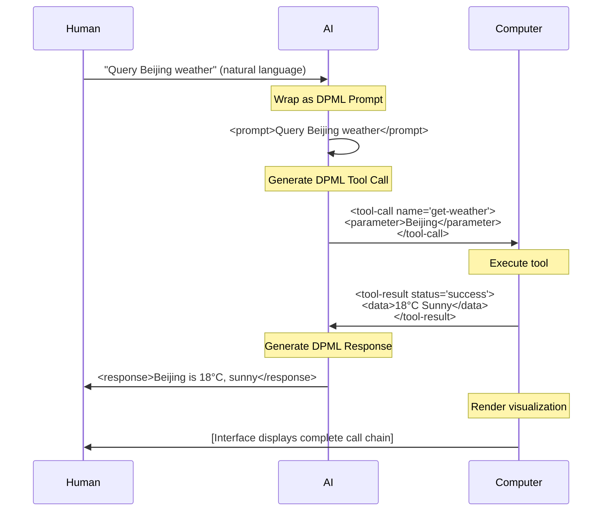

# DPML Design Whitepaper

**Status**: Draft<br>
**Version**: 1.0<br>
**Author**: Sean Jiang (Deepractice.ai)

---

## Abstract

AI systems are evolving from single-prompt interactions to multi-agent collaboration, but prompt engineering faces a critical challenge: configurations, prompts, and documentation are scattered across incompatible formats, leading to synchronization issues and unobservable system states. The root cause is that traditional approaches force the separation of information meant for three parties (humans, AI, and computers), resulting in collaboration difficulties and high maintenance costs.

This whitepaper introduces DPML (Deepractice Prompt Markup Language), based on a core insight: the three roles in modern AI systems—humans (innovative intent), AI (semantic translation), and computers (precise execution)—require different types of information, yet must share a single carrier. By proving the necessity and sufficiency of four semantic dimensions (tag/attribute/content/structure), DPML adopts an XML-like tag language to unify the driving signals for all three parties, enabling a unified infrastructure for configuration management, workflow orchestration, and end-to-end observability.

This document contains: design philosophy and theoretical derivation (Chapter 3), protocol design (Chapter 4), application scenarios (Chapter 6), implementation guidelines (Chapter 7), and ecosystem planning (Chapter 8).

---

## Table of Contents

1. [Introduction](#1-introduction)
2. [Requirements Analysis](#2-requirements-analysis)
3. [Design Philosophy](#3-design-philosophy)
4. [Technical Decisions](#4-technical-decisions)
5. [Architecture Overview](#5-architecture-overview)
6. [Application Scenarios](#6-application-scenarios)
7. [Implementation Considerations](#7-implementation-considerations)
8. [Ecosystem Planning](#8-ecosystem-planning)
9. [References](#9-references)
10. [Appendix](#10-appendix)

---

## 1. Introduction

### 1.1 Core Problem

The complexity of AI systems is growing rapidly. From single-prompt interactions to multi-agent collaboration, tool invocation, and state management, prompt engineering faces fundamental challenges of **information fragmentation** and **maintenance difficulty**:

- Prompt files span thousands of lines with configuration parameters mixed with instructions
- Collaborative editing easily introduces conflicts
- Debugging is difficult with no way to pinpoint specific issues
- Lack of modularization and reuse mechanisms

Unlike ordinary articles, prompts require **strong logic** (consistency, structure, precision). As prompts expand, maintaining this strong logic becomes extremely difficult: changing role definitions in location A while forgetting conflicting constraints in location B; tool invocation logic, exception handling, and state management intertwined in long text.

### 1.2 Problem Statement

Modern AI systems involve three core roles, each with different information needs:

| Role | What They Need | Traditional Approach | Problem |
|------|---------------|---------------------|---------|
| **Human** | Observable system state | Documentation separate from code | Cannot observe AI reasoning process, docs drift from implementation |
| **AI** | Context and constraints | Prompts separate from configuration | Lacks execution context, cannot translate accurately |
| **Computer** | Structured instructions | Config files (YAML/JSON) | AI cannot understand, humans struggle to audit |

**The fundamental problem of traditional approaches**: forcing these three types of information into incompatible formats.

**Real-world example**: A travel planning agent's configuration scattered across 3 files:

```yaml
# config.yaml
model: llm-model
temperature: 0.7
```

```markdown
# system_prompt.md
You are a professional travel planning assistant, providing accurate and reliable advice.
```

```markdown
# README.md
This agent uses a conservative strategy, temperature=0.5 (Note: This documentation is outdated)
```

When the product manager requests "make responses more creative," the engineer modifies `config.yaml` (temperature 0.7 → 0.9) but forgets to update the "provide accurate" instruction in `system_prompt.md`, while `README.md` is long outdated. Result: AI output becomes inconsistent, user complaints increase, and it takes 3 days to identify the conflict between temperature and prompt instructions.

**Core contradiction**: These are all essentially prompts (documentation for humans, instructions for AI, configuration for computers), yet they're forced into incompatible formats, leading to information desynchronization, debugging difficulties, and **lack of a unified information carrier**.

### 1.3 DPML's Core Insight

DPML is based on a fundamental understanding:

> **Modern AI systems require three types of driving signals (human-driven, AI-driven, computer-driven). This information must be unified into a single flow carrier, and the flow process must be fully observable.**

This insight comes from a deep understanding of the **core positioning** of the three parties in AI systems:

- **Human: Innovative Intent** - The only role that can actively initiate practice and generate true innovation
- **AI: Semantic Translation** - The only role that can simultaneously understand natural language and process at high speed
- **Computer: Precise Execution** - The only role that can execute instructions with ultra-high speed and absolute precision

**For detailed three-party positioning theory, see Section 3.1**.

Based on this insight, DPML needs to solve three levels of problems:

1. **Semantic Expression**: Unify the information carrier for all three parties, solving prompt inflation
2. **Structure Visualization**: Make AI systems observable and debuggable, no longer black boxes
3. **Computation Encapsulation**: Through domain abstraction, enable both humans and AI to develop applications more efficiently

**For complete design philosophy and technical derivation, see Chapter 3**.

### 1.4 Document Scope

This whitepaper covers:

- DPML's design philosophy and first principles (three-party positioning theory)
- Technical decision derivation process and trade-off analysis
- Architecture design and application scenarios
- Ecosystem planning and standardization path

This whitepaper does not include:

- Detailed syntax specifications (see [DPML Protocol Specification Current Design](../specs/当前设计/dpml-protocol-v1.zh-CN.md))
- Specific implementation guides (see DPML Implementation Guide)
- Domain-specific element definitions (see respective domain specifications)

### 1.5 Terminology

**DPML (Deepractice Prompt Markup Language)**
A three-party collaboration protocol using XML-like tag language to unify driving signals for computers, AI, and humans.

**Three-Party Positioning**
The three core roles in modern AI systems and their irreplaceable functions:

- Human: Innovative intent
- AI: Semantic translation
- Computer: Precise execution

**Driving Signal**
Structured information that guides and drives system behavior, including configuration for computers, instructions for AI, and state displays for humans.

**Semantic Dimension**
Independent semantic space for information expression. XML-like tag languages have 4 semantic dimensions (tag/attribute/content/structure), while YAML/JSON have only 2 (key/value).

**Strong Logic**
Compared to ordinary text, prompts require higher consistency, structure, and precision to ensure stable AI operation.

**DOM (Document Object Model)**
The tree-like hierarchical structure of tag languages, naturally supporting visual rendering, which is the foundation of DPML's observability.

---

## 2. Requirements Analysis

This chapter transforms the **three-party positioning theory** and **three-tier progressive requirements** from Chapter 1 into concrete, verifiable functional and non-functional requirements.

Detailed analysis of the core positioning and capabilities of the three parties can be found in Section 3.1; here we derive requirements directly.

### 2.1 Functional Requirements

Based on the three-party positioning theory, DPML's functional requirements are as follows:

#### FR1: Unified Information Carrier

**Requirement Statement**: A single document must simultaneously carry configuration for computers, instructions for AI, and visualization information for humans.

**Rationale**:

- Avoid information fragmentation (configuration, prompts, documentation separated)
- Ensure information synchronization (modify once, all three parties perceive simultaneously)
- Reduce maintenance costs (no need to jump between multiple files)

**Acceptance Criteria**:

- A single `.dpml` file contains the complete Agent/Task/Workflow definition
- After modifying the file, computer, AI, and human can all immediately perceive the change
- No additional synchronization mechanism needed

#### FR2: Separation of Concerns

**Requirement Statement**: Different types of information must be clearly separated structurally, each optimized independently.

**Rationale**:

- Configuration parameters (model, temperature) should be outside AI's natural language space
- AI prompt content should not be mixed with machine parameters
- Human visualization needs should not affect computer parsing efficiency

**Acceptance Criteria**:

- Configuration parameters in attribute space (`model="llm-model"`)
- AI instructions in content space (`<prompt>You are an assistant</prompt>`)
- Visualization structure in DOM hierarchy (nested elements)
- Three spaces do not interfere with each other

#### FR3: Full Observability

**Requirement Statement**: The flow of DPML between the three parties must be visualizable and auditable.

**Rationale**:

- Debugging requires seeing the complete call chain
- Optimization requires analyzing input/output at each step
- Auditing requires tracing the decision-making process

**Acceptance Criteria**:

- Each flow step is a DPML document (Prompt → Tool Call → Result → Response)
- Tools can automatically render DPML into visual interfaces
- Support for time-series state snapshots

#### FR4: Component Reusability

**Requirement Statement**: Support modularization and reference mechanisms to avoid redundant definitions.

**Rationale**:

- In large systems, multiple agents share the same prompt fragments
- Tool definitions should be reusable across agents
- Role definitions should be composable

**Acceptance Criteria**:

- Elements can be identified by `id`
- Future versions support `<ref id="..."/>` references
- Current design establishes syntactic foundation for references

### 2.2 Non-Functional Requirements

#### NFR1: Low Cognitive Load

**Requirement Statement**: The mental cost for AI and humans to understand DPML must be minimized.

**Rationale**:

- AI attention is a scarce resource; complex syntax consumes tokens
- Human learning curve affects adoption rate
- Cognitive load directly impacts generation and maintenance efficiency

**Quantitative Metrics**:

- AI-generated DPML format correctness > 95%
- Human reading comprehension time < 50% of equivalent YAML
- Core concepts ≤ 5

**Design Strategy**:

- Use consensus concepts (role, agent, task) rather than invented terms
- Minimize protocol-layer rules (kebab-case + 2 reserved attributes)
- Leverage AI's native understanding of tag languages

#### NFR2: Extensibility

**Requirement Statement**: The protocol must support future evolution without breaking compatibility.

**Rationale**:

- AI system requirements change rapidly
- New domains (Agent, Task, Workflow) will continuously emerge
- Tool ecosystem needs a stable foundation

**Design Strategy**:

- Protocol layer only defines meta-semantics, not specific elements
- Domain specifications evolve independently
- Reserve extension points (namespace, version control reserved)

#### NFR3: Toolchain-Friendly

**Requirement Statement**: DPML must be easy for tools to process (parse, validate, transform, visualize).

**Rationale**:

- Tool ecosystem is key to protocol success
- Lowering implementation barriers enables rapid adoption
- IDE integration and visual editors are essential

**Design Strategy**:

- Adopt tag syntax (can reuse mature XML parsers)
- Avoid custom syntax (DTD, Schema, Namespace not introduced in current design)
- DOM structure naturally supports visualization

### 2.3 Requirements Priority

| Requirement | Priority | Current Design Status |
|------------|----------|---------------------|
| FR1: Unified Information Carrier | P0 | Fully implemented |
| FR2: Separation of Concerns | P0 | Fully implemented (4 dimensions) |
| FR3: Full Observability | P1 | Protocol supports, tools pending |
| FR4: Component Reusability | P2 | `id` syntax ready, reference mechanism for future versions |
| NFR1: Low Cognitive Load | P0 | Core concepts ≤ 5 |
| NFR2: Extensibility | P1 | Protocol/domain layer separation |
| NFR3: Toolchain-Friendly | P1 | Tag syntax adopted, can reuse XML parsers |

---

**Chapter 2 Key Points**

- **Functional Requirements**: Unified information carrier, separation of concerns, full observability, component reusability
- **Non-Functional Requirements**: Low cognitive load (core concepts ≤ 5), extensibility (protocol/domain separation), toolchain-friendly
- **Design Goals**: Single document serves all three parties, lossless information flow, reduced maintenance costs

---

## 3. Design Philosophy

### 3.1 First Principles: Three-Party Positioning Theory

#### 3.1.1 The Essential Structure of Modern AI Systems

Modern AI systems are not a stage for a single role, but a **three-party collaboration** system:

| Role | Core Capability | Irreplaceable Advantage |
|------|----------------|------------------------|
| **Human** | Practice + Consciousness → Innovation | The only role that can actively initiate practice, learn from experience, and generate true innovation |
| **AI** | Pattern + Knowledge → Mapping | The only role that can **simultaneously** understand natural language (like humans) and process at high speed (like computers), best at bidirectional conversion between intent and instructions |
| **Computer** | Precision + Speed → Efficiency | The only role that can execute deterministic tasks with ultra-high speed and absolute precision |

**First Principle**:

> The information carrier must **simultaneously** serve all three parties to fully unleash the potential of modern AI systems.

Problems with traditional systems:

- **Markdown Prompts**: Only serve AI (computers cannot reliably parse)
- **JSON/YAML Configuration**: Primarily serve computers (high cognitive load for AI and humans)
- **Separated Documentation**: Information scattered across config files, prompt files, and docs, cannot synchronize

**DPML's Core Insight**:
A **unified information carrier** is needed, allowing the same document to flow losslessly between all three parties.

#### 3.1.2 The Essential Needs of the Three Parties

Deriving requirements for the information carrier from the three-party positioning:

**Human Needs**:

- Need to understand "what concept this is" (concept dimension)
- Need to see visualized hierarchical structure (structure dimension)
- Need to observe system runtime state (observability)

**AI Needs**:

- Need natural language expression space (content dimension)
- Need to understand context and hierarchical relationships (structure dimension)
- Need low cognitive load syntax (avoid complex paths)

**Computer Needs**:

- Need structured configuration parameters (configuration dimension)
- Need parseable, validatable format (formalization)
- Need mature tool ecosystem (practicality)

**Core Contradiction**:
These needs appear independent, even conflicting. The traditional solution is **separation**:

- Computer reads config files (JSON/YAML)
- AI reads prompt files (Markdown/plain text)
- Human reads documentation (Markdown/Wiki)

**DPML's Breakthrough**:
Through **semantic dimension theory**, find the minimal set that can **simultaneously** satisfy all three parties' needs.

### 3.2 Theoretical Derivation: Necessity of Four Semantic Dimensions

#### 3.2.1 Semantic Dimension Definition

**Semantic Dimension**: Independent semantic space for information expression that can be understood and used by all three parties.

Different formats have different numbers of semantic dimensions:

| Format | Dimensions | Dimension Components | Three-Party Collaboration Capability |
|--------|-----------|---------------------|-------------------------------------|
| Plain Text | 0 | (linear text) | Serves AI only |
| YAML/JSON | 2 | key + value | Primarily serves computers |
| XML | 4 | tag + attribute + content + structure | **Serves all three parties simultaneously** |

#### 3.2.2 Derivation Process: Why Four Dimensions Are Needed

**Question**: What is the minimum number of semantic dimensions needed to serve all three parties simultaneously?

**Derivation**:

**Step 1: Identify Minimal Requirements Set**

Extract **irreducible** requirements from the needs analysis in 3.1.2:

| Source | Requirement Description | Can It Share Other Dimensions |
|--------|------------------------|------------------------------|
| Human | Need to understand "what concept this is" | [Required] Must be independent (concept cannot be expressed as config value) |
| Computer | Need to parse configuration parameters | [Required] Must be independent (parameters cannot be mixed in natural language) |
| AI | Need natural language expression space | [Required] Must be independent (natural language cannot be constrained by config syntax) |
| Human | Need visualized hierarchical structure | [Required] Must be independent (hierarchy is an additional dimension) |

**Step 2: Map to Semantic Dimensions**

| Requirement | Corresponding Dimension | Necessity Proof |
|------------|------------------------|----------------|
| Understand concept | **Tag** | Required. `<agent>` vs `llm.agent` (Tag is concept, key is just path) |
| Config parameters | **Attribute** | Required. `model="llm-model"` vs separate config node (avoid nesting explosion) |
| Natural language | **Content** | Required. `<prompt>You are assistant</prompt>` vs `prompt: "You are assistant"` (former has lower AI cognitive load) |
| Hierarchical visualization | **Structure** | Required. DOM tree vs indentation (former naturally visualizes) |

**Step 2.5: Dimension Independence Validation**

Can the 4 dimensions be merged?

| Attempted Merge | Merge Example | Core Problem | Conclusion |
|----------------|---------------|--------------|-----------|
| **Tag + Attribute** | `<"agent" model="...">` | Concept and config forced into same semantic layer, breaking conceptual hierarchy; needs extra rules to distinguish "concept attributes" from "config attributes"; violates separation of concerns | Cannot merge |
| **Content + Attribute** | `<prompt content="..."/>` | Long text in attributes causes format chaos; natural language treated as "config value", requires quote escaping; multi-paragraph prompts completely unreadable | Cannot merge |
| **Structure via indentation** | YAML's indentation syntax | Requires "mental calculation" of hierarchy, cannot directly render DOM tree; needs extra parsing of indentation semantics; AI must count spaces to determine levels | Must be independent |

**Conclusion**: The 4 dimensions are mutually independent; any merge violates at least one party's core requirements or increases cognitive load.

**Step 3: Necessity Proof**

What happens with fewer than 4 dimensions?

| Missing Dimension | Consequence |
|------------------|------------|
| No Tag | Humans cannot understand concepts, computers cannot identify node types, AI lacks context |
| No Attribute | Config parameters mixed into Content, AI struggles to understand, computers cannot parse structurally |
| No Content | AI has no natural language space, loses flexibility, humans cannot express naturally |
| No Structure | Humans cannot visualize, computers struggle to traverse, AI has difficulty understanding contextual hierarchy |

Conclusion: All 4 dimensions are necessary, none can be removed.

**Step 3.5: Sufficiency Proof (Reductio ad Absurdum for 5th Dimension)**

**Hypothesis**: There exists a 5th independent dimension X

**Derivation**: X must simultaneously satisfy:
1. **Independence**: Cannot be expressed by Tag/Attribute/Content/Structure
2. **Necessity**: At least one party (human/AI/computer) has an irreducible need

**Exhaustive Analysis of Candidate Dimensions**:

| Candidate Dimension | Independence Test | Conclusion |
|-------------------|------------------|-----------|
| **Namespace** | Can be expressed via Attribute: `namespace="mcp"` | Not independent |
| **Comments/Docs** | Can be expressed via special Tag: `<metadata>`, `<doc>` | Not independent |
| **Styling/Display** | Can be expressed via Attribute: `class="highlight"` | Not independent |
| **Version/State** | Can be expressed via Attribute: `version="1.0"` | Not independent |
| **Reference/Link** | Can be expressed via Attribute: `ref="agent-id"` | Not independent |
| **Permissions/Security** | Can be expressed via Attribute: `access="private"` | Not independent |
| **Events/Hooks** | Can be expressed via special Tag+Content: `<on-error>...</>` | Not independent |
| **Variables/Templates** | Can be expressed via Content interpolation or special Tag | Not independent |

**Key Insight**:
- All possible extension needs can be expressed by the existing 4 dimensions
- Tag's conceptualization + Attribute's configuration + Content's semantics + Structure's hierarchy already cover all orthogonal dimensions of information expression
- Any new dimension is essentially a combination or specialization of these 4

**Reductio Conclusion**: Cannot find a 5th independent and necessary dimension. 4 dimensions are sufficient.

**Final Conclusion**: **Four dimensions are the necessary and sufficient minimal set**.

#### 3.2.3 Instance Verification: Format Evolution

**Plain Text (0 structured dimensions)**:

```
This is a travel planning assistant using a large model with temperature 0.7
```

- [Supports] AI understands natural language
- [Not Supported] Computer cannot reliably parse parameters
- [Not Supported] Human sees linear text, no hierarchy
- **Conclusion**: Serves AI only

**YAML (2 dimensions: key + value)**:

```yaml
agent:
  llm:
    model: llm-model
    temperature: 0.7
  prompt: "You are a travel planning assistant"
```

- [Supports] Computer parses key-value pairs
- [Partial] AI needs to understand path syntax (`agent.llm.model`)
- [Partial] Human sees indentation, requires mental calculation of hierarchy
- [Partial] Config and content mixed in values (insufficient type dimension)
- **Conclusion**: Primarily serves computers, cognitive load for AI/humans

**XML (4 dimensions: tag + attribute + content + structure)**:

```xml
<agent>
  <llm model="llm-model" temperature="0.7"/>
  <prompt>You are a travel planning assistant</prompt>
</agent>
```

- [Supports] Tag: All three parties understand concepts (`<agent>` = agent)
- [Supports] Attribute: All three parties can read config (`model="llm-model"`)
- [Supports] Content: All three parties can access content (independent natural language space)
- [Supports] Structure: All three parties can utilize hierarchy (DOM tree naturally visualizes)
- **Conclusion**: **Each dimension is a shared semantic space for all three parties**

**Natural Advantages of Four Semantic Dimensions**:

- No compilation needed (already in final form, vs custom DSL)
- AI native understanding (LLMs have strong comprehension and generation capabilities for tag languages)
- Human native understanding (DOM structure aligns with human cognition)

#### 3.2.4 Dimension Separation of Concerns and Information Sharing

Key design principle: **Separation of Concerns + Information Sharing**

| Dimension | Primary Service | Secondary Service | Responsibility | Example |
|-----------|----------------|------------------|----------------|---------|
| Tag | Human (understand concept) | Computer (node type), AI (context) | Concept definition | `<prompt>`, `<tool>` |
| Attribute | Computer (parse config) | AI (understand params), Human (view values) | Config parameters | `model="llm-model"` |
| Content | AI (natural language) | Human (reading), Computer (extraction) | Semantic content | `You are an assistant` |
| Structure | Human (visualization) | Computer (traversal), AI (hierarchical relations) | Hierarchical organization | DOM tree |

**This is not information isolation, but responsibility optimization**:

- Each dimension optimized for a specific role (primary responsibility)
- But all roles can access all dimensions (information sharing)
- Ensures both professional division of labor and collaborative foundation

### 3.3 Value Progression: From Theory to Application

Based on the three-party positioning theory and four semantic dimensions, DPML produces **three tiers of progressive value**:

```
Tier 1: Semantic Expression Layer
    ↓ (foundational capability)
Tier 2: Structure Visualization Layer
    ↓ (structural advantage)
Tier 3: Computation Encapsulation Layer
```

#### 3.3.1 Tier 1: Semantic Expression Layer

**Value**: Highly expressive information exchange format

**Source**: Directly from the four semantic dimensions theory

**Capabilities**:

- **Three-party comprehensible**: Same document, human/AI/computer all understand
- **Separation of concerns**: Config (Attribute), content (Content), concept (Tag), structure (Structure) each serve their purpose
- **Lossless transmission**: Information flows between three parties without format conversion

**Key**: Each party takes what they need, no coordination required, information fully shared.

**Detailed examples in Chapter 6 Application Scenarios**.

#### 3.3.2 Tier 2: Structure Visualization Layer

**Value**: Natural structure visualization language

**Source**: Structural advantages from the Structure dimension (DOM tree)

**Capabilities**:

- **Automatic mapping**: Element → UI component, Attribute → config item, Structure → layout hierarchy
- **State injection**: Runtime state can be directly injected into static structure (`status="running" tokens-used="1520"`)
- **Full observability**: Each flow step is DPML, computer can render visual interfaces in real-time

**Comparison with traditional systems**:

- **Traditional**: Human → [Black Box] → AI → [Black Box] → Computer → [Black Box] → Result
- **DPML**: Human → DPML Prompt → AI → DPML Tool Call → Computer → DPML Result → AI → DPML Response → Human

**Value**: See complete call chain when debugging, analyze input/output at each step when optimizing, trace decision process when auditing.

**Detailed case study in Section 6.3 Observability Platform**.

#### 3.3.3 Tier 3: Computation Encapsulation Layer

**Value**: Domain abstraction capability encapsulation language

**Source**: Semantic expression + Structure visualization → Support higher-level abstraction

**Core Insight**:
DPML is not just a configuration format, but a **domain abstraction layer**. By defining domain tags, it can:

- Encapsulate complex underlying implementations into simple semantic tags
- Tag structure is extremely AI-friendly, with much higher success rates for understanding and generation than code
- Declarative semantics are more intuitive for humans, reducing cognitive load
- Shield underlying details, forming a development framework

**Why Four Semantic Dimensions Support Domain Encapsulation**:

- **Tag conceptualization** → Can define domain tags (`<mcp-server>`, `<rag-pipeline>`, `<workflow>`)
- **Attribute configuration** → Supports declarative parameter configuration, no need to write initialization code
- **Content semantics** → Maintains expressive flexibility, can embed natural language or code snippets
- **Structure hierarchy** → Supports complex composition and nesting, building complete domain models

**Value Chain**:

```
Domain experts define tags
    ↓
Framework implements underlying details
    ↓
Human/AI use tags to declare intent
    ↓
Framework generates implementation and executes
```

**Essence**: DPML becomes the "compilation target for natural language", just like SASS/LESS are abstraction layers for CSS.

**Detailed case study in Section 6.4 Domain Framework Encapsulation**.

#### 3.3.4 Unity of Three-Tier Value

The three tiers of value are not independent, but **progressively unified**:

| Tier | Foundation | Value | Beneficiaries |
|------|-----------|-------|--------------|
| **Semantic Expression Layer** | Four dimensions | Information exchange foundation | All three parties benefit |
| **Structure Visualization Layer** | DOM structure | Observability guarantee | Humans primarily, collaborative benefits for all |
| **Computation Encapsulation Layer** | Semantics + Structure | Domain abstraction capability, AI-friendly development paradigm | Human/AI developers benefit, ecosystem as a whole benefits |

**Unified Theoretical Foundation**: Three-party positioning theory

- Tier 1: Directly achieves three-party comprehensibility
- Tier 2: Strengthens human observability needs
- Tier 3: Through tag encapsulation, enables both humans and AI to express intent and generate implementations more efficiently

### 3.4 Driving Mechanism: How DPML Works

#### 3.4.1 Driving Definition

DPML is not a static document, but **dynamically flowing driving signals**.

**Driving**: Structured information that guides and drives system behavior.

| Driven Party | How DPML Drives | Driving Result |
|-------------|-----------------|---------------|
| **Computer** | attribute config, element instructions | Execute operations, return results, render interfaces |
| **AI** | content prompts, structure context | Understand intent, generate responses, call tools |
| **Human** | structure visualization, metadata explanation | Observe processes, audit system, adjust intent |

#### 3.4.2 Complete Driving Loop

Using weather query as an example:



**Core Characteristic**: Each step is a DPML document, information flows losslessly, fully observable.

#### 3.4.3 AI as the Key Mediator

AI plays the role of bidirectional translation in three-party collaboration:

| Direction | Translation Process | Core Value |
|-----------|-------------------|-----------|
| Human→AI→Computer | Natural language intent → DPML structured expression → Machine-executable instructions | Lowers technical barriers, users don't need to learn DPML syntax |
| Computer→AI→Human | Structured data → Natural language explanation → Human-comprehensible response | Improves experience, AI provides intelligent interpretation rather than raw data |

**DPML's Unique Value**: Traditional Markdown prompts lack structure (cannot drive computers), traditional JSON configs lack semantic space (AI struggles to understand), DPML unifies both, enabling lossless information flow between all three parties.

---

**Chapter 3 Key Points**

- **Three-Party Positioning Theory**: Human (innovative intent), AI (semantic translation), Computer (precise execution) are first principles
- **Four Semantic Dimensions Theory**: tag/attribute/content/structure are the necessary and sufficient minimal set
- **Necessity**: 4 dimensions are mutually independent, any merge violates at least one party's core requirements
- **Sufficiency**: All possible extension needs can be expressed by these 4 dimensions
- **Three-Tier Value**: Semantic expression → Structure visualization → Computation encapsulation, progressively building
- **Driving Mechanism**: Each step is a DPML document, lossless information flow, fully observable

---

## 4. Technical Decisions

### 4.1 Format Selection

#### 4.1.1 Candidate Solutions

Based on requirements derived from the three-party positioning theory, the following candidate solutions were evaluated:

| Solution | Description | Advantages | Disadvantages |
|----------|------------|-----------|--------------|
| **Custom DSL** | Domain-specific language for natural language | High expressiveness, customizable | High barrier, needs compilation, few tools |
| **YAML** | Data serialization format | Human-readable, concise | 2D semantics, indentation semantics, AI cognitive load |
| **JSON** | Data exchange format | Machine-friendly, universal | 2D semantics, bracket noise, no content space |
| **XML-like Tag Language** | Markup language | 4D semantics, mature ecosystem | Verbose (relative to JSON) |

#### 4.1.2 Evaluation Criteria

Based on requirements analysis (Chapter 2) and three-party positioning theory, establish evaluation matrix:

**Weight Rationale**:

- **Semantic Dimensions (40%)**: Directly determines whether three parties' differentiated needs can be met (see 3.2.2 four-dimension derivation)
- **AI Cognitive Load (25%)**: AI is the key mediator (see 3.4.3), its efficiency affects overall experience
- **Tool Ecosystem (20%)**: Affects implementation cost and community adoption
- **Visualization Capability (10%)**: Corresponds to human observability needs (see 2.2 NFR2)
- **Extensibility (5%)**: Reserve space for future evolution

**Correspondence between Weights and Three-Party Positioning**:

| Evaluation Criteria | Weight | Corresponding Three-Party Needs |
|--------------------|--------|--------------------------------|
| Semantic Dimensions | 40% | Directly determines possibility of three-party collaboration (see 3.2: four dimensions are necessary and sufficient) |
| AI Cognitive Load | 25% | AI is key mediator, efficiency affects overall (see 3.4.3: bidirectional translation) |
| Tool Ecosystem | 20% | Affects computer-side implementation cost and parsing efficiency |
| Visualization Capability | 10% | Corresponds to human observability needs (NFR2) |
| Extensibility | 5% | Future needs, currently secondary |

**Key Insight**: Weight distribution directly reflects three-party positioning theory—prioritize enabling three-party collaboration (semantic dimensions 40%), then optimize AI mediator efficiency (cognitive load 25%), finally consider implementation convenience (ecosystem 20% + visualization 10%).

**Evaluation Matrix**:

| Criterion | Weight | Custom DSL | YAML | JSON | Tag Language |
|-----------|--------|-----------|------|------|-------------|
| **Semantic Dimensions** | 40% | 4+ | 2 | 2 | 4 |
| **AI Cognitive Load** | 25% | High (learning) | High (indentation) | Medium (brackets) | Low (native) |
| **Tool Ecosystem** | 20% | None | Mature | Mature | Mature |
| **Visualization Capability** | 10% | Depends on implementation | Weak | Weak | Strong (DOM) |
| **Extensibility** | 5% | High | Medium | Medium | High |
| **Total Score** | - | 65 | 50 | 55 | **95** |

#### 4.1.3 Decision Process

**Phase 1: Attempt Custom DSL**

Design idea: Like SASS/LESS to CSS, provide structural and logical capabilities for natural language.

**Failure Reasons**:

- High barrier: Both users and AI need to learn new syntax
- Tool dependency: Needs "compilation" into final prompt
- Lacks visualization: Humans struggle to understand directly

**Key Lesson**: Don't reinvent the wheel, leverage existing mature formats.

**Phase 2: Evaluate YAML/JSON**

**YAML Problems**:

```yaml
agent:
  llm:
    model: llm-model     # AI needs to understand agent.llm.model path
    temperature: 0.7
  prompt: |          # Indentation carries semantics, AI cognitive load
    You are an assistant
```

- Indentation carries semantics (AI must count spaces)
- All information on same plane (config + instructions mixed)
- No independent "content space" (prompt is just another key-value pair)

**JSON Problems**:

```json
{
  "agent": {
    "llm": {"model": "llm-model"},  // Bracket noise
    "prompt": "You are an assistant"  // No content space, just string value
  }
}
```

- Similar 2D problems as YAML
- Brackets and quotes increase AI cognitive load
- Flat hierarchy, difficult to visualize

**Core Discovery**: 2D semantics (key-value pairs) cannot satisfy three parties' differentiated needs.

**Phase 3: Adopt XML-like Tag Language**

**Four-Dimensional Semantic Tag Language**:

```xml
<agent>
  <!-- Tag: Concept definition -->
  <llm model="llm-model" temperature="0.7"/>  <!-- Attribute: Config -->
  <prompt>You are an assistant</prompt>       <!-- Content: Content -->
</agent>                                      <!-- Structure: Hierarchy -->
```

**Key Advantages**:

1. **4 independent semantic dimensions**: Perfect mapping to three-party needs
2. **AI native understanding**: LLMs have strong comprehension and generation capabilities for tag languages
3. **Reusable mature ecosystem**: Can leverage XML parsers and toolchains
4. **DOM visualization**: Tree structure naturally visualizes
5. **No compilation needed**: Already in final form
6. **Independent evolution**: Not constrained by XML specifications, can optimize for AI scenarios

#### 4.1.4 Theoretical Validation of Format Selection

**Conclusion**: Based on 3.2.2's four-dimension derivation, only tag languages with four semantic dimensions can simultaneously satisfy three-party needs.

**Validation**: Each format's support for four semantic dimensions directly determines its applicability (see "Semantic Dimensions" column in table above).

### 4.2 Trade-off Analysis

#### 4.2.1 Verbosity vs Expressiveness

**Criticism**: Tag language is more verbose than JSON.

**Response**: Verbosity is for semantic clarity.

**Comparison**:

```json
// JSON: Concise but semantically ambiguous
{"agent": {"llm": {"model": "llm-model"}, "prompt": "You are assistant"}}
```

```xml
<!-- Tag language: Verbose but semantically clear -->
<agent>
  <llm model="llm-model"/>
  <prompt>You are assistant</prompt>
</agent>
```

**Analysis**:

- JSON saves 10 characters
- But loses:
  - Visual boundaries of concepts (`<prompt>` vs `"prompt":`)
  - Clear expression of hierarchy (closing tags vs brackets)
  - AI comprehension efficiency (tag is more semantic than key)

**Trade-off Result**: Accept moderate verbosity for three-party collaboration.

#### 4.2.2 Learning Curve vs Long-term Benefits

**Criticism**: Tag language has a steep learning curve.

**Response**: AI as mediator lowers the learning barrier.

**Traditional Scenario** (humans write tag language directly):

- Need to learn tag, attribute, entity, namespace...
- High learning cost [Not Supported]

**DPML Scenario** (AI generates tag language):

- Human: Express intent in natural language
- AI: Automatically generate correctly formatted DPML
- Human: Understand and modify through visual interface
- Low learning cost [Supported]

**Trade-off Result**: Through AI mediator, transfer learning burden to AI.

#### 4.2.3 Current Needs vs Future Extension

**Design Philosophy**: Design for the present, reserve for the future.

**Current Design Strategy**:

- Implement core 4D semantics
- Define reserved attributes (`type`, `id`)
- Establish protocol/domain layer separation
- [Partially Implemented] `id` syntax ready, but reference mechanism reserved for future versions
- Advanced features like namespace and version control reserved

**Trade-off Result**: Current design keeps it simple (core concepts ≤ 5), leaves space for future expansion.

**Section Summary**:

Through three dimensions of trade-off analysis, DPML's technical choices follow consistent principles:

- **Prioritize three-party collaboration** (accept verbosity for semantic clarity)
- **Leverage AI capabilities** (lower learning barrier, transfer cognitive load)
- **Simple but extensible** (current design has complete core functionality, reserves space for future)

These trade-off decisions directly reflect the guiding role of three-party positioning theory.

### 4.3 Design Principles

#### 4.3.1 Constrain Without Binding

**Definition**: Provide structure and conventions (constrain), but don't limit AI's logical flexibility (without binding).

**What We Constrain**:

- Syntax: kebab-case naming, basic tag language specifications
- Structure: Reserved attributes (`type`, `id`)
- Concepts: Use consensus terms (role, agent, task)

**What We Don't Bind**:

- Logic: Don't define if-else control flow in content
- Expression: Natural language in content is completely free
- Behavior: Principles over rules, intent over process

**Example**:

```xml
<!-- [INVALID] Wrong: Binding logic -->
<rules>
  <if condition="user_angry">
    <response>Apologize</response>
  </if>
  <if condition="user_confused">
    <response>Explain</response>
  </if>
</rules>

<!-- [VALID] Correct: Constrain structure, don't bind logic -->
<personality>
I am an empathetic assistant. When users are upset, I first attend to their emotions.
When users are confused, I patiently explain. I always remain professional and friendly.
</personality>
```

**Core Insight**: Structuring (XML) doesn't mean must structure logic. DPML provides structural carrier but allows AI to express freely in content.

#### 4.3.2 Consensus Concepts First

**Definition**: Use widely agreed-upon terms rather than invented concepts.

**Information Theory Foundation**:

Consensus concepts are **compressed knowledge**:

```
Information in concept "role"
├─ Explicit: 4 letters "r-o-l-e"
└─ Implicit (free):
   ├─ Responsibility framework
   ├─ Capability boundaries
   ├─ Behavior patterns
   └─ Social relationships
Total information entropy: Very low (concept is definition)
```

Invented words are **high entropy**:

```
Information in concept "lero"
├─ Explicit: 4 letters "l-e-r-o"
└─ Implicit: None
└─ Needs extra explanation: 50-100 words
Total information entropy: Very high
```

**Token Economics**:

| Solution | Token Cost | AI Understanding |
|----------|-----------|-----------------|
| Consensus concept (`role`) | ~10 tokens | Immediate, accurate |
| Invented word (`lero`) | ~100+ tokens | Needs reasoning |

**Selection Criteria**:

1. **Synchronicity**: Widely used in current era
2. **Precision**: Clear conceptual boundaries
3. **Semanticity**: Self-contained rich meaning
4. **Connotation**: Carries theoretical foundation

**Examples**:

- Good: role, agent, personality, task, principle
- [Not Supported] Bad: lero, xuanwu (culture-specific), thing (too generic)

#### 4.3.3 Dual Semantics

**Definition**: Each syntactic element serves both machine semantics and AI semantics simultaneously.

**Semantic Balance Across Four Dimensions**:

| Dimension | Machine Semantics | AI Semantics |
|-----------|------------------|--------------|
| Tag | Node type, traversal starting point | Concept definition, context |
| Attribute | Key-value pair data | Comprehensible configuration |
| Content | Text data | Natural language, home field |
| Structure | DOM tree paths | Contextual hierarchical relationships |

**Theoretical Connection**: This is the concrete manifestation of 3.2.4 "Separation of Concerns and Information Sharing"—each dimension optimized for a specific role (primary responsibility), but all roles can access all dimensions (information sharing).

**Core Insight**: Not "machine OR AI", but "machine AND AI"—each element is understood by both, but with different emphases.

---

## 5. Architecture Overview

### 5.1 Layered Architecture

DPML adopts a **protocol layer/domain layer** separation architecture:

```
┌─────────────────────────────────────────────┐
│        DPML Protocol Layer (this whitepaper) │
│  • Meta-semantics: tag/attribute/content/structure │
│  • Reserved attributes: type, id             │
│  • Naming convention: kebab-case             │
│  • Validation rules: tag language format correctness │
└─────────────────────────────────────────────┘
                    ▼
┌─────────────────────────────────────────────┐
│        Domain Specifications (separate docs)  │
│  • Agent Domain: Conversational AI config    │
│  • Task Domain: State machine task orchestration │
│  • Role Domain: AI personality definition     │
│  • Workflow Domain: Workflow orchestration    │
└─────────────────────────────────────────────┘
                    ▼
┌─────────────────────────────────────────────┐
│        Tool Layer (community implementation)  │
│  • Parsers/Generators                        │
│  • IDE Integration (VSCode/Cursor)           │
│  • Visual Editors                            │
│  • Validators/Linters                        │
└─────────────────────────────────────────────┘
```

### 5.2 Protocol Layer Responsibilities

**Design Philosophy**: The protocol layer follows the "Constrain Without Binding" principle (see 4.3.1), only defining general rules without limiting domain innovation.

**Protocol Layer Defines**:

- How to define concepts (syntax, structure)
- Meta-semantics (general meanings of tag/attribute/content)
- Reserved attributes (`type`, `id`)
- Validation rules (tag language format correctness)

**Protocol Layer Does Not Define**:

- What concepts exist (e.g., specific meaning of `<agent>`)
- Domain-specific elements and attributes
- Business logic and runtime behavior

**Theoretical Foundation**: This layering corresponds to different tiers in 3.3 "Value Progression"—the protocol layer ensures foundational capability of the semantic expression layer, while the domain layer implements higher-level abstraction of the computation encapsulation layer.

**How It Serves Three-Party Positioning**:

The protocol layer serves all three parties through the "Constrain Without Binding" principle (see 4.3.1):

| Role | How Protocol Layer Serves | Core Value |
|------|--------------------------|-----------|
| Human | Defines unified concept expression (tag, attribute), reduces learning cost | Understand concept boundaries, visualize system structure |
| AI | Specifies simple consistent syntax rules (kebab-case), reduces comprehension burden | Rapid understanding and generation, minimized cognitive load |
| Computer | Only validates format, doesn't constrain business logic, maintains flexibility | Efficient parsing, reuse mature toolchains |

**Design Trade-off**: Concrete manifestation of "Constrain Without Binding" principle—constrain format to ensure three-party comprehension (protocol layer), don't bind semantics to enable domain innovation (domain layer).

### 5.3 Domain Layer Responsibilities

**Domain Layer Defines**:

- Specific element names (e.g., `<agent>`, `<task>`)
- Element semantics and requirements
- Allowed attributes and child elements
- Domain-specific validation rules

**Example: Agent Domain**

```xml
<!-- Agent domain defines these elements -->
<agent>
  <llm model="..." api-key="..."/>  <!-- llm element -->
  <prompt>...</prompt>               <!-- prompt element -->
  <tools>...</tools>                 <!-- tools element -->
</agent>
```

**Example: Task Domain**

```xml
<!-- Task domain defines these elements -->
<task id="...">
  <state>...</state>    <!-- state element -->
  <action>...</action>  <!-- action element -->
  <next>...</next>      <!-- next element -->
</task>
```

**Domain Layer Design Principles**:

Domain layer builds higher-level abstractions on the protocol layer foundation, following these principles:

1. **Semantic Clarity**
   - Element names must be self-explanatory (e.g., `<prompt>` not `<p>`)
   - Use domain consensus terms (see 4.3.2 "Consensus Concepts First")
   - Avoid invented words, reduce cognitive load

2. **Single Responsibility**
   - Each element responsible for only one clear concept
   - Complex functionality through composition, not single elements
   - Example: `<agent>` composes `<llm>` + `<prompt>` + `<tools>`, rather than cramming everything into one element

3. **Extension-Friendly**
   - New elements don't break semantics of existing elements
   - Extend functionality through child elements, not modifying existing elements
   - Maintain backward compatibility (old documents can still be parsed in new versions)

4. **Three-Party Collaboration Optimization**
   - Element design must consider human readability, AI comprehensibility, and computer parseability simultaneously
   - Avoid designs that only optimize for one party (e.g., only optimizing for computers at the expense of readability)
   - Example: `<llm model="..." />` attribute design satisfies all three parties' needs simultaneously

### 5.4 Extension Mechanism

**Current Extension Strategy**:

- Domains can define custom elements and attributes (following kebab-case)
- Protocol layer only validates format correctness
- Domain layer responsible for semantic validation

**Extension Reserves**:

- Namespace (avoid element name conflicts)
- Version control (`dpml-version` attribute)
- Plugin system (custom validators)

**Theoretical Foundation of Extension Mechanism**:

DPML's extension capability stems from the protocol layer/domain layer separation architecture, this separation embodies the separation of concerns principle:

| Layer | Concern | Stability | Extension Method |
|-------|---------|----------|-----------------|
| Protocol layer | How to express | Highly stable | Rarely changes, only adds, never modifies |
| Domain layer | What to express | Evolvable | Add new domains, independent versioning |
| Tool layer | How to process | Active | Community contributions, rapid iteration |

**Why This Layering Supports Long-term Evolution**:

1. **Protocol Layer Stability Guarantee**
   - Four semantic dimensions proven to be necessary and sufficient (see 3.2.2), no modification needed
   - Reserved attributes (`type`, `id`) provide interfaces for future features
   - Naming convention (kebab-case) simple and clear, unambiguous

2. **Domain Layer Innovation Space**
   - Any domain can define new elements based on four semantic dimensions
   - Domains are independent of each other, no conflicts
   - Community can contribute domain specifications without modifying protocol layer

3. **Tool Layer Implementation Flexibility**
   - Tools only need to implement protocol layer parsing (reuse XML parsers)
   - Domain validation can be selectively implemented
   - Tools like visualization and IDE integration evolve independently

**Practical Strategy**: Current design keeps it simple (core concepts ≤ 5, see 4.2.3), reserves space for future expansion, avoids over-design.

---

## 6. Application Scenarios

### 6.1 Scenario 1: Agent Configuration Management

#### Problem Description

A team maintains 10+ AI agents, each agent's configuration scattered across multiple files:

```
agent-travel/
├── config.yaml          # model, temperature
├── system_prompt.md     # AI role definition
├── tools.json           # Tool list
└── README.md           # Documentation
```

**Pain Points**:

- Modifying one agent requires editing 4 files
- Prompts and configs easily fall out of sync
- Conflicts frequent during team collaboration
- Cannot observe agent runtime state

#### DPML Solution

**Unified Configuration File**: `agent-travel.dpml`

```xml
<agent id="travel-planner">
  <metadata purpose="Travel planning assistant" version="2.1.0"/>

  <llm model="llm-model" temperature="0.7"/>

  <prompt type="markdown">
You are a professional travel planning expert, providing attraction recommendations, itinerary planning, accommodation suggestions, and budget estimates.
Prioritize tourist budget and time, recommend local specialties, avoid tourist traps.
  </prompt>

  <tools>
    <tool name="search-attractions" endpoint="/api/attractions"/>
    <tool name="get-weather" endpoint="/api/weather"/>
    <tool name="calculate-cost" endpoint="/api/cost"/>
  </tools>
</agent>
```

#### Effect Comparison

| Dimension | Traditional Approach | DPML Approach |
|-----------|---------------------|---------------|
| **File Count** | 4 files | 1 file |
| **Modification Efficiency** | Edit multiple files | Modify single source |
| **Sync Issues** | Easily inconsistent | Automatic synchronization |
| **Visualization** | Manual organization needed | Auto-render UI |
| **Version Control** | Frequent Git conflicts | Single file, fewer conflicts |
| **Observability** | None | Supports runtime state injection |

### 6.2 Scenario 2: Workflow Orchestration

#### Problem Description

Need to build a customer service workflow:

1. User asks question
2. Intent recognition (classification agent)
3. Route to specialized agent (technical support/billing inquiry/complaint handling)
4. Return result

**Traditional Approach Problems**:

- Workflow definition in code (not visible)
- Agent configurations scattered
- Difficult to debug (cannot see flow process)

#### DPML Solution

```xml
<workflow id="customer-service">
  <metadata purpose="Customer service workflow"/>

  <step id="intent-recognition">
    <agent>
      <llm model="llm-model"/>
      <prompt>Identify user question type: technical support/billing/complaint</prompt>
    </agent>
    <output>intent</output>
  </step>

  <router input="intent">
    <route condition="technical" next="technical-support"/>
    <route condition="billing" next="billing-agent"/>
    <route condition="complaint" next="complaint-handler"/>
  </router>

  <step id="technical-support">
    <agent>
      <prompt>Technical support expert</prompt>
      <tools>
        <tool name="search-kb"/>
        <tool name="create-ticket"/>
      </tools>
    </agent>
  </step>

  <step id="billing-agent">
    <agent>
      <prompt>Billing expert</prompt>
      <tools><tool name="query-billing"/></tools>
    </agent>
  </step>

  <step id="complaint-handler">
    <agent>
      <prompt>Complaint handling expert</prompt>
      <tools><tool name="escalate"/></tools>
    </agent>
  </step>
</workflow>
```

#### Value

1. **Visualization**: Workflow structure at a glance
2. **Unified Configuration**: All agents in one file
3. **Observability**: Can see each step's state at runtime
4. **Easy Modification**: Adjust routing logic without changing code

### 6.3 Scenario 3: Observability Platform Integration

#### Problem Description

Need to build an observability platform for AI systems:

- Real-time monitoring of agent state
- Track complete call chain for each conversation
- Analyze performance bottlenecks

**Traditional Approach Problems**:

- Inconsistent log formats (JSON, plain text mixed)
- Cannot reconstruct complete context
- Visualization requires custom parsing

#### DPML Solution

**Runtime DPML Logs**:

```xml
<conversation id="conv-12345">
  <user-message>Help me query Beijing weather</user-message>

  <agent-processing agent-id="weather-assistant" duration="120ms">
    <llm-call tokens-in="15" tokens-out="45" latency="100ms"/>

    <tool-call name="get-weather">
      <parameter name="city">Beijing</parameter>
    </tool-call>

    <tool-result name="get-weather" status="success">
      <data>{"city": "Beijing", "temp": 18, "condition": "Sunny"}</data>
    </tool-result>

    <llm-call tokens-in="60" tokens-out="25" latency="80ms"/>
  </agent-processing>

  <assistant-message>Beijing is sunny today, temperature 18°C.</assistant-message>
</conversation>
```

**Visualization Effect**:

```
Timeline View:
━━━━━━━━━━━━━━━━━━━━━━━━━━━━━━━━━━━━━
14:30:00.000  User: Help me query Beijing weather
14:30:00.100  ├─ LLM Call (100ms, 15→45 tokens)
14:30:00.100  ├─ Tool: get-weather(Beijing)
14:30:00.180  │  └─ Result: 18°C Sunny (80ms)
14:30:00.180  ├─ LLM Call (80ms, 60→25 tokens)
14:30:00.300  └─ Response: Beijing is 18°C today...

Total: 300ms | Tokens: 75 in, 70 out
```

**Core Value**:

- Unified log format (all DPML)
- Automatic visualization (DOM tree auto-renders)
- Complete context (all information in one document)
- Easy analysis (standard XML tools can process)

### 6.4 Scenario 4: Domain Framework Encapsulation

**Core Value**: DPML's computation encapsulation capability (see 3.3.3) supports building domain development frameworks, encapsulating underlying complexity into declarative configuration.

#### Typical Applications

**Agent Development Framework**: Declare agent configuration through DPML, framework automatically generates MCP service code, handles message loops, registers tools—developers don't need to understand underlying protocol details.

**Tool Development Framework**: Define tool parameters and implementation logic, framework automatically handles validation, error handling, documentation generation.

**RAG System Framework**: Declaratively configure document indexing, retrieval strategies, generation parameters, framework orchestrates the complete RAG pipeline.

#### Key Advantages

| Dimension | Traditional Development | DPML Framework |
|-----------|------------------------|----------------|
| **Learning Curve** | Need to understand underlying protocols | Only need to understand domain concepts |
| **Development Efficiency** | Write complete code | Declarative configuration |
| **AI Collaboration** | AI struggles to generate low-level code | AI excels at generating tag language |
| **Maintainability** | Modify code and redeploy | Modify configuration directly |

**For detailed design principles**: See Section 3.3.3 "Computation Encapsulation Layer" for complete theoretical justification and design principles.

---

## 7. Implementation Considerations

### 7.1 Parsing and Validation

**Parsing Strategy**: DPML uses XML-like tag syntax and can reuse the mature XML parser ecosystem. When implementing:

- Disable DTD and external entities (security considerations)
- Limit document size (prevent abuse)
- Support incremental parsing (performance optimization)

**Validation Hierarchy**: Adopt a two-tier protocol layer/domain layer validation architecture:

1. **Protocol Layer Validation**: Format correctness, naming conventions, reserved attributes
2. **Domain Layer Validation**: Domain-specific elements, attributes, and business rules

**Design Consideration**: Validation should provide clear error messages, pointing to specific locations and problem causes, reducing debugging difficulty.

### 7.2 Performance Principles

**General Performance**: For typical application scenarios, DPML document parsing and validation performance overhead is negligible.

**Optimization Directions**:
- Caching mechanisms (parsing results, validation results)
- Streaming processing (large document scenarios)
- Index support (accelerate element lookup)

### 7.3 Security Principles

**Code Injection Protection**: For elements containing executable content (such as scripts), should:
- Use sandbox isolation for execution environment
- Perform static analysis before execution
- Require explicit user authorization

**Sensitive Information Protection**:
- Prohibit hardcoding keys and other sensitive information
- Support environment variable references
- Support key management service integration

**Format Security**: Disable DTD, external entities, and other features that may cause security issues.

---

## 8. Ecosystem Planning

### 8.1 Toolchain Planning

#### 8.1.1 Core Tools

**DPML Parser**

- Multi-language support: JavaScript, Python, Java
- Features: Parsing, validation, serialization
- Goal: Provide official reference implementation

**IDE Integration**

- Syntax highlighting
- Intelligent completion (elements, attributes)
- Real-time validation
- Goal: VSCode, JetBrains, and other mainstream IDEs

**Visual Editor**

- Graphical configuration interface
- Real-time preview
- Bidirectional editing (graphical ↔ text)

#### 8.1.2 Community Tools

**CLI Tools**

- Validate DPML files
- Formatting
- Format conversion (YAML/JSON → DPML)

**Browser Plugin**

- Render `.dpml` files
- Similar to JSON Viewer experience

**Linter**

- Best practice checks
- Security scanning
- Performance recommendations

### 8.2 Domain Specification System

#### 8.2.1 Core Domains

| Domain | Purpose | Core Element Examples |
|--------|---------|----------------------|
| **Agent** | Conversational AI configuration | `<agent>`, `<llm>`, `<prompt>`, `<tools>` |
| **Task** | State machine task orchestration | `<task>`, `<state>`, `<action>`, `<transition>` |
| **Workflow** | Workflow orchestration | `<workflow>`, `<step>`, `<router>`, `<parallel>` |
| **Role** | AI personality definition | `<role>`, `<personality>`, `<principles>`, `<capabilities>` |
| **MCP** | MCP service development | `<mcp-server>`, `<mcp-tool>`, `<mcp-resource>` |
| **RAG** | Retrieval-augmented generation | `<rag-pipeline>`, `<indexing>`, `<retrieval>`, `<generation>` |

#### 8.2.2 Community Contributions

**Encourage community to define new domains**:

- Follow DPML protocol specifications
- Submit domain specification documentation
- Provide reference implementations

**Example: Custom Domain**

```xml
<!-- Game domain (community contribution) -->
<game id="rpg-quest">
  <character>
    <llm model="llm-model"/>
    <personality>Brave knight</personality>
  </character>
  <world>
    <location>Magic forest</location>
    <npc>Wise elder</npc>
  </world>
</game>
```

### 8.3 Standardization Vision

#### 8.3.1 Development Path

**Community-Driven Phase**

- Release design whitepaper and protocol specifications
- Open source reference implementation
- Collect community feedback and iterate
- Establish domain specification library

**Industry Promotion Phase**

- Collaborate with mainstream AI platforms
- Integrate with development tool vendors
- Write best practice documentation and case library
- Cultivate ecosystem partners

**Standardization Phase**

- Submit technical reports to standardization organizations (IETF, W3C)
- Establish standardization working group
- Promote industry adoption

#### 8.3.2 Collaboration Directions

**AI Platforms**: Unified configuration format, reduce migration costs

**Development Tools**: IDE integration, enhance development experience

**Cloud Services**: Native support, simplify deployment and operations

**Core Value**: Become the universal language for AI system configuration, just like HTML for the Web, JSON for data exchange

---

## 9. References

### 9.1 Normative References

- **[XML]** Extensible Markup Language (XML) 1.0 (Fifth Edition), W3C Recommendation, November 2008.
  https://www.w3.org/TR/xml/
- **[RFC2119]** Bradner, S., "Key words for use in RFCs to Indicate Requirement Levels", BCP 14, RFC 2119, March 1997.
  https://www.rfc-editor.org/rfc/rfc2119

### 9.2 Informative References

- **[RFC7322]** Flanagan, H. and S. Ginoza, "RFC Style Guide", RFC 7322, September 2014.
- **[HTML5]** HTML5 Specification, W3C Recommendation.
  https://www.w3.org/TR/html5/
- **[BITCOIN]** Nakamoto, S., "Bitcoin: A Peer-to-Peer Electronic Cash System", 2008.
  https://bitcoin.org/bitcoin.pdf
  (Referenced for whitepaper's conciseness and argumentation approach)

---

## 10. Appendix

### Appendix A: Complete Examples

**Example 1: Minimal Agent**

```xml
<agent>
  <llm model="llm-model" api-key="${OPENAI_API_KEY}"/>
  <prompt>You are a helpful assistant</prompt>
</agent>
```

**Example 2: Complex Agent**

```xml
<?xml version="1.0" encoding="UTF-8"?>
<agent id="travel-planner">
  <metadata
    purpose="Zhangjiajie travel planning"
    version="2.1.0"
    created="2025-09-01"
  />

  <llm
    model="llm-model"
    temperature="0.7"
    max-tokens="2000"
  />

  <prompt type="markdown">
# Role
You are a professional Zhangjiajie tourism planning expert

## Skills
- Recommend attractions
- Plan itineraries
- Suggest accommodations
- Budget estimation
  </prompt>

  <tools>
    <tool name="search" endpoint="/api/search"/>
    <tool name="weather" endpoint="/api/weather"/>
    <tool name="cost" endpoint="/api/cost"/>
  </tools>

  <config type="json">
  {
    "retry": 3,
    "timeout": 30000
  }
  </config>
</agent>
```

**Example 3: Workflow**

```xml
<workflow id="customer-service">
  <step id="intent">
    <agent>
      <llm model="llm-model"/>
      <prompt>Identify user intent</prompt>
    </agent>
  </step>

  <router input="intent">
    <route condition="technical" next="tech-support"/>
    <route condition="billing" next="billing"/>
  </router>

  <step id="tech-support">
    <agent>
      <llm model="llm-model"/>
      <prompt>Technical support expert</prompt>
    </agent>
  </step>
</workflow>
```

### Appendix B: Glossary

**Agent**: AI agent, an AI system that performs specific tasks.

**XML-like Tag Language**: The format adopted by DPML, with 4 semantic dimensions (tag/attribute/content/structure). Usage convention: Use full name "XML-like tag language" on first mention, can abbreviate to "tag language" subsequently; avoid using "XML" alone (easily confused with XML specification).

**Protocol Layer**: The bottom layer of DPML architecture, defining meta-semantics, reserved attributes, naming conventions, and validation rules, without defining specific elements.

**DOM**: Document Object Model, the tree-like hierarchical structure of tag languages.

**DPML**: Deepractice Prompt Markup Language, the full name of this protocol.

**Driving Signal**: Structured information that guides and drives system behavior.

**Domain Layer**: The upper layer of DPML architecture, defining specific elements (such as `<agent>`) and their semantics, evolving independently from the protocol layer.

**Three-Party Positioning Theory**: The irreplaceable positioning of three core roles in modern AI systems—Human (innovative intent), AI (semantic translation), Computer (precise execution). Abbreviated as "three-party positioning".

**Semantic Dimension**: Independent semantic space for information expression. XML-like tag languages have 4 dimensions (tag/attribute/content/structure), YAML/JSON have only 2 (key/value).

**Strong Logic**: Compared to ordinary text, prompts require higher consistency, structure, and precision to ensure stable AI operation.

### Appendix C: Acknowledgments

Thanks to all contributors who provided feedback and suggestions for the DPML design.

---

## Author Address

**Sean Jiang**<br>
Deepractice.ai<br>
Email: sean@deepractice.ai<br>
Website: https://deepractice.ai

---

**DPML Design Whitepaper**

**Document Status**: Design draft, seeking community feedback

**Feedback Channels**: Welcome suggestions via GitHub Issues or email

