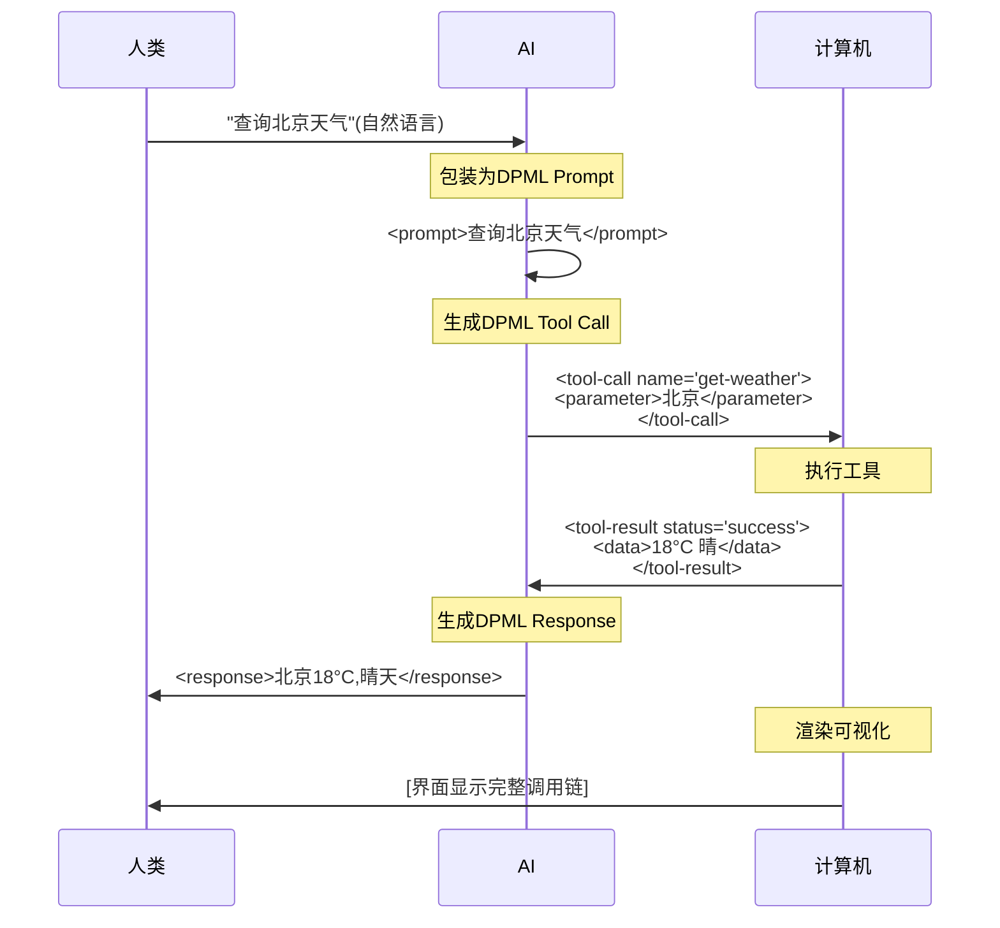

# DPML 设计白皮书

**状态**: 草稿<br>
**版本**: 1.0<br>
**作者**: 姜山 (Deepractice.ai)

---

## 摘要

AI 系统正在从单一 Prompt 演进为多 Agent 协作，但提示词工程陷入困境：配置、Prompt、文档分散在不兼容的格式中，修改时容易不同步，调试时无法观测系统状态。根本原因是传统方法将三方（人类、AI、计算机）的驱动信息强制分离，导致协同困难和维护成本高。

本白皮书提出 DPML（Deepractice Prompt Markup Language），基于一个核心洞察：现代 AI 系统的三个角色——人类(创新意图)、AI(语义转译)、计算机(精确执行)——需要不同类型的信息，但必须共享同一载体。通过证明四维语义（tag/attribute/content/structure）的必要性与充分性，DPML 采用类 XML 标签语言统一三方的驱动信号，实现配置管理、工作流编排、全程可观测的统一基础设施。

本文档包含：设计理念与理论推导(第3章)、协议设计(第4章)、应用场景(第6章)、实现指南(第7章)、生态规划(第8章)。

---

## 目录

1. [引言](#1-引言)
2. [需求分析](#2-需求分析)
3. [设计理念](#3-设计理念)
4. [技术决策](#4-技术决策)
5. [架构概览](#5-架构概览)
6. [应用场景](#6-应用场景)
7. [实现考虑](#7-实现考虑)
8. [生态规划](#8-生态规划)
9. [参考文献](#9-参考文献)
10. [附录](#10-附录)

---

## 1. 引言

### 1.1 核心问题

AI 系统的复杂度正在快速增长。从单一 Prompt 驱动到多 Agent 协作、工具调用、状态管理,提示词工程面临**信息分散**和**维护困难**的根本挑战：

- 提示词文件数千行,配置参数与指令混杂
- 多人协作时修改容易引入冲突
- 调试困难,无法定位具体问题
- 缺少模块化和复用机制

与普通文章不同,提示词需要**强逻辑**（一致性、结构性、精确性）。当提示词膨胀后,维护这种强逻辑变得极其困难：改了 A 处的角色定义,忘了 B 处有冲突的约束；工具调用逻辑、异常处理、状态管理交织在长文本中。

### 1.2 问题陈述

现代 AI 系统涉及三个核心角色,各自有不同的信息需求：

| 角色             | 需要什么         | 传统方法              | 问题                                |
| ---------------- | ---------------- | --------------------- | ----------------------------------- |
| **人类**   | 可观测的系统状态 | 文档与代码分离        | 无法观测 AI 推理过程,文档与实现脱节 |
| **AI**     | 上下文和约束     | Prompt 与配置分离     | 缺乏执行上下文,无法准确转译         |
| **计算机** | 结构化指令       | 配置文件（YAML/JSON） | AI 无法理解,人类难以审计            |

**传统方法的根本问题**：将这三种信息强制分散在不兼容的格式中。

**真实案例**：旅行规划 Agent 的配置分散在 3 个文件:

```yaml
# config.yaml
model: llm-model
temperature: 0.7
```

```markdown
# system_prompt.md
你是专业的旅行规划助手,保持准确和可靠的建议。
```

```markdown
# README.md
本Agent使用保守策略,temperature=0.5 (注: 此文档已过时)
```

当产品经理要求"让回答更有创意"，工程师修改 `config.yaml` (temperature 0.7 → 0.9)，但忘记更新 `system_prompt.md` 中的"保持准确"指令，`README.md` 文档早已过时。结果：AI 输出飘忽不定，用户投诉增加，花 3 天定位是 temperature 与 prompt 指令冲突。

**核心矛盾**：这些本质上都是 Prompt（给人类的文档、给 AI 的指令、给计算机的配置），却被迫使用不兼容的格式，导致信息无法同步、调试困难、**缺少统一的信息流转载体**。

### 1.3 DPML 的核心洞察

DPML 基于一个根本性认识：

> **现代 AI 系统需要三种类型的驱动信号（人类驱动、AI 驱动、计算机驱动）,这些信息必须统一为单一流转载体,且流转过程必须全程可观测。**

这个洞察来自对 AI 系统中三方**核心定位**的深刻理解：

- **人类：创新意图** - 唯一能主动发起实践并产生真正创新的角色
- **AI：语义转译** - 唯一能同时理解自然语言和高速处理的角色
- **计算机：精确执行** - 唯一能以超高速度和绝对精确度执行指令的角色

**详细的三方定位理论见第3.1节**。

基于这一洞察,DPML 需要解决三个层次的问题:

1. **语义表达**: 统一三方的信息载体,解决提示词膨胀
2. **结构可视化**: 让AI系统可观测、可调试,不再是黑盒
3. **计算封装**: 通过领域抽象,让人类和AI都能更高效地开发应用

**完整的设计理念和技术推导见第3章**。

### 1.4 文档范围

本白皮书阐述：

- DPML 的设计理念和第一性原理（三方定位理论）
- 技术决策的推导过程和权衡分析
- 架构设计和应用场景
- 生态规划和标准化路径

本白皮书不包含：

- 详细的语法规范（见 [DPML 协议规范 当前设计](../specs/当前设计/dpml-protocol-v1.zh-CN.md)）
- 具体的实现指南（见 DPML 实现指南）
- 领域特定的元素定义（见各领域规范）

### 1.5 术语

**DPML（Deepractice Prompt Markup Language）**
采用类 XML 标签语言的三方协同协议,用于统一计算机、AI 和人类的驱动信号。

**三方定位**
现代 AI 系统中的三个核心角色及其不可替代的职能：

- 人类：创新意图
- AI：语义转译
- 计算机：精确执行

**驱动信号**
引导并驱动系统行为的结构化信息,包括给计算机的配置、给 AI 的指令、给人类的状态展示。

**语义维度**
信息表达的独立语义空间。类 XML 标签语言具有 4 个语义维度（tag/attribute/content/structure）,而 YAML/JSON 只有 2 个（key/value）。

**强逻辑**
相对于普通文本,提示词需要更高的一致性、结构性和精确性,才能确保 AI 稳定工作。

**DOM（文档对象模型）**
标签语言的树形层级结构,天然支持可视化渲染,是 DPML 可观测性的基础。

---

## 2. 需求分析

本章基于第1章提出的**三方定位理论**和**三层递进需求**,将抽象需求具体化为可验证的功能和非功能需求。

三方的核心定位和能力分析详见第3.1节,此处直接推导需求。

### 2.1 功能需求

基于三方定位理论,DPML 的功能需求如下：

#### FR1: 统一信息载体

**需求陈述**：单一文档必须同时承载给计算机的配置、给 AI 的指令、给人类的可视化信息。

**理由**：

- 避免信息分散（配置、Prompt、文档分离）
- 确保信息同步（修改一处,三方同步感知）
- 降低维护成本（不需要在多个文件间跳转）

**验收标准**：

- 一个 `.dpml` 文件包含完整的 Agent/Task/Workflow 定义
- 修改文件后,计算机、AI、人类都能立即感知变化
- 不需要额外的同步机制

#### FR2: 职责分离

**需求陈述**：不同类型的信息必须在结构上明确分离,各自优化。

**理由**：

- 配置参数（model、temperature）应该在 AI 的自然语言空间之外
- AI 的 Prompt 内容不应该与机器参数混杂
- 人类的可视化需求不应该影响计算机的解析效率

**验收标准**：

- 配置参数在 attribute 空间（`model="llm-model"`）
- AI 指令在 content 空间（`<prompt>你是助手</prompt>`）
- 可视化结构在 DOM 层级（嵌套的 element）
- 三个空间互不干扰

#### FR3: 全程可观测

**需求陈述**：DPML 在三方之间的流转过程必须可视化、可审计。

**理由**：

- 调试时需要看到完整的调用链
- 优化时需要分析每一步的输入输出
- 审计时需要追踪决策过程

**验收标准**：

- 每一步流转都是 DPML 文档（Prompt → Tool Call → Result → Response）
- 工具能自动渲染 DPML 为可视化界面
- 支持时间序列的状态快照

#### FR4: 组件复用

**需求陈述**：支持模块化和引用机制,避免重复定义。

**理由**：

- 大型系统中,多个 Agent 共享相同的 Prompt 片段
- 工具定义应该可以跨 Agent 复用
- 角色定义应该可以组合

**验收标准**：

- 元素可以通过 `id` 标识
- 未来版本支持 `<ref id="..."/>` 引用
- 当前设计 至少建立引用的语法基础

### 2.2 非功能需求

#### NFR1: 低认知负担

**需求陈述**：AI 和人类理解 DPML 的心智成本必须最小化。

**理由**：

- AI 的注意力是稀缺资源,复杂语法会消耗 token
- 人类的学习曲线影响采用率
- 认知负担直接影响生成和维护效率

**量化指标**：

- AI 生成 DPML 的格式正确率 > 95%
- 人类阅读 DPML 的理解时间 < 阅读等量 YAML 的 50%
- 核心概念数量 ≤ 5 个

**设计策略**：

- 使用共识概念（role、agent、task）而非自造词
- 最小化协议层规则（kebab-case + 2 个保留属性）
- 利用 AI 对标签语言的原生理解能力

#### NFR2: 扩展性

**需求陈述**：协议必须支持未来的演进,且不破坏兼容性。

**理由**：

- AI 系统的需求快速变化
- 新的领域（Agent、Task、Workflow）会不断出现
- 工具生态需要稳定的基础

**设计策略**：

- 协议层只定义元语义,不定义具体元素
- 领域规范独立演进
- 保留扩展点（命名空间、版本控制预留）

#### NFR3: 工具链友好

**需求陈述**：DPML 必须易于工具处理（解析、验证、转换、可视化）。

**理由**：

- 工具生态是协议成功的关键
- 降低实现门槛才能快速推广
- IDE 集成、可视化编辑器是刚需

**设计策略**：

- 采用标签语法（可复用成熟的 XML 解析器）
- 避免自定义语法（DTD、Schema、Namespace 在 当前设计 不引入）
- DOM 结构天然支持可视化

### 2.3 需求优先级

| 需求              | 优先级 | 当前设计 状态                         |
| ----------------- | ------ | --------------------------------- |
| FR1: 统一信息载体 | P0     | 完全实现                          |
| FR2: 职责分离     | P0     | 完全实现(4维语义)                 |
| FR3: 全程可观测   | P1     | 协议支持,工具待实现               |
| FR4: 组件复用     | P2     | `id`语法就绪,引用机制待后续版本 |
| NFR1: 低认知负担  | P0     | 核心概念≤5个                     |
| NFR2: 扩展性      | P1     | 协议层/领域层分离                 |
| NFR3: 工具链友好  | P1     | 采用标签语法,可复用XML解析器      |

---

**第2章核心要点**

- **功能需求**: 统一信息载体、职责分离、全程可观测、组件复用
- **非功能需求**: 低认知负担（核心概念≤5个）、扩展性（协议/领域分离）、工具链友好
- **设计目标**: 单一文档同时服务三方，信息无损流转，降低维护成本

---

## 3. 设计理念

### 3.1 第一性原理:三方定位理论

#### 3.1.1 现代AI系统的本质结构

现代 AI 系统不是单一角色的舞台,而是**三方协同**的系统:

| 角色             | 核心能力            | 不可替代的优势                                                                                  |
| ---------------- | ------------------- | ----------------------------------------------------------------------------------------------- |
| **人类**   | 实践 + 意识 → 创新 | 唯一能主动发起实践、从经验中学习并产生真正创新的角色                                            |
| **AI**     | 模式 + 知识 → 映射 | 唯一能**同时**理解自然语言(像人类)和高速处理(像计算机)的角色,最擅长意图与指令间的双向转换 |
| **计算机** | 精确 + 速度 → 效率 | 唯一能以超高速度和绝对精确度执行确定性任务的角色                                                |

**第一性原理**:

> 信息载体必须**同时**服务三方,才能充分发挥现代AI系统的潜力。

传统系统的问题:

- **Markdown Prompt**: 只服务AI(计算机无法可靠解析)
- **JSON/YAML 配置**: 主要服务计算机(AI和人类认知负担高)
- **分离的文档**: 信息分散在配置文件、Prompt文件、文档中,无法同步

**DPML的核心洞察**:
需要一种**统一的信息载体**,让同一份文档在三方之间无损流转。

#### 3.1.2 三方的本质需求

从三方定位推导出对信息载体的需求:

**人类的需求**:

- 需要理解"这是什么概念"(概念维度)
- 需要看到可视化的层级结构(结构维度)
- 需要观测系统运行状态(可观测性)

**AI的需求**:

- 需要自然语言的表达空间(内容维度)
- 需要理解上下文和层级关系(结构维度)
- 需要低认知负担的语法(避免复杂路径)

**计算机的需求**:

- 需要结构化的配置参数(配置维度)
- 需要可解析、可验证的格式(形式化)
- 需要成熟的工具生态(实用性)

**核心矛盾**:
这些需求看似独立,甚至互相冲突。传统方案是**分离**:

- 计算机看配置文件(JSON/YAML)
- AI 看 Prompt 文件(Markdown/纯文本)
- 人类看文档(Markdown/Wiki)

**DPML的突破**:
通过**语义维度理论**,找到能**同时**满足三方需求的最小集合。

### 3.2 理论推导:四维语义的必要性

#### 3.2.1 语义维度定义

**语义维度**: 信息表达的独立语义空间,能被三方理解和使用。

不同格式具有不同的语义维度数量:

| 格式      | 维度数 | 维度构成                              | 三方协同能力           |
| --------- | ------ | ------------------------------------- | ---------------------- |
| 纯文本    | 0      | (线性文本)                            | 只服务AI               |
| YAML/JSON | 2      | key + value                           | 主要服务计算机         |
| XML       | 4      | tag + attribute + content + structure | **同时服务三方** |

#### 3.2.2 推导过程:为什么需要4个维度

**问题**: 最少需要几个语义维度才能同时服务三方?

**推导**:

**步骤1: 识别最小需求集合**

从3.1.2的需求分析中提取**不可削减**的需求:

| 需求来源 | 需求描述               | 能否共享其他维度                            |
| -------- | ---------------------- | ------------------------------------------- |
| 人类     | 需要理解"这是什么概念" | [必需] 必须独立(概念不能用配置值表达)       |
| 计算机   | 需要解析配置参数       | [必需] 必须独立(参数不能混在自然语言里)     |
| AI       | 需要自然语言表达空间   | [必需] 必须独立(自然语言不能受配置语法约束) |
| 人类     | 需要可视化层级结构     | [必需] 必须独立(层级关系是额外维度)         |

**步骤2: 映射到语义维度**

| 需求       | 对应维度            | 必要性证明                                                                      |
| ---------- | ------------------- | ------------------------------------------------------------------------------- |
| 理解概念   | **Tag**       | 必需。`<agent>` vs `llm.agent`(Tag是概念,key只是路径)                       |
| 配置参数   | **Attribute** | 必需。`model="llm-model"` vs 单独的配置节点(避免嵌套爆炸)                     |
| 自然语言   | **Content**   | 必需。`<prompt>你是助手</prompt>` vs `prompt: "你是助手"`(前者AI认知负担低) |
| 层级可视化 | **Structure** | 必需。DOM树 vs 缩进(前者天然可视化)                                             |

**步骤2.5: 维度独立性验证**

4个维度是否可以合并？

| 尝试合并 | 合并方案示例 | 核心问题 | 结论 |
|---------|------------|---------|------|
| **Tag + Attribute** | `<"agent" model="...">` | 概念与配置强制放在同一语义层级，破坏概念层次；需要额外规则区分"概念属性"和"配置属性"；违反职责分离 | 不可合并 |
| **Content + Attribute** | `<prompt content="..."/>` | 长文本在attribute中格式混乱；自然语言被当作"配置值"，需要引号转义；多段落Prompt完全不可读 | 不可合并 |
| **Structure用缩进表达** | YAML的缩进语法 | 需要"心算"层级关系，无法直接渲染DOM树；需要额外解析缩进语义；AI必须数空格确定层级 | 必须独立 |

**结论**: 4个维度相互独立，任何合并都会违反至少一方的核心需求或增加认知负担。

**步骤3: 必要性证明**

少于4维会导致什么问题?

| 缺失维度  | 后果                                                   |
| --------- | ------------------------------------------------------ |
| 无Tag     | 人类无法理解概念,计算机无法识别节点类型,AI缺少上下文   |
| 无Attribute | 配置参数混入Content,AI理解困难,计算机无法结构化解析    |
| 无Content | AI没有自然语言空间,失去灵活性,人类无法自然表达         |
| 无Structure | 人类无法可视化,计算机遍历困难,AI难以理解上下文层级关系 |

结论:4维都是必要的,缺一不可。

**步骤3.5: 充分性证明(5维假设的反证)**

**假设**: 存在第5个独立维度X

**推导**: X必须同时满足:
1. **独立性**:不能被Tag/Attribute/Content/Structure表达
2. **必要性**:至少一方(人类/AI/计算机)有不可削减的需求

**候选维度穷举分析**:

| 候选维度       | 独立性检验                                  | 结论       |
| -------------- | ------------------------------------------- | ---------- |
| **命名空间**   | 可用Attribute表达:`namespace="mcp"`        | 不独立     |
| **注释/文档**  | 可用特殊Tag表达:`<metadata>`, `<doc>`      | 不独立     |
| **样式/展示**  | 可用Attribute表达:`class="highlight"`      | 不独立     |
| **版本/状态**  | 可用Attribute表达:`version="1.0"`          | 不独立     |
| **引用/链接**  | 可用Attribute表达:`ref="agent-id"`         | 不独立     |
| **权限/安全**  | 可用Attribute表达:`access="private"`       | 不独立     |
| **事件/钩子**  | 可用特殊Tag+Content表达:`<on-error>...</>` | 不独立     |
| **变量/模板**  | 可用Content内插值或特殊Tag表达             | 不独立     |

**关键洞察**:
- 所有可能的扩展需求都能被现有4维表达
- Tag的概念化+Attribute的配置化+Content的语义化+Structure的层级化,已覆盖信息表达的所有正交维度
- 任何新增维度本质上都是这4维的组合或特化

**反证结论**: 找不到第5个独立且必要的维度。4维是充分的。

**最终结论**: **4个维度是必要且充分的最小集合**。

#### 3.2.3 实例验证:格式演进

**纯文本(0个结构化维度)**:

```
这是一个旅行规划助手,使用大模型,温度0.7
```

- [支持] AI 理解自然语言
- [不支持] 计算机无法可靠解析参数
- [不支持] 人类看到线性文本,无层级
- **结论**: 只服务AI

**YAML(2维: key + value)**:

```yaml
agent:
  llm:
    model: llm-model
    temperature: 0.7
  prompt: "你是旅行规划助手"
```

- [支持] 计算机解析键值对
- [部分] AI需要理解路径语法(`agent.llm.model`)
- [部分] 人类看到缩进,需心算层级
- [部分] 配置和内容混在value中(type维度不足)
- **结论**: 主要服务计算机,AI/人类有认知负担

**XML(4维: tag + attribute + content + structure)**:

```xml
<agent>
  <llm model="llm-model" temperature="0.7"/>
  <prompt>你是旅行规划助手</prompt>
</agent>
```

- [支持] Tag: 三方都能理解概念(`<agent>` = 代理)
- [支持] Attribute: 三方都能读取配置(`model="llm-model"`)
- [支持] Content: 三方都能访问内容(自然语言空间独立)
- [支持] Structure: 三方都能利用层级(DOM树天然可视化)
- **结论**: **每个维度都是三方共享的语义空间**

**四维语义的自然优势**:

- 不需要编译(直接就是最终形态,vs 自定义DSL)
- AI原生理解(大模型对标签语言有强理解和生成能力)
- 人类原生理解(DOM结构符合人类认知)

#### 3.2.4 维度的职责分离与信息共享

关键设计原则: **职责分离 + 信息共享**

| 维度      | 主要服务对象     | 次要服务对象                 | 职责     | 示例                     |
| --------- | ---------------- | ---------------------------- | -------- | ------------------------ |
| Tag       | 人类(理解概念)   | 计算机(节点类型)、AI(上下文) | 概念定义 | `<prompt>`, `<tool>` |
| Attribute | 计算机(解析配置) | AI(理解参数)、人类(查看值)   | 配置参数 | `model="llm-model"`    |
| Content   | AI(自然语言)     | 人类(阅读)、计算机(提取)     | 语义内容 | `你是助手`             |
| Structure | 人类(可视化)     | 计算机(遍历)、AI(层级关系)   | 层级组织 | DOM树                    |

**这不是信息隔离,而是职责优化**:

- 每个维度针对特定角色优化(主要职责)
- 但所有角色都能访问所有维度(信息共享)
- 确保既有专业分工,又有协同基础

### 3.3 价值递进:从理论到应用

基于三方定位理论和四维语义,DPML产生**三层递进的价值**:

```
第一层:语义表达层
    ↓ (基础能力)
第二层:结构可视化层
    ↓ (结构优势)
第三层:计算封装层
```

#### 3.3.1 第一层:语义表达层

**价值**: 强表达力的信息交换格式

**来源**: 直接源于四维语义理论

**能力**:

- **三方可理解**: 同一文档,人类/AI/计算机都能理解
- **职责分离**: 配置(Attribute)、内容(Content)、概念(Tag)、结构(Structure)各司其职
- **无损传递**: 信息在三方之间流转时不需要格式转换

**关键**: 三方各取所需,无需协调,信息完全共享。

**详细示例见第6章应用场景**。

#### 3.3.2 第二层:结构可视化层

**价值**: 天然的结构可视化语言

**来源**: Structure维度(DOM树)带来的结构优势

**能力**:

- **自动映射**: Element → UI组件, Attribute → 配置项, Structure → 布局层次
- **状态注入**: 运行时状态可直接注入到静态结构(`status="running" tokens-used="1520"`)
- **全程可观测**: 每一步流转都是DPML,计算机可实时渲染可视化界面

**对比传统系统**:

- **传统**: 人类 → [黑盒] → AI → [黑盒] → 计算机 → [黑盒] → 结果
- **DPML**: 人类 → DPML Prompt → AI → DPML Tool Call → 计算机 → DPML Result → AI → DPML Response → 人类

**价值**: 调试时看到完整调用链,优化时分析每步输入输出,审计时追踪决策过程。

**详细案例见第6.3可观测平台**。

#### 3.3.3 第三层:计算封装层

**价值**: 领域抽象的能力封装语言

**来源**: 语义表达 + 结构可视化 → 支撑高阶抽象

**核心洞察**:
DPML不仅是配置格式,更是**领域抽象层**。通过定义领域标签,可以:

- 将复杂的底层实现封装成简单的语义标签
- 标签结构对 AI 极度友好,理解和生成成功率远高于代码
- 声明式语义对人类更直观,降低认知负担
- 屏蔽底层细节,形成开发框架

**为什么四维语义能支撑领域封装**:

- **Tag的概念化** → 可以定义领域标签(`<mcp-server>`, `<rag-pipeline>`, `<workflow>`)
- **Attribute的配置化** → 支持声明式参数配置,无需编写初始化代码
- **Content的语义化** → 保留表达灵活性,可嵌入自然语言或代码片段
- **Structure的层级化** → 支撑复杂的组合和嵌套,构建完整的领域模型

**价值链**:

```
领域专家定义标签
    ↓
框架实现底层细节
    ↓
人类/AI 使用标签声明意图
    ↓
框架生成实现并执行
```

**本质**: DPML成为"自然语言的编译目标",就像SASS/LESS是CSS的抽象层。

**详细案例见第6.4领域框架封装**。

#### 3.3.4 三层价值的统一性

三层价值不是独立的,而是**递进统一**的:

| 层次                   | 基础      | 价值                          | 受益方                         |
| ---------------------- | --------- | ----------------------------- | ------------------------------ |
| **语义表达层**   | 四维语义  | 信息交换基础                  | 三方都受益                     |
| **结构可视化层** | DOM结构   | 可观测性保障                  | 人类主要受益,三方协同受益      |
| **计算封装层**   | 语义+结构 | 领域抽象能力,AI友好的开发范式 | 人类/AI开发者受益,生态整体受益 |

**统一的理论基础**: 三方定位理论

- 第一层:直接实现三方可理解
- 第二层:强化人类的可观测需求
- 第三层:通过标签封装,让人类和AI都能更高效地表达意图和生成实现

### 3.4 驱动机制:DPML如何工作

#### 3.4.1 驱动定义

DPML不是静态文档,而是**动态流转的驱动信号**。

**驱动**: 引导并促使系统行为发生的结构化信息。

| 被驱动方         | DPML如何驱动                   | 驱动结果                     |
| ---------------- | ------------------------------ | ---------------------------- |
| **计算机** | attribute配置、元素指令        | 执行操作、返回结果、渲染界面 |
| **AI**     | content提示词、structure上下文 | 理解意图、生成响应、调用工具 |
| **人类**   | structure可视化、metadata说明  | 观察流程、审计系统、调整意图 |

#### 3.4.2 完整驱动循环

以天气查询为例:



**核心特征**: 每一步都是DPML文档,信息无损流转,全程可观测。

#### 3.4.3 AI作为关键介质

AI在三方协同中扮演双向转译的角色:

| 方向             | 转译过程                                       | 核心价值                                       |
| ---------------- | ---------------------------------------------- | ---------------------------------------------- |
| 人类→AI→计算机   | 自然语言意图 → DPML结构化表达 → 机器可执行指令 | 降低技术门槛,用户无需学习DPML语法              |
| 计算机→AI→人类   | 结构化数据 → 自然语言解释 → 人类可理解的响应   | 改善体验,AI提供智能解释而非原始数据            |

**DPML的独特价值**: 传统Markdown Prompt缺结构(无法驱动计算机),传统JSON配置缺语义空间(AI理解困难),DPML统一两者,让信息在三方间无损流转。

---

**第3章核心要点**

- **三方定位理论**: 人类(创新意图)、AI(语义转译)、计算机(精确执行)是第一性原理
- **四维语义理论**: tag/attribute/content/structure 是必要且充分的最小集合
- **必要性**: 4个维度相互独立，任何合并都会违反至少一方的核心需求
- **充分性**: 所有可能的扩展需求都能被这4维表达
- **三层价值**: 语义表达 → 结构可视化 → 计算封装，层层递进
- **驱动机制**: 每一步都是DPML文档，信息无损流转，全程可观测

---

## 4. 技术决策

### 4.1 格式选择

#### 4.1.1 候选方案

基于三方定位理论推导的需求,评估了以下候选方案:

| 方案                    | 描述                   | 优势             | 劣势                        |
| ----------------------- | ---------------------- | ---------------- | --------------------------- |
| **自定义 DSL**    | 针对自然语言的专用语言 | 表达力强,可定制  | 门槛高,需编译,工具少        |
| **YAML**          | 数据序列化格式         | 人类可读,简洁    | 2维语义,缩进语义,AI认知负担 |
| **JSON**          | 数据交换格式           | 机器友好,通用    | 2维语义,括号噪音,无内容空间 |
| **类XML标签语言** | 标记语言               | 4维语义,成熟生态 | 冗长(相对JSON)              |

#### 4.1.2 评估标准

基于需求分析(第2章)和三方定位理论,建立评估矩阵:

**权重依据**:

- **语义维度(40%)**: 直接决定能否满足三方的差异化需求(见3.2.2四维推导)
- **AI认知负担(25%)**: AI是关键介质(见3.4.3),其效率影响整体体验
- **工具生态(20%)**: 影响实现成本和社区采纳度
- **可视化能力(10%)**: 对应人类的可观测性需求(见2.2 NFR2)
- **扩展性(5%)**: 为未来演进预留空间

**权重与三方定位的对应关系**:

| 评估标准       | 权重 | 对应的三方需求                                       |
| -------------- | ---- | ---------------------------------------------------- |
| 语义维度       | 40%  | 直接决定三方协同的可能性(见3.2:四维是必要且充分的)   |
| AI认知负担     | 25%  | AI是关键介质,效率影响整体(见3.4.3:双向转译)         |
| 工具生态       | 20%  | 影响计算机侧的实现成本和解析效率                     |
| 可视化能力     | 10%  | 对应人类的可观测性需求(NFR2)                         |
| 扩展性         | 5%   | 未来需求,当前次要                                    |

**关键洞察**: 权重分配直接反映了三方定位理论——优先保证三方能协同(语义维度40%),其次优化AI介质效率(认知负担25%),最后考虑实现便利性(生态20%+可视化10%)。

**评估矩阵**:

| 标准                 | 权重 | 自定义 DSL | YAML     | JSON     | 标签语言     |
| -------------------- | ---- | ---------- | -------- | -------- | ------------ |
| **语义维度**   | 40%  | 4+         | 2        | 2        | 4            |
| **AI认知负担** | 25%  | 高(需学习) | 高(缩进) | 中(括号) | 低(原生)     |
| **工具生态**   | 20%  | 无         | 成熟     | 成熟     | 成熟         |
| **可视化能力** | 10%  | 依赖实现   | 弱       | 弱       | 强(DOM)      |
| **扩展性**     | 5%   | 高         | 中       | 中       | 高           |
| **总分**       | -    | 65         | 50       | 55       | **95** |

#### 4.1.3 决策过程

**阶段1: 尝试自定义 DSL**

设计思路: 类似 SASS/LESS 之于 CSS,为自然语言提供结构化和逻辑化能力。

**失败原因**:

- 门槛高: 用户和 AI 都需要学习新语法
- 工具依赖: 需要"编译"成最终 Prompt
- 缺少可视化: 人类难以直接理解

**关键教训**: 不要重新发明轮子,应利用现有成熟格式。

**阶段2: 评估 YAML/JSON**

**YAML 的问题**:

```yaml
agent:
  llm:
    model: llm-model     # AI需要理解 agent.llm.model 路径
    temperature: 0.7
  prompt: |          # 缩进是语义的,AI认知负担
    你是助手
```

- 缩进承载语义(AI 必须数空格)
- 所有信息在同一平面(配置+指令混杂)
- 没有独立的"内容空间"(prompt 只是另一个键值对)

**JSON 的问题**:

```json
{
  "agent": {
    "llm": {"model": "llm-model"},  // 括号噪音
    "prompt": "你是助手"         // 无内容空间,只是字符串值
  }
}
```

- 与 YAML 类似的2维问题
- 括号和引号增加 AI 认知负担
- 扁平层级,难以可视化

**核心发现**: 2维语义(键值对)无法满足三方的差异化需求。

**阶段3: 采用类 XML 标签语言**

**四维语义的标签语言**:

```xml
<agent>
  <!-- Tag: 概念定义 -->
  <llm model="llm-model" temperature="0.7"/>  <!-- Attribute: 配置 -->
  <prompt>你是助手</prompt>               <!-- Content: 内容 -->
</agent>                                   <!-- Structure: 层级 -->
```

**关键优势**:

1. **4个独立语义维度**: 完美映射到三方需求
2. **AI 原生理解**: 大模型 对标签语言有强大的理解和生成能力
3. **可复用成熟生态**: 可借鉴 XML 解析器和工具链
4. **DOM 可视化**: 树形结构天然可视化
5. **不需要编译**: 直接就是最终形态
6. **独立演进**: 不受 XML 规范约束,可根据 AI 场景优化

#### 4.1.4 格式选择的理论验证

**结论**: 基于3.2.2的四维推导,只有具备四维语义的标签语言能同时满足三方需求。

**验证**: 各格式对四维语义的支持情况直接决定了其适用性(见上表"语义维度"一栏)。

### 4.2 权衡分析

#### 4.2.1 冗长性 vs 表达力

**批评**: 标签语言比 JSON 冗长。

**回应**: 冗长是为了语义清晰。

**对比**:

```json
// JSON: 简洁但语义模糊
{"agent": {"llm": {"model": "llm-model"}, "prompt": "你是助手"}}
```

```xml
<!-- 标签语言: 冗长但语义清晰 -->
<agent>
  <llm model="llm-model"/>
  <prompt>你是助手</prompt>
</agent>
```

**分析**:

- JSON 节省了10个字符
- 但失去了:
  - 概念的视觉边界(`<prompt>` vs `"prompt":`)
  - 层级的清晰表达(闭合标签 vs 括号)
  - AI 的理解效率(tag 比 key 更语义化)

**权衡结果**: 为了三方协同,接受适度冗长。

#### 4.2.2 学习曲线 vs 长期收益

**批评**: 标签语言学习曲线陡峭。

**回应**: AI 作为介质,降低了学习门槛。

**传统场景**(人类手写标签语言):

- 需要学习 tag、attribute、entity、namespace...
- 学习成本高 [不支持]

**DPML 场景**(AI 生成标签语言):

- 人类: 用自然语言表达意图
- AI: 自动生成格式正确的 DPML
- 人类: 通过可视化界面理解和修改
- 学习成本低 [支持]

**权衡结果**: 通过 AI 介质,将学习负担转移给 AI。

#### 4.2.3 当前需求 vs 未来扩展

**设计哲学**: 为当前设计,为未来预留。

**当前设计 策略**:

- 实现核心4维语义
- 定义保留属性(`type`、`id`)
- 建立协议层/领域层分离
- [部分实现] `id` 语法就绪,但引用机制留待后续版本
- 命名空间、版本控制等高级特性预留

**权衡结果**: 当前设计 保持简洁(核心概念≤5个),为未来扩展留白。

**小节总结**:

通过三个维度的权衡分析,DPML的技术选择遵循一致的原则:

- **优先三方协同**(接受冗长,换取语义清晰)
- **利用AI能力**(降低学习门槛,转移认知负担)
- **简洁但可扩展**(当前设计核心功能完备,为未来预留空间)

这些权衡决策直接反映了三方定位理论的指导作用。

### 4.3 设计原则

#### 4.3.1 约而不束

**定义**: 提供结构和约定(约),但不限制 AI 的逻辑灵活性(不束)。

**我们约束的内容**:

- 语法: kebab-case 命名、标签语言的基本规范
- 结构: 保留属性(`type`、`id`)
- 概念: 使用共识术语(role、agent、task)

**我们不束缚的内容**:

- 逻辑: 不在 content 中定义 if-else 控制流
- 表达: content 中的自然语言完全自由
- 行为: 原则优于规则,意图优于过程

**示例**:

```xml
<!-- [INVALID] 错误: 束缚逻辑 -->
<rules>
  <if condition="user_angry">
    <response>道歉</response>
  </if>
  <if condition="user_confused">
    <response>解释</response>
  </if>
</rules>

<!-- [VALID] 正确: 约束结构,不束缚逻辑 -->
<personality>
我是一个有同理心的助手。当用户不高兴时,我首先关注他们的情绪。
当用户困惑时,我会耐心解释。我始终保持专业和友好。
</personality>
```

**核心洞察**: 结构化(XML)不意味着必须结构化逻辑。DPML 提供结构载体,但允许 AI 在 content 中自由表达。

#### 4.3.2 共识概念优先

**定义**: 使用广泛共识的术语,而非自造概念。

**信息论基础**:

共识概念是**压缩的知识**:

```
概念 "role" 的信息
├─ 显式: 4个字母 "r-o-l-e"
└─ 隐式(免费):
   ├─ 职责框架
   ├─ 能力边界
   ├─ 行为模式
   └─ 社会关系
总信息熵: 极低(概念即定义)
```

自造词汇是**高熵**:

```
概念 "lero" 的信息
├─ 显式: 4个字母 "l-e-r-o"
└─ 隐式: 无
└─ 需要额外解释: 50-100词
总信息熵: 极高
```

**Token 经济学**:

| 方案               | Token 成本   | AI 理解    |
| ------------------ | ------------ | ---------- |
| 共识概念(`role`) | ~10 tokens   | 即时、准确 |
| 自造词汇(`lero`) | ~100+ tokens | 需要推理   |

**选择标准**:

1. **共时性**: 当前时代广泛使用
2. **精准性**: 概念边界清晰
3. **语义性**: 自带丰富含义
4. **内涵性**: 承载理论基础

**示例**:

- 好: role、agent、personality、task、principle
- [不支持] 差: lero、xuanwu(文化特定)、thing(过于泛化)

#### 4.3.3 双重语义

**定义**: 每个语法元素同时服务机器语义和 AI 语义。

**四维度的语义平衡**:

| 维度      | 机器语义          | AI 语义         |
| --------- | ----------------- | --------------- |
| Tag       | 节点类型,遍历起点 | 概念定义,上下文 |
| Attribute | 键值对数据        | 可理解的配置    |
| Content   | 文本数据          | 自然语言,主场   |
| Structure | DOM 树路径        | 上下文层级关系  |

**理论关联**: 这正是3.2.4"职责分离与信息共享"的具体体现——每个维度针对特定角色优化(主要职责),但所有角色都能访问所有维度(信息共享)。

**核心洞察**: 不是"机器OR AI",而是"机器AND AI"——每个元素都被两者理解,但侧重不同。

---

## 5. 架构概览

### 5.1 分层架构

DPML 采用**协议层/领域层**分离的架构:

```
┌─────────────────────────────────────────────┐
│           DPML 协议层(本白皮书)              │
│  • 元语义: tag/attribute/content/structure  │
│  • 保留属性: type、id                       │
│  • 命名约定: kebab-case                     │
│  • 验证规则: 标签语言格式正确性                 │
└─────────────────────────────────────────────┘
                    ▼
┌─────────────────────────────────────────────┐
│           领域规范(独立文档)                 │
│  • Agent 领域: 对话式 AI 配置               │
│  • Task 领域: 状态机任务编排                │
│  • Role 领域: AI 人格定义                   │
│  • Workflow 领域: 工作流编排                │
└─────────────────────────────────────────────┘
                    ▼
┌─────────────────────────────────────────────┐
│           工具层(社区实现)                   │
│  • 解析器/生成器                            │
│  • IDE 集成(VSCode/Cursor)                 │
│  • 可视化编辑器                             │
│  • 验证器/Linter                            │
└─────────────────────────────────────────────┘
```

### 5.2 协议层职责

**设计理念**: 协议层遵循"约而不束"原则(见4.3.1),只定义通用规则,不限制领域创新。

**协议层定义**:

- 如何定义概念(语法、结构)
- 元语义(tag/attribute/content 的一般含义)
- 保留属性(`type`、`id`)
- 验证规则(标签语言格式正确性)

**协议层不定义**:

- 存在哪些概念(如 `<agent>` 的具体含义)
- 领域特定元素和属性
- 业务逻辑和运行时行为

**理论基础**: 这种分层对应3.3"价值递进"中的不同层次——协议层保障语义表达层的基础能力,领域层实现计算封装层的高阶抽象。

**如何服务三方定位**:

协议层通过"约而不束"原则(见4.3.1)同时服务三方:

| 角色     | 协议层如何服务                                           | 核心价值                       |
| -------- | -------------------------------------------------------- | ------------------------------ |
| 人类     | 定义统一的概念表达方式(tag、attribute),降低学习成本      | 理解概念边界,可视化系统结构    |
| AI       | 规定简单一致的语法规则(kebab-case),降低理解负担          | 快速理解和生成,认知负担最小化  |
| 计算机   | 只验证格式,不约束业务逻辑,保持灵活性                     | 高效解析,复用成熟工具链        |

**设计权衡**: "约而不束"原则的具体体现——约束格式保证三方能理解(协议层),不束缚语义保证领域可创新(领域层)。

### 5.3 领域层职责

**领域层定义**:

- 具体元素名称(如 `<agent>`、`<task>`)
- 元素的语义和要求
- 允许的属性和子元素
- 领域特定验证规则

**示例: Agent 领域**

```xml
<!-- Agent 领域定义了这些元素 -->
<agent>
  <llm model="..." api-key="..."/>  <!-- llm 元素 -->
  <prompt>...</prompt>               <!-- prompt 元素 -->
  <tools>...</tools>                 <!-- tools 元素 -->
</agent>
```

**示例: Task 领域**

```xml
<!-- Task 领域定义了这些元素 -->
<task id="...">
  <state>...</state>    <!-- state 元素 -->
  <action>...</action>  <!-- action 元素 -->
  <next>...</next>      <!-- next 元素 -->
</task>
```

**领域层设计原则**:

领域层在协议层基础上构建高阶抽象,需遵循以下原则:

1. **语义清晰性**
   - 元素名必须自解释(如`<prompt>`而非`<p>`)
   - 使用领域共识术语(见4.3.2"共识概念优先")
   - 避免自造词汇,降低认知负担

2. **职责单一性**
   - 每个元素只负责一个明确的概念
   - 复杂功能通过组合而非单一元素承载
   - 示例:`<agent>`组合`<llm>`+`<prompt>`+`<tools>`,而非全部塞在一个元素

3. **扩展友好性**
   - 新增元素不破坏已有元素的语义
   - 通过子元素扩展功能,而非修改已有元素
   - 保持向后兼容(旧文档在新版本中仍可解析)

4. **三方协同优化**
   - 元素设计必须同时考虑人类可读、AI可理解、计算机可解析
   - 避免仅优化单方的设计(如仅为计算机优化而牺牲可读性)
   - 示例:`<llm model="..." />`的attribute设计同时满足三方需求

### 5.4 扩展机制

**当前扩展策略**:

- 领域可自定义元素和属性(遵守 kebab-case)
- 协议层只验证格式正确性
- 领域层负责语义验证

**扩展预留**:

- 命名空间(避免元素名冲突)
- 版本控制(`dpml-version` 属性)
- 插件系统(自定义验证器)

**扩展机制的理论依据**:

DPML的扩展能力源于协议层/领域层分离架构,这种分离体现了关注点分离原则:

| 层次   | 关注点           | 稳定性 | 扩展方式                   |
| ------ | ---------------- | ------ | -------------------------- |
| 协议层 | 如何表达         | 高稳定 | 很少变化,只增不改          |
| 领域层 | 表达什么         | 可演进 | 新增领域,独立版本          |
| 工具层 | 如何处理         | 活跃   | 社区贡献,快速迭代          |

**为什么这种分层能支撑长期演进**:

1. **协议层的稳定性保障**
   - 四维语义已被证明是必要且充分的(见3.2.2),无需修改
   - 保留属性(`type`、`id`)为未来功能预留接口
   - 命名约定(kebab-case)简单明确,无歧义

2. **领域层的创新空间**
   - 任何领域都可基于四维语义定义新元素
   - 领域间相互独立,不会冲突
   - 社区可贡献领域规范,无需修改协议层

3. **工具层的实现灵活性**
   - 工具只需实现协议层解析(复用XML解析器)
   - 领域验证可选择性实现
   - 可视化、IDE集成等工具独立演进

**实践策略**: 当前设计保持简洁(核心概念≤5个,见4.2.3),为未来扩展预留白,避免过度设计。

---

## 6. 应用场景

### 6.1 场景1: Agent 配置管理

#### 问题描述

某团队维护 10+ 个 AI Agent,每个 Agent 的配置分散在多个文件:

```
agent-travel/
├── config.yaml          # model、temperature
├── system_prompt.md     # AI 角色定义
├── tools.json           # 工具列表
└── README.md           # 文档
```

**痛点**:

- 修改一个 Agent 需要编辑 4 个文件
- Prompt 与配置容易不同步
- 团队协作时冲突频发
- 无法观测 Agent 的运行状态

#### DPML 解决方案

**统一配置文件**: `agent-travel.dpml`

```xml
<agent id="travel-planner">
  <metadata purpose="旅行规划助手" version="2.1.0"/>

  <llm model="llm-model" temperature="0.7"/>

  <prompt type="markdown">
你是专业的旅游规划专家,提供景点推荐、行程规划、住宿建议和预算估算。
优先考虑游客预算和时间,推荐当地特色,避免陷阱。
  </prompt>

  <tools>
    <tool name="search-attractions" endpoint="/api/attractions"/>
    <tool name="get-weather" endpoint="/api/weather"/>
    <tool name="calculate-cost" endpoint="/api/cost"/>
  </tools>
</agent>
```

#### 效果对比

| 维度               | 传统方案         | DPML 方案          |
| ------------------ | ---------------- | ------------------ |
| **文件数量** | 4个文件          | 1个文件            |
| **修改效率** | 需要编辑多个文件 | 修改单一来源       |
| **同步问题** | 容易不一致       | 自动同步           |
| **可视化**   | 需要人工整理     | 自动渲染UI         |
| **版本控制** | Git冲突频繁      | 单文件,冲突少      |
| **可观测性** | 无               | 支持运行时状态注入 |

### 6.2 场景2: 工作流编排

#### 问题描述

需要构建一个客户服务工作流:

1. 用户提问
2. 意图识别(分类 Agent)
3. 路由到专业 Agent(技术支持/账单查询/投诉处理)
4. 返回结果

**传统方案问题**:

- 工作流定义在代码中(不可视)
- Agent 配置分散
- 调试困难(看不到流转过程)

#### DPML 解决方案

```xml
<workflow id="customer-service">
  <metadata purpose="客户服务工作流"/>

  <step id="intent-recognition">
    <agent>
      <llm model="llm-model"/>
      <prompt>识别用户问题类型:技术支持/账单/投诉</prompt>
    </agent>
    <output>intent</output>
  </step>

  <router input="intent">
    <route condition="technical" next="technical-support"/>
    <route condition="billing" next="billing-agent"/>
    <route condition="complaint" next="complaint-handler"/>
  </router>

  <step id="technical-support">
    <agent>
      <prompt>技术支持专家</prompt>
      <tools>
        <tool name="search-kb"/>
        <tool name="create-ticket"/>
      </tools>
    </agent>
  </step>

  <step id="billing-agent">
    <agent>
      <prompt>账单专家</prompt>
      <tools><tool name="query-billing"/></tools>
    </agent>
  </step>

  <step id="complaint-handler">
    <agent>
      <prompt>投诉处理专家</prompt>
      <tools><tool name="escalate"/></tools>
    </agent>
  </step>
</workflow>
```

#### 价值

1. **可视化**: 工作流结构一目了然
2. **统一配置**: 所有 Agent 在一个文件中
3. **可观测**: 运行时可以看到每一步的状态
4. **易于修改**: 调整路由逻辑无需改代码

### 6.3 场景3: 可观测平台集成

#### 问题描述

需要构建 AI 系统的可观测平台:

- 实时监控 Agent 状态
- 追踪每次对话的完整调用链
- 分析性能瓶颈

**传统方案问题**:

- 日志格式不统一(JSON、纯文本混杂)
- 无法还原完整上下文
- 可视化需要自定义解析

#### DPML 解决方案

**运行时 DPML 日志**:

```xml
<conversation id="conv-12345">
  <user-message>帮我查询北京天气</user-message>

  <agent-processing agent-id="weather-assistant" duration="120ms">
    <llm-call tokens-in="15" tokens-out="45" latency="100ms"/>

    <tool-call name="get-weather">
      <parameter name="city">北京</parameter>
    </tool-call>

    <tool-result name="get-weather" status="success">
      <data>{"city": "北京", "temp": 18, "condition": "晴"}</data>
    </tool-result>

    <llm-call tokens-in="60" tokens-out="25" latency="80ms"/>
  </agent-processing>

  <assistant-message>今天北京天气晴朗,温度18°C。</assistant-message>
</conversation>
```

**可视化效果**:

```
Timeline View:
━━━━━━━━━━━━━━━━━━━━━━━━━━━━━━━━━━━━━
14:30:00.000  User: 帮我查询北京天气
14:30:00.100  ├─ LLM Call (100ms, 15→45 tokens)
14:30:00.100  ├─ Tool: get-weather(北京)
14:30:00.180  │  └─ Result: 18°C 晴 (80ms)
14:30:00.180  ├─ LLM Call (80ms, 60→25 tokens)
14:30:00.300  └─ Response: 今天北京18°C...

Total: 300ms | Tokens: 75 in, 70 out
```

**核心价值**:

- 统一的日志格式(全部是 DPML)
- 自动可视化(DOM 树自动渲染)
- 完整上下文(所有信息在一个文档)
- 易于分析(标准 XML 工具即可处理)

### 6.4 场景4: 领域框架封装

**核心价值**: DPML 的计算封装能力(见3.3.3)支持构建领域开发框架,将底层复杂性封装为声明式配置。

#### 典型应用

**Agent 开发框架**: 通过 DPML 声明 Agent 配置,框架自动生成MCP服务代码、处理消息循环、注册工具,开发者无需理解底层协议细节。

**工具开发框架**: 定义工具的参数、实现逻辑,框架自动处理验证、错误处理、文档生成。

**RAG 系统框架**: 声明式配置文档索引、检索策略、生成参数,框架编排完整的RAG流程。

#### 关键优势

| 维度         | 传统开发          | DPML 框架         |
| ------------ | ----------------- | ----------------- |
| **学习曲线** | 需理解底层协议    | 只需理解领域概念  |
| **开发效率** | 编写完整代码      | 声明式配置        |
| **AI 协作**  | AI难以生成底层代码 | AI擅长生成标签语言 |
| **可维护性** | 修改代码重新部署  | 修改配置即可      |

**设计原理详见**: 第3章3.3.3节"计算封装层"提供了完整的理论论证和设计原理。

---

## 7. 实现原则

### 7.1 解析和验证

**解析策略**: DPML 采用类 XML 标签语法,可复用成熟的 XML 解析器生态。实现时应:

- 禁用 DTD 和外部实体(安全考虑)
- 限制文档大小(防止滥用)
- 支持增量解析(性能优化)

**验证层次**: 采用协议层/领域层两层验证架构:

1. **协议层验证**: 格式正确性、命名规范、保留属性
2. **领域层验证**: 领域特定的元素、属性和业务规则

**设计考虑**: 验证应该提供清晰的错误信息,指出具体位置和问题原因,降低调试难度。

### 7.2 性能原则

**一般性能**: 对于典型应用场景,DPML 文档解析和验证的性能开销可忽略不计。

**优化方向**:
- 缓存机制(解析结果、验证结果)
- 流式处理(大文档场景)
- 索引支持(加速元素查找)

### 7.3 安全原则

**代码注入防护**: 对包含可执行内容的元素(如脚本),应:
- 使用沙箱隔离执行环境
- 执行前进行静态分析
- 要求明确的用户授权

**敏感信息保护**:
- 禁止硬编码密钥等敏感信息
- 支持环境变量引用
- 支持密钥管理服务集成

**格式安全**: 禁用 DTD、外部实体等可能引发安全问题的特性。

---

## 8. 生态规划

### 8.1 工具链规划

#### 8.1.1 核心工具

**DPML 解析器**

- 多语言支持: JavaScript、Python、Java
- 功能: 解析、验证、序列化
- 目标: 提供官方参考实现

**IDE 集成**

- 语法高亮
- 智能补全(元素、属性)
- 实时验证
- 目标: VSCode、JetBrains 等主流 IDE

**可视化编辑器**

- 图形化配置界面
- 实时预览
- 双向编辑(图形 ↔ 文本)

#### 8.1.2 社区工具

**CLI 工具**

- 验证 DPML 文件
- 格式化
- 格式转换(YAML/JSON → DPML)

**浏览器插件**

- 渲染 `.dpml` 文件
- 类似 JSON Viewer 体验

**Linter**

- 最佳实践检查
- 安全扫描
- 性能建议

### 8.2 领域规范体系

#### 8.2.1 核心领域

| 领域         | 用途                 | 核心元素示例                                              |
| ------------ | -------------------- | --------------------------------------------------------- |
| **Agent**    | 对话式 AI 配置       | `<agent>`, `<llm>`, `<prompt>`, `<tools>`                 |
| **Task**     | 状态机任务编排       | `<task>`, `<state>`, `<action>`, `<transition>`           |
| **Workflow** | 工作流编排           | `<workflow>`, `<step>`, `<router>`, `<parallel>`          |
| **Role**     | AI 人格定义          | `<role>`, `<personality>`, `<principles>`, `<capabilities>` |
| **MCP**      | MCP 服务开发         | `<mcp-server>`, `<mcp-tool>`, `<mcp-resource>`            |
| **RAG**      | 检索增强生成         | `<rag-pipeline>`, `<indexing>`, `<retrieval>`, `<generation>` |

#### 8.2.2 社区贡献

**鼓励社区定义新领域**:

- 遵守 DPML 协议规范
- 提交领域规范文档
- 提供参考实现

**示例: 自定义领域**

```xml
<!-- Game 领域(社区贡献) -->
<game id="rpg-quest">
  <character>
    <llm model="llm-model"/>
    <personality>勇敢的骑士</personality>
  </character>
  <world>
    <location>魔法森林</location>
    <npc>智慧老人</npc>
  </world>
</game>
```

### 8.3 标准化愿景

#### 8.3.1 发展路径

**社区驱动阶段**

- 发布设计白皮书和协议规范
- 开源参考实现
- 收集社区反馈并迭代优化
- 建立领域规范库

**行业推广阶段**

- 与主流 AI 平台合作
- 与开发工具厂商集成
- 编写最佳实践文档和案例库
- 培育生态合作伙伴

**标准化阶段**

- 向标准化组织提交技术报告(IETF、W3C)
- 建立标准化工作组
- 推动行业采纳

#### 8.3.2 合作方向

**AI 平台**: 统一配置格式,降低迁移成本

**开发工具**: IDE 集成,提升开发体验

**云服务**: 原生支持,简化部署和运维

**核心价值**: 成为 AI 系统配置的通用语言,就像 HTML 之于 Web、JSON 之于数据交换

---

## 9. 参考文献

### 9.1 规范性引用

- **[XML]** Extensible Markup Language (XML) 1.0 (Fifth Edition), W3C Recommendation, November 2008.
  https://www.w3.org/TR/xml/
- **[RFC2119]** Bradner, S., "Key words for use in RFCs to Indicate Requirement Levels", BCP 14, RFC 2119, March 1997.
  https://www.rfc-editor.org/rfc/rfc2119

### 9.2 信息性引用

- **[RFC7322]** Flanagan, H. and S. Ginoza, "RFC Style Guide", RFC 7322, September 2014.
- **[HTML5]** HTML5 Specification, W3C Recommendation.
  https://www.w3.org/TR/html5/
- **[BITCOIN]** Nakamoto, S., "Bitcoin: A Peer-to-Peer Electronic Cash System", 2008.
  https://bitcoin.org/bitcoin.pdf
  (参考其白皮书的简洁性和论证方式)

---

## 10. 附录

### 附录 A: 完整示例

**示例1: 最小 Agent**

```xml
<agent>
  <llm model="llm-model" api-key="${OPENAI_API_KEY}"/>
  <prompt>你是一个有用的助手</prompt>
</agent>
```

**示例2: 复杂 Agent**

```xml
<?xml version="1.0" encoding="UTF-8"?>
<agent id="travel-planner">
  <metadata
    purpose="张家界旅行规划"
    version="2.1.0"
    created="2025-09-01"
  />

  <llm
    model="llm-model"
    temperature="0.7"
    max-tokens="2000"
  />

  <prompt type="markdown">
# 角色
你是专业的张家界旅游规划专家

## 技能
- 推荐景点
- 规划行程
- 建议住宿
- 预算估算
  </prompt>

  <tools>
    <tool name="search" endpoint="/api/search"/>
    <tool name="weather" endpoint="/api/weather"/>
    <tool name="cost" endpoint="/api/cost"/>
  </tools>

  <config type="json">
  {
    "retry": 3,
    "timeout": 30000
  }
  </config>
</agent>
```

**示例3: 工作流**

```xml
<workflow id="customer-service">
  <step id="intent">
    <agent>
      <llm model="llm-model"/>
      <prompt>识别用户意图</prompt>
    </agent>
  </step>

  <router input="intent">
    <route condition="technical" next="tech-support"/>
    <route condition="billing" next="billing"/>
  </router>

  <step id="tech-support">
    <agent>
      <llm model="llm-model"/>
      <prompt>技术支持专家</prompt>
    </agent>
  </step>
</workflow>
```

### 附录 B: 术语表

**Agent**: AI 代理,执行特定任务的 AI 系统。

**类XML标签语言**: DPML采用的格式,具有4个语义维度(tag/attribute/content/structure)。使用规范:首次使用完整名称"类XML标签语言",后续可简称"标签语言";避免单独使用"XML"(容易与XML规范混淆)。

**协议层**: DPML架构的底层,定义元语义、保留属性、命名约定和验证规则,不定义具体元素。

**DOM**: Document Object Model,文档对象模型,标签语言的树形层级结构。

**DPML**: Deepractice Prompt Markup Language,本协议的全称。

**驱动信号**: 引导并促使系统行为发生的结构化信息。

**领域层**: DPML架构的上层,定义具体元素(如`<agent>`)及其语义,独立于协议层演进。

**三方定位理论**: 现代AI系统中三个核心角色的不可替代定位——人类(创新意图)、AI(语义转译)、计算机(精确执行)。简称"三方定位"。

**语义维度**: 信息表达的独立语义空间。类XML标签语言有4个维度(tag/attribute/content/structure),YAML/JSON只有2个(key/value)。

**强逻辑**: 相对于普通文本,提示词需要更高的一致性、结构性和精确性,才能确保AI稳定工作。

### 附录 C: 致谢

感谢所有为 DPML 设计提供反馈和建议的贡献者。

---

## 作者地址

**姜山 (Sean Jiang)**<br>
Deepractice.ai<br>
邮箱: sean@deepractice.ai<br>
网站: https://deepractice.ai

---

**DPML 设计白皮书**

**文档状态**: 设计草稿,征求社区反馈

**反馈渠道**: 欢迎通过 GitHub Issues 或邮件提供建议
